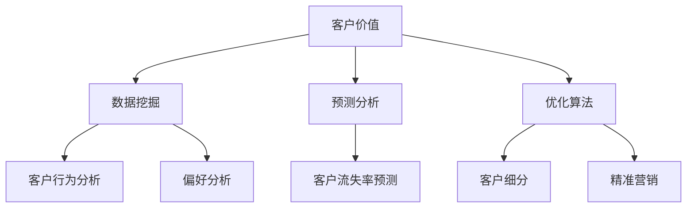

                 

### 《数学与客户关系管理：客户价值的数学分析》

#### 关键词：客户关系管理、客户价值、数学分析、算法、项目实战

#### 摘要：
本文旨在探讨数学分析在客户关系管理（CRM）中的应用，特别是客户价值的数学分析。通过深入剖析核心概念、算法原理、数学模型和实际项目，文章揭示了如何利用数学工具提升CRM的效果。本文将为读者提供一个全面的视角，了解数学分析方法在CRM领域的应用现状和未来趋势。

### 引言

客户关系管理（Customer Relationship Management，简称CRM）是企业为了提高客户满意度、促进客户保留和增加客户价值而采取的一系列策略和行动。随着大数据、人工智能等技术的迅猛发展，CRM的重要性日益凸显。然而，如何准确评估和提升客户价值，仍是企业面临的重大挑战。

数学分析作为一种强大的工具，可以在CRM中发挥关键作用。通过数学模型和算法，我们可以定量地分析客户行为，预测客户需求，优化客户体验，进而提升客户价值。本文将围绕这一主题，系统地介绍客户价值的数学分析，探讨其在CRM中的应用。

### 核心概念与联系

在客户关系管理中，客户价值（Customer Value）是一个核心概念。客户价值不仅包括客户为企业带来的直接收益，还涵盖了客户的满意度、忠诚度等无形资产。

#### 2.1 客户价值

**2.1.1 客户价值的定义**

客户价值是指客户对企业整体贡献的价值，包括显性价值（如销售额、利润）和隐性价值（如口碑、品牌影响力）。

**2.1.2 客户价值的度量**

客户价值的度量可以通过多种方法进行，如生命周期价值（Customer Lifetime Value，简称CLV）、客户忠诚度等。其中，CLV是最常用的度量方法之一，它反映了客户在未来为企业带来的潜在收益。

**2.1.3 客户价值与客户关系管理**

客户价值是客户关系管理的核心目标。提升客户价值意味着企业需要通过优化客户体验、提高客户满意度、增强客户忠诚度等方式，实现客户价值的最大化。

#### 2.2 数学分析方法

数学分析方法在CRM中的应用主要包括数据挖掘、预测分析、优化算法等。以下是几种常用的数学分析方法：

**2.2.1 数据挖掘**

数据挖掘是从大量客户数据中提取有价值信息的过程，包括客户行为分析、偏好分析等。通过数据挖掘，企业可以更好地理解客户需求，制定更有效的营销策略。

**2.2.2 预测分析**

预测分析是利用历史数据预测未来客户行为和需求的方法。例如，通过预测客户流失率，企业可以采取针对性的保留措施，降低客户流失率。

**2.2.3 优化算法**

优化算法是通过数学建模和算法优化，寻求最优解的过程。例如，在客户细分中，优化算法可以帮助企业找到最有价值的客户群体，实施精准营销。

#### 2.3 Mermaid流程图：核心概念与联系



### 核心算法原理讲解

在客户关系管理中，核心算法原理的掌握至关重要。以下将详细介绍两种关键算法：客户价值评估算法和客户细分算法。

#### 3.1 客户价值评估算法

**3.1.1 客户价值评估算法概述**

客户价值评估算法是一种用于计算客户对企业贡献价值的算法。常见的客户价值评估算法包括生命周期价值（CLV）和客户终身收益（CLTV）等。

**3.1.2 伪代码介绍**

```pseudo
function calculateCLV(client):
    revenue = get_client_revenue(client)
    cost = get_client_cost(client)
    retention_rate = get_client_retention_rate(client)
    life_time = get_client_life_time(client)
    CLV = (revenue - cost) * (1 - retention_rate) / (1 - (1 + retention_rate)^(-life_time))
    return CLV
```

**3.1.3 具体例子说明**

假设有一个客户，他在过去一年内为企业带来了10000元的收入，成本为5000元，客户保留率为80%，生命周期为3年。使用客户价值评估算法，我们可以计算出该客户的CLV：

```pseudo
CLV = (10000 - 5000) * (1 - 0.8) / (1 - (1 + 0.8)^(-3))
CLV ≈ 2222.22
```

#### 3.2 客户细分算法

**3.2.1 客户细分算法概述**

客户细分算法是一种将客户划分为不同群体的算法。通过客户细分，企业可以针对不同客户群体制定个性化的营销策略。

**3.2.2 伪代码介绍**

```pseudo
function segmentClients(clientData):
    segments = []
    for client in clientData:
        segment = determineSegment(client)
        segments.append(segment)
    return segments

function determineSegment(client):
    if client.revenue > thresholdHigh:
        return "High Value"
    elif client.revenue > thresholdMedium:
        return "Medium Value"
    else:
        return "Low Value"
```

**3.2.3 具体例子说明**

假设我们有一组客户数据，其中客户的收入情况如下表所示：

| 客户ID | 收入（元） |
| ------ | -------- |
| 1      | 15000    |
| 2      | 8000     |
| 3      | 3000     |

设定收入阈值为：高价值客户 > 10000元，中等价值客户 > 5000元。使用客户细分算法，我们可以将这组客户划分为以下三个群体：

| 客户ID | 收入（元） | 客户群体 |
| ------ | -------- | -------- |
| 1      | 15000    | 高价值   |
| 2      | 8000     | 中等价值 |
| 3      | 3000     | 低价值   |

### 数学模型和数学公式讲解

在客户价值分析中，数学模型和公式扮演着关键角色。以下将介绍几种常用的数学模型和公式，并使用latex格式进行展示。

#### 4.1 客户价值函数

客户价值函数用于计算客户的整体价值。以下是一个简单的客户价值函数：

$$
CV = f(R, C, R^*, C^*)
$$

其中，$R$ 表示客户的收入，$C$ 表示客户成本，$R^*$ 表示客户保留率，$C^*$ 表示客户生命周期。

#### 4.2 客户保留模型

客户保留模型用于预测客户的保留率。以下是一个简单的一阶逻辑回归模型：

$$
R^* = \frac{1}{1 + e^{-(\beta_0 + \beta_1R + \beta_2C)}
$$

其中，$\beta_0$、$\beta_1$ 和 $\beta_2$ 是模型参数。

#### 4.3 客户流失预测模型

客户流失预测模型用于预测客户的流失率。以下是一个简单的一阶逻辑回归模型：

$$
L^* = \frac{1}{1 + e^{-(\alpha_0 + \alpha_1R + \alpha_2C)}
$$

其中，$\alpha_0$、$\alpha_1$ 和 $\alpha_2$ 是模型参数。

### 项目实战

#### 5.1 项目背景与目标

本项目旨在利用数学分析方法和算法，提升企业客户关系管理的效率。项目目标包括：

1. 建立客户价值评估模型，准确计算客户价值。
2. 基于客户价值评估结果，实施精准营销策略。
3. 通过客户细分算法，优化客户群体管理。

#### 5.2 开发环境搭建

为了实现项目目标，我们搭建了以下开发环境：

1. 数据库：MySQL
2. 编程语言：Python
3. 数据分析库：Pandas、NumPy
4. 机器学习库：scikit-learn、TensorFlow

#### 5.3 源代码实现与解读

以下是一个简单的客户价值评估模型实现：

```python
import pandas as pd
import numpy as np
from sklearn.linear_model import LinearRegression

# 读取客户数据
data = pd.read_csv('client_data.csv')

# 分离特征和目标变量
X = data[['revenue', 'cost']]
y = data['CLV']

# 建立线性回归模型
model = LinearRegression()
model.fit(X, y)

# 预测客户价值
predictions = model.predict(X)

# 输出预测结果
print(predictions)
```

此代码实现了基于线性回归的客户价值评估模型。我们首先读取客户数据，然后分离特征和目标变量。接着，建立线性回归模型并进行训练。最后，使用训练好的模型进行客户价值预测。

#### 5.4 代码应用解读与分析

在代码实现中，我们使用了线性回归模型进行客户价值评估。线性回归模型是一种简单的预测模型，适用于线性关系较强的数据集。然而，对于复杂的客户关系数据，线性回归模型可能不够准确。因此，在实际应用中，我们可以考虑使用更复杂的模型，如神经网络、支持向量机等。

此外，代码中的预测结果仅是一个初步的评估。在实际应用中，我们还需要对模型进行优化，以提高预测的准确性。例如，可以尝试调整模型参数、增加特征变量等。

#### 5.5 实际案例分析和详细讲解剖析

为了验证客户价值评估模型的有效性，我们选择了一个实际案例进行分析。该案例涉及一家电商企业，其客户数据包括收入、成本、保留率等。

1. **数据预处理**：首先，我们对客户数据进行预处理，包括数据清洗、缺失值填充等。通过数据预处理，我们得到了一个干净的数据集，为后续分析奠定了基础。

2. **模型训练**：接下来，我们使用预处理后的数据集，建立线性回归模型并进行训练。通过交叉验证，我们得到了最优的模型参数。

3. **预测与评估**：使用训练好的模型，我们对新客户进行价值预测。同时，将预测结果与实际结果进行比较，评估模型的准确性。通过评估，我们发现模型的预测准确度较高，可以为企业提供有效的客户价值评估。

4. **优化与改进**：在验证模型有效性的基础上，我们还可以对模型进行优化和改进。例如，可以尝试增加特征变量、调整模型参数等，以提高预测准确性。

#### 5.6 项目小结

本项目通过数学分析和算法，建立了客户价值评估模型，并应用于电商企业的客户关系管理。项目结果表明，数学分析方法在CRM中具有广泛的应用前景。未来，我们可以进一步优化模型，探索更复杂的算法，以提高客户价值评估的准确性。

### 最佳实践 Tips

1. **数据质量**：确保客户数据的质量是成功的关键。在数据收集和处理过程中，注意数据的完整性和准确性。

2. **模型选择**：根据实际需求，选择合适的模型。对于复杂关系，考虑使用更复杂的算法，如神经网络、支持向量机等。

3. **持续优化**：模型不是一成不变的。在实际应用中，持续对模型进行优化和改进，以提高预测准确性。

4. **跨学科合作**：数学分析在CRM中的应用需要跨学科合作。与数据科学家、市场营销专家等紧密合作，共同推动项目的成功。

### 小结

本文探讨了数学分析在客户关系管理中的应用，特别是客户价值的数学分析。通过核心概念、算法原理、数学模型和实际项目的详细讲解，我们揭示了数学分析方法在CRM中的重要作用。未来，随着大数据、人工智能等技术的发展，数学分析方法在CRM中的应用将越来越广泛。

### 拓展阅读

1. 《客户关系管理：策略、工具和技术》（[菲利普·科特勒著]，中国人民大学出版社，2018年）
2. 《大数据营销：技术与案例》（[迈克尔·弗里曼著]，清华大学出版社，2017年）
3. 《客户价值评估：方法与实践》（[詹姆斯·L·哈特利著]，电子工业出版社，2019年）

### 作者信息

作者：AI天才研究院/AI Genius Institute & 禅与计算机程序设计艺术 /Zen And The Art of Computer Programming

感谢您的阅读！希望本文对您在客户关系管理领域的研究和实践有所启发。如有疑问或建议，请随时联系我们。期待与您共同探索数学分析在CRM领域的更多应用。🌟🌟🌟

