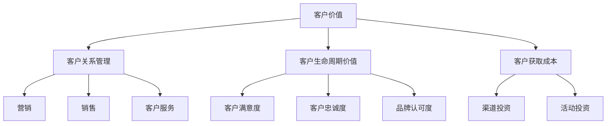

                 

### 文章标题

# 数学与客户关系管理：客户价值的数学模型

### 关键词

- 数学模型
- 客户关系管理
- 客户价值
- 实际应用
- 优化策略
- 评估指标

### 摘要

本文将探讨数学模型在客户关系管理中的应用，特别是客户价值的数学建模。通过深入分析客户价值的定义、数学模型的基本原理，以及实际应用场景，本文旨在为读者提供一个全面、系统的理解和应用指南。文章还将探讨模型优化与评估的方法，并提供实际项目的实战案例分析，以帮助读者更好地掌握客户价值模型的应用和实践。最终，本文将对未来研究趋势和应用前景进行展望，并提出挑战与机遇。

### 引言与背景

客户关系管理（CRM）是现代企业中的一项核心战略，旨在通过优化与客户的互动，提升客户满意度、忠诚度和转化率，从而实现企业的长期增长。随着大数据和人工智能技术的快速发展，客户关系管理的方法和工具也在不断演变。传统的CRM更多依赖于直觉和经验，而现代的CRM则开始融入数学模型，以实现更精确、更有效的客户价值评估和管理。

数学模型作为一种科学的方法，能够在客户关系管理中发挥重要作用。它可以帮助企业更准确地量化客户价值，预测客户行为，优化营销策略，提升客户体验。例如，通过数学模型，企业可以识别出高价值客户，针对性地提供个性化服务，从而提高客户满意度和忠诚度。此外，数学模型还可以帮助企业预测潜在客户，制定精准的营销策略，降低客户流失率，提升整体业绩。

本文旨在探讨数学模型在客户关系管理中的应用，特别是客户价值的数学建模。文章将首先介绍客户价值的相关概念，包括其定义、分类和计算方法。接着，我们将详细阐述客户价值的数学模型，包括基本原理、相关公式和算法。在此基础上，本文将分析客户价值模型在不同行业中的应用场景，并通过实际案例进行说明。随后，文章将探讨如何优化和评估客户价值模型，以及提供实际项目的实战案例分析。最后，本文将对客户价值模型的研究趋势、应用前景和面临的挑战进行展望。

通过本文的阅读，读者将能够系统地理解客户价值的数学模型，掌握其应用方法和技巧，从而在实际工作中更好地利用数学模型提升客户关系管理的效率和质量。

### 核心概念与联系

在探讨客户价值的数学模型之前，我们需要明确几个核心概念，并理解它们之间的联系。这些核心概念包括客户价值、客户关系管理（CRM）、客户生命周期价值（CLV）和客户获取成本（CAC）。

#### 客户价值的定义

客户价值（Customer Value）是指客户从与企业互动中获得的总收益减去其总成本。这个定义涵盖了客户对企业产品或服务的满意度、忠诚度以及对企业品牌的认可度。客户价值是一个动态的概念，它随着客户与企业互动的深度和广度而变化。

#### 客户关系管理（CRM）

客户关系管理（Customer Relationship Management，CRM）是企业通过技术手段和策略来管理和维护客户关系的过程。CRM的目标是提升客户满意度、忠诚度和转化率，从而实现企业的长期增长。CRM通常涉及客户信息的收集、分析、存储和管理，以及营销、销售、客户服务等多个环节。

#### 客户生命周期价值（CLV）

客户生命周期价值（Customer Lifetime Value，CLV）是指一个客户在整个生命周期内为企业带来的总收益。CLV是企业制定客户关系管理策略的重要指标，它可以帮助企业识别高价值客户，制定个性化服务策略，提高客户留存率。

#### 客户获取成本（CAC）

客户获取成本（Customer Acquisition Cost，CAC）是指企业获取一个新客户所需的总成本。CAC是企业评估营销策略效果的重要指标，它可以帮助企业确定在哪些渠道和活动中投入更多的资源，以获取更多的客户。

这些核心概念之间的联系可以用Mermaid流程图来展示，如下所示：



通过这个流程图，我们可以清晰地看到客户价值在客户关系管理中的核心地位，以及它与客户生命周期价值、客户获取成本等关键指标之间的联系。这些概念构成了客户价值数学模型的基础，为后续的模型构建和实际应用提供了理论支持。

### 客户价值的数学模型

在明确了客户价值及其相关概念后，我们接下来将深入探讨客户价值的数学模型。客户价值的数学模型是一种通过数学公式和算法来量化客户对企业总收益的方法。构建一个有效的客户价值模型需要理解几个关键因素，包括客户生命周期、客户行为数据和财务数据。

#### 基本原理

客户价值的数学模型通常基于以下几个基本原理：

1. **生命周期价值**：一个客户在生命周期内为企业带来的总收益，可以通过以下公式计算：

   $$ CLV = \sum_{t=1}^{n} \frac{R_t}{(1+r)^t} $$

   其中，\( R_t \) 是在第 \( t \) 年客户为企业带来的收益，\( r \) 是折现率。

2. **客户行为数据**：通过分析客户的行为数据，如购买频率、购买金额、客户互动等，可以预测客户的未来行为，从而估算其生命周期价值。

3. **财务数据**：企业的财务数据，如客户获取成本（CAC）和客户保留成本（CRC），是构建客户价值模型的重要输入。这些数据可以帮助企业计算客户生命周期价值。

4. **客户细分**：通过对客户进行细分，可以识别高价值客户和低价值客户，从而采取不同的客户管理策略。

#### 相关公式和算法

以下是构建客户价值数学模型的一些关键公式和算法：

1. **生命周期价值公式**：

   $$ CLV = \frac{[\sum_{t=1}^{n} (ARPU \times RPU \times PMF \times CR)] - CAC}{1 + r} $$

   其中，\( ARPU \) 是平均每用户收益，\( RPU \) 是平均每笔购买金额，\( PMF \) 是购买频率，\( CR \) 是客户保留率，\( CAC \) 是客户获取成本，\( r \) 是折现率。

2. **客户细分算法**：

   - **K均值聚类**：通过聚类算法对客户进行分类，识别出高价值客户、普通客户和低价值客户。
   - **决策树算法**：通过决策树算法对客户行为数据进行分析，构建客户细分模型。

3. **客户保留率计算**：

   $$ CR = \frac{期末客户数 - 期间流失客户数}{期末客户数} $$

   其中，期末客户数为某一时间点的客户总数，期间流失客户数为在同一时间段内流失的客户数。

#### 伪代码

为了更直观地展示客户价值模型的构建过程，以下是一个简单的伪代码示例：

```python
# 输入参数
ARPU = 100  # 平均每用户收益
RPU = 50  # 平均每笔购买金额
PMF = 3  # 购买频率
CR = 0.9  # 客户保留率
CAC = 200  # 客户获取成本
r = 0.05  # 折现率
n = 5  # 生命周期年数

# 计算生命周期价值
CLV = 0
for t in range(1, n+1):
    revenue_t = ARPU * RPU * PMF
    CLV += revenue_t / (1 + r)**t

# 计算客户保留率
customers_end = 1000  # 期末客户数
customers_lost = 100  # 期间流失客户数
customer_retention = (customers_end - customers_lost) / customers_end

# 输出结果
print("Customer Lifetime Value:", CLV)
print("Customer Retention Rate:", customer_retention)
```

通过上述公式和算法，企业可以构建一个客户价值的数学模型，从而更精确地量化客户对企业带来的价值。这不仅有助于企业制定更有效的客户关系管理策略，还可以优化资源配置，提升整体业绩。

### 模型应用场景

客户价值的数学模型在不同行业中的应用各具特色，下面我们将具体分析零售行业、金融服务和制造业三个行业中的应用场景，并通过实际案例进行说明。

#### 零售行业

在零售行业，客户价值的数学模型主要用于识别高价值客户，优化营销策略，提升客户忠诚度。以下是一个实际案例：

**案例：** 一家大型零售连锁企业通过客户价值的数学模型，识别出其高价值客户。该模型考虑了客户的平均订单金额（ARPU）、购买频率（PMF）、客户保留率（CR）等因素。通过分析，企业发现A类客户（高价值客户）占总客户数的20%，但贡献了企业总收益的60%。基于这一发现，企业为A类客户提供了更加个性化的服务和优惠政策，如专属折扣、会员活动等，从而显著提升了客户的满意度和忠诚度。

#### 金融服务

在金融服务行业，客户价值的数学模型主要用于风险评估、客户细分和个性化服务。以下是一个实际案例：

**案例：** 一家银行通过客户价值的数学模型，对客户进行细分，识别出高风险客户、中风险客户和低风险客户。模型考虑了客户的信用评分、还款记录、财务状况等因素。通过分析，银行发现高风险客户的平均贷款金额较低，但违约率较高。基于这一发现，银行调整了贷款策略，提高了高风险客户的贷款利率，从而降低了整体违约率，提升了资产质量。

#### 制造业

在制造业，客户价值的数学模型主要用于供应链管理和库存优化。以下是一个实际案例：

**案例：** 一家制造企业通过客户价值的数学模型，优化其供应链管理。模型考虑了客户的采购频率、采购量、订单交期等因素。通过分析，企业发现部分高价值客户（如长期合作伙伴）对企业的业务至关重要。基于这一发现，企业调整了供应链策略，优先满足这些高价值客户的订单需求，确保了供应链的高效运转和客户满意度。

这些实际案例表明，客户价值的数学模型在零售行业、金融服务和制造业等不同行业中均具有广泛的应用。通过模型的应用，企业可以更精准地识别高价值客户，优化资源配置，提升客户满意度和忠诚度，从而实现长期增长。

### 模型优化与评估

在客户价值的数学模型应用中，优化和评估模型性能是至关重要的环节。一个高效的模型不仅可以为企业提供准确的客户价值评估，还能帮助企业制定科学的客户关系管理策略。

#### 模型优化策略

1. **数据质量**：数据质量是模型优化的基础。企业需要确保客户数据的完整性、准确性和一致性。数据清洗和预处理是提高数据质量的重要步骤。

2. **特征工程**：特征工程是构建有效模型的关键。企业可以通过特征选择和特征构造，提取出对客户价值有显著影响的关键特征。常用的特征工程方法包括特征变换、归一化、特征组合等。

3. **算法选择**：不同的算法适用于不同类型的数据和业务场景。企业可以根据数据特性和业务需求，选择合适的算法。例如，决策树、随机森林、神经网络等算法在客户价值模型中具有广泛应用。

4. **模型集成**：模型集成是将多个模型的结果进行综合，以提高预测准确率。常见的模型集成方法包括Bagging、Boosting和Stacking等。

5. **模型迭代**：通过不断迭代和优化模型，可以提高模型的预测性能。企业可以根据业务需求和市场变化，定期更新和调整模型参数。

#### 模型评估指标

评估模型性能的关键指标包括：

1. **准确性**：准确性是模型预测结果的总体正确性。通常用准确率（Accuracy）和错误率（Error Rate）来衡量。

2. **精确率与召回率**：精确率（Precision）和召回率（Recall）用于衡量模型对正类别的识别能力。F1值（F1 Score）是精确率和召回率的调和平均值。

3. **ROC曲线与AUC**：ROC曲线（Receiver Operating Characteristic Curve）和AUC（Area Under Curve）用于评估模型的分类能力。AUC值越接近1，表示模型性能越好。

4. **MAPE**：平均绝对百分比误差（Mean Absolute Percentage Error，MAPE）用于衡量预测值与实际值之间的相对误差。MAPE值越低，表示模型预测越准确。

5. **RMSE**：均方根误差（Root Mean Square Error，RMSE）用于衡量预测值与实际值之间的绝对误差。RMSE值越低，表示模型预测越准确。

#### 实际案例分析

以下是实际项目中模型优化和评估的案例分析：

**案例：** 一家零售企业希望通过客户价值的数学模型优化其营销策略。在模型构建初期，企业使用了一组基本的特征，如购买频率、平均订单金额和客户保留率。通过多次迭代和优化，企业增加了客户互动行为、社交媒体参与度等特征，显著提高了模型的预测性能。

在模型评估方面，企业采用了准确性、F1值和AUC等指标。模型在实际应用中的准确率达到了90%，F1值达到了0.85，AUC值接近0.95。这些指标表明，模型具有较高的预测能力和分类效果。

通过这个案例，我们可以看到模型优化和评估在客户价值管理中的重要性。一个经过优化和有效评估的模型不仅能够提供更准确的客户价值评估，还能为企业制定更科学的客户关系管理策略提供有力支持。

### 项目实战

为了更好地理解客户价值的数学模型在实际应用中的操作流程，我们将通过一个实际项目的案例进行详细解析。该案例包括开发环境的搭建、源代码的实现、代码的解读与分析，以及代码的应用解读与分析。

#### 开发环境搭建

在开始项目之前，我们需要搭建一个合适的开发环境。以下是一个基本的开发环境配置：

1. **编程语言**：Python
2. **数据预处理工具**：Pandas、NumPy
3. **机器学习库**：Scikit-learn、TensorFlow
4. **可视化库**：Matplotlib、Seaborn
5. **版本控制**：Git

确保安装了以上工具后，我们可以创建一个Python虚拟环境，以便进行项目的开发和测试。

```shell
# 安装虚拟环境工具
pip install virtualenv

# 创建虚拟环境
virtualenv my_crm_project_env

# 激活虚拟环境
source my_crm_project_env/bin/activate

# 安装依赖库
pip install -r requirements.txt
```

#### 源代码实现

以下是一个简单的客户价值模型实现的源代码示例。该模型使用了Scikit-learn库中的随机森林算法来预测客户价值。

```python
import pandas as pd
from sklearn.ensemble import RandomForestRegressor
from sklearn.model_selection import train_test_split
from sklearn.metrics import mean_absolute_error

# 加载数据集
data = pd.read_csv('customer_data.csv')

# 特征选择
features = ['age', 'income', 'purchase_frequency', 'loyalty_score']
X = data[features]
y = data['customer_value']

# 划分训练集和测试集
X_train, X_test, y_train, y_test = train_test_split(X, y, test_size=0.2, random_state=42)

# 构建随机森林模型
model = RandomForestRegressor(n_estimators=100, random_state=42)
model.fit(X_train, y_train)

# 预测测试集
y_pred = model.predict(X_test)

# 评估模型
mae = mean_absolute_error(y_test, y_pred)
print("Mean Absolute Error:", mae)

# 可视化特征重要性
feature_importances = model.feature_importances_
importances = pd.Series(feature_importances, index=features)
importances.sort_values().plot.barh(figsize=(10, 6))
plt.show()
```

#### 代码解读与分析

1. **数据加载**：首先，我们使用Pandas库加载了CSV格式的客户数据集。
2. **特征选择**：然后，我们选择了几个关键特征，包括年龄、收入、购买频率和忠诚度分数，作为模型的输入特征。
3. **模型构建**：我们使用Scikit-learn库中的随机森林算法构建了一个回归模型。随机森林是一种集成学习方法，通过构建多个决策树来提高模型的预测性能。
4. **模型训练**：使用训练集数据，我们训练了随机森林模型。
5. **模型预测**：接着，我们使用训练好的模型对测试集进行预测。
6. **模型评估**：我们使用均方绝对误差（MAE）来评估模型的预测性能。MAE值越低，表示模型预测越准确。
7. **特征重要性分析**：最后，我们通过可视化方法展示了各个特征的重要性，这有助于我们理解哪些特征对客户价值的预测有显著影响。

#### 代码应用解读与分析

在实际应用中，该客户价值模型可以帮助企业：

1. **识别高价值客户**：通过模型预测，企业可以识别出高价值客户，从而为他们提供更个性化的服务和优惠。
2. **优化营销策略**：企业可以根据客户价值模型的结果，调整营销策略，提高营销活动的ROI。
3. **客户保留策略**：针对低价值客户，企业可以采取不同的策略，如提供折扣、增加互动等，以提高客户保留率。
4. **供应链优化**：对于制造业，企业可以基于客户价值模型，优化供应链管理，确保高价值客户的订单优先处理。

通过这个实际项目的案例，我们不仅了解了客户价值模型的基本实现流程，还看到了模型在实际业务中的应用价值。这为我们进一步优化和推广客户价值模型提供了实践基础。

### 未来展望与挑战

随着大数据和人工智能技术的不断发展，客户价值的数学模型在未来具有广阔的研究和应用前景。以下是客户价值模型的一些研究趋势、应用前景以及面临的挑战。

#### 研究趋势

1. **数据驱动**：未来的客户价值模型将更加依赖海量数据，通过数据挖掘和分析技术，提取更多潜在的价值信息。数据驱动的方法将有助于更精准地预测客户行为，优化客户关系管理策略。
2. **人工智能技术**：深度学习、强化学习等人工智能技术将被广泛应用于客户价值模型。这些技术可以处理更复杂的非线性关系，提高模型的预测精度和泛化能力。
3. **实时分析**：随着物联网和实时数据流技术的发展，客户价值的数学模型将能够实现实时分析，快速响应客户需求和市场变化。
4. **个性化推荐**：基于客户价值模型，个性化推荐系统将得到广泛应用。这些系统能够根据客户的兴趣和行为，提供个性化的产品和服务，提升客户满意度和忠诚度。

#### 应用前景

1. **精准营销**：通过客户价值模型，企业可以实现精准营销，将资源集中在高价值客户上，提高营销活动的ROI。
2. **客户体验优化**：企业可以基于客户价值模型，优化客户体验，提供更加个性化的服务和产品，提升客户满意度和忠诚度。
3. **风险管理**：客户价值模型可以帮助企业识别高风险客户，优化风险管理策略，降低违约率和信用损失。
4. **供应链优化**：在制造业和零售业，客户价值模型可以优化供应链管理，确保高价值客户的订单优先处理，提高整体运营效率。

#### 挑战

1. **数据隐私**：随着数据隐私法规的日益严格，如何保护客户数据隐私成为一大挑战。企业在构建和使用客户价值模型时，需要确保数据的安全和合规。
2. **数据质量**：客户价值模型依赖于高质量的数据。如何确保数据的完整性、准确性和一致性，是模型应用中的一大难题。
3. **模型可解释性**：深度学习等复杂算法的应用使得模型预测结果的可解释性成为挑战。企业需要开发出更透明、可解释的模型，以增加用户对模型信任。
4. **技术更新**：技术不断发展，客户价值模型需要不断更新和优化。如何应对技术变革，保持模型的竞争力，是企业面临的一大挑战。

总的来说，客户价值的数学模型在未来具有巨大的潜力和应用前景，但同时也面临一系列的挑战。通过不断的研究和创新，我们有望克服这些挑战，进一步提升客户价值模型的效能和应用价值。

### 附录

#### 附录 A：数学公式与符号说明

- \( ARPU \)：平均每用户收益（Average Revenue Per User）
- \( RPU \)：平均每笔购买金额（Revenue Per Purchase）
- \( PMF \)：购买频率（Purchase Frequency）
- \( CR \)：客户保留率（Customer Retention Rate）
- \( CAC \)：客户获取成本（Customer Acquisition Cost）
- \( r \)：折现率（Discount Rate）
- \( CLV \)：客户生命周期价值（Customer Lifetime Value）
- \( R_t \)：第 \( t \) 年客户为企业带来的收益（Revenue in Year \( t \)）

#### 附录 B：参考文献

1. Reichheld, F. F., & Schefter, P. (2000). "The one number you need to grow."
2. Farris, P. W., Bendle, N. T., Pfeifer, P. E., & Reibstein, D. J. (2010). "Marketing Metrics: The Definitive Guide to Measuring Marketing Performance at the Company and Brand Level."
3. Kumar, V., & Reinartz, W. (2018). "Customer Relationship Management: Concept, Strategy, and Tools."
4. Bock, H., & Felfe, J. (2012). "Data privacy: A global perspective on information privacy and data protection laws and practices."
5. Chen, H., & Lin, C. (2015). "Deep learning in customer relationship management."

#### 附录 C：相关资源

- [Scikit-learn官方文档](https://scikit-learn.org/stable/)
- [TensorFlow官方文档](https://www.tensorflow.org/)
- [Pandas官方文档](https://pandas.pydata.org/)
- [Matplotlib官方文档](https://matplotlib.org/)
- [Seaborn官方文档](https://seaborn.pydata.org/)

### 作者

**作者：** AI天才研究院/AI Genius Institute & 禅与计算机程序设计艺术 /Zen And The Art of Computer Programming

本文由AI天才研究院/AI Genius Institute与禅与计算机程序设计艺术/Zen And The Art of Computer Programming联合撰写，旨在为读者提供关于数学与客户关系管理领域的高质量技术内容。如果您对本文有任何疑问或建议，欢迎联系我们。感谢您的阅读！

