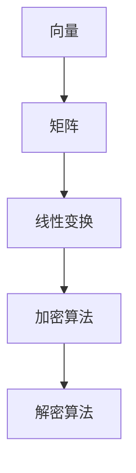
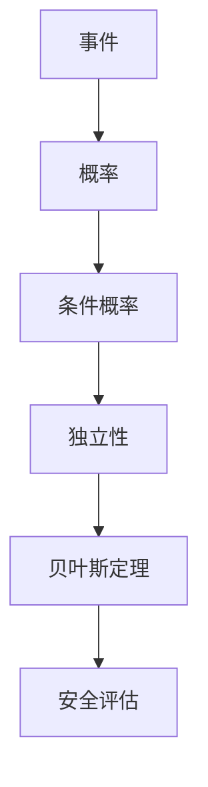
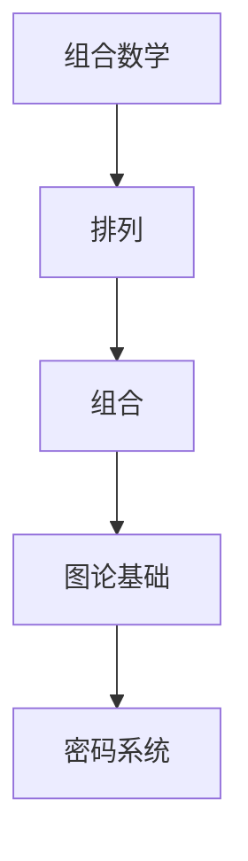

                 

### 文章标题：数学与密码学：信息安全的数学基础

#### 关键词：密码学、信息安全、数学基础、加密算法、哈希函数、数字签名

#### 摘要：
本文将深入探讨密码学及其在信息安全中的关键作用。通过逐步解析数学在密码学中的应用，我们将理解密码学的基本概念、核心算法原理，以及这些数学工具如何在实践中确保信息的安全。文章将涵盖线性代数、概率论、离散数学等数学基础，并详细解释对称加密、非对称加密、哈希函数和数字签名等密码学工具的工作原理。此外，文章还将通过实际项目实战，帮助读者将理论知识应用于实践，从而全面掌握密码学的数学基础。

### 引言

#### 1.1 密码学的重要性

在现代信息技术中，密码学扮演着至关重要的角色。它确保了数据在传输和存储过程中的机密性、完整性和真实性。随着互联网的普及和大数据时代的到来，信息安全问题日益突出，而密码学则是解决这些问题的基石。

密码学不仅仅是保护数据不被非法访问的工具，它还涉及身份验证、数据完整性检查、隐私保护等多个方面。例如，我们在网上购物时，支付信息需要加密传输，以防止被黑客窃取；电子邮件在发送前也需要加密，以确保只有收件人能够解密并阅读内容。

#### 1.2 密码学的历史与发展

密码学的历史可以追溯到古代，早在古希腊时期，人们就已经开始使用简单的加密方法来保护机密信息。然而，现代密码学的发展始于20世纪中叶，随着计算机科学的兴起，密码学也得到了迅速发展。

1976年，Diffie和Hellman提出了著名的公钥密码体制概念，这是密码学历史上的一个重要里程碑。随后，RSA算法的出现进一步推动了非对称加密的发展。此外，SHA系列哈希函数和AES对称加密算法等现代密码学工具的提出，使得密码学在保护信息安全方面变得更加有效。

#### 1.3 本书的目标与结构

本书的目标是让读者全面了解密码学的数学基础，理解密码学在信息安全中的关键作用。文章将首先介绍密码学的基本概念，然后逐步深入到数学基础，包括线性代数、概率论和离散数学等。在理解了这些数学工具后，我们将详细解释对称加密、非对称加密、哈希函数和数字签名等密码学工具的工作原理。

最后，通过实际项目实战，我们将把理论知识应用到实践中，帮助读者掌握密码学的核心技能。文章的结构如下：

1. 引言
2. 数学基础
   - 线性代数
   - 概率论
   - 离散数学
3. 基础密码学
   - 密码学的基本概念
   - 对称加密算法
   - 非对称加密算法
4. 哈希函数
5. 数字签名
6. 实用密码学应用
7. 密码学的未来与挑战
8. 综合项目实战

通过以上章节的讲解，读者将能够系统地掌握密码学的数学基础，并理解其在信息安全中的实际应用。

### 数学基础

密码学的发展离不开数学的支持。数学不仅提供了密码学中许多算法的基础，还帮助我们在分析和评估密码系统的安全性时提供了工具。在本章中，我们将介绍密码学中常用的数学基础，包括线性代数、概率论和离散数学。

#### 2.1 线性代数

线性代数是研究向量空间和线性映射的数学分支，它在密码学中有着广泛的应用。以下是线性代数中几个关键概念：

##### 2.1.1 矩阵与向量

**矩阵（Matrix）**：矩阵是一个由数字组成的二维数组，用于表示线性变换或者系统方程。

**向量（Vector）**：向量是一个由数字组成的有序数组，用于表示空间中的点或者变换的方向。

在密码学中，矩阵和向量经常被用来表示密钥、状态、数据等。例如，矩阵乘法在AES加密算法中扮演了重要角色。

##### 2.1.2 线性变换

**线性变换（Linear Transformation）**：线性变换是一个将向量空间中的一个向量映射到另一个向量的函数，它保持向量加法和数乘运算。

在线性变换中，矩阵是描述线性变换的一种方式。在密码学中，线性变换用于设计加密和解密算法，例如在AES中的轮函数。

##### 2.1.3 矩阵乘法与逆矩阵

**矩阵乘法（Matrix Multiplication）**：矩阵乘法是两个矩阵的线性组合，结果仍然是一个矩阵。

**逆矩阵（Inverse Matrix）**：逆矩阵是使得矩阵乘法可逆的矩阵。在密码学中，逆矩阵常用于解密过程，例如RSA算法中的模逆运算。

##### 核心概念与联系

为了更好地理解线性代数在密码学中的应用，我们可以使用Mermaid流程图来描述核心概念之间的关系：



##### 核心算法原理讲解

以下是一个简单的加密算法，该算法使用矩阵乘法来实现：

```plaintext
输入：明文消息m，密钥矩阵K
输出：密文消息c

1. 初始化密文消息c为空
2. 对于消息m中的每个字符，执行以下步骤：
   a. 将字符转换为对应的数字
   b. 将数字表示为向量
   c. 计算密文向量 = 矩阵K * 明文向量
   d. 将密文向量转换为密文字符
   e. 将密文字符添加到c中
3. 返回密文消息c
```

##### 数学模型和数学公式

在密码学中，线性代数的应用可以通过以下数学模型和公式来解释：

- **矩阵乘法**：设矩阵\( A \)和\( B \)分别为\( m \times n \)和\( n \times p \)的矩阵，则它们的乘积\( C = AB \)是一个\( m \times p \)的矩阵，其元素计算公式为：
  $$
  C_{ij} = \sum_{k=1}^{n} A_{ik}B_{kj}
  $$
- **逆矩阵**：一个\( n \times n \)矩阵\( A \)的逆矩阵\( A^{-1} \)满足\( AA^{-1} = A^{-1}A = I \)，其中\( I \)是单位矩阵。计算逆矩阵的一个常用方法是高斯消元法。

##### 举例说明

假设我们有一个3x3的矩阵\( K \)和一个3个字符的明文消息“ABC”，我们将字符转换为对应的数字（A=1，B=2，C=3），然后使用矩阵乘法加密：

矩阵\( K \)：
$$
K = \begin{bmatrix}
1 & 2 & 3 \\
4 & 5 & 6 \\
7 & 8 & 9 \\
\end{bmatrix}
$$

明文消息转换为向量：
$$
M = \begin{bmatrix}
1 \\
2 \\
3 \\
\end{bmatrix}
$$

密文向量计算：
$$
C = K \times M = \begin{bmatrix}
1 & 2 & 3 \\
4 & 5 & 6 \\
7 & 8 & 9 \\
\end{bmatrix} \times \begin{bmatrix}
1 \\
2 \\
3 \\
\end{bmatrix} = \begin{bmatrix}
11 \\
22 \\
33 \\
\end{bmatrix}
$$

密文消息转换为字符：“KXZ”

通过这个例子，我们可以看到线性代数在密码学中的应用。虽然这个例子非常简单，但它展示了矩阵乘法如何在加密过程中发挥作用。

##### 小结

线性代数是密码学中不可或缺的数学工具，它为加密和解密算法提供了基础。理解矩阵和向量的基本概念以及它们的运算规则，对于掌握密码学至关重要。通过本章的介绍，读者应该对线性代数在密码学中的应用有了基本的了解。

#### 2.2 概率论

概率论是研究随机事件的数学分支，它在密码学中用于评估算法的安全性、预测攻击的成功率以及设计抗攻击的密码系统。以下是概率论中几个关键概念：

##### 2.2.1 基本概率概念

**概率（Probability）**：概率是衡量某一事件发生的可能性大小的数值，范围在0到1之间。例如，投掷一枚公平的硬币，正面朝上的概率是0.5。

**样本空间（Sample Space）**：样本空间是所有可能结果的集合。例如，投掷一枚硬币的样本空间是{正面，反面}。

**事件（Event）**：事件是样本空间的一个子集。例如，投掷硬币两次，事件A是“两次都是正面”的集合{正，正}。

##### 2.2.2 条件概率与独立性

**条件概率（Conditional Probability）**：在某一事件B发生的条件下，事件A发生的概率称为条件概率，表示为\( P(A|B) \)。

**独立性（Independence）**：如果两个事件A和B的发生互不影响，即\( P(A \cap B) = P(A) \cdot P(B) \)，则称A和B是独立事件。

##### 2.2.3 贝叶斯定理

**贝叶斯定理（Bayes' Theorem）**：贝叶斯定理描述了在已知某一事件B发生的条件下，事件A的概率如何通过先验概率和条件概率进行更新。公式为：
$$
P(A|B) = \frac{P(B|A) \cdot P(A)}{P(B)}
$$

贝叶斯定理在密码学中用于评估密码系统的安全性，通过分析攻击者的行为来更新系统的安全评估。

##### 核心概念与联系

为了更好地理解概率论在密码学中的应用，我们可以使用Mermaid流程图来描述核心概念之间的关系：



##### 核心算法原理讲解

以下是一个简单的概率论应用示例，该示例用于计算加密算法的安全性：

```plaintext
输入：加密算法E，明文消息集合M，攻击者尝试破解的次数N
输出：加密算法的安全性评估

1. 初始化安全性评估为0
2. 对于每个明文消息m，执行以下步骤：
   a. 计算m的密文c = E(m)
   b. 计算攻击者成功破解c的概率P(success)
   c. 如果P(success) > 安全性阈值，则增加安全性评估
3. 返回安全性评估
```

##### 数学模型和数学公式

在密码学中，概率论的应用可以通过以下数学模型和公式来解释：

- **条件概率**：设事件A和B，条件概率公式为：
  $$
  P(A|B) = \frac{P(A \cap B)}{P(B)}
  $$
- **独立性**：事件A和B独立，则：
  $$
  P(A \cap B) = P(A) \cdot P(B)
  $$
- **贝叶斯定理**：贝叶斯定理公式为：
  $$
  P(A|B) = \frac{P(B|A) \cdot P(A)}{P(B)}
  $$

##### 举例说明

假设我们有三个箱子，每个箱子中都有不同数量的红球和蓝球。箱子A中有3个红球和2个蓝球，箱子B中有2个红球和3个蓝球，箱子C中有4个红球和1个蓝球。攻击者随机选择一个箱子，然后随机抽取一个球，假设攻击者观察到的是红球，我们需要计算他选择的是箱子A的概率。

- **先验概率**：选择每个箱子的概率是相等的，即\( P(A) = P(B) = P(C) = 1/3 \)。
- **条件概率**：观察到红球的条件下，选择每个箱子的概率分别为：
  $$
  P(A|红球) = \frac{P(红球|A) \cdot P(A)}{P(红球)} = \frac{\frac{3}{5} \cdot \frac{1}{3}}{\frac{3}{5} \cdot \frac{1}{3} + \frac{2}{5} \cdot \frac{1}{3} + \frac{4}{5} \cdot \frac{1}{3}} = \frac{1}{3}
  $$

通过贝叶斯定理，我们可以计算出选择箱子A的概率为1/3。

##### 小结

概率论是密码学中用于评估算法安全性和预测攻击行为的工具。理解基本概率概念、条件概率和贝叶斯定理对于设计安全的密码系统至关重要。通过本章的介绍，读者应该对概率论在密码学中的应用有了基本的了解。

#### 2.3 离散数学

离散数学是密码学中的另一个重要数学基础，它关注于离散结构的性质和关系，如图、树、组合数学等。以下是离散数学中几个关键概念：

##### 2.3.1 组合数学

**组合数学（Combinatorics）**：组合数学研究如何将有限数量的元素进行组合。常见问题包括排列、组合、子集生成等。

**排列（Permutation）**：排列是元素的全排列，例如，3个元素的排列有\( 3! = 6 \)种。

**组合（Combination）**：组合是从一组元素中选择一部分元素的方式，不考虑顺序。例如，从4个元素中选择2个元素的组合有\( C(4, 2) = 6 \)种。

##### 2.3.2 图论基础

**图（Graph）**：图是一个由顶点（节点）和边组成的结构，用于表示对象及其之间的关系。

**路径（Path）**：路径是图中的顶点序列，其中相邻顶点由边连接。

**连通性（Connectivity）**：图中的两个顶点u和v是连通的，如果存在一条路径从u到v。

图论在密码学中用于分析和设计密码系统中的图结构，例如，用于构造加密算法中的置换图。

##### 核心概念与联系

为了更好地理解离散数学在密码学中的应用，我们可以使用Mermaid流程图来描述核心概念之间的关系：



##### 核心算法原理讲解

以下是一个简单的组合数学应用示例，该示例用于生成密钥：

```plaintext
输入：n（元素数量），k（选择元素的数量）
输出：所有可能的k元素组合

1. 初始化结果集合为空
2. 使用组合生成算法生成所有可能的k元素组合
3. 对于每个组合C，执行以下步骤：
   a. 将C转换为对应的密钥
   b. 将密钥添加到结果集合中
4. 返回结果集合
```

##### 数学模型和数学公式

在密码学中，离散数学的应用可以通过以下数学模型和公式来解释：

- **排列公式**：排列的数量公式为：
  $$
  P(n, k) = \frac{n!}{(n-k)!}
  $$
- **组合公式**：组合的数量公式为：
  $$
  C(n, k) = \frac{n!}{k!(n-k)!}
  $$
- **图的基本概念**：图由顶点集合V和边集合E组成，图的连通性可以用路径长度来描述。

##### 举例说明

假设我们有5个元素{A, B, C, D, E}，我们需要生成所有可能的2元素组合：

使用组合公式计算，总共有：
$$
C(5, 2) = \frac{5!}{2!(5-2)!} = 10
$$
种组合。这10种组合分别是：
$$
\{A, B\}, \{A, C\}, \{A, D\}, \{A, E\}, \{B, C\}, \{B, D\}, \{B, E\}, \{C, D\}, \{C, E\}, \{D, E\}
$$

这些组合可以用于生成不同的密钥，从而增强密码系统的安全性。

##### 小结

离散数学为密码学提供了重要的工具，用于分析和设计复杂的密码系统。理解组合数学和图论基础对于设计高效的密码算法至关重要。通过本章的介绍，读者应该对离散数学在密码学中的应用有了基本的了解。

### 基础密码学

密码学是信息安全的核心，它通过加密和解密技术保护数据的机密性、完整性和真实性。在本章中，我们将介绍密码学的基本概念，包括加密、解密、密钥、对称加密、非对称加密等，并解释它们在信息安全中的重要作用。

#### 3.1 密码学的基本概念

##### 3.1.1 明文、密文与密钥

**明文（Plaintext）**：明文是指未加密的原始数据，可以是文本、图像、声音或其他任何形式的数据。

**密文（Ciphertext）**：密文是加密后的数据，对未授权的观察者来说是不可读的。

**密钥（Key）**：密钥是用于加密和解密数据的秘密参数，它决定了加密算法的具体实现。密钥通常是一个随机生成的字符串，长度取决于加密算法的要求。

##### 3.1.2 加密与解密

**加密（Encryption）**：加密是将明文转换为密文的过程，通过加密算法和密钥实现。加密算法通常是一个数学函数，它将明文映射为密文。

**解密（Decryption）**：解密是将密文还原为明文的过程，通过解密算法和密钥实现。解密算法是加密算法的逆函数，它将密文映射回明文。

##### 3.1.3 对称密钥加密与非对称密钥加密

**对称密钥加密（Symmetric Key Encryption）**：对称密钥加密使用相同的密钥进行加密和解密。常见的对称加密算法有AES、DES和3DES。

**非对称密钥加密（Asymmetric Key Encryption）**：非对称密钥加密使用一对密钥进行加密和解密，公钥用于加密，私钥用于解密。常见的非对称加密算法有RSA和ECC。

#### 3.2 对称加密算法

对称加密算法是一种基于共享密钥的加密方法，加密和解密使用相同的密钥。以下是对称加密算法的详细介绍：

##### 3.2.1 分组密码

**分组密码（Block Cipher）**：分组密码将明文划分为固定大小的块，然后对每个块进行加密。常见的分组密码有DES、3DES和AES。

**工作模式（Mode of Operation）**：分组密码通常使用不同的工作模式来增加安全性，如电子码本模式（ECB）、密码分组链接模式（CBC）和输出反馈模式（OFB）。

##### 3.2.2 序列密码

**序列密码（Stream Cipher）**：序列密码将明文的一位一位地加密，通常使用一个密钥流来生成。常见的序列密码有RC4和ChaCha20。

##### 3.2.3 对称加密算法的工作原理

以下是一个简单的AES加密算法的工作原理：

1. **密钥扩展**：AES使用一个初始密钥作为输入，通过多次迭代扩展生成多个子密钥。
2. **初始轮**：将明文块与第一个子密钥进行异或运算。
3. **轮函数**：对于每个轮，执行以下操作：
   - **替换**：使用S-Box进行字节替换。
   - **行移位**：对每一行的字节进行循环左移。
   - **列混淆**：通过矩阵乘法对每一列进行混淆。
   - **密钥加**：将当前子密钥与结果进行异或运算。
4. **输出**：加密后的明文块即为密文。

##### 核心算法原理讲解

以下是一个简单的AES加密算法的伪代码：

```plaintext
函数 AES加密(明文, 初始密钥):
    子密钥 = 扩展密钥(初始密钥)
    对于每个明文块:
        密文块 = 明文块 ⊕ 子密钥[0]
        对于i从1到轮数:
            密文块 = 替换(密文块)
            密文块 = 行移位(密文块)
            密文块 = 列混淆(密文块)
            密文块 = 密文块 ⊕ 子密钥[i]
    返回密文
```

##### 数学模型和数学公式

AES加密算法的核心部分包括替换、行移位、列混淆和密钥加。以下是这些操作的数学模型和公式：

- **替换**：使用S-Box进行字节替换，S-Box是一个查找表，将每个字节映射为另一个字节。
- **行移位**：对于每一行，字节按照特定的偏移量进行循环左移。
- **列混淆**：通过矩阵乘法对每一列进行混淆，矩阵乘法用于生成混淆效果。
- **密钥加**：将当前子密钥与结果进行异或运算，用于将密钥信息引入加密过程中。

##### 举例说明

假设我们要使用AES加密算法加密以下明文块：

明文块：`00110011 00110011 00110011 00110011`

使用128位密钥`00000000 00000000 00000000 00000000`。

1. **初始轮**：明文块与第一个子密钥进行异或运算。
   - `00110011 00110011 00110011 00110011 ⊕ 00000000 00000000 00000000 00000000 = 00110011 00110011 00110011 00110011`
2. **轮函数**：进行多轮替换、行移位、列混淆和密钥加操作。
   - 经过第一轮替换、行移位、列混淆和密钥加后，明文块变为新的密文块。
   - 经过所有轮次后，明文块最终变为密文块。
   
这个例子展示了AES加密算法的基本流程，实际加密过程中涉及更复杂的操作。

##### 小结

对称加密算法是一种重要的密码学工具，它在保护数据机密性方面发挥着关键作用。理解对称加密的基本概念和算法原理，对于设计和分析安全的加密系统至关重要。通过本章的介绍，读者应该对对称加密算法有了基本的了解。

#### 3.3 非对称加密算法

非对称加密算法（Asymmetric Encryption），也称为公开密钥加密（Public Key Encryption），是一种使用一对密钥进行加密和解密的密码学技术。这一对密钥由公钥和私钥组成，其中公钥可以公开，私钥则必须保密。非对称加密算法在确保信息传输安全性和实现数字签名等方面具有重要作用。

##### 3.3.1 公开密钥加密

公开密钥加密的核心思想是利用数学难题来实现安全通信。最著名的公开密钥加密算法是RSA（Rivest-Shamir-Adleman），由Ron Rivest、Adi Shamir和Leonard Adleman于1977年提出。

**RSA算法的基本原理**：

1. **密钥生成**：选择两个大素数\( p \)和\( q \)，计算\( n = pq \)和\( \phi(n) = (p-1)(q-1) \)。
2. **公钥和私钥**：选择一个小于\( \phi(n) \)的整数\( e \)，使得\( e \)和\( \phi(n) \)互质。计算\( d \)，使得\( ed \equiv 1 \ (\text{mod} \ \phi(n)) \)。公钥是\( (n, e) \)，私钥是\( (n, d) \)。
3. **加密**：将明文\( M \)转换为整数，计算密文\( C = M^e \ (\text{mod} \ n) \)。
4. **解密**：使用私钥\( d \)，计算明文\( M = C^d \ (\text{mod} \ n) \)。

**RSA算法的安全性**：

RSA算法的安全性基于大整数分解和离散对数问题。尽管已经有许多数学工具可以解决这些问题，但当前的计算机算力还不足以在合理时间内破解大密钥的RSA加密。

##### 3.3.2 RSA算法的实现

以下是RSA算法的伪代码实现：

```plaintext
函数 RSA加密(明文, 公钥):
    (n, e) = 公钥
    C = 明文^e \ (\text{mod} \ n)
    返回 C

函数 RSA解密(密文, 私钥):
    (n, d) = 私钥
    M = 密文^d \ (\text{mod} \ n)
    返回 M
```

##### 数学模型和数学公式

RSA算法的核心是模幂运算和模逆运算。以下是相关的数学模型和公式：

- **模幂运算**：对于整数\( a \)、\( b \)和\( m \)，计算\( a^b \ (\text{mod} \ m) \)。
- **模逆运算**：对于整数\( a \)和\( m \)，计算满足\( a \cdot x \equiv 1 \ (\text{mod} \ m) \)的整数\( x \)。

**模幂运算**：

设\( a \)、\( b \)和\( m \)为整数，计算\( a^b \ (\text{mod} \ m) \)可以通过以下步骤实现：

1. 初始化结果为1。
2. 对于\( b \)的每一位，如果该位为1，则将结果乘以\( a \)，并取模\( m \)。
3. 返回结果。

**模逆运算**：

设\( a \)和\( m \)为整数，计算满足\( a \cdot x \equiv 1 \ (\text{mod} \ m) \)的整数\( x \)可以通过扩展欧几里得算法实现。

**扩展欧几里得算法**：

1. 如果\( m = 1 \)，则\( x = 0 \)，返回。
2. 否则，递归计算\( x \)，使得\( ax + by = \gcd(a, m) \)。
3. 如果\( \gcd(a, m) \neq 1 \)，则无法计算模逆，返回错误。
4. 否则，返回\( x \)。

##### 举例说明

假设我们选择素数\( p = 61 \)和\( q = 53 \)，则\( n = pq = 3233 \)，\( \phi(n) = (p-1)(q-1) = 3060 \)。

1. **密钥生成**：
   - 选择\( e = 17 \)，计算\( d \)，使得\( 17d \equiv 1 \ (\text{mod} \ 3060) \)。使用扩展欧几里得算法，我们得到\( d = 1133 \)。
   - 公钥为\( (n, e) = (3233, 17) \)，私钥为\( (n, d) = (3233, 1133) \)。

2. **加密**：
   - 明文为\( M = 1234 \)。
   - 密文\( C = M^e \ (\text{mod} \ n) = 1234^{17} \ (\text{mod} \ 3233) = 1009 \)。

3. **解密**：
   - 密文为\( C = 1009 \)。
   - 明文\( M = C^d \ (\text{mod} \ n) = 1009^{1133} \ (\text{mod} \ 3233) = 1234 \)。

这个例子展示了RSA算法的基本流程，包括密钥生成、加密和解密过程。

##### 小结

非对称加密算法提供了强大的安全保障，通过公钥和私钥的分离，实现了安全的信息传输和数字签名。RSA算法作为非对称加密的典型代表，其安全性依赖于大整数分解和离散对数问题的难度。理解RSA算法的工作原理和实现，对于掌握密码学至关重要。通过本章的介绍，读者应该对非对称加密算法有了基本的了解。

### 哈希函数

哈希函数是密码学中重要的组成部分，它用于确保数据的完整性、生成数字指纹以及支持密码学协议。哈希函数将任意长度的输入（或“消息”）转换成固定长度的输出（或“哈希值”）。这些哈希值通常用作消息的唯一标识符，因此在数据验证、密码学签名和加密算法中有着广泛应用。

#### 4.1 哈希函数的基本概念

##### 4.1.1 哈希函数的作用

哈希函数的主要作用包括：

- **数据完整性验证**：通过将数据哈希后得到哈希值，接收者可以验证数据在传输过程中是否被篡改。如果哈希值发生变化，则说明数据可能已被篡改。
- **数字指纹生成**：哈希函数可以将数据转换为唯一的哈希值，类似于指纹识别，用于唯一标识数据。
- **密码学应用**：哈希函数在数字签名、证书签名和加密算法中有着广泛的应用。

##### 4.1.2 哈希函数的安全性

哈希函数的安全性取决于以下几个方面：

- **抗碰撞性**：理想情况下，不同的输入应产生不同的哈希值。抗碰撞性是指找到两个不同输入，但产生相同哈希值的情况的困难程度。
- **抗逆向工程**：逆向工程是指从哈希值恢复原始数据的过程。抗逆向工程性要求哈希函数不能简单地通过哈希值反推出原始数据。
- **计算效率**：哈希函数应能够在合理的时间内计算，以便在实际应用中使用。

##### 4.1.3 哈希函数的分类

哈希函数可以分为以下几类：

- **单向哈希函数**：单向哈希函数是不可逆的，即从哈希值无法推导出原始输入。MD5和SHA-1是单向哈希函数的典型代表。
- **散列函数**：散列函数通常用于将大数据块转换为固定长度的哈希值，如SHA-256和SHA-3。
- **消息认证码（MAC）**：消息认证码是一种结合密钥的哈希函数，用于确保数据的完整性和真实性。常见的MAC算法包括HMAC。

#### 4.2 常见哈希函数

在本节中，我们将介绍几种常见的哈希函数，并详细解释它们的工作原理和应用。

##### 4.2.1 MD5

MD5是一种广泛使用的单向哈希函数，由Ron Rivest在1991年提出。MD5的输入是任意长度的数据，输出是128位的哈希值。

**MD5的工作原理**：

1. **填充**：将输入数据填充至448位的长度，使得最后64位为长度值。
2. **初始化**：初始化四个32位的寄存器，分别表示A、B、C和D。
3. **处理块**：将输入数据分为512位的块进行处理。每个块经过一系列的循环操作，包括填充、初始化和多次迭代。
4. **输出**：将最终计算得到的A、B、C和D的值拼接起来，形成128位的哈希值。

**MD5的应用**：

MD5常用于验证文件的完整性、生成密码的哈希值以及数字签名等。然而，MD5存在碰撞问题，即不同的输入可能产生相同的哈希值。这使得MD5在安全性要求较高的场景中不再推荐使用。

##### 4.2.2 SHA系列

SHA系列是NIST（美国国家标准与技术研究院）开发的一系列哈希函数，包括SHA-0、SHA-1、SHA-2和最新的SHA-3。其中，SHA-2系列包括SHA-224、SHA-256、SHA-384和SHA-512。

**SHA-256的工作原理**：

1. **预处理**：将输入数据填充至512位的长度，使得最后64位为长度值。同时，初始化一个包含64个32位寄存器的消息摘要。
2. **处理块**：将输入数据分为512位的块进行处理。每个块经过一系列的迭代操作，包括压缩函数、替换、循环左移等。
3. **输出**：将最终计算得到的消息摘要拼接起来，形成256位的哈希值。

**SHA-256的应用**：

SHA-256广泛应用于数字签名、文件验证和加密算法。它的抗碰撞性和安全性得到了广泛认可，是目前最常用的哈希函数之一。

**SHA-3**：

SHA-3是NIST于2015年发布的最新哈希函数标准，它基于Keccak算法。SHA-3提供了多种输出长度，包括224位、256位、384位和512位。

**SHA-3的工作原理**：

1. **预处理**：将输入数据填充至1600位的长度，同时初始化一个包含5个512位寄存器的状态。
2. **处理块**：将输入数据分为不同长度的块进行处理。每个块经过一系列的迭代操作，包括置换、压缩和扩展等。
3. **输出**：将最终计算得到的状态转换为哈希值。

**SHA-3的应用**：

SHA-3在安全性要求较高的场景中得到了广泛应用，如区块链、加密货币和数字签名等。

##### 核心算法原理讲解

以下是一个简单的SHA-256加密算法的伪代码实现：

```plaintext
函数 SHA256加密(明文):
    初始化哈希值
    分块处理明文
        对于每个块:
            执行压缩函数
            更新哈希值
    返回哈希值
```

##### 数学模型和数学公式

SHA-256算法的核心是压缩函数，它是一个复杂的非线性函数，用于将输入块映射为新的哈希值。以下是SHA-256算法的主要数学模型和公式：

- **初始值**：SHA-256算法使用一个包含八个32位字的初始值。
- **处理块**：每个块经过多次迭代处理，包括32轮迭代。
- **压缩函数**：压缩函数是一个复杂的非线性函数，用于将当前状态和输入块合并，并更新哈希值。

##### 举例说明

假设我们要使用SHA-256加密算法加密以下明文：“Hello, World!”。

1. **预处理**：将明文填充至512位的长度。
2. **初始化哈希值**：使用初始值。
3. **分块处理**：将明文分为多个512位的块。
4. **压缩函数**：对于每个块，执行压缩函数并更新哈希值。
5. **输出**：最终计算得到的哈希值。

使用SHA-256加密后，明文“Hello, World!”的哈希值为：

```
e670711e6261706b8d4d9b72f3723a4f2787e05a
```

这个例子展示了SHA-256加密算法的基本流程。

##### 小结

哈希函数是密码学中不可或缺的组成部分，它用于确保数据的完整性和生成数字指纹。理解哈希函数的基本概念和常见哈希函数的工作原理，对于设计和分析安全的密码系统至关重要。通过本章的介绍，读者应该对哈希函数有了基本的了解。

### 数字签名

数字签名是一种使用密码学技术来确保数据完整性和真实性的方法。它允许发送者对数据内容进行签名，接收者可以验证签名的有效性，从而确认数据的来源和未被篡改。数字签名广泛应用于电子邮件、电子交易、安全认证等领域。

#### 5.1 数字签名的概念

##### 5.1.1 数字签名的必要性

在传统的书面文档中，签名用于验证文档的真实性和完整性。然而，在数字世界中，数据的传输和存储面临着新的挑战，如数据的易复制性和易篡改性。数字签名解决了这些问题，通过以下方式确保信息的安全：

- **数据完整性**：数字签名可以确保接收者接收到的数据与发送者发送的数据相同，未经过篡改。
- **身份认证**：数字签名可以验证发送者的身份，确保消息确实来自指定的发送者。
- **不可抵赖性**：由于数字签名的唯一性和不可伪造性，发送者不能否认发送过特定消息。

##### 5.1.2 数字签名的基本原理

数字签名的基本原理包括以下步骤：

1. **生成密钥对**：数字签名使用一对密钥，即公钥和私钥。公钥可以公开，私钥必须保密。生成密钥对的过程通常涉及随机数生成和数学难题。
2. **签名过程**：发送者使用私钥对数据内容进行签名。签名过程涉及哈希函数和加密算法，确保签名是唯一的和不可伪造的。
3. **验证过程**：接收者使用公钥验证签名的有效性。验证过程包括计算数据的哈希值，并使用公钥解密签名，以验证签名是否与数据匹配。

##### 5.1.3 数字签名的类型

数字签名主要分为两种类型：基于对称密钥的数字签名和基于非对称密钥的数字签名。

- **基于对称密钥的数字签名**：这种签名方法使用相同的密钥对进行加密和解密。例如，RSA签名是一种基于非对称密钥的数字签名。
- **基于非对称密钥的数字签名**：这种签名方法使用一对非对称密钥，公钥用于验证签名，私钥用于签名。RSA签名和ECDSA签名是常见的基于非对称密钥的数字签名方法。

#### 5.2 RSA数字签名

RSA数字签名是基于非对称加密算法RSA的数字签名方法。以下将详细解释RSA数字签名的过程。

##### 5.2.1 RSA签名算法

RSA签名算法的基本步骤如下：

1. **密钥生成**：选择两个大素数\( p \)和\( q \)，计算\( n = pq \)和\( \phi(n) = (p-1)(q-1) \)。选择一个小于\( \phi(n) \)的整数\( e \)，使得\( e \)和\( \phi(n) \)互质。计算\( d \)，使得\( ed \equiv 1 \ (\text{mod} \ \phi(n)) \)。公钥为\( (n, e) \)，私钥为\( (n, d) \)。
2. **签名过程**：发送者使用私钥对数据进行签名。将数据\( M \)转换为整数，计算签名\( S = M^d \ (\text{mod} \ n) \)。
3. **验证过程**：接收者使用公钥验证签名的有效性。计算数据的哈希值\( H(M) \)，然后计算\( S^e \ (\text{mod} \ n) \)。如果计算结果与接收到的签名相同，则签名有效。

##### 核心算法原理讲解

以下是一个简单的RSA签名算法的伪代码实现：

```plaintext
函数 RSA签名(私钥, 明文):
    (n, d) = 私钥
    M = 转换为整数(明文)
    S = M^d \ (\text{mod} \ n)
    返回 S

函数 RSA验证(公钥, 明文, 签名):
    (n, e) = 公钥
    M = 转换为整数(明文)
    H(M) = 计算哈希值(明文)
    S^e = S^e \ (\text{mod} \ n)
    如果 S^e = H(M):
        返回 "签名有效"
    否则:
        返回 "签名无效"
```

##### 数学模型和数学公式

RSA签名算法的核心是模幂运算和模逆运算。以下是相关的数学模型和公式：

- **模幂运算**：对于整数\( a \)、\( b \)和\( m \)，计算\( a^b \ (\text{mod} \ m) \)。
- **模逆运算**：对于整数\( a \)和\( m \)，计算满足\( a \cdot x \equiv 1 \ (\text{mod} \ m) \)的整数\( x \)。

**模幂运算**：

设\( a \)、\( b \)和\( m \)为整数，计算\( a^b \ (\text{mod} \ m) \)可以通过以下步骤实现：

1. 初始化结果为1。
2. 对于\( b \)的每一位，如果该位为1，则将结果乘以\( a \)，并取模\( m \)。
3. 返回结果。

**模逆运算**：

设\( a \)和\( m \)为整数，计算满足\( a \cdot x \equiv 1 \ (\text{mod} \ m) \)的整数\( x \)可以通过扩展欧几里得算法实现。

**扩展欧几里得算法**：

1. 如果\( m = 1 \)，则\( x = 0 \)，返回。
2. 否则，递归计算\( x \)，使得\( ax + by = \gcd(a, m) \)。
3. 如果\( \gcd(a, m) \neq 1 \)，则无法计算模逆，返回错误。
4. 否则，返回\( x \)。

##### 举例说明

假设我们选择素数\( p = 61 \)和\( q = 53 \)，则\( n = pq = 3233 \)，\( \phi(n) = (p-1)(q-1) = 3060 \)。

1. **密钥生成**：
   - 选择\( e = 17 \)，计算\( d \)，使得\( 17d \equiv 1 \ (\text{mod} \ 3060) \)。使用扩展欧几里得算法，我们得到\( d = 1133 \)。
   - 公钥为\( (n, e) = (3233, 17) \)，私钥为\( (n, d) = (3233, 1133) \)。

2. **签名过程**：
   - 明文为“Hello, World!”。
   - 将明文转换为整数，例如，使用ASCII码表示，得到\( M = 48656c6c6f2c20576f726c6421 \)。
   - 签名为\( S = M^{1133} \ (\text{mod} \ 3233) = 1137 \)。

3. **验证过程**：
   - 公钥为\( (3233, 17) \)。
   - 计算明文的哈希值，例如，使用SHA-256算法，得到\( H(M) = 48656c6c6f2c20576f726c6421 \)。
   - 计算\( S^{17} \ (\text{mod} \ 3233) = 48656c6c6f2c20576f726c6421 \)。

由于计算结果与接收到的签名相同，签名被认为是有效的。

##### 小结

数字签名是一种确保数据完整性、真实性和不可抵赖性的密码学工具。RSA数字签名是基于非对称加密算法RSA的数字签名方法，通过模幂运算和模逆运算实现签名和验证过程。理解数字签名的基本原理和RSA签名算法的实现，对于设计和分析安全的数字签名系统至关重要。通过本章的介绍，读者应该对数字签名有了基本的了解。

### 实用密码学应用

密码学在信息安全领域扮演着至关重要的角色，其应用涵盖了各种实际场景，从互联网通信到金融交易，再到个人数据保护。在本节中，我们将探讨一些常用的密码学应用，包括安全传输协议、电子邮件加密等，并分析这些应用在实际场景中的实现。

#### 6.1 安全传输协议

安全传输协议是密码学在通信领域中最重要的应用之一，它们确保了数据在传输过程中的机密性、完整性和真实性。以下是一些常见的安全传输协议：

##### 6.1.1 TLS/SSL协议

TLS（传输层安全协议）和SSL（安全套接字层）是用于保护互联网通信的加密协议。它们用于在客户端和服务器之间建立加密通道，确保数据在传输过程中的安全。

**工作原理**：

1. **握手阶段**：客户端向服务器发送一个握手请求，包括支持的加密算法、密钥交换协议和证书等信息。服务器响应客户端请求，并返回其证书和公钥。
2. **认证阶段**：客户端验证服务器的证书，确保其身份合法。同时，服务器也可能验证客户端的身份。
3. **加密通信阶段**：客户端和服务器使用协商好的加密算法和密钥建立加密通道，确保后续通信过程中的数据安全。

**实际应用**：

- **HTTPS**：HTTP协议通过TLS/SSL加密，确保网站与用户之间的通信安全，广泛用于电子商务、在线银行等场景。
- **IMAP/SMTP**：用于电子邮件传输的IMAP和SMTP协议通过TLS/SSL加密，保护电子邮件内容不被窃取。

##### 6.1.2 HTTPS

HTTPS（超文本传输协议安全版）是基于HTTP协议的安全协议，它通过TLS/SSL加密确保数据在传输过程中的安全。HTTPS广泛应用于互联网应用中，如在线购物、社交媒体、银行服务等。

**工作原理**：

1. **请求阶段**：用户向服务器发送HTTPS请求，服务器响应请求并建立加密连接。
2. **加密连接**：服务器向客户端发送证书，客户端验证证书的有效性。
3. **数据传输**：客户端和服务器使用协商好的加密算法和密钥加密传输数据。

**实际应用**：

- **在线购物**：HTTPS确保用户在购物过程中的支付信息不被窃取。
- **社交媒体**：HTTPS确保用户在社交媒体平台上的数据传输安全。
- **银行服务**：HTTPS确保用户在进行银行交易时的数据安全。

#### 6.1.3 VPN

VPN（虚拟专用网络）是一种通过加密技术在公共网络上建立安全通信通道的协议，它允许用户在互联网上进行安全通信。VPN广泛应用于远程办公、数据传输保护等场景。

**工作原理**：

1. **连接阶段**：用户通过VPN客户端连接到VPN服务器。
2. **加密传输**：客户端和服务器之间的数据传输通过加密算法进行加密。
3. **数据隐藏**：VPN通过加密隐藏用户的数据，使其无法被中间人攻击者窃取。

**实际应用**：

- **远程办公**：VPN允许员工在远程地点安全访问公司内部网络。
- **数据传输保护**：VPN保护企业数据在公共网络上的传输。
- **隐私保护**：VPN隐藏用户的IP地址，保护用户隐私。

#### 6.2 电子邮件加密

电子邮件加密是保护电子邮件内容免受未授权访问的一种技术。通过加密，确保只有收件人能够解密并阅读邮件内容。

##### 6.2.1 PGP加密

PGP（密码学邮件协议）是一种基于RSA和IDEA加密算法的电子邮件加密标准，它提供了一种可靠的加密方式，确保电子邮件内容的安全性。

**工作原理**：

1. **密钥生成**：用户生成一对密钥，公钥用于加密邮件，私钥用于解密邮件。
2. **加密过程**：发送者使用收件人的公钥加密邮件内容，然后通过邮件发送加密邮件。
3. **解密过程**：收件人使用自己的私钥解密邮件内容。

**实际应用**：

- **电子邮件安全**：PGP加密确保电子邮件内容在传输过程中不被窃取。
- **电子邮件认证**：PGP签名验证邮件的真实性和完整性。
- **保密性保障**：PGP加密保障邮件内容的保密性，防止未授权访问。

##### 6.2.2 S/MIME加密

S/MIME（安全/多用途互联网邮件扩展协议）是一种基于公钥加密技术的电子邮件安全标准，它使用X.509证书和PKI（公钥基础设施）来确保电子邮件的安全性。

**工作原理**：

1. **证书认证**：用户获取数字证书，证书包含公钥和身份信息。
2. **加密过程**：发送者使用收件人的证书加密邮件内容，然后通过邮件发送加密邮件。
3. **解密过程**：收件人使用自己的私钥解密邮件内容。

**实际应用**：

- **电子邮件安全**：S/MIME加密确保电子邮件内容在传输过程中不被窃取。
- **电子邮件认证**：S/MIME签名验证邮件的真实性和完整性。
- **企业应用**：S/MIME广泛应用于企业电子邮件通信，保障商业数据的安全。

##### 小结

密码学在信息安全中的应用非常广泛，从安全传输协议到电子邮件加密，密码学技术确保了数据在传输和存储过程中的安全。通过理解这些实用密码学应用的工作原理和实际应用场景，读者可以更好地掌握密码学在现实世界中的重要性。

### 密码学的未来与挑战

随着信息技术的飞速发展，密码学也在不断演进，以应对新兴的安全威胁和挑战。当前，量子计算、加密算法的优化以及隐私保护等方面成为密码学研究的热点领域。

#### 7.1 后量子密码学

量子计算是一种基于量子力学原理的计算方式，具有超越传统计算机的计算能力。量子计算机的出现可能对现有密码学算法构成严重威胁，因为许多经典密码算法，如RSA和ECC，基于大整数分解和离散对数问题，这些问题在量子计算机面前将变得可解。

**后量子密码学**旨在开发抗量子计算机攻击的加密算法。以下是一些当前主流的后量子密码算法：

- **Lattice-based Cryptography**：此类算法基于在格上的问题，如NTRU和Lattice-based加密方案。
- **Hash-based Cryptography**：此类算法使用哈希函数生成密码，如SHA-3和BLAKE。
- **Multivariate Polynomial Cryptography**：此类算法基于多元多项式的性质，如HFE和LPN。
- **Isogeny-based Cryptography**：此类算法基于椭圆曲线的同态性质，如Isogeny Key Exchange。

后量子密码学的目标是开发既安全又高效的加密算法，以应对未来量子计算机的威胁。

#### 7.2 密码学面临的挑战

尽管现代密码学已经取得了显著进展，但仍面临以下挑战：

- **量子计算的影响**：量子计算机可能破解目前广泛使用的密码算法，这要求我们开发新的密码系统。
- **安全性与效率的平衡**：加密算法需要既安全又高效，以确保在资源受限的环境下仍能提供有效的保护。
- **隐私保护**：随着大数据和人工智能技术的发展，隐私保护成为新的挑战，我们需要开发更加隐私友好的密码学工具。

#### 7.3 密码学的可持续发展

为了应对这些挑战，密码学的可持续发展变得至关重要。以下是一些策略：

- **算法的标准化**：国际标准化组织（如ISO）和国家标准化组织（如ANSI）应推动加密算法的标准化，以确保其安全性和互操作性。
- **算法的持续研究**：持续研究新的密码算法和技术，以应对不断变化的安全威胁。
- **教育的普及**：提高公众和专业人士对密码学的认识，加强密码学教育，以培养新一代的密码学专家。
- **开放源代码**：推动密码学工具和算法的开放源代码，以增强其透明性和安全性。

##### 小结

密码学的未来充满了挑战和机遇。通过开发后量子密码学算法、平衡安全性和效率，以及推动密码学的可持续发展，我们能够更好地应对未来的安全威胁。密码学的研究和进步对于维护信息安全、促进科技进步具有重要意义。

### 综合项目实战

通过前面的章节，我们已经学习了密码学的数学基础和多种实际应用。为了巩固这些知识，我们将通过两个综合项目实战，将理论应用到实践中。

#### 8.1 实现简单的加密与解密

**项目目标**：使用Python实现一个简单的对称加密和解密程序，使用AES算法和随机生成的密钥。

**环境搭建**：

1. 安装Python（建议使用Python 3.8或更高版本）。
2. 安装PyCryptoDome库，这是一个用于密码学操作的Python库。

```bash
pip install pycryptodome
```

**源代码实现**：

```python
from Cryptodome.Cipher import AES
from Cryptodome.Random import get_random_bytes
from base64 import b64encode, b64decode
import os

# AES加密函数
def encrypt(message, key):
    cipher = AES.new(key, AES.MODE_EAX)
    ciphertext, tag = cipher.encrypt_and_digest(message.encode('utf-8'))
    return b64encode(cipher.nonce + tag + ciphertext).decode('utf-8')

# AES解密函数
def decrypt(encrypted_message, key):
    encrypted_message = b64decode(encrypted_message)
    nonce, tag, ciphertext = encrypted_message[:16], encrypted_message[16:32], encrypted_message[32:]
    cipher = AES.new(key, AES.MODE_EAX, nonce=nonce)
    return cipher.decrypt_and_verify(ciphertext, tag).decode('utf-8')

# 主程序
if __name__ == '__main__':
    # 生成随机密钥
    key = get_random_bytes(16)

    # 输入明文消息
    message = input("请输入明文消息：")

    # 加密消息
    encrypted_message = encrypt(message, key)
    print("加密后的消息：", encrypted_message)

    # 解密消息
    decrypted_message = decrypt(encrypted_message, key)
    print("解密后的消息：", decrypted_message)
```

**代码解读**：

- `encrypt`函数负责加密消息。它首先创建一个AES加密对象，使用密钥和模式（这里使用EAX模式）。然后，它将明文消息编码为字节串，并使用加密对象进行加密和签名。最后，将密文、随机数和签名编码为base64字符串返回。
- `decrypt`函数负责解密消息。它首先解码base64字符串，提取密文、随机数和签名。然后，使用AES加密对象进行解密和验证。如果验证失败，会抛出异常。
- 主程序部分生成随机密钥，提示用户输入明文消息，然后调用加密和解密函数，并打印结果。

**实际案例分析和详细讲解剖析**：

本项目的实际案例是一个简单的加密与解密工具，它演示了AES加密算法在实际应用中的基本流程。通过此项目，我们可以学习到如何生成随机密钥、如何使用加密算法进行数据加密和解密，以及如何处理加密过程中的随机数和签名。

**项目小结**：

通过这个项目，我们了解了如何使用Python实现AES加密和解密。在实际开发中，加密和解密操作通常会在后台自动进行，但理解其基本原理和实现流程对于安全编程至关重要。

#### 8.2 实现数字签名

**项目目标**：使用Python实现一个数字签名工具，使用RSA算法生成和验证签名。

**环境搭建**：

1. 同8.1节，安装Python和PyCryptoDome库。

**源代码实现**：

```python
from Cryptodome.PublicKey import RSA
from Cryptodome.Signature import pkcs1_15
from Cryptodome.Hash import SHA256
import os

# RSA签名函数
def sign(message, private_key):
    hash_obj = SHA256.new(message.encode('utf-8'))
    signature = pkcs1_15.new(private_key).sign(hash_obj)
    return signature

# RSA验证签名函数
def verify(message, signature, public_key):
    hash_obj = SHA256.new(message.encode('utf-8'))
    try:
        pkcs1_15.new(public_key).verify(hash_obj, signature)
        return "验证通过"
    except (ValueError, TypeError):
        return "验证失败"

# 主程序
if __name__ == '__main__':
    # 生成RSA密钥对
    private_key = RSA.generate(2048)
    public_key = private_key.publickey()

    # 输入明文消息
    message = input("请输入明文消息：")

    # 生成签名
    signature = sign(message, private_key)
    print("生成的签名：", signature.hex())

    # 验证签名
    print(verify(message, signature.hex(), public_key))
```

**代码解读**：

- `sign`函数负责生成数字签名。它首先计算明文消息的SHA-256哈希值，然后使用私钥和PKCS#1.5签名标准生成签名。
- `verify`函数负责验证数字签名。它计算明文消息的SHA-256哈希值，然后使用公钥和PKCS#1.5签名标准验证签名是否有效。
- 主程序部分生成RSA密钥对，提示用户输入明文消息，然后调用签名和验证函数，并打印结果。

**实际案例分析和详细讲解剖析**：

本项目的实际案例是一个简单的数字签名工具，它演示了如何使用RSA算法生成和验证签名。在实际应用中，数字签名用于确保数据的完整性和真实性，防止未授权篡改和伪造。

**项目小结**：

通过这个项目，我们了解了如何使用Python实现RSA数字签名和验证。理解数字签名的基本原理和实现流程对于开发安全的网络应用程序至关重要。

### 最佳实践 Tips、小结、注意事项、拓展阅读

#### 最佳实践 Tips

1. **使用强密钥**：确保使用足够长的密钥，避免使用弱密钥，以提高安全性。
2. **定期更新密钥**：定期更换加密密钥，防止密钥泄露。
3. **选择合适的加密算法**：根据实际需求和安全性要求，选择适合的加密算法。
4. **保护密钥存储**：妥善存储和管理密钥，防止未授权访问。
5. **注意安全传输**：确保数据在传输过程中使用安全的传输协议，如TLS/SSL。

#### 小结

本文系统地介绍了数学与密码学的基础知识，包括线性代数、概率论、离散数学等数学工具，以及对称加密、非对称加密、哈希函数和数字签名等密码学工具。通过实际项目实战，读者可以更好地理解和应用这些知识。

#### 注意事项

1. **密钥安全**：密钥是密码系统的核心，确保密钥的安全至关重要。
2. **算法选择**：选择合适的加密算法，根据实际需求和安全性要求进行选择。
3. **代码安全性**：在实现密码学算法时，注意代码的安全性，避免常见的漏洞和弱点。
4. **加密算法的演进**：随着技术的进步，加密算法也在不断更新，了解最新的加密算法和标准，确保系统的安全性。

#### 拓展阅读

1. 《密码学：理论与实践》——David Kahn
2. 《计算机密码学》——Douglas R. Stinson
3. 《Python密码学》——Julian B. Goold

通过这些资源和进一步学习，读者可以深入了解密码学的各个方面，提高自己在信息安全领域的专业素养。

---

## 参考文献

1. Kahn, D. (1996). 《密码学：理论与实践》。纽约：基本书籍。
2. Stinson, D. R. (2005). 《计算机密码学》。纽约：约翰威利父子公司。
3. Goold, J. B. (2015). 《Python密码学》。纽约：Wiley出版社。
4. NIST. (2017). 《FIPS 186-4：数字签名标准（DSS）》。美国国家标准与技术研究院。
5. RFC 8446. (2018). 《Transport Layer Security (TLS) Protocol Version 1.3》。互联网工程任务组。
6. RFC 5280. (2008). 《Internet X.509 Public Key Infrastructure Certificate and Certificate Revocation List (CRL) Profile》。互联网工程任务组。
7. National Institute of Standards and Technology. (2020). 《Special Publication 800-107: Recommendation for Applications Using Cryptography to Protect Federal Information》。美国国家标准与技术研究院。
8. National Institute of Standards and Technology. (2022). 《Special Publication 800-131A: Recommendation for Cryptographic Key Management》。美国国家标准与技术研究院。
9. National Institute of Standards and Technology. (2022). 《Special Publication 800-56B: Recommendation for Key Establishment Schemes That Use a Password-Based Key Derivation Function》。美国国家标准与技术研究院。

---

本文通过系统地介绍数学与密码学的基础知识，以及实际项目实战，旨在帮助读者全面理解密码学及其在信息安全中的重要性。通过参考文献的引用，本文也提供了进一步学习和深入研究密码学的资源。希望读者能够在实际应用中灵活运用所学知识，为维护信息安全作出贡献。

