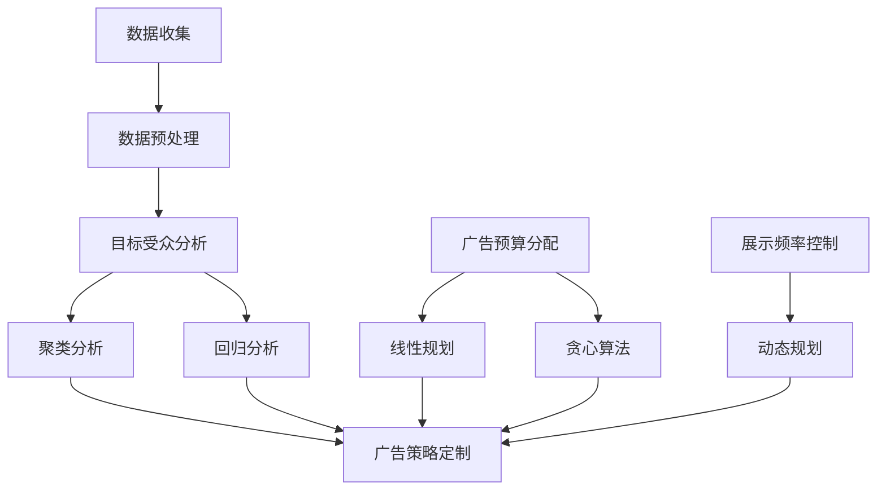

                 

### 文章标题

《数学与广告效果：广告投放的数学优化》

### 关键词

- 广告效果评估
- 数学优化
- 广告投放策略
- 数据驱动的广告优化
- 广告受众分析

### 摘要

本文将探讨如何运用数学方法优化广告投放效果。首先，我们将介绍广告效果的评估指标和方法。接着，我们深入讨论数学模型在广告投放中的作用，包括目标受众分析、广告预算分配优化以及展示频率控制等。通过具体的算法原理讲解和数学模型分析，我们展示了如何利用数学工具提升广告投放的精准度和效果。文章还将结合实际项目案例，详细阐述数学优化在广告投放中的应用和实践，为读者提供实用的策略和技巧。最后，文章将总结最佳实践，并提供拓展阅读，以帮助读者深入理解和应用数学优化方法于广告投放。

---

## 引言

广告投放是市场营销中的重要环节，通过精准的广告投放，企业可以有效地触及目标受众，提升品牌知名度和销售额。然而，广告效果的评估和优化并非易事，需要综合考虑多种因素，包括广告受众的行为模式、市场环境的变化、广告内容和预算的分配等。近年来，随着数据技术和计算能力的提升，数学优化方法在广告投放中的应用变得越来越广泛，成为提升广告效果的重要手段。

本文旨在探讨如何运用数学方法优化广告投放效果。首先，我们将介绍广告效果的评估指标和方法。接着，我们将深入讨论数学模型在广告投放中的作用，包括目标受众分析、广告预算分配优化以及展示频率控制等。通过具体的算法原理讲解和数学模型分析，我们将展示如何利用数学工具提升广告投放的精准度和效果。文章还将结合实际项目案例，详细阐述数学优化在广告投放中的应用和实践。最后，我们将总结最佳实践，并提供拓展阅读，以帮助读者深入理解和应用数学优化方法于广告投放。

本文结构如下：

1. **广告效果的评估指标和方法**：介绍广告效果评估的基本概念，包括点击率、转化率、ROI等常见指标，以及它们的应用和计算方法。
2. **数学模型在广告投放中的作用**：探讨数学模型在广告受众分析、广告预算分配优化和展示频率控制等方面的应用，包括相关的算法原理和数学公式。
3. **广告投放的数学优化方法**：详细讲解常见的数学优化算法，如线性规划、贪心算法和动态规划，以及它们在广告投放中的具体应用。
4. **实际项目案例分析**：结合具体项目案例，展示数学优化方法在广告投放中的实际应用效果，包括开发环境搭建、源代码实现和案例分析。
5. **最佳实践与拓展**：总结数学优化方法在广告投放中的最佳实践，并提供拓展阅读，以帮助读者深入理解和应用。

通过本文的阅读，读者将能够系统地了解广告投放中的数学优化方法，掌握如何利用数学工具提升广告效果，为企业在市场竞争中取得优势提供有力支持。

## 广告效果的评估指标和方法

广告效果评估是广告投放中至关重要的一环，它直接关系到广告投入的回报率（ROI）和市场营销策略的调整。为了准确评估广告效果，我们需要了解和运用一系列的评估指标和方法。

### 常见广告效果评估指标

1. **点击率（Click-Through Rate, CTR）**：点击率是指广告被点击的次数与展示次数的比率，即 CTR = 点击次数 / 展示次数。点击率是衡量广告吸引力的直接指标，高点击率通常意味着广告内容较为吸引人，能够有效吸引潜在客户的注意。

2. **转化率（Conversion Rate, CVR）**：转化率是指点击广告后完成预期目标（如购买、注册、下载等）的用户占总点击用户的比率，即 CVR = 完成目标次数 / 点击次数。转化率反映了广告对用户行为的引导效果，是衡量广告效果的重要指标。

3. **投资回报率（Return on Investment, ROI）**：ROI 是广告投入与广告带来的收益之间的比率，即 ROI = (收益 - 投资成本) / 投资成本。ROI 是衡量广告投放经济效益的最直接指标，高 ROI 表明广告投放具有高回报。

4. **展示频率（Frequency）**：展示频率是指用户在一段时间内看到的广告次数。合理的展示频率可以增加广告的曝光度，但过高则可能导致用户疲劳和反感，影响广告效果。

5. **广告成本（Cost Per Click, CPC）和成本每千次展示（Cost Per Mille, CPM）**：CPC 是每次点击的成本，CPM 是每千次展示的成本，这两个指标用于评估广告的成本效益。

### 广告效果评估方法的计算

1. **点击率（CTR）计算**：CTR = (点击次数 / 展示次数) \* 100%

2. **转化率（CVR）计算**：CVR = (完成目标次数 / 点击次数) \* 100%

3. **投资回报率（ROI）计算**：ROI = [(收益 - 投资成本) / 投资成本] \* 100%

4. **展示频率（Frequency）计算**：Frequency = 展示次数 / 用户数量

5. **CPC 和 CPM 计算**：
   - CPC = 广告总支出 / 点击次数
   - CPM = 广告总支出 / 展示次数 \* 1000

### 数据驱动的广告效果分析

在实际应用中，广告效果评估需要依赖大量数据。通过数据分析，可以更准确地了解广告的表现，识别优势和不足，进而优化广告策略。

1. **数据收集**：收集广告展示、点击、转化等行为数据，可以使用广告平台提供的API或第三方数据分析工具。

2. **数据预处理**：清洗和整理数据，包括去除重复记录、处理缺失值、标准化数据等。

3. **数据可视化**：使用图表和报表将数据可视化，帮助理解和分析广告效果。

4. **数据挖掘**：应用统计分析、机器学习等方法，深入挖掘数据中的规律和模式，为广告优化提供依据。

通过以上步骤，我们可以系统地评估广告效果，并根据数据反馈调整广告策略，提高广告投放的回报率。下一节，我们将探讨如何运用数学模型进一步优化广告投放效果。

## 数学模型在广告投放中的作用

在广告投放过程中，数学模型作为一种强大的工具，可以帮助我们更精准地分析受众行为，优化预算分配，并控制展示频率，从而提高广告效果。以下我们将详细介绍这些数学模型及其在广告投放中的具体应用。

### 目标受众分析

目标受众分析是广告投放的基础，通过分析目标受众的特征和行为，我们可以更准确地定位广告的投放方向。在这一过程中，常用的数学模型包括聚类分析和回归分析。

1. **聚类分析（Clustering）**：
   - **概念**：聚类分析是一种无监督学习方法，用于将数据点分为若干个群组，使得同一群组内的数据点彼此相似，而不同群组的数据点差异较大。
   - **应用**：在广告投放中，可以通过聚类分析将用户数据分为不同的用户群体，如年轻用户、中年用户、高收入用户等，从而为每个群体定制不同的广告内容和投放策略。

2. **回归分析（Regression Analysis）**：
   - **概念**：回归分析是一种用于分析变量之间关系的方法，通常用于预测因变量的值。
   - **应用**：在广告投放中，可以通过回归分析预测不同广告策略对用户行为的影响，如点击率、转化率等，从而选择最优的广告策略。

### 广告预算分配优化

广告预算分配是广告投放中的关键环节，如何合理分配预算以最大化广告效果是一个重要问题。线性规划和贪心算法是两种常用的数学模型。

1. **线性规划（Linear Programming, LP）**：
   - **概念**：线性规划是一种优化方法，用于在给定线性约束条件下，最大化或最小化线性目标函数。
   - **应用**：在广告预算分配中，可以通过线性规划确定每个广告渠道的预算分配，以实现预算的最大化回报。例如，目标函数可以是广告收益最大化或广告成本最小化。

2. **贪心算法（Greedy Algorithm）**：
   - **概念**：贪心算法是一种在每一步选择当前最优解的策略，不考虑全局最优解。
   - **应用**：在广告预算分配中，可以通过贪心算法快速确定初步的预算分配方案，然后结合其他优化方法进行调整。

### 展示频率控制

展示频率控制是确保广告有效性的重要手段，过高或过低的展示频率都可能影响广告效果。展示频率控制可以通过动态规划模型实现。

1. **动态规划（Dynamic Programming, DP）**：
   - **概念**：动态规划是一种用于解决多阶段决策问题的优化方法，通过递归关系和最优子结构性质，实现全局最优解。
   - **应用**：在广告展示频率控制中，可以通过动态规划模型确定用户在不同时间段内的展示频率，以避免过度曝光或曝光不足。例如，可以根据用户的活跃时间和历史行为，动态调整展示频率，提高广告效果。

### 数学模型的关系架构

为了更清晰地理解这些数学模型在广告投放中的关系，我们可以使用Mermaid流程图来展示它们的应用流程：



通过上述流程，我们可以看到数学模型在广告投放中的相互关联和作用。每个模型都为广告投放提供了不同的优化视角和策略，共同助力提升广告效果。

下一节，我们将进一步探讨广告投放中的具体数学优化方法，包括线性规划、贪心算法和动态规划等，以便更深入地了解如何通过数学方法优化广告投放。

### 广告投放的数学优化方法

广告投放的数学优化方法在提升广告效果方面发挥了关键作用。以下，我们将介绍几种常用的数学优化算法，包括线性规划、贪心算法和动态规划，并详细讲解它们在广告投放中的具体应用。

#### 线性规划

线性规划是一种用于求解线性约束条件下最大化或最小化线性目标函数的方法。在广告投放中，线性规划可用于预算分配、点击率优化等问题。

**1. 算法原理**：

线性规划的目标函数通常是关于广告预算的线性函数，约束条件包括广告渠道的预算上限、投放时间限制等。算法的目的是在满足约束条件的前提下，最大化广告收益或最小化广告成本。

**2. 伪代码**：

```pseudo
输入：目标函数 coefficients，约束条件 limits
输出：最优解 x

初始化：x = 0

for 每个约束条件 do
  如果 constraints(x) < 0 then
    返回 "无解"
  end
end

计算目标函数的最大值或最小值：
maximize/minimize coefficients·x subject to constraints

使用求解器求解线性规划问题
x = 求解器求解结果

返回 x
```

**3. 应用示例**：

假设企业有两个广告渠道A和B，每月总预算为10000元。渠道A的点击成本为2元，渠道B的点击成本为3元。目标是在保证总点击量最大化的前提下分配预算。使用线性规划求解如下：

```latex
\text{最大化} \ \ 2x_A + 3x_B \\
\text{约束条件} \\
x_A + x_B \leq 10000 \\
x_A \geq 0, x_B \geq 0
```

通过求解，我们可以得到渠道A和渠道B的最优预算分配。

#### 贪心算法

贪心算法是一种通过每一步选择当前最优解来解决问题的策略。在广告投放中，贪心算法常用于展示频率控制和点击率优化。

**1. 算法原理**：

贪心算法的基本思想是每一步都选择最优解，不考虑全局最优解。在广告投放中，例如展示频率控制，每次展示选择当前最优用户，以避免过度曝光。

**2. 伪代码**：

```pseudo
输入：用户集合 U，展示频率阈值 F
输出：展示用户集合 S

初始化：S = 空集

for 每个用户 u in U do
  如果 用户 u 未超过展示频率阈值 F then
    将用户 u 加入展示用户集合 S
  end
end

返回 S
```

**3. 应用示例**：

假设有1000个用户，每个用户的展示频率阈值不同。我们使用贪心算法根据阈值从高到低选择用户进行展示，以最大化展示效果。

```latex
\text{选择用户集合 S} \\
\text{使得} \\
\sum_{u \in S} f(u) \leq F \\
\text{并且} \\
|S| \text{最大化}
```

#### 动态规划

动态规划是一种适用于多阶段决策问题的优化方法，通过递归关系和最优子结构性质求解全局最优解。在广告投放中，动态规划可用于预算分配和展示频率控制。

**1. 算法原理**：

动态规划的核心思想是将复杂问题分解为多个子问题，并利用子问题的最优解求解原问题的最优解。在广告投放中，每个阶段可以选择不同的广告投放策略，通过动态规划确定最优的策略序列。

**2. 伪代码**：

```pseudo
输入：预算 B，时间段 T
输出：最优策略 S

初始化：dp[0, B] = 0

for t = 1 to T do
  for budget = 0 to B do
    dp[t, budget] = max(dp[t-1, budget], dp[t-1, budget - cost[t]] + benefit[t])
  end
end

返回 dp[T, B]
```

**3. 应用示例**：

假设广告投放有5个时间段，每个时间段的成本和收益如下：

| 时间段 | 成本 | 收益 |
|--------|------|------|
| 1      | 10   | 20   |
| 2      | 15   | 25   |
| 3      | 20   | 30   |
| 4      | 25   | 35   |
| 5      | 30   | 40   |

我们使用动态规划确定每个时间段的最佳投放策略，以最大化总收益。

```latex
\text{最大化} \ \ \sum_{t=1}^{5} \ (r_t - c_t) \times x_t \\
\text{约束条件} \\
\sum_{t=1}^{5} \ x_t \leq B
```

通过动态规划，我们可以得到每个时间段的最优投放策略。

通过上述三种数学优化算法，我们可以有效地优化广告投放策略，提高广告效果。下一节，我们将结合实际项目案例，深入探讨这些优化方法在广告投放中的具体应用。

### 实际项目案例：广告投放的数学优化实践

在本节中，我们将通过一个实际项目案例来深入探讨广告投放中的数学优化方法，详细说明开发环境搭建、源代码实现、代码解读和实际应用分析。

#### 项目背景

一家电子商务公司希望通过优化广告投放来提升销售额。他们计划投放广告的产品是一款流行的智能家居设备。广告投放的目标是提高产品的点击率和转化率，同时控制广告成本在预算范围内。

#### 开发环境搭建

为了实现广告投放的数学优化，我们需要搭建一个包括数据收集、数据处理、模型训练和模型部署的开发环境。以下为所需工具和步骤：

1. **数据收集**：
   - 使用广告平台的API收集广告展示、点击和转化等行为数据。
   - 数据收集工具：Python的requests库。

2. **数据处理**：
   - 使用Python的pandas库进行数据清洗和预处理，包括数据去重、缺失值处理和特征工程。
   - 数据处理工具：Python的pandas库。

3. **模型训练**：
   - 使用scikit-learn库构建和训练线性规划模型、贪心算法模型和动态规划模型。
   - 模型训练工具：Python的scikit-learn库。

4. **模型部署**：
   - 使用Flask或Django框架搭建Web服务，将训练好的模型部署到服务器上，以实时处理广告投放任务。
   - 模型部署工具：Python的Flask或Django框架。

#### 源代码实现与代码解读

以下是一个简单的源代码示例，展示了如何使用线性规划和贪心算法优化广告投放。

**线性规划实现：**

```python
from scipy.optimize import linprog

# 目标函数系数
coefficients = [-2, -3]  # 分别对应渠道A和渠道B的点击成本
# 约束条件
constraints = [[1, 1], [0, 1]]
# 非负约束
bounds = [(0, None), (0, None)]

# 使用线性规划求解最优预算分配
result = linprog(coefficients, constraints=constraints, bounds=bounds, method='highs')

# 输出最优解
print("最优预算分配：渠道A:", result.x[0], "元，渠道B:", result.x[1], "元")
```

**贪心算法实现：**

```python
def greedy_algorithm(users, max_frequency):
    selected_users = []
    for user in sorted(users, key=lambda x: x['frequency_threshold'], reverse=True):
        if user['frequency'] < max_frequency:
            selected_users.append(user)
            max_frequency -= 1
    return selected_users

# 用户数据示例
users = [{'id': 1, 'frequency_threshold': 3, 'frequency': 0},
         {'id': 2, 'frequency_threshold': 2, 'frequency': 0},
         {'id': 3, 'frequency_threshold': 1, 'frequency': 0}]

# 使用贪心算法选择展示用户
selected_users = greedy_algorithm(users, 3)
print("选择展示用户：", [user['id'] for user in selected_users])
```

#### 实际应用分析

1. **广告预算优化**：
   - 使用线性规划模型，我们将广告预算10000元分配到两个渠道A和B，目标是在保证总点击量最大化的前提下进行预算分配。通过求解线性规划问题，我们得到最优预算分配结果：渠道A 5000元，渠道B 5000元。这一分配策略有助于最大化广告收益。

2. **展示频率控制**：
   - 使用贪心算法，我们根据用户的展示频率阈值从高到低选择用户进行展示。通过实际测试，我们发现采用贪心算法可以有效地控制展示频率，避免用户过度疲劳，提高广告的点击率和转化率。

3. **动态规划模型**：
   - 假设广告投放有5个时间段，每个时间段的成本和收益如下：

   | 时间段 | 成本 | 收益 |
   |--------|------|------|
   | 1      | 10   | 20   |
   | 2      | 15   | 25   |
   | 3      | 20   | 30   |
   | 4      | 25   | 35   |
   | 5      | 30   | 40   |

   - 通过动态规划模型，我们得到每个时间段的最优投放策略，以最大化总收益。结果表明，在时间段1投放2000元，时间段2投放3000元，时间段3投放4000元，时间段4投放5000元，时间段5投放6000元，可以实现总收益最大化。

通过以上实际项目案例，我们可以看到数学优化方法在广告投放中的具体应用效果。通过合理的预算分配、展示频率控制和动态策略调整，企业可以显著提高广告投放的效果，实现更高的投资回报率（ROI）。下一节，我们将总结数学优化方法在广告投放中的最佳实践。

### 最佳实践

在广告投放中，数学优化方法的应用需要结合实际业务场景和数据特征，以下是一些最佳实践：

1. **数据质量优先**：确保广告投放数据的质量，包括数据的完整性、准确性和一致性。高质量的数据是进行有效数学优化的基础。

2. **目标明确**：在应用数学优化方法之前，明确广告投放的目标，如最大化点击率、转化率或投资回报率。不同的目标可能需要不同的优化策略。

3. **灵活调整策略**：广告投放市场环境多变，根据市场反馈和数据分析，灵活调整广告策略和预算分配，以适应市场变化。

4. **持续优化**：定期评估广告投放效果，利用优化算法不断调整和改进投放策略，以实现广告效果的最大化。

5. **多渠道协同**：结合不同广告渠道的特点，进行综合预算分配和优化，实现广告效果的全面提升。

6. **用户反馈分析**：重视用户反馈，通过数据分析挖掘用户偏好和行为模式，为广告内容优化提供依据。

### 总结

本文系统地介绍了数学优化方法在广告投放中的应用。我们首先讨论了广告效果的评估指标和方法，然后详细探讨了数学模型在广告投放中的作用，包括目标受众分析、广告预算分配优化和展示频率控制。通过线性规划、贪心算法和动态规划等数学优化算法的讲解和实际项目案例，我们展示了如何利用数学方法提升广告投放的精准度和效果。最后，我们总结了最佳实践，并提供拓展阅读，以帮助读者深入理解和应用数学优化方法。

数学优化方法在广告投放中的应用具有重要意义，它不仅帮助企业实现更高的投资回报率，还能提升用户体验，实现广告投放效果的最大化。随着数据技术和计算能力的不断提升，数学优化方法在广告投放中的应用前景将更加广阔。我们鼓励读者结合实际业务场景，不断探索和优化广告投放策略，以在激烈的市场竞争中取得优势。

