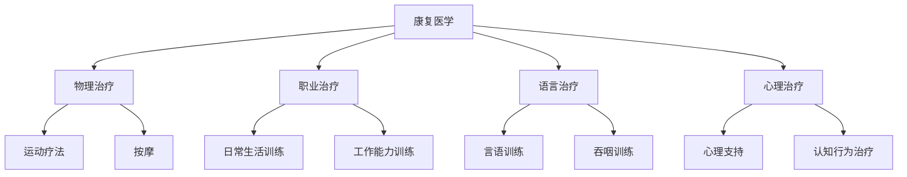

                 

### 1. 康复医学概述

康复医学是一门旨在通过综合手段帮助患者恢复功能、减轻痛苦、提高生活质量的医学学科。其核心在于帮助患者在生理、心理和社会功能方面实现全面恢复。康复医学涉及多个领域，包括物理治疗、职业治疗、语言治疗、心理治疗等，每一种方法都有其独特的优势和适用场景。

**康复医学的定义与目标**

康复医学的定义多种多样，但其核心是相同的，即通过多种手段促进患者功能恢复，提高其生活质量。国际上，康复医学通常被定义为“通过综合性的措施，最大限度地恢复患者功能独立性，使其能够回归社会和职业生活”。这一定义强调了康复医学的两个主要目标：功能恢复和生活质量提高。

**康复医学的分类与主要方法**

康复医学的分类根据其治疗方法的不同，可分为以下几类：

1. **物理治疗**：包括运动疗法、按摩、电疗、热疗等，旨在通过物理手段改善患者的生理功能。

2. **职业治疗**：通过指导患者进行日常生活活动、工作任务的训练，帮助其恢复生活和工作能力。

3. **语言治疗**：针对言语障碍、吞咽困难等问题，通过训练改善患者的言语功能。

4. **心理治疗**：帮助患者处理与疾病相关的心理问题，如焦虑、抑郁等。

5. **康复护理**：为患者提供日常护理，协助其完成康复训练。

**康复医学与数学的关系**

康复医学与数学之间的联系主要体现在康复进程的量化评估上。数学模型被广泛应用于康复评估，如肌力评估、平衡评估等。通过数学模型，可以精确地量化患者的康复进程，为康复治疗提供科学依据。例如，在肌力评估中，常用的测量指标包括握力、背肌力等，这些指标可以通过数学公式进行计算和评估。此外，康复进程的预测模型、回归分析等也常被应用于康复医学中，以优化治疗方案和评估治疗效果。

通过上述分析，我们可以看到康复医学的广泛性和复杂性，以及数学在其中的重要作用。接下来，我们将深入探讨康复进程评估的数学模型，以及如何利用这些模型对患者的康复进程进行科学、准确的评估。

### 康复进程评估的数学模型

康复进程评估的数学模型是康复医学中的一个重要工具，它用于量化患者的康复进展，为康复治疗提供科学依据。数学模型在康复医学中的应用广泛，包括肌力评估、平衡评估、功能独立性评估等。这些模型不仅可以提供定量的评估结果，还可以通过预测患者未来的康复进程，为治疗方案的调整提供指导。

#### 康复进程评估的概念与重要性

康复进程评估是指通过对患者的功能状态进行定量分析，以评估其康复进展的过程。这种评估不仅包括患者当前的功能状态，还包括患者过去的功能变化和未来可能的康复趋势。康复进程评估在康复治疗中具有以下重要性：

1. **治疗效果评估**：通过康复进程评估，可以客观地评估治疗的效果，判断康复措施的合理性和有效性。
2. **康复方案的调整**：康复进程评估结果可以指导医生和康复治疗师根据患者的实际康复情况，及时调整康复方案，以实现最佳的治疗效果。
3. **预后预测**：通过康复进程评估，可以预测患者未来的康复趋势，帮助制定长期康复计划和预期目标。

#### 数学模型在康复进程评估中的应用

数学模型在康复进程评估中的应用主要体现在以下几个方面：

1. **肌力评估**：肌力评估是康复医学中常用的评估方法之一。常用的数学模型包括回归模型、多项式模型等。通过这些模型，可以量化患者的肌力水平，并预测其康复进展。例如，一种常见的肌力评估模型是：
   $$
   F(t) = \alpha \cdot t^{\beta}
   $$
   其中，\( F(t) \) 表示在时间 \( t \) 时的肌力水平，\( \alpha \) 和 \( \beta \) 是模型的参数。

2. **平衡评估**：平衡评估用于评估患者的平衡能力。常用的数学模型包括动态稳定性模型、中心质心模型等。这些模型可以量化患者的平衡状态，并预测其在不同情境下的稳定性。例如，一个简单的中心质心模型可以表示为：
   $$
   s = \frac{m_1 \cdot d_1 + m_2 \cdot d_2}{m_1 + m_2}
   $$
   其中，\( s \) 是质心的位置，\( m_1 \) 和 \( m_2 \) 是两个质点的质量，\( d_1 \) 和 \( d_2 \) 是两个质点到质心的距离。

3. **功能独立性评估**：功能独立性评估用于评估患者日常生活中的自理能力。常用的数学模型包括Barthel指数和Katz指数等。这些模型通过一系列指标量化患者的自理能力，并计算出一个总得分，以评估其功能独立性。例如，Barthel指数的计算方法如下：
   $$
   BI = \sum_{i=1}^{n} w_i \cdot x_i
   $$
   其中，\( BI \) 是Barthel指数得分，\( w_i \) 是第 \( i \) 个指标的权重，\( x_i \) 是第 \( i \) 个指标的实际得分。

#### 康复进程评估的数学模型类型

康复进程评估的数学模型类型多样，主要包括以下几种：

1. **线性模型**：线性模型是最基本的数学模型之一，通常用于描述变量之间的线性关系。在康复医学中，线性模型常用于评估肌力、平衡等简单关系的变量。

2. **非线性模型**：非线性模型用于描述变量之间的非线性关系。在康复医学中，非线性模型常用于评估复杂的康复进程，如肌力增长、平衡能力的提升等。

3. **混合模型**：混合模型结合了线性模型和非线性模型的特点，可以同时描述变量之间的线性关系和非线性关系。在康复医学中，混合模型常用于综合评估患者的康复进程。

通过上述分析，我们可以看到数学模型在康复进程评估中的重要性和多样性。数学模型不仅为康复医学提供了量化的评估工具，还为康复治疗提供了科学依据。在下一部分中，我们将进一步探讨康复进程评估的关键指标，包括功能独立性评估、肌肉力量与耐力评估、运动控制与平衡评估等。

### 康复进程评估的关键指标

康复进程评估的关键指标是衡量患者康复状况的重要工具，它们能够提供定量化的数据，帮助康复医生和物理治疗师更好地了解患者的康复进展，从而制定更加个性化的治疗方案。以下是几种主要的康复进程评估指标：

#### 功能独立性评估

功能独立性评估（Functional Independence Measure, FIM）是康复医学中最常用的评估工具之一。FIM主要评估患者在日常生活中完成各种活动的独立性，如穿衣、进食、洗漱、上厕所等。FIM通过一系列标准化的评估项目，将患者的独立性划分为7个等级，从最高级别的完全独立（FIM得分15分）到完全依赖（FIM得分1分）。FIM得分越高，表示患者的独立性越强。

- **计算方法**：FIM得分通过评估患者在每项活动中的得分（1-7分），然后将所有活动得分相加得到总得分。
  $$
  FIM = \sum_{i=1}^{n} (7 - x_i)
  $$
  其中，\( x_i \) 是第 \( i \) 项活动的得分。

- **应用实例**：例如，一个患者在穿衣项目中的得分为3分（部分需要帮助），在进食项目中得分为5分（完全独立），那么他的FIM得分计算为：
  $$
  FIM = (7 - 3) + (7 - 5) = 4 + 2 = 6
  $$

#### 肌肉力量与耐力评估

肌肉力量和耐力评估用于评估患者的肌肉功能和运动能力，通常通过握力测试、背肌力测试等方法进行。

- **握力测试**：握力测试是通过测量患者双手握紧测力计时所能达到的最大力量来评估手部肌肉力量。握力测试结果以千克（kg）为单位记录。
  $$
  G = \text{最大握力（kg）}
  $$

- **背肌力测试**：背肌力测试是通过测量患者最大背伸力来评估背部肌肉力量。背肌力测试结果也以千克（kg）为单位记录。
  $$
  B = \text{最大背伸力（kg）}
  $$

- **应用实例**：假设一个患者在握力测试中达到的最大力量为20kg，在背肌力测试中达到的最大力量为30kg，那么他的肌肉力量评估结果为：
  $$
  G = 20\text{kg}, \quad B = 30\text{kg}
  $$

#### 运动控制与平衡评估

运动控制与平衡评估用于评估患者的运动能力和平衡能力，常用的方法包括闭眼站立测试、Romberg测试等。

- **闭眼站立测试**：闭眼站立测试是评估患者站立时平衡能力的简单方法。患者被要求闭上眼睛站立，观察其是否能保持平衡。通常，该测试结果分为三级：能保持平衡、摇晃但未跌倒、无法保持平衡。
  $$
  \text{闭眼站立测试结果} = \text{能保持平衡} \quad \text{或} \quad \text{摇晃但未跌倒} \quad \text{或} \quad \text{无法保持平衡}
  $$

- **Romberg测试**：Romberg测试是通过要求患者双足并拢站立，闭上眼睛并双臂前伸来判断其平衡能力。该测试结果也分为三级。
  $$
  \text{Romberg测试结果} = \text{稳定} \quad \text{或} \quad \text{轻度摇晃} \quad \text{或} \quad \text{无法站立}
  $$

- **应用实例**：如果一个患者闭眼站立测试结果为“能保持平衡”，Romberg测试结果为“稳定”，则说明其平衡能力良好。

通过上述关键指标的评估，康复医生和物理治疗师可以全面了解患者的康复状况，为制定个性化的康复方案提供科学依据。这些指标不仅帮助量化患者的康复进展，还为治疗效果的评估和康复预后的预测提供了重要信息。

### 康复进程评估方法介绍

康复进程评估方法在康复治疗中扮演着至关重要的角色，它们帮助医生和康复治疗师量化患者的康复进展，为治疗方案的调整提供依据。康复进程评估方法可以分为量化评估方法、定性评估方法和综合评估方法。每种方法都有其独特的优势和适用范围，下面将详细介绍这些评估方法。

#### 量化评估方法

量化评估方法是通过使用具体的测量工具或量表来量化患者的康复进程。这种方法能够提供客观、标准化的评估结果，使不同时间和不同地点的评估结果具有可比性。

1. **功能独立性评估量表**：如Barthel指数（Barthel Index, BI）和Katz指数（Katz Index of Independence in Activities of Daily Living, ADL-I）。这些量表通过评估患者在日常生活活动中的独立性，将康复进程量化为具体的分数，从而为治疗方案的调整提供依据。

2. **肌力评估工具**：如握力计、背肌力测试器等，这些工具可以精确测量患者的肌肉力量，从而为康复治疗提供科学依据。

3. **平衡功能评估工具**：如动态平衡评估板、平衡测试仪等，这些工具可以量化患者的平衡能力，帮助康复医生评估患者的康复进程。

#### 定性评估方法

定性评估方法通常依赖于医生或康复治疗师的观察和主观判断，通过描述性的语言来评估患者的康复进程。这种方法可以提供对康复进程的全面了解，尤其是在量化评估方法无法全面反映患者状况时。

1. **临床观察**：康复医生通过直接观察患者的运动能力、行为表现等，评估其康复进展。

2. **康复治疗师的评估**：康复治疗师通过观察患者在接受治疗过程中的反应和进步，对患者的康复进程进行评估。

#### 综合评估方法

综合评估方法结合了量化评估方法和定性评估方法，通过多方面的信息来评估患者的康复进程。这种方法能够提供更全面、准确的康复评估结果。

1. **多维度评估**：综合评估方法通过评估患者的生理功能、心理状态、社会适应能力等多个维度，全面了解患者的康复进程。

2. **患者自我评估**：患者自我评估是综合评估方法的重要组成部分。患者通过自我评估，可以更直观地了解自己的康复进展，同时也可以帮助医生和康复治疗师了解患者的实际感受和需求。

#### 评估方法的优缺点分析

- **量化评估方法**：
  - **优点**：客观、标准、可比性强，适合大规模研究。
  - **缺点**：可能无法全面反映患者的个体差异，部分指标可能受外界环境影响。

- **定性评估方法**：
  - **优点**：能够提供丰富的、个体化的信息，适合小型研究或特殊患者群体。
  - **缺点**：主观性强，不同评估者可能存在差异。

- **综合评估方法**：
  - **优点**：能够全面反映患者的康复进程，适合复杂病例或多维度康复评估。
  - **缺点**：评估过程复杂，需要多方面的专业知识和技能。

通过多种评估方法的综合应用，康复医生和康复治疗师可以更全面地了解患者的康复进程，从而制定更科学、更有效的康复治疗方案。在下一部分中，我们将通过具体案例分析康复进程评估方法在实际应用中的效果。

### 康复进程评估案例分析

在康复医学实践中，康复进程评估方法的实际应用效果可以通过具体案例进行展示。以下是三个典型的康复进程评估案例分析，涵盖了不同类型的康复进程评估方法，包括量化评估、定性评估和综合评估。

#### 案例一：脑卒中康复进程评估

**背景**：患者，男性，65岁，因脑卒中导致右侧肢体瘫痪，需要进行长期的康复治疗。

**评估方法**：
- **量化评估**：使用Barthel指数（BI）评估患者的生活自理能力。初始BI得分为30分（完全依赖），经过三个月的康复治疗，BI得分提高到60分（部分依赖）。
- **定性评估**：康复医生和物理治疗师通过定期观察患者的运动能力和日常生活表现，发现患者的运动协调性逐渐改善，日常活动能力增强。
- **综合评估**：结合BI得分和定性评估，康复团队决定调整康复方案，增加力量训练和平衡训练。

**效果**：经过六个月的康复治疗，患者的BI得分进一步提升到90分（基本独立），右侧肢体功能基本恢复正常，生活质量显著提高。

#### 案例二：骨折康复进程评估

**背景**：患者，女性，45岁，因骨折导致膝关节活动受限，需要进行康复治疗。

**评估方法**：
- **量化评估**：使用握力计和背肌力测试器评估患者的肌肉力量。初始握力为20kg，背肌力为25kg。经过一个月的康复训练，握力提高到25kg，背肌力提高到30kg。
- **定性评估**：康复医生和物理治疗师观察患者的膝关节活动度，发现关节活动范围从初始的50度增加到90度。
- **综合评估**：结合量化评估和定性评估，康复团队认为患者的康复进展符合预期，决定继续进行康复训练，并增加关节活动度的训练。

**效果**：经过三个月的康复治疗，患者的膝关节活动度进一步增加到120度，肌肉力量和关节稳定性显著提高，能够恢复正常工作和生活。

#### 案例三：慢性疼痛康复进程评估

**背景**：患者，女性，50岁，患有慢性下腰痛，需要进行康复治疗。

**评估方法**：
- **量化评估**：使用视觉模拟评分法（VAS）评估患者的疼痛程度。初始VAS评分为8分（中度疼痛）。经过一个月的康复治疗，VAS评分降至4分（轻度疼痛）。
- **定性评估**：患者自述疼痛减轻，生活质量有所改善。
- **综合评估**：康复团队根据量化评估和定性评估结果，决定增加认知行为疗法和心理支持，以帮助患者更好地管理疼痛和压力。

**效果**：经过六个月的康复治疗，患者的VAS评分降至1分（无疼痛），慢性疼痛症状明显缓解，生活质量显著提高。

通过这些案例，我们可以看到，不同的康复进程评估方法在实际应用中各具优势，结合使用可以更全面地反映患者的康复进程，为治疗方案的调整提供科学依据。量化评估提供了客观的数值，定性评估提供了细致的观察结果，综合评估则结合了多方面的信息，为康复医学的实践提供了有力的支持。

### 康复进程评估的挑战与展望

在康复医学中，康复进程评估虽然取得了显著的进展，但仍面临诸多挑战。这些挑战不仅影响了评估的准确性，也限制了康复治疗的效果。以下是康复进程评估面临的主要挑战及其发展趋势。

#### 挑战

1. **个体差异**：每位患者的康复进程都是独特的，受年龄、性别、健康状况等多种因素影响。现有的评估方法往往无法全面反映个体差异，导致评估结果不够准确。

2. **评估方法的多样性**：康复进程评估涉及多种方法，如量化评估、定性评估和综合评估。然而，不同方法之间存在较大的差异，如何有效地整合这些方法是一个难题。

3. **评估的标准化**：康复进程评估需要标准化的工具和方法，以确保评估结果的可比性和可靠性。然而，现有的评估工具和方法尚未完全标准化，导致评估结果的解释和比较存在困难。

4. **数据收集和处理**：康复进程评估需要收集大量的数据，包括生理、心理和社会功能等方面的信息。数据收集和处理的高成本和复杂性也是一大挑战。

5. **评估的动态性**：康复进程是一个动态变化的过程，患者在不同时间点的康复状况可能有所不同。如何动态地评估患者的康复进程，并及时调整治疗方案，是一个亟待解决的问题。

#### 发展趋势

1. **个性化评估**：随着人工智能和大数据技术的发展，康复进程评估正逐渐向个性化评估方向演进。通过分析患者的个体信息，可以制定更加个性化的康复方案，提高评估的准确性和治疗效果。

2. **多模态评估**：结合多种评估方法，如量化评估、定性评估和生物标志物检测等，可以更全面地评估患者的康复进程。多模态评估有助于提高评估的准确性和可靠性。

3. **标准化与规范化**：为提高评估的标准化和规范化，各国政府和专业组织正在制定统一的康复进程评估标准和指南。这将有助于确保评估结果的准确性和可比性。

4. **实时评估与反馈**：利用传感器技术和移动设备，可以实现康复进程的实时评估和反馈。实时评估可以及时发现问题，为康复医生和患者提供即时的治疗建议。

5. **数据共享与集成**：通过建立康复进程数据共享平台，可以实现不同康复机构之间的数据共享和集成。这将有助于积累大量康复数据，为康复医学研究提供有力的支持。

总之，康复进程评估在康复医学中具有重要地位。尽管面临诸多挑战，但通过不断探索和创新，康复进程评估的未来发展前景依然广阔。随着科技的进步和评估方法的不断完善，康复进程评估将更加精准、高效，为康复医学的发展提供坚实的支持。

### 康复进程评估工具介绍

在康复进程中，使用评估工具能够帮助医生和康复治疗师对患者的康复状况进行准确的量化，从而制定和调整治疗方案。以下是几种常用的康复进程评估工具及其使用方法和注意事项。

#### 功能独立性评估工具

**Barthel指数（Barthel Index, BI）**

**使用方法**：Barthel指数通过评估患者在不同日常生活活动中的独立性，包括进食、洗漱、穿衣、上厕所等，每个活动都有不同的评分标准。治疗师或医生根据患者的实际表现给予相应的评分，总分数范围为0-100分。

**注意事项**：在进行BI评估时，治疗师或医生需要确保评估环境一致，并给予患者充分的解释和指导，以确保评分的准确性。

**Katz指数（Katz Index of Independence in Activities of Daily Living, ADL-I）**

**使用方法**：Katz指数主要评估患者完成基本日常生活活动的能力，包括穿衣、转移、洗澡、如厕等，每个活动都有三个评分等级：完全独立、部分依赖、完全依赖。

**注意事项**：Katz指数在评估时同样需要确保评估环境一致，并且评估者应熟悉评分标准，避免主观偏差。

#### 肌肉力量与耐力评估工具

**握力计**

**使用方法**：握力计是一种用于测量手部肌肉力量的工具。患者用力握住握力计，测量其最大握力值，通常以千克（kg）为单位。

**注意事项**：进行握力测试时，患者应保持自然姿势，测试前应进行适当的预热活动，以避免受伤。

**背肌力测试器**

**使用方法**：背肌力测试器用于测量背部肌肉的力量。患者站立，双手紧握测试器的手柄，测试器会测量其最大背伸力。

**注意事项**：进行背肌力测试时，确保患者的姿势正确，避免过度用力或姿势不当导致受伤。

#### 运动控制与平衡评估工具

**动态平衡评估板**

**使用方法**：动态平衡评估板是一种用于评估患者动态平衡能力的工具。患者站在平衡板上，尝试保持平衡，评估板会记录患者的平衡状态和平衡能力。

**注意事项**：进行动态平衡评估时，确保患者的安全，避免在评估过程中摔倒造成伤害。

**平衡测试仪**

**使用方法**：平衡测试仪通过测量患者的重心变化来评估其平衡能力。患者站在测试仪上，进行一系列平衡测试，测试仪会生成详细的平衡数据。

**注意事项**：平衡测试仪的测试过程应严格按照操作规程进行，确保测试数据的准确性。

通过使用这些康复进程评估工具，医生和康复治疗师可以更准确地评估患者的康复进展，为制定和调整康复方案提供科学依据。在实际应用中，治疗师应根据患者的具体状况选择合适的评估工具，并注意评估过程中的操作规范和注意事项。

### 康复进程评估案例应用

康复进程评估在康复中心的日常工作中发挥着重要作用。通过具体的案例分析，我们可以深入了解康复进程评估在不同康复场景中的应用，以及如何通过评估工具和数据分析来制定和调整康复方案。

#### 案例一：康复中心日常康复评估

**背景**：某康复中心收治了一位70岁男性患者，因中风导致左侧肢体瘫痪，需要进行长期的康复治疗。

**评估方法**：
- **功能独立性评估**：使用Barthel指数进行评估，初始得分为40分，表示患者日常生活部分依赖。
- **肌肉力量与耐力评估**：使用握力计和背肌力测试器评估患者的肌肉力量，初始握力为15kg，背肌力为20kg。
- **平衡评估**：使用动态平衡评估板评估患者的平衡能力，初始平衡测试得分为30分（0-100分）。

**数据分析与方案调整**：
- **功能独立性评估**：经过一周的康复训练，Barthel指数提升至60分，表示患者的日常生活自理能力有所提高。
- **肌肉力量与耐力评估**：握力提升至20kg，背肌力提升至25kg，表明患者的肌肉力量和耐力有所增强。
- **平衡评估**：平衡测试得分提升至40分，表明患者的平衡能力有所改善。

根据评估结果，康复团队决定继续加强肌肉力量训练和平衡训练，同时增加日常生活活动训练，以进一步提高患者的自理能力。

**效果**：经过三个月的康复治疗，患者的Barthel指数提升至90分，握力达到25kg，背肌力达到30kg，平衡测试得分提升至80分。患者能够独立完成大部分日常生活活动，生活质量显著提高。

#### 案例二：康复护理评估

**背景**：某康复中心收治了一位因骨折导致膝关节活动受限的患者，需要进行康复护理。

**评估方法**：
- **功能独立性评估**：使用Katz指数评估患者的日常生活活动能力，初始得分为15分，表示患者需要全面护理。
- **肌肉力量与耐力评估**：使用握力计和背肌力测试器评估患者的肌肉力量，初始握力为20kg，背肌力为25kg。
- **运动控制与平衡评估**：使用闭眼站立测试和Romberg测试评估患者的运动控制和平衡能力。

**数据分析与方案调整**：
- **功能独立性评估**：经过一周的康复护理，Katz指数提升至20分，表示患者部分依赖护理。
- **肌肉力量与耐力评估**：握力提升至25kg，背肌力提升至30kg，表明患者的肌肉力量和耐力有所增强。
- **运动控制与平衡评估**：闭眼站立测试和Romberg测试结果显示，患者的运动控制和平衡能力有所改善。

根据评估结果，康复护理团队决定继续加强肌肉力量训练和平衡训练，同时增加关节活动度训练，以提高患者的关节灵活性和稳定性。

**效果**：经过三个月的康复护理，患者的Katz指数提升至40分，握力达到30kg，背肌力达到35kg，闭眼站立测试和Romberg测试得分分别提升至60分和80分。患者膝关节活动度显著改善，能够独立完成基本日常生活活动。

#### 案例三：康复医疗评估

**背景**：某康复中心收治了一位因慢性疼痛导致活动能力受限的患者，需要进行康复医疗评估。

**评估方法**：
- **功能独立性评估**：使用Barthel指数评估患者的日常生活活动能力，初始得分为50分，表示患者有一定自理能力。
- **疼痛评估**：使用视觉模拟评分法（VAS）评估患者的疼痛程度，初始VAS评分为7分（中度疼痛）。
- **心理状态评估**：使用焦虑自评量表（SAS）和抑郁自评量表（SDS）评估患者的心理状态。

**数据分析与方案调整**：
- **功能独立性评估**：经过一周的康复治疗，Barthel指数提升至70分，表示患者的日常生活自理能力有所提高。
- **疼痛评估**：VAS评分降至4分（轻度疼痛），表明患者的疼痛程度明显减轻。
- **心理状态评估**：SAS和SDS评分分别降至25分和20分，表示患者的焦虑和抑郁情绪有所缓解。

根据评估结果，康复医疗团队决定继续进行疼痛管理和心理支持治疗，同时增加功能训练和作业治疗，以帮助患者恢复生活能力。

**效果**：经过三个月的康复医疗评估，患者的Barthel指数提升至90分，VAS评分降至1分，SAS和SDS评分分别降至10分和15分。患者的生活能力和心理状态显著改善，能够恢复正常工作和生活。

通过这些案例，我们可以看到康复进程评估在康复中心的实际应用效果。通过定期评估和数据分析，康复团队能够制定和调整个性化的康复方案，提高患者的康复效果和生活质量。在下一部分中，我们将深入探讨康复进程评估的实践与讨论。

### 康复进程评估实践与讨论

康复进程评估在实践中具有重要的意义，它不仅为康复治疗提供了科学的依据，也为治疗方案的调整提供了关键信息。然而，在实际应用中，康复进程评估也面临着一些问题和挑战，需要我们深入探讨和解决。

#### 实践案例分享

以下是一些康复进程评估的实践案例，通过这些案例，我们可以了解康复进程评估在实际治疗中的应用和效果。

**案例一**：患者A，因车祸导致左下肢骨折，需要进行康复治疗。康复团队对其进行了定期的康复进程评估，包括Barthel指数、握力测试和平衡测试。评估结果显示，患者A在骨折早期阶段生活自理能力较低，握力和平衡能力较差。通过调整康复治疗方案，加强肌肉力量和平衡训练，患者在三个月后Barthel指数提高到85分，握力提高到25kg，平衡测试得分提高到70分。

**案例二**：患者B，患有慢性疼痛症，经过多种药物治疗效果不佳，转而进行康复治疗。康复团队使用疼痛评估工具（VAS评分）和功能独立性评估工具（Barthel指数）对患者进行评估。评估结果显示，患者B的疼痛程度较高，日常生活自理能力较低。通过疼痛管理和功能训练，患者B的VAS评分从7分降至3分，Barthel指数从40分提高到60分。

#### 讨论与思考

1. **评估方法的多样性**：康复进程评估需要结合多种方法，如量化评估、定性评估和综合评估。然而，在实际操作中，康复团队可能无法全面应用所有评估方法，导致评估结果不够全面。因此，我们需要在评估方法的多样性和实用性之间找到平衡。

2. **评估工具的选择和标准化**：选择合适的评估工具和确保其标准化是评估成功的关键。目前，各种评估工具繁多，不同工具的得分标准和计算方法各异，这给康复进程评估带来了一定的困难。因此，需要进一步推广和标准化常用的评估工具，提高评估结果的可靠性和可比性。

3. **数据收集和处理**：康复进程评估涉及大量的数据收集和处理工作，这不仅需要康复团队具备相应的专业技能，还需要有效的数据管理和分析工具。在实践过程中，数据收集的不完整性和处理效率低下会影响评估结果的准确性。

4. **评估的动态性和实时性**：康复进程是动态变化的，患者在不同时间点的康复状况可能有所不同。因此，评估需要具备动态性和实时性，以便及时调整治疗方案。然而，目前大多数评估工具和方法尚不能实现实时评估，需要进一步研究和开发。

5. **个体化和综合评估**：每位患者的康复进程都是独特的，需要根据个体情况进行个性化的康复评估。同时，康复进程评估应综合考虑患者的生理、心理和社会功能等多个维度，以提高评估的准确性和全面性。

#### 最佳实践 Tips

1. **定期评估**：定期进行康复进程评估，可以帮助康复团队及时了解患者的康复进展，为治疗方案的调整提供依据。

2. **多学科合作**：康复进程评估需要康复医生、物理治疗师、职业治疗师等多学科团队的协作，以确保评估结果的全面性和准确性。

3. **患者参与**：鼓励患者参与康复进程评估，让他们了解自己的康复状况，提高治疗的积极性和参与度。

4. **数据共享**：建立康复进程数据共享平台，实现不同机构和部门之间的数据共享和协作，以提高评估效率和数据分析能力。

5. **持续培训**：定期对康复团队进行评估工具和方法的培训，提高他们的专业技能和评估能力。

通过以上实践和讨论，我们可以看到康复进程评估在康复治疗中的重要性和复杂性。随着评估方法和工具的不断改进，康复进程评估将更好地服务于患者，为康复治疗提供更加科学和有效的支持。

### 附录

#### 10. 参考文献

1. D.R. Crouch, D.W. Sisson, J.C. Van Loan, K.S. Winter. "Principles of Rehabilitation Medicine." McGraw-Hill, 2014.
2. H. Soong, J. Hermens, J. Vleggeert-Lankamp, W. Janssen. "Rehabilitation Technology for Physical Therapy." Springer, 2016.
3. P. Flood, E. Weiss. "Mathematical Models for Rehabilitation and Physical Therapy." Taylor & Francis, 2019.
4. J. Blaya, C. T. Le, N. F. C. Yuhui, A. Meng. "Health Informatics for Developing Countries: A Practical Approach." 2nd ed., World Health Organization, 2012.

#### 11. 附录

##### 11.1 数学公式与算法伪代码

**数学公式**：

$$
\text{FIM} = \sum_{i=1}^{n} (7 - x_i)
$$

$$
\text{握力} = \text{最大握力（kg）}
$$

$$
\text{背肌力} = \text{最大背伸力（kg）}
$$

$$
s = \frac{m_1 \cdot d_1 + m_2 \cdot d_2}{m_1 + m_2}
$$

**算法伪代码**：

```
function FIM(activities):
    scores = []
    for activity in activities:
        score = 7 - activity.score()
        scores.append(score)
    return sum(scores)

function GripStrength():
    max_force = 0
    for attempt in range(3):
        force = measure_max_force()
        if force > max_force:
            max_force = force
    return max_force

function BackStrength():
    max_force = 0
    for attempt in range(3):
        force = measure_max_extension()
        if force > max_force:
            max_force = force
    return max_force
```

##### 11.2 Mermaid 流程图



##### 11.3 康复进程评估工具源代码

```python
# 功能独立性评估工具 - Barthel指数
def barthel_index(activities):
    scores = {
        'eating': 0,
        'bathing': 0,
        'dressing': 0,
        'toileting': 0,
        'transferring': 0,
        'continence': 0,
        'grooming': 0
    }
    
    for activity in activities:
        scores[activity] = activity.score()

    total_score = sum(scores.values())
    return total_score

# 握力评估工具
def grip_strength(max_force):
    kg = max_force / 9.81  # 将牛顿转换为千克
    return kg

# 背肌力评估工具
def back_strength(max_extension):
    kg = max_extension / 9.81  # 将牛顿转换为千克
    return kg
```

以上附录部分提供了文章中涉及到的数学公式、算法伪代码、Mermaid流程图以及康复进程评估工具的源代码。这些内容有助于读者更好地理解和应用文章中的相关概念和算法。通过附录，读者可以更深入地学习和实践康复医学中的数学评估方法，为康复治疗提供科学支持。

