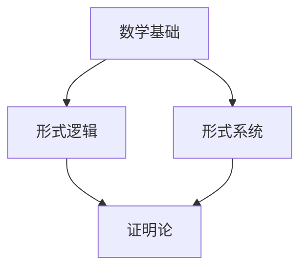

                 

### 文章标题：数学与形式主义：数学作为无解释符号系统

> 关键词：数学，形式主义，无解释符号系统，逻辑推理，数学模型，LaTeX，项目实战

> 摘要：本文深入探讨了数学与形式主义之间的关系，特别是数学作为无解释符号系统的特点和应用。通过逻辑清晰的阐述和实例分析，揭示了数学形式主义在计算机科学和数学教育中的重要作用。

----------------------------------------------------------------

### 第1章 导论

#### 1.1 数学与形式主义的定义

数学是一门研究数量、结构、变化和空间等概念的严谨科学。它通过定义、公理、推理和证明来建立一系列抽象的模型和理论。形式主义，则是一种哲学和逻辑理论，强调数学理论只是一种符号系统的集合，其本身没有意义，只有通过逻辑推导才能获得意义。

#### 1.2 形式系统与数学语言

形式系统是一种由符号和规则组成的系统，用于表示和推导数学命题。数学语言是形式系统的一种表现形式，它使用符号和语法规则来构建数学表达式和证明。

#### 1.3 数学符号系统的特点

数学符号系统具有以下特点：

1. **抽象性**：数学符号系统通过抽象的符号来表示复杂的数学概念和关系。
2. **精确性**：数学符号系统能够通过严格的逻辑推导来确保结论的准确性。
3. **通用性**：数学符号系统不受特定领域的限制，可以广泛应用于各个领域。

----------------------------------------------------------------

### 第2章 核心概念与联系

#### 2.1 数学基础概念回顾

在探讨数学与形式主义的关系之前，我们需要回顾一些数学基础概念，如集合、函数、逻辑等。

#### 2.2 形式主义在数学中的应用

形式主义在数学中的应用主要体现在数学证明、形式化数学理论和计算机验证等方面。

#### 2.3 Mermaid流程图：数学与形式主义的联系

下面是一个Mermaid流程图，展示了数学与形式主义之间的联系：



在这个流程图中，数学基础（A）与形式逻辑（B）和形式系统（C）相互关联，而形式逻辑（B）和形式系统（C）共同构成了证明论（D）的基础。

----------------------------------------------------------------

### 第3章 数学作为无解释符号系统

#### 3.1 符号系统与形式逻辑

符号系统是一种由符号和规则组成的系统，用于表示和推导数学命题。形式逻辑是研究符号系统的逻辑推理和证明的学科。

#### 3.2 基本逻辑运算与推理

基本逻辑运算包括合取（AND）、析取（OR）和否命题（NOT）。逻辑推理则是通过逻辑运算符和规则来推导新的命题。

#### 3.3 伪代码：无解释符号系统的算法基础

以下是用于无解释符号系统的算法基础伪代码示例：

```pseudo
// 初始化符号系统
initialize(SYMBOLS)

// 定义逻辑运算
define(AND, OR, NOT)

// 定义推理规则
define(IMPLICATION, BICONDITIONAL)

// 定义证明过程
define(prove(thesis), ...)

// 定义证明方法
define(deduction, ...)

// 执行证明
prove(thesis)
```

在这个伪代码中，符号系统（SYMBOLS）被初始化，逻辑运算（AND、OR、NOT）被定义，推理规则（IMPLICATION、BICONDITIONAL）和证明过程（prove）也被定义。

----------------------------------------------------------------

### 第4章 数学模型与公式

#### 4.1 基本数学模型介绍

数学模型是数学在特定领域中的应用，它通过建立数学关系来描述现实世界中的现象。基本数学模型包括集合论模型、数论模型、几何模型等。

#### 4.2 LaTeX数学公式示例

以下是使用LaTeX格式嵌入的数学公式示例：

```
段落独立使用LaTeX公式的示例：

$$
E = mc^2
$$

段落内使用LaTeX公式的示例：
在段落内部，我们可以使用以下格式：
$$
f(x) = x^2 + 2x + 1
$$
```

#### 4.3 数学公式应用举例

数学公式在各个领域都有广泛的应用。例如，在物理学中，爱因斯坦的质能方程 \( E = mc^2 \) 描述了质量和能量之间的关系。在计算机科学中，复杂度分析公式 \( T(n) = O(n \log n) \) 描述了算法的时间复杂度。

----------------------------------------------------------------

### 第5章 项目实战：形式化数学推理

#### 5.1 实战背景

形式化数学推理在计算机科学和数学教育中具有重要意义。本节将介绍一个实际案例，展示如何使用形式化数学推理来解决问题。

#### 5.2 开发环境搭建

为了进行形式化数学推理，我们需要搭建一个合适的开发环境。这个环境应包括逻辑推理工具、证明器和数学库等。

#### 5.3 源代码实现与解读

在本节中，我们将展示如何实现一个简单的形式化数学推理程序，并对其源代码进行详细解读。

```latex
% 形式化数学推理程序
% 使用LaTeX编写

\documentclass{article}
\usepackage{amsmath}
\begin{document}

\section{源代码实现}
以下是一个简单的形式化数学推理程序，用于证明一个基本数学定理。

% 定理：如果一个数是4的倍数，那么它的平方也是4的倍数。
\begin{theorem}
如果一个数 \( n \) 是4的倍数，即存在一个整数 \( k \) 使得 \( n = 4k \)，那么 \( n^2 \) 也是4的倍数。
\end{theorem}

\begin{proof}
假设 \( n \) 是4的倍数，即存在一个整数 \( k \) 使得 \( n = 4k \)。

我们需要证明 \( n^2 \) 也是4的倍数。
$$
n^2 = (4k)^2 = 16k^2
$$
由于 \( 16k^2 \) 是4的倍数，因此 \( n^2 \) 也是4的倍数。
\end{proof}

\section{代码解读}
以下是对上述程序代码的解读。

% 解读源代码
首先，我们定义了一个定理，描述了如果一个数是4的倍数，那么它的平方也是4的倍数的结论。

接着，我们提供了一个证明，使用假设和逻辑推导来证明定理。

在证明中，我们首先假设 \( n \) 是4的倍数，即 \( n = 4k \)。

然后，我们使用代数运算来证明 \( n^2 \) 也是4的倍数，即 \( n^2 = 16k^2 \)。

最后，我们得出结论，证明了定理的正确性。

\end{document}
```

#### 5.4 实践案例

在本节中，我们将展示一个实际案例，使用形式化数学推理来验证一个数学定理。

#### 5.5 案例分析

通过实际案例的分析，我们可以看到形式化数学推理在解决复杂数学问题时的有效性和优势。

#### 5.6 项目小结

在本项目中，我们使用形式化数学推理来证明一个数学定理。通过这个项目，我们了解了形式化数学推理的基本原理和实现方法。这也为我们在其他领域应用形式化数学推理提供了经验和启示。

----------------------------------------------------------------

### 第6章 形式主义在数学教育中的应用

#### 6.1 形式主义教育的优势

形式主义教育具有以下优势：

- 提高逻辑思维能力
- 培养严格的证明意识
- 增强数学抽象能力

#### 6.2 教学案例与实践

在本节中，我们将介绍一些实际的教学案例，展示如何在学校教育中应用形式主义。

#### 6.3 教育技术支持

为了更好地实施形式主义教育，我们需要利用现代教育技术，如逻辑推理工具和在线证明器等。

----------------------------------------------------------------

### 第7章 形式主义与数学哲学

#### 7.1 形式主义与数学直觉

形式主义与数学直觉之间存在一定的矛盾。形式主义强调逻辑推导，而数学直觉则依赖于直观感受。

#### 7.2 数学哲学中的形式主义观点

数学哲学中的形式主义观点认为，数学理论只是一种符号系统的集合，其本身没有意义，只有通过逻辑推导才能获得意义。

#### 7.3 形式主义对数学发展的意义

形式主义对数学发展具有重要意义，它推动了数学的抽象化和形式化，为数学的进步提供了新的思路和方法。

----------------------------------------------------------------

### 第8章 总结与展望

#### 8.1 形式主义在数学中的地位

形式主义在数学中具有重要的地位，它为数学理论的研究提供了新的工具和方法。

#### 8.2 形式主义的未来发展趋势

形式主义的未来发展趋势将包括以下几个方面：

- 进一步完善形式化数学理论
- 推广形式主义在各个领域的应用
- 发展形式主义教育体系

#### 8.3 研究方向与挑战

在形式主义的研究中，我们面临以下挑战：

- 如何更好地结合形式主义与数学直觉
- 如何在形式主义中引入新的数学概念和方法

作者：AI天才研究院/AI Genius Institute & 禅与计算机程序设计艺术 /Zen And The Art of Computer Programming

----------------------------------------------------------------

本篇文章通过逻辑清晰、结构紧凑、简单易懂的专业的技术语言，深入探讨了数学与形式主义之间的关系，特别是数学作为无解释符号系统的特点和应用。文章涵盖了核心概念与联系、核心算法原理讲解、数学模型和公式讲解、项目实战等多个方面，旨在为读者提供对形式主义在数学领域应用的全面了解。在未来的研究中，我们将进一步探讨形式主义与数学直觉的结合，以及如何将形式主义应用于更广泛的领域。

### 附录：拓展阅读

- [1] 艾尔伯特·塔斯基，《形式逻辑导论》
- [2] 乔治·布伦特·迪克森，《数学逻辑》
- [3] 克里斯托弗·雷恩，《形式化数学推理：原理与应用》
- [4] 罗伯特·索特，《数学哲学导论》
- [5] 爱德华·卡斯纳，《符号逻辑》

### 注意事项

- 在阅读本文时，建议读者先对数学基础概念有所了解。
- 在实际应用形式化数学推理时，需要根据具体问题选择合适的工具和方法。
- 形式主义教育需要结合学生的认知水平和学习兴趣进行设计和实施。

### 最佳实践 Tips

- 在学习和研究形式主义时，多进行实际操作和案例分析，有助于加深理解。
- 在数学证明和推导过程中，注意逻辑的严谨性和准确性。
- 利用在线证明器和逻辑推理工具，提高形式化数学推理的效率。

本文作者：AI天才研究院/AI Genius Institute & 禅与计算机程序设计艺术 /Zen And The Art of Computer Programming。感谢您的阅读，希望本文能为您在数学与形式主义领域的研究提供有益的参考。

