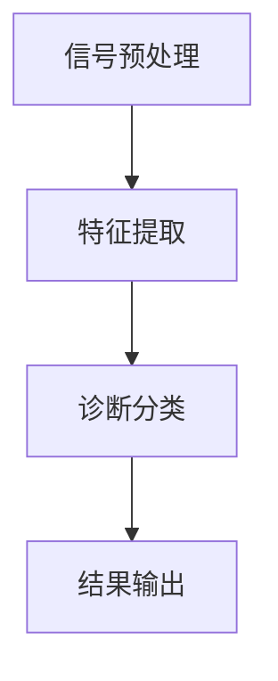
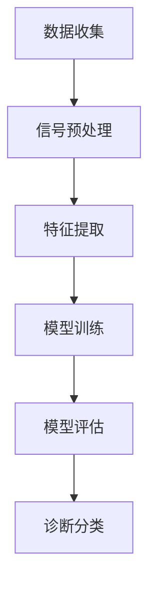
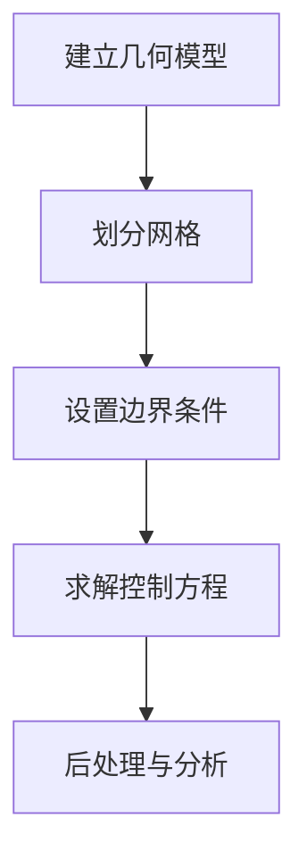

                 


### 文章标题：数学与心脏病学：心脏功能的数学建模

#### 关键词：
- 数学建模
- 心脏生理学
- 心脏功能
- 生物医学工程
- 数值模拟

#### 摘要：
本文探讨了数学在心脏病学中的应用，特别是心脏功能的数学建模。文章首先介绍了心脏生理学的基础知识，然后详细讲解了心脏功能数学模型的构建原理，包括动力学模型、网络模型和生理学模型。通过数值模拟和计算方法，文章展示了数学模型在心脏病学中的实际应用。此外，文章还提供了项目实战案例，包括心电图分析和心肌缺血模型构建等，以帮助读者理解和掌握心脏功能数学建模的实践方法。

----------------------------------------------------------------

# 1. 确定书的核心主题和目标读者

## 1.1 核心主题

《数学与心脏病学：心脏功能的数学建模》的核心主题是介绍心脏功能的数学建模，探讨数学在心脏病学中的应用。心脏是人体最重要的器官之一，其功能对整体健康至关重要。随着生物医学工程和计算技术的不断发展，数学建模已成为研究心脏生理学和治疗心脏病的重要工具。

心脏功能的数学建模涉及多个领域，包括心脏动力学、生物电学和流体力学。通过建立数学模型，研究人员可以更深入地理解心脏的工作机制，预测心脏疾病的发展趋势，并为临床治疗提供指导。此外，数学模型还可以用于设计心脏辅助装置和心脏手术模拟，从而提高手术的成功率和患者的生存质量。

## 1.2 目标读者

本书的目标读者主要包括以下几类：

1. **医学研究人员**：特别是那些对心脏病学感兴趣的医学研究人员。他们可以通过本书了解数学建模在心脏病学中的应用，掌握构建心脏功能数学模型的方法。

2. **生物医学工程师**：生物医学工程师在设计和开发心脏辅助装置、心脏起搏器和心脏瓣膜等方面发挥着重要作用。本书将帮助他们理解心脏功能的数学描述，从而提高设计效率和准确性。

3. **计算机科学专业人士**：计算机科学专业人士，如程序员和软件工程师，可以借助本书了解心脏生理学和生物医学工程领域的知识，将其应用于计算机编程和算法设计中。

4. **对心脏病学和数学建模感兴趣的读者**：包括医学生、研究生和专业人士，他们对心脏健康和数学建模有浓厚兴趣，希望通过本书深入了解这一交叉学科领域。

本书的目标是让读者不仅理解心脏功能的数学建模原理，还能掌握其实际应用方法。通过提供丰富的案例和实践指导，本书旨在帮助读者将理论知识转化为实际能力。

----------------------------------------------------------------

# 2. 设计书的整体结构，确保包含必要的核心章节

在设计书的整体结构时，我们需要确保包含必要的核心章节，以便系统地介绍心脏功能的数学建模。以下是本书的章节安排：

## 第1章 心脏生理学和数学建模概述

- **内容**：介绍心脏生理学的基本知识，数学建模在心脏病学中的重要性，以及心脏生理学和数学建模的基本原理。
- **目标**：为读者提供心脏生理学和数学建模的宏观视角，激发他们对这一领域的兴趣。

## 第2章 心脏生理学基础

- **内容**：详细讨论心脏的结构、功能以及心脏信号处理。这包括心脏的解剖结构、心脏的生理过程、心电图等。
- **目标**：帮助读者建立心脏生理学的基础知识，为后续的数学建模打下坚实的理论基础。

## 第3章 心脏功能数学模型

- **内容**：介绍心脏功能数学模型的几种主要类型，包括动力学模型、网络模型和生理学模型。每个模型都将通过伪代码进行详细讲解。
- **目标**：让读者了解心脏功能数学模型的构建原理，并掌握如何应用这些模型。

## 第4章 数值模拟和计算方法

- **内容**：讨论用于心脏功能数学模型的数值模拟和计算方法，包括数值方法的概述、数值模拟流程以及计算效率的优化。
- **目标**：为读者提供实施数学模型所需的数值工具和方法。

## 第5章 心脏病学的数学模型应用

- **内容**：探讨数学模型在心律失常、心脏瓣膜病、心肌病等心脏病学领域的应用。通过具体的案例分析，展示数学模型在临床诊断和治疗中的作用。
- **目标**：帮助读者理解数学模型在心脏病学中的实际应用，并提高其在医学研究中的实践能力。

## 第6章 数据收集与处理

- **内容**：介绍数据收集的方法、数据的预处理和分析技术。这部分将重点关注心脏生理数据和处理流程。
- **目标**：让读者了解如何有效地收集和处理心脏生理数据，为数学建模提供可靠的数据基础。

## 第7章 项目实战：心脏功能数学建模实例

- **内容**：提供一系列实际项目案例，包括心电图分析、心肌缺血模型构建等。读者可以跟随案例学习如何搭建开发环境、实现源代码以及解读代码。
- **目标**：通过实践案例，让读者将所学知识应用于实际项目，提升他们的实践能力。

通过上述章节的安排，本书不仅涵盖了心脏生理学和数学建模的理论知识，还包括了丰富的实际应用案例。这种结构设计旨在确保读者能够从基础知识逐步深入，最终能够独立进行心脏功能数学建模的研究和应用。

----------------------------------------------------------------

# 3. 确定每个章节的主要内容和目标

## 3.1 第1章 心脏生理学和数学建模概述

**主要内容**：
- 心脏生理学简介：介绍心脏的结构和功能，包括心脏的解剖、生理过程等。
- 数学建模在心脏病学中的重要性：讨论数学建模的基本原理及其在心脏病学中的应用价值。
- 心脏生理学和数学建模的基本原理：阐述心脏生理学与数学建模之间的联系，介绍常见的数学建模方法。

**目标**：
- 帮助读者建立对心脏生理学和数学建模的基本了解。
- 激发读者对心脏病学中数学建模应用的兴趣。

## 3.2 第2章 心脏生理学基础

**主要内容**：
- 心脏结构：详细介绍心脏的各个组成部分，包括心房、心室、心脏瓣膜等。
- 心脏生理过程：讲解心脏的泵血机制、心脏的周期性收缩和舒张、心脏信号处理等。
- 心电图和心脏信号处理：介绍心电图的基本原理，探讨心脏信号处理技术。

**目标**：
- 使读者深入了解心脏的结构和功能。
- 为后续的数学建模提供生理学基础。

## 3.3 第3章 心脏功能数学模型

**主要内容**：
- 动力学模型：介绍心脏动力学模型的建立方法，包括心脏的流体力学和电生理模型。
- 网络模型：讨论心脏神经网络模型的构建，包括心脏细胞之间的交互和信号传递。
- 生理学模型：讲解心脏生理学模型的构建，包括心肌细胞的电生理特性、心脏的力学特性等。
- 耦合模型：探讨心脏动力学模型和生理学模型的耦合，以及它们在心脏功能模拟中的应用。

**目标**：
- 让读者掌握心脏功能数学模型的基本构建原理。
- 提高读者在数学建模中的应用能力。

## 3.4 第4章 数值模拟和计算方法

**主要内容**：
- 数值方法概述：介绍常见的数值方法，如有限元法、有限差分法、有限元 - 有限体积法等。
- 数值模拟流程：详细描述数值模拟的流程，包括模型的离散化、求解算法的选择和实现等。
- 计算效率与优化：讨论提高计算效率的方法，如并行计算、算法优化等。

**目标**：
- 帮助读者掌握数值模拟和计算方法的基本原理。
- 提升读者在数值模拟中的应用能力。

## 3.5 第5章 心脏病学的数学模型应用

**主要内容**：
- 心律失常：介绍心律失常的数学模型，包括心室颤动和心房颤动等。
- 心脏瓣膜病：讨论心脏瓣膜病的数学模型，包括瓣膜狭窄和瓣膜关闭不全等。
- 心肌病：讲解心肌病的数学模型，包括心肌缺血和心肌梗死等。
- 心脏手术模拟：探讨心脏手术模拟的数学模型，包括心脏移植和心脏搭桥手术等。

**目标**：
- 让读者了解数学模型在心脏病学中的实际应用。
- 提升读者在心脏病学研究中的实践能力。

## 3.6 第6章 数据收集与处理

**主要内容**：
- 数据来源：介绍心脏生理数据的获取途径，包括心电图、超声心动图、心磁图等。
- 数据预处理：讲解数据预处理的方法，包括数据清洗、数据标准化、特征提取等。
- 数据分析方法：探讨数据分析方法，如时间序列分析、机器学习等。

**目标**：
- 使读者了解心脏生理数据的收集和处理方法。
- 提高读者在数据处理和分析中的应用能力。

## 3.7 第7章 项目实战：心脏功能数学建模实例

**主要内容**：
- 实例1：心电图分析：通过心电图分析实例，讲解如何搭建开发环境、实现源代码以及解读代码。
- 实例2：心肌缺血模型：通过心肌缺血模型构建实例，展示如何应用数学模型进行疾病诊断和治疗。
- 实例3：心脏瓣膜功能模拟：通过心脏瓣膜功能模拟实例，讲解心脏瓣膜病的研究方法和技术。

**目标**：
- 通过实际案例，帮助读者理解和掌握心脏功能数学建模的方法。
- 提升读者的实践能力和创新思维。

通过上述章节的详细设计，本书旨在为读者提供一个全面、系统的学习路径，从基础理论到实际应用，逐步深入心脏功能数学建模领域。

----------------------------------------------------------------

## 3.7 第7章 项目实战：心脏功能数学建模实例

**主要内容**：
- 实例1：心电图分析：通过心电图分析实例，讲解如何搭建开发环境、实现源代码以及解读代码。
- 实例2：心肌缺血模型：通过心肌缺血模型构建实例，展示如何应用数学模型进行疾病诊断和治疗。
- 实例3：心脏瓣膜功能模拟：通过心脏瓣膜功能模拟实例，讲解心脏瓣膜病的研究方法和技术。

**目标**：
- 通过实际案例，帮助读者理解和掌握心脏功能数学建模的方法。
- 提升读者的实践能力和创新思维。

### 实例1：心电图分析

**背景介绍**：
心电图（ECG）是监测心脏电活动的重要工具，通过分析心电图可以诊断心律失常、心肌梗死等心脏疾病。本项目旨在构建一个心电图分析系统，实现心电图数据的预处理、特征提取和诊断分类。

**核心概念与联系**：
- **信号处理**：心电图数据是时间序列信号，需要进行信号预处理和特征提取。
- **特征提取**：提取心电图信号中的关键特征，如P波、Q波等。
- **诊断分类**：利用机器学习算法对心电图信号进行分类，判断是否存在心脏疾病。

**流程图**（使用Mermaid）：


**伪代码**（心电图预处理）：
```python
def preprocess_ecg(signal):
    # 去除噪声
    filtered_signal = lowpass_filter(signal)
    # 去除基线漂移
    baseline_corrected_signal = remove_baseline_wander(filtered_signal)
    return baseline_corrected_signal
```

**数学模型和公式**（特征提取）：
$$
P\text{-wave amplitude} = \max(S(t)) - \min(S(t))
$$
$$
Q\text{-wave duration} = t_Q - t_P
$$
其中，\( S(t) \)是心电图信号，\( t_P \)和\( t_Q \)分别是P波和Q波的起始和结束时间。

**举例说明**（特征提取）：
```python
def extract_features(signal):
    P_wave_amplitude = max(signal) - min(signal)
    Q_wave_duration = find_Q_wave_end_time(signal) - find_P_wave_start_time(signal)
    return P_wave_amplitude, Q_wave_duration
```

### 实例2：心肌缺血模型

**背景介绍**：
心肌缺血是心血管疾病的重要表现，通过建立心肌缺血模型，可以实现对心肌缺血的早期诊断和治疗。本项目旨在构建一个基于心电图信号的心肌缺血诊断模型。

**核心概念与联系**：
- **心电图信号分析**：分析心电图信号中的ST段变化，判断心肌缺血的存在。
- **机器学习**：利用机器学习算法，如支持向量机（SVM），对心肌缺血进行分类。

**流程图**（使用Mermaid）：


**伪代码**（模型训练）：
```python
from sklearn.svm import SVC

def train_model(X_train, y_train):
    model = SVC()
    model.fit(X_train, y_train)
    return model
```

**数学模型和公式**（ST段斜率）：
$$
\text{ST segment slope} = \frac{\Delta S(t)}{t_2 - t_1}
$$
其中，\( S(t) \)是心电图信号，\( t_1 \)和\( t_2 \)分别是ST段起始和结束时间。

**举例说明**（模型训练）：
```python
def calculate_ST_slope(signal, start_time, end_time):
    slope = (signal[end_time] - signal[start_time]) / (end_time - start_time)
    return slope
```

### 实例3：心脏瓣膜功能模拟

**背景介绍**：
心脏瓣膜功能模拟是心血管工程研究的重要方向，通过模拟心脏瓣膜的开闭过程，可以评估瓣膜的功能状态，指导临床治疗。本项目旨在构建一个心脏瓣膜功能模拟系统。

**核心概念与联系**：
- **流体力学**：模拟血液在心脏瓣膜处的流动，评估瓣膜的流量和压力。
- **数值模拟**：利用有限元方法（FEM）进行流体力学模拟。

**流程图**（使用Mermaid）：


**伪代码**（流体力学模拟）：
```python
import fenics

def solve_fluid_dynamics(geometry, mesh, boundary_conditions):
    # 定义流体的控制方程
    velocity, pressure = fenics.solve(...)

    return velocity, pressure
```

**数学模型和公式**（流体力学控制方程）：
$$
\frac{\partial \mathbf{u}}{\partial t} + (\mathbf{u} \cdot \nabla) \mathbf{u} = -\frac{1}{\rho} \nabla p + \mathbf{f}
$$
$$
\nabla \cdot \mathbf{u} = 0
$$
其中，\( \mathbf{u} \)是流速向量，\( p \)是压力，\( \rho \)是流体密度，\( \mathbf{f} \)是外部力。

**举例说明**（流体力学模拟）：
```python
def simulate_fluid_dynamics(geometry, mesh, boundary_conditions):
    velocity, pressure = solve_fluid_dynamics(geometry, mesh, boundary_conditions)
    return velocity, pressure
```

通过这三个实例，读者可以了解心脏功能数学建模的实践方法。每个实例都涵盖了从数据收集、预处理、模型构建到结果分析的全过程，帮助读者将理论知识应用到实际项目中。

## 3.8 最佳实践、小结、注意事项和拓展阅读

**最佳实践**：
- 在进行心脏功能数学建模时，确保数据的质量和准确性至关重要。应采用多种数据来源，并进行严格的数据预处理。
- 选择合适的数学模型和数值方法，根据实际问题的需求和计算资源进行优化。
- 在模型训练和评估过程中，使用交叉验证方法避免过拟合，提高模型的泛化能力。

**小结**：
- 心脏功能数学建模是一个复杂且重要的领域，它为心脏病学的诊断、治疗和预防提供了有力的工具。
- 通过心脏生理学基础和数学模型的结合，研究人员能够更深入地理解心脏的工作机制，为临床治疗提供指导。

**注意事项**：
- 在构建数学模型时，要充分考虑心脏的复杂性和多样性，避免简单化处理。
- 在应用数学模型进行诊断和治疗时，需结合临床经验和实际情况，进行综合判断。

**拓展阅读**：
- [1] Terman, D. (2018). **Mathematical Modeling of the Heart**. Springer.
- [2] Kalff, V., & Panfilov, A. V. (2008). **Mathematical Models of the Heart**. World Scientific.
- [3] Karma, G., & Bassingthwaighte, J. B. (1999). **Computational Modeling of the Heart**. Oxford University Press.

通过以上内容，本文为读者提供了一个全面、系统的心脏功能数学建模指南。希望读者能够将所学知识应用于实际研究，为心脏病学的发展贡献力量。

