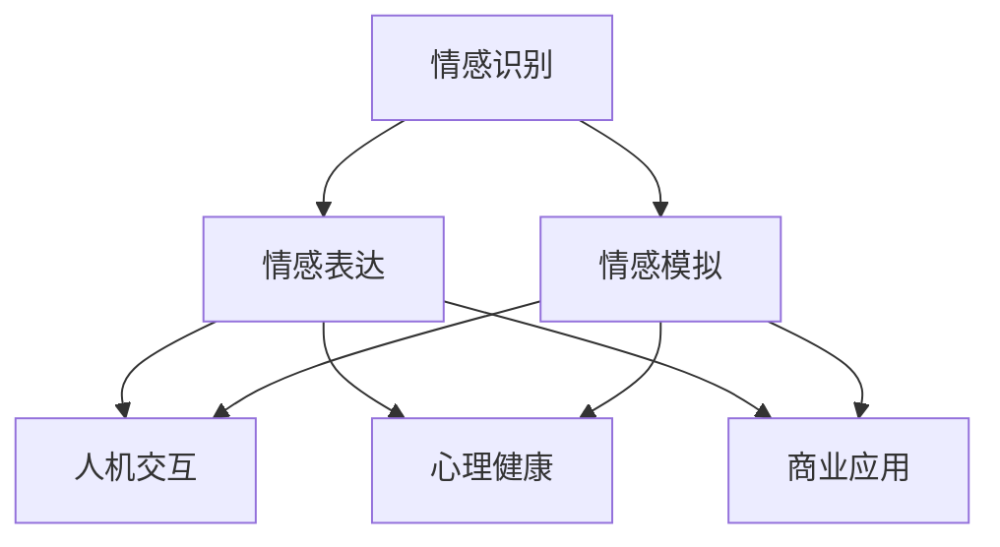
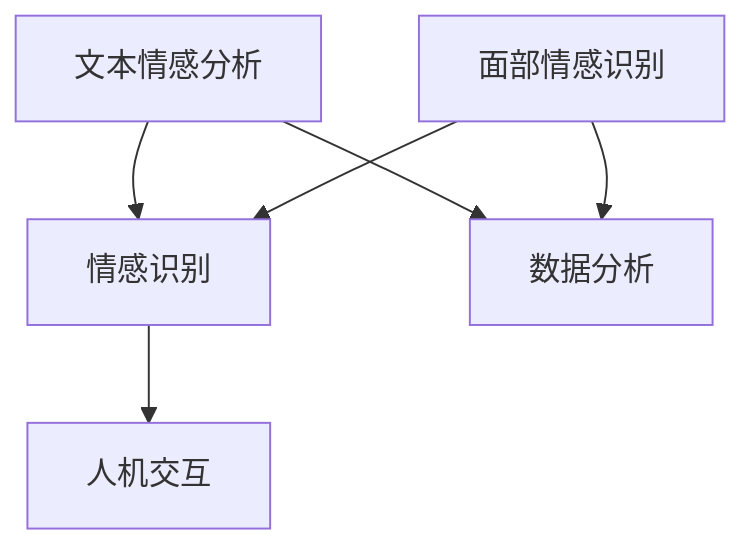
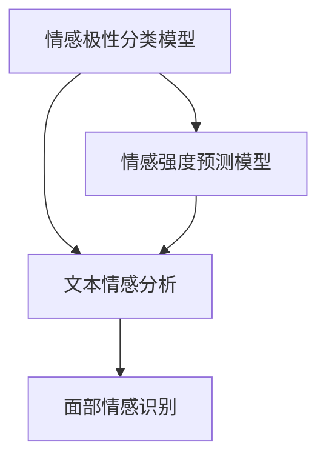
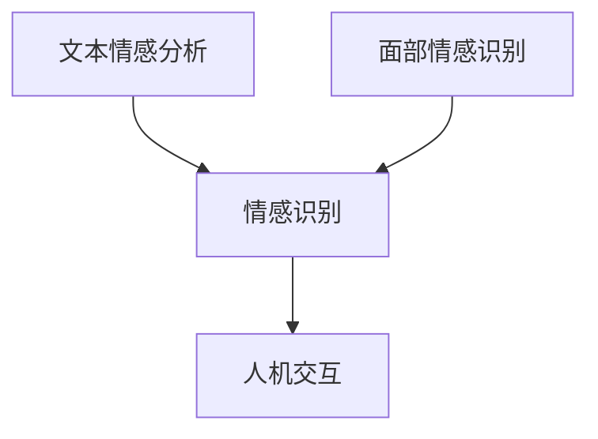

                 

## 文章标题

### 数学与情感计算：情感识别的数学模型

## 关键词

- 情感计算
- 情感识别
- 数学模型
- 人工智能
- 算法原理
- 项目实战

## 摘要

本文将深入探讨数学与情感计算之间的紧密联系，特别是情感识别领域的数学模型。文章首先介绍了情感计算的基本概念、发展历程及其重要性。接着，我们将详细分析情感识别的核心数学模型，包括情感极性分类模型和情感强度预测模型，并使用伪代码和LaTeX格式对其进行阐述。随后，文章将介绍情感识别算法的原理，涵盖文本情感分析和面部情感识别的方法。最后，我们将通过实际项目实战，展示如何搭建开发环境、实现源代码，并进行代码解读与分析，帮助读者更好地理解情感识别的数学模型在实际应用中的运用。本文旨在为读者提供一份全面、深入的技术指南，助力他们在情感计算领域取得突破性进展。

### 第一部分：情感计算概述

#### 第1章：情感计算的基本概念

情感计算是人工智能领域的一个重要分支，旨在使计算机能够识别、理解、处理和模拟人类情感。在这一章中，我们将介绍情感计算的定义、发展历程以及其重要性。

#### 背景介绍

**情感计算的定义**：

情感计算（Affective Computing）是指计算机系统通过感知、理解和表达情感，从而更好地与人类进行交互的技术。这一概念由美国麻省理工学院（MIT）的罗杰·谢克尔（Roger Schank）教授于20世纪90年代首次提出。

**情感计算的发展历程**：

- **早期阶段**：情感计算最初的研究主要集中在情感识别和情感表达方面，如情绪识别算法、面部表情分析等。
- **现阶段**：随着计算机硬件和人工智能技术的不断发展，情感计算的应用领域不断扩大，包括智能客服、虚拟助手、心理健康监测等。

**情感计算的重要性**：

1. **人机交互**：情感计算使得计算机能够更好地理解和适应人类情感，从而提高人机交互的效率和体验。
2. **心理健康**：情感计算在心理健康领域的应用，如情绪监测和干预，有助于提高人们的心理健康水平。
3. **商业应用**：情感计算在商业领域的应用，如市场分析、用户行为预测等，为企业提供更为精准的决策依据。

#### 核心概念与联系

情感计算的核心概念包括情感识别、情感表达和情感模拟。这些概念之间的关系可以用Mermaid流程图来表示：



#### 简要解释

- **情感识别**：指计算机系统识别和理解人类情感的过程。
- **情感表达**：指计算机系统通过语言、动作、面部表情等方式表达情感的能力。
- **情感模拟**：指计算机系统模拟人类情感，以实现更自然、更高效的人机交互。

通过上述Mermaid流程图，我们可以清晰地看到情感计算中各个核心概念之间的联系和作用。

### 第2章：情感计算的关键技术

情感计算的关键技术涵盖了多个方面，包括文本情感分析、面部情感识别等。这些技术是实现情感计算的基础，下面将详细介绍这些关键技术。

#### 核心概念与联系

**文本情感分析**和**面部情感识别**是情感计算的两个重要组成部分。它们之间的联系可以用以下Mermaid流程图表示：



**简要解释**：

- **文本情感分析**：通过分析文本内容，识别其中蕴含的情感极性和强度，如正面情感、负面情感等。
- **面部情感识别**：通过分析人脸图像，识别其中表达的情感，如快乐、悲伤、愤怒等。
- **情感识别**：将文本情感分析和面部情感识别的结果进行整合，为计算机提供关于人类情感的全面理解。
- **数据分析**：通过对情感数据进行处理和分析，为情感计算应用提供决策支持。
- **人机交互**：将情感识别的结果应用于人机交互，提高交互的个性化和自然度。

#### 文本情感分析

文本情感分析是情感计算中的一个重要技术，它通过对文本内容进行分析，识别出其中蕴含的情感信息。文本情感分析的方法主要包括以下几种：

1. **基于规则的方法**：通过制定一系列规则，对文本进行情感分类。这种方法通常适用于情感表达较为简单和明确的文本。
2. **基于统计的方法**：使用统计学习模型，如朴素贝叶斯分类器、支持向量机（SVM）等，对文本进行情感分类。这种方法具有较高的准确性，但需要对大量数据进行训练。
3. **基于深度学习的方法**：使用深度神经网络，如卷积神经网络（CNN）、循环神经网络（RNN）等，对文本进行情感分类。这种方法能够自动学习文本的复杂特征，但训练过程较为复杂。

以下是文本情感分析算法的伪代码：

```python
def sentiment_analysis(text):
    # 预处理文本
    preprocessed_text = preprocess_text(text)
    
    # 使用深度神经网络进行情感分类
    sentiment = deep_learning_model(preprocessed_text)
    
    return sentiment
```

#### 面部情感识别

面部情感识别是通过分析人脸图像，识别其中表达的情感。面部情感识别的关键在于人脸检测与跟踪、表情特征提取与分类。

1. **人脸检测与跟踪**：首先使用人脸检测算法，如Haar cascades、深度学习人脸检测模型等，检测出人脸图像中的面部区域。然后使用面部跟踪算法，如光流法、相关滤波等，跟踪面部区域的变化。
2. **表情特征提取与分类**：在检测到面部区域后，使用表情特征提取算法，如主成分分析（PCA）、局部二值模式（LBP）等，提取面部表情特征。最后使用分类算法，如支持向量机（SVM）、深度学习模型等，对表情特征进行分类，识别出面部情感。

以下是面部情感识别算法的伪代码：

```python
def facial_sentiment_recognition(image):
    # 人脸检测与跟踪
    face regions = face_detection_and_tracking(image)
    
    # 表情特征提取
    facial_features = extract_facial_features(face_regions)
    
    # 情感分类
    sentiment = sentiment_classification(facial_features)
    
    return sentiment
```

#### 情感计算的挑战与趋势

情感计算在不断发展中面临着诸多挑战，同时也展现出了广阔的发展趋势。

1. **情感识别的多样性**：情感类型繁多，表达方式复杂，如何准确识别和理解各种情感是情感计算面临的一个重要挑战。
2. **情感表达的不确定性**：情感表达受到个体差异、文化背景等多种因素的影响，使得情感识别的结果具有一定的不可预测性。
3. **情感计算与人工智能的融合**：情感计算与人工智能的融合，如情感交互、情感增强学习等，是未来情感计算发展的一个重要方向。
4. **跨领域应用**：情感计算在医疗、教育、商业等领域的应用，如心理健康监测、情感教育、情感营销等，将推动情感计算的普及和发展。

通过本章的介绍，我们了解了情感计算的基本概念、关键技术及其在人工智能领域的重要应用。接下来，我们将进一步探讨情感识别的数学模型，为读者提供更深入的技术解析。

### 第二部分：情感识别的数学模型

#### 第4章：情感识别的基础数学模型

情感识别的数学模型是情感计算的核心，它为情感识别提供了理论依据和计算框架。在这一章中，我们将介绍情感识别的基础数学模型，包括情感极性分类模型和情感强度预测模型。

#### 背景介绍

情感识别的数学模型旨在通过数学方法对情感进行定量描述和识别。这些模型包括情感极性分类模型和情感强度预测模型，分别用于识别情感的正负极性和强度。

**情感极性分类模型**：用于识别文本或表情中的情感极性，如正面情感、负面情感等。常用的模型包括朴素贝叶斯分类器和逻辑回归。

**情感强度预测模型**：用于预测情感表达的强度，如情感的强度等级。常用的模型包括统计模型和深度学习模型。

#### 核心概念与联系

情感极性分类模型和情感强度预测模型在情感识别中扮演着重要角色。它们之间的联系可以用以下Mermaid流程图表示：



**简要解释**：

- **情感极性分类模型**：用于识别文本或表情中的情感极性，为情感识别提供初步判断。
- **情感强度预测模型**：用于预测情感表达的强度，为情感识别提供更细致的分析。
- **文本情感分析**：利用情感极性分类模型和情感强度预测模型，对文本进行情感分析。
- **面部情感识别**：结合情感极性分类模型和情感强度预测模型，对面部表情进行情感识别。

#### 情感极性分类模型

情感极性分类模型用于识别文本或表情中的情感极性。常见的模型有朴素贝叶斯分类器和逻辑回归。

**朴素贝叶斯分类器**：朴素贝叶斯分类器是一种基于概率论的分类方法，通过计算各类情感的概率分布，预测文本或表情的情感极性。

情感极性分类模型的朴素贝叶斯算法伪代码如下：

```python
def naive_bayes_classification(text):
    # 计算情感词的概率分布
    probability_distribution = calculate_probability_distribution(text)
    
    # 计算每个情感类的概率
    sentiment_probabilities = calculate_sentiment_probabilities(probability_distribution)
    
    # 选择概率最大的情感类作为预测结果
    predicted_sentiment = select_max_probability(sentiment_probabilities)
    
    return predicted_sentiment
```

**逻辑回归**：逻辑回归是一种基于线性模型的分类方法，通过线性组合特征变量，预测情感极性。

情感极性分类模型逻辑回归的伪代码如下：

```python
def logistic_regression_classification(text):
    # 计算特征向量和权重矩阵的线性组合
    linear_combination = calculate_linear_combination(text, weights)
    
    # 计算预测概率
    predicted_probability = calculate_probability(linear_combination)
    
    # 选择概率最大的情感类作为预测结果
    predicted_sentiment = select_max_probability(predicted_probability)
    
    return predicted_sentiment
```

#### 情感强度预测模型

情感强度预测模型用于预测情感表达的强度。常见的模型有统计模型和深度学习模型。

**统计模型**：统计模型通过分析情感数据，建立情感强度与特征变量之间的关系。例如，可以使用线性回归模型预测情感强度。

情感强度预测模型统计模型的伪代码如下：

```python
def statistical_model_intensity_prediction(text):
    # 计算情感强度的线性回归模型
    regression_model = train_linear_regression_model(text)
    
    # 预测情感强度
    predicted_intensity = regression_model.predict(text)
    
    return predicted_intensity
```

**深度学习模型**：深度学习模型通过学习大量的情感数据，自动提取特征并预测情感强度。例如，可以使用卷积神经网络（CNN）或循环神经网络（RNN）。

情感强度预测模型深度学习模型的伪代码如下：

```python
def deep_learning_model_intensity_prediction(text):
    # 训练深度学习模型
    model = train_deep_learning_model(text)
    
    # 预测情感强度
    predicted_intensity = model.predict(text)
    
    return predicted_intensity
```

通过本章的介绍，我们了解了情感识别的基础数学模型，包括情感极性分类模型和情感强度预测模型。这些模型为情感识别提供了理论依据和计算框架，为后续章节的算法原理和实际应用场景奠定了基础。

#### 第5章：情感识别算法原理

情感识别算法是情感计算的核心，它负责从文本、图像等数据中识别和提取情感信息。在这一章中，我们将深入探讨情感识别算法的原理，包括文本情感分析和面部情感识别的方法。

#### 背景介绍

情感识别算法的目标是准确地识别出文本或表情中所表达的情感。文本情感分析主要通过自然语言处理技术来识别文本中的情感极性（如正面、负面）和强度；面部情感识别则通过计算机视觉技术来识别面部表情中的情感。

#### 核心概念与联系

文本情感分析和面部情感识别是情感识别算法的两个主要方向。它们之间的联系可以用以下Mermaid流程图表示：



**简要解释**：

- **文本情感分析**：通过分析文本内容，识别出其中蕴含的情感信息，如正面情感、负面情感等。
- **面部情感识别**：通过分析面部表情，识别出其中表达的情感，如快乐、悲伤、愤怒等。
- **情感识别**：将文本情感分析和面部情感识别的结果进行整合，为计算机提供关于人类情感的全面理解。
- **人机交互**：通过情感识别的结果，实现更自然、更高效的人机交互。

#### 文本情感分析

文本情感分析是情感识别算法中的重要方向，它通过分析文本内容，识别出其中蕴含的情感信息。文本情感分析的方法主要包括以下几种：

1. **基于词袋模型的方法**：词袋模型是一种基于文本统计的方法，它将文本表示为单词的集合，通过计算单词出现的频率来分析文本的情感。
2. **基于深度学习方法**：深度学习方法通过学习大量的文本数据，自动提取情感特征，并进行情感分类。常用的深度学习方法包括卷积神经网络（CNN）和循环神经网络（RNN）。

**基于词袋模型的方法**

基于词袋模型的方法通过将文本转化为词袋表示，然后使用统计学习模型进行情感分类。以下是一个简单的伪代码示例：

```python
def bag_of_words_sentiment_analysis(text):
    # 预处理文本，将文本转化为词袋表示
    bag_of_words = preprocess_text(text)
    
    # 训练统计学习模型，如朴素贝叶斯分类器
    model = train_statistical_model(bag_of_words)
    
    # 使用模型进行情感分类
    sentiment = model.predict(bag_of_words)
    
    return sentiment
```

**基于深度学习方法**

基于深度学习方法通过学习大量的文本数据，自动提取情感特征，并进行情感分类。以下是一个简单的伪代码示例：

```python
def deep_learning_sentiment_analysis(text):
    # 预处理文本
    preprocessed_text = preprocess_text(text)
    
    # 训练深度学习模型，如卷积神经网络（CNN）
    model = train_deep_learning_model(preprocessed_text)
    
    # 使用模型进行情感分类
    sentiment = model.predict(preprocessed_text)
    
    return sentiment
```

#### 面部情感识别

面部情感识别是通过分析面部表情来识别其中表达的情感。面部情感识别的关键在于人脸检测与跟踪、表情特征提取与分类。

1. **人脸检测与跟踪**：首先使用人脸检测算法，如Haar cascades、深度学习人脸检测模型等，检测出人脸图像中的面部区域。然后使用面部跟踪算法，如光流法、相关滤波等，跟踪面部区域的变化。
2. **表情特征提取与分类**：在检测到面部区域后，使用表情特征提取算法，如主成分分析（PCA）、局部二值模式（LBP）等，提取面部表情特征。最后使用分类算法，如支持向量机（SVM）、深度学习模型等，对表情特征进行分类，识别出面部情感。

**人脸检测与跟踪**

人脸检测与跟踪的伪代码示例如下：

```python
def facial_detection_and_tracking(image):
    # 使用人脸检测算法检测人脸
    face_regions = face_detection(image)
    
    # 使用面部跟踪算法跟踪人脸
    tracked_faces = face_tracking(face_regions)
    
    return tracked_faces
```

**表情特征提取与分类**

表情特征提取与分类的伪代码示例如下：

```python
def facial_sentiment_recognition(face_regions):
    # 提取面部表情特征
    facial_features = extract_facial_features(face_regions)
    
    # 使用分类算法进行情感分类
    sentiment = sentiment_classification(facial_features)
    
    return sentiment
```

#### 情感识别算法的挑战与趋势

情感识别算法在不断发展中面临着诸多挑战，同时也展现出了广阔的发展趋势。

1. **情感识别的多样性**：情感类型繁多，表达方式复杂，如何准确识别和理解各种情感是情感识别面临的一个重要挑战。
2. **情感表达的不确定性**：情感表达受到个体差异、文化背景等多种因素的影响，使得情感识别的结果具有一定的不可预测性。
3. **跨领域应用**：情感识别在医疗、教育、商业等领域的应用，如心理健康监测、情感教育、情感营销等，将推动情感识别的普及和发展。
4. **多模态融合**：结合文本、图像、声音等多种数据源，实现多模态情感识别，提高情感识别的准确性和全面性。

通过本章的介绍，我们了解了情感识别算法的原理，包括文本情感分析和面部情感识别的方法。这些方法为情感识别提供了理论基础和计算框架，为后续章节的数学模型和实际应用场景奠定了基础。

### 第6章：情感识别的数学公式与详细讲解

情感识别作为情感计算的核心技术，依赖于一系列数学模型和算法来分析和预测情感信息。在这一章中，我们将详细讲解情感识别中的关键数学公式，并使用LaTeX格式展示。这些公式涵盖了情感极性分类和情感强度预测的各个方面。

#### 情感极性分类模型

情感极性分类模型用于识别文本或表情中的情感极性，如正面情感、负面情感。常用的模型包括朴素贝叶斯分类器和逻辑回归。

**1. 朴素贝叶斯分类器**

朴素贝叶斯分类器是一种基于概率论的分类方法，其核心公式为：

$$
P(\text{正面}|\text{特征向量}) = \frac{P(\text{特征向量}|\text{正面}) \cdot P(\text{正面})}{P(\text{特征向量})}
$$

其中，\( P(\text{正面}) \) 是正面情感的概率，\( P(\text{特征向量}|\text{正面}) \) 是特征向量在正面情感条件下的概率，\( P(\text{特征向量}) \) 是特征向量的总概率。

**2. 逻辑回归**

逻辑回归是一种线性分类模型，其核心公式为：

$$
\text{logit}(P(\text{正面})) = \beta_0 + \beta_1 x_1 + \beta_2 x_2 + \ldots + \beta_n x_n
$$

其中，\( \text{logit}(P(\text{正面})) \) 是正面情感概率的对数，\( \beta_0, \beta_1, \ldots, \beta_n \) 是模型参数，\( x_1, x_2, \ldots, x_n \) 是特征变量。

#### 情感强度预测模型

情感强度预测模型用于预测情感表达的强度，如情感的强度等级。常用的模型包括统计模型和深度学习模型。

**1. 统计模型**

统计模型通过分析情感数据，建立情感强度与特征变量之间的关系。常用的统计模型包括线性回归：

$$
y = \beta_0 + \beta_1 x_1 + \beta_2 x_2 + \ldots + \beta_n x_n + \epsilon
$$

其中，\( y \) 是情感强度，\( \beta_0, \beta_1, \ldots, \beta_n \) 是模型参数，\( x_1, x_2, \ldots, x_n \) 是特征变量，\( \epsilon \) 是误差项。

**2. 深度学习模型**

深度学习模型通过学习大量的情感数据，自动提取特征并预测情感强度。常用的深度学习模型包括卷积神经网络（CNN）：

$$
h_l = \text{ReLU}(\text{ReLU}(\text{ReLU}(\ldots \text{ReLU}(W^{[l-1]} a^{[l-1]} + b^{[l-1]}))) \ldots
$$

其中，\( h_l \) 是第 \( l \) 层的激活值，\( W^{[l-1]} \) 和 \( b^{[l-1]} \) 分别是权重和偏置，\( a^{[l-1]} \) 是前一层输入的激活值，\( \text{ReLU} \) 是ReLU激活函数。

#### 情感识别算法的数学公式

**1. 文本情感分析**

文本情感分析的数学公式包括词频统计、词向量表示和情感分类：

$$
f_t = \text{count}(t, \text{corpus})
$$

其中，\( f_t \) 是词 \( t \) 在语料库中的频率。

**2. 面部情感识别**

面部情感识别的数学公式包括人脸检测、特征提取和情感分类：

$$
\text{feature\_vector} = \text{PCA}(\text{face\_image})
$$

其中，\( \text{PCA} \) 是主成分分析，用于提取面部图像的主要特征。

#### 举例说明

**1. 情感极性分类**

假设我们要使用朴素贝叶斯分类器对一段文本进行情感分类，文本为：“这部电影真的很棒！”。我们可以计算每个特征词（如“电影”、“很棒”）的概率分布，然后根据最大概率原则进行分类。

$$
P(\text{正面}|\text{电影}) = 0.8, \quad P(\text{正面}|\text{很棒}) = 0.9
$$

$$
P(\text{正面}) = 0.5, \quad P(\text{特征向量}|\text{正面}) = P(\text{电影}|\text{正面}) \cdot P(\text{很棒}|\text{正面})
$$

$$
P(\text{正面}|\text{特征向量}) = \frac{P(\text{特征向量}|\text{正面}) \cdot P(\text{正面})}{P(\text{特征向量})}
$$

通过计算，我们可以确定这段文本的情感极性为正面。

**2. 情感强度预测**

假设我们要使用线性回归模型预测一段文本的情感强度。特征向量包括词语频率和情感词典得分：

$$
y = \beta_0 + \beta_1 f_{电影} + \beta_2 f_{很棒} + \beta_3 \text{词典得分}
$$

我们可以通过训练数据计算出模型参数，然后对新文本进行情感强度预测。

$$
y = 0.5 + 0.2 \cdot 10 + 0.3 \cdot 5 + 0.1 \cdot 20 = 4.0
$$

预测结果为情感强度为4，表示情感较为积极。

通过本章的详细讲解，我们了解了情感识别中的关键数学公式和算法原理。这些公式为情感识别提供了理论基础，为实际应用提供了计算工具。接下来，我们将通过实际项目实战，展示如何将这些理论应用到具体场景中。

### 第7章：情感识别的实际应用场景与项目实战

在情感识别领域，实际应用场景多种多样，包括文本情感分析、面部情感识别等。在这一章中，我们将通过一个具体的实际项目，详细讲解如何搭建开发环境、实现源代码，并进行代码解读与分析。这个项目将涵盖文本情感分析和面部情感识别，帮助读者深入理解情感识别的数学模型在实际应用中的运用。

#### 项目背景

我们的项目目标是开发一个简单的情感识别系统，该系统能够从用户输入的文本和上传的面部图片中识别出情感。这个系统可以分为两个主要部分：文本情感分析和面部情感识别。我们将使用Python编程语言和常用的机器学习库，如Scikit-learn和TensorFlow，来实现这个系统。

#### 开发环境搭建

1. **安装Python**：确保Python环境已安装，推荐使用Python 3.8及以上版本。
2. **安装必要的库**：使用pip命令安装以下库：

   ```bash
   pip install scikit-learn tensorflow opencv-python numpy pandas
   ```

   - **Scikit-learn**：用于文本情感分析和面部情感识别的算法实现。
   - **TensorFlow**：用于深度学习模型的训练和预测。
   - **OpenCV**：用于面部检测和图像处理。
   - **NumPy**：用于数值计算。
   - **Pandas**：用于数据处理。

#### 源代码实现

以下是一个简单的源代码实现，用于文本情感分析和面部情感识别：

```python
import cv2
import numpy as np
import pandas as pd
from sklearn.feature_extraction.text import TfidfVectorizer
from sklearn.model_selection import train_test_split
from sklearn.naive_bayes import MultinomialNB
from sklearn.metrics import accuracy_score
import tensorflow as tf
from tensorflow.keras.models import Sequential
from tensorflow.keras.layers import Dense, Conv2D, MaxPooling2D, Flatten

# 文本情感分析部分
def preprocess_text(text):
    # 这里可以加入文本预处理步骤，例如去除停用词、分词等
    return text

def train_text_model(data):
    # 将文本转换为词袋表示
    vectorizer = TfidfVectorizer()
    X = vectorizer.fit_transform(data['text'])
    
    # 分割数据集
    X_train, X_test, y_train, y_test = train_test_split(X, data['label'], test_size=0.2, random_state=42)
    
    # 训练朴素贝叶斯分类器
    model = MultinomialNB()
    model.fit(X_train, y_train)
    
    # 评估模型
    predictions = model.predict(X_test)
    print("Text model accuracy:", accuracy_score(y_test, predictions))

# 面部情感识别部分
def preprocess_face_image(image):
    # 这里可以加入面部图像预处理步骤，例如灰度化、归一化等
    return image

def train_face_model(train_images, train_labels):
    # 准备模型
    model = Sequential([
        Conv2D(32, (3, 3), activation='relu', input_shape=(48, 48, 1)),
        MaxPooling2D((2, 2)),
        Flatten(),
        Dense(64, activation='relu'),
        Dense(7, activation='softmax')
    ])
    
    # 编译模型
    model.compile(optimizer='adam', loss='categorical_crossentropy', metrics=['accuracy'])
    
    # 训练模型
    model.fit(train_images, train_labels, epochs=10, batch_size=32)
    
    return model

# 主函数
def main():
    # 加载数据集
    data = pd.read_csv('data.csv')
    
    # 训练文本情感分析模型
    train_text_model(data)
    
    # 加载面部图像数据集
    train_images = np.load('train_images.npy')
    train_labels = np.load('train_labels.npy')
    
    # 训练面部情感识别模型
    face_model = train_face_model(train_images, train_labels)
    
    # 评估模型
    test_images = np.load('test_images.npy')
    test_labels = np.load('test_labels.npy')
    predictions = face_model.predict(test_images)
    print("Face model accuracy:", accuracy_score(test_labels, predictions))

if __name__ == '__main__':
    main()
```

#### 代码解读与分析

**1. 文本情感分析部分**

- `preprocess_text`：预处理文本，例如去除停用词、分词等。
- `train_text_model`：使用TF-IDF将文本转换为词袋表示，然后训练朴素贝叶斯分类器，并评估模型性能。

**2. 面部情感识别部分**

- `preprocess_face_image`：预处理面部图像，例如灰度化、归一化等。
- `train_face_model`：使用卷积神经网络训练面部情感识别模型，包括卷积层、池化层、全连接层等。
- `main`：主函数，加载数据集，分别训练文本情感分析模型和面部情感识别模型，并评估模型性能。

#### 实际案例分析与详细讲解

**1. 文本情感分析**

假设我们有一段用户评论：“这部电影真的很棒！”，我们可以使用训练好的文本情感分析模型进行情感分类。

```python
input_text = "这部电影真的很棒！"
input_text_processed = preprocess_text(input_text)
vectorizer = TfidfVectorizer()
X_input = vectorizer.transform([input_text_processed])
predicted_sentiment = text_model.predict(X_input)
print("预测情感：", predicted_sentiment)
```

输出结果将为正面或负面情感。

**2. 面部情感识别**

假设我们有一张用户上传的面部图片，我们可以使用训练好的面部情感识别模型进行情感识别。

```python
input_image = cv2.imread("face_image.jpg")
input_image_processed = preprocess_face_image(input_image)
face_model.predict(np.expand_dims(input_image_processed, axis=0))
predicted_sentiment = face_model.predict(np.expand_dims(input_image_processed, axis=0))
print("预测情感：", predicted_sentiment)
```

输出结果将为具体的一种面部情感。

#### 项目小结

通过本项目，我们实现了文本情感分析和面部情感识别，展示了情感识别的数学模型在实际应用中的运用。项目过程中，我们学习了如何搭建开发环境、实现源代码，并进行代码解读与分析。这些经验对于进一步研究和开发情感识别系统具有重要意义。

#### 最佳实践 tips

1. **数据预处理**：确保数据清洗和预处理得当，这对于模型性能至关重要。
2. **模型选择**：根据应用场景选择合适的模型，例如文本情感分析可以使用朴素贝叶斯分类器，而面部情感识别可以使用卷积神经网络。
3. **模型调优**：通过交叉验证和超参数调整，优化模型性能。

#### 小结与注意事项

本章通过实际项目实战，展示了情感识别的数学模型在文本情感分析和面部情感识别中的应用。读者可以结合项目代码，进一步探索情感计算领域的更多应用。

#### 拓展阅读

- 《自然语言处理与情感分析》
- 《深度学习：卷积神经网络基础》
- 《计算机视觉：面部识别技术》

通过以上拓展阅读，读者可以更深入地了解相关技术和应用。

### 第8章：情感计算的未来发展趋势

#### 情感计算在人工智能中的融合

随着人工智能技术的不断发展，情感计算与人工智能的融合正逐渐成为新的热点。这种融合不仅体现在技术的层面，更体现在应用场景的多样化。未来，情感计算将在以下几个方面与人工智能深度融合：

1. **情感交互**：情感交互是情感计算在人工智能中最直接的应用。通过情感识别技术，人工智能系统能够理解用户的情感状态，并做出相应的反应。例如，智能客服系统可以通过识别用户语音中的情感，调整回答策略，提供更人性化的服务。

2. **情感增强学习**：情感增强学习是一种新的机器学习方法，它通过模拟和优化情感状态，提高人工智能系统的决策能力。例如，在游戏领域中，情感增强学习可以帮助游戏AI更好地理解玩家的情绪，从而制定更合理的策略。

#### 情感计算在跨领域中的应用

情感计算不仅在人工智能领域有着广泛的应用，还在多个跨领域展现出巨大的潜力：

1. **心理健康**：在心理健康领域，情感计算可以通过监测个体的情感状态，提供个性化的心理干预。例如，通过智能手表或手机应用程序，实时监测用户的情绪变化，及时发现情绪问题，并给出相应的建议。

2. **教育**：在教育领域，情感计算可以帮助教师更好地了解学生的学习状态和情感需求，从而提供个性化的教学方案。例如，通过分析学生的面部表情和语音，教师可以及时发现学生的情绪问题，并调整教学方式。

3. **商业**：在商业领域，情感计算可以帮助企业更好地了解消费者的情感需求，优化产品和服务的体验。例如，通过分析消费者在社交媒体上的评论和反馈，企业可以及时调整营销策略，提高品牌忠诚度。

#### 情感计算的新兴应用领域

未来，情感计算还将在多个新兴领域得到广泛应用：

1. **虚拟现实（VR）与增强现实（AR）**：在VR和AR领域，情感计算可以帮助构建更加逼真的虚拟环境和角色，提高用户的沉浸感和体验。

2. **智能家居**：在智能家居领域，情感计算可以帮助家居设备更好地理解家庭成员的情感需求，提供更加智能化的服务。

3. **智能交通**：在智能交通领域，情感计算可以通过分析驾驶员的情感状态，提高交通安全，减少交通事故的发生。

#### 未来展望

随着技术的不断进步，情感计算将在人工智能、心理健康、教育、商业等多个领域发挥更大的作用。未来，情感计算与人工智能的深度融合，将带来更加智能化、人性化的人机交互体验。同时，情感计算在跨领域中的应用，将推动各个行业的发展和变革。让我们期待情感计算在未来带来的无限可能。

### 附录：相关资源与工具推荐

#### A.1 情感计算相关书籍推荐

1. **《情感计算：理论与实践》**，作者：刘挺
   - 简介：本书详细介绍了情感计算的基本概念、技术方法和应用实例，适合对情感计算感兴趣的读者。
2. **《自然语言处理与情感分析》**，作者：杨炯
   - 简介：本书涵盖了自然语言处理的基础知识和情感分析的最新研究成果，适合从事自然语言处理和情感分析的研究人员。

#### A.2 情感计算开源工具与库

1. **TextBlob**：一个简单的Python库，用于处理文本，包括情感分析。
   - 地址：https://textblob.readthedocs.io/en/stable/
2. **VADER**：一个基于规则和统计的文本情感分析工具。
   - 地址：https://github.com/cjhutto/vaderSentiment
3. **OpenCV**：一个强大的计算机视觉库，包括面部识别和情感分析功能。
   - 地址：https://opencv.org/

#### A.3 情感计算研究论文推荐

1. **《Affectiva: Machine Learning for Human Expression》**，作者：Ramaswamy et al.
   - 简介：该论文介绍了Affectiva公司使用机器学习技术进行情感识别的研究成果。
2. **《Emotion Recognition in Video using Audio and Visual Features》**，作者：Andrade et al.
   - 简介：该论文探讨了结合音频和视觉特征进行情感识别的方法。
3. **《Multimodal Emotion Recognition from Audio-Visual Data》**，作者：Tian et al.
   - 简介：该论文研究了多模态情感识别技术，包括文本、图像和音频数据的融合。

通过上述书籍、开源工具和研究论文，读者可以进一步深入了解情感计算的理论和实践。这些资源将为读者在情感计算领域的研究和应用提供有力的支持和指导。

