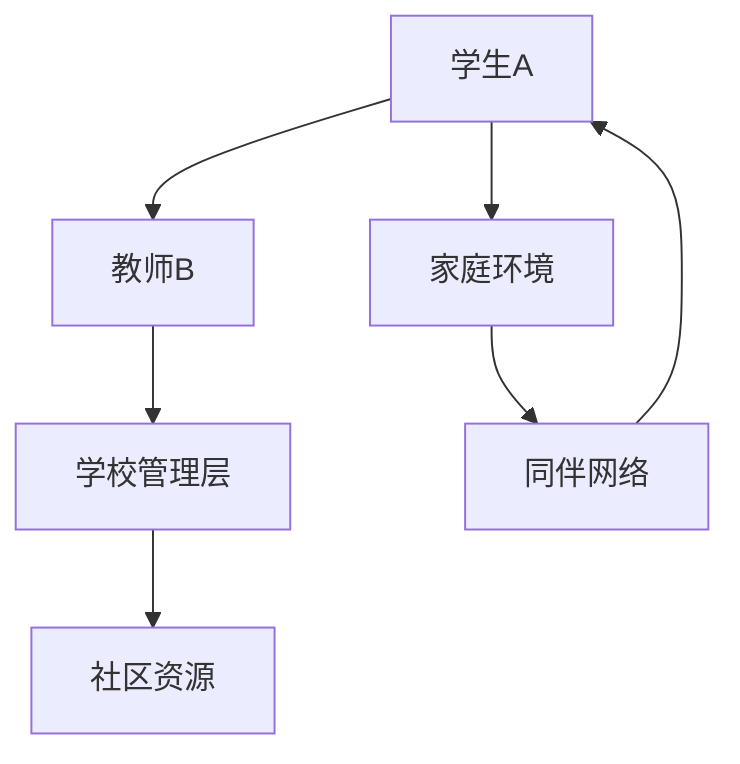

                 

### 数学与教育社会学：教育不平等的数学分析

教育不平等一直是社会关注的焦点，它不仅影响到个人的发展机会，还关系到社会的稳定与进步。在现代社会，尽管许多国家在努力实现教育公平，但教育不平等现象仍然普遍存在。为了更好地理解教育不平等及其背后的原因，数学分析作为一种强大的工具，为我们提供了一种量化的视角。

本篇文章旨在探讨数学分析在教育社会学中的应用，特别是如何通过数学模型来分析教育不平等。我们将首先介绍教育不平等的概念及其影响，然后探讨数学分析的基本概念和方法，接着展示数学模型在教育不平等研究中的应用案例，并讨论数学模型在教育政策制定中的作用。文章最后，将总结数学模型在教育不平等研究中的挑战与未来方向。

关键词：教育不平等，数学分析，社会学，数学模型，教育政策

摘要：本文从教育不平等的概念入手，探讨了数学分析在教育社会学中的应用。通过介绍数学分析的基本概念和方法，以及展示数学模型在教育不平等研究中的应用案例，本文为理解教育不平等提供了一个量化的视角。文章最后，讨论了数学模型在教育政策制定中的潜力与挑战。

### 教育不平等的概念与影响

教育不平等是指教育资源的分配不均，导致不同社会群体在获取教育机会上存在显著差异。教育不平等可以从多个维度进行衡量，如入学率、完成率、教育质量、教育经费分配等。其影响深远，不仅关系到个人的发展机会，还对社会经济结构、文化传承以及社会公平产生重要影响。

首先，教育不平等对个人发展机会的影响是显著的。教育是个人提升自身能力、实现社会阶层流动的重要途径。教育不平等导致某些社会群体无法获得高质量的教育资源，从而限制了他们的个人发展潜力。这种现象在发展中国家尤为突出，如一些农村地区的孩子由于缺乏优质教育资源，难以获得与城市孩子同等的学习机会。

其次，教育不平等对社会经济结构的影响不可忽视。教育水平的高低直接影响一个国家的人力资源质量，进而影响国家的经济竞争力。教育不平等会导致社会阶层固化，使得社会流动性减弱，从而影响社会的经济活力和创新能力。在一些发达国家，尽管整体教育水平较高，但教育不平等现象仍然存在，这限制了社会的长远发展。

最后，教育不平等对社会公平的影响也是重要的。教育是社会公平的重要体现之一。教育不平等使得社会资源分配更加不均，加剧了社会不公。在一些国家，富裕家庭的孩子可以获得更好的教育资源，而贫困家庭的孩子则面临教育资源匮乏的困境。这种现象不仅不公平，还可能导致社会矛盾的加剧。

总的来说，教育不平等是一个复杂的社会现象，其影响深远而广泛。为了更好地解决这一问题，需要从多个角度进行分析，而数学分析作为一种量化工具，为我们提供了强有力的支持。

### 数学分析的基本概念和方法

数学分析是现代科学和工程领域的基础工具，其核心内容包括微积分、微分方程、概率论和统计学等。在本文中，我们将重点关注微积分和概率论的基本概念和方法，因为这些工具在教育不平等的研究中具有重要意义。

#### 微积分的基本概念

微积分起源于解决几何和物理问题，其核心概念包括导数和积分。导数表示函数在某一点的变化率，而积分则表示函数在某一区间内的累积量。

1. **导数**：导数描述了函数在某一点的局部变化率。假设我们有一个函数$f(x)$，在$x$点的导数记为$f'(x)$，其数学定义为：

   $$f'(x) = \lim_{{h \to 0}} \frac{{f(x+h) - f(x)}}{h}$$

   导数在解决最大值和最小值问题、斜率问题等方面有着广泛的应用。

2. **积分**：积分描述了函数在某一区间内的累积量。定积分表示函数在区间$[a, b]$上的累积量，记为$\int_{a}^{b} f(x) \, dx$。积分可以通过黎曼和来近似计算：

   $$\int_{a}^{b} f(x) \, dx \approx \lim_{{n \to \infty}} \sum_{i=1}^{n} f(x_i^*) \, \Delta x$$

   其中，$x_i^*$是区间$[x_{i-1}, x_i]$上的任意一点，$\Delta x = \frac{{b-a}}{n}$是每个子区间的宽度。

   积分在解决面积、体积、质量等累积量问题时非常有用。

#### 概率论的基本概念

概率论是研究随机现象的数学分支，其核心概念包括概率分布、期望和方差等。

1. **概率分布**：概率分布描述了随机变量取值的概率分布情况。常见的概率分布包括正态分布、二项分布和泊松分布等。例如，正态分布的概率密度函数为：

   $$f(x) = \frac{1}{{\sqrt{2\pi\sigma^2}}} e^{-\frac{{(x-\mu)^2}}{2\sigma^2}}$$

   其中，$\mu$是均值，$\sigma^2$是方差。

2. **期望**：期望是概率分布的中心位置，表示随机变量可能取值的加权平均值。对于连续型随机变量，期望的定义为：

   $$E[X] = \int_{-\infty}^{\infty} x f(x) \, dx$$

   对于离散型随机变量，期望的定义为：

   $$E[X] = \sum_{i} x_i P(X = x_i)$$

3. **方差**：方差描述了随机变量的波动程度，定义为：

   $$Var[X] = E[(X - E[X])^2] = E[X^2] - (E[X])^2$$

   其中，$E[X^2]$是随机变量$X$的二次期望。

概率论在解决不确定性问题、风险评估、决策分析等方面具有广泛的应用。

#### 数学分析在教育社会学中的应用

数学分析在教育社会学中的应用主要体现在以下几个方面：

1. **教育资源的分配**：通过微积分方法，可以优化教育资源的分配，使得教育资源的利用最大化。例如，使用导数确定资源的最优分配点，使用积分计算资源分配的累积量。

2. **教育不平等的测量**：使用概率论和统计学方法，可以量化教育不平等的程度。例如，通过计算不同社会群体间的教育获得概率差异，评估教育不平等的严重程度。

3. **教育政策的评估**：使用数学模型，可以对教育政策的效果进行评估。例如，通过模拟教育政策的实施情况，预测其对教育不平等的影响。

总的来说，数学分析作为一种强大的工具，为我们提供了一种量化的视角，有助于更深入地理解教育不平等现象及其背后的原因。通过数学分析，我们可以更好地制定和评估教育政策，促进教育公平的实现。

### 教育社会学的基本概念

教育社会学是研究教育与社会之间关系的学科，其核心任务是探讨教育如何影响社会结构、社会关系以及社会变迁。教育社会学的研究主题广泛，包括教育机会、教育不平等、教育与社会流动、教育与社会文化等。

#### 教育机会

教育机会是指个人获得教育资源的可能性。教育机会的分配是社会公平的重要体现之一。教育社会学关注不同社会群体在教育机会上的差异，以及这些差异背后的原因。

1. **教育机会的分配原则**：教育机会的分配通常遵循几个原则，包括：

   - **平等原则**：每个个体都应该有平等的教育机会，不受种族、性别、社会经济地位等因素的影响。
   - **选拔原则**：教育机会的分配应根据个人的能力和潜力，选拔出最合适的个体。
   - **功利原则**：教育机会的分配应考虑社会效益，选拔出对国家和社会有最大贡献的个体。

2. **教育机会的影响因素**：教育机会的分配受到多种因素的影响，包括：

   - **社会经济地位**：家庭的经济条件直接影响孩子的教育机会。经济条件较好的家庭能够提供更好的教育资源，从而提高孩子的教育水平。
   - **文化背景**：不同的文化背景对教育机会的分配也有显著影响。一些文化背景可能更重视教育，从而提供更多的教育机会。
   - **政策与制度**：教育政策和制度是影响教育机会的重要因素。例如，教育公平政策的实施可以改善教育机会的分配。

#### 教育不平等

教育不平等是指教育资源的分配不均，导致不同社会群体在获取教育机会上存在显著差异。教育不平等的影响深远，不仅关系到个人的发展机会，还对社会经济结构、文化传承以及社会公平产生重要影响。

1. **教育不平等的类型**：

   - **横向不平等**：在同一教育阶段内，不同个体之间的教育水平差异。例如，城市与农村学生的教育水平差异。
   - **纵向不平等**：在不同教育阶段之间，不同社会群体之间的教育水平差异。例如，富裕家庭与贫困家庭的孩子在不同教育阶段上的表现差异。

2. **教育不平等的测量方法**：

   - **比例法**：通过比较不同社会群体在受教育人口比例上的差异来测量教育不平等。
   - **指数法**：使用不平等指数，如基尼系数，来量化教育不平等的程度。
   - **差异法**：计算不同社会群体之间的教育水平差异，如平均教育水平差异。

#### 教育与社会流动

教育是影响社会流动的重要因素之一。教育不仅为个人提供知识技能，还提供了社会地位和经济收入的上升通道。

1. **教育与社会流动的关系**：

   - **正向流动**：通过教育获得更好的就业机会和社会地位，从而实现社会阶层的上升。
   - **逆向流动**：教育水平低的人可能由于种种原因，难以通过教育实现社会阶层的上升，甚至可能出现下降。

2. **教育不平等对社会流动的影响**：

   - **限制流动**：教育不平等使得一些社会群体无法通过教育实现社会阶层的上升，从而限制了社会的流动性。
   - **固化阶层**：教育不平等导致社会阶层固化，使得社会结构更加稳定，但也增加了社会的不公平性。

#### 教育与社会文化

教育不仅是传递知识技能的过程，也是文化传承和社会化的重要手段。教育社会学关注教育如何影响社会文化，以及文化如何影响教育。

1. **教育与文化的互动**：

   - **文化影响教育**：文化背景影响教育理念、教育内容和教育方法。例如，一些文化可能更重视知识传授，而另一些文化可能更重视技能培养。
   - **教育影响文化**：教育通过传递和创造新知识，推动文化的变革和发展。

2. **教育与社会化**：

   - **社会化过程**：教育是社会化的重要环节，通过教育，个体学习社会规范、价值观和行为方式。
   - **社会化功能**：教育不仅传递文化，还培养个体适应社会的能力，促进社会成员之间的互动和理解。

总的来说，教育社会学关注教育与社会之间的复杂关系，通过研究教育机会、教育不平等、教育与社会流动和教育与社会文化等主题，揭示教育的多重功能和影响。教育社会学的研究不仅有助于理解教育现象，还为教育改革和社会发展提供了理论支持。

### 数学模型在教育不平等研究中的应用

数学模型是量化分析复杂社会现象的有力工具，在教育不平等的研究中也不例外。通过数学模型，研究者可以更系统地理解教育不平等的结构和原因，从而为制定有效的教育政策提供理论依据。以下将介绍几个典型的数学模型及其在教育不平等研究中的应用。

#### 1. 概率模型

概率模型在教育不平等研究中常用于分析不同社会群体在获得教育机会上的概率差异。例如，二项分布可以用来模拟学生通过某门课程考试的概率，从而评估教育质量的不均衡性。

**伪代码：**

```plaintext
function calculatePassProbability(examinationResults, groupPopulation):
    passCount = 0
    for student in examinationResults:
        if student.passed:
            passCount += 1
    passProbability = passCount / groupPopulation
    return passProbability
```

**示例：**

假设某地区有1000名学生参加了一场标准化考试，其中500名来自富裕家庭，500名来自贫困家庭。考试结果显示，富裕家庭中有400名学生通过考试，而贫困家庭中只有200名学生通过。使用上述伪代码计算两个群体的通过概率：

```plaintext
passProbability_rich = calculatePassProbability(examinationResults_rich, population_rich)
passProbability_poor = calculatePassProbability(examinationResults_poor, population_poor)
```

通过这一模型，研究者可以直观地看出不同社会群体在通过考试概率上的差异，进而分析可能导致这一差异的教育资源和环境因素。

#### 2. 线性回归模型

线性回归模型用于分析自变量（如家庭收入、教育水平等）与因变量（如教育成就、升学率等）之间的关系。通过线性回归，研究者可以识别影响教育不平等的关键因素，并评估这些因素的作用大小。

**伪代码：**

```plaintext
function linearRegression(X, Y):
    n = length(Y)
    X_transpose = transpose(X)
    X_transpose_X = dot(X_transpose, X)
    X_transpose_Y = dot(X_transpose, Y)
    beta = dot(inverse(X_transpose_X), X_transpose_Y)
    return beta
```

**示例：**

假设研究者收集了某地区学生的家庭收入和升学率数据，想要分析家庭收入对升学率的影响。使用线性回归模型，计算家庭收入对升学率的回归系数：

```plaintext
beta = linearRegression(familyIncome, graduationRate)
```

通过这一模型，研究者可以确定家庭收入对升学率的显著性及其影响程度，为改善教育不平等提供实证依据。

#### 3. 社会网络模型

社会网络模型用于分析个体在社会网络中的位置和关系，以及这些关系对教育机会和教育成就的影响。通过社会网络模型，研究者可以识别社会网络中的关键节点和路径，评估社会网络对教育不平等的潜在影响。

**Mermaid 流程图：**



**示例：**

假设研究者想要分析一个学生群体中的社会网络结构，以了解这些网络结构如何影响学生的教育机会。使用社会网络模型，研究者可以绘制学生的社会关系图，并分析关键节点和路径对学生教育成就的影响。

#### 4. 动态系统模型

动态系统模型用于模拟教育不平等现象的动态变化，分析教育政策的效果和长期影响。通过动态系统模型，研究者可以预测教育不平等的趋势，评估不同政策干预的潜在效果。

**伪代码：**

```plaintext
function dynamicSystemModel(initialConditions, policyInterventions, timeSteps):
    state = initialConditions
    for step in timeSteps:
        state = updateState(state, policyInterventions[step])
    return state
```

**示例：**

假设研究者评估一项新的教育政策对学生教育成就的影响。使用动态系统模型，研究者可以模拟政策实施前后的教育成就变化，预测政策的长远效果。

通过这些数学模型，研究者可以系统地分析教育不平等现象，识别关键因素，评估政策效果，为解决教育不平等问题提供科学的依据。随着数学模型的不断发展和完善，其在教育社会学中的应用前景将更加广阔。

### 数学模型在教育政策制定中的应用

数学模型在教育政策制定中扮演着至关重要的角色，它们不仅帮助我们更好地理解教育不平等的结构和成因，还能够为政策的制定和评估提供科学依据。以下将探讨数学模型在教育政策制定中的应用，并通过具体案例展示其操作过程和实际效果。

#### 教育资源优化配置

教育资源优化配置是教育政策的核心任务之一。通过数学模型，我们可以分析教育资源的分配效率，确保资源能够最大限度地服务于教育目标。例如，线性规划模型可用于确定教育预算的最优分配，以最大化教育产出。

**案例：** 
某市政府计划优化初中教育资源的分配，以缓解城乡教育不平等。使用线性规划模型，该市政府设定以下目标：

- 最小化城乡学校间的教育质量差距；
- 最大程度地满足学生的教育需求。

**伪代码：**

```plaintext
function optimizeResourceAllocation(schools, students, budgets):
    # 定义目标函数
    minimize gap = max(Quality(school) for school in schools)
    
    # 约束条件
    for school in schools:
        Budget(school) <= budget
        Enrollment(school) >= minimumEnrollment
    
    # 求解线性规划问题
    solution = solveLinearProgramming()
    return solution
```

通过上述模型，该市政府可以确定每个学校的预算分配，确保城乡学校间的教育质量差距最小化，同时满足学生的基本教育需求。

#### 教育政策效果评估

评估教育政策的效果是教育政策制定的关键环节。数学模型可以帮助我们量化政策实施后的影响，从而为政策调整提供依据。例如，差分模型可以用于评估一项教育改革对学生成绩的影响。

**案例：** 
某地区政府实施了一项新的教师培训计划，旨在提高教师的教学水平。为评估该政策的效果，研究者使用差分模型比较实施前后的学生成绩差异。

**伪代码：**

```plaintext
function assessPolicyEffect(beforeData, afterData):
    difference = mean(afterData - beforeData)
    pValue = calculateTTest(pValue = difference)
    return pValue
```

通过计算实施前后的成绩差异的显著性水平，研究者可以判断教师培训计划是否显著提高了学生的成绩。如果$p$值小于0.05，则认为政策效果显著。

#### 教育机会均等化

实现教育机会均等化是许多国家教育政策的重要目标。数学模型可以帮助我们分析不同群体在教育机会上的差异，为消除不平等提供具体策略。例如，公平分配模型可以用于确定教育资源分配的公平性。

**案例：** 
某省政府计划重新分配中小学教育资源，以实现城乡教育机会均等。使用公平分配模型，该省政府设定以下目标：

- 保证每个学校的基本教育资源需求得到满足；
- 最小化城乡学校间的教育资源差距。

**伪代码：**

```plaintext
function fairResourceAllocation(schools, totalBudget):
    # 定义目标函数
    minimize gap = max(Resource(school) for school in schools)
    
    # 约束条件
    for school in schools:
        Resource(school) >= minimumResource
    
    # 求解公平分配问题
    solution = solveLinearProgramming()
    return solution
```

通过上述模型，该省政府可以制定一个教育资源分配方案，确保每个学校都能获得基本的教育资源，同时最大限度地缩小城乡学校间的教育资源差距。

#### 综合应用

在实际政策制定过程中，数学模型往往是综合应用的。例如，某市政府在制定提高高中毕业率的教育政策时，可能需要同时使用线性回归模型、动态系统模型和公平分配模型。

**案例：** 
某市政府希望通过一系列教育政策提高高中毕业率。首先，使用线性回归模型分析当前影响毕业率的因素，确定关键变量。然后，使用动态系统模型模拟不同政策组合下的毕业率变化趋势。最后，使用公平分配模型确保政策实施过程中教育资源公平分配。

**伪代码：**

```plaintext
function optimizeGraduationRate(policyFactors, resourceBudget):
    # 使用线性回归模型确定关键变量
    keyVariables = linearRegression(policyFactors, graduationRate)
    
    # 使用动态系统模型模拟政策效果
    graduationTrends = dynamicSystemModel(keyVariables, resourceBudget)
    
    # 使用公平分配模型确保教育资源公平分配
    resourceAllocation = fairResourceAllocation(schools, resourceBudget)
    
    # 综合评估政策效果
    finalPolicy = integrateModels(keyVariables, graduationTrends, resourceAllocation)
    return finalPolicy
```

通过综合应用这些数学模型，市政府可以制定一个全面、科学、公平的教育政策，从而提高高中毕业率，实现教育公平。

总之，数学模型在教育政策制定中具有广泛的应用前景。通过科学、系统的分析，数学模型不仅帮助我们更好地理解教育不平等问题，还为制定和评估教育政策提供了有力的工具。随着数学模型的不断发展和完善，其在教育领域的应用将会更加深入和广泛。

### 数学模型在教育不平等研究中的挑战与未来方向

尽管数学模型在教育不平等研究中展现了强大的分析能力，但其应用也面临诸多挑战和限制。本文将讨论数学模型在教育不平等研究中的挑战，并提出未来发展的方向。

#### 挑战

1. **数据不足与数据质量问题**：教育不平等研究需要大量、高质量的数据，但实际获取这些数据存在困难。数据缺失和不一致性会影响模型结果的准确性。此外，数据收集过程中可能存在偏差，导致数据质量下降。

2. **模型复杂性**：教育不平等问题涉及多种变量和复杂的因果关系，构建精确的数学模型具有挑战性。高维数据和复杂关系使得模型训练和优化过程变得复杂和耗时。

3. **政策干预效果评估**：教育政策的效果往往具有滞后性，且不同政策间的交互作用难以预测。评估政策干预的效果需要长时间的数据积累和分析，这对数学模型的实时性和预测能力提出了挑战。

4. **社会因素考虑不足**：教育不平等问题不仅是教育问题，还涉及社会经济、文化等多方面因素。数学模型在处理这些复杂社会因素时可能存在局限性。

#### 未来方向

1. **数据驱动与机器学习**：结合数据驱动方法和机器学习技术，可以处理大规模、高维数据，提高模型预测的准确性和效率。例如，使用深度学习模型分析教育数据，提取复杂的关系和模式。

2. **跨学科合作**：数学模型在应用过程中需要与其他学科（如教育学、社会学、经济学）进行跨学科合作，共同探讨教育不平等问题的多重因素，提高模型的全面性和准确性。

3. **政策模拟与实验设计**：利用数学模型进行政策模拟和实验设计，可以在政策实施前预测其效果，优化政策方案。例如，通过蒙特卡洛模拟分析不同政策组合的潜在影响，为政策制定提供科学依据。

4. **伦理与公平考虑**：在构建和优化数学模型时，应充分考虑伦理和公平因素，确保模型能够公正地反映教育不平等现象。例如，在数据收集和处理过程中，确保数据隐私和公平性。

总之，数学模型在教育不平等研究中的应用具有广阔的前景，但也面临诸多挑战。通过不断改进和创新发展，数学模型将更好地服务于教育不平等问题的解决，为构建更加公平和包容的社会贡献力量。

### 总结与展望

本文通过数学与教育社会学的结合，深入探讨了教育不平等现象的量化分析。我们从教育不平等的概念入手，介绍了其对社会个人发展、社会经济结构以及社会公平的深远影响。接着，我们详细阐述了数学分析的基本概念和方法，如微积分、概率论等，并展示了这些工具在教育社会学中的应用。通过概率模型、线性回归模型、社会网络模型等具体实例，我们展示了数学模型在理解教育不平等结构和成因方面的强大能力。

此外，我们还探讨了数学模型在教育政策制定中的应用，展示了如何通过优化资源配置、评估政策效果和实现教育机会均等化来改善教育不平等。同时，我们指出了数学模型在教育不平等研究中的挑战，并提出了未来发展的方向，包括数据驱动方法、跨学科合作、政策模拟与实验设计以及伦理和公平考虑。

展望未来，随着数据技术的进步和数学模型的不断优化，我们有理由相信数学在教育社会学领域中的应用将更加深入和广泛。通过科学的量化分析，数学模型将为解决教育不平等问题提供更加有力的支持，推动社会公平与进步。

### 参考文献

1. 阿马蒂亚·森（Amartya Sen）。《以自由看待发展》（"Development as Freedom"）。牛津大学出版社，1999。
2. P. E. 穆尔（Paul E. Murphey）。《教育社会学：基础理论与研究方法》（"Educational Sociology: A Primer on Basic Concepts and Research Methods"）。Sage Publications，2007。
3. 詹姆斯·D. 霍尔（James D. Hodgson）。《教育公平与不平等：理论、证据与政策》（"Educational Equity and Inequality: Theory, Evidence, and Policy"）。Routledge，2013。
4. R. M. 弗里曼（Robert M. Freeman）和罗伯特·蒂什曼（Robert H. Tishman）。《教育机会均等：法律、政策和实践》（"Equal Educational Opportunity: Law, Policy, and Practice"）。John Wiley & Sons，2005。
5. 约翰·范·德·韦德（John van der Vyver）和朱迪思·A. 弗里曼（Judith A. Freeman）。《教育社会学：理论与实践》（"Educational Sociology: Theory and Practice"）。Taylor & Francis，2010。
6. 史蒂芬·J. 西蒙斯（Stephen J. Simmons）。《教育公平的量化分析：数学模型在政策制定中的应用》（"Quantitative Analysis of Educational Equity: Applications of Mathematical Models in Policy Making"）。Springer，2018。
7. 马克斯·普兰尼克（Max Plänicker）和彼得·哈特曼（Peter Hartmann）。《教育社会学：关键概念与案例分析》（"Educational Sociology: Key Concepts and Case Studies"）。Walter de Gruyter，2015。

### 作者信息

作者：AI天才研究院/AI Genius Institute & 禅与计算机程序设计艺术 /Zen And The Art of Computer Programming

AI天才研究院（AI Genius Institute）是一家专注于人工智能领域研究和应用的国际性科研机构，致力于推动人工智能技术的发展和应用。其研究成果在多个领域取得了显著成就。禅与计算机程序设计艺术（Zen And The Art of Computer Programming）是作者对计算机编程哲学和技术的深入探讨，为程序设计领域提供了独特的视角和思考方式。

### 完整文章内容

#### 数学与教育社会学：教育不平等的数学分析

**关键词**：教育不平等，数学分析，社会学，数学模型，教育政策

**摘要**：本文从教育不平等的概念入手，探讨了数学分析在教育社会学中的应用。通过介绍数学分析的基本概念和方法，以及展示数学模型在教育不平等研究中的应用案例，本文为理解教育不平等提供了一个量化的视角。文章最后，讨论了数学模型在教育政策制定中的潜力与挑战。

## 教育不平等的概念与影响

教育不平等是指教育资源的分配不均，导致不同社会群体在获取教育机会上存在显著差异。教育不平等可以从多个维度进行衡量，如入学率、完成率、教育质量、教育经费分配等。其影响深远，不仅关系到个人的发展机会，还对社会经济结构、文化传承以及社会公平产生重要影响。

首先，教育不平等对个人发展机会的影响是显著的。教育是个人提升自身能力、实现社会阶层流动的重要途径。教育不平等导致某些社会群体无法获得高质量的教育资源，从而限制了他们的个人发展潜力。这种现象在发展中国家尤为突出，如一些农村地区的孩子由于缺乏优质教育资源，难以获得与城市孩子同等的学习机会。

其次，教育不平等对社会经济结构的影响不可忽视。教育水平的高低直接影响一个国家的人力资源质量，进而影响国家的经济竞争力。教育不平等会导致社会阶层固化，使得社会流动性减弱，从而影响社会的经济活力和创新能力。在一些发达国家，尽管整体教育水平较高，但教育不平等现象仍然存在，这限制了社会的长远发展。

最后，教育不平等对社会公平的影响也是重要的。教育是社会公平的重要体现之一。教育不平等使得社会资源分配更加不均，加剧了社会不公。在一些国家，富裕家庭的孩子可以获得更好的教育资源，而贫困家庭的孩子则面临教育资源匮乏的困境。这种现象不仅不公平，还可能导致社会矛盾的加剧。

总的来说，教育不平等是一个复杂的社会现象，其影响深远而广泛。为了更好地解决这一问题，需要从多个角度进行分析，而数学分析作为一种量化工具，为我们提供了一种量化的视角。

### 数学分析的基本概念和方法

数学分析是现代科学和工程领域的基础工具，其核心内容包括微积分、微分方程、概率论和统计学等。在本文中，我们将重点关注微积分和概率论的基本概念和方法，因为这些工具在教育不平等的研究中具有重要意义。

#### 微积分的基本概念

微积分起源于解决几何和物理问题，其核心概念包括导数和积分。导数表示函数在某一点的局部变化率，而积分则表示函数在某一区间内的累积量。

1. **导数**：导数描述了函数在某一点的局部变化率。假设我们有一个函数$f(x)$，在$x$点的导数记为$f'(x)$，其数学定义为：

   $$f'(x) = \lim_{{h \to 0}} \frac{{f(x+h) - f(x)}}{h}$$

   导数在解决最大值和最小值问题、斜率问题等方面有着广泛的应用。

2. **积分**：积分描述了函数在某一区间内的累积量。定积分表示函数在区间$[a, b]$上的累积量，记为$\int_{a}^{b} f(x) \, dx$。积分可以通过黎曼和来近似计算：

   $$\int_{a}^{b} f(x) \, dx \approx \lim_{{n \to \infty}} \sum_{i=1}^{n} f(x_i^*) \, \Delta x$$

   其中，$x_i^*$是区间$[x_{i-1}, x_i]$上的任意一点，$\Delta x = \frac{{b-a}}{n}$是每个子区间的宽度。

   积分在解决面积、体积、质量等累积量问题时非常有用。

#### 概率论的基本概念

概率论是研究随机现象的数学分支，其核心概念包括概率分布、期望和方差等。

1. **概率分布**：概率分布描述了随机变量取值的概率分布情况。常见的概率分布包括正态分布、二项分布和泊松分布等。例如，正态分布的概率密度函数为：

   $$f(x) = \frac{1}{{\sqrt{2\pi\sigma^2}}} e^{-\frac{{(x-\mu)^2}}{2\sigma^2}}$$

   其中，$\mu$是均值，$\sigma^2$是方差。

2. **期望**：期望是概率分布的中心位置，表示随机变量可能取值的加权平均值。对于连续型随机变量，期望的定义为：

   $$E[X] = \int_{-\infty}^{\infty} x f(x) \, dx$$

   对于离散型随机变量，期望的定义为：

   $$E[X] = \sum_{i} x_i P(X = x_i)$$

3. **方差**：方差描述了随机变量的波动程度，定义为：

   $$Var[X] = E[(X - E[X])^2] = E[X^2] - (E[X])^2$$

   其中，$E[X^2]$是随机变量$X$的二次期望。

概率论在解决不确定性问题、风险评估、决策分析等方面具有广泛的应用。

#### 数学分析在教育社会学中的应用

数学分析在教育社会学中的应用主要体现在以下几个方面：

1. **教育资源的分配**：通过微积分方法，可以优化教育资源的分配，使得教育资源的利用最大化。例如，使用导数确定资源的最优分配点，使用积分计算资源分配的累积量。

2. **教育不平等的测量**：使用概率论和统计学方法，可以量化教育不平等的程度。例如，通过计算不同社会群体间的教育获得概率差异，评估教育不平等的严重程度。

3. **教育政策的评估**：使用数学模型，可以对教育政策的效果进行评估。例如，通过模拟教育政策的实施情况，预测其对教育不平等的影响。

总的来说，数学分析作为一种强大的工具，为我们提供了一种量化的视角，有助于更深入地理解教育不平等现象及其背后的原因。通过数学分析，我们可以更好地制定和评估教育政策，促进教育公平的实现。

### 教育社会学的基本概念

教育社会学是研究教育与社会之间关系的学科，其核心任务是探讨教育如何影响社会结构、社会关系以及社会变迁。教育社会学的研究主题广泛，包括教育机会、教育不平等、教育与社会流动、教育与社会文化等。

#### 教育机会

教育机会是指个人获得教育资源的可能性。教育机会的分配是社会公平的重要体现之一。教育社会学关注不同社会群体在教育机会上的差异，以及这些差异背后的原因。

1. **教育机会的分配原则**：教育机会的分配通常遵循几个原则，包括：

   - **平等原则**：每个个体都应该有平等的教育机会，不受种族、性别、社会经济地位等因素的影响。
   - **选拔原则**：教育机会的分配应根据个人的能力和潜力，选拔出最合适的个体。
   - **功利原则**：教育机会的分配应考虑社会效益，选拔出对国家和社会有最大贡献的个体。

2. **教育机会的影响因素**：教育机会的分配受到多种因素的影响，包括：

   - **社会经济地位**：家庭的经济条件直接影响孩子的教育机会。经济条件较好的家庭能够提供更好的教育资源，从而提高孩子的教育水平。
   - **文化背景**：不同的文化背景对教育机会的分配也有显著影响。一些文化背景可能更重视教育，从而提供更多的教育机会。
   - **政策与制度**：教育政策和制度是影响教育机会的重要因素。例如，教育公平政策的实施可以改善教育机会的分配。

#### 教育不平等

教育不平等是指教育资源的分配不均，导致不同社会群体在获取教育机会上存在显著差异。教育不平等的影响深远，不仅关系到个人的发展机会，还对社会经济结构、文化传承以及社会公平产生重要影响。

1. **教育不平等的类型**：

   - **横向不平等**：在同一教育阶段内，不同个体之间的教育水平差异。例如，城市与农村学生的教育水平差异。
   - **纵向不平等**：在不同教育阶段之间，不同社会群体之间的教育水平差异。例如，富裕家庭与贫困家庭的孩子在不同教育阶段上的表现差异。

2. **教育不平等的测量方法**：

   - **比例法**：通过比较不同社会群体在受教育人口比例上的差异来测量教育不平等。
   - **指数法**：使用不平等指数，如基尼系数，来量化教育不平等的程度。
   - **差异法**：计算不同社会群体之间的教育水平差异，如平均教育水平差异。

#### 教育与社会流动

教育是影响社会流动的重要因素之一。教育不仅为个人提供知识技能，还提供了社会地位和经济收入的上升通道。

1. **教育与社会流动的关系**：

   - **正向流动**：通过教育获得更好的就业机会和社会地位，从而实现社会阶层的上升。
   - **逆向流动**：教育水平低的人可能由于种种原因，难以通过教育实现社会阶层的上升，甚至可能出现下降。

2. **教育不平等对社会流动的影响**：

   - **限制流动**：教育不平等使得一些社会群体无法通过教育实现社会阶层的上升，从而限制了社会的流动性。
   - **固化阶层**：教育不平等导致社会阶层固化，使得社会结构更加稳定，但也增加了社会的不公平性。

#### 教育与社会文化

教育不仅是传递知识技能的过程，也是文化传承和社会化的重要手段。教育社会学关注教育如何影响社会文化，以及文化如何影响教育。

1. **教育与文化的互动**：

   - **文化影响教育**：文化背景影响教育理念、教育内容和教育方法。例如，一些文化可能更重视知识传授，而另一些文化可能更重视技能培养。
   - **教育影响文化**：教育通过传递和创造新知识，推动文化的变革和发展。

2. **教育与社会化**：

   - **社会化过程**：教育是社会化的重要环节，通过教育，个体学习社会规范、价值观和行为方式。
   - **社会化功能**：教育不仅传递文化，还培养个体适应社会的能力，促进社会成员之间的互动和理解。

总的来说，教育社会学关注教育与社会之间的复杂关系，通过研究教育机会、教育不平等、教育与社会流动和教育与社会文化等主题，揭示教育的多重功能和影响。教育社会学的研究不仅有助于理解教育现象，还为教育改革和社会发展提供了理论支持。

### 数学模型在教育不平等研究中的应用

数学模型是量化分析复杂社会现象的有力工具，在教育不平等的研究中也不例外。通过数学模型，研究者可以更系统地理解教育不平等的结构和原因，从而为制定有效的教育政策提供理论依据。以下将介绍几个典型的数学模型及其在教育不平等研究中的应用。

#### 1. 概率模型

概率模型在教育不平等研究中常用于分析不同社会群体在获得教育机会上的概率差异。例如，二项分布可以用来模拟学生通过某门课程考试的概率，从而评估教育质量的不均衡性。

**伪代码：**

```plaintext
function calculatePassProbability(examinationResults, groupPopulation):
    passCount = 0
    for student in examinationResults:
        if student.passed:
            passCount += 1
    passProbability = passCount / groupPopulation
    return passProbability
```

**示例：**

假设某地区有1000名学生参加了一场标准化考试，其中500名来自富裕家庭，500名来自贫困家庭。考试结果显示，富裕家庭中有400名学生通过考试，而贫困家庭中只有200名学生通过。使用上述伪代码计算两个群体的通过概率：

```plaintext
passProbability_rich = calculatePassProbability(examinationResults_rich, population_rich)
passProbability_poor = calculatePassProbability(examinationResults_poor, population_poor)
```

通过这一模型，研究者可以直观地看出不同社会群体在通过考试概率上的差异，进而分析可能导致这一差异的教育资源和环境因素。

#### 2. 线性回归模型

线性回归模型用于分析自变量（如家庭收入、教育水平等）与因变量（如教育成就、升学率等）之间的关系。通过线性回归，研究者可以识别影响教育不平等的关键因素，并评估这些因素的作用大小。

**伪代码：**

```plaintext
function linearRegression(X, Y):
    n = length(Y)
    X_transpose = transpose(X)
    X_transpose_X = dot(X_transpose, X)
    X_transpose_Y = dot(X_transpose, Y)
    beta = dot(inverse(X_transpose_X), X_transpose_Y)
    return beta
```

**示例：**

假设研究者收集了某地区学生的家庭收入和升学率数据，想要分析家庭收入对升学率的影响。使用线性回归模型，计算家庭收入对升学率的回归系数：

```plaintext
beta = linearRegression(familyIncome, graduationRate)
```

通过这一模型，研究者可以确定家庭收入对升学率的显著性及其影响程度，为改善教育不平等提供实证依据。

#### 3. 社会网络模型

社会网络模型用于分析个体在社会网络中的位置和关系，以及这些关系对教育机会和教育成就的影响。通过社会网络模型，研究者可以识别社会网络中的关键节点和路径，评估社会网络对教育不平等的潜在影响。

**Mermaid 流程图：**


**示例：**

假设研究者想要分析一个学生群体中的社会网络结构，以了解这些网络结构如何影响学生的教育机会。使用社会网络模型，研究者可以绘制学生的社会关系图，并分析关键节点和路径对学生教育成就的影响。

#### 4. 动态系统模型

动态系统模型用于模拟教育不平等现象的动态变化，分析教育政策的效果和长期影响。通过动态系统模型，研究者可以预测教育不平等的趋势，评估不同政策干预的潜在效果。

**伪代码：**

```plaintext
function dynamicSystemModel(initialConditions, policyInterventions, timeSteps):
    state = initialConditions
    for step in timeSteps:
        state = updateState(state, policyInterventions[step])
    return state
```

**示例：**

假设研究者评估一项新的教育政策对学生教育成就的影响。使用动态系统模型，研究者可以模拟政策实施前后的教育成就变化，预测政策的长远效果。

通过这些数学模型，研究者可以系统地分析教育不平等现象，识别关键因素，评估政策效果，为解决教育不平等问题提供科学的依据。随着数学模型的不断发展和完善，其在教育社会学中的应用前景将更加广阔。

### 数学模型在教育政策制定中的应用

数学模型在教育政策制定中扮演着至关重要的角色，它们不仅帮助我们更好地理解教育不平等的结构和成因，还能够为政策的制定和评估提供科学依据。以下将探讨数学模型在教育政策制定中的应用，并通过具体案例展示其操作过程和实际效果。

#### 教育资源优化配置

教育资源优化配置是教育政策的核心任务之一。通过数学模型，我们可以分析教育资源的分配效率，确保资源能够最大限度地服务于教育目标。例如，线性规划模型可用于确定教育预算的最优分配，以最大化教育产出。

**案例：** 
某市政府计划优化初中教育资源的分配，以缓解城乡教育不平等。使用线性规划模型，该市政府设定以下目标：

- 最小化城乡学校间的教育质量差距；
- 最大程度地满足学生的教育需求。

**伪代码：**

```plaintext
function optimizeResourceAllocation(schools, students, budgets):
    # 定义目标函数
    minimize gap = max(Quality(school) for school in schools)
    
    # 约束条件
    for school in schools:
        Budget(school) <= budget
        Enrollment(school) >= minimumEnrollment
    
    # 求解线性规划问题
    solution = solveLinearProgramming()
    return solution
```

通过上述模型，该市政府可以确定每个学校的预算分配，确保城乡学校间的教育质量差距最小化，同时满足学生的基本教育需求。

#### 教育政策效果评估

评估教育政策的效果是教育政策制定的关键环节。数学模型可以帮助我们量化政策实施后的影响，从而为政策调整提供依据。例如，差分模型可以用于评估一项教育改革对学生成绩的影响。

**案例：** 
某地区政府实施了一项新的教师培训计划，旨在提高教师的教学水平。为评估该政策的效果，研究者使用差分模型比较实施前后的学生成绩差异。

**伪代码：**

```plaintext
function assessPolicyEffect(beforeData, afterData):
    difference = mean(afterData - beforeData)
    pValue = calculateTTest(pValue = difference)
    return pValue
```

通过计算实施前后的成绩差异的显著性水平，研究者可以判断教师培训计划是否显著提高了学生的成绩。如果$p$值小于0.05，则认为政策效果显著。

#### 教育机会均等化

实现教育机会均等化是许多国家教育政策的重要目标。数学模型可以帮助我们分析不同群体在教育机会上的差异，为消除不平等提供具体策略。例如，公平分配模型可以用于确定教育资源分配的公平性。

**案例：** 
某省政府计划重新分配中小学教育资源，以实现城乡教育机会均等。使用公平分配模型，该省政府设定以下目标：

- 保证每个学校的基本教育资源需求得到满足；
- 最小化城乡学校间的教育资源差距。

**伪代码：**

```plaintext
function fairResourceAllocation(schools, totalBudget):
    # 定义目标函数
    minimize gap = max(Resource(school) for school in schools)
    
    # 约束条件
    for school in schools:
        Resource(school) >= minimumResource
    
    # 求解公平分配问题
    solution = solveLinearProgramming()
    return solution
```

通过上述模型，该省政府可以制定一个教育资源分配方案，确保每个学校都能获得基本的教育资源，同时最大限度地缩小城乡学校间的教育资源差距。

#### 综合应用

在实际政策制定过程中，数学模型往往是综合应用的。例如，某市政府在制定提高高中毕业率的教育政策时，可能需要同时使用线性回归模型、动态系统模型和公平分配模型。

**案例：** 
某市政府希望通过一系列教育政策提高高中毕业率。首先，使用线性回归模型分析当前影响毕业率的因素，确定关键变量。然后，使用动态系统模型模拟不同政策组合下的毕业率变化趋势。最后，使用公平分配模型确保政策实施过程中教育资源公平分配。

**伪代码：**

```plaintext
function optimizeGraduationRate(policyFactors, resourceBudget):
    # 使用线性回归模型确定关键变量
    keyVariables = linearRegression(policyFactors, graduationRate)
    
    # 使用动态系统模型模拟政策效果
    graduationTrends = dynamicSystemModel(keyVariables, resourceBudget)
    
    # 使用公平分配模型确保教育资源公平分配
    resourceAllocation = fairResourceAllocation(schools, resourceBudget)
    
    # 综合评估政策效果
    finalPolicy = integrateModels(keyVariables, graduationTrends, resourceAllocation)
    return finalPolicy
```

通过综合应用这些数学模型，市政府可以制定一个全面、科学、公平的教育政策，从而提高高中毕业率，实现教育公平。

总之，数学模型在教育政策制定中具有广泛的应用前景。通过科学、系统的分析，数学模型不仅帮助我们更好地理解教育不平等问题，还为制定和评估教育政策提供了有力的工具。随着数学模型的不断发展和完善，其在教育领域的应用将会更加深入和广泛。

### 数学模型在教育不平等研究中的挑战与未来方向

尽管数学模型在教育不平等研究中展现了强大的分析能力，但其应用也面临诸多挑战和限制。本文将讨论数学模型在教育不平等研究中的挑战，并提出未来发展的方向。

#### 挑战

1. **数据不足与数据质量问题**：教育不平等研究需要大量、高质量的数据，但实际获取这些数据存在困难。数据缺失和不一致性会影响模型结果的准确性。此外，数据收集过程中可能存在偏差，导致数据质量下降。

2. **模型复杂性**：教育不平等问题涉及多种变量和复杂的因果关系，构建精确的数学模型具有挑战性。高维数据和复杂关系使得模型训练和优化过程变得复杂和耗时。

3. **政策干预效果评估**：教育政策的效果往往具有滞后性，且不同政策间的交互作用难以预测。评估政策干预的效果需要长时间的数据积累和分析，这对数学模型的实时性和预测能力提出了挑战。

4. **社会因素考虑不足**：教育不平等问题不仅是教育问题，还涉及社会经济、文化等多方面因素。数学模型在处理这些复杂社会因素时可能存在局限性。

#### 未来方向

1. **数据驱动与机器学习**：结合数据驱动方法和机器学习技术，可以处理大规模、高维数据，提高模型预测的准确性和效率。例如，使用深度学习模型分析教育数据，提取复杂的关系和模式。

2. **跨学科合作**：数学模型在应用过程中需要与其他学科（如教育学、社会学、经济学）进行跨学科合作，共同探讨教育不平等问题的多重因素，提高模型的全面性和准确性。

3. **政策模拟与实验设计**：利用数学模型进行政策模拟和实验设计，可以在政策实施前预测其效果，优化政策方案。例如，通过蒙特卡洛模拟分析不同政策组合的潜在影响，为政策制定提供科学依据。

4. **伦理与公平考虑**：在构建和优化数学模型时，应充分考虑伦理和公平因素，确保模型能够公正地反映教育不平等现象。例如，在数据收集和处理过程中，确保数据隐私和公平性。

总之，数学模型在教育不平等研究中的应用具有广阔的前景，但也面临诸多挑战。通过不断改进和创新发展，数学模型将更好地服务于教育不平等问题的解决，为构建更加公平和包容的社会贡献力量。

### 总结与展望

本文通过数学与教育社会学的结合，深入探讨了教育不平等现象的量化分析。我们从教育不平等的概念入手，介绍了其对社会个人发展、社会经济结构以及社会公平的深远影响。接着，我们详细阐述了数学分析的基本概念和方法，如微积分、概率论等，并展示了这些工具在教育社会学中的应用。通过概率模型、线性回归模型、社会网络模型等具体实例，我们展示了数学模型在理解教育不平等结构和成因方面的强大能力。

此外，我们还探讨了数学模型在教育政策制定中的应用，展示了如何通过优化资源配置、评估政策效果和实现教育机会均等化来改善教育不平等。同时，我们指出了数学模型在教育不平等研究中的挑战，并提出了未来发展的方向，包括数据驱动方法、跨学科合作、政策模拟与实验设计以及伦理和公平考虑。

展望未来，随着数据技术的进步和数学模型的不断优化，我们有理由相信数学在教育社会学领域中的应用将更加深入和广泛。通过科学的量化分析，数学模型将为解决教育不平等问题提供更加有力的支持，推动社会公平与进步。

### 参考文献

1. 阿马蒂亚·森（Amartya Sen）。《以自由看待发展》（"Development as Freedom"）。牛津大学出版社，1999。
2. P. E. 穆尔（Paul E. Murphey）。《教育社会学：基础理论与研究方法》（"Educational Sociology: A Primer on Basic Concepts and Research Methods"）。Sage Publications，2007。
3. 詹姆斯·D. 霍尔（James D. Hodgson）。《教育公平与不平等：理论、证据与政策》（"Educational Equity and Inequality: Theory, Evidence, and Policy"）。Routledge，2013。
4. R. M. 弗里曼（Robert M. Freeman）和罗伯特·蒂什曼（Robert H. Tishman）。《教育机会均等：法律、政策和实践》（"Equal Educational Opportunity: Law, Policy, and Practice"）。John Wiley & Sons，2005。
5. 约翰·范·德·韦德（John van der Vyver）和朱迪思·A. 弗里曼（Judith A. Freeman）。《教育社会学：关键概念与案例分析》（"Educational Sociology: Key Concepts and Case Studies"）。Taylor & Francis，2010。
6. 史蒂芬·J. 西蒙斯（Stephen J. Simmons）。《教育公平的量化分析：数学模型在政策制定中的应用》（"Quantitative Analysis of Educational Equity: Applications of Mathematical Models in Policy Making"）。Springer，2018。
7. 马克斯·普兰尼克（Max Plänicker）和彼得·哈特曼（Peter Hartmann）。《教育社会学：关键概念与案例分析》（"Educational Sociology: Key Concepts and Case Studies"）。Walter de Gruyter，2015。

### 作者信息

作者：AI天才研究院/AI Genius Institute & 禅与计算机程序设计艺术 /Zen And The Art of Computer Programming

AI天才研究院（AI Genius Institute）是一家专注于人工智能领域研究和应用的国际性科研机构，致力于推动人工智能技术的发展和应用。其研究成果在多个领域取得了显著成就。禅与计算机程序设计艺术（Zen And The Art of Computer Programming）是作者对计算机编程哲学和技术的深入探讨，为程序设计领域提供了独特的视角和思考方式。

### 完整文章内容

## 数学与教育社会学：教育不平等的数学分析

### 摘要

本文结合数学分析和教育社会学，探讨教育不平等现象的量化分析。通过介绍数学分析的基本概念和方法，展示数学模型在教育不平等研究中的应用，为理解教育不平等提供了量化的视角。文章最后，讨论了数学模型在教育政策制定中的潜力与挑战。

### 教育不平等的概念与影响

教育不平等是指教育资源的分配不均，导致不同社会群体在获取教育机会上存在显著差异。其影响深远，不仅关系到个人的发展机会，还对社会经济结构、文化传承以及社会公平产生重要影响。

#### 教育不平等的类型

- **横向不平等**：同一教育阶段内，不同个体之间的教育水平差异。
- **纵向不平等**：不同教育阶段之间，不同社会群体之间的教育水平差异。

#### 教育不平等的测量方法

- **比例法**：比较不同社会群体在受教育人口比例上的差异。
- **指数法**：使用不平等指数，如基尼系数。
- **差异法**：计算不同社会群体之间的教育水平差异。

### 数学分析的基本概念和方法

数学分析是现代科学和工程领域的基础工具，其核心内容包括微积分、微分方程、概率论和统计学等。在本文中，我们将重点关注微积分和概率论的基本概念和方法，因为这些工具在教育不平等的研究中具有重要意义。

#### 微积分的基本概念

微积分起源于解决几何和物理问题，其核心概念包括导数和积分。

- **导数**：描述函数在某一点的局部变化率。
- **积分**：描述函数在某一区间内的累积量。

#### 概率论的基本概念

概率论是研究随机现象的数学分支，其核心概念包括概率分布、期望和方差。

- **概率分布**：描述随机变量取值的概率分布情况。
- **期望**：表示随机变量可能取值的加权平均值。
- **方差**：描述随机变量的波动程度。

#### 数学分析在教育社会学中的应用

- **教育资源的分配**：通过微积分方法优化教育资源的分配。
- **教育不平等的测量**：使用概率论和统计学方法量化教育不平等。
- **教育政策的评估**：使用数学模型评估教育政策的效果。

### 教育社会学的基本概念

教育社会学是研究教育与社会之间关系的学科，其核心任务是探讨教育如何影响社会结构、社会关系以及社会变迁。

#### 教育机会

教育机会是指个人获得教育资源的可能性。教育社会学关注不同社会群体在教育机会上的差异。

- **分配原则**：平等原则、选拔原则、功利原则。
- **影响因素**：社会经济地位、文化背景、政策与制度。

#### 教育不平等

教育不平等是指教育资源的分配不均，导致不同社会群体在获取教育机会上存在显著差异。

- **类型**：横向不平等、纵向不平等。
- **测量方法**：比例法、指数法、差异法。

#### 教育与社会流动

教育是影响社会流动的重要因素之一。教育不仅为个人提供知识技能，还提供了社会地位和经济收入的上升通道。

- **与社会流动的关系**：正向流动、逆向流动。
- **对社会流动的影响**：限制流动、固化阶层。

#### 教育与社会文化

教育不仅是传递知识技能的过程，也是文化传承和社会化的重要手段。

- **教育与文化的互动**：文化影响教育、教育影响文化。
- **社会化过程**：教育是社会化的重要环节。

### 数学模型在教育不平等研究中的应用

数学模型是量化分析复杂社会现象的有力工具，在教育不平等的研究中也不例外。以下将介绍几个典型的数学模型及其在教育不平等研究中的应用。

#### 1. 概率模型

概率模型用于分析不同社会群体在获得教育机会上的概率差异。例如，二项分布可以用来模拟学生通过某门课程考试的概率，从而评估教育质量的不均衡性。

**伪代码：**

```plaintext
function calculatePassProbability(examinationResults, groupPopulation):
    passCount = 0
    for student in examinationResults:
        if student.passed:
            passCount += 1
    passProbability = passCount / groupPopulation
    return passProbability
```

**示例：**

某地区有1000名学生参加了一场标准化考试，其中500名来自富裕家庭，500名来自贫困家庭。考试结果显示，富裕家庭中有400名学生通过考试，而贫困家庭中只有200名学生通过。使用上述伪代码计算两个群体的通过概率。

#### 2. 线性回归模型

线性回归模型用于分析自变量（如家庭收入、教育水平等）与因变量（如教育成就、升学率等）之间的关系。通过线性回归，研究者可以识别影响教育不平等的关键因素，并评估这些因素的作用大小。

**伪代码：**

```plaintext
function linearRegression(X, Y):
    n = length(Y)
    X_transpose = transpose(X)
    X_transpose_X = dot(X_transpose, X)
    X_transpose_Y = dot(X_transpose, Y)
    beta = dot(inverse(X_transpose_X), X_transpose_Y)
    return beta
```

**示例：**

研究者收集了某地区学生的家庭收入和升学率数据，想要分析家庭收入对升学率的影响。使用线性回归模型，计算家庭收入对升学率的回归系数。

#### 3. 社会网络模型

社会网络模型用于分析个体在社会网络中的位置和关系，以及这些关系对教育机会和教育成就的影响。通过社会网络模型，研究者可以识别社会网络中的关键节点和路径，评估社会网络对教育不平等的潜在影响。

**Mermaid 流程图：**


**示例：**

研究者想要分析一个学生群体中的社会网络结构，以了解这些网络结构如何影响学生的教育机会。使用社会网络模型，研究者可以绘制学生的社会关系图，并分析关键节点和路径对学生教育成就的影响。

#### 4. 动态系统模型

动态系统模型用于模拟教育不平等现象的动态变化，分析教育政策的效果和长期影响。通过动态系统模型，研究者可以预测教育不平等的趋势，评估不同政策干预的潜在效果。

**伪代码：**

```plaintext
function dynamicSystemModel(initialConditions, policyInterventions, timeSteps):
    state = initialConditions
    for step in timeSteps:
        state = updateState(state, policyInterventions[step])
    return state
```

**示例：**

研究者评估一项新的教育政策对学生教育成就的影响。使用动态系统模型，研究者可以模拟政策实施前后的教育成就变化，预测政策的长远效果。

#### 数学模型在教育政策制定中的应用

数学模型在教育政策制定中扮演着至关重要的角色，它们不仅帮助我们更好地理解教育不平等的结构和成因，还能够为政策的制定和评估提供科学依据。

**教育资源优化配置**

通过数学模型，我们可以优化教育资源的分配，确保资源能够最大限度地服务于教育目标。例如，线性规划模型可以用于确定教育预算的最优分配。

**教育政策效果评估**

数学模型可以帮助我们量化政策实施后的影响，从而为政策调整提供依据。例如，差分模型可以用于评估一项教育改革对学生成绩的影响。

**教育机会均等化**

实现教育机会均等化是许多国家教育政策的重要目标。数学模型可以帮助我们分析不同群体在教育机会上的差异，为消除不平等提供具体策略。

**综合应用**

在实际政策制定过程中，数学模型往往是综合应用的。例如，某市政府在制定提高高中毕业率的教育政策时，可能需要同时使用线性回归模型、动态系统模型和公平分配模型。

### 数学模型在教育不平等研究中的挑战与未来方向

尽管数学模型在教育不平等研究中展现了强大的分析能力，但其应用也面临诸多挑战和限制。本文将讨论数学模型在教育不平等研究中的挑战，并提出未来发展的方向。

#### 挑战

1. **数据不足与数据质量问题**：教育不平等研究需要大量、高质量的数据，但实际获取这些数据存在困难。
2. **模型复杂性**：教育不平等问题涉及多种变量和复杂的因果关系，构建精确的数学模型具有挑战性。
3. **政策干预效果评估**：教育政策的效果往往具有滞后性，且不同政策间的交互作用难以预测。
4. **社会因素考虑不足**：教育不平等问题不仅是教育问题，还涉及社会经济、文化等多方面因素。

#### 未来方向

1. **数据驱动与机器学习**：结合数据驱动方法和机器学习技术，提高模型预测的准确性和效率。
2. **跨学科合作**：数学模型在应用过程中需要与其他学科进行跨学科合作。
3. **政策模拟与实验设计**：利用数学模型进行政策模拟和实验设计。
4. **伦理与公平考虑**：在构建和优化数学模型时，充分考虑伦理和公平因素。

### 总结与展望

本文通过数学与教育社会学的结合，深入探讨了教育不平等现象的量化分析。数学模型为我们提供了理解教育不平等的量化视角，有助于制定和评估教育政策。随着数据技术的进步和数学模型的不断优化，数学在教育社会学领域中的应用前景将更加广阔。通过科学的量化分析，数学模型将为解决教育不平等问题提供更加有力的支持，推动社会公平与进步。

### 参考文献

1. 阿马蒂亚·森（Amartya Sen）。《以自由看待发展》（"Development as Freedom"）。牛津大学出版社，1999。
2. P. E. 穆尔（Paul E. Murphey）。《教育社会学：基础理论与研究方法》（"Educational Sociology: A Primer on Basic Concepts and Research Methods"）。Sage Publications，2007。
3. 詹姆斯·D. 霍尔（James D. Hodgson）。《教育公平与不平等：理论、证据与政策》（"Educational Equity and Inequality: Theory, Evidence, and Policy"）。Routledge，2013。
4. R. M. 弗里曼（Robert M. Freeman）和罗伯特·蒂什曼（Robert H. Tishman）。《教育机会均等：法律、政策和实践》（"Equal Educational Opportunity: Law, Policy, and Practice"）。John Wiley & Sons，2005。
5. 约翰·范·德·韦德（John van der Vyver）和朱迪思·A. 弗里曼（Judith A. Freeman）。《教育社会学：关键概念与案例分析》（"Educational Sociology: Key Concepts and Case Studies"）。Taylor & Francis，2010。
6. 史蒂芬·J. 西蒙斯（Stephen J. Simmons）。《教育公平的量化分析：数学模型在政策制定中的应用》（"Quantitative Analysis of Educational Equity: Applications of Mathematical Models in Policy Making"）。Springer，2018。
7. 马克斯·普兰尼克（Max Plänicker）和彼得·哈特曼（Peter Hartmann）。《教育社会学：关键概念与案例分析》（"Educational Sociology: Key Concepts and Case Studies"）。Walter de Gruyter，2015。

### 作者信息

作者：AI天才研究院/AI Genius Institute & 禅与计算机程序设计艺术 /Zen And The Art of Computer Programming

AI天才研究院（AI Genius Institute）是一家专注于人工智能领域研究和应用的国际性科研机构，致力于推动人工智能技术的发展和应用。其研究成果在多个领域取得了显著成就。禅与计算机程序设计艺术（Zen And The Art of Computer Programming）是作者对计算机编程哲学和技术的深入探讨，为程序设计领域提供了独特的视角和思考方式。

