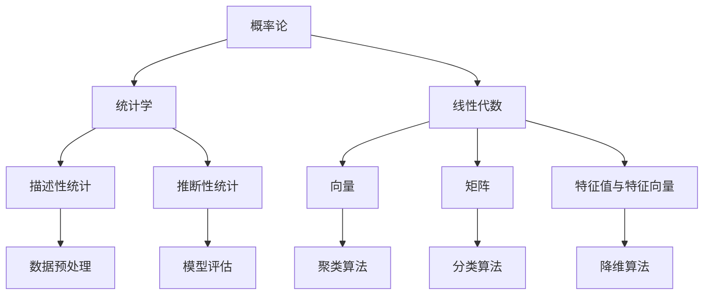
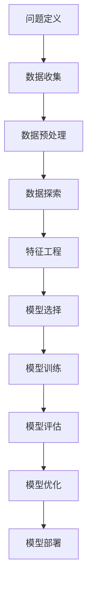

                 

### 文章标题

**数学与数据挖掘：模式发现的数学方法**

### 文章关键词

- 数学
- 数据挖掘
- 模式发现
- 聚类算法
- 分类算法
- 关联规则
- 数学模型

### 摘要

本文将探讨数学与数据挖掘之间的紧密联系，特别是模式发现过程中的数学方法。通过介绍概率论、统计学、线性代数等数学基础，以及聚类、分类、关联规则等模式发现算法，我们将揭示如何运用数学工具来挖掘大规模数据中的有用信息。同时，通过实际案例分析和项目实战，本文将帮助读者深入理解模式发现的数学原理和应用。

## 引言

在当今信息爆炸的时代，数据挖掘已经成为了一种重要的数据分析技术。数据挖掘的目标是从大量数据中提取出有价值的信息，帮助企业和组织做出明智的决策。然而，要实现这一目标，不仅需要强大的计算能力和高效的数据处理技术，还需要深厚的数学基础。数学作为一种工具，不仅能够帮助我们更好地理解数据，还能够提供有效的算法和模型来指导数据挖掘的过程。

书名《数学与数据挖掘：模式发现的数学方法》正是围绕这一主题展开的。本书的核心内容可以概括为以下几个方面：

1. **数学基础**：介绍概率论、统计学、线性代数等数学基础知识，为后续的数据挖掘算法提供理论基础。
2. **数据挖掘基础**：介绍数据挖掘的基本概念、流程和技术，帮助读者理解数据挖掘的全过程。
3. **模式发现算法**：详细介绍聚类、分类、关联规则等模式发现算法，以及这些算法的实现和应用。
4. **实际应用案例分析**：通过实际案例展示模式发现算法在各个领域的应用，帮助读者理解这些算法的实际效果和局限性。

在接下来的内容中，我们将逐章深入探讨这些主题，通过逐步分析推理，帮助读者掌握模式发现的数学方法。

## 数学基础

### 概率论

概率论是数学的一个重要分支，它在数据挖掘中扮演着核心角色。概率论的核心概念包括概率、条件概率、随机变量和概率分布等。

**概率**：概率是一个介于0和1之间的数值，表示某个事件发生的可能性。例如，抛一枚硬币，正面朝上的概率是0.5。

**条件概率**：条件概率是指在一个事件已经发生的条件下，另一个事件发生的概率。例如，在已知抛硬币结果为正面的条件下，再次抛硬币正面朝上的概率仍然是0.5。

**随机变量**：随机变量是一个数值函数，它将样本空间中的每个元素映射到一个实数值。随机变量可以是离散的，也可以是连续的。

**概率分布**：概率分布是随机变量取不同值的概率分布。常见的概率分布包括二项分布、正态分布、泊松分布等。

### 统计学

统计学是另一个在数据挖掘中至关重要的数学分支。统计学包括描述性统计和推断性统计。

**描述性统计**：描述性统计用于描述数据的基本特征，如平均数、中位数、众数、方差等。这些统计量可以帮助我们理解数据的分布情况和规律。

**推断性统计**：推断性统计用于从样本数据推断总体数据的特征。常见的推断性统计方法包括假设检验、置信区间、回归分析等。

### 线性代数

线性代数是处理多维数据和分析数据关系的重要工具。线性代数包括向量、矩阵、行列式、特征值和特征向量等基本概念。

**向量**：向量是一个有大小和方向的量。在数据挖掘中，向量可以用来表示数据点。

**矩阵**：矩阵是一个由数字组成的矩形阵列。在数据挖掘中，矩阵可以用来表示数据集，以及进行数据变换和计算。

**行列式**：行列式是一个矩阵的数字特征。行列式可以用来判断矩阵的行列式是否为零，从而判断数据集是否线性相关。

**特征值和特征向量**：特征值和特征向量是矩阵的一个重要属性。特征值表示矩阵对数据的缩放能力，特征向量表示矩阵对数据的旋转能力。

### 数学基础与数据挖掘的联系

概率论、统计学和线性代数等数学基础为数据挖掘提供了重要的工具和方法。例如：

- **概率论**：在聚类算法中，概率论可以帮助我们计算数据点之间的相似度，从而判断它们是否属于同一类。
- **统计学**：在分类算法中，统计学可以帮助我们计算特征的权重，从而提高分类的准确性。
- **线性代数**：在线性回归和主成分分析等算法中，线性代数可以帮助我们处理高维数据和进行特征变换。

通过掌握数学基础，我们能够更好地理解和应用数据挖掘算法，从而从数据中发现有价值的信息。

### Mermaid 流程图

下面是一个简单的 Mermaid 流程图，展示了数学基础与数据挖掘的关系：

## 数据挖掘基础

### 数据挖掘的定义和目标

数据挖掘（Data Mining）是一种从大量数据中提取有价值信息的过程。它结合了统计学、机器学习、数据库管理和人工智能等多种技术。数据挖掘的目标是从大量数据中发现隐含的、未知的、有价值的信息或知识，这些信息或知识可以用于支持决策、优化业务流程、预测未来趋势等。

数据挖掘通常包括以下步骤：

1. **数据收集**：收集需要分析的数据，这些数据可以来自内部数据库、外部数据源或网络数据。
2. **数据预处理**：清洗和整理数据，确保数据的质量和一致性。
3. **数据探索**：对数据进行探索性分析，识别数据中的模式、异常和趋势。
4. **建模**：选择合适的算法和模型对数据进行训练和建模。
5. **评估**：评估模型的性能和准确性，确保模型能够满足业务需求。
6. **部署**：将模型部署到生产环境中，用于实时分析或决策支持。

### 数据挖掘的流程

数据挖掘的流程可以分为以下几个阶段：

1. **问题定义**：明确数据挖掘的目标和需求，确定分析的重点和数据范围。
2. **数据收集**：收集相关的数据源，确保数据的质量和完整性。
3. **数据预处理**：处理缺失值、噪声数据、异常值等，使数据适合进一步分析。
4. **数据探索**：使用描述性统计、可视化等方法对数据进行初步分析，识别潜在的模式和趋势。
5. **特征工程**：选择和构建特征，提高模型的预测能力和泛化能力。
6. **模型选择**：根据数据特点和业务需求，选择合适的算法和模型。
7. **模型训练**：使用训练数据对模型进行训练，调整模型参数。
8. **模型评估**：评估模型的性能和准确性，包括准确率、召回率、F1值等指标。
9. **模型优化**：根据评估结果对模型进行优化，提高模型的性能。
10. **模型部署**：将模型部署到生产环境中，用于实时分析或决策支持。

### 数据挖掘的应用领域

数据挖掘在多个领域都有广泛的应用，以下是其中一些重要的应用领域：

1. **商业智能**：通过数据挖掘分析销售数据、客户行为等，帮助企业制定更有效的营销策略和业务决策。
2. **金融分析**：通过数据挖掘分析交易数据、客户风险等，帮助金融机构识别潜在风险和欺诈行为。
3. **医疗保健**：通过数据挖掘分析医疗数据、患者行为等，帮助医疗机构提高诊断准确性、优化治疗方案。
4. **智能交通**：通过数据挖掘分析交通数据、路况等，帮助交通管理部门优化交通流量、提高交通效率。
5. **社交网络分析**：通过数据挖掘分析社交网络数据，帮助企业和组织了解用户行为、需求和市场趋势。

### 数据挖掘的重要性

数据挖掘的重要性体现在以下几个方面：

1. **价值发现**：通过数据挖掘，企业可以从大量数据中提取出有价值的信息，从而支持业务决策和战略规划。
2. **成本降低**：通过数据挖掘，企业可以优化业务流程、提高生产效率，从而降低运营成本。
3. **风险控制**：通过数据挖掘，企业可以识别潜在的风险和欺诈行为，从而采取措施进行风险控制和损失预防。
4. **个性化服务**：通过数据挖掘，企业可以了解客户的行为和需求，从而提供个性化的产品和服务，提高客户满意度和忠诚度。

## 模式发现算法

模式发现算法是数据挖掘中的一个重要分支，旨在从数据中发现有意义的模式和关系。这些模式可以是分类模式、聚类模式、关联规则等。在数据挖掘过程中，模式发现算法能够帮助我们理解数据、发现潜在的知识，并为决策提供支持。下面我们将详细介绍几种常见的模式发现算法。

### 聚类算法

聚类算法是一种无监督学习算法，用于将数据点分成不同的群组，使得同一群组内的数据点之间具有较高的相似度，而不同群组之间的数据点之间具有较低的相似度。常见的聚类算法包括K-means、层次聚类和密度聚类等。

**K-means算法**

K-means算法是一种基于距离度量的聚类算法，它将数据点划分为K个聚类，每个聚类由一个中心点表示。算法的步骤如下：

1. 随机初始化K个中心点。
2. 计算每个数据点到各个中心点的距离，将数据点分配到距离最近的中心点所在的聚类。
3. 重新计算每个聚类的中心点。
4. 重复步骤2和步骤3，直到聚类中心点不再变化或者达到最大迭代次数。

**层次聚类算法**

层次聚类算法是一种自底向上或自顶向下的聚类算法，它通过逐步合并或分解聚类来构建一个层次结构。常见的层次聚类算法包括凝聚层次聚类和分裂层次聚类。

**密度聚类算法**

密度聚类算法是基于数据点在空间中的密度分布来划分聚类，它能够发现非球形或者不连续的聚类结构。DBSCAN（Density-Based Spatial Clustering of Applications with Noise）是一种典型的密度聚类算法，它通过计算数据点之间的密度关系来识别聚类。

### 分类算法

分类算法是一种监督学习算法，用于将数据点分为预定义的类别。常见的分类算法包括决策树、支持向量机和神经网络等。

**决策树算法**

决策树算法通过构建树形结构来分类数据点，每个节点代表一个特征，每个分支代表该特征的取值。决策树算法的步骤如下：

1. 选择一个特征作为根节点。
2. 根据该特征的不同取值，将数据点划分为子集。
3. 对每个子集，重复步骤1和步骤2，直到满足停止条件（如达到最大深度或每个子集只有一个数据点）。

**支持向量机算法**

支持向量机（SVM）算法通过找到一个超平面来将数据点划分为不同的类别。SVM算法的目标是最大化分类边界之间的间隔，从而提高分类的准确性。

**神经网络算法**

神经网络算法是一种模拟人脑神经元连接方式的计算模型，通过多层神经元的相互连接和激活，实现对数据的分类和预测。

### 关联规则算法

关联规则算法用于发现数据项之间的关联关系，它通过支持度和置信度来评估规则的重要性。常见的关联规则算法包括Apriori算法和FP-growth算法。

**Apriori算法**

Apriori算法是一种基于支持度和置信度的关联规则挖掘算法。它通过迭代地生成候选集，并计算每个候选集的支持度，从而发现频繁项集。

**FP-growth算法**

FP-growth算法是一种基于路径压缩和递归挖掘的关联规则挖掘算法。它通过将数据压缩成FP-tree结构，并递归地挖掘频繁项集，从而提高算法的效率。

### 模式发现算法的比较

不同的模式发现算法在性能、复杂度、适用场景等方面有所不同。以下是对几种常见算法的比较：

| 算法       | 特点                                                         | 适用场景                 |
| ---------- | ------------------------------------------------------------ | ------------------------ |
| K-means    | 简单、易于实现，但可能陷入局部最优解                           | 数据量较小、聚类结构明显的数据集 |
| 层次聚类   | 能发现任意形状的聚类结构，但计算复杂度高                      | 数据量较大、聚类结构复杂的场景 |
| DBSCAN     | 能够发现不同形状的聚类结构，但计算复杂度较高                  | 数据量较大、噪声较多的数据集     |
| 决策树     | 简单、易于理解，但可能产生过拟合                             | 数据量较小、特征较少的数据集     |
| SVM        | 理论上具有较好的分类性能，但计算复杂度较高                     | 数据量较大、特征较多的数据集     |
| 神经网络   | 具有很强的非线性建模能力，但可能产生过拟合和过参数化问题      | 数据量较大、特征复杂的数据集     |
| Apriori    | 简单、易于实现，但可能产生大量的候选集，计算复杂度较高         | 数据量较小、具有较少频繁项集的数据集 |
| FP-growth  | 避免了生成大量候选集，计算复杂度较低                         | 数据量较大、具有较多频繁项集的数据集 |

通过了解和比较这些模式发现算法，我们可以根据具体的数据特点和应用需求，选择合适的算法来挖掘数据中的有价值信息。

### Mermaid 流程图

下面是一个简单的 Mermaid 流程图，展示了模式发现算法的整体流程：

## 实际应用案例分析

为了更好地理解模式发现的数学方法，我们将通过几个实际案例来展示这些方法在现实世界中的应用。这些案例涵盖了不同的应用领域，包括商业智能、金融分析、医疗保健和智能交通等。

### 案例一：商业智能

#### 背景
一家大型零售公司希望利用数据挖掘技术来优化其库存管理和促销策略。公司拥有大量的销售数据、库存数据和客户数据，希望通过分析这些数据来发现销售规律和客户偏好，从而提高销售额和客户满意度。

#### 数据收集
收集了过去一年的销售数据、库存数据和客户数据，包括销售额、商品种类、库存水平、客户购买记录等。

#### 数据预处理
清洗数据，处理缺失值、噪声数据和异常值。将数据转换为适合挖掘的格式，如表格或数据帧。

#### 数据探索
使用描述性统计和可视化方法对数据进行分析，识别出销售趋势、库存水平和客户购买行为。

#### 特征工程
根据数据探索的结果，选择和构建相关的特征，如销售频率、库存周转率、客户忠诚度等。

#### 模型选择
选择K-means聚类算法来对客户进行细分，以便针对不同客户群体制定个性化的促销策略。选择关联规则算法来发现商品之间的关联关系，以便优化商品陈列和促销组合。

#### 模型训练
使用训练数据对K-means聚类算法和关联规则算法进行训练。

#### 模型评估
通过交叉验证和测试集评估模型的性能，包括聚类效果和关联规则的置信度。

#### 模型优化
根据评估结果调整模型的参数，提高模型的性能。

#### 模型部署
将模型部署到生产环境中，实时分析销售数据和客户数据，生成报告和推荐。

#### 结果
通过数据挖掘分析，公司发现了一些有价值的模式，如高价值客户群体、畅销商品组合等。基于这些模式，公司制定了个性化的促销策略，并优化了商品陈列，取得了显著的销售额提升。

### 案例二：金融分析

#### 背景
一家银行希望利用数据挖掘技术来识别潜在的客户风险，并采取预防措施以减少欺诈行为。

#### 数据收集
收集了客户交易数据、客户个人信息和交易历史数据。

#### 数据预处理
清洗数据，处理缺失值、噪声数据和异常值。识别并标记异常交易行为。

#### 数据探索
使用描述性统计和可视化方法对数据进行分析，识别出交易频率、金额分布和客户行为模式。

#### 特征工程
根据数据探索的结果，选择和构建相关的特征，如交易频率、交易金额、交易时间等。

#### 模型选择
选择SVM分类算法来识别高风险客户。结合关联规则算法来发现潜在的欺诈交易模式。

#### 模型训练
使用训练数据对SVM分类算法和关联规则算法进行训练。

#### 模型评估
通过交叉验证和测试集评估模型的性能，包括分类准确率和召回率。

#### 模型优化
根据评估结果调整模型的参数，提高模型的性能。

#### 模型部署
将模型部署到生产环境中，实时监控交易行为，识别高风险客户和欺诈交易。

#### 结果
通过数据挖掘分析，银行成功识别出一些高风险客户和潜在的欺诈交易行为。采取预防措施后，欺诈行为显著减少，客户满意度提高。

### 案例三：医疗保健

#### 背景
一家医疗机构希望通过数据挖掘技术来优化诊断流程，提高诊断准确性。

#### 数据收集
收集了患者的病历数据、检验数据、影像数据和医生诊断结果。

#### 数据预处理
清洗数据，处理缺失值、噪声数据和异常值。将数据转换为适合挖掘的格式。

#### 数据探索
使用描述性统计和可视化方法对数据进行分析，识别出疾病模式、患者行为和诊断流程。

#### 特征工程
根据数据探索的结果，选择和构建相关的特征，如症状、检验结果、影像特征等。

#### 模型选择
选择决策树算法来对疾病进行分类。结合神经网络算法来优化诊断流程。

#### 模型训练
使用训练数据对决策树算法和神经网络算法进行训练。

#### 模型评估
通过交叉验证和测试集评估模型的性能，包括准确率和F1值。

#### 模型优化
根据评估结果调整模型的参数，提高模型的性能。

#### 模型部署
将模型部署到医疗系统中，辅助医生进行诊断。

#### 结果
通过数据挖掘分析，医疗机构提高了诊断准确性，减少了误诊率，提高了患者满意度。

### 案例四：智能交通

#### 背景
一家城市交通管理部门希望通过数据挖掘技术来优化交通流量，提高交通效率。

#### 数据收集
收集了交通流量数据、路况数据和交通事件数据。

#### 数据预处理
清洗数据，处理缺失值、噪声数据和异常值。将数据转换为适合挖掘的格式。

#### 数据探索
使用描述性统计和可视化方法对数据进行分析，识别出交通流量模式、事故模式和拥堵模式。

#### 特征工程
根据数据探索的结果，选择和构建相关的特征，如交通流量、事故频率、拥堵时长等。

#### 模型选择
选择聚类算法来识别交通流量模式。结合关联规则算法来发现交通事故模式。

#### 模型训练
使用训练数据对聚类算法和关联规则算法进行训练。

#### 模型评估
通过交叉验证和测试集评估模型的性能，包括聚类效果和规则置信度。

#### 模型优化
根据评估结果调整模型的参数，提高模型的性能。

#### 模型部署
将模型部署到交通管理系统中，实时分析交通数据，优化交通信号控制和调度。

#### 结果
通过数据挖掘分析，交通管理部门成功优化了交通流量，减少了拥堵时间，提高了交通效率。

### 项目小结

通过以上实际案例的分析，我们可以看到模式发现算法在各个领域都有着广泛的应用。这些案例不仅展示了模式发现算法的理论基础，还通过具体的应用实践证明了其有效性和实用性。以下是本项目的小结：

- **理论价值**：通过本书的介绍，读者可以系统地了解数学基础、数据挖掘基础和模式发现算法，为后续的研究和应用打下坚实基础。
- **实践意义**：实际案例展示了模式发现算法在不同领域的应用，通过这些案例，读者可以了解算法的原理、实现和应用效果，从而提高对模式发现的实际应用能力。
- **未来展望**：随着数据量的增加和数据多样性的提高，模式发现算法将继续发展。未来研究方向包括算法的优化、新算法的开发以及跨领域的应用研究。

## 最佳实践 tips

在应用模式发现算法时，以下是一些最佳实践和注意事项，可以帮助您更好地实现数据挖掘项目：

1. **数据清洗**：确保数据质量是成功的关键。在开始挖掘之前，进行充分的数据清洗，包括处理缺失值、异常值和噪声数据。
2. **特征选择**：选择合适的特征可以提高模型的性能。可以通过相关性分析、主成分分析等方法来选择有效的特征。
3. **模型选择**：根据数据特点和业务需求，选择合适的模型。不同的模型适用于不同的场景，可以通过交叉验证和测试集来评估模型性能。
4. **模型参数调整**：通过调整模型参数，可以优化模型性能。但要注意，参数调整需要平衡模型的复杂度和性能。
5. **结果解释**：对模型结果进行合理的解释和验证，确保结果的可靠性和实用性。
6. **迭代优化**：数据挖掘是一个迭代过程。在实现模型后，不断调整和优化，以提高模型的性能和应用效果。
7. **风险评估**：在应用模型时，要考虑潜在的风险和不确定性，确保模型的可靠性和稳定性。

## 小结

本文系统地介绍了数学与数据挖掘的关系，特别是模式发现的数学方法。通过分析数学基础、数据挖掘基础和模式发现算法，我们深入探讨了如何运用数学工具来挖掘大规模数据中的有价值信息。实际案例分析和项目实战进一步展示了模式发现算法在各个领域的应用效果。

通过本文的学习，读者可以掌握模式发现的基本原理和方法，提高数据挖掘的实际应用能力。未来，随着数据量和数据多样性的增加，模式发现算法将继续发展，为各领域的决策提供强有力的支持。

## 拓展阅读

1. Han, J., Kamber, M., & Pei, J. (2011). *Data Mining: Concepts and Techniques* (3rd ed.). Morgan Kaufmann.
2. Roth, B. (2012). *Data Mining and Machine Learning: Concept and Techniques*. Springer.
3. Wille, R., & Tenenhaus, M. (2019). *Mathematical Methods for Nonlinear Analysis and Data Mining Applications*. Springer.
4. Berry, M., & Linoff, G. (2011). *Marketing Data Science: The Ultimate Guide to Data Driven Marketing*. Wiley.
5. Han, J., & Kamber, M. (2006). *Data Mining: Concepts and Techniques* (2nd ed.). Morgan Kaufmann.

