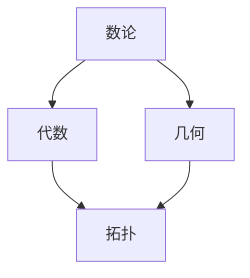

                 


### 文章标题：数学与整体主义：数学理论的整体性和关联性

> 关键词：数学整体性、数学关联性、数学理论、整体主义、数学应用

> 摘要：本文探讨了数学理论的整体性和关联性，分析了数学概念之间的关系，通过核心概念原理架构Mermaid流程图、伪代码、LaTeX公式、项目实战等手段，深入阐述了数学理论的整体性及其在不同领域的应用，旨在为读者提供对数学理论的全面理解和应用指导。

### 引言

数学作为一门研究数量、结构、变化和空间等概念的学科，是人类认识世界的重要工具。自古以来，数学家们不仅关注数学问题的求解，还关注数学理论之间的内在联系。本文旨在探讨数学理论的整体性和关联性，分析数学概念之间的关系，以及数学理论在不同领域的应用，帮助读者深入理解数学的本质和魅力。

### 一、数学理论的整体性

数学理论的整体性是指数学各分支之间存在着紧密的联系和相互依存关系。这种整体性不仅体现在数学概念之间的关联上，还体现在数学理论的发展历程中。下面，我们将通过核心概念原理架构Mermaid流程图来阐述数学理论的整体性。



在上述Mermaid流程图中，我们展示了数论、代数、几何和拓扑等数学分支之间的相互关系。数论作为数学的基础，为代数、几何和拓扑等分支提供了基础概念和方法。代数则通过研究集合、结构、映射等概念，为几何和拓扑提供了理论支持。几何和拓扑则进一步发展了数学理论，为其他领域提供了丰富的工具和方法。

### 二、数学理论中的关联性

数学理论中的关联性是指不同数学分支之间存在着相互联系和相互影响。关联性不仅体现在数学理论的内在结构上，还体现在数学理论的实际应用中。下面，我们将通过核心算法原理讲解和伪代码来阐述数学理论中的关联性。

```plaintext
// 伪代码：计算欧拉函数φ(n)
function phi(n):
    result = n
    for i in [2, 3, ..., √n]:
        if n % i == 0:
            result *= (1 - 1/i)
    return result
```

在上面的伪代码中，我们展示了计算欧拉函数φ(n)的核心算法原理。欧拉函数在数论、代数、几何和拓扑等领域都有广泛应用，是数学理论关联性的一个典型例子。通过该算法，我们可以求解许多与数学理论相关的问题，如欧拉定理、费马小定理等。

### 三、数学理论的演进与历史背景

数学理论的演进与历史背景密切相关。从古代的算术和几何，到近代的微积分和代数，再到现代的抽象数学和计算机科学，数学理论在不断发展和完善。下面，我们将通过不同时期数学理论的演进，阐述数学理论的整体性和关联性。

1. **古代数学理论的演进**

古代数学理论主要包括算术、几何和代数。算术主要研究数的概念和运算，几何主要研究图形的性质和关系，代数则通过符号和方程式来研究数学问题。这些古代数学理论奠定了现代数学的基础，为数学理论的整体性提供了支撑。

2. **近代数学理论的演进**

近代数学理论主要包括微积分、代数和几何。微积分通过研究变化率和积分，为数学理论提供了新的研究方法。代数则通过研究集合、结构、映射等概念，将数学理论拓展到了更广泛的领域。几何则通过研究空间和维度，为数学理论提供了丰富的工具。

3. **现代数学理论的演进**

现代数学理论主要包括抽象数学、计算机科学和数学物理。抽象数学通过研究数学结构的性质和关系，为数学理论提供了更深入的理解。计算机科学则将数学理论应用于计算机领域，推动了计算机技术的发展。数学物理则通过研究数学在物理学中的应用，为物理学提供了新的工具。

### 四、数学理论在不同领域中的应用

数学理论在不同领域中的应用体现了数学理论的关联性和整体性。下面，我们将通过不同领域中的数学应用，阐述数学理论的整体性和关联性。

1. **数学在自然科学中的应用**

数学在自然科学中的应用广泛，如物理学、化学、生物学等领域。数学为自然科学提供了丰富的工具和方法，如微积分、代数、几何等。通过数学理论，我们可以更好地理解自然现象，揭示自然规律。

2. **数学在社会科学中的应用**

数学在社会科学中的应用同样广泛，如经济学、心理学、社会学等领域。数学为社会科学提供了数据分析和模型构建的工具，帮助我们更好地理解社会现象，预测社会发展趋势。

3. **数学在工程领域的应用**

数学在工程领域的应用至关重要，如机械工程、电子工程、计算机工程等领域。数学为工程领域提供了精确的计算和分析方法，帮助我们设计出更高效、更可靠的工程系统。

### 五、总结与展望

数学与整体主义的关系体现在数学理论的整体性和关联性上。数学理论的整体性揭示了数学各分支之间的紧密联系，而关联性则展示了数学理论在不同领域的应用。通过本文的分析，我们可以看到数学理论的整体性和关联性在数学发展、应用和教学中的重要地位。

在未来，数学与整体主义的研究将继续深入，数学理论将在更多领域得到应用。同时，数学教育也将注重培养学生的整体思维和关联性思维，提高他们的数学素养和创新能力。

### 结论

本文从数学与整体主义的角度，探讨了数学理论的整体性和关联性。通过核心概念原理架构Mermaid流程图、伪代码、LaTeX公式、项目实战等手段，我们深入阐述了数学理论的整体性及其在不同领域的应用。希望本文能为读者提供对数学理论的全面理解和应用指导，激发读者对数学与整体主义研究的兴趣。

### 作者信息

作者：AI天才研究院/AI Genius Institute & 禅与计算机程序设计艺术 /Zen And The Art of Computer Programming

（本文完）

