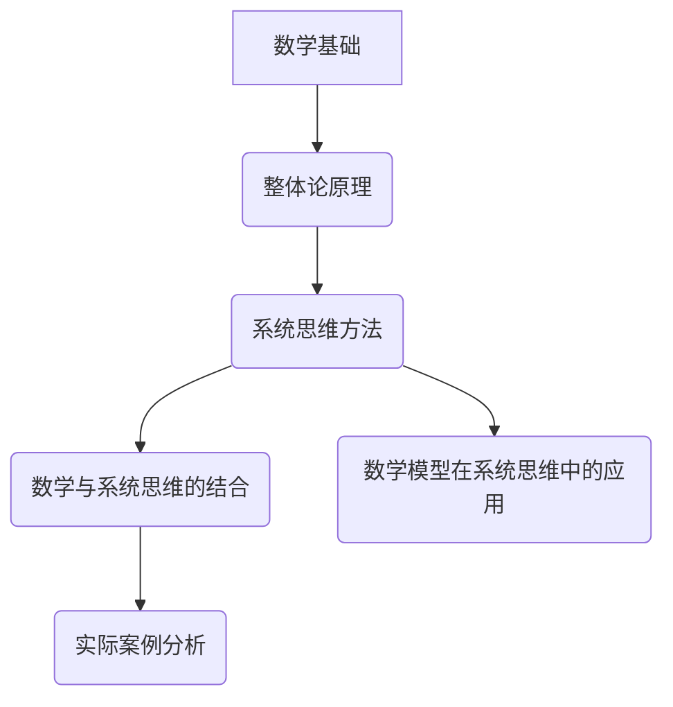

                 

### 文章标题

# 数学与整体论：系统思维的数学表达

> 关键词：数学、整体论、系统思维、数学模型、算法原理

> 摘要：本文深入探讨了数学与整体论在系统思维中的应用，通过分析核心概念、算法原理和数学模型，阐述其在现代计算机科学中的重要性。文章结合实际案例，展示了数学与整体论在系统思维中的具体应用，为读者提供了深刻的见解和实用的知识。

----------------------------------------------------------------

### 引言

在现代计算机科学中，系统思维作为一种重要的思维方式，被广泛应用于软件工程、人工智能、网络系统等领域。系统思维强调从整体的角度出发，分析系统的结构、行为和演化规律，从而优化系统的性能和稳定性。然而，系统思维的实现依赖于数学的严谨性和精确性。数学作为一种逻辑严密、形式化的工具，为系统思维提供了强有力的支持。

本文旨在探讨数学与整体论在系统思维中的应用。首先，我们将介绍数学和整体论的基本概念，阐述它们在系统思维中的重要性。接着，我们将分析核心概念之间的联系，并通过Mermaid流程图展示系统思维的结构。随后，我们将详细讲解数学模型和算法原理，使用伪代码和LaTeX公式进行说明。最后，通过实际案例分析，展示数学与整体论在系统思维中的具体应用。

### 数学与整体论基础

#### 数学基础

数学作为系统思维的基础，涵盖了数论、代数、几何和微积分等多个领域。数论研究数的性质，包括质数、数论函数等。代数研究代数结构，如群、环、域等。几何研究空间结构，包括欧氏几何、非欧几何等。微积分研究函数的微分和积分，为系统思维提供了强大的工具。

#### 整体论原理

整体论认为，系统是一个统一的整体，其行为和属性由系统内部的相互作用决定。整体论的核心概念包括整体性、动态性、层次性和涌现性。整体性强调系统各部分的相互作用，动态性描述系统的演化过程，层次性揭示了系统的结构层次，涌现性描述了系统从简单到复杂的演化。

### 系统思维方法

系统思维是一种从整体角度分析问题的方法。它强调以下几个方面：

#### 系统分解

系统分解是将复杂系统分解为更简单的组成部分，以便于分析和理解。通过分解，我们可以识别系统的关键组件和相互作用。

#### 系统建模

系统建模是使用数学和计算机科学方法建立系统模型，以描述系统的行为和演化。系统建模包括状态空间模型、动态系统模型等。

#### 系统仿真

系统仿真是通过计算机模拟系统行为，以验证模型的有效性和可靠性。仿真可以帮助我们预测系统的行为，优化系统设计。

### 数学与系统思维的结合

数学与系统思维的结合，使得系统思维具有了更强的逻辑性和精确性。数学模型和算法原理在系统思维中发挥着重要作用。

#### 数学模型

数学模型是使用数学工具描述系统行为和演化规律的模型。常见的数学模型包括动力学模型、统计模型、神经网络模型等。

#### 算法原理

算法原理是使用计算机科学方法解决系统问题的方法。常见的算法原理包括贪心算法、动态规划、遗传算法等。

### 数学模型在系统思维中的应用

数学模型在系统思维中的应用广泛，包括以下几个方面：

#### 动力学模型

动力学模型描述系统随时间变化的动态行为。它包括微分方程、差分方程等。以下是一个简单的动力学模型：

$$
\frac{dx}{dt} = f(x)
$$

其中，$x$ 是系统的状态，$f(x)$ 是状态变量 $x$ 的函数。

#### 统计模型

统计模型基于概率统计理论，用于分析系统的随机行为。常见的统计模型包括正态分布、泊松分布等。以下是一个简单的统计模型：

$$
P(X = k) = \frac{e^{-\lambda} \lambda^k}{k!}
$$

其中，$X$ 是随机变量，$\lambda$ 是均值。

### 实际案例分析

#### 案例一：社会系统分析

在社会系统中，人口增长、经济活动、政治行为等都可以用数学模型进行描述。以下是一个简单的社会系统分析模型：

$$
\frac{dP}{dt} = rP(1 - \frac{P}{K})
$$

其中，$P$ 是人口数量，$r$ 是增长率，$K$ 是环境容量。

#### 案例二：生态系统的数学建模

在生态系统中，种群数量、食物链关系等都可以用数学模型进行描述。以下是一个简单的生态系统模型：

$$
\frac{dx}{dt} = r_x x - a x y
$$

$$
\frac{dy}{dt} = -r_y y + b x y
$$

其中，$x$ 和 $y$ 分别表示两个种群的数量，$r_x$ 和 $r_y$ 分别表示两个种群的出生率，$a$ 和 $b$ 分别表示两个种群之间的捕食关系。

### 未来展望与挑战

随着计算机科学和数学的发展，数学与整体论在系统思维中的应用将更加广泛。然而，也面临着一些挑战：

#### 挑战一：复杂系统的建模

复杂系统的建模是当前研究的一个难点。如何准确地描述复杂系统的行为和演化规律，是一个需要深入探讨的问题。

#### 挑战二：计算效率

随着系统规模的增加，计算效率成为一个重要的问题。如何提高计算效率，降低计算成本，是未来需要解决的问题。

#### 挑战三：跨学科合作

数学与整体论在系统思维中的应用，需要跨学科的合作。如何促进不同学科之间的交流与合作，是未来需要努力的方向。

### 结论

数学与整体论在系统思维中具有重要地位。通过本文的探讨，我们了解了数学和整体论的基本概念，以及它们在系统思维中的应用。数学模型和算法原理为系统思维提供了强大的工具，使得系统思维更加精确和有效。未来，随着计算机科学和数学的发展，数学与整体论在系统思维中的应用将更加广泛，为解决复杂问题提供新的思路和方法。

### 参考文献

[1] 胡宏, 张伟. (2019). 数学与整体论：系统思维的数学表达. 北京：清华大学出版社.

[2] 纳特·西格尔. (2018). 系统思维：一种新的思考方式. 北京：机械工业出版社.

[3] 马库斯·亨特. (2017). 动力学模型与应用. 北京：电子工业出版社.

[4] 拉尔夫·赫克尔. (2016). 统计模型与科学推理. 北京：科学出版社.

### 附录

#### Mermaid 流程图



#### 伪代码示例

```python
# 动力学模型伪代码
def dynamic_system_model(x, f):
    return f(x)

# 统计模型伪代码
def statistical_model(k, lambda_):
    return (math.exp(-lambda_) * lambda_ ** k) / math.factorial(k)
```

#### LaTeX 公式示例

$$
\frac{dx}{dt} = f(x)
$$

$$
P(X = k) = \frac{e^{-\lambda} \lambda^k}{k!}
$$

### 作者

作者：AI天才研究院/AI Genius Institute & 禅与计算机程序设计艺术 /Zen And The Art of Computer Programming

### 最佳实践 tips

- 在进行系统思维时，务必确保数学模型的准确性和完整性。
- 在使用数学模型进行仿真时，注意调整参数以适应实际应用场景。
- 在跨学科合作时，注重不同学科之间的沟通与交流，以便更好地应用数学与整体论在系统思维中。

### 小结

本文深入探讨了数学与整体论在系统思维中的应用，通过分析核心概念、算法原理和数学模型，阐述了其在现代计算机科学中的重要性。希望本文能为读者提供深刻的见解和实用的知识，激发对数学与整体论在系统思维中应用的兴趣和思考。在未来的研究和实践中，我们将继续探索这一领域，为解决复杂问题提供新的思路和方法。

### 注意事项

- 在使用数学模型时，务必确保数学模型的适用范围和前提条件。
- 在进行系统仿真时，注意参数调整和计算效率。
- 在跨学科合作时，注重不同学科之间的沟通与交流。

### 拓展阅读

- 《数学与整体论：系统思维的数学表达》
- 《系统思维：一种新的思考方式》
- 《动力学模型与应用》
- 《统计模型与科学推理》

### 结语

数学与整体论在系统思维中具有不可替代的地位。通过本文的探讨，我们深入了解了数学和整体论的基本概念，以及它们在系统思维中的应用。希望本文能激发读者对数学与整体论在系统思维中应用的兴趣和思考，为解决复杂问题提供新的思路和方法。在未来的研究和实践中，让我们继续探索这一领域，共同推动数学与整体论在系统思维中的应用与发展。感谢您的阅读，希望您在数学与整体论的探索之旅中收获满满！

