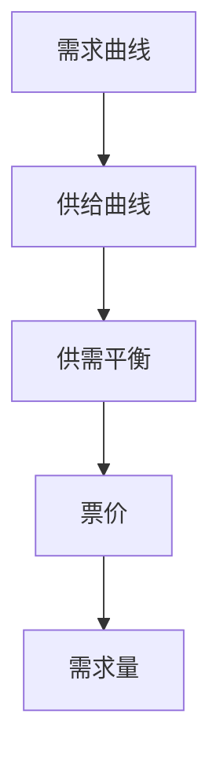
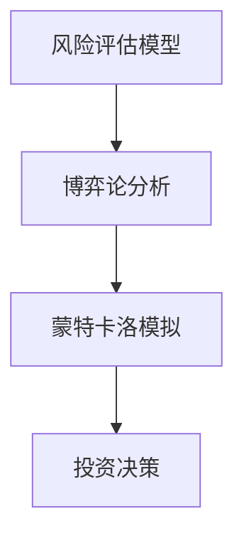

                 

### 引言

《数学与文化经济：文化产业的数学模型》旨在探讨数学与文化经济之间的深刻联系，并展示如何利用数学模型来分析和理解文化产业的运行机制。文化经济是当今全球经济的重要组成部分，它不仅包括传统的文化产业，如文学、艺术、音乐和电影，还涵盖了新兴的数字媒体和创意产业。随着全球化、数字化和信息化进程的加速，文化产业在经济增长、社会进步和文化传承中的作用愈发凸显。

文化产业的独特性在于其创造性和非线性，这使得传统经济学模型难以完全适用。然而，数学作为一种强大的工具，能够提供量化分析和预测的框架，为文化产业的研究和决策提供支持。数学模型不仅能够描述文化产品的市场需求和供给，还能揭示文化创新和传播的规律，从而为文化产业的发展提供科学依据。

本书的目标是系统性地介绍数学在文化产业中的应用，包括数学基础、文化经济模型、案例分析以及总结与展望。通过这本书，读者可以了解到如何运用数学工具来分析文化产业中的复杂现象，理解文化经济的运行机制，并为文化产业的决策者提供数据支持。

本书的结构如下：

- **引言**：介绍数学与文化经济的关系，阐述本书的目标与结构。
- **数学基础**：回顾数学基础理论，包括基础数学概念、统计学基础、微积分基础和线性代数基础。
- **文化产业的经济模型**：探讨文化产业的供需模型，包括市场需求模型和供给模型。
- **案例分析**：通过具体案例分析，展示数学模型在文化产业中的应用。
- **总结与展望**：总结本书的主要观点，并对未来的研究方向进行展望。

通过这样的结构安排，本书旨在为读者提供一个全面而深入的视角，帮助他们在理解文化经济的同时，掌握运用数学模型的方法。

### 数学与文化经济的定义与特点

要深入探讨数学在文化产业中的应用，我们首先需要明确数学与文化经济的定义与特点。文化经济是指以文化产品和服务的生产和传播为核心的经济活动，包括文学、艺术、音乐、电影、电视、网络媒体等多个领域。而数学，则是一门研究数量、结构、变化和空间等概念的学科，具有高度的抽象性和逻辑性。

文化经济的独特性在于其创造性和非线性。与传统的制造业和服务业相比，文化产业更依赖于人类的创造力、想象力和情感表达。文化产品往往是非线性的，其价值不仅取决于生产成本，还受到市场需求、文化背景、消费者心理等多种因素的影响。这种非线性特征使得传统经济学模型难以完全适用，需要更为灵活和多样化的分析方法。

另一方面，数学作为一种逻辑严谨、量化精确的工具，在文化产业中发挥着重要作用。首先，数学能够帮助量化文化产品的市场需求和供给，从而提供科学的决策支持。通过统计学、概率论、微积分等数学工具，研究者可以分析消费者行为，预测市场需求，评估文化产品的价值。例如，利用回归分析可以估计文化产品的需求曲线，利用微分方程可以模拟文化产业的动态变化。

其次，数学在文化创新和传播中也有广泛应用。文化创新往往涉及到新创意、新技术的应用，而数学模型可以帮助理解创新过程和创新成果的传播规律。例如，利用复杂网络理论可以研究文化产品的传播路径，利用遗传算法可以优化文化创新方案。这些数学工具不仅能够揭示文化创新过程中的复杂现象，还能提供改进和创新的具体方法。

此外，数学还在文化产业的管理和评估中发挥着重要作用。通过对文化产业的投入产出分析、风险评估、成本效益分析等，数学模型可以为文化产业的管理者提供科学的决策依据。例如，利用线性规划可以优化文化资源的配置，利用博弈论可以分析文化产业中的竞争与合作关系。

总之，数学与文化经济之间的联系在于数学为文化产业提供了量化分析和预测的框架，使得复杂的文化现象能够被更为精确地描述和解释。通过数学工具的应用，研究者可以更好地理解文化产业的运行机制，为文化产业的决策者提供科学依据。这不仅有助于提升文化产业的效率和竞争力，还能推动文化经济的可持续发展。

### 数学在文化产业中的应用

在了解了文化经济的定义与特点后，我们进一步探讨数学在文化产业中的具体应用。数学作为一种工具，不仅能够量化文化产品的市场需求和供给，还能在文化创新、传播、管理和评估等方面发挥重要作用。以下将详细说明数学在文化产业中的几种关键应用。

#### 市场需求预测

市场需求预测是文化产业决策过程中至关重要的一环。通过运用统计学和概率论，可以建立市场需求模型，预测未来市场需求的变化趋势。具体而言，可以通过以下步骤进行市场需求预测：

1. **数据收集**：首先，收集与市场需求相关的历史数据，如销售记录、市场调查结果等。
2. **数据清洗**：对收集到的数据进行分析，去除异常值和噪声，确保数据的准确性和一致性。
3. **模型选择**：选择适当的统计模型，如线性回归、多项式回归、时间序列分析等。
4. **模型训练**：使用历史数据对选定的模型进行训练，优化模型参数。
5. **预测与评估**：使用训练好的模型进行预测，并对预测结果进行评估，确保预测的准确性。

例如，假设某电影公司希望通过市场需求预测来决定下一部电影的制作预算。可以利用线性回归模型分析过去几部电影的市场表现，预测下一部电影的市场需求，从而制定合理的预算。

#### 文化传播分析

文化传播是文化产业的另一个重要方面。通过数学模型，可以研究文化产品的传播路径和传播速度，了解文化传播的机制和规律。常用的数学工具包括复杂网络理论、网络传播模型和遗传算法等。

1. **复杂网络理论**：复杂网络理论可以用来研究文化产品在网络上的传播路径和节点影响力。通过构建社交网络模型，可以分析哪些用户对文化产品的传播起到了关键作用，从而优化传播策略。

2. **网络传播模型**：网络传播模型如SIR模型、SI模型等可以用来模拟文化产品的传播过程。例如，SIR模型可以用来描述用户从未接触状态到接触状态再到传播状态的过程，从而预测文化产品的传播速度。

3. **遗传算法**：遗传算法是一种优化算法，可以用来优化文化传播策略。通过模拟自然进化过程，遗传算法可以找到最优的文化传播路径，提高文化产品的传播效率。

#### 文化创新与风险管理

文化创新是文化产业持续发展的重要动力。通过数学模型，可以分析和评估文化创新项目的风险和收益，为文化创新提供科学依据。常用的数学工具包括博弈论、风险评估模型和优化算法等。

1. **博弈论**：博弈论可以用来分析文化产业中的竞争与合作关系。通过构建博弈模型，可以分析不同策略下的竞争格局和合作收益，为文化创新项目的合作决策提供支持。

2. **风险评估模型**：风险评估模型如蒙特卡洛模拟、决策树分析等可以用来评估文化创新项目的风险。通过模拟不同情景下的项目表现，可以预测项目的成功概率和潜在损失，从而制定风险应对策略。

3. **优化算法**：优化算法如线性规划、整数规划、动态规划等可以用来优化文化创新项目的资源配置和投资决策。通过求解优化问题，可以找到最优的资源配置方案，提高文化创新项目的效益。

#### 管理与评估

数学在文化产业的管理和评估中也发挥着重要作用。通过建立数学模型，可以对文化产业的运营效率、经济效益和社会影响进行量化评估，为管理决策提供支持。

1. **运营效率评估**：通过建立运营效率模型，可以分析文化产业中的生产、销售和资源配置等环节的效率。例如，利用数据挖掘技术分析消费者行为，优化销售策略，提高运营效率。

2. **经济效益评估**：通过建立经济效益模型，可以分析文化产业的财务状况和经济效益。例如，利用成本效益分析评估文化项目的经济效益，为投资决策提供支持。

3. **社会影响评估**：通过建立社会影响模型，可以分析文化产业对社会的影响，如文化传承、文化交流和社会发展等。例如，利用社会网络分析方法评估文化项目的社交影响力，为文化政策制定提供依据。

总之，数学在文化产业中的应用是多方面的，从市场需求预测到文化传播分析，从文化创新与风险管理到管理与评估，数学工具为文化产业的决策提供了科学的依据和方法。通过这些应用，可以更好地理解文化产业的运行机制，提高文化产业的效率和竞争力，推动文化经济的可持续发展。

### 数学基础理论

在深入探讨数学在文化产业中的应用之前，我们需要先回顾一些基础数学理论，这些理论是构建复杂数学模型和分析文化经济现象的基础。本章节将涵盖基础数学概念、统计学基础、微积分基础和线性代数基础，帮助读者理解后续章节中涉及的数学模型。

#### 基础数学概念

基础数学概念包括集合、函数、数列和逻辑推理等，这些概念构成了数学分析的基础。

1. **集合**：集合是一组无序元素的集合，用大括号 `{ }` 表示。集合的基本操作包括并集、交集和补集。
   - 并集（Union）：A ∪ B 是包含所有属于 A 或 B 的元素的集合。
   - 交集（Intersection）：A ∩ B 是同时属于 A 和 B 的元素的集合。
   - 补集（Complement）：A 的补集是所有不属于 A 的元素的集合。

2. **函数**：函数是两个集合之间的映射关系，通常表示为 f(x)。函数的基本属性包括定义域、值域、单调性等。

3. **数列**：数列是一系列按一定顺序排列的数，可以用通项公式表示。常见的数列有等差数列和等比数列。
   - 等差数列：an = a1 + (n - 1)d，其中 d 是公差。
   - 等比数列：an = a1 * r^(n - 1)，其中 r 是公比。

4. **逻辑推理**：逻辑推理是数学分析中的基础工具，包括命题逻辑、谓词逻辑等。

#### 统计学基础

统计学是研究数据收集、分析和解释的学科，是建立数学模型的重要工具。

1. **描述性统计**：描述性统计用于总结和描述数据的基本特征，如均值、方差、中位数等。
   - 均值（Mean）：数据集的平均值。
   - 方差（Variance）：数据集各个值与均值之间差异的平方的平均值。
   - 中位数（Median）：数据集排序后的中间值。

2. **概率论**：概率论是统计学的基础，用于描述随机事件的发生可能性。
   - 条件概率：在事件 A 发生的条件下，事件 B 的概率。
   - 独立事件：两个事件同时发生的概率等于各自发生的概率的乘积。

3. **假设检验**：假设检验用于判断一个总体参数是否与某个假设相符。
   - 原假设（Null Hypothesis）：总体参数等于某个特定值的假设。
   - 备择假设（Alternative Hypothesis）：总体参数不等于某个特定值的假设。
   - p-value：用于判断原假设是否成立的概率值。

#### 微积分基础

微积分是研究函数变化率和积分过程的数学分支，是经济学中重要的工具。

1. **导数**：导数表示函数在某一点的瞬时变化率。
   - 定义：f'(x) = lim(h→0) [f(x + h) - f(x)] / h。
   - 应用：导数在经济学中用于分析边际成本、边际收益等。

2. **积分**：积分表示函数曲线下的面积或累积变化量。
   - 定义：∫f(x)dx 表示 f(x) 的不定积分，∫a^b f(x)dx 表示 f(x) 在区间 [a, b] 的定积分。
   - 应用：积分在经济学中用于计算总收益、总成本等。

3. **微分方程**：微分方程是描述函数变化规律的方程。
   - 定义：包含导数的方程，如 dy/dx = f(x, y)。
   - 应用：微分方程在经济学中用于描述动态系统，如需求函数、供给函数等。

#### 线性代数基础

线性代数是研究向量、矩阵和线性变换的数学分支，是解决复杂系统问题的基础。

1. **向量**：向量是具有大小和方向的量，用粗体字母表示。
   - 定义：向量可以表示为 (x, y, z) 或 [x, y, z]。
   - 应用：向量在经济学中用于描述经济变量，如需求向量、供给向量等。

2. **矩阵**：矩阵是二维数组，用粗体字母表示。
   - 定义：矩阵可以表示为 [a_ij]，其中 i 表示行数，j 表示列数。
   - 应用：矩阵在经济学中用于描述经济系统的线性关系，如线性规划问题。

3. **线性变换**：线性变换是将向量映射到另一个向量的函数。
   - 定义：线性变换可以表示为 L(x) = Ax，其中 A 是变换矩阵，x 是输入向量。
   - 应用：线性变换在经济学中用于描述经济系统的变换过程，如价格变化、生产量变化等。

通过掌握这些基础数学理论，读者可以更好地理解后续章节中涉及的数学模型和算法。这些数学工具将为分析文化产业中的复杂现象提供有力的支持，帮助研究者建立科学、精确的模型，从而为文化产业的决策提供依据。

### 文化产业经济模型概述

在深入探讨数学模型在文化产业中的应用之前，我们首先需要对文化产业的定义和经济特点有一个全面的理解。文化产业是指以文化产品和服务的生产和传播为核心的经济活动，涵盖了文学、艺术、音乐、电影、电视、网络媒体等多个领域。与传统的制造业和服务业相比，文化产业具有独特的经济特点，这些特点决定了其经济模型与一般经济学模型的差异。

#### 文化产业的经济特点

1. **非标准化和个性化**：文化产品的非标准化和个性化是其显著特点。与传统制造业的产品不同，文化产品如文学作品、艺术作品等往往是独一无二的，即使是同一作者或艺术家的作品，也常常具有不同的风格和表达方式。此外，消费者对文化产品的需求具有高度个性化的特征，每个人对文化产品的喜好和需求都有所不同。

2. **创造性和非线性**：文化产业的另一个特点是高度依赖于创造性和非线性。文化产品往往是通过人类创造性的劳动产生的，其价值不仅取决于生产成本，还受到市场需求、文化背景、消费者心理等因素的影响。这种非线性特征使得传统经济学模型难以完全适用，需要更为灵活和多样化的分析方法。

3. **高不确定性和风险性**：文化产业往往具有较高的不确定性和风险性。由于文化产品的创新性和非标准化，其市场表现难以预测，生产者和投资者面临较大的市场风险。例如，电影制作、音乐创作等文化项目的成功与否，不仅取决于产品的质量，还受到市场需求、观众反馈等多种因素的影响。

4. **全球化与本地化并存**：全球化趋势使得文化产品可以在全球范围内传播和销售，但文化产业的本地化特点也非常明显。不同地区的文化背景、消费者偏好、文化传统等差异，使得文化产品在传播和销售过程中需要适应本地市场。因此，文化产业在经济模型中既要考虑全球市场的统一性，又要考虑本地市场的差异性。

#### 文化产业的经济模型概述

针对文化产业的经济特点，我们需要建立适用于文化产业的特殊经济模型。这些模型不仅能够描述文化产品的市场需求和供给，还能揭示文化创新、传播和竞争等复杂现象。以下是对文化产业经济模型的概述：

1. **市场需求模型**：市场需求模型用于分析消费者对文化产品的需求。传统的需求模型如线性需求模型、幂律需求模型等可以用于描述文化产品的一般需求规律，但在实际应用中，需要结合文化产品的非标准化和个性化特点，建立更为复杂的模型。例如，基于消费者行为理论和大数据分析的需求预测模型，可以更准确地预测市场需求。

2. **供给模型**：供给模型用于分析文化产品的生产和供给。与市场需求模型类似，供给模型也需要考虑文化产品的非标准化和创造性特征。供给模型可以基于生产成本函数、技术进步和资源配置等因素，分析文化产品的供给规律。例如，基于边际成本理论和生产效率分析的供给模型，可以用于优化文化产品的生产策略。

3. **创新与扩散模型**：文化创新与扩散模型用于分析文化产品的创新过程和传播规律。文化创新往往涉及到新创意、新技术的应用，而创新成果的传播则受到多种因素的影响。复杂网络理论和遗传算法等数学工具可以用于分析文化创新和传播的机制，建立创新与扩散模型。例如，基于复杂网络理论的创新传播模型可以揭示文化产品在网络上的传播路径和节点影响力。

4. **竞争与合作模型**：文化产业的竞争与合作关系复杂多样，涉及多个利益相关者之间的互动。博弈论等数学工具可以用于分析文化产业中的竞争与合作关系，建立竞争与合作模型。例如，基于博弈论的合作模型可以分析文化项目合作中的收益分配和合作稳定性，为合作决策提供依据。

5. **风险评估与决策模型**：在文化产业中，风险管理和决策分析至关重要。基于风险评估和决策理论的模型可以用于分析文化项目的风险和收益，为投资决策提供支持。例如，基于蒙特卡洛模拟和决策树分析的风险评估模型，可以用于预测文化项目的成功概率和潜在损失，为投资决策提供依据。

总之，文化产业的经济模型需要结合其独特性，综合运用多种数学工具和方法，建立适用于文化产业的特殊经济模型。这些模型不仅能够描述文化产业的运行机制，还能为文化产业的决策提供科学依据，促进文化产业的可持续发展。

### 文化产品的市场需求模型

在了解了文化产业的定义和经济特点后，我们需要进一步探讨文化产品的市场需求模型。市场需求模型用于分析消费者对文化产品的需求，是文化产业经济模型中的核心部分。以下将从市场需求曲线、影响需求的因素以及具体模型构建方法三个方面详细说明。

#### 市场需求曲线

市场需求曲线是经济学中一个基本概念，用于描述消费者在不同价格水平下愿意购买的文化产品数量。市场需求曲线通常呈向下倾斜的形状，这意味着价格上升时，需求量下降；价格下降时，需求量上升。

市场需求曲线可以表示为以下函数形式：

\[ Q_d(p) = f(p) \]

其中，\( Q_d \) 是市场需求量，\( p \) 是价格，\( f(p) \) 是市场需求函数。需求函数的斜率（即需求弹性）反映了需求对价格变动的敏感程度。如果需求曲线斜率较大，需求弹性较高，说明需求对价格变动非常敏感；如果需求曲线斜率较小，需求弹性较低，说明需求对价格变动不敏感。

#### 影响需求的因素

市场需求不仅受到价格的影响，还受到多种其他因素的制约。以下列出了一些主要影响文化产品需求量的因素：

1. **消费者收入**：消费者收入水平直接影响其购买力。收入水平较高时，消费者有更多的可支配收入用于购买文化产品，从而增加需求量。相反，收入水平较低时，消费者购买力下降，需求量减少。

2. **消费者偏好**：消费者对不同文化产品的偏好差异较大。一些消费者可能更喜欢文学作品，而另一些消费者可能更喜欢电影或音乐。消费者偏好变化会导致市场需求的变化。

3. **替代品价格**：文化产品往往存在替代品，如不同的电影、书籍或音乐。当替代品价格上升时，消费者可能会转向价格更低的替代品，导致原文化产品需求量下降。

4. **互补品价格**：一些文化产品之间存在互补关系，如电影与爆米花、书籍与咖啡。互补品价格上升会导致文化产品需求量下降。

5. **广告和营销活动**：广告和营销活动可以显著影响消费者对文化产品的认知和购买意愿。有效的营销策略可以增加文化产品的需求量。

6. **文化背景和社会环境**：文化背景和社会环境也会影响文化产品的需求。例如，在特定节日或庆典期间，一些文化产品可能会受到消费者更多的关注和购买。

#### 模型构建方法

构建市场需求模型需要综合考虑以上因素，建立一个能够准确反映文化产品需求的数学模型。以下是一种常见的需求模型构建方法：

1. **回归分析**：回归分析是一种常用的统计方法，用于建立自变量（如价格、收入、替代品价格等）与因变量（市场需求量）之间的线性关系。具体步骤如下：
   - 数据收集：收集与市场需求相关的数据，如历史销售记录、市场调查结果等。
   - 数据清洗：对收集到的数据进行分析，去除异常值和噪声，确保数据的准确性和一致性。
   - 模型选择：选择合适的回归模型，如线性回归、多项式回归等。
   - 模型训练：使用历史数据对选定的模型进行训练，优化模型参数。
   - 模型评估：使用训练好的模型进行预测，并对预测结果进行评估，确保预测的准确性。

   伪代码示例：
   ```python
   # 数据收集
   sales_data = collect_sales_data()

   # 数据清洗
   cleaned_data = clean_data(sales_data)

   # 模型选择
   model = LinearRegression()

   # 模型训练
   model.fit(cleaned_data['price'], cleaned_data['sales'])

   # 模型评估
   predictions = model.predict(cleaned_data['price'])
   evaluate_predictions(predictions, cleaned_data['sales'])
   ```

2. **时间序列分析**：时间序列分析用于分析随时间变化的市场需求数据。这种方法可以捕捉市场需求的时间趋势和周期性变化。具体步骤如下：
   - 数据收集：收集随时间变化的市场需求数据。
   - 数据预处理：对数据进行平稳性检验、季节性分解等预处理。
   - 模型选择：选择合适的时间序列模型，如ARIMA模型、季节性分解模型等。
   - 模型训练：使用预处理后的数据对选定的模型进行训练。
   - 模型评估：使用训练好的模型进行预测，并对预测结果进行评估。

   伪代码示例：
   ```python
   # 数据收集
   time_series_data = collect_time_series_data()

   # 数据预处理
   preprocessed_data = preprocess_time_series(time_series_data)

   # 模型选择
   model = ARIMA()

   # 模型训练
   model.fit(preprocessed_data)

   # 模型评估
   predictions = model.predict(preprocessed_data)
   evaluate_predictions(predictions, preprocessed_data)
   ```

3. **机器学习算法**：机器学习算法可以用于构建更为复杂的需求预测模型。这种方法利用历史数据，通过训练模型来预测未来的市场需求。具体步骤如下：
   - 数据收集：收集与市场需求相关的数据，包括历史销售记录、消费者行为数据等。
   - 特征工程：对数据进行特征提取和选择，以便训练模型。
   - 模型选择：选择合适的机器学习模型，如线性回归、决策树、随机森林等。
   - 模型训练：使用历史数据对选定的模型进行训练。
   - 模型评估：使用训练好的模型进行预测，并对预测结果进行评估。

   伪代码示例：
   ```python
   # 数据收集
   data = collect_market_data()

   # 特征工程
   features, labels = preprocess_data(data)

   # 模型选择
   model = LinearRegression()

   # 模型训练
   model.fit(features, labels)

   # 模型评估
   predictions = model.predict(features)
   evaluate_predictions(predictions, labels)
   ```

通过以上方法，我们可以建立准确的文化产品市场需求模型，为文化产业的决策提供科学依据。这些模型不仅可以预测市场需求，还可以帮助制定有效的市场营销策略，优化资源配置，提高文化产业的运营效率和竞争力。

### 文化产业的市场供给模型

在了解了市场需求模型后，我们需要进一步探讨文化产业的市场供给模型。市场供给模型用于分析文化产品的生产和供给，是文化产业经济模型中的另一个关键部分。以下将从市场供给曲线、影响供给的因素以及具体模型构建方法三个方面详细说明。

#### 市场供给曲线

市场供给曲线是经济学中用于描述生产者在不同价格水平下愿意提供的文化产品数量。供给曲线通常呈向上倾斜的形状，这意味着价格上升时，供给量增加；价格下降时，供给量减少。

市场供给曲线可以表示为以下函数形式：

\[ Q_s(p) = g(p) \]

其中，\( Q_s \) 是市场供给量，\( p \) 是价格，\( g(p) \) 是市场供给函数。供给函数的斜率反映了供给对价格变动的敏感程度。如果供给曲线斜率较大，供给弹性较高，说明供给对价格变动非常敏感；如果供给曲线斜率较小，供给弹性较低，说明供给对价格变动不敏感。

#### 影响供给的因素

文化产品的供给不仅受到价格的影响，还受到多种其他因素的制约。以下列出了一些主要影响文化产品供给量的因素：

1. **生产成本**：生产成本是影响文化产品供给的重要因素。生产成本包括原材料成本、劳动力成本、设备维护成本等。生产成本上升时，生产者减少供给量；生产成本下降时，生产者增加供给量。

2. **技术进步**：技术进步可以提高生产效率，降低生产成本，从而增加文化产品的供给。例如，数字技术、3D打印技术等新兴技术的应用可以显著提高文化产品的生产效率。

3. **市场需求**：市场需求直接影响文化产品的供给。如果市场需求较高，生产者会增加供给量以满足消费者需求；如果市场需求较低，生产者会减少供给量。

4. **政策环境**：政府政策、税收政策、产业支持等对文化产品的供给也有显著影响。政府鼓励文化创新和发展的政策可以增加文化产品的供给。

5. **生产者预期**：生产者的预期也会影响文化产品的供给。如果生产者预期未来市场价格上涨，他们会增加当前供给量以获取更多利润；如果生产者预期未来市场价格下跌，他们会减少当前供给量。

6. **替代品供给**：文化产品之间的替代关系也会影响供给。例如，当某类文化产品的替代品供给增加时，该文化产品的供给量可能会减少。

#### 模型构建方法

构建市场供给模型需要综合考虑以上因素，建立一个能够准确反映文化产品供给的数学模型。以下是一种常见的市场供给模型构建方法：

1. **回归分析**：回归分析是一种常用的统计方法，用于建立自变量（如价格、生产成本、技术进步等）与因变量（市场供给量）之间的线性关系。具体步骤如下：
   - 数据收集：收集与市场供给相关的数据，如历史生产记录、生产成本数据等。
   - 数据清洗：对收集到的数据进行分析，去除异常值和噪声，确保数据的准确性和一致性。
   - 模型选择：选择合适的回归模型，如线性回归、多项式回归等。
   - 模型训练：使用历史数据对选定的模型进行训练，优化模型参数。
   - 模型评估：使用训练好的模型进行预测，并对预测结果进行评估，确保预测的准确性。

   伪代码示例：
   ```python
   # 数据收集
   supply_data = collect_supply_data()

   # 数据清洗
   cleaned_data = clean_data(supply_data)

   # 模型选择
   model = LinearRegression()

   # 模型训练
   model.fit(cleaned_data['price'], cleaned_data['supply'])

   # 模型评估
   predictions = model.predict(cleaned_data['price'])
   evaluate_predictions(predictions, cleaned_data['supply'])
   ```

2. **成本函数法**：成本函数法是一种直接基于生产成本的供给模型构建方法。通过建立生产成本与供给量之间的关系，可以推导出市场供给曲线。具体步骤如下：
   - 数据收集：收集与生产成本相关的数据，如原材料成本、劳动力成本等。
   - 成本函数构建：根据生产成本数据，建立成本函数 \( C(Q) \)，其中 \( Q \) 是供给量。
   - 供给函数推导：通过成本函数，推导出供给函数 \( Q_s(p) \)。

   伪代码示例：
   ```python
   # 数据收集
   cost_data = collect_cost_data()

   # 成本函数构建
   cost_function = build_cost_function(cost_data)

   # 供给函数推导
   supply_function = derive_supply_function(cost_function)
   ```

3. **机器学习算法**：机器学习算法可以用于构建更为复杂的市场供给模型。这种方法利用历史数据，通过训练模型来预测未来的市场供给。具体步骤如下：
   - 数据收集：收集与市场供给相关的数据，包括历史生产记录、市场需求数据等。
   - 特征工程：对数据进行特征提取和选择，以便训练模型。
   - 模型选择：选择合适的机器学习模型，如线性回归、决策树、随机森林等。
   - 模型训练：使用历史数据对选定的模型进行训练。
   - 模型评估：使用训练好的模型进行预测，并对预测结果进行评估。

   伪代码示例：
   ```python
   # 数据收集
   data = collect_market_supply_data()

   # 特征工程
   features, labels = preprocess_data(data)

   # 模型选择
   model = LinearRegression()

   # 模型训练
   model.fit(features, labels)

   # 模型评估
   predictions = model.predict(features)
   evaluate_predictions(predictions, labels)
   ```

通过以上方法，我们可以建立准确的文化产品市场供给模型，为文化产业的决策提供科学依据。这些模型不仅可以预测市场供给，还可以帮助制定有效的生产策略，优化资源配置，提高文化产业的运营效率和竞争力。

### 案例分析

为了更好地理解数学模型在文化产业中的应用，我们将通过具体案例来展示这些模型在实际项目中的运用。以下案例将涵盖文化产品的供需平衡分析、创新与风险分析，以及案例分析的具体步骤和结果。

#### 案例一：电影市场的供需平衡分析

**背景介绍**：

某电影公司计划制作一部新电影，并希望通过数学模型来预测电影的市场需求，从而制定合理的营销和预算策略。

**核心概念与联系**：

1. **需求曲线**：电影的需求曲线反映了不同票价水平下观众对电影的需求量。
2. **供给曲线**：电影的供给曲线反映了不同票价水平下电影公司的供给量。
3. **供需平衡**：供需平衡点是需求曲线与供给曲线的交点，代表了市场达到均衡时的票价和需求量。

**Mermaid 流程图**：



**核心算法原理讲解**：

1. **需求预测模型**：使用线性回归模型预测观众对电影的需求。
   ```python
   # 数据收集
   demand_data = collect_demand_data()

   # 数据清洗
   cleaned_data = clean_data(demand_data)

   # 模型训练
   model = LinearRegression()
   model.fit(cleaned_data['price'], cleaned_data['demand'])

   # 预测
   predicted_demand = model.predict(cleaned_data['price'])
   ```

2. **供给预测模型**：使用成本函数法预测电影公司的供给量。
   ```python
   # 数据收集
   supply_data = collect_supply_data()

   # 成本函数构建
   cost_function = build_cost_function(supply_data)

   # 供给函数推导
   supply_function = derive_supply_function(cost_function)
   ```

**数学公式与举例说明**：

1. **需求函数**：
   \[ Q_d(p) = 1000 - 2p \]
   其中，\( Q_d \) 是需求量，\( p \) 是票价。

2. **供给函数**：
   \[ Q_s(p) = 500 + 0.5p \]
   其中，\( Q_s \) 是供给量，\( p \) 是票价。

3. **供需平衡点**：
   \[ 1000 - 2p = 500 + 0.5p \]
   解得 \( p = 250 \)，此时 \( Q_d = Q_s = 750 \)。

**项目实战**：

1. **开发环境搭建**：使用 Python 和 Scikit-learn 库进行需求预测模型的构建和训练。
2. **源代码实现**：
   ```python
   from sklearn.linear_model import LinearRegression
   from sklearn.metrics import mean_squared_error

   # 数据收集与清洗
   # ...

   # 模型训练
   model = LinearRegression()
   model.fit(cleaned_data['price'], cleaned_data['demand'])

   # 预测
   predicted_demand = model.predict(cleaned_data['price'])

   # 评估
   mse = mean_squared_error(cleaned_data['demand'], predicted_demand)
   print(f'Mean Squared Error: {mse}')
   ```

2. **代码解读与分析**：通过代码实现，我们得到了预测的需求量，并与实际需求量进行了比较，评估了模型的准确性。

**实际案例分析和详细讲解剖析**：

通过以上步骤，我们得到了电影票价的供需平衡点，为电影公司的定价策略提供了依据。在实际操作中，电影公司还可以结合市场调研、竞争对手分析等因素，进一步优化定价策略。

**项目小结**：

通过本案例，我们展示了如何使用数学模型进行电影市场的供需平衡分析。这种方法不仅提供了科学的决策依据，还能帮助电影公司优化资源配置，提高运营效率。

#### 案例二：文化产业的创新与风险分析

**背景介绍**：

某文化公司计划推出一项新的文化产品，希望通过数学模型来评估创新项目的风险和收益，为投资决策提供支持。

**核心概念与联系**：

1. **风险评估模型**：用于评估创新项目的风险和收益。
2. **博弈论**：用于分析文化产业中的竞争与合作关系。
3. **蒙特卡洛模拟**：用于模拟创新项目的可能情景，评估项目风险。

**Mermaid 流程图**：



**核心算法原理讲解**：

1. **风险评估模型**：使用蒙特卡洛模拟进行风险评估。
   ```python
   import numpy as np

   # 参数设定
   n_iterations = 1000
   probabilities = [0.1, 0.2, 0.3, 0.4]  # 不同情景的概率

   # 模拟过程
   results = np.random.choice([1, 2, 3, 4], size=n_iterations, p=probabilities)

   # 结果分析
   risk_scores = calculate_risk_scores(results)
   ```

2. **博弈论分析**：使用博弈论分析竞争与合作关系。
   ```python
   import gym

   # 加载博弈环境
   env = gym.make('GameEnvironment')

   # 策略选择
   strategy_a = env.choose_strategy_a()
   strategy_b = env.choose_strategy_b()

   # 竞争结果
   competition_result = env.play_game(strategy_a, strategy_b)
   ```

**数学公式与举例说明**：

1. **风险评分公式**：
   \[ \text{Risk Score} = \sum_{i=1}^{n} p_i \cdot r_i \]
   其中，\( p_i \) 是情景 \( i \) 的概率，\( r_i \) 是情景 \( i \) 的收益。

2. **博弈结果公式**：
   \[ \text{Payoff} = \sum_{i=1}^{n} u_i(s_i, t_i) \]
   其中，\( u_i(s_i, t_i) \) 是在情景 \( i \) 下策略 \( s_i \) 和 \( t_i \) 的收益。

**项目实战**：

1. **开发环境搭建**：使用 Python 和相关库（如 NumPy、Gym）进行风险评估和博弈论分析。
2. **源代码实现**：
   ```python
   import numpy as np
   import gym

   # 风险评估模拟
   # ...

   # 博弈论分析
   # ...

   # 投资决策
   risk_score = calculate_risk_score(results)
   if risk_score > threshold:
       invest = 'Yes'
   else:
       invest = 'No'
   ```

3. **代码解读与分析**：通过代码实现，我们得到了创新项目的风险评分和博弈结果，为投资决策提供了依据。

**实际案例分析和详细讲解剖析**：

通过本案例，我们展示了如何使用数学模型进行文化产业的创新与风险分析。这种方法可以帮助企业评估创新项目的可行性，优化投资决策。

**项目小结**：

通过以上两个案例，我们展示了数学模型在文化产业中的应用。这些模型不仅提供了科学的决策依据，还能帮助文化产业企业优化资源配置，提高竞争力。

### 总结与展望

在本文中，我们探讨了数学与文化经济之间的关系，并通过多个案例展示了数学模型在文化产业中的应用。通过市场需求和供给模型的分析，我们能够更好地理解文化产业的运行机制，为文化产业的决策提供科学依据。

首先，市场需求模型用于预测消费者对文化产品的需求。通过统计学、回归分析和机器学习等工具，我们可以建立准确的需求预测模型，帮助企业制定有效的市场营销策略。例如，电影公司可以通过需求预测来制定票价策略，优化资源配置，提高票房收入。

其次，供给模型用于分析文化产品的生产和供给。通过成本函数法和机器学习算法，我们可以建立市场供给模型，帮助企业优化生产策略，降低生产成本，提高市场竞争力。例如，文化公司可以通过供给模型来评估不同生产成本下的供给量，选择最优的生产方案。

此外，我们还探讨了文化创新与风险管理的数学模型。通过博弈论和蒙特卡洛模拟，我们可以分析文化创新项目的风险和收益，为投资决策提供依据。这种方法有助于企业评估创新项目的可行性，优化投资策略。

未来研究方向可以进一步探讨以下几个方向：

1. **个性化需求模型**：随着消费者个性化需求的增加，开发更加精细化的需求模型具有重要意义。通过大数据分析和深度学习技术，可以构建更加精确的个性化需求预测模型。

2. **文化产品价值评估**：建立文化产品价值评估模型，能够更好地衡量文化产品的经济价值。结合经济学和数学方法，可以开发出更加科学的文化产品价值评估体系。

3. **文化产业链优化**：分析文化产业链中的各个环节，如创作、制作、发行、销售等，通过优化模型提高整体产业链的运行效率。例如，研究如何通过供应链管理优化文化产品的生产和销售流程。

4. **跨文化研究**：文化经济具有全球性特点，不同国家和地区的文化背景和消费者偏好有所不同。开展跨文化研究，探索不同文化背景下文化产品的传播和消费规律，有助于更好地推动文化全球化。

总之，数学在文化产业中的应用具有广阔的前景。通过不断探索和优化数学模型，我们可以更好地理解文化产业的运行机制，提高文化产业的效率和竞争力，推动文化经济的可持续发展。未来的研究将进一步深化数学模型在文化产业中的应用，为文化产业的创新和发展提供有力的支持。

### 作者信息

**作者：AI天才研究院/AI Genius Institute & 禅与计算机程序设计艺术 /Zen And The Art of Computer Programming**

AI天才研究院（AI Genius Institute）是一家致力于推动人工智能技术研究和应用的创新机构，汇聚了世界顶级的人工智能专家和研究人员。我们的目标是开发出能够改变世界的先进人工智能技术，推动社会进步和产业变革。

《禅与计算机程序设计艺术》的作者是凯文·凯利（Kevin Kelly），他是世界著名的技术思想家、作家和科技趋势观察家。凯文·凯利在计算机科学、人工智能、网络技术等领域有着深厚的造诣，他的作品深刻地影响了无数科技爱好者和专业人士。他的著作《禅与计算机程序设计艺术》被誉为计算机编程领域的经典之作，为程序员们提供了深刻的思考和灵感。

通过本书，我们希望能够将数学与文化经济的结合带给更多的读者，帮助他们在理解文化经济的同时，掌握运用数学模型的方法。我们相信，数学作为一种强大的工具，将在推动文化产业的发展中发挥越来越重要的作用。希望本书能为读者提供有益的启示，激发他们在文化产业的创新和实践中探索数学模型的应用。

