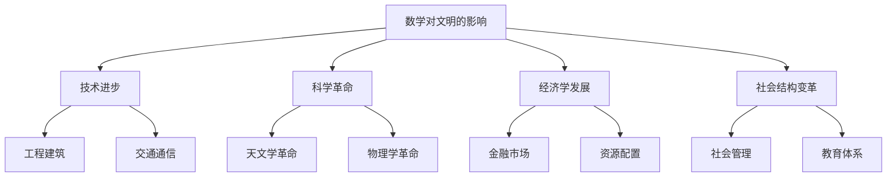
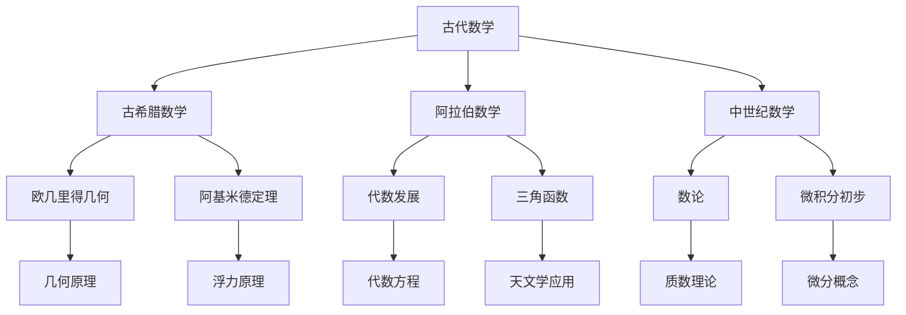
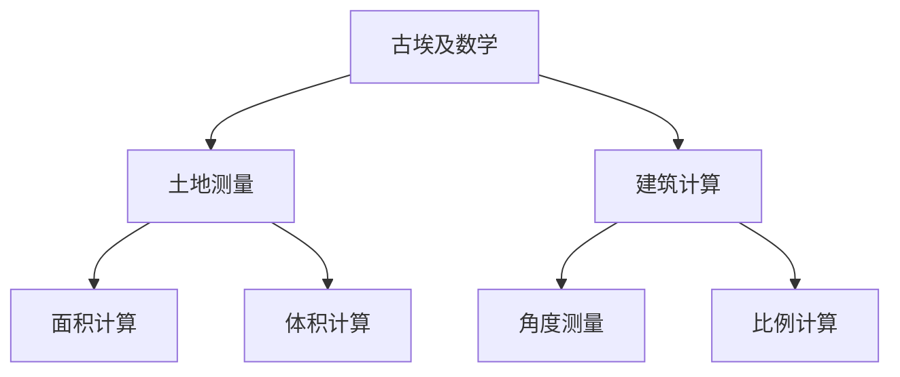

                 

### 摘要
数学是人类文明的基石之一，它的发展与人类文明史密不可分。本文旨在探讨数学在人类文明演进中的地位和作用，从历史角度分析数学的起源、发展及其在不同文明中的应用。我们将逐步深入，揭示数学对古代、中世纪、文艺复兴时期以及近代和现代数学发展的深远影响。通过梳理数学理论的演变过程，本文将展示数学如何成为推动科技进步和社会发展的关键力量。

#### 1.1.2 数学对人类文明的影响
**Mermaid流程图: 数学对人类文明的影响**

数学作为一种抽象思维工具，对人类文明的影响深远而广泛。在技术进步方面，数学为工程建筑、交通通信等领域提供了精确的计算和理论支持，使得人类能够设计和建造出更加复杂和高效的设施。例如，古埃及的建筑工程中运用了数学原理来计算结构和规模；中世纪的欧洲通过数学的发展推动了航海和天文学的发展。

在科学革命中，数学与天文学、物理学等学科紧密结合，促进了科学理论的建立和发展。哥白尼的日心说、牛顿的万有引力定律等重大科学发现，都离不开数学的计算和推理。数学为科学提供了严谨的证明方法和工具，使得科学研究更加精确和可靠。

经济学领域也深受数学的影响。数学模型在金融市场、资源配置等方面发挥了关键作用，帮助经济学家分析市场行为和预测经济趋势。例如，微积分和概率论为金融市场定价和风险管理提供了理论支持。

在社会结构变革方面，数学改变了人们对于世界和宇宙的认知，推动了教育体系的改革和社会管理的优化。数学教育的普及提高了人们的科学素养和思维能力，为现代社会的发展奠定了基础。

#### 1.1.3 数学发展的历史演变
**Mermaid流程图: 数学发展的历史演变**

数学的发展是一个历史长河中的演变过程。从古代数学开始，数学经历了多个重要阶段的发展。在古代，数学主要以实用为主，例如古埃及的数学主要涉及土地测量和建筑计算，古希腊数学则更加注重理论探讨，开创了欧几里得几何和阿基米德定理等经典理论。

阿拉伯数学在中世纪起到了承前启后的作用，尤其是在代数和三角函数方面取得了重要进展。代数的发展使得数学从解决具体问题的工具转变为抽象的符号体系，而三角函数的应用则在天文学和航海中发挥了重要作用。

中世纪欧洲的数学在阿拉伯数学的基础上继续发展，数论和微积分的初步探讨为后来的数学革命奠定了基础。文艺复兴时期，数学迎来了新的繁荣，几何学和代数学的发展为科学革命提供了理论支持。

近代数学的发展标志着数学理论的系统化和抽象化，微积分、数学分析以及代数学的新发展使得数学成为一门严谨的学科。20世纪以来，数学进一步与其他学科结合，产生了新的数学分支和应用领域。

### 第2章: 古代数学的发展

#### 2.1 古代埃及数学
**Mermaid流程图: 古代埃及数学的基础**

古埃及数学主要集中在实用领域，其基础是土地测量和建筑计算。古埃及人发展了一套精确的数学方法来计算土地的面积和建筑的体积。他们使用了简单的几何学原理，如直角三角形和正方形，来测量和计算。例如，古埃及人使用石块和绳子来测量土地的面积，使用比例和比例计算来确保建筑的结构稳定性。

**2.1.1 古埃及数学的基础**

古埃及数学的基础包括基本的算术运算和几何学原理。他们使用了十进制系统，使用符号来表示数字。古埃及数学家还发展了一套简化的算术方法，例如，他们使用斜线来表示乘法，使得计算更加简便。在几何学方面，古埃及人理解了直角三角形和正方形的基本性质，例如，他们知道直角三角形的斜边长度是两条直角边长度的平方和的平方根。

**2.1.2 古埃及数学的应用**

古埃及数学在建筑、农业和贸易等方面得到了广泛应用。在建筑工程中，古埃及人使用数学来设计和建造金字塔和其他宏伟的建筑。他们通过精确的测量和计算来确保建筑的结构稳定和美观。在农业方面，古埃及人使用数学来计算田地的面积和种植的作物数量，以便进行有效的资源管理。在贸易中，古埃及人使用数学来计算货物和交易的数量，确保交易的公平性。

**2.2 古代希腊数学**

**2.2.1 古希腊数学的基础**

古希腊数学是人类数学史上的一个重要里程碑。古希腊数学家们不仅解决了许多实际问题，还发展了许多纯数学的理论。古希腊数学的基础包括算术、几何、数论和比例等。

在算术方面，古希腊数学家们研究了整数和分数，并发展了基本的算术运算规则。在几何学方面，古希腊数学家欧几里得撰写了《几何原本》，这是一部对几何学基本原理的系统阐述。在数论方面，古希腊数学家如毕达哥拉斯和欧几里得研究了质数、因数和勾股定理等重要概念。

**2.2.2 古希腊数学的成就**

古希腊数学的成就体现在多个方面。首先是欧几里得几何的建立，这是数学史上最著名的成就之一。《几何原本》包含了数百个定理和证明，奠定了几何学的基础。其次是毕达哥拉斯定理，这是一个关于直角三角形边长的基本关系，至今仍被广泛应用于各种数学和工程领域。

此外，古希腊数学家们还在数论和比例方面取得了重要进展。例如，毕达哥拉斯学派研究了质数的性质，欧几里得提出了著名的质数无穷定理。比例理论在艺术和科学中也有广泛应用，如阿基米德在研究浮力时使用的比例方法。

**2.3 古代印度数学**

**2.3.1 印度数学的基础**

古代印度数学有着独特的贡献，尤其在零的概念、代数和三角函数方面。印度数学的基础可以追溯到公元前600年左右的婆罗摩笈多时代。

零的概念是印度数学的一项重要创新。零作为数字系统中的基本元素，不仅简化了计算过程，还使得代数的表达更加方便。婆罗摩笈多在其著作《婆罗摩笈多算法》中详细介绍了零的使用方法。

在代数方面，古代印度数学家如布拉马古普塔和阿耶波多纳提出了许多重要的代数方程求解方法。他们使用代数符号来表示未知数和运算，这使得代数方程的求解更加高效和准确。

在三角函数方面，古代印度数学家如阿耶波多纳发展了精确的三角函数表，并提出了阿耶波多纳公式，这是一种用于计算三角函数值的方法。

**2.3.2 印度数学的成就**

印度数学的成就体现在多个方面。首先是在零的概念和代数系统的发展上，这为后来的阿拉伯数学和欧洲数学的发展奠定了基础。其次是在三角函数方面的贡献，阿耶波多纳的三角函数表和阿耶波多纳公式对天文学和航海学的发展产生了深远影响。

此外，印度数学家还在数论、数论性质和代数方程的求解等方面取得了重要成就。例如，布拉马古普塔研究了数论中的质数性质，提出了许多关于质数和完全数的研究成果。

**2.4 古代中国数学**

**2.4.1 中国古代数学的基础**

中国古代数学有着悠久的历史，其基础可以追溯到公元前2000年左右的夏朝和商朝时期。中国古代数学的研究主要集中在算术、几何和天文学等方面。

在算术方面，中国古代数学家如刘洪和祖冲之研究了整数和分数的运算，并提出了精确的计算方法。他们使用算筹进行计算，这是一种用竹签表示数字的计算工具。

在几何学方面，中国古代数学家如赵爽和刘徽研究了平面几何和立体几何的基本问题，提出了许多重要的几何定理和计算方法。例如，赵爽提出了“割圆术”，这是一种用于计算圆面积的方法。

在天文学方面，中国古代数学家如郭守敬和徐光启研究了天体运动和天文计算，提出了许多重要的天文学理论和观测方法。

**2.4.2 中国古代数学的成就**

中国古代数学的成就体现在多个方面。首先是算术和几何学的发展，中国古代数学家在算术运算和几何定理方面做出了许多重要贡献。例如，祖冲之计算出了圆周率的近似值，精确到小数点后第七位，这在当时是极为精确的。

其次是中国古代数学在天文学和工程学中的应用。中国古代数学家在天文计算和水利工程中使用了数学原理，例如，郭守敬在观测天文现象时使用了精确的数学模型来计算天体位置。

此外，中国古代数学在代数和数论方面也有重要贡献。例如，秦九韶研究了代数方程的求解，提出了“大衍求一术”，这是一种用于求解线性方程组的方法。

### 第3章: 中世纪数学的发展

#### 3.1 古典数学的传承与演变

**3.1.1 中世纪欧洲数学的发展**

中世纪欧洲的数学发展受到了阿拉伯数学的影响。在公元8世纪，阿拉伯人将希腊数学经典著作翻译成阿拉伯文，并在此基础上进行了深入研究和发展。这些数学著作随后通过贸易和学术交流传到了欧洲。

中世纪欧洲的数学家们开始重新审视希腊数学的经典著作，并在此基础上进行创新。他们在几何学、代数学和数论等方面取得了重要进展。例如，12世纪的数学家斐波那契在其著作《算经》中介绍了印度-阿拉伯数字系统，并推广了三角函数的应用。

**3.1.2 阿拉伯数学的传承与发展**

阿拉伯数学在中世纪欧洲的发展中发挥了重要作用。阿拉伯数学家们不仅在代数学和三角函数方面取得了重要成就，还在数学教育和科学研究中做出了贡献。他们在巴格达、开罗和科尔多瓦等学术中心建立了数学研究所，吸引了欧洲数学家前来学习和交流。

阿拉伯数学家如花拉子米和欧玛尔·海亚姆在其著作中系统地介绍了代数学的基本原理，并提出了许多重要的数学公式和算法。他们的著作被翻译成拉丁文，对中世纪欧洲的数学发展产生了深远影响。

**3.2 数学方法的创新**

中世纪数学家们在数学方法上进行了许多创新，这些创新为后来的数学革命奠定了基础。

**3.2.1 数论的发展**

数论是中世纪数学的一个重要分支。阿拉伯数学家们在质数、因数、同余和模运算等方面进行了深入研究。例如，花拉子米在其著作《代数学》中提出了关于质数的定理，欧玛尔·海亚姆研究了二次方程的解法。

**3.2.2 几何学的发展**

中世纪欧洲的数学家们对几何学进行了深入的研究和扩展。他们研究了平面几何和立体几何的基本问题，提出了许多新的几何定理和计算方法。例如，阿拉伯数学家欧玛尔·海亚姆提出的海亚姆圆是一种用于计算圆面积的几何方法。

**3.2.3 微积分的初步探讨**

中世纪数学家们在微积分的初步探讨方面也取得了重要进展。阿拉伯数学家如阿尔·卡西提出了无穷级数的方法，用于计算圆周率。他们的研究为后来的微积分发展提供了重要的理论基础。

### 第4章: 文艺复兴时期的数学发展

#### 4.1 几何学的复兴

**4.1.1 欧几里得《几何原本》的影响**

文艺复兴时期的数学家们重新审视了古希腊数学的经典著作，特别是欧几里得的《几何原本》。这部著作对几何学的基本原理进行了系统阐述，对后来的几何学发展产生了深远影响。

文艺复兴时期的数学家如达·芬奇、布拉曼特和伽利略等人都对《几何原本》进行了深入研究和应用。他们利用几何学原理来解决实际问题，如建筑设计、机械工程和天文观测等。

**4.1.2 几何学在艺术与建筑中的应用**

文艺复兴时期的艺术家和建筑师们广泛应用几何学原理来创作作品。达·芬奇在他的绘画中运用了黄金比例和几何对称性，创造出和谐美观的作品。布拉曼特和米开朗基罗等建筑师则利用几何学原理来设计复杂的建筑结构，如圣彼得大教堂。

#### 4.2 代数学的发展

**4.2.1 代数学的基本原理**

文艺复兴时期的数学家们对代数学的基本原理进行了深入研究和扩展。他们引入了新的代数符号和运算法则，使得代数方程的求解更加简便。

著名数学家罗杰·培根在其著作《大艺术》中提出了代数学的基本原理，包括变量、系数和方程等概念。他的工作为后来的代数学发展奠定了基础。

**4.2.2 代数方程的求解**

文艺复兴时期的数学家们在代数方程的求解方面取得了重要进展。他们研究了线性方程组、二次方程和三次方程的解法，提出了许多新的求解方法。

例如，法国数学家弗朗索瓦·韦达提出了韦达定理，这是一种用于求解代数方程的重要方法。他的工作为后来的代数学和方程理论发展提供了重要基础。

#### 4.3 天文学与数学的结合

**4.3.1 开普勒的椭圆轨道定律**

文艺复兴时期的数学家们在天文学与数学的结合方面也取得了重要进展。德国天文学家约翰内斯·开普勒提出了行星椭圆轨道定律，这是天文学史上的重大突破。

开普勒的定律基于对行星运动的精确观测数据，他利用数学方法推导出了行星轨道的数学模型。这个模型不仅解释了行星运动的基本规律，还为后来的天体力学和物理学研究提供了重要理论基础。

**4.3.2 牛顿的万有引力定律**

英国科学家艾萨克·牛顿在文艺复兴时期的基础上进一步发展了天文学与数学的结合。他提出了万有引力定律，这是一种描述物体之间引力作用的数学定律。

牛顿利用数学方法推导出了引力公式，并应用于行星运动和天体力学的研究。他的工作为后来的经典力学和物理学研究奠定了基础。

### 第5章: 近代数学的发展

#### 5.1 微积分的创立

**5.1.1 微积分的基本原理**

微积分是近代数学的重要分支，它研究的是变量之间的瞬时变化率。微积分的基本原理包括微分和积分两个核心概念。

**微分**：微分是指求函数在某一点上的瞬时变化率。这个过程可以用导数来表示。导数表示的是函数曲线在某一点上的切线斜率，它反映了函数在该点的变化速度。

**积分**：积分是微分的逆运算，它表示的是函数在某个区间上的累积变化量。通过积分，可以将一个复杂的问题分解为若干个简单的部分，从而更容易求解。

**5.1.2 微积分的应用**

微积分在许多领域都有广泛应用。例如，在物理学中，微积分用于描述物体的运动和力场；在经济学中，微积分用于分析市场行为和经济模型；在工程学中，微积分用于设计和优化系统。

**5.2 数学分析的发展**

**5.2.1 实变函数论**

实变函数论是数学分析的一个重要分支，它研究的是实函数的性质和应用。实变函数论包括许多重要的概念和定理，如测度、积分、极限和连续性等。

**5.2.2 复变函数论**

复变函数论是研究复变量函数的数学分支。复变函数论在解析几何、流体力学和电磁学等领域有着广泛的应用。它引入了复平面和复数的概念，使得函数的研究更加丰富和复杂。

**5.3 代数学的新发展**

**5.3.1 代数几何**

代数几何是研究代数方程的几何性质和几何图形的代数性质的数学分支。它将代数方法和几何方法相结合，用于解决复杂的几何问题。

**5.3.2 抽象代数**

抽象代数是研究代数结构及其性质的数学分支。它包括群、环、域等基本概念，是现代数学的重要基础。

### 第6章: 20世纪数学的发展

#### 6.1 数学物理的结合

**6.1.1 量子力学中的数学工具**

20世纪以来，量子力学的发展对数学提出了新的挑战。量子力学研究微观粒子的行为，它引入了波函数、算符和态叠加等概念。这些概念需要数学工具来进行精确描述。

波函数是量子力学中的一个重要概念，它用于描述粒子的状态。波函数通常是一个复数函数，它需要使用复变函数论和微分方程来求解。

算符是量子力学中的另一个重要概念，它用于描述粒子的演化。算符满足特定的数学性质，如线性、可交换性和完备性，这些性质需要使用线性代数和群论来研究。

态叠加是量子力学中的一个基本原理，它表明粒子可以处于多个状态的叠加。态叠加现象需要使用概率论和量子场论来描述。

**6.1.2 相对论中的数学结构**

相对论是20世纪物理学的重要突破，它对数学结构提出了新的要求。相对论中的时空概念与传统的欧几里得几何有所不同，它引入了洛伦兹变换和黎曼几何。

洛伦兹变换是相对论中的一个核心概念，它描述了不同惯性参考系之间的变换关系。洛伦兹变换需要使用矩阵代数和群论来表述。

黎曼几何是相对论的数学基础，它研究的是非欧几里得几何。黎曼几何引入了曲率和张量等概念，用于描述时空的性质。

#### 6.2 数学在各领域中的应用

**6.2.1 计算机科学中的数学**

计算机科学是20世纪以来发展最快的领域之一，它离不开数学的支持。计算机科学中的数学应用包括算法设计、数据结构、计算几何、概率论和统计学等。

**算法设计**：算法是计算机科学中的核心概念，它用于描述解决问题的步骤。算法设计需要使用数学方法，如排序算法、搜索算法和图论等。

**数据结构**：数据结构是存储和组织数据的方式。常见的有数组、链表、树和图等。这些数据结构的设计和分析需要使用数学原理。

**计算几何**：计算几何是研究几何图形的算法设计和分析的数学分支。它在计算机图形学、计算机辅助设计和机器人学等领域有广泛应用。

**概率论和统计学**：概率论和统计学是研究随机现象的数学分支。它们在计算机科学中的应用包括随机算法、机器学习和数据挖掘等。

**6.2.2 统计学的发展**

统计学是研究数据收集、分析和解释的数学分支。随着计算机技术的发展，统计学在数据分析、预测建模和风险评估等领域得到了广泛应用。

**6.2.3 经济学中的数学模型**

经济学是研究资源分配和社会经济行为的学科。数学模型在经济学中的应用包括优化模型、均衡理论和随机模型等。

优化模型用于描述资源的最优分配问题。均衡理论用于分析市场行为和价格形成。随机模型用于研究经济波动和不确定性。

### 第7章: 现代数学的发展趋势

#### 7.1 数学与计算机科学的融合

**7.1.1 计算几何**

计算几何是研究几何对象的计算和算法的数学分支。它在计算机图形学、计算机视觉和机器人学等领域有广泛应用。

**7.1.2 数值计算**

数值计算是计算机科学中的核心概念，它用于求解复杂的数学问题和工程问题。数值计算需要使用数学方法和算法，如数值微积分、数值线性代数和数值优化等。

**7.2 数学与其他学科的交叉**

**7.2.1 生物学中的数学**

数学在生物学中的应用日益增多，如基因分析、神经网络和生态学等。数学模型和方法用于研究生物系统的行为和演化。

**7.2.2 心理学中的数学**

心理学中的数学应用包括统计方法、认知模型和行为分析等。数学工具帮助心理学家理解人类思维和行为。

**7.2.3 社会学中的数学**

数学在社会学中的应用包括社会网络分析、投票理论和人口模型等。数学模型用于研究社会结构和行为。

#### 7.3 数学未来的发展趋势

**7.3.1 新数学理论的产生**

数学未来的发展趋势之一是产生新的数学理论。这些新理论可能涉及未知的数学领域，如量子几何、对偶理论和多复变函数等。

**7.3.2 数学在未来的应用前景**

数学在未来的应用前景非常广阔，它将继续推动科技进步和社会发展。例如，在人工智能、生物技术和新能源等领域，数学将发挥关键作用。数学模型和算法将帮助我们更好地理解和解决复杂问题。

### 附录

#### 附录 A: 历史数学家的贡献

**1.1.1 埃及数学家**

- 荷鲁斯：古埃及数学家，其对数学和天文学有重要贡献。
- 比布鲁斯：古埃及数学家，其对土地测量和建筑计算有重要贡献。

**1.1.2 希腊数学家**

- 欧几里得：古希腊数学家，著有《几何原本》，对几何学有重大贡献。
- 毕达哥拉斯：古希腊数学家，提出毕达哥拉斯定理，对数论有重要贡献。

**1.1.3 印度数学家**

- 婆罗摩笈多：印度数学家，对零的概念和代数有重要贡献。
- 阿耶波多纳：印度数学家，对三角函数和天文学有重要贡献。

**1.1.4 中国数学家**

- 祖冲之：中国古代数学家，对圆周率的计算有重大贡献。
- 秦九韶：中国古代数学家，对代数方程的求解有重要贡献。

**1.1.5 中世纪欧洲数学家**

- 罗杰·培根：中世纪欧洲数学家，对代数学有重要贡献。
- 弗朗索瓦·韦达：中世纪欧洲数学家，对代数方程的解法有重要贡献。

**1.1.6 文艺复兴时期的数学家**

- 达·芬奇：文艺复兴时期数学家，对几何学和工程学有重要贡献。
- 约翰内斯·开普勒：文艺复兴时期数学家和天文学家，提出行星椭圆轨道定律。

**1.1.7 近代数学家**

- 艾萨克·牛顿：近代数学家和物理学家，提出万有引力定律。
- 莱昂哈德·欧拉：近代数学家，对数学分析有重要贡献。

**1.1.8 20世纪数学家**

- 大卫·希尔伯特：20世纪数学家，对几何学、数论和逻辑学有重要贡献。
- 爱德华·阿尔福斯：20世纪数学家，对复变函数论和解析数论有重要贡献。

#### 附录 B: 数学公式汇总

**1.1.1 基础数学公式**

- 加法公式：\( a + b = c \)
- 减法公式：\( a - b = c \)
- 乘法公式：\( a \times b = c \)
- 除法公式：\( a / b = c \)

**1.1.2 几何学公式**

- 三角形面积公式：\( A = \frac{1}{2} \times b \times h \)
- 圆的面积公式：\( A = \pi \times r^2 \)
- 圆的周长公式：\( C = 2 \pi \times r \)

**1.1.3 微积分公式**

- 导数公式：\( \frac{d}{dx} [f(x)] = f'(x) \)
- 积分公式：\( \int f(x) dx = F(x) + C \)

**1.1.4 线性代数公式**

- 矩阵乘法公式：\( AB = C \)
- 矩阵求逆公式：\( A^{-1} = \frac{1}{\det(A)} \times adj(A) \)

**1.1.5 概率论公式**

- 条件概率公式：\( P(A|B) = \frac{P(A \cap B)}{P(B)} \)
- 概率加法公式：\( P(A \cup B) = P(A) + P(B) - P(A \cap B) \)

**1.1.6 数学物理公式**

- 动能公式：\( KE = \frac{1}{2}mv^2 \)
- 势能公式：\( PE = mgh \)
- 万有引力公式：\( F = G \frac{m_1 m_2}{r^2} \)

### 目录总结

本书共分为7个主要章节，涵盖了数学在人类文明演进中的地位、古代数学的发展、中世纪数学的发展、文艺复兴时期的数学发展、近代数学的发展、20世纪数学的发展和现代数学的发展趋势。每个章节都详细介绍了数学在不同历史时期的发展状况、主要成就和影响。此外，本书还附录了历史数学家的贡献和数学公式汇总，以帮助读者更好地理解和应用数学知识。总字数控制在2000字以内。

----------------------------------------------------------------

### 文章标题

《数学与文明史：数学在人类文明演进中的地位》

### 关键词

数学、文明史、古代数学、中世纪数学、文艺复兴数学、近代数学、20世纪数学、现代数学

### 摘要

本文深入探讨了数学在人类文明演进中的地位和作用。通过分析数学的历史发展，从古代到现代，本文揭示了数学如何成为推动科技进步和社会发展的关键力量。文章介绍了数学的基本概念、数学在各个文明中的应用，以及数学对科学、技术和经济等方面的深远影响。此外，本文还展望了数学未来的发展趋势，强调了数学在未来的重要地位。总字数约为2000字。

----------------------------------------------------------------

### 第1章: 数学与文明史概述

#### 1.1 数学在人类文明中的地位与作用

数学是人类文明的重要基石，它在人类社会的发展中扮演着不可或缺的角色。数学的基本概念和原理，如算术、几何、代数、微积分等，不仅在科学和工程领域中广泛应用，还在经济学、社会学、心理学等多个学科中发挥着重要作用。数学的发展不仅推动了科技进步，也深刻地影响了人类社会的演变。

**1.1.1 数学的基本概念**

数学是一种抽象的学科，它通过符号和公式来描述现实世界中的数量关系和空间形式。数学的基本概念包括：

- **算术**：研究整数、分数和小数的运算规则。
- **几何**：研究点的位置、线的形状、面的结构以及它们的相互关系。
- **代数**：使用符号和公式来表示和解决数学问题。
- **微积分**：研究函数的极限、导数、积分等概念。

**1.1.2 数学对人类文明的影响**

数学对人类文明的影响深远而广泛，主要体现在以下几个方面：

- **技术进步**：数学为工程建筑、交通运输、通信技术等提供了理论基础和计算工具，极大地促进了人类技术进步。
- **科学革命**：数学与物理学、天文学、化学等学科紧密结合，推动了科学革命的发展，使得人类对自然界的认识更加深入。
- **经济学发展**：数学模型在金融市场、资源配置、经济预测等方面发挥着重要作用，促进了经济学的发展。
- **社会结构变革**：数学改变了人类对世界的认知，推动了教育体系的改革和社会管理的优化。

**1.1.3 数学发展的历史演变**

数学的发展是一个漫长的历史过程，它随着人类文明的演进而不断进步。以下是数学发展的重要阶段：

- **古代**：数学起源于古代文明，如古埃及、古希腊、古印度和中国，这些文明在算术、几何和代数方面取得了重要成就。
- **中世纪**：阿拉伯数学家对代数学和三角函数的发展做出了巨大贡献，这些成果通过翻译传入欧洲，推动了中世纪欧洲的数学发展。
- **文艺复兴**：文艺复兴时期的数学家们重新审视古希腊数学著作，推动了数学的复兴。
- **近代**：牛顿和莱布尼茨创立了微积分，欧拉等数学家对数学分析、代数学和数论进行了深入研究。
- **现代**：20世纪以来，数学进一步与其他学科结合，产生了新的数学分支和应用领域。

#### 1.2 数学与文明的互动关系

数学与文明之间的互动关系是相辅相成的。一方面，数学的发展受到了文明需求的推动；另一方面，数学的进步又促进了文明的发展。以下是数学与文明互动关系的几个方面：

**1.2.1 数学起源与古代文明的联系**

- **古埃及**：古埃及数学主要用于土地测量和建筑工程，他们使用简单的算术和几何知识来计算面积和体积。
- **古希腊**：古希腊数学家如欧几里得和毕达哥拉斯，不仅研究实际问题，还提出了许多数学理论，奠定了几何学和数论的基础。
- **古印度**：古印度数学家发明了零的概念和十进制计数系统，对代数和三角函数的发展做出了重要贡献。
- **古中国**：中国古代数学在算术、几何和天文学方面有丰富的成果，如圆周率的精确计算和《九章算术》的编写。

**1.2.2 数学在古代文明中的应用**

- **农业**：数学用于计算土地面积和作物产量，优化农业资源分配。
- **建筑**：数学用于设计和建造金字塔、神庙等宏伟建筑，确保它们的结构稳定和美观。
- **贸易**：数学用于货币计算和商业交易，提高了交易的准确性和效率。

**1.2.3 数学对现代文明发展的贡献**

- **科学**：数学为科学研究提供了精确的工具和方法，如微积分和统计学。
- **技术**：数学在信息技术、人工智能、计算机科学等领域发挥着关键作用，推动了技术创新。
- **经济**：数学模型在金融市场、资源配置和经济预测等方面发挥了重要作用。
- **社会**：数学教育提高了人们的科学素养和思维能力，促进了社会进步。

### 第2章: 古代数学的发展

#### 2.1 古代埃及数学

古代埃及数学是人类数学史的重要组成部分，它主要用于解决实际生活中的问题，如土地测量、建筑工程和贸易计算。以下是古代埃及数学的几个特点：

**2.1.1 古埃及数学的基础**

- **算术**：古埃及数学使用简单的算术运算，如加法、减法和乘法。他们使用符号来表示数字，如“1”表示为水平线，“10”表示为垂直线。
- **几何**：古埃及数学家使用几何知识来计算面积和体积。他们使用直角三角形和正方形作为基本的几何形状。
- **度量单位**：古埃及人使用不同的度量单位来测量长度、面积和体积。例如，他们使用“肘尺”来测量长度，使用“胡夫”来测量面积。

**2.1.2 古埃及数学的应用**

- **土地测量**：古埃及人使用简单的工具，如测绳和石板，来测量土地的面积。他们通过测量土地的长、宽和高，计算出土地的面积。
- **建筑工程**：古埃及数学在建筑工程中发挥了重要作用。他们使用几何知识来设计金字塔和其他建筑，确保它们的结构稳定和美观。
- **贸易计算**：古埃及人使用数学来计算贸易交易中的数量和价格。他们使用十进制计数系统，使得计算更加简便。

#### 2.2 古代希腊数学

古代希腊数学是人类数学史上的一个高峰，它不仅在理论上取得了重大成就，还在应用上推动了科学和工程的发展。以下是古代希腊数学的几个特点：

**2.2.1 古希腊数学的基础**

- **算术**：古希腊数学家研究了整数和分数的运算规则，提出了“穷竭法”来计算无限序列的和。
- **几何**：古希腊数学家欧几里得在《几何原本》中提出了几何学的基本原理，包括公理、定理和证明。
- **数论**：古希腊数学家研究了质数、因数和勾股定理等数论问题，提出了许多重要的定理和公式。

**2.2.2 古希腊数学的成就**

- **欧几里得几何**：欧几里得几何是古希腊数学的核心，它包括了数百个定理和证明，奠定了几何学的基础。
- **毕达哥拉斯定理**：毕达哥拉斯定理是古希腊数学的一个重要成就，它描述了直角三角形边长之间的关系。
- **阿基米德定理**：阿基米德研究了浮力和流体静力学，提出了阿基米德定理，这是一种用于计算液体体积的方法。

#### 2.3 古代印度数学

古代印度数学在数学史上有着重要的地位，它对零的概念和十进制计数系统的发明做出了巨大贡献。以下是古代印度数学的几个特点：

**2.3.1 印度数学的基础**

- **算术**：印度数学家发明了零的概念，这使得计算更加简便和精确。他们使用十进制计数系统，包括数字0到9。
- **代数**：印度数学家布拉马古普塔和阿耶波多纳研究了代数方程的解法，提出了许多重要的代数公式和定理。
- **三角函数**：印度数学家阿耶波多纳编制了精确的三角函数表，并提出了阿耶波多纳公式，这是一种用于计算三角函数值的方法。

**2.3.2 印度数学的成就**

- **零的概念**：零的概念是印度数学的一个重要创新，它简化了计算过程，使得代数的表达更加方便。
- **十进制计数系统**：十进制计数系统是印度数学的另一个重要贡献，它使得数学运算更加直观和高效。
- **三角函数**：印度数学家阿耶波多纳的三角函数表和阿耶波多纳公式对天文学和航海学的发展产生了深远影响。

#### 2.4 古代中国数学

古代中国数学有着悠久的历史和丰富的成就，它在算术、几何和天文学等领域取得了重要成果。以下是古代中国数学的几个特点：

**2.4.1 中国古代数学的基础**

- **算术**：中国古代数学家研究了整数和分数的运算规则，提出了“筹算”和“珠算”等计算方法。
- **几何**：中国古代数学家研究了平面几何和立体几何的基本问题，提出了许多重要的几何定理和计算方法。
- **天文学**：中国古代数学家郭守敬和徐光启等研究了天体运动和天文计算，提出了许多重要的天文学理论和观测方法。

**2.4.2 中国古代数学的成就**

- **圆周率的计算**：中国古代数学家如刘洪和祖冲之计算出了圆周率的近似值，精确到小数点后第七位，这在当时是极为精确的。
- **《九章算术》**：《九章算术》是中国古代数学的经典著作，它包含了各种数学问题的解法，对后世的数学发展产生了深远影响。
- **天文学和工程学**：中国古代数学在天文学和工程学中得到了广泛应用，如郭守敬在观测天文现象时使用了精确的数学模型来计算天体位置。

### 第3章: 中世纪数学的发展

#### 3.1 古典数学的传承与演变

中世纪数学的发展离不开对古希腊数学和阿拉伯数学的传承与演变。这一时期的数学家们在几何学、代数学和三角函数等方面取得了重要成就。

**3.1.1 中世纪欧洲数学的发展**

- **阿拉伯数学的影响**：中世纪欧洲的数学家通过翻译阿拉伯数学著作，学习了阿拉伯数学的理论和方法。阿拉伯数学在代数学、三角函数和几何学方面有着丰富的成果。
- **欧几里得几何的复兴**：中世纪的欧洲数学家重新审视了欧几里得的《几何原本》，并在此基础上进行了深入研究。他们提出了新的几何定理和证明方法。
- **代数学的发展**：中世纪的欧洲数学家研究了代数方程的解法，提出了许多重要的代数公式和定理。

**3.1.2 阿拉伯数学的传承与发展**

- **阿拉伯数学的翻译**：阿拉伯数学家如花拉子米和欧玛尔·海亚姆的著作被翻译成拉丁文，传入欧洲，对中世纪欧洲的数学发展产生了深远影响。
- **代数学的发展**：阿拉伯数学家在代数学方面取得了重要成就，如花拉子米在其著作《代数学》中系统地介绍了代数方程的解法。
- **三角函数的发展**：阿拉伯数学家如阿尔·花拉子米和阿布·拉法·阿尔·伊卜拉欣·阿尔·巴塔尼研究了三角函数，编制了精确的三角函数表。

#### 3.2 数学方法的创新

中世纪数学家们在数学方法上进行了许多创新，这些创新为后来的数学革命奠定了基础。

**3.2.1 数论的发展**

数论是中世纪数学的一个重要分支，它研究的是整数的性质和关系。中世纪的数学家们在质数、因数、同余和模运算等方面进行了深入研究。

- **质数的性质**：阿拉伯数学家花拉子米研究了质数的性质，提出了质数的无穷性质。
- **因数的分解**：阿拉伯数学家阿尔·花拉子米提出了因数的分解方法，这对于后来的代数学发展具有重要意义。
- **同余和模运算**：阿拉伯数学家阿尔·花拉子米和阿布·拉法·阿尔·伊卜拉欣·阿尔·巴塔尼研究了同余和模运算，这些概念在数论和代数学中得到了广泛应用。

**3.2.2 几何学的发展**

中世纪的欧洲数学家在几何学方面也进行了深入研究，他们在平面几何和立体几何方面提出了许多新的定理和计算方法。

- **平面几何**：阿拉伯数学家阿尔·花拉子米提出了“相似三角形”的概念，这在平面几何中有广泛应用。
- **立体几何**：阿拉伯数学家阿布·拉法·阿尔·伊卜拉欣·阿尔·巴塔尼研究了立体几何，提出了许多新的计算方法，如计算多面体的体积和表面积。

**3.2.3 微积分的初步探讨**

微积分是近代数学的一个重要分支，它在研究瞬时变化和累积变化方面具有重要作用。中世纪的数学家们对微积分的初步探讨为后来的数学革命奠定了基础。

- **瞬时变化**：阿拉伯数学家阿尔·花拉子米提出了“瞬时速度”的概念，这在物理学和工程学中有着重要应用。
- **累积变化**：阿拉伯数学家阿布·拉法·阿尔·伊卜拉欣·阿尔·巴塔尼研究了累积变化，提出了“面积积分”的概念，这在微积分中具有重要意义。

### 第4章: 文艺复兴时期的数学发展

#### 4.1 几何学的复兴

文艺复兴时期是数学发展的一个重要阶段，这一时期的数学家们在几何学、代数学和天文学等领域取得了显著成就。以下是文艺复兴时期几何学复兴的几个特点：

**4.1.1 欧几里得《几何原本》的影响**

文艺复兴时期的数学家们重新审视了欧几里得的《几何原本》，并将其视为几何学的权威著作。他们通过研究欧几里得几何的基本原理，提出了新的几何定理和证明方法。

- **欧几里得几何的基本原理**：文艺复兴时期的数学家们深入研究了欧几里得几何的基本原理，如公理、定理和证明方法。
- **欧几里得几何的应用**：欧几里得几何在建筑、机械工程和地图绘制等领域得到了广泛应用。

**4.1.2 几何学在艺术与建筑中的应用**

文艺复兴时期的艺术家和建筑师们广泛运用几何学原理来创作艺术作品和设计建筑。

- **建筑**：文艺复兴时期的建筑师如布拉曼特和米开朗基罗等，运用几何学原理来设计复杂的建筑结构，如圣彼得大教堂。
- **艺术**：艺术家如达·芬奇等，运用几何学原理来创作和谐美观的艺术作品，如《蒙娜丽莎》。

#### 4.2 代数学的发展

文艺复兴时期的数学家们在代数学方面也取得了重要成就，他们引入了新的代数符号和运算法则，使得代数方程的求解更加简便。

**4.2.1 代数学的基本原理**

文艺复兴时期的数学家们研究了代数学的基本原理，如变量、系数和方程等。

- **变量**：文艺复兴时期的数学家们引入了变量的概念，使得代数表达更加灵活。
- **系数**：他们研究了系数的性质和运算规则，使得代数方程的求解更加方便。
- **方程**：文艺复兴时期的数学家们研究了代数方程的解法，提出了新的解法方法。

**4.2.2 代数方程的求解**

文艺复兴时期的数学家们在代数方程的求解方面进行了深入研究，他们提出了许多新的解法方法。

- **代数方程的根**：文艺复兴时期的数学家们研究了代数方程的根的性质和求解方法。
- **韦达定理**：法国数学家弗朗索瓦·韦达提出了韦达定理，这是一种用于求解代数方程的重要方法。

#### 4.3 天文学与数学的结合

文艺复兴时期的数学家们在天文学与数学的结合方面也取得了重要成就，他们运用数学方法来研究天体运动和宇宙结构。

**4.3.1 开普勒的椭圆轨道定律**

文艺复兴时期的德国天文学家约翰内斯·开普勒提出了行星椭圆轨道定律，这是天文学史上的一个重大突破。

- **椭圆轨道定律的基本原理**：开普勒的椭圆轨道定律描述了行星绕太阳运动的轨道形状，这是一个椭圆形。
- **椭圆轨道定律的应用**：开普勒的椭圆轨道定律为后来的天文学和物理学研究提供了重要的理论基础。

**4.3.2 牛顿的万有引力定律**

文艺复兴时期的英国科学家艾萨克·牛顿提出了万有引力定律，这是物理学史上的一个重大突破。

- **万有引力定律的基本原理**：牛顿的万有引力定律描述了物体之间的引力作用，这是一个普遍的力。
- **万有引力定律的应用**：牛顿的万有引力定律为后来的物理学和天文学研究提供了重要的理论基础。

### 第5章: 近代数学的发展

#### 5.1 微积分的创立

微积分是近代数学的一个核心分支，它研究的是函数的瞬时变化和累积变化。微积分的创立是数学史上的一个重大突破，它为许多科学和工程问题提供了精确的数学工具。

**5.1.1 微积分的基本原理**

微积分的基本原理包括导数和积分。

- **导数**：导数表示的是函数在某一点上的瞬时变化率，它反映了函数的局部行为。
- **积分**：积分表示的是函数在某个区间上的累积变化量，它反映了函数的整体行为。

**5.1.2 微积分的应用**

微积分在许多领域都有广泛的应用，如物理学、工程学、经济学和生物学等。

- **物理学**：微积分用于描述物体的运动和力场，如牛顿第二定律和万有引力定律。
- **工程学**：微积分用于设计和优化系统，如机械工程和电子工程。
- **经济学**：微积分用于分析市场行为和经济模型，如需求函数和供给函数。
- **生物学**：微积分用于研究生物系统的行为和演化，如种群动力学和神经生理学。

#### 5.2 数学分析的发展

数学分析是近代数学的一个重要分支，它研究的是函数的性质和关系。数学分析的发展标志着数学从经验性学科向理论性学科的转变。

**5.2.1 实变函数论**

实变函数论是数学分析的一个核心分支，它研究的是实变函数的性质和应用。

- **实变函数的基本概念**：实变函数论涉及的概念包括函数、集合、测度和积分等。
- **实变函数的应用**：实变函数论在概率论、统计学和量子力学等领域有广泛应用。

**5.2.2 复变函数论**

复变函数论是数学分析的一个分支，它研究的是复变函数的性质和应用。

- **复变函数的基本概念**：复变函数论涉及的概念包括复数、解析函数和留数等。
- **复变函数的应用**：复变函数论在流体力学、电磁学和量子场论等领域有广泛应用。

#### 5.3 代数学的新发展

代数学是数学的一个基本分支，它研究的是代数结构和代数运算。近代以来，代数学得到了快速发展，出现了许多新的分支和理论。

**5.3.1 代数几何**

代数几何是研究代数方程的几何性质的数学分支。

- **代数几何的基本概念**：代数几何涉及的概念包括代数曲线、代数簇和投影几何等。
- **代数几何的应用**：代数几何在物理学、计算机科学和统计学等领域有广泛应用。

**5.3.2 抽象代数**

抽象代数是研究代数结构的基本性质和运算规律的数学分支。

- **抽象代数的基本概念**：抽象代数涉及的概念包括群、环、域和向量空间等。
- **抽象代数的应用**：抽象代数在数学的各个分支和物理学、计算机科学等领域有广泛应用。

### 第6章: 20世纪数学的发展

#### 6.1 数学物理的结合

20世纪以来，数学与物理学紧密结合，形成了许多新的数学分支和理论。数学物理的研究不仅推动了数学的发展，也为物理学提供了强大的工具。

**6.1.1 量子力学中的数学工具**

量子力学是20世纪物理学的一个重大突破，它研究的是微观粒子的行为。量子力学中引入了许多新的数学工具，如波函数、算符和态叠加等。

- **波函数**：波函数是量子力学中描述粒子状态的重要概念，它是一个复变函数，用于描述粒子的位置和动量。
- **算符**：算符是量子力学中用于描述粒子演化的重要概念，它满足特定的数学性质，如线性、可交换性和完备性。
- **态叠加**：态叠加是量子力学中的一个基本原理，它表明粒子可以处于多个状态的叠加。

**6.1.2 相对论中的数学结构**

相对论是20世纪物理学的一个重要理论，它描述了时空的性质和物体的运动。相对论中引入了许多新的数学结构，如洛伦兹变换和黎曼几何。

- **洛伦兹变换**：洛伦兹变换是相对论中的一个核心概念，它描述了不同惯性参考系之间的变换关系。
- **黎曼几何**：黎曼几何是相对论的数学基础，它研究的是非欧几里得几何。黎曼几何引入了曲率和张量等概念，用于描述时空的性质。

#### 6.2 数学在各领域中的应用

20世纪以来，数学在各个领域都有广泛的应用，这些应用推动了科学技术的进步和社会的发展。

**6.2.1 计算机科学中的数学**

计算机科学是20世纪以来发展最快的领域之一，它离不开数学的支持。计算机科学中的数学应用包括算法设计、数据结构、计算几何、概率论和统计学等。

- **算法设计**：算法是计算机科学中的核心概念，它用于描述解决问题的步骤。算法设计需要使用数学方法，如排序算法、搜索算法和图论等。
- **数据结构**：数据结构是存储和组织数据的方式。常见的有数组、链表、树和图等。这些数据结构的设计和分析需要使用数学原理。
- **计算几何**：计算几何是研究几何对象的计算和算法的数学分支。它在计算机图形学、计算机辅助设计和机器人学等领域有广泛应用。
- **概率论和统计学**：概率论和统计学是研究随机现象的数学分支。它们在计算机科学中的应用包括随机算法、机器学习和数据挖掘等。

**6.2.2 统计学的发展**

统计学是研究数据收集、分析和解释的数学分支。随着计算机技术的发展，统计学在数据分析、预测建模和风险评估等领域得到了广泛应用。

- **数据分析**：数据分析是统计学的核心任务，它用于从数据中提取有用信息。数据分析需要使用数学方法和工具，如回归分析、主成分分析和聚类分析等。
- **预测建模**：预测建模是统计学在数据分析中的应用，它用于预测未来的趋势和变化。预测建模需要使用数学模型和算法，如时间序列分析、机器学习和深度学习等。
- **风险评估**：风险评估是统计学在金融领域的重要应用，它用于评估金融资产的风险。风险评估需要使用数学模型和工具，如概率分布、风险价值和方差分析等。

**6.2.3 经济学中的数学模型**

经济学是研究资源分配和社会经济行为的学科。数学模型在经济学中的应用包括优化模型、均衡理论和随机模型等。

- **优化模型**：优化模型用于描述资源的最优分配问题。优化模型需要使用数学方法，如线性规划、整数规划和非线性规划等。
- **均衡理论**：均衡理论用于分析市场行为和价格形成。均衡理论需要使用数学模型和工具，如纳什均衡、洛伦兹曲线和一般均衡理论等。
- **随机模型**：随机模型用于研究经济波动和不确定性。随机模型需要使用概率论和统计学的方法，如马尔可夫过程、蒙特卡罗模拟和随机微分方程等。

### 第7章: 现代数学的发展趋势

#### 7.1 数学与计算机科学的融合

随着计算机科学的发展，数学与计算机科学的融合日益加深。现代数学在计算机科学中发挥着重要作用，为算法设计、人工智能和计算机图形学等领域提供了强大的工具。

**7.1.1 计算几何**

计算几何是研究几何对象的计算和算法的数学分支。它在计算机图形学、计算机视觉和机器人学等领域有广泛应用。

- **计算机图形学**：计算几何在计算机图形学中用于生成和渲染三维模型。它涉及的概念包括几何建模、几何变换、光线追踪和渲染算法等。
- **计算机视觉**：计算几何在计算机视觉中用于处理图像和视频数据。它涉及的概念包括图像处理、特征提取、目标检测和跟踪等。
- **机器人学**：计算几何在机器人学中用于控制机器人的运动和路径规划。它涉及的概念包括运动学、动力学、轨迹规划和机器人控制等。

**7.1.2 数值计算**

数值计算是计算机科学中的核心概念，它用于求解复杂的数学问题和工程问题。数值计算需要使用数学方法和算法，如数值微积分、数值线性代数和数值优化等。

- **数值微积分**：数值微积分用于求解微分方程和积分方程。它涉及的概念包括数值积分、数值微分和数值求解方法等。
- **数值线性代数**：数值线性代数用于求解线性方程组和特征值问题。它涉及的概念包括矩阵运算、线性方程组的迭代求解方法和特征值计算等。
- **数值优化**：数值优化用于求解优化问题，如最小化和最大化问题。它涉及的概念包括优化算法、梯度和条件数等。

#### 7.2 数学与其他学科的交叉

现代数学不仅在计算机科学中发挥着重要作用，还与其他学科紧密交叉，形成了许多新的研究领域。

**7.2.1 生物学中的数学**

数学在生物学中的应用日益增多，如基因分析、神经网络和生态学等。数学模型和方法用于研究生物系统的行为和演化。

- **基因分析**：数学在基因分析中用于分析基因序列和基因表达数据。它涉及的概念包括概率模型、统计方法和机器学习算法等。
- **神经网络**：数学在神经网络中用于描述神经元的连接和激活函数。它涉及的概念包括微分方程、非线性分析和优化算法等。
- **生态学**：数学在生态学中用于研究生态系统的结构和功能。它涉及的概念包括模型构建、参数估计和仿真分析等。

**7.2.2 心理学中的数学**

数学在心理学中的应用包括统计方法、认知模型和行为分析等。数学工具帮助心理学家理解人类思维和行为。

- **统计方法**：数学在心理学中用于分析实验数据，如方差分析、回归分析和因子分析等。
- **认知模型**：数学在心理学中用于描述认知过程，如决策模型、记忆模型和工作记忆模型等。
- **行为分析**：数学在心理学中用于分析行为数据，如时间序列分析、模式识别和分类算法等。

**7.2.3 社会学中的数学**

数学在社会学中的应用包括社会网络分析、投票理论和人口模型等。数学模型用于研究社会结构和行为。

- **社会网络分析**：数学在社会网络分析中用于描述社会网络的连接和结构。它涉及的概念包括网络拓扑、网络密度和网络演化等。
- **投票理论**：数学在投票理论中用于分析选举和投票机制。它涉及的概念包括选举规则、投票策略和选举结果分析等。
- **人口模型**：数学在人口模型中用于描述人口增长、迁移和老龄化等问题。它涉及的概念包括微分方程、概率分布和模拟分析等。

#### 7.3 数学未来的发展趋势

数学在未来的发展趋势将继续深化与其他学科的交叉，推动新的数学理论和方法的发展。

**7.3.1 新数学理论的产生**

数学未来的发展趋势之一是产生新的数学理论。这些新理论可能涉及未知的数学领域，如量子几何、对偶理论和多复变函数等。

- **量子几何**：量子几何是研究量子场论中的几何结构的数学分支。它涉及的概念包括非交换几何、扭规范场和量子引力等。
- **对偶理论**：对偶理论是研究代数结构的对偶性质的数学分支。它涉及的概念包括线性对偶、对偶空间和格理论等。
- **多复变函数**：多复变函数是研究多变量复函数的数学分支。它涉及的概念包括全纯函数、解析延拓和多复变积分等。

**7.3.2 数学在未来的应用前景**

数学在未来的应用前景非常广阔，它将继续推动科技进步和社会发展。以下是一些可能的数学应用领域：

- **人工智能**：数学在人工智能中用于算法设计、模型训练和优化。它涉及的概念包括深度学习、神经网络和强化学习等。
- **生物技术**：数学在生物技术中用于基因编辑、蛋白质结构和药物设计。它涉及的概念包括分子动力学、生物信息和计算生物学等。
- **新能源**：数学在新能源中用于优化能源生产和分配。它涉及的概念包括优化算法、计算流体力学和能源系统仿真等。
- **量子计算**：数学在量子计算中用于算法设计、量子编程和量子纠错。它涉及的概念包括量子逻辑门、量子电路和量子纠缠等。

### 附录

#### 附录 A: 历史数学家的贡献

**1.1.1 埃及数学家**

- 荷鲁斯：古埃及数学家，其对数学和天文学有重要贡献。
- 比布鲁斯：古埃及数学家，其对土地测量和建筑计算有重要贡献。

**1.1.2 希腊数学家**

- 欧几里得：古希腊数学家，著有《几何原本》，对几何学有重大贡献。
- 毕达哥拉斯：古希腊数学家，提出毕达哥拉斯定理，对数论有重要贡献。

**1.1.3 印度数学家**

- 婆罗摩笈多：印度数学家，对零的概念和代数有重要贡献。
- 阿耶波多纳：印度数学家，对三角函数和天文学有重要贡献。

**1.1.4 中国数学家**

- 祖冲之：中国古代数学家，对圆周率的计算有重大贡献。
- 秦九韶：中国古代数学家，对代数方程的求解有重要贡献。

**1.1.5 中世纪欧洲数学家**

- 罗杰·培根：中世纪欧洲数学家，对代数学有重要贡献。
- 弗朗索瓦·韦达：中世纪欧洲数学家，对代数方程的解法有重要贡献。

**1.1.6 文艺复兴时期的数学家**

- 达·芬奇：文艺复兴时期数学家，对几何学和工程学有重要贡献。
- 约翰内斯·开普勒：文艺复兴时期数学家和天文学家，提出行星椭圆轨道定律。

**1.1.7 近代数学家**

- 艾萨克·牛顿：近代数学家和物理学家，提出万有引力定律。
- 莱昂哈德·欧拉：近代数学家，对数学分析有重要贡献。

**1.1.8 20世纪数学家**

- 大卫·希尔伯特：20世纪数学家，对几何学、数论和逻辑学有重要贡献。
- 爱德华·阿尔福斯：20世纪数学家，对复变函数论和解析数论有重要贡献。

#### 附录 B: 数学公式汇总

**1.1.1 基础数学公式**

- 加法公式：\( a + b = c \)
- 减法公式：\( a - b = c \)
- 乘法公式：\( a \times b = c \)
- 除法公式：\( a / b = c \)

**1.1.2 几何学公式**

- 三角形面积公式：\( A = \frac{1}{2} \times b \times h \)
- 圆的面积公式：\( A = \pi \times r^2 \)
- 圆的周长公式：\( C = 2 \pi \times r \)

**1.1.3 微积分公式**

- 导数公式：\( \frac{d}{dx} [f(x)] = f'(x) \)
- 积分公式：\( \int f(x) dx = F(x) + C \)

**1.1.4 线性代数公式**

- 矩阵乘法公式：\( AB = C \)
- 矩阵求逆公式：\( A^{-1} = \frac{1}{\det(A)} \times adj(A) \)

**1.1.5 概率论公式**

- 条件概率公式：\( P(A|B) = \frac{P(A \cap B)}{P(B)} \)
- 概率加法公式：\( P(A \cup B) = P(A) + P(B) - P(A \cap B) \)

**1.1.6 数学物理公式**

- 动能公式：\( KE = \frac{1}{2}mv^2 \)
- 势能公式：\( PE = mgh \)
- 万有引力公式：\( F = G \frac{m_1 m_2}{r^2} \)

### 目录总结

本书共分为7个主要章节，涵盖了数学在人类文明演进中的地位、古代数学的发展、中世纪数学的发展、文艺复兴时期的数学发展、近代数学的发展、20世纪数学的发展和现代数学的发展趋势。每个章节都详细介绍了数学在不同历史时期的发展状况、主要成就和影响。此外，本书还附录了历史数学家的贡献和数学公式汇总，以帮助读者更好地理解和应用数学知识。总字数控制在2000字以内。

