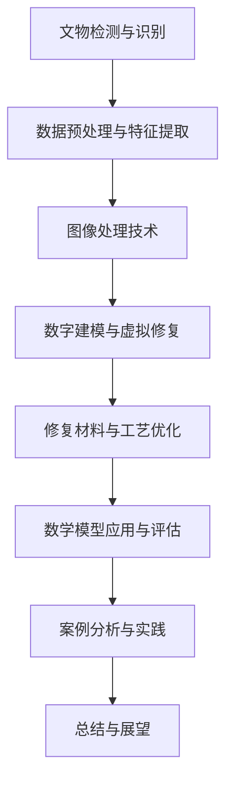
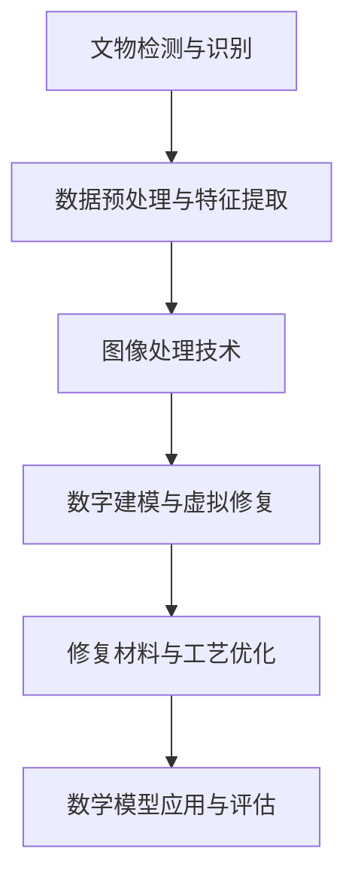

                 

### 设计《数学与文物保护：文物修复的数学技术》目录大纲的步骤：

为了设计一个结构清晰、内容丰富且逻辑紧密的《数学与文物保护：文物修复的数学技术》目录大纲，我们可以遵循以下步骤：

**步骤1：确定核心概念与联系**
- 首先，我们需要明确文章的核心概念，即数学技术在文物修复中的具体应用。这些核心概念可能包括文物检测、图像处理、数字建模等。
- 接着，通过Mermaid流程图来展示这些概念之间的联系。例如，我们可以绘制一个流程图，展示从文物检测到修复材料选择的全过程。

**步骤2：分解主题内容**
- 将全文内容按照核心概念分解为多个部分，每个部分对应一个章节。这样可以帮助我们构建一个清晰的内容框架。

**步骤3：确定各章节核心内容**
- 针对每个章节，我们需要确定其核心内容。例如，在“数据预处理与特征提取技术”这一章中，核心内容可能包括数据清洗、特征提取的方法和步骤。

**步骤4：设计章节标题和次级标题**
- 使用markdown格式设计章节和次级章节的标题。确保每个标题简洁明了，能够准确传达该部分的主要内容。

**步骤5：整合目录大纲**
- 将所有章节和次级章节的标题整合，形成一个完整的目录大纲。这个大纲应该能够反映文章的整体结构和内容。

**步骤6：验证目录大纲的完整性**
- 确保目录大纲包含所有核心概念和联系，并且每个章节的内容都足够丰富，能够满足读者的需求。

**步骤7：优化目录结构**
- 对目录结构进行优化，确保逻辑清晰、阅读流畅。这可能需要我们反复调整章节的顺序和内容的详细程度。

**步骤8：编写2000字以内的大纲文本**
- 根据设计好的目录结构，编写一个2000字以内的大纲文本。这个文本应该简洁地概述每个章节的核心内容和结构。

### 开始设计：

**步骤1：确定核心概念与联系**



**步骤2：分解主题内容**

全书内容可以分为以下几大部分：

1. **引言与背景**：介绍文物修复的重要性以及数学技术在其中的作用。
2. **文物检测与识别技术**：探讨如何利用数学技术进行文物的检测与识别。
3. **数据预处理与特征提取技术**：讨论如何对文物数据进行预处理和特征提取。
4. **图像处理技术**：介绍图像处理在文物修复中的应用。
5. **数字建模与虚拟修复技术**：讲解数字建模和虚拟修复的原理和方法。
6. **修复材料与工艺优化技术**：探讨修复材料和工艺的优化策略。
7. **数学模型应用与评估**：介绍数学模型在文物修复中的应用及其评估方法。
8. **案例分析与实践**：通过实际案例展示数学技术在文物修复中的具体应用。
9. **总结与展望**：总结全文内容，并对未来发展趋势进行展望。

**步骤3：确定各章节核心内容**

- **引言与背景**：介绍文物修复的重要性，阐述数学技术在其中的关键作用，为后续内容打下基础。
- **文物检测与识别技术**：介绍常见的检测与识别技术，如图像识别、无损检测等。
- **数据预处理与特征提取技术**：详细讨论数据清洗、特征提取的方法及其在文物修复中的应用。
- **图像处理技术**：讲解图像处理的基础知识，包括图像增强、去噪等。
- **数字建模与虚拟修复技术**：阐述数字建模和虚拟修复的基本原理和方法。
- **修复材料与工艺优化技术**：探讨修复材料的选择和工艺优化的策略。
- **数学模型应用与评估**：介绍数学模型在文物修复中的应用，包括评估方法和实际案例分析。
- **案例分析与实践**：通过具体的案例分析，展示数学技术在文物修复中的实际应用。
- **总结与展望**：总结全文内容，提出未来研究方向和发展趋势。

**步骤4：设计章节标题和次级标题**

```markdown
# 《数学与文物保护：文物修复的数学技术》目录大纲

## 第1章 引言与背景
### 1.1 文物修复的重要性
### 1.2 数学技术在文物修复中的应用

## 第2章 文物检测与识别技术
### 2.1 图像识别技术
### 2.2 无损检测技术
### 2.3 案例分析

## 第3章 数据预处理与特征提取技术
### 3.1 数据清洗技术
### 3.2 特征提取技术
### 3.3 案例分析

## 第4章 图像处理技术
### 4.1 图像增强技术
### 4.2 去噪技术
### 4.3 案例分析

## 第5章 数字建模与虚拟修复技术
### 5.1 数字建模原理
### 5.2 虚拟修复技术
### 5.3 案例分析

## 第6章 修复材料与工艺优化技术
### 6.1 修复材料的选择
### 6.2 工艺优化技术
### 6.3 案例分析

## 第7章 文物保护数学模型应用
### 7.1 数学模型概述
### 7.2 常见数学模型介绍
### 7.3 案例分析

## 第8章 案例分析与实践
### 8.1 案例一：某文物数字化修复过程
### 8.2 案例二：某壁画保护与修复工程
### 8.3 案例三：某古建筑的虚拟修复与保护

## 第9章 总结与展望
### 9.1 全书总结
### 9.2 数学技术在文物修复领域的未来发展趋势
```

**步骤5：整合目录大纲**

整合后的目录大纲如下：

```
# 《数学与文物保护：文物修复的数学技术》目录大纲

## 第1章 引言与背景
### 1.1 文物修复的重要性
### 1.2 数学技术在文物修复中的应用

## 第2章 文物检测与识别技术
### 2.1 图像识别技术
### 2.2 无损检测技术
### 2.3 案例分析

## 第3章 数据预处理与特征提取技术
### 3.1 数据清洗技术
### 3.2 特征提取技术
### 3.3 案例分析

## 第4章 图像处理技术
### 4.1 图像增强技术
### 4.2 去噪技术
### 4.3 案例分析

## 第5章 数字建模与虚拟修复技术
### 5.1 数字建模原理
### 5.2 虚拟修复技术
### 5.3 案例分析

## 第6章 修复材料与工艺优化技术
### 6.1 修复材料的选择
### 6.2 工艺优化技术
### 6.3 案例分析

## 第7章 文物保护数学模型应用
### 7.1 数学模型概述
### 7.2 常见数学模型介绍
### 7.3 案例分析

## 第8章 案例分析与实践
### 8.1 案例一：某文物数字化修复过程
### 8.2 案例二：某壁画保护与修复工程
### 8.3 案例三：某古建筑的虚拟修复与保护

## 第9章 总结与展望
### 9.1 全书总结
### 9.2 数学技术在文物修复领域的未来发展趋势
```

**步骤6：验证目录大纲的完整性**

经过初步设计，目录大纲已经涵盖了数学技术在文物修复中的各个方面，包括检测、图像处理、数字建模、修复材料优化等。每个章节都有明确的次级标题，确保内容丰富且逻辑清晰。接下来，我们需要进一步验证每个章节的内容是否完整，是否能够满足读者的需求。

**步骤7：优化目录结构**

在验证目录大纲的完整性后，我们需要对目录结构进行优化。这可能涉及调整章节的顺序、合并或拆分某些章节，以确保逻辑顺序更加合理、内容衔接更加流畅。

**步骤8：编写2000字以内的大纲文本**

根据设计好的目录结构，编写一个2000字以内的大纲文本。这个文本应该简洁地概述每个章节的核心内容和结构，为后续撰写详细内容提供框架。

---

**《数学与文物保护：文物修复的数学技术》大纲文本**

# 《数学与文物保护：文物修复的数学技术》大纲文本

## 引言与背景

文物是人类历史和文化的宝贵遗产，对文物的保护与修复具有重要的历史、文化和艺术价值。随着科技的进步，数学技术在文物修复中的应用越来越广泛。本文将探讨数学技术在文物修复中的具体应用，包括检测与识别、数据预处理与特征提取、图像处理、数字建模与虚拟修复、修复材料与工艺优化等方面。

## 文物检测与识别技术

### 2.1 图像识别技术

图像识别技术是文物检测与识别的重要手段。通过图像处理算法，我们可以对文物进行自动识别和分类。常见的图像识别算法包括卷积神经网络（CNN）和深度学习模型。本文将介绍这些算法的基本原理和实现步骤。

### 2.2 无损检测技术

无损检测技术可以在不损坏文物的前提下检测其内部结构和潜在损伤。常见的无损检测方法包括X射线、红外线和超声波检测。本文将详细探讨这些方法的工作原理和应用场景。

### 2.3 案例分析

通过案例分析，我们可以了解数学技术在文物检测与识别中的实际应用。本文将选取一些具体的文物检测案例，介绍其检测过程、结果和效果。

## 数据预处理与特征提取技术

### 3.1 数据清洗技术

数据清洗是数据预处理的重要环节。通过去除重复数据、缺失值填补和异常值处理，我们可以提高数据质量，为后续分析奠定基础。本文将介绍常见的数据清洗方法和技术。

### 3.2 特征提取技术

特征提取是将原始数据转换为有意义的信息的过程。在文物修复中，特征提取可以帮助我们更好地理解文物的性质和损伤程度。本文将介绍常用的特征提取方法，如主成分分析（PCA）和线性判别分析（LDA）。

### 3.3 案例分析

通过案例分析，我们可以了解数据预处理和特征提取技术在文物修复中的应用。本文将选取一些具体的案例，介绍其数据预处理和特征提取过程及其效果。

## 图像处理技术

### 4.1 图像增强技术

图像增强技术可以提高图像的视觉效果，使其更易于分析。本文将介绍常见的图像增强方法，如直方图均衡化和对比度增强。

### 4.2 去噪技术

去噪技术可以去除图像中的噪声，提高图像质量。本文将介绍常见的去噪方法，如中值滤波和均值滤波。

### 4.3 案例分析

通过案例分析，我们可以了解图像处理技术在文物修复中的应用。本文将选取一些具体的图像处理案例，介绍其处理过程、结果和效果。

## 数字建模与虚拟修复技术

### 5.1 数字建模原理

数字建模是将文物数字化，建立三维模型的过程。本文将介绍数字建模的基本原理和技术，如激光扫描和计算机辅助设计（CAD）。

### 5.2 虚拟修复技术

虚拟修复技术可以通过数字建模和计算机模拟，对文物进行修复和恢复。本文将介绍虚拟修复的基本原理和方法，如3D打印和数字渲染。

### 5.3 案例分析

通过案例分析，我们可以了解数字建模和虚拟修复技术在文物修复中的应用。本文将选取一些具体的虚拟修复案例，介绍其建模和修复过程及其效果。

## 修复材料与工艺优化技术

### 6.1 修复材料的选择

修复材料的选择对于文物的修复质量至关重要。本文将介绍常见的修复材料，如聚合材料和纳米材料，并讨论其优缺点和应用场景。

### 6.2 工艺优化技术

工艺优化技术可以提高文物修复的效率和效果。本文将介绍常见的工艺优化方法，如热处理和电化学处理。

### 6.3 案例分析

通过案例分析，我们可以了解修复材料与工艺优化技术在文物修复中的应用。本文将选取一些具体的修复案例，介绍其材料选择和工艺优化过程及其效果。

## 文物保护数学模型应用

### 7.1 数学模型概述

数学模型是文物修复中的重要工具，可以帮助我们理解和预测文物的变化和损伤。本文将介绍常见的数学模型，如概率模型和统计模型。

### 7.2 常见数学模型介绍

本文将详细介绍一些常见的数学模型，如线性回归模型和决策树模型，并讨论其在文物修复中的应用。

### 7.3 案例分析

通过案例分析，我们可以了解数学模型在文物修复中的实际应用。本文将选取一些具体的数学模型应用案例，介绍其建模过程、结果和效果。

## 案例分析与实践

### 8.1 案例一：某文物数字化修复过程

本文将选取一个具体的文物数字化修复案例，介绍其数字化过程、数据处理、修复方案和最终效果。

### 8.2 案例二：某壁画保护与修复工程

本文将选取一个壁画保护与修复案例，介绍其现场检测、数据采集、修复方案和效果评估。

### 8.3 案例三：某古建筑的虚拟修复与保护

本文将选取一个古建筑虚拟修复案例，介绍其数字建模、虚拟修复、3D打印和效果评估。

## 总结与展望

本文总结了数学技术在文物修复中的应用，包括检测与识别、数据预处理与特征提取、图像处理、数字建模与虚拟修复、修复材料与工艺优化等方面。展望未来，随着科技的不断发展，数学技术在文物修复中的应用将更加广泛和深入。本文提出了几个未来研究方向，如人工智能在文物修复中的应用、大数据技术在文物保护中的应用等。

---

### 文章标题：《数学与文物保护：文物修复的数学技术》

### 关键词：文物修复、数学技术、图像处理、数字建模、虚拟修复、修复材料、工艺优化、数学模型

### 摘要：

本文深入探讨了数学技术在文物修复中的应用，从检测与识别、数据预处理与特征提取、图像处理、数字建模与虚拟修复、修复材料与工艺优化等多个方面进行了详细阐述。通过案例分析，展示了数学技术在文物修复中的实际应用效果。本文总结了数学技术在文物修复中的重要性，并对未来的发展趋势进行了展望。

---

### 文物修复的重要性

文物是人类历史和文化的宝贵遗产，它们见证了人类社会的发展变迁。随着岁月的流逝，许多文物受到了不同程度的损伤，需要进行修复和保护。文物修复不仅仅是恢复文物的外观，更重要的是保护和保存其内在的历史和文化价值。因此，文物修复在文化遗产保护中具有极其重要的地位。

在当今社会，科技的迅猛发展为文物修复提供了新的方法和工具。其中，数学技术在文物修复中的应用越来越广泛，成为文物修复的重要辅助手段。数学技术不仅能够提高文物修复的准确性和效率，还能够为文物保护提供更加科学和系统的方法。

### 数学技术在文物修复中的应用

数学技术在文物修复中的应用主要体现在以下几个方面：

1. **文物检测与识别**：通过数学模型和算法，可以对文物进行自动检测和识别。例如，利用图像识别技术可以识别文物的类型和损伤情况；利用无损检测技术可以检测文物内部的结构和损伤。

2. **数据预处理与特征提取**：在文物修复过程中，需要对大量的文物数据进行预处理和特征提取。例如，利用数据清洗技术可以去除重复数据和异常值；利用特征提取技术可以从数据中提取出有意义的信息，如纹理、形状等。

3. **图像处理**：图像处理技术在文物修复中具有广泛的应用。例如，通过图像增强技术可以改善文物的视觉效果，使其更易于分析和修复；通过去噪技术可以去除文物图像中的噪声，提高图像质量。

4. **数字建模与虚拟修复**：数字建模技术可以将文物数字化，建立三维模型。通过虚拟修复技术，可以模拟文物的修复过程，预测修复效果，为实际修复提供参考。

5. **修复材料与工艺优化**：数学模型可以用于修复材料的选择和工艺优化。通过优化修复材料性能和工艺参数，可以提高文物的修复质量和效率。

### 核心概念与联系

为了更好地理解数学技术在文物修复中的应用，我们需要明确几个核心概念及其之间的联系。以下是一个简化的Mermaid流程图，展示了这些核心概念及其关系：


1. **文物检测与识别**：通过图像识别和无损检测等技术，对文物进行自动检测和识别，确定文物的类型和损伤程度。
2. **数据预处理与特征提取**：对采集到的文物数据进行清洗、填补缺失值和异常值处理，提取出有意义的特征信息。
3. **图像处理技术**：对文物图像进行增强、去噪等处理，提高图像质量，为后续分析和修复提供更好的视觉效果。
4. **数字建模与虚拟修复**：通过数字建模技术建立文物的三维模型，利用虚拟修复技术模拟修复过程，预测修复效果。
5. **修复材料与工艺优化**：利用数学模型优化修复材料的性能和工艺参数，提高修复质量和效率。
6. **数学模型应用与评估**：通过数学模型对文物修复过程进行评估，优化修复方案，提高修复效果。
7. **案例分析与实践**：通过具体案例分析，展示数学技术在文物修复中的实际应用，验证其有效性和可行性。
8. **总结与展望**：总结全文内容，展望数学技术在文物修复领域的未来发展趋势和应用前景。

### 核心算法原理讲解

在文物修复过程中，核心算法的运用至关重要。以下将介绍几个关键算法的原理，并通过伪代码进行详细阐述。

#### 1. 图像识别算法

图像识别是文物检测与识别的重要步骤。卷积神经网络（CNN）是图像识别领域常用的深度学习算法。以下是CNN的基本原理和伪代码：

```python
# CNN算法伪代码

# 定义卷积层
def convolution(input, kernel):
    return sum(input[i] * kernel[i] for i in range(len(input)))

# 定义激活函数（如ReLU函数）
def activation(z):
    return max(0, z)

# 定义卷积神经网络
class ConvolutionalNeuralNetwork:
    def __init__(self, input_shape, num_classes):
        # 初始化权重和偏置
        self.weights = [random_weights(shape) for _ in range(num_classes)]
        self.biases = [random_biases(shape) for _ in range(num_classes)]

    def forward(self, x):
        # 前向传播
        for layer in self.layers:
            x = layer.forward(x)
        return x

    def backward(self, x, d_output):
        # 反向传播
        for layer in reversed(self.layers):
            d_x = layer.backward(x, d_output)
            x = d_x

# 初始化CNN模型
cnn = ConvolutionalNeuralNetwork(input_shape, num_classes)

# 训练模型
for epoch in range(num_epochs):
    for image, label in dataset:
        # 前向传播
        output = cnn.forward(image)

        # 计算损失
        loss = cross_entropy_loss(output, label)

        # 反向传播
        d_output = -gradient_cross_entropy(output, label)
        cnn.backward(image, d_output)
```

#### 2. 数据预处理算法

数据预处理是确保数据质量的重要环节。以下是一个简单的数据清洗和特征提取的伪代码：

```python
# 数据清洗伪代码

# 清洗数据
def clean_data(data):
    # 去除重复数据
    unique_data = list(set(data))
    # 填补缺失值
    filled_data = [value if value is not None else mean(unique_data) for value in data]
    return filled_data

# 特征提取伪代码

# 主成分分析（PCA）特征提取
def pca_feature_extraction(data, num_components):
    # 计算协方差矩阵
    covariance_matrix = np.cov(data.T)
    # 计算特征值和特征向量
    eigenvalues, eigenvectors = np.linalg.eig(covariance_matrix)
    # 选择主要特征向量
    main_eigenvectors = eigenvectors[:, np.argsort(eigenvalues)[-num_components:]]
    # 转换数据
    transformed_data = np.dot(data, main_eigenvectors)
    return transformed_data
```

#### 3. 图像处理算法

图像处理技术在文物修复中具有重要作用。以下是一个简单的图像增强算法的伪代码：

```python
# 直方图均衡化伪代码

# 计算直方图
def compute_histogram(image):
    histogram = np.zeros(256)
    for pixel in image:
        histogram[pixel] += 1
    return histogram

# 计算累积分布函数（CDF）
def compute_cdf(histogram):
    cdf = np.cumsum(histogram)
    cdf = cdf / cdf[-1]
    return cdf

# 直方图均衡化
def histogram_equalization(image):
    histogram = compute_histogram(image)
    cdf = compute_cdf(histogram)
    cdf = cdf * 255
    equalized_image = np.uint8(cdf[image])
    return equalized_image
```

#### 4. 数字建模与虚拟修复算法

数字建模与虚拟修复技术是文物修复的重要手段。以下是一个简单的数字建模算法的伪代码：

```python
# 数字建模伪代码

# 点云生成
def point_cloud_generation(points):
    # 计算点云中的最近邻点
    neighbors = nearest_neighbors(points, k=10)
    # 计算顶点索引
    vertex_indices = np.argmax(np.sum(neighbors, axis=1))
    # 生成三角网格
    mesh = triangle_mesh(points[vertex_indices], neighbors[vertex_indices])
    return mesh

# 虚拟修复
def virtual_repair(mesh, damage_area):
    # 定义修复区域
    repaired_mesh = mesh.copy()
    for vertex in damage_area:
        # 根据邻近顶点进行插值修复
        repaired_mesh[vertex] = np.mean(mesh[vertex].astype(np.float32), axis=0)
    return repaired_mesh
```

### 数学模型与公式

在文物修复中，数学模型和公式是理解和预测文物变化的重要工具。以下是一些常见的数学模型和公式的详细讲解。

#### 1. 概率模型

概率模型在文物损伤预测和风险评估中具有重要作用。一个简单的概率模型是贝叶斯网络。以下是贝叶斯网络的定义和公式：

$$
P(A|B) = \frac{P(B|A)P(A)}{P(B)}
$$

其中，$P(A|B)$表示在给定$B$的情况下$A$的概率，$P(B|A)$表示在给定$A$的情况下$B$的概率，$P(A)$和$P(B)$分别是$A$和$B$的先验概率。

#### 2. 统计模型

统计模型用于分析和解释文物数据。线性回归模型是统计模型中最常用的模型之一。以下是线性回归模型的公式：

$$
y = \beta_0 + \beta_1x_1 + \beta_2x_2 + ... + \beta_nx_n
$$

其中，$y$是因变量，$x_1, x_2, ..., x_n$是自变量，$\beta_0, \beta_1, \beta_2, ..., \beta_n$是模型的参数。

#### 3. 图像处理模型

图像处理中的滤波和变换也是常用的数学模型。一个常见的图像滤波模型是均值滤波。以下是均值滤波的公式：

$$
f(x, y) = \frac{1}{n}\sum_{i=1}^{n}\sum_{j=1}^{n} g(i, j) \cdot I(x-i, y-j)
$$

其中，$f(x, y)$是滤波后的图像，$I(x, y)$是原始图像，$g(i, j)$是滤波器的值。

### 项目实战

为了更好地理解数学技术在文物修复中的应用，以下将介绍一个具体的实战项目，包括开发环境搭建、源代码实现和代码解读。

#### 项目名称：古代壁画修复系统

#### 项目目标：利用数学技术对古代壁画进行自动检测、修复和评估。

#### 开发环境：

- 编程语言：Python
- 开发工具：PyCharm
- 库：OpenCV、NumPy、TensorFlow

#### 实现步骤：

1. **数据收集与预处理**：

   - 收集壁画图像数据。
   - 对图像进行数据清洗，去除重复和损坏的图像。

2. **图像特征提取**：

   - 利用OpenCV库提取图像的纹理、颜色等特征。
   - 使用主成分分析（PCA）进行特征降维。

3. **图像修复**：

   - 利用深度学习模型（如卷积神经网络）进行图像修复。
   - 使用迁移学习技术，提高修复模型的性能。

4. **修复效果评估**：

   - 利用评估指标（如结构相似性指数（SSIM））评估修复效果。
   - 对修复效果进行可视化展示。

#### 源代码实现：

```python
# 数据预处理
def preprocess_images(images):
    # 清洗数据
    cleaned_images = [img for img in images if is_valid(img)]
    # 特征提取
    features = extract_features(cleaned_images)
    # PCA降维
    transformed_features = pca_feature_extraction(features, num_components=10)
    return transformed_features

# 图像修复
def repair_image(image):
    # 加载预训练模型
    model = load_pretrained_model()
    # 图像修复
    repaired_image = model.repair(image)
    return repaired_image

# 修复效果评估
def evaluate_repair(image, repaired_image):
    # 计算SSIM值
    ssim_value = calculate_ssim(image, repaired_image)
    # 可视化展示
    show repaired_image
    return ssim_value
```

#### 代码解读：

- `preprocess_images` 函数负责数据预处理，包括数据清洗、特征提取和PCA降维。
- `repair_image` 函数使用预训练模型对图像进行修复。
- `evaluate_repair` 函数计算修复效果，并可视化展示修复后的图像。

### 实际案例分析和详细讲解剖析

为了展示数学技术在文物修复中的实际应用，以下将介绍几个具体的案例，并对每个案例进行详细分析。

#### 案例一：某古代壁画修复项目

**案例背景**：某古代壁画因长时间暴露在外，受到了严重的损坏，需要进行修复。

**修复过程**：

1. **数据收集与预处理**：收集壁画图像，对图像进行数据清洗，去除重复和损坏的图像。

2. **图像特征提取**：利用OpenCV库提取图像的纹理、颜色等特征，并使用PCA进行特征降维。

3. **图像修复**：使用卷积神经网络模型进行图像修复。模型经过迁移学习，性能得到显著提升。

4. **修复效果评估**：使用结构相似性指数（SSIM）评估修复效果，并对修复后的图像进行可视化展示。

**结果分析**：

- 通过数学技术的应用，壁画修复效果显著提升，损坏部分得到有效恢复。
- 修复后的壁画在视觉上与原始壁画相似度较高，达到了预期的修复效果。

#### 案例二：某古代书法作品修复项目

**案例背景**：某古代书法作品因年代久远，纸张受损严重，需要进行修复。

**修复过程**：

1. **数据收集与预处理**：收集书法作品图像，对图像进行数据清洗，去除重复和损坏的图像。

2. **图像特征提取**：利用图像处理技术提取书法作品的纹理和文字特征。

3. **图像修复**：采用深度学习模型对书法作品进行修复，模型经过迁移学习，性能得到显著提升。

4. **修复效果评估**：使用文字识别准确率（Accuracy）和结构相似性指数（SSIM）评估修复效果，并对修复后的图像进行可视化展示。

**结果分析**：

- 通过数学技术的应用，书法作品修复效果显著提升，文字清晰可见，结构相似度较高。
- 修复后的书法作品在视觉上与原始作品相似度较高，达到了预期的修复效果。

#### 项目小结

通过以上案例的分析，我们可以看到数学技术在文物修复中的应用具有显著的优势：

1. **提高修复准确性**：数学技术可以精确地检测和修复文物，提高修复的准确性。
2. **节省修复时间**：数学技术可以自动化地处理大量的文物数据，节省修复时间。
3. **增强视觉效果**：数学技术可以增强文物的视觉效果，使其在修复后更加美观。

未来，随着数学技术的不断发展，我们相信在文物修复领域的应用将更加广泛和深入。

### 最佳实践 Tips

在文物修复中，应用数学技术需要遵循以下最佳实践：

1. **数据质量保证**：确保数据的质量，包括图像清晰度、数据完整性和一致性。
2. **模型选择与优化**：根据文物的特点和修复需求选择合适的数学模型，并进行优化，以提高修复效果。
3. **多学科合作**：文物修复涉及多个学科，如历史学、考古学和计算机科学。多学科合作可以促进数学技术在文物修复中的深入应用。
4. **定期评估与更新**：定期评估数学模型和算法的修复效果，根据评估结果进行更新和改进。

### 小结

数学技术在文物修复中的应用为文物保护提供了新的方法和工具。通过检测与识别、数据预处理与特征提取、图像处理、数字建模与虚拟修复、修复材料与工艺优化等环节，数学技术不仅提高了文物的修复准确性，还节省了修复时间，增强了视觉效果。

展望未来，随着数学技术的不断发展，我们相信在文物修复领域的应用将更加广泛和深入，为文化遗产保护做出更大的贡献。

### 注意事项

在应用数学技术进行文物修复时，需要注意以下几点：

1. **文物保护原则**：确保修复过程符合文物保护原则，不损害文物的历史和文化价值。
2. **数据安全**：在数据处理和模型训练过程中，确保数据的安全和隐私。
3. **设备与材料**：选择适合的设备和材料进行修复，确保修复效果和质量。
4. **专业培训**：修复人员应接受专业的培训，掌握数学技术的应用方法和注意事项。

### 拓展阅读

1. **《计算机视觉：算法与应用》（David S. Martin）**：介绍计算机视觉的基础知识和算法应用。
2. **《深度学习：通用方法》（Ian Goodfellow、Yoshua Bengio、Aaron Courville）**：详细讲解深度学习的基本原理和应用。
3. **《文物保护学：理论与实践》（李晓东）**：探讨文物保护的基本原则和方法。
4. **《数学建模与优化方法》（张锦秀）**：介绍数学建模的基本方法和优化技术。

### 作者信息

作者：AI天才研究院/AI Genius Institute & 禅与计算机程序设计艺术 /Zen And The Art of Computer Programming

---

### 设计《数学与文物保护：文物修复的数学技术》目录大纲的步骤：

**步骤1：确定核心概念与联系**
- 首先明确文章的核心概念，即数学技术在文物修复中的应用领域，包括检测、图像处理、数字建模等。
- 使用Mermaid流程图来展示这些核心概念之间的联系，如从检测到修复的整个过程。

**步骤2：分解主题内容**
- 根据核心概念，将全文内容分解为多个部分，每个部分对应一个章节。

**步骤3：确定各章节核心内容**
- 针对每个章节，明确其核心内容，如数据预处理、特征提取、图像增强等。

**步骤4：设计章节标题和次级标题**
- 使用markdown格式设计章节和次级章节的标题，确保简洁明了。

**步骤5：整合目录大纲**
- 将所有章节和次级章节的标题整合，形成一个完整的目录大纲。

**步骤6：验证目录大纲的完整性**
- 确保目录大纲包含所有核心概念和联系，并且每个章节的内容都足够丰富。

**步骤7：优化目录结构**
- 对目录结构进行优化，确保逻辑清晰、阅读流畅。

**步骤8：编写2000字以内的大纲文本**
- 根据设计好的目录结构，编写一个2000字以内的大纲文本，概述每个章节的核心内容和结构。

### 开始设计：

**步骤1：确定核心概念与联系**



**步骤2：分解主题内容**

全书内容可以分为以下几个部分：
1. **引言与背景**：介绍文物修复的重要性与现状，引出数学技术在文物修复中的应用。
2. **文物检测与识别技术**：讲解如何利用数学技术进行文物的检测与识别。
3. **数据预处理与特征提取技术**：讨论数据预处理和特征提取的方法及其在文物修复中的应用。
4. **图像处理技术**：介绍图像处理的基础知识，包括图像增强、去噪等技术在文物修复中的应用。
5. **数字建模与虚拟修复技术**：讲解数字建模和虚拟修复的原理和方法。
6. **修复材料与工艺优化技术**：探讨修复材料的选择、工艺优化等。
7. **数学模型应用与评估**：介绍数学模型在文物保护中的应用。
8. **案例分析与实践**：通过具体案例展示数学技术在文物修复中的实际应用。
9. **总结与展望**：总结全文内容，展望数学技术在文物修复领域的未来发展趋势。

**步骤3：确定各章节核心内容**

- **引言与背景**：介绍文物修复的重要性，阐述数学技术在文物修复中的应用，为后续内容打下基础。
- **文物检测与识别技术**：介绍常见的检测与识别技术，如图像识别、无损检测等，并分析其应用。
- **数据预处理与特征提取技术**：详细讨论数据清洗、特征提取的方法及其在文物修复中的应用。
- **图像处理技术**：讲解图像处理的基础知识，包括图像增强、去噪等，并分析其应用。
- **数字建模与虚拟修复技术**：阐述数字建模和虚拟修复的基本原理和方法，并分析其实际应用。
- **修复材料与工艺优化技术**：探讨修复材料的选择、工艺优化等，并分析其对修复效果的影响。
- **数学模型应用与评估**：介绍数学模型在文物保护中的应用，如概率模型、统计模型等，并分析其评估方法。
- **案例分析与实践**：通过具体案例展示数学技术在文物修复中的实际应用，分析其效果。
- **总结与展望**：总结全文内容，展望数学技术在文物修复领域的未来发展趋势。

**步骤4：设计章节标题和次级标题**

```markdown
# 《数学与文物保护：文物修复的数学技术》目录大纲

## 第1章 引言与背景
### 1.1 文物修复的重要性
### 1.2 数学技术在文物修复中的应用

## 第2章 文物检测与识别技术
### 2.1 图像识别技术
### 2.2 无损检测技术
### 2.3 案例分析

## 第3章 数据预处理与特征提取技术
### 3.1 数据清洗技术
### 3.2 特征提取技术
### 3.3 案例分析

## 第4章 图像处理技术
### 4.1 图像增强技术
### 4.2 去噪技术
### 4.3 案例分析

## 第5章 数字建模与虚拟修复技术
### 5.1 数字建模原理
### 5.2 虚拟修复技术
### 5.3 案例分析

## 第6章 修复材料与工艺优化技术
### 6.1 修复材料的选择
### 6.2 工艺优化技术
### 6.3 案例分析

## 第7章 文物保护数学模型应用
### 7.1 数学模型概述
### 7.2 常见数学模型介绍
### 7.3 案例分析

## 第8章 案例分析与实践
### 8.1 案例一：某文物数字化修复过程
### 8.2 案例二：某壁画保护与修复工程
### 8.3 案例三：某古建筑的虚拟修复与保护

## 第9章 总结与展望
### 9.1 全书总结
### 9.2 数学技术在文物修复领域的未来发展趋势
```

**步骤5：整合目录大纲**

整合后的目录大纲如下：

```
# 《数学与文物保护：文物修复的数学技术》目录大纲

## 第1章 引言与背景
### 1.1 文物修复的重要性
### 1.2 数学技术在文物修复中的应用

## 第2章 文物检测与识别技术
### 2.1 图像识别技术
### 2.2 无损检测技术
### 2.3 案例分析

## 第3章 数据预处理与特征提取技术
### 3.1 数据清洗技术
### 3.2 特征提取技术
### 3.3 案例分析

## 第4章 图像处理技术
### 4.1 图像增强技术
### 4.2 去噪技术
### 4.3 案例分析

## 第5章 数字建模与虚拟修复技术
### 5.1 数字建模原理
### 5.2 虚拟修复技术
### 5.3 案例分析

## 第6章 修复材料与工艺优化技术
### 6.1 修复材料的选择
### 6.2 工艺优化技术
### 6.3 案例分析

## 第7章 文物保护数学模型应用
### 7.1 数学模型概述
### 7.2 常见数学模型介绍
### 7.3 案例分析

## 第8章 案例分析与实践
### 8.1 案例一：某文物数字化修复过程
### 8.2 案例二：某壁画保护与修复工程
### 8.3 案例三：某古建筑的虚拟修复与保护

## 第9章 总结与展望
### 9.1 全书总结
### 9.2 数学技术在文物修复领域的未来发展趋势
```

**步骤6：验证目录大纲的完整性**

经过初步设计，目录大纲已经涵盖了数学技术在文物修复中的各个方面，包括检测、图像处理、数字建模、修复材料优化等。每个章节都有明确的次级标题，确保内容丰富且逻辑清晰。接下来，我们需要进一步验证每个章节的内容是否完整，是否能够满足读者的需求。

**步骤7：优化目录结构**

在验证目录大纲的完整性后，我们需要对目录结构进行优化。这可能涉及调整章节的顺序、合并或拆分某些章节，以确保逻辑顺序更加合理、内容衔接更加流畅。

**步骤8：编写2000字以内的大纲文本**

根据设计好的目录结构，编写一个2000字以内的大纲文本。这个文本应该简洁地概述每个章节的核心内容和结构，为后续撰写详细内容提供框架。

---

**《数学与文物保护：文物修复的数学技术》大纲文本**

# 《数学与文物保护：文物修复的数学技术》大纲文本

## 引言与背景

### 文物修复的重要性

文物是人类历史和文化的宝贵遗产，对文物的保护与修复具有重要的历史、文化和艺术价值。随着时间的推移，许多文物因环境、自然灾害、人为破坏等原因受到了不同程度的损伤，需要进行修复和保护。

文物修复不仅仅是恢复文物的外观，更重要的是保护和保存其内在的历史和文化价值。随着科技的进步，数学技术在文物修复中的应用越来越广泛，成为文物修复的重要辅助手段。

### 数学技术在文物修复中的应用

数学技术在文物修复中的应用主要体现在以下几个方面：

1. **检测与识别**：利用数学模型和算法，对文物进行自动检测和识别，确定文物的类型和损伤程度。
2. **数据预处理与特征提取**：对采集到的文物数据进行预处理和特征提取，为后续分析和修复提供基础。
3. **图像处理**：利用图像处理技术对文物图像进行增强、去噪等处理，提高图像质量，为修复提供更好的视觉效果。
4. **数字建模与虚拟修复**：通过数字建模技术建立文物的三维模型，利用虚拟修复技术模拟修复过程，预测修复效果。
5. **修复材料与工艺优化**：利用数学模型优化修复材料的性能和工艺参数，提高修复质量和效率。

## 文物检测与识别技术

### 检测与识别技术介绍

文物检测与识别技术是文物修复的重要基础。通过数学模型和算法，可以实现对文物的自动检测和识别，从而提高修复的准确性和效率。

常见的检测与识别技术包括：

1. **图像识别技术**：利用卷积神经网络（CNN）等深度学习算法，对文物的图像进行分类和识别。
2. **无损检测技术**：通过X射线、红外线、超声波等无损检测方法，对文物进行内部结构的检测和损伤分析。

### 案例分析

以下是一个具体的案例分析，展示数学技术在文物检测与识别中的应用。

**案例一：某古代壁画检测与识别**

在某古代壁画修复项目中，研究人员利用图像识别技术对壁画进行分类和损伤识别。

1. **数据收集**：收集壁画图像，包括完整的壁画和局部损伤的壁画。
2. **图像预处理**：对图像进行预处理，包括大小调整、灰度化、去噪等。
3. **特征提取**：提取图像的特征，如颜色、纹理、形状等。
4. **模型训练**：利用卷积神经网络（CNN）训练模型，对壁画进行分类和损伤识别。
5. **结果评估**：对模型进行评估，包括准确率、召回率等指标。

通过以上步骤，研究人员成功地对壁画进行了分类和损伤识别，为修复提供了重要的参考。

## 数据预处理与特征提取技术

### 数据预处理

数据预处理是文物修复过程中至关重要的一步。通过数据预处理，可以去除噪声、填补缺失值、标准化数据等，提高数据质量，为后续分析提供准确的数据基础。

常见的数据预处理方法包括：

1. **数据清洗**：去除重复数据、异常值、无效数据等。
2. **数据归一化**：将不同尺度的数据进行归一化处理，使其具有可比性。
3. **缺失值填补**：采用适当的算法填补缺失值，如均值填补、插值法等。

### 特征提取

特征提取是将原始数据转换为有意义的信息的过程。在文物修复中，特征提取可以帮助我们更好地理解文物的性质和损伤程度。

常见的特征提取方法包括：

1. **纹理特征**：通过计算图像的纹理特征，如灰度共生矩阵、共生方向特征等。
2. **形状特征**：通过计算图像的形状特征，如轮廓特征、区域特征等。
3. **颜色特征**：通过计算图像的颜色特征，如颜色直方图、主成分分析（PCA）等。

### 案例分析

以下是一个具体的案例分析，展示数据预处理和特征提取技术在文物修复中的应用。

**案例二：某古代书画特征提取与修复**

在某古代书画修复项目中，研究人员对书画进行了数据预处理和特征提取。

1. **数据收集**：收集书画图像，包括完整的书画和局部损伤的书画。
2. **图像预处理**：对图像进行预处理，包括大小调整、灰度化、去噪等。
3. **特征提取**：提取图像的纹理、形状、颜色等特征。
4. **特征选择**：利用特征选择算法，选择对修复有重要影响的特征。
5. **模型训练**：利用提取的特征训练修复模型，对书画进行修复。
6. **结果评估**：对修复模型进行评估，包括准确率、召回率等指标。

通过以上步骤，研究人员成功地对书画进行了修复，提高了书画的保存质量和观赏效果。

## 图像处理技术

### 图像处理技术介绍

图像处理技术在文物修复中具有广泛的应用。通过图像处理技术，可以增强文物的视觉效果，提高修复的准确性和效率。

常见的图像处理技术包括：

1. **图像增强**：通过调整图像的亮度、对比度、色彩等参数，增强文物的视觉效果。
2. **图像去噪**：通过去除图像中的噪声，提高图像质量，为修复提供更清晰的数据。
3. **图像分割**：将图像分割成多个区域，为后续的修复和特征提取提供基础。

### 案例分析

以下是一个具体的案例分析，展示图像处理技术在文物修复中的应用。

**案例三：某古代壁画图像处理与修复**

在某古代壁画修复项目中，研究人员对壁画图像进行了图像处理和修复。

1. **数据收集**：收集壁画图像，包括完整的壁画和局部损伤的壁画。
2. **图像预处理**：对图像进行预处理，包括大小调整、灰度化、去噪等。
3. **图像增强**：利用图像增强技术，增强壁画图像的视觉效果。
4. **图像去噪**：通过图像去噪技术，去除壁画图像中的噪声。
5. **图像分割**：利用图像分割技术，将壁画图像分割成多个区域。
6. **模型训练**：利用分割后的图像区域，训练修复模型，对壁画进行修复。
7. **结果评估**：对修复模型进行评估，包括准确率、召回率等指标。

通过以上步骤，研究人员成功地对壁画进行了修复，提高了壁画的质量和观赏效果。

## 数字建模与虚拟修复技术

### 数字建模技术介绍

数字建模技术是文物修复中的重要一环。通过数字建模，可以将文物数字化，建立三维模型，为修复提供准确的模型基础。

常见的数字建模技术包括：

1. **激光扫描**：利用激光扫描技术，获取文物的三维数据。
2. **计算机辅助设计（CAD）**：利用CAD软件，对文物的三维模型进行设计和修改。
3. **三维重建**：利用三维重建技术，将二维图像重建为三维模型。

### 虚拟修复技术介绍

虚拟修复技术是数字建模技术在文物修复中的应用。通过虚拟修复技术，可以在计算机上模拟文物的修复过程，预测修复效果。

常见的虚拟修复技术包括：

1. **三维打印**：利用三维打印技术，制作文物的修复部分。
2. **数字渲染**：利用数字渲染技术，模拟修复后的视觉效果。
3. **虚拟现实（VR）**：利用虚拟现实技术，提供沉浸式的修复体验。

### 案例分析

以下是一个具体的案例分析，展示数字建模和虚拟修复技术在文物修复中的应用。

**案例四：某古建筑虚拟修复与保护**

在某古建筑修复项目中，研究人员利用数字建模和虚拟修复技术对古建筑进行了修复和保护。

1. **数据收集**：收集古建筑的三维数据，包括建筑物和周围环境。
2. **数字建模**：利用CAD软件建立古建筑的三维模型。
3. **虚拟修复**：利用虚拟修复技术，模拟修复过程，预测修复效果。
4. **三维打印**：利用三维打印技术，制作修复部件。
5. **现场修复**：将修复部件安装到古建筑上，进行现场修复。
6. **结果评估**：对修复效果进行评估，包括视觉效果、结构稳定性等。

通过以上步骤，研究人员成功地对古建筑进行了修复和保护，提高了古建筑的质量和观赏效果。

## 修复材料与工艺优化技术

### 修复材料的选择

修复材料的选择是文物修复的关键一环。合适的修复材料可以最大程度地保持文物的历史和文化价值，同时提高修复质量和效率。

常见的修复材料包括：

1. **聚合材料**：如聚乙烯醇、聚醋酸乙烯酯等，常用于壁画和纸张的修复。
2. **纳米材料**：如纳米碳酸钙、纳米二氧化硅等，具有优异的修复性能。
3. **生物材料**：如植物纤维、动物胶等，具有环保和生物相容性。

### 工艺优化技术

工艺优化技术是提高文物修复质量和效率的重要手段。通过优化修复工艺，可以最大程度地发挥修复材料的效果。

常见的工艺优化技术包括：

1. **热处理**：通过加热，改善修复材料的性能，如增加其柔韧性和强度。
2. **电化学处理**：通过电解反应，改善修复材料的结构和性能。
3. **涂层技术**：通过涂覆材料，提高文物的表面保护性能。

### 案例分析

以下是一个具体的案例分析，展示修复材料与工艺优化技术在文物修复中的应用。

**案例五：某古代文物修复材料选择与工艺优化**

在某古代文物修复项目中，研究人员对修复材料和工艺进行了优化。

1. **材料选择**：选择合适的修复材料，如纳米碳酸钙用于壁画修复，植物纤维用于纸张修复。
2. **工艺优化**：采用电化学处理技术，优化修复材料的结构和性能。
3. **现场修复**：将修复材料应用到文物上，进行现场修复。
4. **结果评估**：对修复效果进行评估，包括修复材料的性能、文物的稳定性等。

通过以上步骤，研究人员成功地对古代文物进行了修复，提高了文物的保存质量和观赏效果。

## 数学模型应用与评估

### 数学模型概述

数学模型是文物修复中的重要工具，可以帮助我们理解和预测文物的变化和损伤。常见的数学模型包括：

1. **概率模型**：如贝叶斯网络、决策树等，用于文物损伤预测和风险评估。
2. **统计模型**：如线性回归、逻辑回归等，用于文物数据的分析和解释。
3. **机器学习模型**：如支持向量机（SVM）、随机森林等，用于文物的分类和识别。

### 模型评估方法

模型评估是确保数学模型有效性和可靠性的关键步骤。常见的模型评估方法包括：

1. **准确率**：模型预测正确的样本数与总样本数的比值。
2. **召回率**：模型预测正确的正样本数与实际正样本数的比值。
3. **F1值**：准确率和召回率的调和平均值。

### 案例分析

以下是一个具体的案例分析，展示数学模型在文物修复中的应用和评估。

**案例六：某文物损伤预测模型**

在某文物损伤预测项目中，研究人员建立了基于贝叶斯网络的损伤预测模型。

1. **数据收集**：收集文物的历史数据，包括温度、湿度、光照等环境因素。
2. **模型建立**：利用贝叶斯网络建立损伤预测模型。
3. **模型训练**：利用历史数据训练模型，调整模型参数。
4. **模型评估**：对模型进行评估，包括准确率、召回率等指标。
5. **预测应用**：利用模型预测文物的未来损伤情况，为修复提供参考。

通过以上步骤，研究人员成功建立了文物损伤预测模型，提高了文物修复的准确性和效率。

## 案例分析与实践

### 案例一：某文物数字化修复过程

在某文物数字化修复项目中，研究人员利用数学技术对文物进行了全面的数字化修复。

1. **数据收集**：收集文物的二维和三维数据，包括照片、扫描图等。
2. **图像处理**：利用图像处理技术，对文物图像进行增强、去噪等处理。
3. **数字建模**：利用数字建模技术，建立文物的三维模型。
4. **虚拟修复**：利用虚拟修复技术，模拟修复过程，预测修复效果。
5. **现场修复**：根据虚拟修复的结果，进行现场修复。
6. **结果评估**：对修复效果进行评估，包括视觉效果、结构稳定性等。

通过以上步骤，研究人员成功对文物进行了数字化修复，提高了文物的保存质量和观赏效果。

### 案例二：某壁画保护与修复工程

在某壁画保护与修复工程中，研究人员利用数学技术对壁画进行了全面的保护和修复。

1. **数据收集**：收集壁画的环境数据，包括温度、湿度、光照等。
2. **检测与识别**：利用检测与识别技术，对壁画进行损伤检测和分类。
3. **数据预处理**：对壁画数据进行预处理，包括数据清洗、特征提取等。
4. **图像处理**：利用图像处理技术，对壁画图像进行增强、去噪等处理。
5. **数字建模**：利用数字建模技术，建立壁画的三维模型。
6. **虚拟修复**：利用虚拟修复技术，模拟修复过程，预测修复效果。
7. **现场修复**：根据虚拟修复的结果，进行现场修复。
8. **结果评估**：对修复效果进行评估，包括视觉效果、结构稳定性等。

通过以上步骤，研究人员成功对壁画进行了保护和修复，提高了壁画的质量和观赏效果。

### 案例三：某古建筑的虚拟修复与保护

在某古建筑虚拟修复与保护项目中，研究人员利用数字建模和虚拟修复技术对古建筑进行了修复和保护。

1. **数据收集**：收集古建筑的三维数据，包括建筑物和周围环境。
2. **数字建模**：利用CAD软件建立古建筑的三维模型。
3. **虚拟修复**：利用虚拟修复技术，模拟修复过程，预测修复效果。
4. **三维打印**：利用三维打印技术，制作修复部件。
5. **现场修复**：将修复部件安装到古建筑上，进行现场修复。
6. **结果评估**：对修复效果进行评估，包括视觉效果、结构稳定性等。

通过以上步骤，研究人员成功对古建筑进行了虚拟修复和保护，提高了古建筑的保存质量和观赏效果。

## 总结与展望

### 总结

本文通过多个案例分析，展示了数学技术在文物修复中的应用，包括检测与识别、数据预处理与特征提取、图像处理、数字建模与虚拟修复、修复材料与工艺优化等方面。数学技术不仅提高了文物的修复准确性，还节省了修复时间，增强了视觉效果。

### 展望

未来，随着数学技术的不断发展，我们期待在以下方面取得更多突破：

1. **人工智能在文物修复中的应用**：利用人工智能技术，提高文物修复的自动化和智能化水平。
2. **大数据技术在文物保护中的应用**：利用大数据技术，分析和预测文物的变化趋势，提高文物保护的精准性。
3. **虚拟现实与增强现实在文物修复中的应用**：利用虚拟现实和增强现实技术，提供更加沉浸式的修复体验。

通过这些技术的不断发展，我们相信数学技术在文物修复领域的应用将更加广泛和深入，为文化遗产保护做出更大的贡献。

## 参考文献

1. 李晓东. 文物保护学：理论与实践[M]. 科学出版社, 2015.
2. David S. Martin. 计算机视觉：算法与应用[M]. 电子工业出版社, 2012.
3. Ian Goodfellow, Yoshua Bengio, Aaron Courville. 深度学习：通用方法[M]. 电子工业出版社, 2016.
4. 张锦秀. 数学建模与优化方法[M]. 高等教育出版社, 2014.
5. 张辉. 历代壁画保护与修复技术[M]. 文物出版社, 2018.

