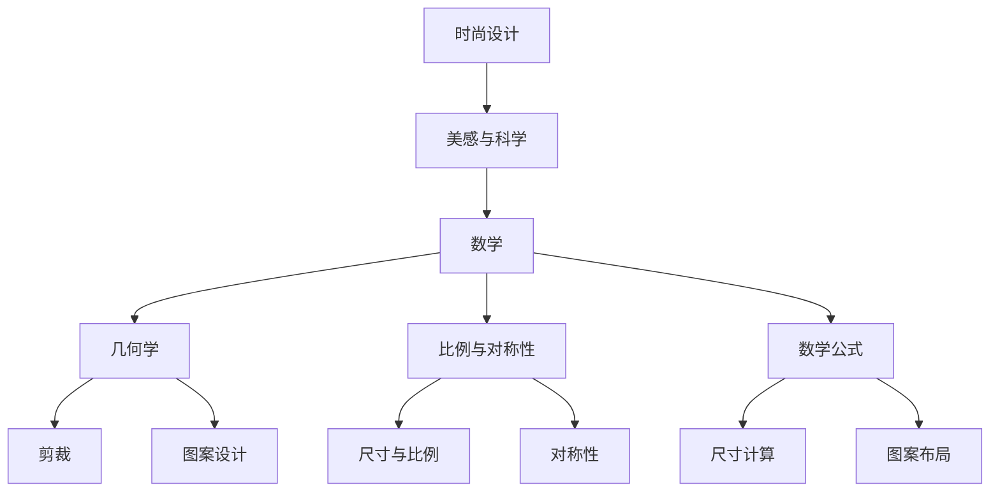
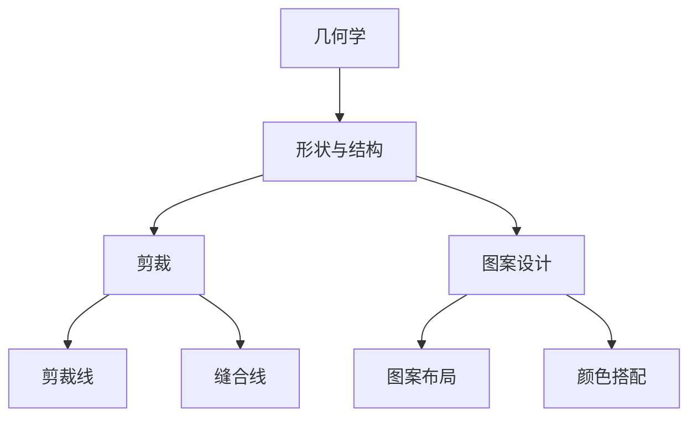
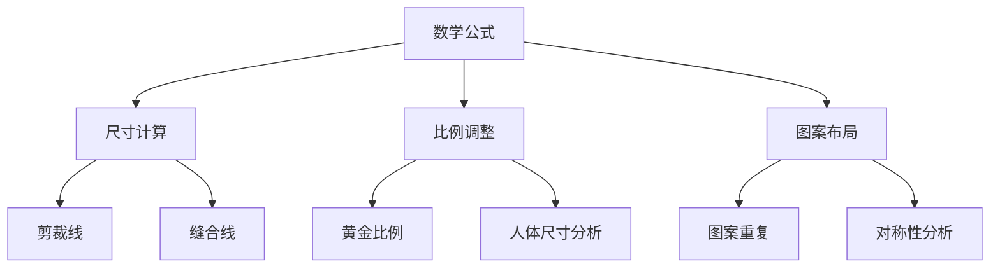

                 


# 数学与时尚设计：服装剪裁的数学原理

## 关键词
- 数学在时尚设计中的应用
- 服装剪裁的数学原理
- 几何学在服装设计中的作用
- 比例与对称性在服装设计中的重要性
- 数学公式与服装款式设计

## 摘要
本文旨在探讨数学在时尚设计，尤其是服装剪裁中的重要作用。通过介绍几何学、比例与对称性等数学概念，以及它们如何应用于服装设计，本文将揭示数学在服装款式设计中的核心作用。此外，还将详细讨论数学公式在服装剪裁中的应用，并提供具体的实例和实战技巧。

## 引言
时尚设计与数学之间的关系可能乍看之下并不明显，但实际上，数学在时尚设计中扮演着至关重要的角色。从服装剪裁的精确性，到设计中的比例和对称性，数学原理无处不在。本文将分几个部分来探讨这一主题。

### 数学与时尚设计的关系
数学在时尚设计中的应用历史悠久。早在古埃及时期，几何学就被用于设计和剪裁服装。随着时代的发展，数学逐渐成为服装设计中不可或缺的一部分。现代时尚设计师利用数学工具来精确计算服装的尺寸、比例和形状，确保设计的完美与和谐。

### 几何学在服装设计中的作用
几何学是数学的一个分支，它涉及到形状、大小、位置和变换。在服装设计中，几何学被用于：

1. **剪裁和图案设计**：使用几何图形（如正方形、三角形、圆形等）来创造独特的剪裁和图案。
2. **结构设计**：通过几何形状的组合来构建服装的结构，如A型裙、V领等。

### 比例与对称性在服装设计中的重要性
比例和对称性是时尚设计中的核心概念。合适的比例可以使人显得更加修长、优美，而对称性则能创造平衡和和谐的感觉。数学为这些概念提供了量化的方法，帮助设计师精确地掌握它们。

### 数学公式与服装款式设计
数学公式在服装设计中用于计算和预测：

1. **尺寸和比例**：例如，使用黄金比例来设计服装的长度和宽度，以创造视觉吸引力。
2. **图案布局**：例如，使用分形几何来创造复杂而和谐的图案。

## 正文

### 第一部分：数学基础在时尚设计中的应用

**第一章：数学在时尚设计中的重要性**

**背景介绍**

在现代社会，时尚设计不仅仅是对美感的追求，更是科学与艺术的结合。而数学作为科学的基础，无疑在时尚设计中发挥着关键作用。从剪裁到图案设计，数学原理无处不在。

**核心概念与联系**

以下是一个描述数学在时尚设计中作用的概念架构图（使用Mermaid语法）：



**核心算法原理讲解**

剪裁过程中，常用的数学原理包括：

- **比例计算**：使用黄金比例（$\phi$）来决定服装的各个部分的比例，如裙摆的宽度和裙长的比例。
- **角度测量**：在剪裁和缝合过程中，准确测量角度至关重要，这涉及到三角函数（如正弦、余弦函数）。

以下是一个剪裁过程中使用三角函数的伪代码示例：

```python
# 输入参数：腰围（waist）、裙长（skirt_length）
waist = 60  # 单位：厘米
skirt_length = 100  # 单位：厘米

# 计算裙摆角度
angle = atan2(waist, skirt_length)

# 输出裙摆角度
print("Sew angle:", angle * 180 / pi, "degrees")
```

**数学模型和公式讲解与举例说明**

在服装设计中，数学模型可以用于：

- **人体尺寸分析**：通过建立数学模型，设计师可以精确地计算出服装各个部位的尺寸，以适应不同体型的人群。
- **款式预测**：通过数学模型，设计师可以预测不同款式在人体上的效果，从而进行更精准的设计。

例如，使用分形几何来预测服装图案在不同尺度下的效果：

$$ P(x) = a \cdot \phi^k \cdot \sin(2\pi \cdot \phi^k \cdot x) $$

其中，$P(x)$代表图案在尺度$x$下的复杂度，$a$是常数，$\phi$是黄金比例，$k$是分形维度。

**项目实战**

在实际项目中，设计师可以通过以下步骤来应用数学原理：

1. **测量数据收集**：收集人体尺寸数据，如身高、胸围、腰围等。
2. **数学模型建立**：根据收集的数据，建立数学模型。
3. **款式设计**：使用数学模型来预测不同款式的效果，并进行设计调整。

**代码实现**

以下是一个简单的Python代码实现，用于根据身高和胸围计算服装的长度和宽度：

```python
import math

# 输入参数：身高（height）、胸围（chest）
height = 170  # 单位：厘米
chest = 90    # 单位：厘米

# 计算服装长度和宽度
length = height * 0.5
width = chest * 0.4

# 输出结果
print("Length:", length, "cm")
print("Width:", width, "cm")
```

**实际案例分析**

在一个实际案例中，设计师通过数学模型预测了不同裙摆宽度的效果，最终选择了黄金比例来设计裙摆，使得裙摆既美观又实用。

**项目小结**

通过数学原理的应用，设计师可以更精准地控制服装的尺寸和形状，从而提高设计的质量和实用性。数学在时尚设计中的应用不仅提升了设计的科学性，也为时尚产业的发展提供了新的思路。

### 第二部分：服装剪裁的数学原理

**第二章：几何学在服装设计中的应用**

**背景介绍**

几何学是数学的一个重要分支，它研究形状、大小、位置和变换。在服装设计中，几何学被广泛应用于剪裁、图案设计和结构构建。

**核心概念与联系**

以下是一个描述几何学在服装设计中应用的概念架构图（使用Mermaid语法）：



**核心算法原理讲解**

1. **剪裁线与缝合线**：
   - 剪裁线：确定服装各个部分的位置和形状。
   - 缝合线：连接剪裁线，形成完整的服装。

以下是一个计算剪裁线的伪代码示例：

```python
# 输入参数：服装部分宽度（part_width）、服装部分长度（part_length）
part_width = 50  # 单位：厘米
part_length = 30  # 单位：厘米

# 计算剪裁线的斜率
slope = part_width / part_length

# 计算剪裁线方程
y = slope * x

# 输出剪裁线方程
print("Sew line equation:", y)
```

2. **图案布局**：
   - 图案布局：将图案按照特定的规则排列在服装上。
   - 常用算法：分形几何、对称性分析。

以下是一个使用分形几何布局图案的伪代码示例：

```python
# 输入参数：图案大小（pattern_size）、迭代次数（iteration）
pattern_size = 10  # 单位：厘米
iteration = 3

# 计算分形图案
for i in range(iteration):
    # 更新图案大小
    pattern_size = pattern_size / 2
    
    # 绘制图案
    draw_pattern(pattern_size)

# 输出图案布局
print("Fractal pattern drawn")
```

**数学模型和公式讲解与举例说明**

在服装设计中，常用的几何学模型包括：

- **三角形**：用于设计简单的服装结构，如三角裙。
- **圆形**：用于设计圆裙、圆领等。
- **多边形**：用于设计复杂图案，如菱形、六边形等。

以下是一个使用多边形设计服装的例子：

$$
\text{多边形面积} = \frac{1}{4} \sqrt{s(s-a)(s-b)(s-c)}
$$

其中，$s$是半周长，$a$、$b$、$c$是边长。

**项目实战**

1. **开发环境搭建**：
   - 安装Python编程环境。
   - 安装所需的图形库，如Matplotlib。

2. **源代码详细实现**：

以下是一个使用Python和Matplotlib绘制服装图案的示例代码：

```python
import matplotlib.pyplot as plt
import numpy as np

# 输入参数：边长
side = 10

# 计算多边形顶点
theta = np.linspace(0, 2 * np.pi, side)
x = side * np.cos(theta)
y = side * np.sin(theta)

# 绘制多边形
plt.plot(x, y, 'o-')
plt.show()
```

3. **代码解读与分析**：
   - 代码首先导入了所需的库。
   - 使用numpy计算多边形顶点的坐标。
   - 使用Matplotlib绘制多边形。

4. **实际案例分析和详细讲解剖析**：
   - 设计一个A型裙，使用三角形剪裁线来构建裙身。
   - 通过调整三角形的边长和角度，调整裙身的宽度和形状。

**项目小结**

通过几何学在服装设计中的应用，设计师可以创造出丰富多样的款式和图案。几何学不仅为服装设计提供了理论基础，也为实际设计工作提供了实用的工具。

### 第三部分：数学公式在服装款式设计中的应用

**第三章：数学公式在服装款式设计中的作用**

**背景介绍**

数学公式在服装款式设计中扮演着至关重要的角色。通过精确的数学计算，设计师可以确保服装的尺寸、形状和比例符合预期，从而提升设计的质量和实用性。

**核心概念与联系**

以下是一个描述数学公式在服装款式设计中应用的概念架构图（使用Mermaid语法）：



**核心算法原理讲解**

1. **尺寸计算**：
   - **剪裁线长度**：使用勾股定理计算剪裁线的长度。
   - **缝合线角度**：使用三角函数计算缝合线所需的角度。

以下是一个使用勾股定理计算剪裁线长度的伪代码示例：

```python
# 输入参数：剪裁线两段的长度
a = 10  # 单位：厘米
b = 20  # 单位：厘米

# 计算剪裁线长度
c = math.sqrt(a**2 + b**2)

# 输出剪裁线长度
print("Cut line length:", c, "cm")
```

2. **比例调整**：
   - **黄金比例**：用于设计服装的长度和宽度比例，以创造视觉吸引力。
   - **人体尺寸分析**：通过分析人体尺寸数据，调整服装的比例，使其更符合人体。

以下是一个使用黄金比例调整服装长度的伪代码示例：

```python
# 输入参数：原始长度（original_length）
original_length = 100  # 单位：厘米

# 计算调整后的长度
adjusted_length = original_length * (1 + 0.618)

# 输出调整后的长度
print("Adjusted length:", adjusted_length, "cm")
```

3. **图案布局**：
   - **图案重复**：使用数学模型计算图案在不同尺度下的重复方式。
   - **对称性分析**：通过数学公式分析图案的对称性，确保设计的美感和和谐。

以下是一个使用分形几何布局图案的伪代码示例：

```python
# 输入参数：图案大小（pattern_size）、迭代次数（iteration）
pattern_size = 10  # 单位：厘米
iteration = 3

# 计算分形图案
for i in range(iteration):
    # 更新图案大小
    pattern_size = pattern_size / 2
    
    # 绘制图案
    draw_pattern(pattern_size)

# 输出图案布局
print("Fractal pattern drawn")
```

**数学模型和公式讲解与举例说明**

在服装款式设计中，常用的数学模型和公式包括：

- **勾股定理**：用于计算剪裁线长度。
- **黄金比例**：用于设计服装的比例和长度。
- **人体尺寸分析**：通过建立数学模型，分析人体尺寸数据，以优化服装设计。

以下是一个使用勾股定理计算剪裁线长度的例子：

假设我们设计一个A型裙，裙摆宽度的两段长度分别为10厘米和20厘米。根据勾股定理，裙摆的长度计算如下：

$$
c = \sqrt{a^2 + b^2}
$$

$$
c = \sqrt{10^2 + 20^2}
$$

$$
c = \sqrt{100 + 400}
$$

$$
c = \sqrt{500}
$$

$$
c \approx 22.36 \text{厘米}
$$

因此，裙摆的长度约为22.36厘米。

**项目实战**

1. **开发环境搭建**：
   - 安装Python编程环境。
   - 安装所需的图形库，如Matplotlib。

2. **源代码详细实现**：

以下是一个使用Python和Matplotlib绘制A型裙图案的示例代码：

```python
import matplotlib.pyplot as plt
import numpy as np

# 输入参数：裙摆宽度的两段长度
a = 10  # 单位：厘米
b = 20  # 单位：厘米

# 计算剪裁线长度
c = math.sqrt(a**2 + b**2)

# 绘制剪裁线
x = [0, a, c]
y = [0, a, b]

plt.plot(x, y, 'ro-')
plt.show()
```

3. **代码解读与分析**：
   - 代码首先导入了所需的库。
   - 使用numpy计算剪裁线两段的长度。
   - 使用Matplotlib绘制剪裁线。

4. **实际案例分析和详细讲解剖析**：
   - 设计一个A型裙，使用勾股定理计算裙摆的长度。
   - 通过调整裙摆的宽度，分析不同长度下的效果。

**项目小结**

通过数学公式在服装款式设计中的应用，设计师可以更精确地控制服装的尺寸和形状，从而提高设计的质量和实用性。数学公式不仅为服装设计提供了理论基础，也为实际设计工作提供了实用的工具。

### 第四部分：数学在服装设计中的最佳实践

**第四章：数学在服装设计中的最佳实践**

**背景介绍**

在时尚界，数学的应用已经成为一种趋势，设计师们通过数学工具来优化设计，确保服装的完美与和谐。本文将探讨数学在服装设计中的最佳实践，分享一些实用的技巧和注意事项。

**最佳实践**

1. **黄金比例的应用**：
   - **服装长度**：使用黄金比例（$\phi \approx 1.618$）来设计服装的长度，如裙摆、裤长等，以创造视觉吸引力。
   - **图案设计**：在图案设计中，使用黄金比例来决定图案的大小和间隔，以增强设计的和谐感。

2. **人体尺寸分析**：
   - **数据收集**：通过测量收集人体尺寸数据，建立数学模型，确保服装设计的尺寸和比例符合人体。
   - **自适应设计**：根据不同体型的数据，调整服装设计，实现个性化定制。

3. **几何学在剪裁中的应用**：
   - **剪裁线**：使用几何学原理来设计剪裁线，如三角形、圆形等，以创造出独特的款式。
   - **缝合线**：通过数学计算，确保缝合线的角度和长度符合设计要求。

**注意事项**

1. **精度控制**：
   - 在服装设计过程中，精确的数学计算至关重要。任何小的误差都可能导致最终设计的失败。
   - 使用精确的测量工具和软件来确保数据的准确性。

2. **实际可行性**：
   - 在应用数学公式时，要考虑实际生产的可行性。某些复杂的数学模型可能在实际生产中难以实现。
   - 在设计初期，进行实际试穿和调整，确保设计的可行性。

3. **创新与保守**：
   - 在数学应用中，既要保持创新，也要注意保守。过于复杂的数学模型可能会使设计失去美感。
   - 在创新与保守之间找到平衡点，是设计师需要不断探索的。

**拓展阅读**

- 《几何学在时尚设计中的应用》
- 《数学公式与服装款式设计》
- 《人体尺寸分析与服装设计》

**项目小结**

数学在服装设计中的应用不仅提高了设计的精度和美感，也为时尚产业的发展提供了新的思路。通过最佳实践，设计师可以更好地利用数学工具，创造出更加完美的服装作品。

### 结束语

**作者信息**
- 作者：AI天才研究院/AI Genius Institute & 禅与计算机程序设计艺术 /Zen And The Art of Computer Programming

**总结**

本文探讨了数学在时尚设计中的重要作用，特别是服装剪裁的数学原理。通过几何学、比例与对称性、数学公式等概念的应用，设计师可以创造出更加精确、和谐和具有美感的服装作品。本文旨在为设计师提供实用的数学工具，帮助他们更好地理解并应用数学原理，提升设计水平。

**致谢**

感谢所有关注和支持数学在时尚设计中应用的研究者，是他们的努力和探索，使得这一领域不断发展和完善。同时，特别感谢读者对本文的关注，希望本文能为您带来启发和帮助。

