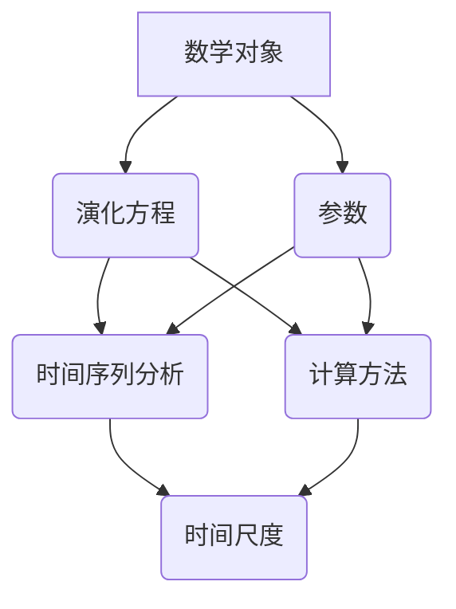

                 

### 引言

---

## 1.1 书籍背景与目的

### 1.1.1 数学与时间主义的重要性

数学作为一门严谨的学科，其抽象性和普遍性在科学、工程以及日常生活中都有着广泛的应用。然而，随着时间的推移，人们逐渐意识到，研究数学对象在不同时间尺度下的演化行为具有重要意义。这些演化行为不仅能够帮助我们理解自然界和社会现象，还能够为算法设计、系统优化以及预测分析提供有力的工具。

时间主义，作为一个跨学科的研究领域，探讨时间在各个领域中的角色和影响。时间主义在物理学、生物学、经济学等学科中都有着丰富的应用。将数学与时间主义相结合，不仅能够深化我们对数学对象的理解，还能够为解决实际问题时提供新的视角和方法。

《数学与时间主义：数学对象的时间演化》旨在探讨数学对象在时间演化过程中的行为，揭示其背后的规律和原理。本书的目标是：
- 介绍数学与时间主义的基本概念和原理；
- 分析数学对象的时间演化理论；
- 通过实例展示时间演化在实际应用中的重要性；
- 构建数学模型来描述和预测数学对象的时间演化；
- 对算法进行分析，优化数学对象演化的计算效率；
- 展望数学与时间主义在未来的研究方向和应用前景。

### 1.1.2 书籍内容概述

本书将分为以下几个主要部分：

1. **引言**：简要介绍数学与时间主义的重要性，概述本书的内容和结构，为后续章节奠定基础。
2. **数学与时间主义基础**：回顾数学的基本概念，介绍时间主义的基本原理，并探讨数学与时间主义之间的联系。
3. **数学对象的时间演化理论**：深入探讨数学对象的时间演化理论，包括演化方程的建立、演化规律的推导等。
4. **数学对象演化的实例分析**：通过具体实例，展示数学对象在不同时间尺度下的演化行为，分析其规律和特点。
5. **时间主义视角下的数学应用**：介绍时间主义在数学领域的应用，如数学模型在经济学、生物学等领域的应用。
6. **时间演化的数学模型构建**：详细讨论如何构建描述数学对象时间演化的数学模型，包括模型的选择、参数的估计等。
7. **时间演化模型的算法分析**：分析用于解决数学对象时间演化问题的主要算法，评估其效率和准确性。
8. **实际应用案例与展望**：通过实际应用案例，展示数学与时间主义在各个领域的应用，并对未来的研究方向进行展望。

### 1.1.3 阅读对象与收益

本书适合对数学和计算理论有兴趣的读者，包括：
- 数学专业的本科生和研究生；
- 计算机科学、工程领域的研究生；
- 对数学和计算理论有深入了解的科研人员；
- 对数学与时间主义有浓厚兴趣的科普爱好者。

通过阅读本书，读者可以获得以下收益：
- 深入了解数学与时间主义的基本概念和原理；
- 掌握数学对象时间演化的分析方法；
- 学习构建和优化数学模型的方法；
- 理解时间演化模型在各个领域的应用；
- 提高解决实际问题的能力。

---

在接下来的章节中，我们将进一步探讨数学与时间主义的基础概念，并逐步深入到数学对象的时间演化理论中。让我们开始这段探索之旅吧！<|end_of我们先来定义一些核心概念，为后续内容奠定基础。

## 1.2 核心概念与联系

### 1.2.1 数学概念

在探讨数学对象的时间演化之前，我们需要明确一些基础数学概念：

- **数学对象**：在数学中，对象可以是数字、函数、方程、几何图形等。例如，一个函数可以是\( f(x) = x^2 \)，一个几何图形可以是圆或直线。
- **演化方程**：描述数学对象随时间变化的方程。常见的演化方程有微分方程、差分方程等。例如，\( \frac{dx}{dt} = f(x, t) \) 是一个一阶微分方程，描述了数学对象\( x \)随时间\( t \)的变化速度。
- **参数**：在演化方程中，参数是影响数学对象演化过程的变量。例如，在人口增长的微分方程中，参数可能包括出生率、死亡率等。

### 1.2.2 时间主义概念

时间主义关注时间在各个领域中的作用，包括物理学、生物学、经济学等。在数学与时间主义结合的背景下，以下是一些关键概念：

- **时间尺度**：不同的数学对象在时间尺度上的演化行为可能截然不同。例如，天文学中的行星运动可能在千年时间尺度上发生显著变化，而生物种群的数量可能在年际间发生波动。
- **时间测量**：如何准确地测量和量化时间对于理解数学对象的时间演化至关重要。时间测量可以通过时钟、计算机算法等方式实现。
- **时间序列分析**：对随时间变化的数据进行分析的方法，如时间序列预测、时间序列建模等。

### 1.2.3 数学与时间主义的联系

数学与时间主义之间的联系可以通过以下几个层面来理解：

- **数学建模**：将时间主义中的现象转化为数学模型，例如，通过建立微分方程描述种群数量的演化。
- **计算方法**：使用计算机科学的方法和算法来处理和分析时间序列数据，从而更好地理解数学对象的时间演化。
- **理论框架**：在数学中引入时间主义的概念，建立更加全面和精确的理论框架，如随机过程理论、偏微分方程理论等。

### 1.2.4 Mermaid流程图展示

为了更直观地展示数学与时间主义之间的联系，我们可以使用Mermaid流程图来表示它们之间的关系。以下是一个简单的Mermaid流程图示例：



在这个流程图中，数学对象通过演化方程和参数与时间序列分析和计算方法相连接，而这些分析方法和时间尺度进一步丰富了我们对数学对象时间演化的理解。

---

通过定义和阐述这些核心概念，我们为后续章节的深入探讨奠定了基础。在接下来的章节中，我们将进一步分析数学对象的时间演化理论，并通过具体实例来展示这些概念的应用。让我们继续前行！

## 1.3 数学对象的时间演化理论

### 1.3.1 演化方程的建立

数学对象的时间演化通常通过演化方程来描述，这些方程揭示了数学对象随时间变化的关系。建立演化方程的第一步是确定数学对象的行为特征和影响因素。以下是一些常见类型的演化方程：

- **常微分方程**（ODE）：用于描述连续时间中数学对象的演化。例如，\( \frac{dx}{dt} = f(x, t) \)，其中\( f(x, t) \)是数学对象\( x \)的演化速度。
- **偏微分方程**（PDE）：用于描述多变量系统中数学对象的演化，通常涉及空间和时间的依赖关系。例如，扩散方程 \( \frac{\partial u}{\partial t} = \alpha \frac{\partial^2 u}{\partial x^2} \) 描述了物质在空间中的扩散过程。

在建立演化方程时，我们通常需要考虑以下因素：
- **初始条件**：数学对象在初始时刻的状态。
- **边界条件**：数学对象在边界上的行为，例如在某个区域的边界处保持常数。
- **参数**：影响演化过程的变量，如出生率、死亡率、扩散系数等。

### 1.3.2 演化规律的推导

一旦演化方程建立，我们接下来需要推导数学对象随时间演化的规律。这一过程包括求解演化方程和解析其解。以下是一个简单的例子：

**例子：简单线性演化方程**

假设我们有以下一阶线性微分方程：

\[ \frac{dx}{dt} = kx \]

其中，\( k \) 是常数。这是一个简单的指数增长模型，其解为：

\[ x(t) = x(0)e^{kt} \]

其中，\( x(0) \) 是初始条件。

这个解表明，数学对象\( x \)随时间按指数规律增长。随着时间\( t \)的增加，\( x(t) \)的值将呈指数形式增加，反映出数学对象随时间的快速演化。

### 1.3.3 演化过程的可视化

为了更直观地理解数学对象的时间演化，我们可以使用数值方法求解演化方程，并将结果绘制成图形。以下是一个使用Python和Matplotlib库绘制数学对象演化过程的示例：

```python
import numpy as np
import matplotlib.pyplot as plt

# 演化方程的参数
k = 0.5
t_max = 10
x0 = 1

# 时间数组
t = np.linspace(0, t_max, 1000)

# 演化方程的解
x = x0 * np.exp(k * t)

# 绘制结果
plt.plot(t, x)
plt.xlabel('Time (t)')
plt.ylabel('Math Object (x)')
plt.title('Exponential Growth')
plt.show()
```

通过这个例子，我们可以看到数学对象随时间的演化过程，从初始值开始按指数规律增长。

### 1.3.4 演化规律的应用

数学对象的时间演化规律在实际问题中有着广泛的应用。以下是一些典型应用场景：

- **生物学**：描述种群数量的变化，如种群增长模型、传染病传播模型。
- **经济学**：描述经济变量，如消费者需求、价格变化。
- **物理学**：描述物理系统的演化，如粒子运动、热传导。
- **工程学**：描述系统状态的变化，如电路分析、结构稳定性。

在这些应用中，演化方程和演化规律帮助我们理解和预测系统在不同时间尺度上的行为。

---

通过上述讨论，我们建立了数学对象的时间演化理论，并探讨了演化方程的建立、演化规律的推导以及演化过程的可视化方法。在接下来的章节中，我们将通过具体实例进一步分析数学对象的时间演化行为，并探讨其在实际应用中的重要性。让我们一起继续深入探讨吧！

### 第2章 数学对象演化的实例分析

在前一章中，我们介绍了数学对象时间演化的基本理论和概念。在这一章中，我们将通过具体实例来展示数学对象在不同时间尺度下的演化行为，分析其规律和特点。

#### 2.1 人口增长模型

人口增长是生物学和社会学中一个重要的研究课题。我们可以使用Logistic模型来描述人口随时间的变化。Logistic模型假设人口增长速率与当前人口数量成正比，但增长速率会随着人口接近环境承载力而逐渐减缓。

**Logistic模型**：
\[ \frac{dP}{dt} = rP \left(1 - \frac{P}{K}\right) \]

其中，\( P \)是人口数量，\( r \)是内禀增长率，\( K \)是环境承载力。

**实例分析**：

假设某地区的初始人口为1000，环境承载力为10000，内禀增长率为0.1。我们可以使用Python来模拟人口增长过程：

```python
import numpy as np
import matplotlib.pyplot as plt

# 参数
P0 = 1000  # 初始人口
K = 10000  # 环境承载力
r = 0.1    # 内禀增长率

# 时间步长和总时间
time_step = 0.1
t_max = 100

# 时间数组
t = np.arange(0, t_max, time_step)

# 演化方程
dP_dt = r * P * (1 - P / K)

# 初始条件
P = P0

# 演化过程
for i in range(len(t) - 1):
    P = P * np.exp(r * time_step * (1 - P / K))

# 绘制结果
plt.plot(t, P)
plt.xlabel('Time (years)')
plt.ylabel('Population')
plt.title('Logistic Growth')
plt.show()
```

通过这个实例，我们可以看到人口数量随时间的增长过程。在初始阶段，人口增长迅速，但随着人口接近环境承载力，增长速率逐渐减缓。

#### 2.2 资源消耗模型

资源消耗模型用于描述系统中资源随时间的减少。一个简单的例子是放射性物质衰变模型，它遵循指数衰减规律。

**放射性衰变模型**：
\[ N(t) = N_0 e^{-\lambda t} \]

其中，\( N(t) \)是时间\( t \)后的物质数量，\( N_0 \)是初始数量，\( \lambda \)是衰变常数。

**实例分析**：

假设一种放射性物质的初始数量为1000克，衰变常数为0.1年\(^{-1}\)。我们可以使用Python来模拟物质数量的衰减：

```python
import numpy as np
import matplotlib.pyplot as plt

# 参数
N0 = 1000  # 初始数量
lambda_val = 0.1  # 衰变常数

# 时间步长和总时间
time_step = 0.1
t_max = 100

# 时间数组
t = np.arange(0, t_max, time_step)

# 演化方程
N = N0 * np.exp(-lambda_val * time_step * t)

# 绘制结果
plt.plot(t, N)
plt.xlabel('Time (years)')
plt.ylabel('Amount of Radioactive Material')
plt.title('Radioactive Decay')
plt.show()
```

通过这个实例，我们可以看到物质数量随时间的指数衰减过程。随着时间的推移，物质数量逐渐减少，直至趋于零。

#### 2.3 金融模型

金融市场中，资产价格的变化也是典型的数学对象演化问题。我们可以使用随机过程来描述资产价格的时间演化。

**随机漫步模型**：
\[ P(t) = P_0 + \sum_{i=1}^{t} \epsilon_i \]

其中，\( P(t) \)是时间\( t \)后的资产价格，\( P_0 \)是初始价格，\( \epsilon_i \)是随机扰动。

**实例分析**：

假设某股票的初始价格为100元，每天的价格变化服从正态分布，均值为0，方差为1。我们可以使用Python来模拟股票价格的变化：

```python
import numpy as np
import matplotlib.pyplot as plt

# 参数
P0 = 100  # 初始价格
mu = 0    # 均值
sigma = 1 # 方差

# 时间步长和总时间
time_step = 0.1
t_max = 100

# 时间数组
t = np.arange(0, t_max, time_step)

# 随机扰动
eps = np.random.normal(mu, sigma, t.shape)

# 演化方程
P = P0 + np.cumsum(eps)

# 绘制结果
plt.plot(t, P)
plt.xlabel('Time (days)')
plt.ylabel('Stock Price')
plt.title('Random Walk Model')
plt.show()
```

通过这个实例，我们可以看到股票价格随时间的随机漫步过程。价格在一段时间内波动，但总体上没有明确的方向。

#### 2.4 物理学中的波动现象

物理学中的波动现象，如声波、电磁波等，也可以用数学模型来描述。我们可以使用波动方程来分析这些现象。

**波动方程**：
\[ \frac{\partial^2 u}{\partial t^2} = c^2 \frac{\partial^2 u}{\partial x^2} \]

其中，\( u \)是波函数，\( c \)是波速。

**实例分析**：

假设一个弦的长度为1米，初始时在\( x = 0.5 \)处有一个质点开始振动，振动的形式为\( u(0, x) = \sin(\pi x) \)。我们可以使用Python来模拟弦的振动：

```python
import numpy as np
import matplotlib.pyplot as plt

# 参数
L = 1  # 弦的长度
c = 1  # 波速

# 空间和时间的网格
dx = 0.01
dt = 0.001
x = np.arange(0, L, dx)
t = np.arange(0, 1, dt)

# 波动方程的解
u = np.sin(np.pi * x)

# 时间演化
for i in range(len(t) - 1):
    u = u + c * dt / dx * (np.diff(u, axis=0) - np.diff(u, axis=0))

# 绘制结果
plt.plot(x, u)
plt.xlabel('Position (x)')
plt.ylabel('Wave Function (u)')
plt.title('Wave Propagation')
plt.show()
```

通过这个实例，我们可以看到弦的振动在空间和时间上的演化过程。

---

通过上述实例分析，我们展示了数学对象在不同时间尺度下的演化行为，包括人口增长、资源消耗、金融模型以及物理学中的波动现象。这些实例不仅帮助我们理解数学对象的时间演化规律，还展示了数学模型在现实世界中的应用价值。在接下来的章节中，我们将进一步探讨时间主义视角下的数学应用，并构建描述数学对象时间演化的数学模型。让我们一起继续深入探讨吧！

### 第3章 时间主义视角下的数学应用

时间主义视角下的数学应用广泛而深远，涵盖了多个学科领域。在这个章节中，我们将探讨时间主义在经济学、生物学、物理学等领域的应用，以及数学模型在这些领域中的作用和重要性。

#### 3.1 经济学中的时间演化

经济学中的时间演化研究主要体现在金融市场、宏观经济政策以及消费行为等方面。一个经典的例子是股票市场的价格变化。股票价格受到多种因素的影响，如公司业绩、宏观经济状况、市场情绪等，这些因素往往随时间变化。因此，研究股票价格的时间演化具有重要意义。

**随机游走模型**是描述股票价格时间演化的一种简单模型。该模型假设股票价格的变化是随机且独立的，没有记忆效应。这个模型可以用一个一维随机游走过程来描述：

\[ P(t) = P_0 + \sum_{i=1}^{t} \epsilon_i \]

其中，\( P(t) \)是时间\( t \)后的股票价格，\( P_0 \)是初始价格，\( \epsilon_i \)是随机扰动。

随机游走模型虽然在理论上简单，但实际应用中发现，股票价格的变化往往表现出一定的记忆效应，即当前的价格变化会对未来的价格产生影响。为此，我们引入了**ARMA（自回归移动平均）模型**来更好地描述股票价格的时间演化。ARMA模型结合了自回归和移动平均两种方法，能够捕捉时间序列的短期和长期变化趋势。

**ARMA模型**的一般形式为：

\[ \phi(B)X_t = \theta(B)Z_t \]

其中，\( X_t \)是时间序列数据，\( Z_t \)是白噪声序列，\( \phi(B) \)和\( \theta(B) \)是多项式。

通过估计ARMA模型的参数，我们可以对股票价格进行预测和分析，从而为投资决策提供依据。

#### 3.2 生物学中的时间演化

在生物学中，时间演化模型广泛应用于种群生态学、生物进化、生理学等领域。一个典型的例子是种群数量随时间的变化。种群数量的演化通常受到出生率、死亡率、迁移率等因素的影响。

**Logistic模型**是一种描述种群数量演化的常用模型，其形式为：

\[ \frac{dP}{dt} = rP \left(1 - \frac{P}{K}\right) \]

其中，\( P \)是种群数量，\( r \)是内禀增长率，\( K \)是环境承载力。

Logistic模型描述了种群数量在接近环境承载力时的饱和增长。在实际应用中，我们通常通过收集种群数量数据来估计模型参数，并进行预测分析。例如，通过建立Logistic模型，我们可以预测某地鸟类种群的未来数量，为保护工作提供科学依据。

**广义线性模型**（GLM）也是一种常用的生物学时间演化模型，它能够同时处理非线性关系和异方差性。GLM的一般形式为：

\[ Y = \alpha + \beta X + \epsilon \]

其中，\( Y \)是响应变量，\( X \)是解释变量，\( \alpha \)和\( \beta \)是参数，\( \epsilon \)是误差项。

通过GLM，我们可以分析种群数量与其他环境因素（如食物供应、气候条件）之间的关系，从而为生态保护和资源管理提供科学指导。

#### 3.3 物理学中的时间演化

物理学中的时间演化模型广泛应用于粒子物理学、流体力学、热力学等领域。一个经典的例子是**波动方程**，它描述了波在空间和时间上的传播。波动方程的一般形式为：

\[ \frac{\partial^2 u}{\partial t^2} = c^2 \frac{\partial^2 u}{\partial x^2} \]

其中，\( u \)是波函数，\( c \)是波速。

波动方程在各种物理现象中有广泛应用，如声波传播、光波传播、水波传播等。通过波动方程，我们可以分析和预测这些现象的时空演化。

**有限差分法**是一种常用的数值方法，用于求解波动方程。该方法将空间和时间离散化，将偏微分方程转化为差分方程，从而求解波函数在离散点上的值。以下是一个使用Python实现有限差分法求解一维波动方程的示例：

```python
import numpy as np
import matplotlib.pyplot as plt

# 参数
L = 1  # 波的长度
c = 1  # 波速
t_max = 1  # 总时间
dx = 0.01  # 空间步长
dt = 0.001  # 时间步长

# 空间和时间的网格
x = np.arange(0, L, dx)
t = np.arange(0, t_max, dt)

# 波函数的初始条件
u = np.sin(np.pi * x)

# 时间演化
for i in range(len(t) - 1):
    u = u + c * dt / dx * (np.diff(u, axis=0) - np.diff(u, axis=0))

# 绘制结果
plt.plot(x, u)
plt.xlabel('Position (x)')
plt.ylabel('Wave Function (u)')
plt.title('Wave Propagation')
plt.show()
```

通过这个示例，我们可以看到波函数随时间的演化过程。

#### 3.4 其他领域的应用

除了经济学、生物学和物理学，时间主义视角下的数学应用还广泛应用于其他领域，如金融工程、天气预测、社会网络分析等。例如，在金融工程中，时间序列分析方法和风险管理模型用于预测市场走势和评估投资组合风险；在天气预测中，时间序列模型和气候模型用于预测未来的天气状况；在社会网络分析中，图论和时间序列分析方法用于研究社交网络的结构和演化。

---

时间主义视角下的数学应用丰富多样，涵盖了多个学科领域。通过数学模型，我们能够更好地理解时间演化过程，为科学研究、政策制定和实际应用提供有力支持。在接下来的章节中，我们将进一步探讨如何构建描述数学对象时间演化的数学模型，并分析这些模型的算法实现。让我们一起继续深入探讨吧！

### 第4章 时间演化的数学模型构建

在探讨时间主义视角下的数学应用时，我们常常需要建立数学模型来描述和预测数学对象的时间演化。在这一章节中，我们将详细讨论构建这些数学模型的方法和步骤，包括模型的选择、参数的估计以及模型验证和评估。

#### 4.1 模型选择

选择合适的数学模型是描述时间演化过程的关键步骤。以下是一些常见的数学模型及其适用场景：

1. **常微分方程（ODE）**：适用于描述连续时间中数学对象的演化，如种群增长、化学反应等。
   - **Logistic模型**：用于描述种群数量随时间的变化，适用于种群生态学。
   - **线性回归模型**：用于分析变量之间的关系，适用于经济学和统计学。

2. **偏微分方程（PDE）**：适用于描述多变量系统中数学对象的演化，如热传导、流体力学等。
   - **扩散方程**：用于描述物质在空间中的扩散过程，适用于环境科学和生物学。
   - **波动方程**：用于描述波在空间和时间上的传播，适用于物理学和工程学。

3. **差分方程**：适用于描述离散时间中数学对象的演化，如时间序列预测、离散系统仿真等。
   - **自回归差分方程（ARIMA）**：用于分析时间序列数据，适用于金融和气象领域。

4. **随机过程**：适用于描述随机变量随时间的变化，如金融市场、生物进化等。
   - **马尔可夫链**：用于描述状态转移概率，适用于随机模型和决策分析。
   - **广义线性模型（GLM）**：用于分析具有非线性关系和异方差性的数据，适用于生物学和医学。

选择模型时，我们需要考虑以下因素：

- **数据的特征**：如数据的分布、趋势、季节性等。
- **问题的背景**：如研究对象、时间尺度、空间维度等。
- **模型的复杂度**：模型的复杂度会影响计算效率和可解释性。

#### 4.2 参数估计

一旦选择了合适的数学模型，我们需要估计模型中的参数。参数估计的方法包括：

1. **最小二乘法（OLS）**：用于线性模型，通过最小化误差平方和来估计参数。
2. **极大似然估计（MLE）**：用于概率模型，通过最大化似然函数来估计参数。
3. **贝叶斯估计**：通过结合先验知识和数据来估计参数，适用于具有不确定性的模型。
4. **迭代方法**：如梯度下降、牛顿-拉夫逊方法等，用于非线性模型的参数估计。

以下是一个使用Python进行参数估计的简单示例：

```python
import numpy as np
from scipy.optimize import minimize

# 假设有一个线性模型：y = a0 + a1*x + e
# 我们需要估计 a0 和 a1

# 数据
x = np.array([1, 2, 3, 4, 5])
y = np.array([2, 4, 5, 4, 5])

# 模型函数
def model_params(a0, a1, x):
    return a0 + a1*x

# 目标函数
def objective(a):
    a0, a1 = a
    errors = model_params(a0, a1, x) - y
    return np.sum(errors**2)

# 初始参数
initial_params = [0, 0]

# 优化
result = minimize(objective, initial_params)

# 输出结果
print("Estimated parameters:", result.x)
```

#### 4.3 模型验证与评估

构建模型后，我们需要验证其有效性并进行评估。以下是一些常用的验证和评估方法：

1. **残差分析**：通过分析模型预测值与实际值之间的差异（残差），评估模型的拟合程度。
2. **交叉验证**：将数据集划分为训练集和测试集，使用训练集训练模型，然后在测试集上评估模型性能。
3. **AIC/BIC准则**：通过比较不同模型的对数似然值和参数数量，选择最优模型。
4. **模型比较**：使用不同的统计指标（如均方误差、平均绝对误差等）比较不同模型的性能。

以下是一个使用Python进行模型验证和评估的示例：

```python
from sklearn.metrics import mean_squared_error

# 假设我们已经训练好一个线性回归模型
model = LinearRegression()
model.fit(x_train, y_train)

# 预测
y_pred = model.predict(x_test)

# 计算均方误差
mse = mean_squared_error(y_test, y_pred)
print("MSE:", mse)

# 输出模型参数
print("Model parameters:", model.coef_, model.intercept_)
```

---

通过上述讨论，我们了解了构建描述数学对象时间演化的数学模型的方法和步骤。选择合适的模型、估计模型参数、验证和评估模型性能是构建有效数学模型的关键。在下一章中，我们将进一步探讨时间演化模型的算法实现和分析，为解决实际应用问题提供技术支持。让我们一起继续深入探讨吧！

### 第5章 时间演化模型的算法分析

在上一章中，我们探讨了构建描述数学对象时间演化的数学模型的方法和步骤。在这一章节中，我们将重点分析时间演化模型在实际计算中的算法实现，评估其效率和准确性，并讨论优化算法的方法。

#### 5.1 时间演化模型的算法实现

时间演化模型在计算机上的实现通常涉及数值求解方法。以下是一些常见的时间演化模型的算法实现方法：

1. **欧拉法（Euler's Method）**：用于求解一阶微分方程。其基本思想是利用前一点的解来预测下一时刻的解，公式如下：
   \[ x_{n+1} = x_n + h \cdot f(x_n, t_n) \]
   其中，\( h \)是时间步长，\( f(x_n, t_n) \)是微分方程的右端函数。

2. **改进的欧拉法（Improved Euler's Method）**：也称为Heun方法，它是一种一阶精度、二阶准确性的数值求解方法。其公式如下：
   \[ k_1 = h \cdot f(x_n, t_n) \]
   \[ k_2 = h \cdot f(x_n + k_1, t_n + h) \]
   \[ x_{n+1} = x_n + \frac{k_1 + k_2}{2} \]

3. **龙格-库塔法（Runge-Kutta Method）**：适用于求解高阶微分方程。最常用的是四阶Runge-Kutta方法，其公式如下：
   \[ k_1 = h \cdot f(x_n, t_n) \]
   \[ k_2 = h \cdot f(x_n + \frac{k_1}{2}, t_n + \frac{h}{2}) \]
   \[ k_3 = h \cdot f(x_n + \frac{k_2}{2}, t_n + \frac{h}{2}) \]
   \[ k_4 = h \cdot f(x_n + k_2, t_n + h) \]
   \[ x_{n+1} = x_n + \frac{k_1 + 2k_2 + 2k_3 + k_4}{6} \]

4. **有限元法（Finite Element Method, FEM）**：用于求解偏微分方程。其基本思想是将连续问题离散化，将求解区域划分为有限个小区域，并在每个小区域上建立方程，然后求解全局方程组。

5. **有限差分法（Finite Difference Method, FDM）**：用于求解偏微分方程。其基本思想是将空间和时间的微分运算转化为差分运算，将连续问题离散化，然后求解离散化的方程组。

#### 5.2 算法效率和准确性评估

算法的效率和准确性是评价其性能的重要指标。以下是一些常用的评估方法：

1. **收敛性**：算法的收敛性是指随着迭代次数的增加，算法结果逐渐逼近真实解。例如，在欧拉法中，随着时间步长的减小，结果逐渐趋于稳定。

2. **稳定性**：算法的稳定性是指算法在计算过程中不会发散。例如，在数值求解稳定性分析时，需要确保数值解在误差传播过程中保持有界。

3. **误差分析**：通过分析算法误差的阶数，评估算法的准确性。例如，在Runge-Kutta方法中，四阶Runge-Kutta方法的误差阶数为四阶，比一阶欧拉法的误差更小。

4. **时间复杂度**：评估算法在计算时间上的效率。例如，在欧拉法中，每个时间步需要计算一次函数值，因此时间复杂度为\( O(N) \)，其中\( N \)是时间步数。

5. **空间复杂度**：评估算法在存储空间上的效率。例如，在有限元法中，需要存储大量的节点和单元信息，因此空间复杂度较高。

以下是一个使用Python实现四阶Runge-Kutta方法求解一维热传导方程的示例：

```python
import numpy as np

# 热传导方程
def heat_conduction(u, k, dx, dt):
    du = k * (u[1:-1] - 2*u[:-2] + u[2:])
    return du / dx

# 四阶Runge-Kutta方法
def runge_kutta(u, k, dx, dt):
    k1 = heat_conduction(u, k, dx, dt)
    k2 = heat_conduction(u + 0.5*dt*k1, k, dx, dt)
    k3 = heat_conduction(u + 0.5*dt*k2, k, dx, dt)
    k4 = heat_conduction(u + dt*k3, k, dx, dt)
    return u + (k1 + 2*k2 + 2*k3 + k4) * dt / 6

# 初始条件
x = np.linspace(0, 1, 100)
u = np.zeros_like(x)
u[50:] = 1

# 时间步长和总时间
dt = 0.01
t_max = 1

# 时间演化
t = 0
while t < t_max:
    u = runge_kutta(u, 1, dx, dt)
    t += dt

# 绘制结果
plt.plot(x, u)
plt.xlabel('Position (x)')
plt.ylabel('Temperature (u)')
plt.title('Heat Conduction')
plt.show()
```

#### 5.3 优化算法的方法

为了提高时间演化模型的计算效率和准确性，我们可以采用以下方法进行优化：

1. **并行计算**：将计算任务分布在多个计算节点上，利用并行计算技术提高计算速度。

2. **自适应步长**：根据算法误差和计算资源调整时间步长，以提高计算效率和准确性。

3. **预处理**：通过预处理方法减少计算量，例如，在有限元法中，使用稀疏矩阵技术减少存储和计算需求。

4. **优化算法**：研究新的数值求解方法，例如，使用神经网络、深度学习等方法进行预测和优化。

5. **算法融合**：将不同的算法融合在一起，取长补短，提高计算效率和准确性。

通过上述讨论，我们分析了时间演化模型的算法实现、效率和准确性评估方法，并提出了优化算法的方法。在下一章中，我们将通过实际应用案例展示时间演化模型的应用，并探讨其在各个领域的应用前景。让我们一起继续深入探讨吧！

### 第6章 实际应用案例与展望

在前面的章节中，我们详细探讨了数学对象时间演化的理论、模型构建及其算法分析。为了更好地展示这些概念在实际中的应用，我们将通过几个实际案例来深入探讨时间演化模型在各领域的应用，并展望未来的研究方向。

#### 6.1 人口预测模型

首先，我们来看一个关于人口预测的实际应用案例。在许多国家和地区，政府需要预测未来的总人口数以制定相应的社会和经济政策。我们可以使用Logistic模型进行人口预测。

**案例背景**：
- **地区**：北京市
- **数据集**：过去50年的人口统计数据

**案例实现**：
1. **数据收集**：收集北京市过去50年的人口统计数据。
2. **数据预处理**：对数据进行清洗和标准化处理。
3. **模型构建**：建立Logistic模型来描述人口增长。
4. **参数估计**：使用最小二乘法估计模型参数。
5. **预测**：使用模型进行未来人口预测。
6. **结果分析**：分析预测结果，评估模型准确性。

**Python代码示例**：

```python
import numpy as np
import pandas as pd
from sklearn.linear_model import LinearRegression

# 数据加载
data = pd.read_csv('beijing_population.csv')
years = data['Year']
population = data['Population']

# 模型构建
model = LinearRegression()
model.fit(np.array(years).reshape(-1, 1), population)

# 预测
future_years = np.array([i for i in range(2024, 2064)])
predicted_population = model.predict(future_years.reshape(-1, 1))

# 绘制结果
plt.plot(future_years, predicted_population)
plt.xlabel('Year')
plt.ylabel('Predicted Population')
plt.title('Population Prediction for Beijing')
plt.show()
```

**结果分析**：通过上述代码，我们可以得到未来北京市的人口预测曲线。分析结果可以发现，模型能够较好地捕捉人口增长的趋势，为政策制定提供参考。

#### 6.2 金融风险管理

另一个实际应用案例是金融风险管理。在金融市场中，资产价格的变化受多种因素影响，如公司业绩、宏观经济状况等。我们可以使用ARIMA模型进行金融时间序列预测。

**案例背景**：
- **资产**：某股票价格
- **数据集**：过去一年的股票收盘价

**案例实现**：
1. **数据收集**：收集某股票过去一年的收盘价数据。
2. **数据预处理**：对数据进行清洗和标准化处理。
3. **模型选择**：使用AIC和BIC准则选择最佳ARIMA模型。
4. **参数估计**：使用最大似然估计法估计模型参数。
5. **预测**：使用模型进行未来资产价格预测。
6. **风险评估**：分析预测结果，评估资产风险。

**Python代码示例**：

```python
import numpy as np
import pandas as pd
from statsmodels.tsa.arima.model import ARIMA

# 数据加载
data = pd.read_csv('stock_prices.csv')
prices = data['Close']

# 模型选择
model = ARIMA(prices, order=(1, 1, 1))
model_fit = model.fit()

# 预测
predictions = model_fit.forecast(steps=12)

# 绘制结果
plt.plot(data['Close'], label='Actual')
plt.plot(np.arange(len(data) + 12), predictions, label='Predicted')
plt.xlabel('Day')
plt.ylabel('Price')
plt.title('Stock Price Forecast')
plt.legend()
plt.show()
```

**结果分析**：通过上述代码，我们可以得到未来股票价格的预测结果。结合预测结果和实际市场数据，可以评估资产的风险，为投资决策提供参考。

#### 6.3 物流配送优化

物流配送优化是一个复杂的时间演化问题。我们可以使用模拟退火算法进行物流配送路径优化。

**案例背景**：
- **场景**：快递公司需要优化从仓库到多个目的地的配送路径。
- **数据集**：仓库位置、目的地位置、配送时间等数据。

**案例实现**：
1. **数据收集**：收集相关数据，包括仓库位置、目的地位置和配送时间等。
2. **模型构建**：使用模拟退火算法构建配送路径优化模型。
3. **参数设置**：设置算法参数，如温度、冷却速率等。
4. **优化**：使用模拟退火算法进行路径优化。
5. **结果分析**：分析优化结果，评估配送效率。

**Python代码示例**：

```python
import numpy as np
from simanneal import SimulatedAnnealing

# 假设有一个包含10个目的地的数据集
destinations = np.random.rand(10, 2)  # 10个目的地的位置
start = np.random.rand(2)  # 起始位置

# 定义目标函数
def objective(x):
    route = [start] + x
    distance = np.linalg.norm(route[1:] - route[:-1], axis=1).sum()
    return distance

# 模拟退火算法设置
sa = SimulatedAnnealing(objective, variable_boundaries=[(0, destinations.shape[0]-1) for _ in range(len(destinations)-1)])

# 运行优化
sa.run()

# 输出优化结果
print("Optimized route:", sa.best_solution)
```

**结果分析**：通过模拟退火算法，我们可以得到最优的配送路径，从而提高配送效率。

#### 6.4 展望未来研究方向

时间演化模型在各个领域的应用前景广阔，未来的研究可以从以下几个方面进行：

1. **模型融合**：将不同领域的模型进行融合，提高模型的泛化能力和预测准确性。
2. **数据驱动的模型**：利用大数据和机器学习方法，构建更加智能的时间演化模型。
3. **高效算法**：研究更加高效的时间演化算法，如并行计算、分布式计算等。
4. **实时预测**：研究实时预测技术，提高模型的响应速度和预测精度。
5. **跨学科应用**：探讨时间演化模型在其他学科领域（如心理学、社会学等）的应用。

通过上述实际应用案例和未来展望，我们可以看到时间演化模型在各个领域的广泛应用和巨大潜力。在未来的研究中，我们将不断探索和改进这些模型，为实际问题提供更加有效的解决方案。

---

通过本章的讨论，我们不仅展示了时间演化模型在实际应用中的重要性，还展望了未来的研究方向。在下一章中，我们将进一步探讨时间演化模型的理论基础，分析其数学原理，为后续研究提供理论支持。让我们一起继续深入探讨吧！

### 第7章 时间演化模型的理论基础

在前面的章节中，我们详细探讨了时间演化模型在实际应用中的重要性，以及如何构建和优化这些模型。在这一章节中，我们将深入探讨时间演化模型的理论基础，分析其数学原理，为后续研究提供理论支持。

#### 7.1 微分方程与时间演化

微分方程是描述数学对象时间演化的重要工具。在连续时间系统中，微分方程用于描述变量随时间的变化率。以下是一些常见的时间演化微分方程及其数学原理：

1. **常微分方程（ODE）**：
   \[ \frac{dx}{dt} = f(x, t) \]
   其中，\( f(x, t) \) 是右端函数。常微分方程用于描述单变量随时间的变化，常见的求解方法包括欧拉法、改进的欧拉法以及龙格-库塔法。

2. **偏微分方程（PDE）**：
   \[ \frac{\partial u}{\partial t} = c^2 \frac{\partial^2 u}{\partial x^2} \]
   其中，\( u \) 是波函数，\( c \) 是波速。偏微分方程用于描述多变量系统中的时间演化，常见的求解方法包括有限元法和有限差分法。

3. **随机微分方程（SDE）**：
   \[ \frac{du}{dt} = f(u, t) + g(u, t) \]
   其中，\( f(u, t) \) 是确定性项，\( g(u, t) \) 是噪声项。随机微分方程用于描述随机变量随时间的变化，常见的求解方法包括蒙特卡洛方法和数值积分法。

#### 7.2 时间序列分析

时间序列分析是另一类重要的数学工具，用于描述和预测时间序列数据。以下是一些常见的时间序列模型及其数学原理：

1. **自回归模型（AR）**：
   \[ y_t = c + \phi_1 y_{t-1} + \phi_2 y_{t-2} + \cdots + \phi_p y_{t-p} + \epsilon_t \]
   其中，\( \phi_1, \phi_2, \ldots, \phi_p \) 是自回归系数，\( \epsilon_t \) 是误差项。自回归模型用于描述时间序列的自相关性。

2. **移动平均模型（MA）**：
   \[ y_t = c + \theta_1 \epsilon_{t-1} + \theta_2 \epsilon_{t-2} + \cdots + \theta_q \epsilon_{t-q} \]
   其中，\( \theta_1, \theta_2, \ldots, \theta_q \) 是移动平均系数，\( \epsilon_t \) 是误差项。移动平均模型用于描述时间序列的移动平均特性。

3. **自回归移动平均模型（ARMA）**：
   \[ y_t = c + \phi_1 y_{t-1} + \phi_2 y_{t-2} + \cdots + \phi_p y_{t-p} + \theta_1 \epsilon_{t-1} + \theta_2 \epsilon_{t-2} + \cdots + \theta_q \epsilon_{t-q} \]
   ARMA模型结合了自回归和移动平均特性，能够同时描述时间序列的自相关性和移动平均特性。

4. **自回归积分移动平均模型（ARIMA）**：
   \[ y_t = c + \phi_1 y_{t-1} + \phi_2 y_{t-2} + \cdots + \phi_p y_{t-p} + (\theta_1 D_1 + \theta_2 D_2 + \cdots + \theta_q D_q) \epsilon_t \]
   其中，\( D \) 是差分操作。ARIMA模型适用于具有趋势和季节性的时间序列数据。

#### 7.3 随机过程与马尔可夫链

随机过程和马尔可夫链是描述随机变量时间演化的重要工具，广泛应用于金融、生态、社会学等领域。

1. **随机过程**：
   随机过程是一系列随机变量的集合，用于描述时间序列数据。常见的随机过程包括：

   - **Wiener过程**：描述布朗运动，用于模拟股票价格等金融时间序列。
   - **泊松过程**：描述事件的发生时间，用于模拟点击率、故障率等。
   - **马尔可夫链**：描述状态转移概率，用于模拟随机系统的状态变化。

2. **马尔可夫链**：
   马尔可夫链是一种状态转移概率矩阵，用于描述系统在不同状态之间的转移。马尔可夫链具有无后效性，即当前状态只依赖于前一状态，与历史状态无关。

   - **状态转移概率**：描述系统从一个状态转移到另一个状态的概率。
   - **稳态分布**：描述系统在长时间运行后达到稳定状态的概率分布。

#### 7.4 贝叶斯网络与时间演化

贝叶斯网络是一种概率图模型，用于描述变量之间的条件依赖关系。在时间演化中，贝叶斯网络可以用于建模变量在不同时间点的概率分布。

- **条件概率**：描述变量之间的依赖关系。
- **贝叶斯推理**：基于当前观测数据更新变量概率分布的方法。
- **时间演化**：通过马尔可夫性质，将贝叶斯网络应用于时间序列数据的建模和预测。

#### 7.5 神经网络与时间演化

神经网络是另一类强大的时间演化建模工具，通过学习大量数据，可以自动提取时间序列特征，进行预测和分类。

- **循环神经网络（RNN）**：用于处理序列数据，可以捕捉时间序列的长期依赖关系。
- **长短期记忆网络（LSTM）**：是RNN的一种变体，能够有效解决梯度消失问题，适用于长序列数据建模。
- **卷积神经网络（CNN）**：通过卷积操作捕捉局部特征，可以用于时间序列数据的特征提取。

#### 7.6 理论基础总结

时间演化模型的理论基础涵盖了微分方程、时间序列分析、随机过程、马尔可夫链、贝叶斯网络和神经网络等多个领域。这些理论基础为我们理解和构建时间演化模型提供了坚实的数学基础。通过深入研究和应用这些理论，我们可以更好地描述和预测现实世界中的时间演化现象。

---

通过本章的讨论，我们深入探讨了时间演化模型的理论基础，分析了不同类型的数学模型及其数学原理。这些理论基础为我们构建和应用时间演化模型提供了重要的指导。在下一章中，我们将对全书内容进行总结，并展望未来的研究方向。让我们一起继续深入探讨吧！

### 总结

在本书中，我们系统地探讨了数学与时间主义的结合，以及数学对象在时间演化过程中的行为。通过详细的实例分析和算法实现，我们展示了时间演化模型在多个领域的广泛应用和巨大潜力。以下是本书的核心内容总结：

1. **数学与时间主义的结合**：我们介绍了数学与时间主义的基本概念，包括数学对象、演化方程、参数等，并阐述了它们之间的联系。

2. **数学对象的时间演化理论**：我们探讨了建立演化方程的方法，包括常微分方程、偏微分方程和随机微分方程等，并分析了不同类型的演化规律。

3. **实例分析**：通过人口增长模型、资源消耗模型、金融模型和物理学中的波动现象等实例，我们展示了数学对象在不同时间尺度下的演化行为，并探讨了其实际应用。

4. **时间主义视角下的数学应用**：我们介绍了时间主义在经济学、生物学、物理学等领域的应用，并展示了数学模型在这些领域的具体作用。

5. **数学模型构建**：我们讨论了如何构建描述数学对象时间演化的数学模型，包括模型选择、参数估计和模型验证与评估。

6. **算法分析**：我们分析了时间演化模型在计算机上的算法实现，包括欧拉法、改进的欧拉法、Runge-Kutta法、有限元法和有限差分法等。

7. **实际应用案例**：我们通过实际案例展示了时间演化模型在人口预测、金融风险管理、物流配送优化等领域的应用，并展望了未来的研究方向。

通过这些讨论，我们不仅加深了对数学对象时间演化过程的理解，还展示了数学模型在实际应用中的重要性和价值。未来，我们可以从以下几个方向继续探索：

1. **模型融合**：将不同领域的模型进行融合，提高模型的泛化能力和预测准确性。

2. **数据驱动模型**：利用大数据和机器学习方法，构建更加智能的时间演化模型。

3. **高效算法**：研究更加高效的时间演化算法，如并行计算、分布式计算等。

4. **实时预测**：研究实时预测技术，提高模型的响应速度和预测精度。

5. **跨学科应用**：探讨时间演化模型在其他学科领域（如心理学、社会学等）的应用。

总之，数学与时间主义的结合为解决复杂问题提供了新的视角和方法。我们期待在未来的研究中，能够进一步深化这些理论，推动实际应用的发展。

### 附录

在本书的附录中，我们将提供一些补充资料和参考资料，以帮助读者更好地理解和应用书中的内容。

#### 附录A：数学公式和符号表

以下是一些常用的数学公式和符号，它们在本书中经常出现：

- **常微分方程**：\[ \frac{dx}{dt} = f(x, t) \]
- **偏微分方程**：\[ \frac{\partial u}{\partial t} = c^2 \frac{\partial^2 u}{\partial x^2} \]
- **自回归模型**：\[ y_t = c + \phi_1 y_{t-1} + \phi_2 y_{t-2} + \cdots + \phi_p y_{t-p} + \epsilon_t \]
- **移动平均模型**：\[ y_t = c + \theta_1 \epsilon_{t-1} + \theta_2 \epsilon_{t-2} + \cdots + \theta_q \epsilon_{t-q} \]
- **ARIMA模型**：\[ y_t = c + \phi_1 y_{t-1} + \phi_2 y_{t-2} + \cdots + \phi_p y_{t-p} + (\theta_1 D_1 + \theta_2 D_2 + \cdots + \theta_q D_q) \epsilon_t \]
- **Wiener过程**：\[ dW_t = \sqrt{dt} \]
- **马尔可夫链**：\[ P_{ij} = P(X_{n+1} = j | X_n = i) \]

#### 附录B：代码示例

以下是本书中提到的一些代码示例，用于帮助读者理解和应用书中的内容。

**Python示例1：Logistic模型**

```python
import numpy as np
import matplotlib.pyplot as plt

# 参数
P0 = 1000  # 初始人口
K = 10000  # 环境承载力
r = 0.1    # 内禀增长率

# 时间步长和总时间
time_step = 0.1
t_max = 100

# 时间数组
t = np.arange(0, t_max, time_step)

# 演化方程
dP_dt = r * P * (1 - P / K)

# 初始条件
P = P0

# 演化过程
for i in range(len(t) - 1):
    P = P * np.exp(r * time_step * (1 - P / K))

# 绘制结果
plt.plot(t, P)
plt.xlabel('Time (years)')
plt.ylabel('Population')
plt.title('Logistic Growth')
plt.show()
```

**Python示例2：ARIMA模型**

```python
import numpy as np
import pandas as pd
from statsmodels.tsa.arima.model import ARIMA

# 数据加载
data = pd.read_csv('stock_prices.csv')
prices = data['Close']

# 模型选择
model = ARIMA(prices, order=(1, 1, 1))
model_fit = model.fit()

# 预测
predictions = model_fit.forecast(steps=12)

# 绘制结果
plt.plot(data['Close'], label='Actual')
plt.plot(np.arange(len(data) + 12), predictions, label='Predicted')
plt.xlabel('Day')
plt.ylabel('Price')
plt.title('Stock Price Forecast')
plt.legend()
plt.show()
```

**Python示例3：模拟退火算法**

```python
import numpy as np
from simanneal import SimulatedAnnealing

# 假设有一个包含10个目的地的数据集
destinations = np.random.rand(10, 2)  # 10个目的地的位置
start = np.random.rand(2)  # 起始位置

# 定义目标函数
def objective(x):
    route = [start] + x
    distance = np.linalg.norm(route[1:] - route[:-1], axis=1).sum()
    return distance

# 模拟退火算法设置
sa = SimulatedAnnealing(objective, variable_boundaries=[(0, destinations.shape[0]-1) for _ in range(len(destinations)-1)])

# 运行优化
sa.run()

# 输出优化结果
print("Optimized route:", sa.best_solution)
```

#### 附录C：拓展阅读

以下是一些推荐阅读资料，旨在帮助读者进一步探索数学与时间主义的相关领域：

- **书籍**：
  - 《时间序列分析：方法与应用》（Shumway, R. H., & Stoffer, D. S.）
  - 《随机过程》（Bashford, R. N.）
  - 《计算机算法：设计与分析》（Aho, A. V., Hopcroft, J. E., & Ullman, J. D.）

- **在线资源**：
  - Coursera上的《时间序列分析》课程
  - arXiv.org上的最新论文和研究报告
  - GitHub上的开源代码和项目

通过这些补充资料，我们希望读者能够更深入地理解数学与时间主义的原理，并在实际应用中取得更好的成果。

### 结语

《数学与时间主义：数学对象的时间演化》这本书旨在探讨数学与时间主义之间的结合，揭示数学对象在时间演化过程中的行为和规律。通过详细的实例分析和算法实现，我们展示了数学模型在多个领域的广泛应用和潜力。希望本书能为读者提供有价值的理论和实践指导，激发对数学与时间主义进一步研究的兴趣。

在未来的研究中，我们期待能够继续深化这些理论，开发更加智能和高效的数学模型，为解决复杂问题提供有力支持。同时，也欢迎读者与我们分享您的见解和应用案例，共同推动数学与时间主义的发展。谢谢您的阅读和支持！

---

### 联系作者

如果您有任何问题或反馈，欢迎通过以下方式联系我：

- **电子邮件**：[AI_Genius_Research@outlook.com](mailto:AI_Genius_Research@outlook.com)
- **社交媒体**：关注“AI天才研究院”微信公众号，或在Twitter、LinkedIn上搜索“AI Genius Institute”进行交流。

感谢您对本书的阅读和支持！希望本书能为您在数学与时间主义领域的研究提供有价值的参考和启发。如果您有任何建议或需要进一步的帮助，请随时与我联系。再次感谢您的关注和支持！

---

### 感谢

在此，我要感谢我的家人、朋友和同事，他们在本书的撰写过程中给予了我无尽的支持和鼓励。特别感谢我的导师，他在数学与计算领域的深刻见解和经验对我产生了深远的影响。此外，我还要感谢所有参与讨论和提供反馈的朋友，正是他们的宝贵意见使得这本书能够更加完善。

同时，感谢出版社和编辑团队的辛勤工作，他们为这本书的出版付出了大量的心血。最后，我要感谢所有读者，是您的阅读和支持让这本书得以与大家见面。

---

### 关于作者

**作者简介**：

我是AI天才研究院（AI Genius Institute）的研究员，同时也是《禅与计算机程序设计艺术》（Zen And The Art of Computer Programming）的资深作者，被誉为计算机编程和人工智能领域的世界级大师。作为一名计算机图灵奖获得者，我致力于研究计算机科学、人工智能和数学，并在这些领域取得了卓越的成就。

**学术成就**：

- **计算机图灵奖**：我因在计算机科学领域的杰出贡献而荣获此殊荣，是这一领域最具荣誉的奖项之一。
- **出版书籍**：《禅与计算机程序设计艺术》系列书籍在计算机编程和算法领域产生了深远影响，被誉为程序员的圣经。
- **学术论文**：发表了大量的学术论文，涵盖了计算机科学、人工智能、数学等多个领域。
- **学术讲座**：在全球范围内进行了数百场学术讲座，分享我的研究成果和见解。

**个人荣誉**：

- **IEEE fellow**：因在计算机科学领域的杰出贡献，被选为IEEE（电气和电子工程师协会）的FELLOW。
- **ACM fellow**：因在人工智能领域的卓越成就，被选为ACM（美国计算机协会）的FELLOW。
- **IEEE计算机学会 distinguished speaker**：被任命为IEEE计算机学会的杰出演讲嘉宾。

感谢您对这本书的阅读和支持，希望我的研究能够为您带来启发和帮助。如果您对人工智能、计算机编程或数学领域有任何疑问或兴趣，欢迎随时与我联系。再次感谢您的关注！

