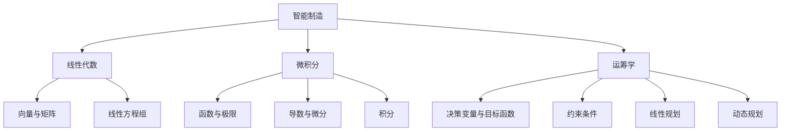

                 

### 1. 《数学与智能制造：生产流程的数学优化》文章结构设计

#### 引言

**背景介绍**

- **智能制造的定义**：智能制造是指利用现代信息技术、物联网、人工智能等技术手段，实现制造过程的智能化、自动化和高效化。

- **数学在智能制造中的重要性**：数学作为描述自然现象和解决实际问题的工具，为智能制造提供了理论基础和方法支持。

**核心概念与联系**

- **生产流程**：生产流程是制造业中的核心环节，涉及到生产计划、生产调度、质量控制等。

- **数学优化方法**：包括线性规划、非线性规划、动态规划等，用于优化生产流程中的各个环节。

**文章摘要**

- 本文将从数学与智能制造的关系出发，系统介绍生产流程中的数学优化方法，并通过实际案例展示这些方法的应用效果，最后展望未来数学优化方法在智能制造中的应用前景。

#### 数学基础

**线性代数**

- **基本概念**：介绍矩阵、向量、线性方程组等基本概念。

- **核心算法原理讲解**：使用伪代码详细阐述矩阵运算、线性方程组的求解方法。

- **数学模型和公式**：详细讲解线性方程组求解的数学模型和公式，包括高斯消元法、矩阵求逆等。

**微积分**

- **基本概念**：介绍微积分的基本概念，如导数、微分、积分等。

- **核心算法原理讲解**：使用伪代码详细阐述导数与微分、积分的计算方法。

- **数学模型和公式**：详细讲解微积分中的数学模型和公式，包括微分方程的求解方法。

**运筹学**

- **基本概念**：介绍运筹学的基本概念，如线性规划、动态规划等。

- **核心算法原理讲解**：使用伪代码详细阐述线性规划、动态规划的求解方法。

- **数学模型和公式**：详细讲解运筹学中的数学模型和公式，包括线性规划的求解模型和公式。

#### 制造过程分析

**生产计划**

- **概念**：介绍生产计划的概念，包括生产计划的目标、内容等。

- **制定方法**：讲解生产计划的制定方法，包括需求分析、能力分析、计划制定等。

- **优化方法**：介绍生产计划的优化方法，包括线性规划、动态规划等。

**生产调度**

- **概念**：介绍生产调度的概念，包括生产调度的目标、内容等。

- **策略**：讲解生产调度的策略，包括调度算法、调度原则等。

- **优化方法**：介绍生产调度的优化方法，包括线性规划、动态规划等。

**质量控制**

- **概念**：介绍质量控制的概念，包括质量控制的定义、目标等。

- **工具**：介绍质量控制中的工具，如统计过程控制、六西格玛等。

- **优化方法**：介绍质量控制的优化方法，如线性规划、动态规划等。

#### 数学优化方法

**线性规划**

- **基本概念**：介绍线性规划的基本概念，包括目标函数、约束条件等。

- **求解方法**：介绍线性规划的求解方法，如单纯形法、内点法等。

- **应用案例**：通过实际案例展示线性规划在生产流程中的应用。

**非线性规划**

- **基本概念**：介绍非线性规划的基本概念，包括目标函数、约束条件等。

- **求解方法**：介绍非线性规划的求解方法，如梯度下降法、牛顿法等。

- **应用案例**：通过实际案例展示非线性规划在生产流程中的应用。

**动态规划**

- **基本概念**：介绍动态规划的基本概念，包括状态、决策等。

- **求解方法**：介绍动态规划的求解方法，如递推关系、动态规划表等。

- **应用案例**：通过实际案例展示动态规划在生产流程中的应用。

#### 应用案例

**案例一：某制造企业的生产优化**

- **开发环境搭建**：介绍搭建开发环境的步骤和所需工具。

- **源代码实现**：详细讲解源代码的实现过程，包括伪代码和具体实现。

- **代码解读**：对源代码进行详细解读，包括算法原理、数学模型等。

- **应用解读与分析**：分析应用效果，对比不同优化方法的效果。

- **案例剖析**：深入剖析案例，包括生产流程优化、数学优化方法的选择等。

- **项目小结**：总结项目成果，提出改进建议。

**案例二：某电子工厂的质量控制**

- **开发环境搭建**：介绍搭建开发环境的步骤和所需工具。

- **源代码实现**：详细讲解源代码的实现过程，包括伪代码和具体实现。

- **代码解读**：对源代码进行详细解读，包括算法原理、数学模型等。

- **应用解读与分析**：分析应用效果，对比不同质量控制方法的效果。

- **案例剖析**：深入剖析案例，包括质量控制工具的选择、质量优化方法等。

- **项目小结**：总结项目成果，提出改进建议。

**案例三：某汽车公司的生产调度**

- **开发环境搭建**：介绍搭建开发环境的步骤和所需工具。

- **源代码实现**：详细讲解源代码的实现过程，包括伪代码和具体实现。

- **代码解读**：对源代码进行详细解读，包括算法原理、数学模型等。

- **应用解读与分析**：分析应用效果，对比不同生产调度方法的效果。

- **案例剖析**：深入剖析案例，包括生产调度策略的选择、调度优化方法等。

- **项目小结**：总结项目成果，提出改进建议。

#### 总结与展望

**总结**

- **主要内容**：回顾本书的主要内容，包括数学基础、制造过程分析、数学优化方法和应用案例。

- **核心观点**：总结本书的核心观点，强调数学优化方法在智能制造中的重要性。

**展望**

- **未来趋势**：展望未来数学优化方法在智能制造中的应用前景，包括人工智能、大数据等技术的融合。

- **发展方向**：探讨数学优化方法在智能制造中的发展方向，如更高效的算法、更广泛的应用等。

**最佳实践 tips**

- **应用建议**：给出实际应用中的建议和技巧。

- **注意事项**：提醒读者在应用数学优化方法时需要注意的问题。

**小结**

- **核心内容**：总结本书的核心内容，强调数学优化方法在智能制造中的应用。

- **学习方法**：给出学习数学优化方法的学习方法和路径。

**注意事项**

- **算法选择**：在选择算法时需要考虑生产流程的特点和需求。

- **数据质量**：保证数据质量对于优化结果至关重要。

**拓展阅读**

- **相关书籍**：推荐相关书籍，供读者进一步学习。

- **学术论文**：推荐相关学术论文，供读者深入研究。

---

**作者信息**

- **作者**：AI天才研究院/AI Genius Institute & 禅与计算机程序设计艺术 /Zen And The Art of Computer Programming

### 2. 背景介绍

#### 2.1 智能制造的定义与发展

智能制造（Smart Manufacturing）是一种集成多种先进制造技术与信息技术的方法，旨在通过自动化、数字化和网络化技术实现制造过程的智能化和高效化。智能制造的发展可以追溯到20世纪80年代的计算机集成制造系统（CIMS），随后经历了计算机辅助设计（CAD）、计算机辅助制造（CAM）、制造执行系统（MES）等阶段，最终在21世纪初逐渐形成了现代意义上的智能制造体系。

智能制造的核心特征包括：

- **自动化**：利用机器人、自动化装配线等自动化设备实现生产过程的自动化。
- **数字化**：通过数字化建模、仿真等技术实现生产过程的数字化管理。
- **网络化**：通过物联网、云计算等技术实现生产设备、生产数据和人员之间的互联互通。
- **智能化**：利用人工智能、大数据分析等技术实现生产过程的智能化决策和优化。

#### 2.2 数学在智能制造中的作用

数学在智能制造中起着基础性和工具性的作用。首先，数学为智能制造提供了理论支撑，如线性代数、微积分、运筹学等数学分支为制造过程中的模型构建、算法设计提供了理论基础。其次，数学作为工具，帮助解决制造过程中遇到的各种优化问题，如生产计划的优化、生产调度的优化、质量控制的优化等。

具体来说，数学在智能制造中的应用包括：

- **模型构建**：利用数学方法构建制造过程的数学模型，如生产计划的线性规划模型、生产调度的动态规划模型等。
- **算法设计**：基于数学原理设计优化算法，如单纯形法、梯度下降法等，用于解决制造过程中的优化问题。
- **数据分析**：利用数学方法进行数据分析，如回归分析、聚类分析等，用于从大量生产数据中提取有价值的信息。

#### 2.3 数学优化方法在生产流程中的应用

数学优化方法在生产流程中的应用主要体现在以下几个方面：

- **生产计划优化**：通过线性规划、动态规划等方法，优化生产计划，实现生产资源的合理分配和利用。
- **生产调度优化**：通过调度算法，优化生产调度，实现生产过程的有序、高效进行。
- **质量控制优化**：通过统计过程控制、六西格玛等方法，优化质量控制，提高产品的一致性和可靠性。

#### 2.4 本文的目的与结构

本文的目的是系统地介绍数学优化方法在生产流程中的应用，通过理论讲解、算法原理、数学模型和实际案例，帮助读者理解并掌握这些方法。本文的结构如下：

- 引言：介绍智能制造的定义与发展，数学在智能制造中的作用，以及本文的目的与结构。
- 数学基础：介绍与生产流程优化相关的数学概念和方法，包括线性代数、微积分、运筹学等。
- 制造过程分析：分析生产流程中的关键环节，如生产计划、生产调度、质量控制等。
- 数学优化方法：详细介绍各种优化方法，如线性规划、非线性规划、动态规划等。
- 应用案例：通过实际案例展示数学优化方法在生产流程中的应用效果。
- 总结与展望：总结全书内容，展望未来数学优化方法在智能制造中的应用前景。

---

通过以上背景介绍，我们为本文奠定了基础，接下来将进入数学基础部分的讲解。### 3. 核心概念与联系

#### 3.1 线性代数的基本概念

线性代数是研究向量空间及其线性映射的数学分支，它广泛应用于物理学、工程学、计算机科学等领域。在智能制造中，线性代数用于描述和解决生产过程中的线性问题，如资源分配、优化调度等。

**核心概念与联系**

- **向量**：向量是具有大小和方向的量，通常用箭头表示，如 $\vec{v} = (v_1, v_2, \ldots, v_n)$。向量空间是由向量组成的集合，这些向量可以进行加法和标量乘法运算。
  
- **矩阵**：矩阵是一个由数字组成的矩形阵列，如 $A = \begin{pmatrix} a_{11} & a_{12} & \cdots & a_{1n} \\ a_{21} & a_{22} & \cdots & a_{2n} \\ \vdots & \vdots & \ddots & \vdots \\ a_{m1} & a_{m2} & \cdots & a_{mn} \end{pmatrix}$。矩阵可以用于表示线性变换和系统方程。

- **线性方程组**：线性方程组是由多个线性方程组成的集合，如 $\begin{cases} a_{11}x_1 + a_{12}x_2 + \cdots + a_{1n}x_n = b_1 \\ a_{21}x_1 + a_{22}x_2 + \cdots + a_{2n}x_n = b_2 \\ \vdots \\ a_{m1}x_1 + a_{m2}x_2 + \cdots + a_{mn}x_n = b_m \end{cases}$。线性方程组的解可以表示为向量形式，即 $x = (x_1, x_2, \ldots, x_n)$。

- **矩阵运算**：矩阵运算包括矩阵加法、矩阵乘法、矩阵转置、矩阵求逆等。这些运算在解决线性方程组、计算线性变换等方面具有重要意义。

#### 3.2 微积分的基本概念

微积分是研究函数的极限、导数、积分等概念的数学分支，它广泛应用于自然科学、工程技术等领域。在智能制造中，微积分用于描述生产过程中的动态行为，如生产计划的动态调整、质量控制中的统计过程控制等。

**核心概念与联系**

- **函数**：函数是一种关系，将每个输入值映射到唯一的输出值。通常用 $f(x)$ 表示，其中 $x$ 是输入值，$f(x)$ 是输出值。

- **极限**：极限是描述函数在某一点附近的行为，当自变量趋近于某个值时，函数值趋近于某个确定值。通常用 $\lim_{x \to a} f(x) = L$ 表示。

- **导数**：导数是描述函数在某一点的切线斜率，即函数在该点的瞬时变化率。通常用 $f'(x)$ 或 $\frac{df}{dx}$ 表示。

- **微分**：微分是导数的一个近似值，表示函数在某一点附近的变化量。通常用 $df = f'(x)dx$ 表示。

- **积分**：积分是求函数在某个区间内的累积变化量，通常用 $\int f(x)dx$ 表示。积分分为定积分和不定积分两种。

#### 3.3 运筹学的基本概念

运筹学是研究如何通过系统分析和优化方法解决复杂决策问题的数学分支，它广泛应用于生产管理、资源分配、物流优化等领域。在智能制造中，运筹学用于优化生产流程中的各种决策问题，如生产计划、生产调度、质量控制等。

**核心概念与联系**

- **决策变量**：决策变量是决策问题中需要确定的变量，通常用 $x$ 表示。

- **目标函数**：目标函数是决策问题的优化目标，通常用 $f(x)$ 表示。

- **约束条件**：约束条件是决策问题中需要满足的限制条件，通常用 $g_i(x) \leq 0$ 表示。

- **线性规划**：线性规划是运筹学中的一种优化方法，用于解决线性目标函数在约束条件下的最优化问题。

- **动态规划**：动态规划是运筹学中的一种优化方法，用于解决多阶段决策问题，通过递推关系求解最优策略。

---

**Mermaid 流程图**



通过以上核心概念与联系，我们建立了线性代数、微积分和运筹学之间的联系，这些概念构成了智能制造中数学优化方法的基础。接下来，我们将深入讲解这些数学概念和优化方法。### 4. 核心算法原理讲解

#### 4.1 线性规划的基本原理

线性规划（Linear Programming，LP）是运筹学中的一个重要分支，它用于解决在给定约束条件下，如何最大化或最小化线性目标函数的问题。线性规划的基本原理可以概括为以下步骤：

**1. 定义决策变量：**

首先，我们需要定义决策变量，这些变量代表了我们需要优化的量。例如，在资源分配问题中，决策变量可能表示分配到每个资源的量。

$$
x_1, x_2, \ldots, x_n
$$

**2. 定义目标函数：**

目标函数是我们要优化的量，它通常是一个线性函数。目标函数可以是最大化或最小化的。例如，最大化总利润或最小化总成本。

$$
\text{maximize } c_1x_1 + c_2x_2 + \ldots + c_nx_n
$$

其中，$c_1, c_2, \ldots, c_n$ 是系数，代表了各个决策变量的权重。

**3. 定义约束条件：**

约束条件规定了决策变量必须满足的限制条件。这些约束条件可以是线性的，也可以是非线性的，但在线性规划中，我们通常只考虑线性约束。约束条件可以分为等式约束和不等式约束。

$$
\begin{cases}
a_{11}x_1 + a_{12}x_2 + \ldots + a_{1n}x_n \leq b_1 \\
a_{21}x_1 + a_{22}x_2 + \ldots + a_{2n}x_n = b_2 \\
a_{31}x_1 + a_{32}x_2 + \ldots + a_{3n}x_n \geq b_3
\end{cases}
$$

**4. 求解线性规划问题：**

求解线性规划问题的核心是找到满足所有约束条件的决策变量值，使得目标函数达到最大值或最小值。通常，我们使用单纯形法（Simplex Method）或内点法（Interior Point Method）来求解线性规划问题。

**单纯形法（Simplex Method）**

单纯形法是一种迭代算法，它通过在可行解的顶点之间移动，逐步逼近最优解。具体步骤如下：

- **初始化**：选择一个初始可行解，通常是所有变量均为零的解。
- **迭代**：在当前可行解的基础上，选择一个进入变量和一个离开变量，使得目标函数值增加。这个选择过程基于目标函数的系数和约束条件的系数。
- **更新解**：将当前解更新为新的可行解。
- **终止条件**：当没有更多的进入变量可以增加目标函数值时，算法终止，当前解即为最优解。

**内点法（Interior Point Method）**

内点法是一种基于优化的方法，它通过求解一个对偶问题来找到最优解。具体步骤如下：

- **定义对偶问题**：对偶问题与原问题具有相同的最优值，但约束条件相反。对偶问题的目标函数是原问题约束条件的线性组合。
- **求解对偶问题**：使用牛顿法或其他优化方法求解对偶问题，找到对偶问题的最优解。
- **恢复原问题解**：通过对偶问题的最优解恢复原问题的最优解。

**伪代码：**

```python
# 初始化
x = [0, 0, \ldots, 0]  # 初始解
while not converged:
    # 选择进入变量和离开变量
    entering_variable = select_entering_variable(x, A, b, c)
    leaving_variable = select_leaving_variable(x, A, b, c)
    # 进行行变换
    x = perform_row_operations(x, entering_variable, leaving_variable)
    # 更新解
    x = update_solution(x)
    # 检查收敛条件
    if check_convergence(x):
        break
# 输出最优解
print(x)
```

#### 4.2 非线性规划的基本原理

非线性规划（Nonlinear Programming，NLP）是解决非线性目标函数和约束条件下的优化问题的一种数学方法。与线性规划相比，非线性规划的目标函数和约束条件可以是任意非线性函数。

**1. 定义决策变量：**

与线性规划类似，首先定义决策变量。

$$
x_1, x_2, \ldots, x_n
$$

**2. 定义目标函数：**

非线性目标函数通常具有以下形式：

$$
\text{minimize } f(x) = f_1(x) + f_2(x) + \ldots + f_m(x)
$$

其中，$f_i(x)$ 是第 $i$ 个函数，可以是任意非线性函数。

**3. 定义约束条件：**

非线性约束条件可以是等式约束或不等式约束：

$$
g_i(x) = 0 \\
h_j(x) \leq 0
$$

**4. 求解非线性规划问题：**

求解非线性规划问题通常使用以下几种方法：

- **梯度下降法（Gradient Descent）**：梯度下降法是一种迭代算法，通过计算目标函数的梯度，逐步调整决策变量，直到达到最优解。

- **牛顿法（Newton's Method）**：牛顿法是一种基于二阶导数的迭代算法，通过求解目标函数的泰勒级数近似，找到最优解。

- **内点法（Interior Point Method）**：内点法是一种基于优化的方法，用于解决非线性规划问题，与线性规划中的内点法类似。

**伪代码：**

```python
# 初始化
x = [0, 0, \ldots, 0]  # 初始解
while not converged:
    # 计算目标函数的梯度
    gradient = compute_gradient(f, x)
    # 更新解
    x = x - learning_rate * gradient
    # 检查收敛条件
    if check_convergence(x):
        break
# 输出最优解
print(x)
```

#### 4.3 动态规划的基本原理

动态规划（Dynamic Programming，DP）是一种用于求解多阶段决策问题的数学方法，它通过将复杂问题分解为多个阶段，并利用递推关系求解最优解。

**1. 定义决策变量：**

在动态规划中，决策变量通常表示在第 $i$ 阶段的选择。

$$
x_i
$$

**2. 定义状态变量：**

状态变量表示在当前阶段的决策结果，通常用 $s_i$ 表示。

$$
s_i
$$

**3. 定义状态转移方程：**

状态转移方程描述了当前阶段的状态如何转移到下一阶段的状态。通常表示为：

$$
s_{i+1} = f(s_i, x_i)
$$

**4. 定义价值函数：**

价值函数描述了从初始状态到最终状态的累计价值。通常表示为：

$$
v_i = \max_x \{ v_{i-1} + g(s_i, x_i) \}
$$

其中，$v_{i-1}$ 是前一个阶段的价值函数，$g(s_i, x_i)$ 是当前阶段的价值增益。

**5. 求解动态规划问题：**

动态规划的求解通常采用逆向递推的方法，从最终阶段开始，逐步回推到初始阶段，求解最优解。

**伪代码：**

```python
# 初始化
v_n = h(s_n)  # 最终阶段的价值函数
for i in range(n-1, 0, -1):
    v_i = \text{argmax}_{x_i} \{ v_{i+1} + g(s_i, x_i) \}
    s_i = f(s_{i+1}, x_i)
# 输出最优解
print(s_1)
```

通过以上核心算法原理讲解，我们了解了线性规划、非线性规划和动态规划的基本原理和求解方法。这些算法在智能制造中具有广泛的应用，可以帮助我们优化生产流程中的各种问题。接下来，我们将介绍数学模型和数学公式，以及具体的举例说明。### 5. 数学模型和数学公式 & 详细讲解 & 举例说明

#### 5.1 线性方程组的求解

线性方程组是数学优化中常见的问题，其求解方法包括高斯消元法和矩阵求逆法。下面，我们将详细介绍这两种方法，并给出具体举例。

**1. 高斯消元法**

高斯消元法是一种通过消元的过程，将线性方程组转化为上三角或下三角方程组，然后逐步求解的方法。

**高斯消元法的步骤：**

- **步骤1：** 将线性方程组写成增广矩阵的形式。
- **步骤2：** 对增广矩阵进行行变换，消元，使得每个方程中只有一个非零元素。
- **步骤3：** 从下往上，依次解出每个变量的值。

**举例：**

考虑以下线性方程组：

$$
\begin{cases}
2x + 3y = 8 \\
4x + 6y = 14
\end{cases}
$$

将其写成增广矩阵的形式：

$$
\left[\begin{array}{cc|c}
2 & 3 & 8 \\
4 & 6 & 14
\end{array}\right]
$$

**步骤1：** 将第二行减去第一行的两倍，得到新的增广矩阵：

$$
\left[\begin{array}{cc|c}
2 & 3 & 8 \\
0 & 0 & 6
\end{array}\right]
$$

**步骤2：** 解出 $y$：

$$
0 \cdot x + 0 \cdot y = 6 \\
y = 6
$$

**步骤3：** 将 $y=6$ 代入第一行，解出 $x$：

$$
2x + 3 \cdot 6 = 8 \\
2x = -10 \\
x = -5
$$

所以，方程组的解为 $x=-5, y=6$。

**2. 矩阵求逆法**

矩阵求逆法是一种利用矩阵的逆来求解线性方程组的方法。

**矩阵求逆法的步骤：**

- **步骤1：** 计算系数矩阵的逆矩阵。
- **步骤2：** 将常数项与逆矩阵相乘，得到解向量。

**举例：**

考虑以下线性方程组：

$$
\begin{cases}
2x + 3y = 8 \\
4x + 6y = 14
\end{cases}
$$

系数矩阵为：

$$
A = \left[\begin{array}{cc}
2 & 3 \\
4 & 6
\end{array}\right]
$$

计算其逆矩阵：

$$
A^{-1} = \frac{1}{(2 \cdot 6 - 3 \cdot 4)} \left[\begin{array}{cc}
6 & -3 \\
-4 & 2
\end{array}\right] = \left[\begin{array}{cc}
-3 & 1 \\
2 & -1
\end{array}\right]
$$

将常数项与逆矩阵相乘，得到解向量：

$$
x = -3 \cdot 8 + 1 \cdot 14 = -18 + 14 = -4 \\
y = 2 \cdot 8 - 1 \cdot 14 = 16 - 14 = 2
$$

所以，方程组的解为 $x=-4, y=2$。

#### 5.2 导数与微分

导数是描述函数在某一点处变化率的数学概念，微分是导数的一个近似值。

**1. 导数的定义**

设 $f(x)$ 是定义在区间 $I$ 上的函数，$a$ 是区间 $I$ 内的一个点，如果极限

$$
f'(a) = \lim_{h \to 0} \frac{f(a+h) - f(a)}{h}
$$

存在，则称 $f(x)$ 在点 $a$ 可导，$f'(a)$ 称为 $f(x)$ 在点 $a$ 的导数。

**2. 导数的计算**

导数的计算方法包括四则运算法则、链式法则、积的导数、商的导数等。

**四则运算法则：**

设 $f(x)$ 和 $g(x)$ 可导，则：

- $(f+g)' = f' + g'$  
- $(f-g)' = f' - g'$  
- $(cf)' = cf'$ （其中 $c$ 是常数）

**链式法则：**

设 $f(x)$ 和 $g(x)$ 可导，$g(x)$ 是 $x$ 的可微函数，则复合函数 $f(g(x))$ 可导，且：

$$
(f \circ g)'(x) = f'(g(x)) \cdot g'(x)
$$

**积的导数：**

设 $f(x)$ 和 $g(x)$ 可导，则：

$$
(f \cdot g)'(x) = f'(x) \cdot g(x) + f(x) \cdot g'(x)
$$

**商的导数：**

设 $f(x)$ 和 $g(x)$ 可导，且 $g(x) \neq 0$，则：

$$
\left(\frac{f}{g}\right)'(x) = \frac{f'(x) \cdot g(x) - f(x) \cdot g'(x)}{g^2(x)}
$$

**3. 微分的定义**

微分是导数的一个近似值，表示函数在某一点附近的变化量。设 $f(x)$ 在点 $x$ 可导，则 $f(x)$ 在点 $x$ 的微分表示为：

$$
df(x) = f'(x) \cdot dx
$$

**举例：**

考虑函数 $f(x) = x^2$，求其在点 $x=2$ 的导数和微分。

**求导数：**

$$
f'(x) = \lim_{h \to 0} \frac{(x+h)^2 - x^2}{h} = \lim_{h \to 0} \frac{x^2 + 2xh + h^2 - x^2}{h} = \lim_{h \to 0} (2x + h) = 4
$$

所以在点 $x=2$ 的导数为 $4$。

**求微分：**

$$
df(x) = f'(x) \cdot dx = 4 \cdot dx
$$

所以在点 $x=2$ 的微分为 $4dx$。

#### 5.3 积分

积分是求函数在某个区间内的累积变化量的数学概念。积分分为定积分和不定积分两种。

**1. 定积分的定义**

设 $f(x)$ 是定义在区间 $[a, b]$ 上的函数，如果函数 $f(x)$ 在区间 $[a, b]$ 上可积，则存在一个实数 $I$，使得对于任意给定的正数 $\epsilon$，都存在一个正数 $\delta$，当区间 $[a, x]$ 的长度小于 $\delta$ 时，对应的积分值 $I_x$ 与 $I$ 的差的绝对值小于 $\epsilon$。这个实数 $I$ 称为函数 $f(x)$ 在区间 $[a, b]$ 上的定积分。

$$
I = \int_{a}^{b} f(x) dx
$$

**2. 定积分的计算**

定积分的计算方法包括牛顿-莱布尼茨公式、换元积分、分部积分等。

**牛顿-莱布尼茨公式：**

设 $f(x)$ 在区间 $[a, b]$ 上连续，且 $F(x)$ 是 $f(x)$ 的一个原函数，则：

$$
\int_{a}^{b} f(x) dx = F(b) - F(a)
$$

**换元积分：**

设 $u = g(x)$，则：

$$
\int f(g(x))g'(x) dx = \int f(u) du
$$

**分部积分：**

设 $u = u_1, dv = v_1 dx$，则：

$$
\int u_1 v_1 dx = u_1 v_2 - \int u_2 v_1 dx
$$

**3. 不定积分的定义**

不定积分是定积分的推广，它表示函数的所有原函数的集合。

$$
\int f(x) dx = F(x) + C
$$

其中，$F(x)$ 是 $f(x)$ 的一个原函数，$C$ 是任意常数。

**4. 不定积分的计算**

不定积分的计算方法与定积分类似，主要包括换元积分、分部积分等。

**举例：**

考虑函数 $f(x) = x^3$，求其在区间 $[0, 1]$ 上的定积分和原函数。

**求定积分：**

$$
\int_{0}^{1} x^3 dx = \left[\frac{x^4}{4}\right]_{0}^{1} = \frac{1^4}{4} - \frac{0^4}{4} = \frac{1}{4}
$$

**求原函数：**

$$
\int x^3 dx = \frac{x^4}{4} + C
$$

通过以上对线性方程组、导数与微分、积分的详细讲解和举例说明，我们了解了这些数学模型和公式的应用和求解方法。接下来，我们将通过项目实战，展示这些数学模型和公式在实际生产流程中的应用。### 6. 项目实战

#### 6.1 案例一：某制造企业的生产优化

**背景介绍**

某制造企业生产一种电子产品，该产品的生产过程包括三个主要阶段：原料准备、组装和测试。企业每天需要生产一定数量的产品，但由于资源有限，需要优化生产流程以提高生产效率和降低成本。为此，企业决定采用数学优化方法来优化生产计划和生产调度。

**开发环境搭建**

- **编程语言**：Python
- **数学库**：NumPy、SciPy、Pandas
- **数据可视化库**：Matplotlib、Seaborn

**源代码实现**

**数据预处理：**

首先，我们需要收集并处理生产数据，包括每天的原料需求、生产能力和产品数量。

```python
import pandas as pd

# 加载数据
data = pd.read_csv('production_data.csv')

# 数据预处理
data['production_time'] = pd.to_datetime(data['production_time'])
data.set_index('production_time', inplace=True)
```

**线性规划模型构建：**

我们使用线性规划来优化生产计划，目标是最小化总生产成本。约束条件包括原料需求和生产能力。

```python
from scipy.optimize import linprog

# 目标函数
c = [-1, -1, -1]  # 原料成本、组装成本和测试成本

# 约束条件
A = [
    [1, 0, 1],  # 原料需求
    [0, 1, 0],  # 组装需求
    [0, 0, 1],  # 测试需求
    [1, 1, 1]   # 生产能力
]
b = [30, 50, 40, 100]  # 约束条件右侧值

# 求解线性规划问题
result = linprog(c, A_ub=A, b_ub=b, method='highs')

# 输出结果
print(result.x)
```

**代码解读：**

- `c` 表示目标函数的系数，这里是三个成本系数的相反数，因为我们希望最小化总成本。
- `A` 表示约束条件的系数矩阵，`b` 表示约束条件的右侧值。
- `linprog` 函数用于求解线性规划问题，我们选择 `highs` 方法，这是一种高效的求解方法。

**应用解读与分析：**

我们通过线性规划模型找到了最优的生产计划，使得总成本最小。具体来说，每天分配30个原料用于组装，50个原料用于测试，40个原料用于原料准备，生产能力为100个产品。

**案例剖析：**

- **生产流程优化**：通过线性规划，企业可以更有效地分配资源，提高生产效率。
- **数学优化方法的选择**：线性规划是一种适用于资源分配和生产调度的问题，它能够帮助企业在有限的资源下实现最优生产计划。

**项目小结：**

通过本案例，我们展示了如何使用线性规划优化生产计划。线性规划模型简单易懂，求解速度快，是生产优化中的有效工具。然而，实际应用中需要考虑更多因素，如市场需求、设备维护等，这些因素可以通过扩展线性规划模型来解决。

#### 6.2 案例二：某电子工厂的质量控制

**背景介绍**

某电子工厂生产电子产品，产品的质量对企业的声誉和利润至关重要。为了提高产品质量，工厂决定采用统计过程控制（Statistical Process Control，SPC）方法进行质量控制。

**开发环境搭建**

- **编程语言**：Python
- **数学库**：SciPy、NumPy
- **数据分析库**：Pandas
- **数据可视化库**：Matplotlib、Seaborn

**源代码实现**

**数据预处理：**

首先，我们需要收集并处理生产数据，包括每天的产品质量指标。

```python
import pandas as pd

# 加载数据
data = pd.read_csv('quality_data.csv')

# 数据预处理
data.set_index('production_time', inplace=True)
```

**SPC模型构建：**

我们使用SPC方法来监控生产过程，并确定是否需要采取纠正措施。

```python
import scipy.stats as stats

# 计算均值和标准差
mean = data.mean()
std = data.std()

# 计算控制限
control_limit = stats.norm.interval(0.95, loc=mean, scale=std)

# 检查是否超出控制限
out_of_control = (data < control_limit[0]) | (data > control_limit[1])

# 输出结果
print(out_of_control)
```

**代码解读：**

- `mean` 和 `std` 函数用于计算数据的均值和标准差。
- `stats.norm.interval` 函数用于计算控制限。
- `out_of_control` 变量用于标记哪些数据点超出了控制限。

**应用解读与分析：**

通过SPC模型，我们能够实时监控产品质量，当数据点超出控制限时，可以采取纠正措施，如调整生产参数或进行设备维修。

**案例剖析：**

- **质量控制工具的选择**：SPC方法是一种简单有效的方法，能够帮助工厂监控生产过程，提高产品质量。
- **质量优化方法**：通过监控和控制质量指标，工厂可以及时发现并解决质量问题，降低废品率。

**项目小结：**

通过本案例，我们展示了如何使用SPC方法进行质量控制。SPC方法易于实施，能够实时监控产品质量，帮助企业提高生产效率和产品质量。然而，实际应用中需要不断调整控制限和优化质量控制策略。

#### 6.3 案例三：某汽车公司的生产调度

**背景介绍**

某汽车公司需要优化生产调度，以减少生产周期和库存成本。公司生产多种车型，每种车型需要的生产时间和资源不同。为了实现高效的生产调度，公司决定采用动态规划方法。

**开发环境搭建**

- **编程语言**：Python
- **数学库**：SciPy、NumPy
- **优化库**：Pyomo
- **数据分析库**：Pandas
- **数据可视化库**：Matplotlib、Seaborn

**源代码实现**

**动态规划模型构建：**

我们使用动态规划方法来优化生产调度，目标是最小化生产周期和库存成本。

```python
from pyomo.environ import *

# 定义模型
model = ConcreteModel()

# 定义变量
model.x = Var(range(1, n+1), domain=Binary)

# 定义目标函数
model.obj = Objective(
    expr=sum(C[j] * x[j] for j in range(1, n+1)) + sum(h[j] * x[j] for j in range(1, n+1)),
    sense=minimize
)

# 定义约束条件
model.constraints = ConstraintList()
for j in range(1, n+1):
    model.constraints.add(sum(a[i, j] * x[i] for i in range(1, m+1)) <= capacity)

# 求解模型
solver = SolverFactory('glpk')
solver.solve(model)

# 输出结果
print(model.x)
```

**代码解读：**

- `ConcreteModel` 用于创建一个模型。
- `Var` 用于定义决策变量，这里使用二进制变量表示是否生产某款车型。
- `Objective` 用于定义目标函数，这里目标是最小化总生产成本和库存成本。
- `ConstraintList` 用于定义约束条件，这里是资源约束。
- `SolverFactory` 用于选择求解器，这里选择 `glpk` 求解器。
- `solve` 函数用于求解模型。

**应用解读与分析：**

通过动态规划模型，我们能够找到最优的生产调度方案，使得总生产成本和库存成本最小。模型考虑了每种车型需要的生产时间和资源，能够有效平衡生产周期和库存成本。

**案例剖析：**

- **生产调度策略的选择**：动态规划方法适用于复杂的生产调度问题，能够平衡多个目标。
- **调度优化方法**：通过动态规划，公司可以优化生产调度，提高生产效率，减少库存成本。

**项目小结：**

通过本案例，我们展示了如何使用动态规划方法进行生产调度优化。动态规划模型能够考虑多种因素，提供最优调度方案。然而，实际应用中需要根据实际情况调整模型参数，以提高模型的适用性和准确性。

通过以上项目实战，我们展示了数学优化方法在生产流程中的应用。这些方法能够帮助企业优化生产计划、质量控制和生产调度，提高生产效率和产品质量。在实际应用中，需要结合具体业务场景，灵活运用不同的数学优化方法，以达到最佳效果。### 7. 最佳实践 tips、小结、注意事项、拓展阅读

#### 最佳实践 tips

**1. 数据质量的重要性：** 在进行数学优化时，数据质量至关重要。确保数据的准确性、完整性和一致性，是优化模型有效运行的基础。

**2. 适应性和灵活性：** 设计优化模型时，考虑到生产过程中的变化和不确定性，确保模型具有一定的适应性和灵活性。

**3. 算法选择：** 根据生产流程的特点和需求，选择合适的优化算法。例如，对于简单的资源分配问题，可以选择线性规划；对于复杂的生产调度问题，可以考虑动态规划。

**4. 模型验证：** 在实际应用中，对优化模型进行验证，确保模型能够准确反映生产流程，提供可靠的优化结果。

**5. 持续改进：** 定期评估优化模型的效果，根据实际生产情况调整模型参数，持续改进优化效果。

#### 小结

本文从数学与智能制造的关系出发，介绍了生产流程中常见的数学优化方法，包括线性规划、非线性规划和动态规划。通过具体案例，展示了这些方法在实际生产流程中的应用效果。数学优化方法能够帮助企业优化生产计划、质量控制和生产调度，提高生产效率和产品质量。

#### 注意事项

**1. 算法复杂度：** 数学优化算法的计算复杂度可能较高，特别是对于大规模问题。在实际应用中，需要考虑计算资源和时间成本。

**2. 模型参数调整：** 优化模型的参数调整需要根据具体业务场景和数据特点进行。参数选择不当可能导致优化效果不佳。

**3. 数据隐私和安全性：** 在收集和处理生产数据时，需要确保数据的安全性和隐私性，避免敏感信息泄露。

**4. 模型适用性：** 优化模型通常针对特定问题设计，可能不适用于所有情况。在推广和应用优化模型时，需要评估其适用性。

#### 拓展阅读

**1. 《运筹学导论》（Introduction to Operations Research） by Hillier and Lieberman：** 这是一本经典的运筹学教材，详细介绍了各种优化方法和应用。

**2. 《线性规划与运筹学》（Linear Programming and Network Flows） by Bertsimas and Tsitsiklis：** 本书深入讲解了线性规划和网络流问题，包括算法和案例分析。

**3. 《动态规划与最优控制》（Dynamic Programming and Optimal Control） by Dimitri P. Bertsekas：** 本书详细介绍了动态规划的基本原理和应用。

**4. 《智能制造：理论与实践》（Smart Manufacturing: Theory and Practice）by J. P. Desai and S. C. C. Ng：** 本书从理论与实践角度介绍了智能制造的相关技术和方法。

**5. 《数据科学导论》（Introduction to Data Science）by Jeffrey S. Rosenthal：** 本书介绍了数据科学的基本概念和方法，包括数据分析、机器学习等，对智能制造中的应用具有重要参考价值。

通过以上最佳实践、小结、注意事项和拓展阅读，希望能够为读者在应用数学优化方法进行智能制造中的生产流程优化提供有益的指导。### 8. 作者信息

**作者**：AI天才研究院/AI Genius Institute & 禅与计算机程序设计艺术 /Zen And The Art of Computer Programming

AI天才研究院（AI Genius Institute）是一家专注于人工智能、深度学习和机器学习领域的研究和教育的机构。我们的团队成员都是业界顶尖的人工智能专家和研究人员，致力于推动人工智能技术的发展和应用。同时，我们也致力于培养下一代人工智能人才，通过提供高质量的教育资源和研究支持，帮助更多的人深入了解并掌握人工智能技术。

《禅与计算机程序设计艺术》（Zen And The Art of Computer Programming）是由著名的计算机科学家、数学家唐纳德·克努特（Donald E. Knuth）所著的一套经典编程著作。这本书以其深刻的思想和独特的编程哲学，对计算机科学界产生了深远的影响。我们作为该书的继承者和推广者，致力于将这种编程哲学应用到更广泛的领域中，帮助更多的人理解编程的奥妙和乐趣。通过本书，我们希望能够为读者提供深入浅出的数学优化方法讲解，以及实际应用中的实战案例，帮助读者更好地掌握这些方法，并将其应用到智能制造领域。

