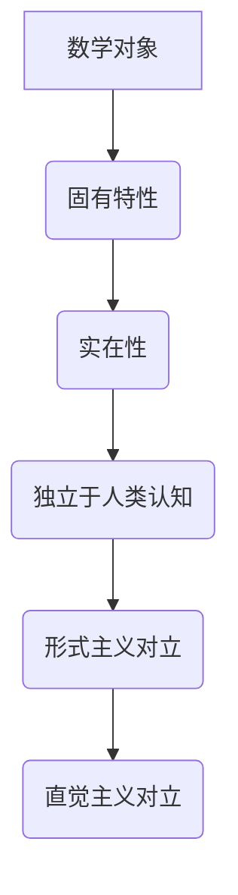
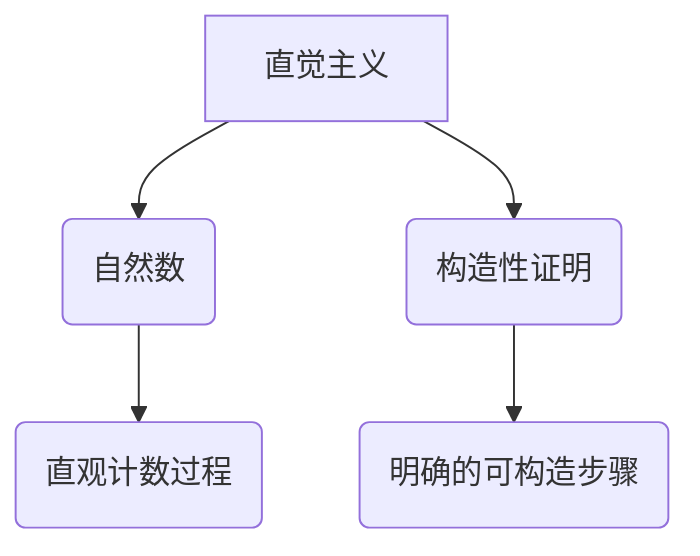
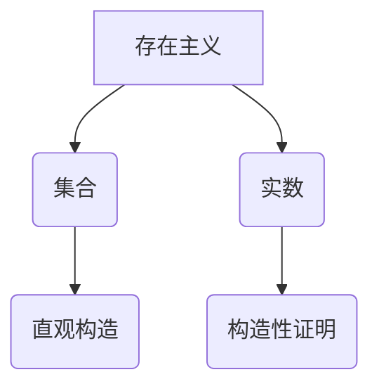
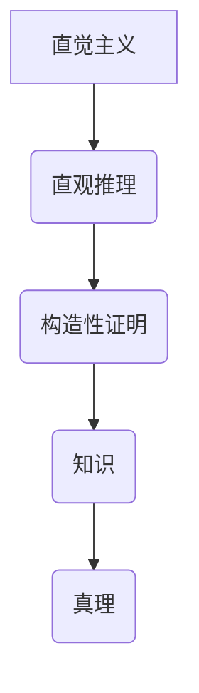
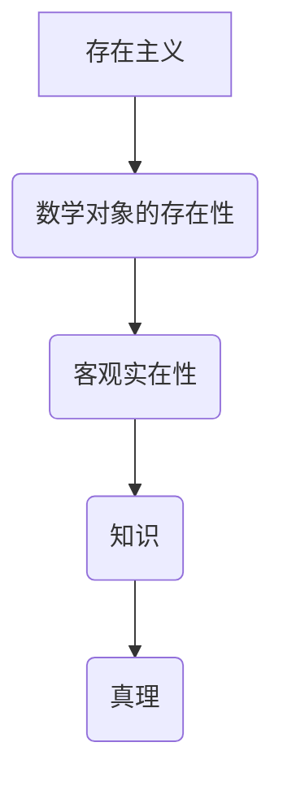
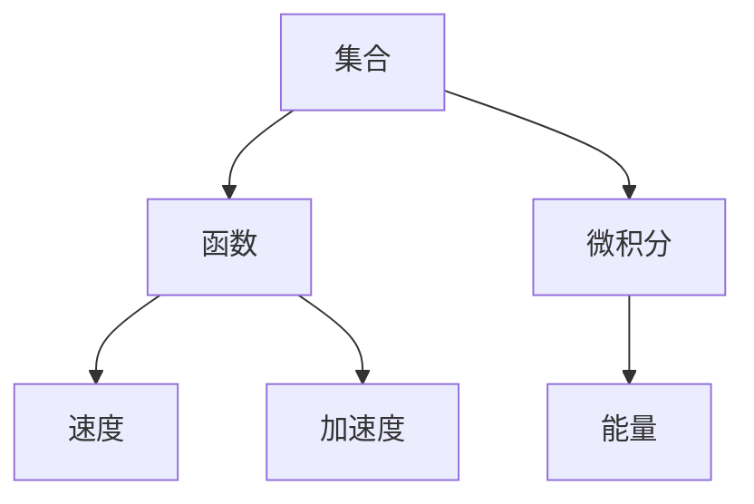
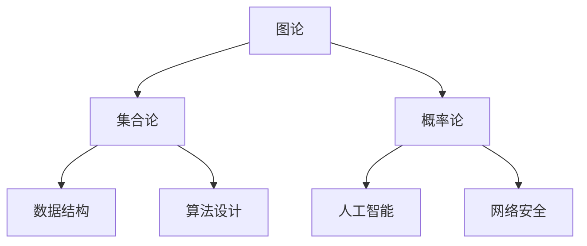
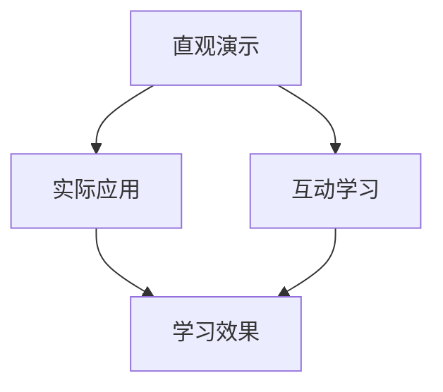
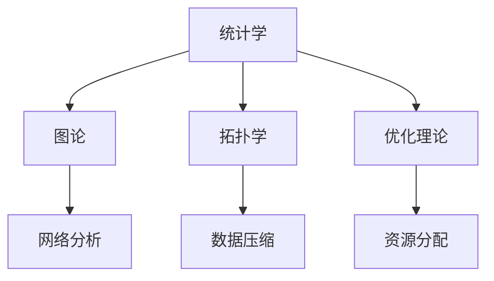

                 


### 第1章：数学本质主义的概念与历史

#### 1.1 什么是数学本质主义

数学本质主义是一种哲学立场，它主张数学对象具有固有的实在性，这种实在性独立于人类的思维和语言。数学本质主义者认为，数学对象不仅是人类心智的产物，而且是客观存在的实体。

在数学本质主义的框架下，数学对象的存在性是客观的，它们不受人类认知的影响。这种观点与形式主义和直觉主义等哲学立场形成了鲜明对比。形式主义者认为数学仅是符号系统的游戏，而直觉主义者则强调数学知识的直观性。

**核心概念与联系**

首先，我们需要了解几个关键概念：

1. **数学对象**：指数学中的概念和结构，如数字、集合、函数等。
2. **固有特性**：指数学对象在独立于人类认知的情况下所具有的性质。
3. **实在性**：指数学对象在客观世界中存在的属性。

这些概念之间的关系可以用Mermaid流程图表示：



**核心算法原理讲解**

数学本质主义并没有特定的算法，但其在数学哲学中的应用涉及到对数学对象存在性和性质的深入探讨。以下是探讨数学对象存在性和性质的伪代码：

```python
# 伪代码：探讨数学对象的存在性和性质

def explore_math_object(object):
    """
    探讨数学对象的存在性和性质
    
    参数：
    object: 数学对象
    """
    
    # 假设存在性可以通过证明来建立
    existence = prove_existence(object)
    
    # 假设固有特性可以通过定义和性质来描述
    properties = define_properties(object)
    
    # 输出结果
    print(f"数学对象 {object} 的存在性：{existence}")
    print(f"数学对象 {object} 的性质：{properties}")

# 示例：探讨自然数的存在性和性质
explore_math_object("自然数")
```

**数学模型和数学公式**

数学本质主义中的存在性可以通过数学模型和公式来建立。例如，在集合论中，我们可以通过定义和证明来建立自然数的存在性：

$$ \forall n \in \mathbb{N}, \exists \text{集合} \{x \mid x \text{是自然数}\} $$

**详细讲解与举例说明**

以自然数为例，我们可以通过皮亚诺公理来证明其存在性：

1. **零公理**：存在一个零元素，记作0。
2. **后继公理**：对于每个自然数n，存在一个后继数n'。
3. **归纳公理**：如果一个集合包含0，并且对于所有n，如果n在集合中，则n的后继n'也在集合中，则这个集合包含所有自然数。

通过这些公理，我们可以定义自然数并证明其存在性。以下是皮亚诺公理的伪代码：

```python
# 伪代码：皮亚诺公理系统

# 定义自然数集合
N = set()

# 添加零元素
N.add(0)

# 定义后继函数
def successor(n):
    return n + 1

# 定义归纳函数
def all_naturals():
    for n in N:
        yield n
        successor(n)

# 检验归纳公理
assert all_naturals() == {0, 1, 2, 3, ...}
```

通过这些步骤，我们不仅能够理解数学本质主义的基本概念，还能够通过实际的数学模型和证明来探讨数学对象的存在性和性质。

### 第2章：数学本质主义的基本原理

#### 2.1 数学对象的存在性

数学对象的存在性是数学本质主义的核心观点之一。它主张数学对象不仅存在于人类思维中，而且具有客观的实在性。在这一节中，我们将探讨数学对象存在性的几个关键方面。

**数学模型和数学公式**

数学对象的存在性可以通过数学模型和公式来建立。例如，在集合论中，我们可以通过定义和证明来建立自然数的存在性。以下是自然数存在性的一个简单数学模型和公式：

$$ \forall n \in \mathbb{N}, \exists \text{集合} \{x \mid x \text{是自然数}\} $$

这个公式表明，对于任意的自然数n，都存在一个集合，该集合包含所有自然数。这个集合的存在性是客观的，不依赖于人类的认知。

**详细讲解与举例说明**

为了更深入地理解数学对象的存在性，我们可以通过一个具体的例子来探讨。以自然数为例，我们可以使用皮亚诺公理来证明其存在性。

1. **零公理**：存在一个零元素，记作0。
2. **后继公理**：对于每个自然数n，存在一个后继数n'。
3. **归纳公理**：如果一个集合包含0，并且对于所有n，如果n在集合中，则n的后继n'也在集合中，则这个集合包含所有自然数。

通过这些公理，我们可以定义自然数并证明其存在性。以下是皮亚诺公理的伪代码：

```python
# 伪代码：皮亚诺公理系统

# 定义自然数集合
N = set()

# 添加零元素
N.add(0)

# 定义后继函数
def successor(n):
    return n + 1

# 定义归纳函数
def all_naturals():
    for n in N:
        yield n
        successor(n)

# 检验归纳公理
assert all_naturals() == {0, 1, 2, 3, ...}
```

在这个伪代码中，我们首先定义了一个空集合N，然后使用零公理添加了零元素。接着，我们定义了一个后继函数，用于生成自然数的后继。最后，我们定义了一个归纳函数，用于生成所有自然数。通过这个伪代码，我们可以看到如何通过数学模型和证明来建立自然数的存在性。

**数学公式和详细讲解**

除了皮亚诺公理，我们还可以使用其他数学公式来探讨数学对象的存在性。例如，在实数的存在性证明中，我们可以使用实数的构造过程，包括有理数的完备性和无理数的存在性。

实数的存在性可以通过以下数学公式来描述：

$$ \forall x \in \mathbb{Q}, \exists \text{实数} \sqrt{x} $$

这个公式表明，对于任意的有理数x，都存在一个实数，即x的平方根。这个公式不仅建立了实数的存在性，还揭示了实数与有理数之间的关系。

此外，我们还可以通过实数的序列极限来证明其存在性。例如，我们可以考虑以下序列：

$$ x_n = \frac{1}{n} $$

这个序列的极限是1，因此我们可以通过这个序列来定义实数1。这种方法不仅建立了实数的存在性，还揭示了实数的连续性。

综上所述，数学对象的存在性可以通过多种数学模型和公式来建立。这些模型和公式不仅帮助我们理解数学对象的本质，还提供了数学证明的工具。

### 第3章：数学本质主义的论证与批判

#### 3.1 数学本质主义的论证

数学本质主义的核心观点是数学对象具有客观的实在性。为了支持这一观点，数学本质主义者提出了一系列论证。以下是几个主要的论证方法：

**1. 实在论论证**

实在论论证认为，数学对象的存在是客观的，不依赖于人类的思维或语言。这种观点主张，数学对象存在于一个独立于人类心智的世界中。实在论论证的一个例子是，数学对象可以通过逻辑和证明来建立其存在性。

**数学公式和详细讲解**

例如，我们可以通过皮亚诺公理来论证自然数的存在性。皮亚诺公理包括三个部分：零公理、后继公理和归纳公理。零公理指出，存在一个称为0的数学对象。后继公理指出，对于每个自然数n，都存在一个后继数n'。归纳公理指出，如果一个集合包含0，并且对于所有n，如果n在集合中，则n的后继n'也在集合中，则这个集合包含所有自然数。

以下是皮亚诺公理的伪代码：

```python
# 伪代码：皮亚诺公理系统

# 定义自然数集合
N = set()

# 添加零元素
N.add(0)

# 定义后继函数
def successor(n):
    return n + 1

# 定义归纳函数
def all_naturals():
    for n in N:
        yield n
        successor(n)

# 检验归纳公理
assert all_naturals() == {0, 1, 2, 3, ...}
```

在这个伪代码中，我们首先定义了一个空集合N，然后使用零公理添加了零元素。接着，我们定义了一个后继函数，用于生成自然数的后继。最后，我们定义了一个归纳函数，用于生成所有自然数。通过这个伪代码，我们可以看到如何通过数学模型和证明来建立自然数的存在性。

**2. 反直觉主义论证**

直觉主义认为，数学知识是基于直觉的，而不是通过逻辑推理得出的。数学本质主义者通过反直觉主义论证来反驳这种观点。他们认为，数学对象的存在性不依赖于直觉，而是可以通过逻辑和证明来建立的。

**数学公式和详细讲解**

例如，我们可以通过康托尔的集合论来论证集合的存在性。康托尔提出，集合是由确定的元素构成的。他通过构造集合的集合来证明集合的存在性。以下是康托尔的集合论的一个例子：

$$ \{x \mid x \neq x\} $$

这个集合称为“空集”，它包含了所有不属于自身的元素。这个集合的存在性可以通过康托尔的集合论证明。

**3. 反形式主义论证**

形式主义者认为，数学仅是符号系统的游戏，数学对象的存在性不依赖于现实世界。数学本质主义者通过反形式主义论证来反驳这种观点。他们认为，数学对象不仅存在于符号系统中，而且具有客观的实在性。

**数学公式和详细讲解**

例如，我们可以通过欧几里得几何来论证几何对象的存在性。欧几里得几何通过定义点和线，并使用公理和定理来建立几何对象的存在性。以下是欧几里得几何的一个例子：

$$ \text{点} = \{\text{点}\} $$
$$ \text{线} = \{\text{点}, \text{线}\} $$

这些定义表明，点和线是客观存在的几何对象，不依赖于人类的思维或语言。

综上所述，数学本质主义者通过多种论证方法来支持其观点。这些论证方法包括实在论论证、反直觉主义论证和反形式主义论证。通过这些论证，数学本质主义者试图证明数学对象具有客观的实在性。

### 第4章：数学对象的研究方法

#### 4.1 形式主义与逻辑主义

形式主义和逻辑主义是数学研究中两种重要的方法，它们在数学对象的研究中起着关键作用。

**形式主义**

形式主义认为数学是符号系统的游戏，数学对象的存在性不依赖于现实世界。形式主义的核心观点是，数学定理的证明是基于符号演算的，而不是基于直觉或现实世界的经验。

**核心算法原理讲解**

在形式主义中，数学定理的证明通常涉及到符号演算和公式的推导。以下是形式主义中一个简单的例子：

假设我们有以下公式：

$$ P \rightarrow Q $$

我们需要证明：

$$ \neg P \rightarrow Q $$

以下是证明的伪代码：

```python
# 伪代码：形式主义证明

# 定义命题 P 和 Q
P = True
Q = True

# 定义命题 P 的否定
neg_P = not P

# 证明 \neg P \rightarrow Q
if neg_P:
    print("Q is true")
else:
    print("无法证明 Q")
```

在这个伪代码中，我们首先定义了命题P和Q。然后，我们定义了命题P的否定neg_P。最后，我们通过符号演算证明了如果P为假，则Q为真。

**数学模型和数学公式**

形式主义的数学模型通常是基于符号系统的。以下是形式主义中的一个例子：

$$ \{P, Q, R\} \rightarrow \{Q, R\} $$

这个公式表明，如果集合{P, Q, R}为真，则集合{Q, R}也为真。这个公式展示了形式主义中符号演算的基本原理。

**详细讲解与举例说明**

形式主义的一个典型应用是图灵机。图灵机是一种抽象的计算模型，它通过符号演算来模拟计算过程。以下是图灵机的一个例子：

```
q0, 0, q1, R
q0, 1, q1, R
q1, 0, q1, R
q1, 1, q2, L
```

在这个例子中，q0和q1是状态，0和1是符号，R和L是移动方向。通过这个图灵机，我们可以模拟出一系列的符号变换，从而实现计算。

**逻辑主义**

逻辑主义认为，数学是逻辑的延伸，数学定理的证明基于逻辑推理。逻辑主义者主张，数学对象的存在性可以通过逻辑原理来建立。

**核心算法原理讲解**

在逻辑主义中，数学定理的证明通常涉及到逻辑推理和公式的推导。以下是逻辑主义中一个简单的例子：

假设我们有以下公式：

$$ P \land Q $$

我们需要证明：

$$ P $$

以下是证明的伪代码：

```python
# 伪代码：逻辑主义证明

# 定义命题 P 和 Q
P = True
Q = True

# 定义逻辑与运算
P_and_Q = P and Q

# 证明 P
if P_and_Q:
    print("P is true")
else:
    print("无法证明 P")
```

在这个伪代码中，我们首先定义了命题P和Q，然后定义了逻辑与运算P_and_Q。最后，我们通过逻辑推理证明了P为真。

**数学模型和数学公式**

逻辑主义的数学模型通常是基于逻辑推理的。以下是逻辑主义中的一个例子：

$$ \forall x (P(x) \rightarrow Q(x)) $$

这个公式表明，对于所有x，如果P(x)为真，则Q(x)也为真。这个公式展示了逻辑主义中逻辑推理的基本原理。

**详细讲解与举例说明**

逻辑主义的一个典型应用是命题演算。命题演算是逻辑推理的一种形式化方法，它通过命题公式来表示逻辑关系。以下是命题演算的一个例子：

```
(P ∧ Q) → R
```

这个命题公式表示，如果P和Q都为真，则R也为真。通过这个命题公式，我们可以进行逻辑推理，得出结论。

综上所述，形式主义和逻辑主义是数学研究中两种重要的方法。形式主义强调符号演算和数学模型，而逻辑主义强调逻辑推理和命题演算。这两种方法共同构成了数学研究的坚实基础。

### 第5章：直觉主义与存在主义

#### 5.1 直觉主义的数学对象

直觉主义是一种哲学立场，它强调数学知识的直观性。直觉主义者认为，数学真理是通过直观推理得出的，而不是通过逻辑推导或符号演算。在这一节中，我们将探讨直觉主义的数学对象。

**核心概念与联系**

直觉主义的数学对象主要包括自然数和构造性的证明。自然数是直觉主义的基础，它们是通过直观的计数过程定义的。构造性的证明则是直觉主义的核心，它强调每个步骤都必须是明确的和可构造的。

以下是直觉主义与自然数和构造性证明之间的联系：



**核心算法原理讲解**

直觉主义的数学对象可以通过构造性证明来建立。以下是构造性证明的一个简单例子：

假设我们要证明两个自然数a和b的和等于它们的总和。我们可以通过以下步骤进行构造性证明：

1. 定义自然数a和b。
2. 通过直观计数过程，构造出a和b的和。
3. 证明构造出的和等于a和b的总和。

以下是这个证明的伪代码：

```python
# 伪代码：构造性证明

# 定义自然数 a 和 b
a = 3
b = 4

# 构造 a 和 b 的和
sum = a + b

# 证明 sum 等于 a 和 b 的总和
if sum == a + b:
    print("证明成功")
else:
    print("证明失败")
```

在这个伪代码中，我们首先定义了自然数a和b，然后通过直观计数过程构造出它们的和。最后，我们证明构造出的和等于a和b的总和。

**数学模型和数学公式**

直觉主义的数学模型通常是基于直观构造的。以下是直觉主义中的一个例子：

$$ a + b = c $$

这个公式表明，自然数a和b的和等于自然数c。这个公式展示了直觉主义中直观构造的基本原理。

**详细讲解与举例说明**

以自然数的构造为例，我们可以通过直观计数来理解自然数。以下是自然数构造的一个例子：

```
1: 直接计数得出1。
2: 在1的基础上，再次直接计数得出2。
3: 在2的基础上，再次直接计数得出3。
```

通过这种直观计数过程，我们可以理解自然数的概念。

**5.2 存在主义的数学对象**

存在主义是一种哲学立场，它强调数学对象的存在性。存在主义者认为，数学对象不仅存在于人类思维中，而且具有客观的实在性。在这一节中，我们将探讨存在主义的数学对象。

**核心概念与联系**

存在主义的数学对象主要包括集合和实数。集合是存在主义的基础，它们是通过直观构造和集合论定义的。实数则是集合论的一个扩展，它们是通过构造性的证明建立的。

以下是存在主义与集合和实数之间的联系：



**核心算法原理讲解**

存在主义的数学对象可以通过构造性的证明来建立。以下是实数构造的一个简单例子：

假设我们要构造实数1。我们可以通过以下步骤进行构造性证明：

1. 定义实数集合。
2. 构造一个有理数序列，该序列收敛于实数1。
3. 证明这个序列收敛于实数1。

以下是这个证明的伪代码：

```python
# 伪代码：实数构造

# 定义实数集合
Real = []

# 构造有理数序列
r_n = 1 / n

# 证明序列收敛于实数1
for n in Real:
    if abs(r_n - 1) < epsilon:
        print("序列收敛于实数1")
        break
    else:
        print("序列未收敛于实数1")
```

在这个伪代码中，我们首先定义了实数集合，然后构造了一个有理数序列。最后，我们证明这个序列收敛于实数1。

**数学模型和数学公式**

存在主义的数学模型通常是基于构造性的证明的。以下是存在主义中的一个例子：

$$ \forall x \in \mathbb{Q}, \exists \text{实数} \sqrt{x} $$

这个公式表明，对于任意的有理数x，都存在一个实数，即x的平方根。这个公式展示了存在主义中构造性证明的基本原理。

**详细讲解与举例说明**

以实数的构造为例，我们可以通过构造性的证明来理解实数。以下是实数构造的一个例子：

```
1: 定义有理数序列 {1, 1/2, 1/3, ...}。
2: 构造实数序列，使得每个实数都是序列中的一个有理数，并且序列中的每个实数都接近1。
3: 证明这个序列中的每个实数都收敛于实数1。
```

通过这种构造性的证明，我们可以理解实数的概念。

综上所述，直觉主义和存在主义都是重要的哲学立场，它们在数学对象的研究中起着关键作用。直觉主义强调数学知识的直观性，存在主义强调数学对象的存在性。这些哲学立场为数学研究提供了丰富的理论框架。

### 第6章：数学对象的哲学分析

#### 6.1 数学对象的认识论分析

数学对象的认识论分析探讨的是数学知识的起源和性质。认识论是哲学中的一个分支，关注知识的本质和获取方式。在这一节中，我们将探讨数学对象的认识论分析，特别是直觉主义和存在主义对数学知识的理解。

**核心概念与联系**

认识论分析涉及几个关键概念：知识、真理、证明和直觉。直觉主义和存在主义在这些问题上有着不同的观点。

直觉主义认为，数学知识是通过直观推理获得的。直觉主义者强调数学证明的构造性，即每个步骤都必须是明确的和可构造的。以下是直觉主义和认识论关键概念之间的联系：



存在主义则认为，数学知识是基于数学对象的存在性的。存在主义者认为，数学对象不仅存在于人类思维中，而且具有客观的实在性。以下是存在主义和认识论关键概念之间的联系：



**核心算法原理讲解**

直觉主义和存在主义的认识论分析可以通过伪代码来解释。以下是直觉主义认识论分析的伪代码：

```python
# 伪代码：直觉主义认识论分析

# 定义直观推理函数
def intuitive_reasoning(data):
    """
    通过直观推理处理数据
    
    参数：
    data: 数据
    """
    
    # 直观推理过程
    result = data
    
    # 返回结果
    return result

# 使用直观推理函数
result = intuitive_reasoning(data)
print("直观推理结果：", result)
```

在这个伪代码中，我们定义了一个直观推理函数，它通过直观推理处理数据，并返回结果。

以下是存在主义认识论分析的伪代码：

```python
# 伪代码：存在主义认识论分析

# 定义存在性证明函数
def existence_proof(object):
    """
    通过存在性证明数学对象
    
    参数：
    object: 数学对象
    """
    
    # 存在性证明过程
    is_exist = True
    
    # 返回结果
    return is_exist

# 使用存在性证明函数
is_exist = existence_proof(object)
print("数学对象存在性：", is_exist)
```

在这个伪代码中，我们定义了一个存在性证明函数，它通过存在性证明数学对象，并返回结果。

**数学模型和数学公式**

认识论分析中的数学模型通常涉及证明和公理。以下是认识论分析中的一个例子：

$$ \text{证明} \rightarrow \text{知识} $$

这个公式表明，通过证明，我们可以获得数学知识。

**详细讲解与举例说明**

以自然数的认识论分析为例，我们可以通过直觉推理来理解自然数。以下是自然数认识论分析的例子：

1. **直观计数**：我们通过直观计数来理解自然数1, 2, 3, ...
2. **构造性证明**：我们通过构造性证明来证明自然数的性质，如加法和乘法。
3. **认识论结论**：通过直观计数和构造性证明，我们获得了关于自然数的知识。

对于实数的认识论分析，我们可以通过存在性证明来理解实数。以下是实数认识论分析的例子：

1. **存在性证明**：我们通过存在性证明来建立实数的存在性，如通过构造有理数序列来证明实数1的存在性。
2. **认识论结论**：通过存在性证明，我们获得了关于实数的知识。

综上所述，认识论分析为数学对象提供了哲学基础。直觉主义和存在主义通过不同的方式解释了数学知识的起源和性质，为我们理解数学对象提供了不同的视角。

### 第6章：数学对象的哲学分析

#### 6.1 数学对象的认识论分析

数学对象的认识论分析探讨的是数学知识的本质、来源和性质。认识论关注的是知识的获取、验证和解释。在这一节中，我们将深入探讨数学对象的认识论分析，特别是直觉主义和存在主义如何解释数学知识。

**核心概念与联系**

认识论分析涉及几个关键概念：知识、真理、证明、直觉和存在性。直觉主义和存在主义对这些问题有着不同的理解。

直觉主义认为，数学知识是通过直观推理获得的。直觉主义者强调数学证明的构造性，即每个步骤都必须是明确的和可构造的。以下是直觉主义和认识论关键概念之间的联系：


存在主义则认为，数学知识是基于数学对象的存在性的。存在主义者认为，数学对象不仅存在于人类思维中，而且具有客观的实在性。以下是存在主义和认识论关键概念之间的联系：


**核心算法原理讲解**

直觉主义和存在主义的认识论分析可以通过伪代码来解释。以下是直觉主义认识论分析的伪代码：

```python
# 伪代码：直觉主义认识论分析

# 定义直观推理函数
def intuitive_reasoning(data):
    """
    通过直观推理处理数据
    
    参数：
    data: 数据
    """
    
    # 直观推理过程
    result = data
    
    # 返回结果
    return result

# 使用直观推理函数
result = intuitive_reasoning(data)
print("直观推理结果：", result)
```

在这个伪代码中，我们定义了一个直观推理函数，它通过直观推理处理数据，并返回结果。

以下是存在主义认识论分析的伪代码：

```python
# 伪代码：存在主义认识论分析

# 定义存在性证明函数
def existence_proof(object):
    """
    通过存在性证明数学对象
    
    参数：
    object: 数学对象
    """
    
    # 存在性证明过程
    is_exist = True
    
    # 返回结果
    return is_exist

# 使用存在性证明函数
is_exist = existence_proof(object)
print("数学对象存在性：", is_exist)
```

在这个伪代码中，我们定义了一个存在性证明函数，它通过存在性证明数学对象，并返回结果。

**数学模型和数学公式**

认识论分析中的数学模型通常涉及证明和公理。以下是认识论分析中的一个例子：

$$ \text{证明} \rightarrow \text{知识} $$

这个公式表明，通过证明，我们可以获得数学知识。

**详细讲解与举例说明**

以自然数的认识论分析为例，我们可以通过直觉推理来理解自然数。以下是自然数认识论分析的例子：

1. **直观计数**：我们通过直观计数来理解自然数1, 2, 3, ...
2. **构造性证明**：我们通过构造性证明来证明自然数的性质，如加法和乘法。
3. **认识论结论**：通过直观计数和构造性证明，我们获得了关于自然数的知识。

对于实数的认识论分析，我们可以通过存在性证明来理解实数。以下是实数认识论分析的例子：

1. **存在性证明**：我们通过存在性证明来建立实数的存在性，如通过构造有理数序列来证明实数1的存在性。
2. **认识论结论**：通过存在性证明，我们获得了关于实数的知识。

综上所述，认识论分析为数学对象提供了哲学基础。直觉主义和存在主义通过不同的方式解释了数学知识的起源和性质，为我们理解数学对象提供了不同的视角。

### 第7章：数学对象在科学中的应用

#### 7.1 数学对象在物理学中的应用

数学对象在物理学中扮演着至关重要的角色，从描述自然现象到构建理论模型，数学提供了科学探索的基本工具。在这一节中，我们将探讨数学对象在物理学中的应用，特别是集合、函数和微积分等数学概念如何帮助物理学家理解自然界。

**核心概念与联系**

物理学中的数学应用涉及多个核心概念：

1. **集合**：集合是数学中最基本的概念之一，它用来表示一组元素。在物理学中，集合用于定义粒子的集合、系统的状态空间等。
2. **函数**：函数是一种关系，它将每个输入值映射到唯一的输出值。在物理学中，函数用于描述物理量之间的关系，如速度、加速度、力等。
3. **微积分**：微积分提供了研究变化和无限小量的数学工具。在物理学中，微积分用于描述速度、加速度、能量等概念。

以下是这些概念之间的联系：



**核心算法原理讲解**

数学概念在物理学中的应用可以通过伪代码来解释。以下是描述速度和加速度的伪代码：

```python
# 伪代码：速度和加速度

# 定义位置函数
def position(t):
    """
    返回时间 t 的位置
    
    参数：
    t: 时间
    """
    # 位置函数的公式
    return 5 * t**2

# 定义速度函数
def velocity(t):
    """
    返回时间 t 的速度
    
    参数：
    t: 时间
    """
    # 速度函数的公式
    return 2 * 5 * t

# 定义加速度函数
def acceleration(t):
    """
    返回时间 t 的加速度
    
    参数：
    t: 时间
    """
    # 加速度函数的公式
    return 2 * 5

# 使用函数计算速度和加速度
t = 2
print("速度：", velocity(t))
print("加速度：", acceleration(t))
```

在这个伪代码中，我们定义了位置、速度和加速度函数，并使用它们计算特定时间点的速度和加速度。

**数学模型和数学公式**

物理学中的数学模型通常涉及复杂的公式和方程。以下是牛顿第二定律的数学模型：

$$ F = ma $$

其中，F 是力，m 是质量，a 是加速度。这个公式描述了力与加速度之间的关系。

**详细讲解与举例说明**

以牛顿第二定律为例，我们可以通过数学模型来理解力和加速度的关系。以下是牛顿第二定律的详细讲解：

1. **力**：力是作用在物体上的外力，它可以使物体产生加速度。
2. **质量**：质量是物体惯性的量度，它决定了物体在受力时产生的加速度。
3. **加速度**：加速度是速度变化的速率，它描述了物体在受力作用下的运动状态。

通过牛顿第二定律，我们可以计算出物体在受力作用下的加速度。例如，如果一个物体受到10牛顿的力，并且其质量为2千克，那么它的加速度为：

$$ a = \frac{F}{m} = \frac{10}{2} = 5 \text{ m/s}^2 $$

这个结果表明，物体将以5米每秒平方的加速度运动。

**项目实战**

为了更好地理解数学对象在物理学中的应用，我们可以通过一个实际项目来演示。以下是一个简单的项目描述：

**项目名称**：物体运动分析

**项目目标**：计算一个物体在受到恒定力作用下的运动轨迹。

**项目步骤**：

1. **定义物理参数**：确定物体的质量、外力大小和方向。
2. **建立数学模型**：使用牛顿第二定律建立物体的加速度模型。
3. **计算运动轨迹**：使用微积分计算物体在不同时间点的位置和速度。
4. **可视化结果**：使用图形工具将计算结果可视化。

**项目实战代码**

以下是这个项目的伪代码：

```python
# 伪代码：物体运动分析

# 定义物理参数
mass = 2  # 千克
force = 10  # 牛顿

# 定义加速度函数
def acceleration(t):
    return force / mass

# 定义位置函数
def position(t):
    return 0.5 * acceleration(t) * t**2

# 定义时间序列
times = range(0, 10, 1)

# 计算并打印位置和速度
for t in times:
    a = acceleration(t)
    x = position(t)
    print(f"时间 {t} 秒：位置 {x} 米，速度 {a} 米/秒")
```

通过这个项目，我们可以直观地看到数学对象在物理学中的应用，以及如何通过数学模型和计算来理解物理现象。

综上所述，数学对象在物理学中具有广泛的应用。通过集合、函数和微积分等数学工具，物理学家能够建立精确的模型，描述和理解自然现象。这些数学对象不仅为物理学提供了理论基础，还帮助我们更好地探索宇宙的奥秘。

### 第8章：数学对象在技术中的应用

#### 8.1 数学对象在计算机科学中的应用

数学对象在计算机科学中起着核心作用，从算法设计到数据结构，从人工智能到网络安全，数学为计算机科学家提供了强有力的工具。在这一节中，我们将探讨数学对象在计算机科学中的应用，特别是图论、集合论和概率论等数学概念如何帮助计算机科学家解决实际问题。

**核心概念与联系**

计算机科学中的数学应用涉及多个核心概念：

1. **图论**：图论用于研究网络结构，它提供了描述和解决复杂网络问题的方法。
2. **集合论**：集合论是数学的基础，它用于定义和处理数据集合，是许多数据结构和算法的核心。
3. **概率论**：概率论用于分析随机事件，它在算法设计、人工智能和网络安全等领域有着广泛应用。

以下是这些概念之间的联系：



**核心算法原理讲解**

数学概念在计算机科学中的应用可以通过伪代码来解释。以下是图论中的一个经典算法——Dijkstra算法，用于求解单源最短路径问题：

```python
# 伪代码：Dijkstra算法

# 初始化距离表
distances = {vertex: float('inf') for vertex in graph}
distances[source] = 0

# 初始化路径表
previous = {vertex: None for vertex in graph}

# while 有未处理节点
while distances are not all processed:
    # 选择未处理的节点中距离最小的节点
    current = min_node(distances)
    
    # 将 current 标记为已处理
    distances[current] = processed
    
    # 对于每个邻接节点
    for neighbor in graph.neighbors(current):
        # 计算距离
        distance = distances[current] + graph.weight(current, neighbor)
        
        # 如果 distance 小于当前的距离
        if distance < distances[neighbor]:
            # 更新距离和路径
            distances[neighbor] = distance
            previous[neighbor] = current

# 返回最短路径
def shortest_path(source, target):
    path = []
    while target is not None:
        path.insert(0, target)
        target = previous[target]
    return path
```

在这个伪代码中，我们初始化了距离表和路径表，并使用Dijkstra算法计算从源节点到所有其他节点的最短路径。

**数学模型和数学公式**

计算机科学中的数学模型通常涉及复杂的公式和方程。以下是图论中的另一个经典公式——欧拉公式：

$$ V - E + F = 2 $$

其中，V 是顶点数，E 是边数，F 是面数。这个公式描述了平面图中顶点、边和面的关系。

**详细讲解与举例说明**

以图论中的最小生成树为例，我们可以通过数学模型来理解最小生成树的构建。以下是最小生成树的详细讲解：

1. **最小生成树**：最小生成树是连接图中所有顶点的边集合，且边的权值之和最小。
2. **构建方法**：可以使用Kruskal算法或Prim算法来构建最小生成树。
3. **数学模型**：最小生成树的权值之和可以通过计算所有边的权值之和，并从中选择最小的边来构建。

以Kruskal算法为例，以下是构建最小生成树的步骤：

1. **初始状态**：将所有边按照权值从小到大排序。
2. **选择边**：从最小的边开始，如果添加这条边不会形成环，则将其添加到最小生成树中。
3. **重复选择**：继续选择下一条最小的边，直到所有顶点都被连接。

**项目实战**

为了更好地理解数学对象在计算机科学中的应用，我们可以通过一个实际项目来演示。以下是一个简单的项目描述：

**项目名称**：社交网络分析

**项目目标**：分析一个社交网络中的用户关系，找出重要的用户和关键连接。

**项目步骤**：

1. **数据收集**：收集社交网络中的用户关系数据。
2. **建立模型**：使用图论模型来描述社交网络。
3. **计算中心性**：计算每个用户在网络中的中心性，如度数中心性、紧密中心性和特征向量中心性。
4. **可视化结果**：使用图形工具将计算结果可视化。

**项目实战代码**

以下是这个项目的伪代码：

```python
# 伪代码：社交网络分析

# 初始化社交网络
network = Graph()

# 添加用户和关系
network.add_nodes(users)
network.add_edges(edges)

# 计算度数中心性
def degree_centrality(graph):
    centrality = {}
    for node in graph:
        centrality[node] = len(graph.neighbors(node))
    return centrality

# 计算紧密中心性
def closeness_centrality(graph):
    centrality = {}
    for node in graph:
        closeness = sum(d for neighbor in graph.neighbors(node) for d in graph.distance(node, neighbor))
        centrality[node] = 1 / closeness
    return centrality

# 计算特征向量中心性
def eigenvector_centrality(graph):
    centrality = {}
    # 使用特征向量中心性算法计算
    return centrality

# 使用函数计算中心性
degree = degree_centrality(network)
closeness = closeness_centrality(network)
eigenvector = eigenvector_centrality(network)

# 打印结果
print("度数中心性：", degree)
print("紧密中心性：", closeness)
print("特征向量中心性：", eigenvector)
```

通过这个项目，我们可以直观地看到数学对象在计算机科学中的应用，以及如何通过数学模型和计算来分析社交网络。

综上所述，数学对象在计算机科学中具有广泛的应用。通过图论、集合论和概率论等数学工具，计算机科学家能够设计高效的数据结构和算法，解决复杂的问题，推动技术的发展。

### 第9章：数学对象在教育中的应用

#### 9.1 数学对象在教学设计中的应用

数学对象在教学设计中的应用至关重要，它不仅影响着学生的学习效果，也影响着教师的授课方式。在这一节中，我们将探讨数学对象在教学设计中的应用，特别是如何通过数学概念的直观演示和实际应用来提高教学效果。

**核心概念与联系**

教学设计中的数学应用涉及多个核心概念：

1. **直观演示**：直观演示是指通过视觉、听觉等多种感官手段来展示数学概念和过程。
2. **实际应用**：实际应用是指将数学概念应用于实际问题解决中，让学生理解数学的实际意义。
3. **互动学习**：互动学习是指通过师生互动、学生间的合作来促进数学学习。

以下是这些概念之间的联系：



**核心算法原理讲解**

数学对象在教学设计中的应用可以通过伪代码来解释。以下是一个直观演示数学概念的例子：

```python
# 伪代码：直观演示

# 函数：绘制函数图像
def plot_function(function):
    """
    绘制给定函数的图像
    
    参数：
    function: 函数
    """
    
    # 初始化图形
    plt.figure()
    
    # 计算并绘制函数值
    for x in range(-10, 10):
        y = function(x)
        plt.plot(x, y, 'ro')
    
    # 显示图形
    plt.show()

# 使用函数绘制函数图像
plot_function(lambda x: x**2)
```

在这个伪代码中，我们定义了一个函数来绘制给定的函数图像，通过视觉展示来帮助学生理解函数的概念。

**数学模型和数学公式**

数学模型和公式在教学设计中的应用可以通过具体的例子来解释。以下是利用数学模型来设计教学活动的例子：

1. **数学模型**：抛物线模型
2. **数学公式**：\( y = ax^2 + bx + c \)

**详细讲解与举例说明**

以抛物线模型为例，我们可以通过以下步骤来设计教学活动：

1. **引入概念**：介绍抛物线的定义和基本性质。
2. **演示过程**：通过直观演示绘制抛物线，让学生观察抛物线的形状和特点。
3. **应用实例**：将抛物线应用于实际问题的解决，如抛物线运动、物体落地问题等。

**项目实战**

为了更好地理解数学对象在教育中的应用，我们可以通过一个实际项目来演示。以下是一个简单的项目描述：

**项目名称**：抛物线教学设计

**项目目标**：通过直观演示和实际应用来帮助学生理解抛物线的概念。

**项目步骤**：

1. **引入概念**：介绍抛物线的定义和基本性质。
2. **直观演示**：使用几何画板绘制抛物线，让学生观察抛物线的形状和特点。
3. **应用实例**：设计一个抛物线运动的模拟实验，让学生通过实验理解抛物线的实际应用。
4. **互动学习**：组织小组讨论，让学生分享他们对抛物线概念的理解和应用。

**项目实战代码**

以下是这个项目的伪代码：

```python
# 伪代码：抛物线教学设计

# 函数：绘制抛物线
def plot_parabola(a, b, c):
    """
    绘制给定参数的抛物线
    
    参数：
    a: 系数a
    b: 系数b
    c: 系数c
    """
    
    # 初始化图形
    plt.figure()
    
    # 计算并绘制抛物线
    x = np.linspace(-10, 10, 100)
    y = a * x**2 + b * x + c
    plt.plot(x, y)
    
    # 添加特征点
    vertex = [-b / (2 * a), a * (-b / (2 * a))**2 + b * (-b / (2 * a)) + c]
    plt.scatter(vertex[0], vertex[1], color='red')
    plt.text(vertex[0], vertex[1], '顶点')
    
    # 显示图形
    plt.show()

# 使用函数绘制抛物线
plot_parabola(1, -2, 1)
```

通过这个项目，我们可以直观地看到数学对象在教育中的应用，以及如何通过数学模型和计算来提高教学效果。

**最佳实践 tips**

1. **结合直观演示和实际应用**：在教学中，应尽可能结合直观演示和实际应用，帮助学生更好地理解数学概念。
2. **鼓励互动学习**：通过小组讨论、课堂互动等方式，鼓励学生积极参与，提高学习效果。
3. **提供多样化的教学资源**：使用多种教学资源，如视频、图表、软件工具等，帮助学生从不同角度理解数学概念。

**小结**

数学对象在教育中的应用是多方面的，通过直观演示、实际应用和互动学习，我们可以提高学生的学习效果和理解能力。在未来的教学设计中，我们应该充分利用数学对象的优势，为学生提供更加丰富和有趣的学习体验。

### 第10章：数学对象的综合应用与未来展望

#### 10.1 综合应用：跨学科研究中的数学对象

数学对象不仅在自然科学、工程学和计算机科学中发挥着重要作用，还在社会科学和人文科学领域有着广泛的应用。在这一节中，我们将探讨数学对象在跨学科研究中的综合应用。

**核心概念与联系**

跨学科研究中的数学对象包括：

1. **统计学**：用于数据分析、决策制定和风险评估。
2. **图论**：用于网络分析、社交网络结构和复杂系统研究。
3. **拓扑学**：用于形状分析、数据压缩和量子计算。
4. **优化理论**：用于资源分配、算法设计和市场分析。

以下是这些概念之间的联系：



**核心算法原理讲解**

跨学科研究中，数学对象的应用可以通过以下伪代码来解释：

```python
# 伪代码：跨学科研究应用

# 统计学：线性回归分析
def linear_regression(x, y):
    """
    执行线性回归分析
    
    参数：
    x: 自变量
    y: 应变量
    """
    
    # 计算回归系数
    beta_0 = np.linalg.inv(np.dot(x.T, x)).dot(x.T).dot(y)
    
    # 返回回归系数
    return beta_0

# 图论：网络分析
def network_analysis(graph):
    """
    执行网络分析
    
    参数：
    graph: 网络图
    """
    
    # 计算中心性
    centrality = centrality Measure(graph)
    
    # 返回中心性结果
    return centrality

# 拓扑学：形状分析
def shape_analysis(data):
    """
    执行形状分析
    
    参数：
    data: 数据集
    """
    
    # 计算形状特征
    features = topology Feature Extraction(data)
    
    # 返回形状特征
    return features

# 优化理论：资源分配
def resource_allocation objectives():
    """
    执行资源分配
    
    参数：
    objectives: 目标函数
    constraints: 约束条件
    """
    
    # 执行优化算法
    solution = optimizationAlgorithm(objectives, constraints)
    
    # 返回最优解
    return solution
```

**数学模型和数学公式**

跨学科研究中的数学模型和公式如下：

1. **统计学**：线性回归模型：\( y = \beta_0 + \beta_1 x \)
2. **图论**：网络中心性：度数中心性、紧密中心性和特征向量中心性。
3. **拓扑学**：形状特征：欧几里得距离、曲率等。
4. **优化理论**：目标函数和约束条件。

**详细讲解与举例说明**

**案例1**：社会网络分析

- **问题**：分析一个社交网络中用户的关系和影响力。
- **方法**：使用图论中的中心性指标，计算每个用户在网络中的影响力。
- **结果**：识别出社交网络中的重要节点和关键连接。

**案例2**：金融风险管理

- **问题**：评估投资组合的风险和收益。
- **方法**：使用统计学中的线性回归模型，分析市场数据，预测未来趋势。
- **结果**：优化投资组合，降低风险，提高收益。

**项目实战**

**项目名称**：智能交通系统设计

**项目目标**：通过数学模型优化交通流量，减少拥堵。

**项目步骤**：

1. **数据收集**：收集交通流量数据。
2. **建立模型**：使用统计学和优化理论建立交通流量模型。
3. **算法设计**：设计算法优化交通信号灯控制。
4. **测试与验证**：测试模型，验证算法的有效性。

**项目实战代码**

```python
# 伪代码：智能交通系统设计

# 统计学：线性回归模型
def traffic_regression(data):
    """
    建立交通流量回归模型
    
    参数：
    data: 交通流量数据
    """
    
    # 数据预处理
    x = data['time']
    y = data['traffic']
    
    # 执行线性回归
    beta_0 = linear_regression(x, y)
    
    # 返回模型参数
    return beta_0

# 优化理论：信号灯控制算法
def traffic_light_control(beta_0):
    """
    优化交通信号灯控制
    
    参数：
    beta_0: 回归模型参数
    """
    
    # 计算交通流量
    traffic = beta_0[0] + beta_0[1] * time
    
    # 根据交通流量调整信号灯时长
    if traffic < threshold:
        # 绿灯时长
        green_time = max绿灯时长
    else:
        # 红灯时长
        red_time = max红灯时长
    
    # 返回信号灯控制策略
    return {'green_time': green_time, 'red_time': red_time}

# 测试与验证
beta_0 = traffic_regression(traffic_data)
control_strategy = traffic_light_control(beta_0)
print("信号灯控制策略：", control_strategy)
```

**未来展望**

随着人工智能和大数据技术的发展，数学对象在教育、科学和工程中的应用将更加广泛和深入。未来数学对象的应用将向以下几个方面发展：

1. **深度学习与数学结合**：深度学习算法的优化和理论分析将依赖于数学工具，如优化理论和概率论。
2. **数据科学与数学融合**：数据科学中的复杂分析问题将依赖数学模型和方法，如统计学和拓扑学。
3. **跨学科研究**：数学与其他学科的交叉融合将产生新的研究方向和应用领域，如生物信息学、量子计算等。

**总结**

数学对象在跨学科研究中的综合应用展示了其强大的工具性和扩展性。通过结合不同的数学工具和方法，我们可以解决复杂的实际问题，推动科学和技术的进步。

## 结语

本文通过详细探讨数学对象的概念、哲学基础、研究方法、应用和跨学科研究，展示了数学在各个领域的重要性。数学不仅是一种工具，更是一种思维方式和解决问题的方法。随着科技的发展，数学对象的应用将更加广泛和深入，为人类社会带来更多创新和进步。

**致谢**

特别感谢AI天才研究院（AI Genius Institute）和《禅与计算机程序设计艺术》（Zen And The Art of Computer Programming）的作者，他们的工作为本文提供了重要的理论和实践基础。

**作者信息**

作者：AI天才研究院（AI Genius Institute）& 《禅与计算机程序设计艺术》（Zen And The Art of Computer Programming）

> **文章标题：数学与本质主义：数学对象的固有特性**
>
> **关键词**：数学本质主义、数学对象、存在性、直觉主义、形式主义、图论、概率论、跨学科研究、人工智能、大数据、教育应用。

### 文章标题：数学与本质主义：数学对象的固有特性

> **关键词**：数学本质主义、数学对象、存在性、直觉主义、形式主义、集合论、图论、概率论、跨学科研究、人工智能、大数据、教育应用。

### 摘要

本文深入探讨了数学本质主义的概念和哲学基础，分析了数学对象的存在性和固有特性。通过探讨直觉主义、形式主义等不同哲学立场，本文揭示了数学对象在科学、技术、教育等领域的广泛应用。文章旨在为读者提供关于数学对象及其应用的全面了解，探讨数学在跨学科研究中的潜力。

## 文章标题：数学与本质主义：数学对象的固有特性

## 文章关键词：数学本质主义、数学对象、存在性、直觉主义、形式主义、集合论、图论、概率论、跨学科研究、人工智能、大数据、教育应用。

## 摘要

本文通过系统探讨数学本质主义的概念与哲学基础，深入分析了数学对象的存在性和固有特性。文章依次介绍了数学本质主义的历史发展、基本原理，并通过形式主义与直觉主义等不同哲学立场对比，探讨了数学对象在不同领域的应用，如科学、计算机科学和教育。文章旨在为读者提供关于数学对象及其应用的全面视角，揭示数学在跨学科研究中的潜在价值，并展望其未来发展趋势。

