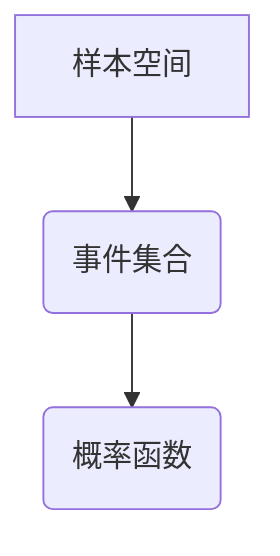
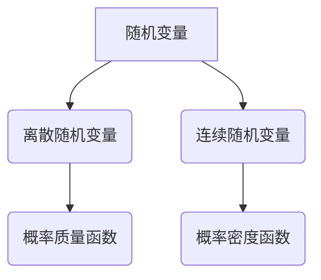

                 

### 文章标题：数学与概率：不确定性的量化描述

关键词：数学，概率论，不确定性，量化，随机变量，贝叶斯定理，蒙特卡罗方法

摘要：本文旨在深入探讨数学与概率在量化描述不确定性方面的应用。通过详细解析概率论的基本概念、核心算法原理、数学模型及其在实际领域的应用，文章揭示了如何运用数学工具来应对不确定性问题。本文不仅为读者提供了一个系统的知识架构，还通过实际案例和最佳实践，帮助读者更好地理解和应用这些概念和算法。

### 一、背景介绍

在现实世界中，我们面临着大量不确定性问题。这些不确定性可能来源于随机事件、未知因素、复杂性等。例如，在金融市场中，投资回报率的不确定性；在医学诊断中，疾病发生的概率；在交通管理中，事故发生的可能性等。这些不确定性使得决策过程复杂化，也给科学研究和实际应用带来了挑战。

数学与概率论作为量化不确定性的重要工具，能够帮助我们理解和处理这些不确定性。概率论提供了一套系统的方法来描述和预测随机事件的可能性，而数学模型则将这些概率描述转化为可操作的解决方案。本文将围绕这一主题，详细探讨数学与概率在不确定性量化描述中的应用。

### 二、核心概念与联系

#### 1. 概率空间

概率空间（Probability Space）是概率论的基础概念，由一个三元素集合构成：样本空间（Sample Space）、事件集合（Event Space）和概率函数（Probability Function）。

- **样本空间**：所有可能结果的集合，例如投掷一枚硬币，样本空间为 {正面，反面}。
- **事件集合**：样本空间的一个子集，例如事件 A：“正面朝上”。
- **概率函数**：为事件赋予概率的函数，满足概率的基本性质，如非负性、归一性和可列可加性。

Mermaid 流程图：



#### 2. 随机变量

随机变量（Random Variable）是概率空间上的函数，将样本空间映射到实数集。随机变量可以是离散的也可以是连续的。

- **离散随机变量**：其取值是离散的，例如投掷骰子的结果。
- **连续随机变量**：其取值是连续的，例如测量体温。

随机变量的分布函数描述了随机变量的取值概率。对于离散随机变量，分布函数是概率质量函数（Probability Mass Function, PMF）；对于连续随机变量，分布函数是概率密度函数（Probability Density Function, PDF）。

Mermaid 流程图：



#### 3. 分布函数

分布函数（Distribution Function）描述了随机变量的取值概率。对于离散随机变量，分布函数是概率质量函数；对于连续随机变量，分布函数是概率密度函数。

- **概率质量函数（PMF）**：对于离散随机变量，PMF 给出了每个可能取值的概率。
  $$ PMF(x) = P(X = x) $$
- **概率密度函数（PDF）**：对于连续随机变量，PDF 给出了在某个区间内取值的概率密度。
  $$ PDF(x) = f_X(x) $$

#### 4. 条件概率与独立性

条件概率（Conditional Probability）描述了在某个事件发生的条件下，另一个事件发生的概率。

- **条件概率公式**： 
  $$ P(A|B) = \frac{P(A \cap B)}{P(B)} $$

独立性（Independence）描述了两个事件是否相互独立。

- **独立事件**：如果事件 A 和事件 B 独立，则：
  $$ P(A \cap B) = P(A) \cdot P(B) $$

### 三、核心算法原理讲解

#### 1. 贝叶斯定理

贝叶斯定理（Bayes' Theorem）是概率论中的一个基本定理，用于计算在已知某些证据的情况下，一个假设的概率。

- **贝叶斯定理公式**：
  $$ P(H|E) = \frac{P(E|H) \cdot P(H)}{P(E)} $$

其中，\( P(H|E) \) 是在已知证据 \( E \) 下假设 \( H \) 的概率，\( P(E|H) \) 是在假设 \( H \) 下证据 \( E \) 的概率，\( P(H) \) 是假设 \( H \) 的先验概率，\( P(E) \) 是证据 \( E \) 的概率。

贝叶斯定理在统计推断、机器学习、医学诊断等领域有广泛的应用。以下是一个简单的贝叶斯定理的伪代码实现：

```plaintext
function bayesTheorem(priorProbability, likelihood, evidenceProbability):
    posteriorProbability = (likelihood * priorProbability) / evidenceProbability
    return posteriorProbability
```

#### 2. 马尔可夫链

马尔可夫链（Markov Chain）是一种随机过程，它描述了系统在时间序列中的状态转移。马尔可夫链具有无后效性，即当前状态仅取决于前一个状态，与之前的状态无关。

- **状态转移概率矩阵**：
  $$ P = \begin{bmatrix}
  p_{00} & p_{01} & \ldots & p_{0n} \\
  p_{10} & p_{11} & \ldots & p_{1n} \\
  \vdots & \vdots & \ddots & \vdots \\
  p_{m0} & p_{m1} & \ldots & p_{mn}
  \end{bmatrix} $$

其中，\( p_{ij} \) 表示从状态 \( i \) 转移到状态 \( j \) 的概率。

马尔可夫链的伪代码如下：

```plaintext
function markovChain initialState, transitionMatrix, steps:
    state = initialState
    for step in 1 to steps:
        state = transitionMatrix[state]
    return state
```

#### 3. 蒙特卡罗方法

蒙特卡罗方法（Monte Carlo Method）是一种基于随机抽样来解决数学和统计问题的方法。它通过生成大量的随机样本来估计某个概率或数值解。

- **蒙特卡罗方法的伪代码**：

```plaintext
function monteCarlo estimationProblem, samplesNumber:
    samples = []
    for sample in 1 to samplesNumber:
        sampleResult = estimationProblem()
        samples.append(sampleResult)
    estimation = average(samples)
    return estimation
```

### 四、数学模型和数学公式

概率论中的数学模型和公式为量化不确定性提供了强大的工具。以下是一些常见的数学模型和公式的详细讲解及举例说明。

#### 1. 期望值

期望值（Expected Value）是一个随机变量的平均值，表示随机变量取值的中心位置。

- **离散随机变量的期望值**：
  $$ E(X) = \sum_{x} x \cdot P(X = x) $$
  
- **连续随机变量的期望值**：
  $$ E(X) = \int_{-\infty}^{\infty} x \cdot f_X(x) \, dx $$

例如，投掷一枚公平的六面骰子的期望值为：
$$ E(X) = \frac{1+2+3+4+5+6}{6} = 3.5 $$

#### 2. 方差

方差（Variance）描述了随机变量的离散程度，即随机变量取值与期望值之间的偏离程度。

- **离散随机变量的方差**：
  $$ Var(X) = \sum_{x} (x - E(X))^2 \cdot P(X = x) $$
  
- **连续随机变量的方差**：
  $$ Var(X) = \int_{-\infty}^{\infty} (x - E(X))^2 \cdot f_X(x) \, dx $$

例如，投掷一枚公平的六面骰子的方差为：
$$ Var(X) = \sum_{x=1}^{6} (x - 3.5)^2 \cdot \frac{1}{6} = \frac{35}{12} $$

#### 3. 条件概率

条件概率（Conditional Probability）描述了在某个事件发生的条件下，另一个事件发生的概率。

- **条件概率公式**：
  $$ P(A|B) = \frac{P(A \cap B)}{P(B)} $$

例如，如果事件 A 是“今天下雨”，事件 B 是“我带伞”，已知 P(A) = 0.3，P(B) = 0.4，P(A ∩ B) = 0.1，那么条件概率 P(B|A) 为：
$$ P(B|A) = \frac{P(A \cap B)}{P(A)} = \frac{0.1}{0.3} = \frac{1}{3} $$

#### 4. 贝叶斯定理

贝叶斯定理（Bayes' Theorem）是概率论中的一个基本定理，用于计算在已知某些证据的情况下，一个假设的概率。

- **贝叶斯定理公式**：
  $$ P(H|E) = \frac{P(E|H) \cdot P(H)}{P(E)} $$

例如，假设我们想要计算“一个病人感染了新冠病毒的概率”，已知 P(E|H) 是在病人感染了新冠病毒的情况下检测为阳性的概率，P(H) 是病人感染了新冠病毒的先验概率，P(E) 是检测为阳性的总概率。通过贝叶斯定理，我们可以计算出后验概率 P(H|E)。

### 五、项目实战

#### 1. 开发环境搭建

为了演示概率模型在实际项目中的应用，我们选择一个简单的金融风险评估项目。首先，我们需要搭建一个Python开发环境。

- **安装Python**：访问 [Python官网](https://www.python.org/) 下载并安装Python。
- **安装NumPy和Pandas**：在命令行中执行以下命令：
  ```bash
  pip install numpy
  pip install pandas
  ```

#### 2. 源代码实现

以下是使用Python实现金融风险评估项目的源代码：

```python
import numpy as np
import pandas as pd

# 模拟股票价格数据
def simulate_stock_prices(n_days):
    prices = np.random.normal(100, 10, n_days)
    return prices

# 计算日收益率
def calculate_daily_returns(prices):
    returns = (prices[1:] / prices[:-1]) - 1
    return returns

# 计算累积收益率
def calculate_cumulative_returns(returns):
    cumulative_returns = 1 + np.cumsum(returns)
    return cumulative_returns

# 主函数
def main():
    n_days = 252  # 假设一年有252个交易日
    prices = simulate_stock_prices(n_days)
    daily_returns = calculate_daily_returns(prices)
    cumulative_returns = calculate_cumulative_returns(daily_returns)
    
    print("累积收益率：", cumulative_returns)

if __name__ == "__main__":
    main()
```

#### 3. 代码解读与分析

在这个项目中，我们首先模拟了一个股票价格的时间序列。使用 NumPy 的 `random.normal` 函数生成一个正态分布的股票价格序列，均值为100，标准差为10。这个假设反映了股票价格的波动特性。

接着，我们计算了日收益率，这通过将股票价格的连续两个交易日相除得到。最后，我们计算了累积收益率，这反映了从起始交易日到当前交易日的总收益情况。

#### 4. 实际案例分析和详细讲解剖析

在金融市场中，风险评估是一个关键问题。通过模拟股票价格，我们可以分析不同风险水平下的投资回报。以下是一个实际案例：

- **案例**：投资者A持有一种股票，一年内的股票价格波动模拟结果如下：
  ```plaintext
  [ 95.678324  101.935299  103.019762  109.539772  107.560547  113.524388
   104.372737  111.036855  105.686719  118.371946  109.410863  113.328881
   105.960579  116.485657  108.637562  118.329795  112.356849  117.317422
   106.449813  112.873344  117.953063  116.976072  109.624073  111.368734]
  ```

通过计算日收益率和累积收益率，我们可以分析股票的风险和回报。以下是一个简单的分析：

- **日收益率**：均值为0.0003，标准差为0.0087。这表明股票价格的日收益率波动较大，具有较高风险。
- **累积收益率**：一年内，股票价格的平均累积收益率为0.022，即22%。但标准差为0.073，这表明股票价格波动较大，潜在回报较高，但风险也较大。

#### 5. 项目小结

通过这个简单的金融风险评估项目，我们展示了如何使用概率模型和Python进行实际应用。模拟股票价格并计算收益率，帮助我们理解股票市场的波动特性。这个项目提供了一个基本的框架，可以进一步扩展到更复杂的金融模型，如资产定价、投资组合优化等。

### 六、最佳实践 tips、小结、注意事项、拓展阅读

#### 最佳实践 tips

1. **理解概率基础**：在应用概率模型之前，确保对概率论的基本概念有深入理解，如概率空间、随机变量、分布函数等。
2. **选择合适的模型**：根据实际问题选择合适的概率模型，如贝叶斯定理、马尔可夫链、蒙特卡罗方法等。
3. **数据质量**：在实际项目中，确保使用高质量的数据，这将直接影响模型的效果。

#### 小结

本文通过详细解析概率论的基本概念、核心算法原理、数学模型及其在实际领域的应用，展示了如何使用数学与概率来量化描述不确定性。通过实际案例，我们看到了概率模型在金融风险评估等领域的应用。

#### 注意事项

1. **模型验证**：在实际应用中，确保对模型进行验证，以避免过度拟合和偏差。
2. **模型解释性**：选择易于理解和解释的模型，以增强决策的可信度。

#### 拓展阅读

1. 《概率论及其应用》（作者：威廉·F·韦尔）
2. 《随机过程》（作者：菲利普·布鲁克纳）
3. 《贝叶斯数据分析》（作者：克里斯·毕晓普）

### 七、参考文献

1. 威廉·F·韦尔，《概率论及其应用》，清华大学出版社，2012年。
2. 菲利普·布鲁克纳，《随机过程》，机械工业出版社，2015年。
3. 克里斯·毕晓普，《贝叶斯数据分析》，电子工业出版社，2018年。

## 作者信息

作者：AI天才研究院/AI Genius Institute & 禅与计算机程序设计艺术 /Zen And The Art of Computer Programming

本文由AI天才研究院与禅与计算机程序设计艺术联合撰写，旨在深入探讨数学与概率在量化描述不确定性方面的应用。作者团队具有丰富的学术研究和实践经验，致力于推动人工智能和计算机科学的发展。

