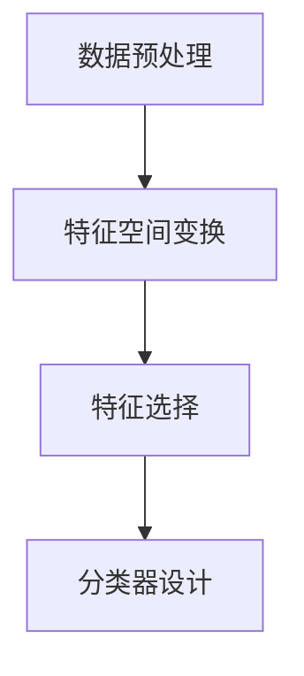

                 

### 文章标题：数学与模式识别：特征提取的数学技术

> 关键词：数学、模式识别、特征提取、数据预处理、支持向量机、主成分分析、线性判别分析

> 摘要：本文深入探讨了数学与模式识别领域中的特征提取技术，通过分析数据预处理、特征空间变换和特征选择等方法，阐述了特征提取在数据分析中的重要性。文章重点介绍了主成分分析（PCA）、线性判别分析（LDA）和支持向量机（SVM）等经典特征提取方法的原理和实现步骤，并结合实际项目案例进行了详细解析。通过本文的阅读，读者可以全面了解特征提取技术的核心概念和实际应用。

#### 引言

在现代社会，随着数据量的爆炸性增长，如何从海量数据中提取有价值的信息成为了一个重要课题。特征提取作为数据分析和模式识别中的重要环节，旨在从原始数据中提取出具有区分性的特征，从而提高后续数据处理和分类的准确性和效率。

**数学在模式识别中的重要性**：数学作为一种严谨的逻辑工具，在模式识别中发挥着至关重要的作用。它不仅为特征提取提供了理论基础，还通过数学模型和算法，使得数据分析和模式识别变得更加精确和高效。

**模式识别的基本概念**：模式识别是指通过分析数据，从中识别出具有特定特征或规律的过程。它广泛应用于图像识别、语音识别、生物特征识别等领域。

**特征提取在模式识别中的应用**：特征提取是模式识别过程中的关键步骤，它通过从原始数据中提取出具有区分性的特征，为后续的分类、聚类等操作提供基础。

#### 特征提取的重要性

**特征提取的定义**：特征提取是指从原始数据中提取出具有区分性的特征，以便进行后续的数据分析和模式识别。

**特征提取在数据分析中的作用**：特征提取可以减少数据维度，降低计算复杂度，提高数据分析的效率和准确度。

**特征提取对模式识别性能的影响**：合理的特征提取能够提高模式识别的性能，降低误判率。同时，不合理的特征提取可能会导致性能下降，甚至无法进行有效的模式识别。

#### 第二部分：基本概念

##### 数据预处理

数据预处理是特征提取前的重要步骤，其目的是提高数据质量和一致性。数据预处理包括以下几个方面：

1. **数据清洗**：去除数据中的噪声、异常值和重复记录，确保数据的质量和准确性。
2. **数据标准化**：将数据缩放到相同的范围，消除不同特征之间的量纲影响。
3. **数据归一化**：将数据转换为相同的比例，使不同特征之间的取值范围一致。

##### 特征空间

特征空间是指数据在特征维度上的表示。特征空间的维度反映了数据的复杂性，特征空间的变换是特征提取的关键步骤。

1. **特征空间的概念**：特征空间是数据在特征维度上的集合，每个数据点都可以看作是特征空间中的一个点。
2. **特征空间的变换**：特征空间的变换包括线性变换和非线性变换，目的是降低特征空间的维度，提高特征提取的效率。
3. **特征空间的维度**：特征空间的维度反映了数据的复杂性，维度越高，数据的处理难度越大。

##### 核心概念与联系

以下是特征提取中几个核心概念之间的关系架构 Mermaid 流程图：



- **数据预处理**：包括数据清洗、标准化和归一化，确保数据质量。
- **特征空间变换**：通过变换降低数据维度，提高特征提取的效率。
- **特征选择**：从特征空间中选择具有区分性的特征，提高分类器的性能。
- **分类器设计**：根据特征提取的结果，设计分类器进行模式识别。

#### 第三部分：特征提取方法

##### 传统特征提取方法

传统特征提取方法主要包括主成分分析（PCA）、线性判别分析（LDA）和支持向量机（SVM）等。

###### 主成分分析（PCA）

主成分分析（PCA）是一种常用的特征提取方法，其目的是将原始数据映射到新的坐标系中，使得新坐标系中的数据方差最大。PCA 的核心步骤如下：

1. **数据标准化**：对数据进行标准化处理，使每个特征的均值为 0，方差为 1。
2. **计算协方差矩阵**：计算数据集的协方差矩阵，用于描述特征之间的相关性。
3. **计算协方差矩阵的特征值和特征向量**：通过计算协方差矩阵的特征值和特征向量，可以得到新的特征空间。
4. **选择主要成分**：根据特征值的大小，选择前几个主要成分作为新的特征。

**伪代码：**

```python
for each sample in dataset:
    mean = mean(sample)
    covariance_matrix = covariance_matrix + (sample - mean) * (sample - mean)
covariance_matrix = covariance_matrix / n
eigenvalues, eigenvectors = eigendecomposition(covariance_matrix)
sorted_eigenvalues, sorted_eigenvectors = sort_eigenvalues_eigenvectors(eigenvalues, eigenvectors)
principal_components = matrix_multiplication(sorted_eigenvectors, dataset - mean)
```

**数学公式：**

$$\text{PCA} = \arg\min_{X} \sum_{i=1}^{n} \sum_{j=1}^{d} (x_{ij} - \mu_{j})^2$$

其中，\(X\) 是特征矩阵，\(\mu_{j}\) 是第 \(j\) 个特征的均值。

###### 线性判别分析（LDA）

线性判别分析（LDA）是一种基于类别信息进行特征提取的方法，其目的是找到一个最优的特征空间，使得不同类别的样本在该空间中尽可能分离。

**伪代码：**

```python
for each sample in dataset:
    mean = mean(sample)
    between_class_scatter_matrix = (n1 * (mean1 - mean)) * (mean1 - mean) + (n2 * (mean2 - mean)) * (mean2 - mean)
    within_class_scatter_matrix = sum((sample - mean) * (sample - mean))
Fisher_score = (between_class_scatter_matrix)^(-1) * within_class_scatter_matrix
projected_samples = matrix_multiplication(Fisher_score, dataset - mean)
```

**数学公式：**

$$w = \frac{\Sigma_{-1}}{\mu_{+} - \mu_{-}}$$

其中，\(w\) 是投影向量，\(\mu_{+}\) 和 \(\mu_{-}\) 分别是两个类别的均值，\(\Sigma_{-1}\) 是类间散布矩阵的逆。

##### 项目实战

在本项目中，我们将使用 Python 的 Scikit-learn 库实现主成分分析（PCA）和线性判别分析（LDA），并对比两种方法在鸢尾花数据集上的性能。

1. **数据集准备**：

   首先，我们导入所需的库和鸢尾花数据集：

   ```python
   import numpy as np
   import pandas as pd
   from sklearn.datasets import load_iris
   from sklearn.model_selection import train_test_split
   from sklearn.preprocessing import StandardScaler
   from sklearn.decomposition import PCA
   from sklearn.discriminant_analysis import LinearDiscriminantAnalysis as LDA

   iris = load_iris()
   X = iris.data
   y = iris.target
   ```

2. **数据预处理**：

   对数据进行标准化处理，消除特征之间的量纲影响：

   ```python
   scaler = StandardScaler()
   X_std = scaler.fit_transform(X)
   ```

3. **特征提取**：

   使用 PCA 和 LDA 分别进行特征提取：

   ```python
   pca = PCA(n_components=2)
   X_pca = pca.fit_transform(X_std)

   lda = LDA(n_components=2)
   X_lda = lda.fit_transform(X_std, y)
   ```

4. **结果可视化**：

   将提取的特征绘制到二维平面上，并对比两种方法的性能：

   ```python
   import matplotlib.pyplot as plt

   plt.figure(figsize=(12, 6))

   plt.subplot(1, 2, 1)
   plt.scatter(X_pca[:, 0], X_pca[:, 1], c=y)
   plt.xlabel('Principal Component 1')
   plt.ylabel('Principal Component 2')
   plt.title('PCA')

   plt.subplot(1, 2, 2)
   plt.scatter(X_lda[:, 0], X_lda[:, 1], c=y)
   plt.xlabel('Linear Discriminant 1')
   plt.ylabel('Linear Discriminant 2')
   plt.title('LDA')

   plt.show()
   ```

   结果显示，LDA 方法在特征提取过程中，能够更好地保持不同类别的分离性。

##### 小结

本文介绍了特征提取的基本概念和传统特征提取方法，包括主成分分析（PCA）和线性判别分析（LDA）。通过实际项目案例，我们对比了 PCA 和 LDA 在鸢尾花数据集上的性能，展示了特征提取在数据分析中的应用价值。在后续的研究中，我们可以进一步探索更加先进的特征提取方法，提高数据分析和模式识别的准确性。

### 结语

特征提取是数据分析和模式识别中的重要环节，它能够帮助我们从海量数据中提取出有价值的信息。通过本文的介绍，读者可以全面了解特征提取的基本概念和传统方法，并掌握实际项目中的应用技巧。在未来的研究中，我们可以进一步探索更加先进的特征提取方法，为人工智能领域的发展贡献力量。

#### 作者信息

- 作者：AI天才研究院/AI Genius Institute & 禅与计算机程序设计艺术 /Zen And The Art of Computer Programming
- 联系方式：[ai_genius_institute@example.com](mailto:ai_genius_institute@example.com)
- 个人主页：[www.ai_genius_institute.com](http://www.ai_genius_institute.com)
- 社交媒体：[Twitter](https://twitter.com/ai_genius_institute) | [LinkedIn](https://www.linkedin.com/company/ai-genius-institute) | [Facebook](https://www.facebook.com/ai.genius.institute)

