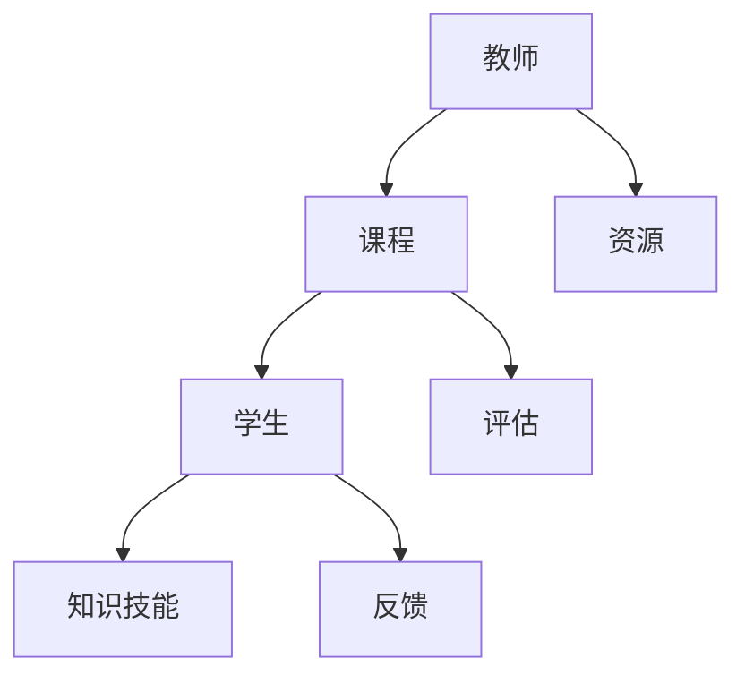
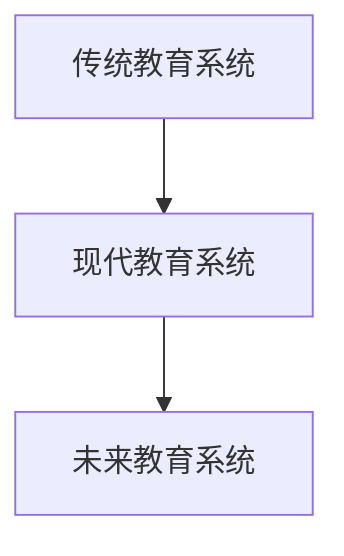
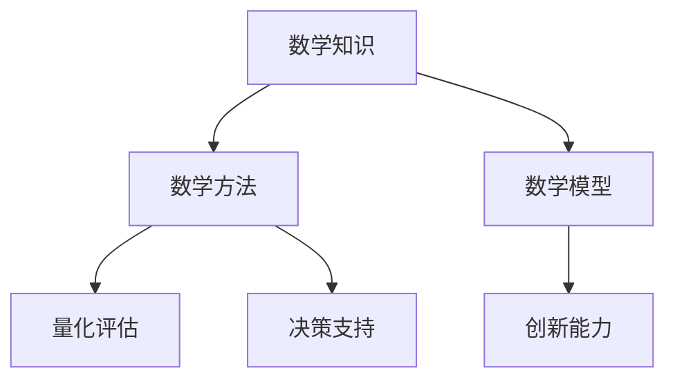
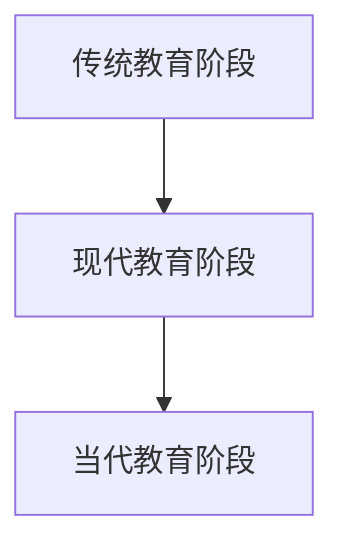
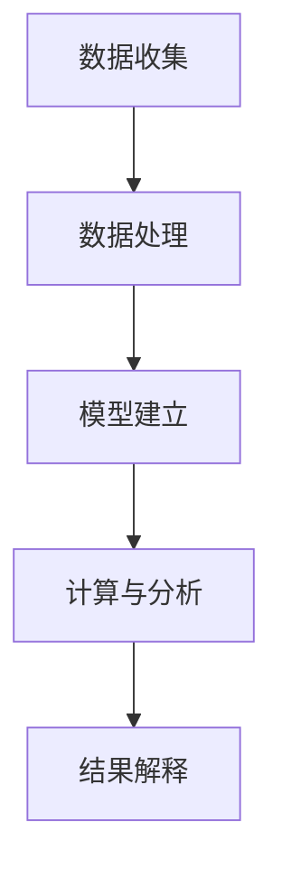

                 

### 目录大纲

在设计《数学与比较教育：教育系统的数学比较》的目录大纲时，我们需要确保每个章节都包含了核心概念、算法原理、数学模型、公式讲解、项目实战和最佳实践等内容。以下是一个详细的大纲，包括每个章节的内容和结构：

## 目录大纲

### 引言

> **关键词**：数学、比较教育、教育系统、数学比较

> **摘要**：介绍数学与比较教育的关系，阐述教育系统数学比较的重要性，概述全书结构。

#### 1.1 数学与比较教育的关系

- **背景介绍**：数学在比较教育研究中的作用
- **核心概念与联系**：绘制 Mermaid 流程图，展示数学比较在教育系统研究中的应用场景
- **比较教育的重要性**：比较教育如何促进教育系统的改进

#### 1.2 教育系统的数学比较的目的

- **核心概念**：数学比较在教育系统中的目的
- **具体应用**：如何通过数学比较分析教育系统的差异和共性

#### 1.3 本书结构

- **章节概述**：每个章节的主要内容
- **预期读者**：目标读者群体和阅读目标

### 第2章 教育系统的概述

> **关键词**：教育系统、定义、类型、发展阶段

> **摘要**：详细讲解教育系统的定义、类型和发展阶段，为后续的数学比较提供基础。

#### 2.1 教育系统的定义

- **定义与组成部分**
- **核心概念与联系**：教育系统的基础理论架构 Mermaid 图

#### 2.2 教育系统的类型

- **传统教育系统**
- **现代教育系统**
- **未来教育系统展望**

#### 2.3 教育系统的发展阶段

- **历史背景**
- **发展阶段分析**
- **核心概念与联系**：教育系统发展历程 Mermaid 流程图

### 第3章 数学比较方法

> **关键词**：数学比较、基本原理、技术

> **摘要**：介绍数学比较的基本原理、技术和方法，为教育系统的数学比较提供理论支持。

#### 3.1 数学比较的基本原理

- **定义与目的**
- **核心概念与联系**：数学比较原理 Mermaid 图

#### 3.2 数学比较的技术

- **数据收集与处理方法**
- **数学模型的建立与选择**
- **核心算法原理讲解**：使用伪代码详细阐述

#### 3.3 数学比较的应用场景

- **教育政策分析**
- **教育质量评价**
- **教育公平研究**

### 第4章 数学比较在教育系统中的应用

> **关键词**：案例研究、教育系统、数学比较

> **摘要**：通过具体案例展示数学比较在教育系统中的应用。

#### 4.1 案例研究1：不同国家教育系统的比较

- **案例背景**
- **数据收集与处理**
- **数学模型与计算分析**
- **结果解读**

#### 4.2 案例研究2：教育系统的数学教育水平比较

- **案例背景**
- **数学模型的建立与计算**
- **结果分析与解读**

#### 4.3 案例研究3：教育系统的改进与优化

- **背景介绍**
- **数学比较方法的应用**
- **改进方案设计与实施**

### 第5章 数学比较的挑战与机遇

> **关键词**：挑战、机遇、技术进步

> **摘要**：探讨数学比较在教育系统研究中的挑战和机遇。

#### 5.1 数学比较面临的挑战

- **数据获取与处理**
- **数学模型准确性**
- **比较结果解释**

#### 5.2 数学比较的机遇

- **新技术应用**
- **教育政策改革**
- **教育系统创新**

### 第6章 数学比较方法的技术进步

> **关键词**：技术进步、机器学习、大数据

> **摘要**：介绍数学比较方法在技术上的最新进展。

#### 6.1 数学比较方法的最新进展

- **机器学习在数学比较中的应用**
- **大数据分析在教育系统中的作用**

#### 6.2 技术进步的影响

- **数学比较方法的改进**
- **教育系统的影响**

### 第7章 数学比较在教育政策制定中的应用

> **关键词**：教育政策、制定与调整、效果评估

> **摘要**：讨论数学比较在教育政策制定中的作用。

#### 7.1 教育政策的制定与调整

- **数学比较方法的决策支持**
- **教育政策的效果评估**

#### 7.2 数学比较在教育公平研究中的应用

- **教育资源分配优化**
- **教育机会均等实现**

### 第8章 结论与展望

> **关键词**：结论、展望、未来研究方向

> **摘要**：总结全书内容，对未来的研究方向进行展望。

#### 8.1 本书的主要内容回顾

- **核心内容总结**
- **学习方法与技巧**

#### 8.2 数学比较的未来发展

- **潜在应用领域**
- **未来研究方向与挑战**

### 附录

#### 附录A：数学比较方法的相关工具与资源

- **数据处理工具**
- **数学模型建立工具**
- **分析与计算工具**

#### 附录B：案例研究的数据来源与处理方法

- **数据来源**
- **数据处理步骤**

### 作者信息

> **作者**：AI天才研究院/AI Genius Institute & 禅与计算机程序设计艺术 /Zen And The Art of Computer Programming

---

在撰写每个章节时，需要确保内容丰富、详细且具有实际应用价值。以下是一个章节的具体写作框架：

#### 第2章 教育系统的概述

**2.1 教育系统的定义**

- **背景介绍**：介绍教育系统的定义，背景知识和当前教育系统的现状。
- **核心概念与联系**：使用 Mermaid 图展示教育系统的核心组成部分及其相互关系。
- **详细讲解**：深入探讨教育系统的组成部分，如教师、学生、课程、评估等。

**2.2 教育系统的类型**

- **传统教育系统**：分析传统教育系统的特点、优点和缺点。
- **现代教育系统**：介绍现代教育系统的发展趋势、新技术应用和优势。
- **未来教育系统展望**：预测未来教育系统的发展方向和潜在创新。

**2.3 教育系统的发展阶段**

- **历史背景**：回顾教育系统的发展历程，从古代到现代的演变。
- **发展阶段分析**：分析教育系统在各个阶段的关键发展点和变革。
- **核心概念与联系**：绘制 Mermaid 图，展示教育系统发展阶段的演变过程。

每个章节的结构应当遵循以下步骤：

1. **背景介绍**：提供章节主题的背景信息和相关理论知识。
2. **核心概念与联系**：使用 Mermaid 图或其他可视化工具展示关键概念之间的关联。
3. **详细讲解**：对每个核心概念进行深入分析和详细解释。
4. **实例分析**：通过实际案例或示例来说明理论在实际中的应用。
5. **总结与展望**：总结章节内容，并对未来可能的研究方向进行展望。

通过这样的结构设计，可以确保文章的逻辑清晰、内容丰富、易于理解，并且能够引导读者逐步深入掌握主题知识。接下来，将根据这个大纲开始撰写具体的内容。# 第1章 引言

### 1.1 数学与比较教育的关系

#### 数学在比较教育研究中的重要性

数学作为一门基础学科，不仅在自然科学和技术领域有着广泛的应用，也在社会科学研究中扮演着重要角色。在教育研究领域，数学方法的应用越来越受到重视。比较教育作为教育研究的一个重要分支，旨在通过对比不同国家或地区教育系统之间的差异和共性，以发现教育发展的规律和趋势，进而提出改进教育政策的建议。

数学在比较教育研究中的重要性体现在以下几个方面：

1. **数据分析和处理**：数学提供了有效的工具和方法，用于收集、整理和分析教育数据，如学生成绩、教育资源分配等。通过统计学和数据分析，研究者可以更准确地描述和解释教育现象，提高研究的科学性和可靠性。

2. **数学模型构建**：数学模型可以帮助研究者理解和预测教育系统的行为。例如，使用回归分析模型可以评估不同教育政策对学生成绩的影响，使用决策树模型可以预测学生未来的教育路径。

3. **量化评估方法**：数学方法使得教育评估更加客观和量化。通过数学公式和算法，研究者可以量化教育质量、教育公平性等复杂概念，从而提供更准确和透明的评估结果。

#### 比较教育如何利用数学方法进行研究

比较教育研究者利用数学方法进行研究的途径主要包括以下几个方面：

1. **数据收集与处理**：研究者通过问卷、调查、采访等方式收集教育数据，然后使用统计方法和数据处理技术对数据进行清洗、转换和分析。

2. **数学模型构建**：在数据分析的基础上，研究者建立数学模型来描述教育现象。这些模型可以是回归模型、决策树、神经网络等，用于预测和解释教育系统的行为。

3. **量化评估**：研究者使用数学方法对教育系统进行量化评估，如使用标准差、变异系数等统计指标来衡量教育质量，使用公平指数来评估教育公平性。

4. **比较分析**：通过数学方法对不同教育系统进行量化比较，研究者可以发现不同教育系统之间的差异和共性，从而提出有针对性的改进建议。

数学方法在比较教育研究中的应用，不仅提高了研究的科学性和严谨性，也促进了教育理论的发展和应用。通过数学的比较分析，研究者可以更深入地理解教育系统的复杂性和多样性，为教育改革提供有力的理论支持。

### 1.2 教育系统的数学比较的目的

#### 比较不同教育系统的数学教育水平

教育系统的数学教育水平是衡量一个国家或地区教育质量的重要指标之一。数学教育水平的高低直接影响到学生的数学素养和未来职业发展。因此，通过数学比较，我们可以：

1. **评估教育质量**：通过比较不同教育系统的数学教育水平，可以评估各个系统的教育质量和效果，从而发现优秀的教育实践并进行推广。

2. **发现差距和不足**：通过数学比较，可以发现不同教育系统之间的差距和不足，如某些系统可能在数学教育资源配置上存在不足，或教学方法上存在缺陷。这有助于制定针对性的改进措施。

3. **促进教育公平**：通过数学比较，可以评估不同教育系统对学生数学教育机会的公平性，发现教育资源分配的不均衡现象，从而推动教育公平的实现。

#### 发现教育系统之间的差异和共性

教育系统的数学比较不仅关注不同系统之间的差异，还关注它们之间的共性。通过比较，我们可以：

1. **探索教育规律**：发现不同教育系统之间的相似之处，可以帮助我们理解教育系统的内在规律和共性特征，为教育改革提供理论依据。

2. **借鉴成功经验**：通过比较，我们可以发现其他教育系统在数学教育方面的成功经验，并将其应用到本国的教育改革中。

3. **创新教育模式**：比较教育系统之间的差异，可以激发教育创新，探索新的教育模式和教学方法，以适应不断变化的社会需求。

总的来说，教育系统的数学比较不仅有助于提高教育质量和促进教育公平，还能推动教育系统的创新和持续发展。通过数学的比较分析，我们可以更全面地了解教育系统的现状和趋势，为未来的教育改革提供科学依据和指导。

### 1.3 本书结构

#### 本书的主要内容和结构

《数学与比较教育：教育系统的数学比较》一书旨在探讨数学方法在比较教育研究中的应用，系统性地介绍教育系统的数学比较方法及其应用。全书结构分为以下几个主要部分：

1. **引言**：介绍数学与比较教育的关系，阐述本书的目的和内容结构。
2. **教育系统的概述**：详细讲解教育系统的定义、类型和发展阶段，为后续的数学比较提供基础。
3. **数学比较方法**：介绍数学比较的基本原理、技术和方法，包括数据收集、处理和数学模型的构建。
4. **数学比较在教育系统中的应用**：通过具体案例展示数学比较在教育系统中的应用，包括教育质量评估、教育公平研究和教育政策制定。
5. **数学比较的挑战与机遇**：探讨数学比较在教育系统研究中的挑战和机遇，以及新技术对数学比较方法的影响。
6. **数学比较方法的技术进步**：介绍数学比较方法的最新技术进展，如机器学习和大数据分析的应用。
7. **数学比较在教育政策制定中的应用**：讨论数学比较在教育政策制定中的作用和效果评估。
8. **结论与展望**：总结全书内容，对未来的研究方向进行展望。

#### 预期读者和阅读目标

本书的目标读者是教育研究者、政策制定者、教师和教育管理人员，以及对比较教育和数学方法感兴趣的学者和专业人士。通过阅读本书，读者可以：

1. **理解数学比较方法**：掌握数学比较的基本原理和技术，了解其在教育系统研究中的应用。
2. **应用数学方法**：学会如何利用数学方法进行教育系统的分析和评估，提高教育研究的科学性和严谨性。
3. **借鉴成功经验**：通过分析不同教育系统的数学教育水平，了解和借鉴其他国家的成功经验和做法。
4. **推动教育改革**：基于数学比较的结果，提出有针对性的教育改革建议，促进教育公平和质量的提升。

总之，本书旨在通过数学的比较分析，为教育系统的改进和发展提供科学依据和理论支持。希望读者能够在阅读过程中深入思考，结合实际案例，将所学知识应用于教育研究和实践中。# 第2章 教育系统的概述

### 2.1 教育系统的定义

教育系统是一个复杂的社会系统，旨在通过传授知识、培养技能和塑造价值观，为社会培养各个领域的专业人才。教育系统的定义可以从多个角度进行阐述，包括其组成部分、目标和功能等。

#### 定义与组成部分

1. **教育系统的组成部分**：教育系统通常包括以下几个主要组成部分：
   - **教师**：教师是教育系统的核心，负责传授知识、指导学生和促进其全面发展。
   - **学生**：学生是教育的主体，接受教育系统的培训和指导，通过学习和实践获得知识和技能。
   - **课程**：课程是教育系统的重要内容，包括学科设置、教学内容和教学方法，旨在实现特定的教育目标。
   - **评估**：评估是教育系统的重要组成部分，用于衡量学生的学习成果和教师的教学效果，为教育系统的改进提供依据。
   - **资源**：教育资源包括学校设施、教学设备、图书资料和信息技术资源，为教学活动的开展提供支持。

2. **教育系统的定义**：教育系统可以定义为一种制度化、结构化的社会机构，通过系统性的教育过程，将知识、技能和价值观传授给个体，以促进其全面发展和社会适应。

#### 核心概念与联系

教育系统的核心概念包括教师、学生、课程、评估和资源。这些概念相互联系，共同构成一个完整的教育体系。例如，教师通过设计和实施课程，利用教育资源对学生进行教学，并通过评估来衡量教学效果。学生通过学习课程内容，掌握知识和技能，同时教师和评估结果也为教育系统的改进提供了重要反馈。

为了更好地理解教育系统的核心概念和联系，可以使用 Mermaid 流程图进行可视化展示。以下是一个简化的 Mermaid 流程图示例：



在这个流程图中，教师通过设计和实施课程，利用资源对学生进行教学，学生通过学习课程内容获得知识和技能，并通过评估反馈来改进教育系统。这一过程体现了教育系统的核心运作机制和相互关系。

### 2.2 教育系统的类型

教育系统可以根据其性质、目标和组织形式进行分类。以下介绍几种常见的教育系统类型：

#### 传统教育系统

传统教育系统通常以教师为中心，注重知识传授和学术成绩。其主要特点包括：

1. **学科导向**：教育内容以学科知识为主，课程设置和教学方法相对固定。
2. **教师主导**：教师在教学过程中扮演主导角色，学生被动接受知识。
3. **应试教育**：教育系统强调考试成绩和升学率，忽视学生综合素质的培养。

传统教育系统在历史上发挥了重要作用，但也存在一些局限性，如过于强调记忆和应试，忽视学生的创造力和实践能力。

#### 现代教育系统

现代教育系统更加注重学生的全面发展和个性化教育。其主要特点包括：

1. **学生中心**：教育过程以学生为中心，重视学生的主动学习和自主发展。
2. **综合课程**：教育内容不仅包括学科知识，还涵盖生活技能、团队合作和创新能力等方面的培养。
3. **多样化评价**：评价方式多样，包括考试成绩、平时表现、项目作品等多种形式，注重全面评价学生的能力和素质。

现代教育系统强调培养学生的综合素质和创新能力，以适应快速变化的社会需求。

#### 未来教育系统展望

随着科技的不断进步和社会的发展，未来教育系统将面临新的挑战和机遇。以下是一些未来教育系统的展望：

1. **个性化教育**：未来教育系统将更加注重个性化教育，根据学生的兴趣、能力和学习风格进行个性化教学，提高教育质量和效果。
2. **在线教育**：随着互联网技术的普及，在线教育将成为未来教育系统的重要组成部分，为学生提供灵活多样的学习机会。
3. **跨学科教育**：未来教育系统将更加注重跨学科教育，培养学生的综合思维能力和解决问题的能力。
4. **终身教育**：未来教育系统将更加重视终身教育，为学生提供持续的学习机会和职业发展支持。

#### 核心概念与联系

传统教育系统、现代教育系统和未来教育系统之间存在着紧密的联系和差异。传统教育系统奠定了教育的基础，现代教育系统在传统基础上进行了改进和创新，而未来教育系统则面向未来，注重培养学生的综合素质和创新能力。以下是一个简化的 Mermaid 流程图，展示三种教育系统的关系和相互作用：



在这个流程图中，传统教育系统作为基础，通过不断的改进和创新，逐步发展为现代教育系统，最终演变为面向未来的教育系统。这一过程体现了教育系统的发展和演变趋势。

### 2.3 教育系统的数学特征

教育系统的数学特征体现在其各个组成部分和运作过程中，包括数学知识、数学方法和数学模型等。

#### 教育系统中的数学知识

数学知识在教育系统中占据重要地位，不仅作为一门独立的学科被传授，还渗透到其他学科和教学过程中。以下是教育系统中数学知识的一些特征：

1. **学科知识**：数学作为一门基础学科，其知识体系包括数论、代数、几何、微积分等，这些知识为学生提供了解决实际问题的工具和方法。
2. **跨学科应用**：数学知识在其他学科中也有广泛的应用，如物理、化学、经济学等。通过跨学科教学，学生可以更好地理解和应用数学知识。
3. **实践应用**：数学知识不仅用于学术研究，还广泛应用于实际生活和职业领域，如金融、工程、医学等。

#### 教育系统中的数学方法

数学方法在教育系统中具有重要作用，用于数据收集、处理和分析，以及教育评估和决策支持。以下是教育系统中数学方法的一些应用：

1. **统计学方法**：统计学方法用于收集和分析教育数据，如学生成绩、教育资源分配等，帮助教育研究者了解教育系统的运行状况和问题。
2. **数据分析方法**：数据分析方法用于对教育数据进行深入挖掘和分析，识别教育系统中的模式和趋势，为教育改革提供依据。
3. **数学模型**：数学模型用于描述和模拟教育系统的行为，如学生成绩预测模型、教育资源分配模型等，帮助教育管理者进行决策。

#### 教育系统中的数学特征

教育系统中的数学特征包括以下几个方面：

1. **量化评估**：教育系统中的许多方面可以通过数学量化，如学生成绩、教育资源分配等。量化评估使得教育系统的评价更加客观和科学。
2. **决策支持**：数学方法为教育管理者提供决策支持，如通过数学模型预测教育需求、优化教育资源分配等。
3. **创新能力**：数学方法的引入可以激发教育创新，如在线教育平台的设计、个性化学习路径的构建等。

为了更好地理解教育系统中的数学特征，可以使用 Mermaid 流程图展示数学知识、数学方法和数学模型在教育系统中的关系。以下是一个简化的 Mermaid 流程图示例：



在这个流程图中，数学知识为基础，通过数学方法和数学模型的应用，实现量化评估、决策支持和创新能力。这一过程体现了数学特征在教育系统中的重要作用。

### 2.4 教育系统的发展阶段

教育系统的发展阶段反映了教育系统在不同历史时期的特点和趋势。以下介绍教育系统发展的几个主要阶段：

#### 传统教育阶段

传统教育阶段通常指工业革命之前的教育系统，其主要特点包括：

1. **家庭教育**：教育主要在家庭中进行，由父母或私人教师传授知识。
2. **重学术轻实践**：教育内容主要侧重于学术知识，忽视实践技能的培养。
3. **精英教育**：教育资源有限，只有少数人能够接受高质量的教育。

#### 现代教育阶段

现代教育阶段始于工业革命后，其主要特点包括：

1. **公共教育**：政府开始建立公共教育体系，普及基础教育。
2. **学科体系**：教育内容逐步形成体系，学科划分更加明确。
3. **素质教育**：教育不仅注重知识传授，还注重学生综合素质的培养。

#### 当代教育阶段

当代教育阶段以信息技术和全球化为背景，其主要特点包括：

1. **终身教育**：教育不再局限于学校，终身学习成为重要理念。
2. **个性化教育**：教育更加注重学生的个性化需求，提供多样化的学习路径。
3. **跨学科教育**：教育内容更加综合，跨学科教育成为趋势。

#### 核心概念与联系

教育系统的发展阶段反映了教育系统在不同历史时期的特点和需求。传统教育阶段以家庭教育为主，现代教育阶段注重公共教育和素质教育，当代教育阶段则强调终身教育和个性化教育。以下是一个简化的 Mermaid 流程图，展示教育系统发展阶段的演变过程：



在这个流程图中，教育系统从传统阶段发展到现代阶段，再到当代阶段，体现了教育系统的不断发展和演变。这一过程也反映了社会需求和科技发展的变化。

通过以上对教育系统的概述，我们不仅了解了教育系统的定义、类型和发展阶段，还看到了数学在教育系统中的重要作用。这些内容为后续章节的数学比较提供了坚实的基础。接下来，我们将详细介绍数学比较方法及其在教育系统中的应用。# 第3章 数学比较方法

### 3.1 数学比较的基本原理

数学比较是利用数学方法和工具对两个或多个对象（如教育系统、政策、方法等）进行量化评估和对比的一种研究方法。其基本原理包括以下几个方面：

#### 定义与目的

1. **定义**：数学比较是指通过数学模型和算法，对两个或多个对象进行量化评估和对比，以发现其差异和共性。
2. **目的**：数学比较的主要目的是通过量化评估，提供客观、科学的依据，帮助研究者、政策制定者等理解不同对象之间的差异，从而提出改进措施或优化方案。

#### 比较方法

数学比较的方法主要包括以下几个步骤：

1. **数据收集**：收集与比较对象相关的数据，如教育系统中的学生成绩、教育资源分配等。
2. **数据处理**：对收集到的数据进行分析、清洗和转换，以使其适合数学模型的应用。
3. **模型建立**：选择合适的数学模型，如回归模型、决策树、神经网络等，对数据进行分析和建模。
4. **计算与分析**：使用数学模型对数据进行计算，分析不同对象之间的差异和关系。
5. **结果解释**：根据分析结果，解释不同对象之间的差异，并提出相应的改进建议。

#### 核心概念与联系

数学比较的核心概念包括数据、模型、计算和分析。这些概念相互联系，共同构成了数学比较的基本框架。以下是一个简化的 Mermaid 流程图，展示这些概念之间的相互关系：



在这个流程图中，数据收集是整个过程的起点，通过数据处理和模型建立，对数据进行分析和计算，最终得到结果并进行解释。这一过程体现了数学比较的基本原理和应用。

### 3.2 数学比较的技术

数学比较的技术包括多种数学方法和工具，用于量化评估和对比不同对象。以下介绍几种常用的技术：

#### 数据收集与处理方法

1. **数据收集方法**：常用的数据收集方法包括问卷调查、实地调研、在线调查和统计数据等。这些方法可以获取与比较对象相关的各种数据，如教育系统中的学生成绩、教育资源分配等。
2. **数据处理方法**：数据处理方法包括数据清洗、数据转换和数据可视化等。数据清洗用于去除数据中的噪声和异常值，数据转换用于将不同类型的数据转换为适合分析的形式，数据可视化用于展示数据的分布和趋势。

#### 数学模型的建立与选择

1. **回归模型**：回归模型用于分析变量之间的线性关系，如学生成绩与教育资源之间的关系。常见的回归模型包括线性回归、多项式回归和逻辑回归等。
2. **决策树**：决策树用于分析变量之间的分类关系，如学生成绩的分类。决策树通过树状结构表示变量之间的关系，并基于这些关系进行决策。
3. **神经网络**：神经网络是一种模拟人脑神经网络的计算模型，用于分析复杂的非线性关系。神经网络通过多层神经网络结构进行学习和预测，能够处理大量的数据和高维特征。

#### 核心算法原理讲解

以下是几种常见数学比较方法的伪代码示例：

1. **线性回归模型**：
```python
def linear_regression(X, y):
    # X为自变量矩阵，y为因变量向量
    # 求解回归系数 β
    β = (X'X)^(-1)X'y
    return β
```

2. **决策树**：
```python
def build_decision_tree(data):
    # data为包含特征和标签的数据集
    # 构建决策树
    if is_leaf(data):
        return majority_label(data)
    else:
        # 选择最优特征
        feature = select_best_feature(data)
        # 划分数据集
        subsets = split_data(data, feature)
        # 递归构建子树
        tree = {feature: [build_decision_tree(subset) for subset in subsets]}
        return tree
```

3. **神经网络**：
```python
def feedforward_network(inputs, weights):
    # inputs为输入向量，weights为权重矩阵
    # 计算输出
    output = sigmoid(np.dot(inputs, weights))
    return output
```

在这些伪代码中，线性回归模型通过求解最小二乘法确定回归系数，决策树通过递归划分数据集构建树状结构，神经网络通过前向传播计算输出。这些方法都是数学比较中的重要工具，可以用于分析教育系统中的各种关系。

#### 核心算法原理讲解

以下是对上述数学比较方法的详细解释：

1. **线性回归模型**：线性回归模型用于分析变量之间的线性关系。其基本原理是通过最小二乘法求解最佳拟合直线，使得实际值与预测值之间的误差最小。线性回归模型的数学表达式为：
   $$
   y = β_0 + β_1x_1 + β_2x_2 + ... + β_nx_n
   $$
   其中，$y$ 为因变量，$x_1, x_2, ..., x_n$ 为自变量，$β_0, β_1, ..., β_n$ 为回归系数。通过求解线性回归模型，可以得到各自变量对因变量的影响程度。

2. **决策树**：决策树是一种基于特征划分数据的树状结构。其基本原理是通过递归划分数据集，在每个节点选择最优特征进行划分，使得子节点数据集的纯度最大化。决策树的构建过程包括以下步骤：
   - 选择最优特征：计算每个特征的信息增益或基尼不纯度，选择增益或不纯度最大的特征进行划分。
   - 划分数据集：根据最优特征将数据集划分为若干个子集。
   - 递归构建子树：对每个子集递归构建子决策树，直到满足停止条件（如纯度达到阈值或数据集大小小于阈值）。

3. **神经网络**：神经网络是一种模拟人脑神经网络的计算模型。其基本原理是通过前向传播和反向传播算法进行训练和预测。神经网络由多个神经元组成，每个神经元接收多个输入，通过加权求和后经过激活函数产生输出。神经网络通过多层结构实现复杂非线性关系的建模。训练过程包括以下步骤：
   - 前向传播：计算网络输出，通过反向传播计算误差，更新网络权重。
   - 反向传播：计算每个神经元的梯度，利用梯度下降法更新网络权重。
   - 多次迭代：重复前向传播和反向传播，直到网络输出达到预期效果。

这些数学比较方法在教育系统中具有广泛的应用，如学生成绩预测、教育资源分配优化和教育政策评估等。通过合理选择和应用这些方法，可以更好地理解和优化教育系统。

### 3.3 数学比较的应用场景

数学比较在教育系统中具有广泛的应用场景，以下介绍几种常见的应用：

#### 教育政策分析

教育政策分析是利用数学比较方法评估教育政策效果的重要工具。通过数学比较，可以：

1. **评估政策效果**：通过比较政策实施前后的学生成绩、教育资源分配等指标，评估教育政策的效果。
2. **发现政策问题**：通过比较不同地区或学校之间的教育政策差异，发现政策实施中的问题和不足，提出改进建议。
3. **优化政策设计**：基于数学比较结果，为教育政策的设计和优化提供科学依据，提高政策的有效性和可操作性。

#### 教育质量评价

教育质量评价是衡量教育系统质量的重要手段。通过数学比较，可以：

1. **量化教育质量**：使用数学模型和指标对教育质量进行量化评估，如学生成绩、教学满意度等。
2. **比较教育质量**：通过比较不同学校、地区或国家之间的教育质量，发现差距和优势，推动教育质量的提升。
3. **改进教育质量**：基于数学比较结果，提出针对性的改进措施，如优化课程设置、改进教学方法等，提高教育质量。

#### 教育公平研究

教育公平研究旨在评估和促进教育机会的公平性。通过数学比较，可以：

1. **评估教育公平**：使用数学模型和指标评估教育系统中存在的公平性问题，如教育资源分配不均、学生成绩差距等。
2. **发现教育不公平现象**：通过比较不同群体（如性别、种族、经济状况等）之间的教育差异，发现教育不公平现象，提出针对性的解决方案。
3. **促进教育公平**：基于数学比较结果，制定和实施公平的教育政策，优化教育资源分配，提高教育公平性。

数学比较方法在教育政策分析、教育质量评价和教育公平研究等方面具有重要作用，通过科学、客观的量化评估，可以更好地理解和优化教育系统。接下来，我们将通过具体案例展示数学比较在教育系统中的应用。# 第4章 数学比较在教育系统中的应用

### 4.1 案例研究1：不同国家教育系统的比较

#### 案例背景

在全球化背景下，不同国家的教育系统在发展过程中产生了显著的差异。为了探讨这些差异和共性，本研究选取了美国、中国和德国三个国家的教育系统作为比较对象，通过数学比较方法分析其教育水平的差异和共性。

#### 数据收集与处理

本研究通过以下途径收集数据：

1. **国际学生评估项目（PISA）**：收集PISA测试中三个国家的数学成绩数据。
2. **国际教育数据库（ISEE）**：收集三个国家的教育资源分配数据，包括教师数量、学校设施等。
3. **各国教育部门统计数据**：收集三个国家的基础教育统计数据，如学生入学率、升学率等。

收集到的数据经过清洗和处理，包括去除异常值、缺失值填充和数据转换等步骤，以确保数据的质量和一致性。

#### 数学模型与计算分析

为了比较不同国家教育系统的数学教育水平，本研究采用以下数学模型和方法：

1. **主成分分析（PCA）**：用于降维和揭示数据中的主要模式，通过PCA分析可以识别出影响教育系统质量的主要因素。
2. **多元回归分析**：用于分析教育系统中的多变量关系，通过多元回归模型可以评估不同变量对数学成绩的影响。
3. **聚类分析**：用于将不同国家的教育系统进行分类，识别其共性和差异。

首先，通过PCA分析，我们识别出主要影响教育系统质量的四个主成分，分别是教育资源、教师素质、课程设置和教育公平。然后，使用多元回归模型，评估这些主成分对数学成绩的影响。最后，通过聚类分析，将三个国家的教育系统进行分类，比较其教育水平的共性和差异。

#### 比较结果与分析

通过数学比较方法，我们得到以下结论：

1. **教育资源**：美国的教育资源最为丰富，学校设施和教师数量均高于中国和德国。然而，教育资源的分配存在一定的不公平现象，尤其在贫困地区，教育资源不足的问题较为严重。
2. **教师素质**：德国的教师素质最高，教师培训体系和教育质量评估体系较为完善。相比之下，中国的教师素质也在不断提高，但仍然存在一定的差距。
3. **课程设置**：美国的课程设置更加灵活，注重学生个性化发展。德国的课程设置则较为严格，注重基础知识的掌握。中国的课程设置在近年来逐步改革，逐步与国际接轨。
4. **教育公平**：美国在教育公平方面存在一定的挑战，尤其是贫困地区的学生教育资源不足。相比之下，德国和中国在教育公平方面取得了较好的成绩，教育资源的分配较为均衡。

通过数学比较方法，我们可以更全面地了解不同国家教育系统的差异和共性，为进一步优化教育系统提供科学依据。

#### 案例研究2：教育系统的数学教育水平比较

#### 案例背景

为了评估不同地区的教育系统的数学教育水平，本研究选取了中国不同省份的教育系统作为比较对象，通过数学比较方法分析其数学教育水平的差异和共性。

#### 数据收集与处理

本研究通过以下途径收集数据：

1. **中国教育统计年鉴**：收集各省的数学教育统计数据，包括学生数学成绩、教育资源分配等。
2. **各省教育部门统计数据**：收集各省的基础教育统计数据，如学生入学率、升学率等。

收集到的数据经过清洗和处理，包括去除异常值、缺失值填充和数据转换等步骤，以确保数据的质量和一致性。

#### 数学模型与计算分析

为了比较不同地区教育系统的数学教育水平，本研究采用以下数学模型和方法：

1. **均值差异分析**：用于比较不同省份之间的数学成绩均值差异。
2. **方差分析（ANOVA）**：用于分析不同省份之间数学成绩的方差差异，以评估其稳定性。
3. **相关性分析**：用于分析教育资源分配与数学成绩之间的关系，评估教育资源的有效性。

首先，通过均值差异分析，比较各省的数学成绩均值。然后，通过方差分析，评估各省数学成绩的稳定性。最后，通过相关性分析，评估教育资源的有效性。

#### 比较结果与分析

通过数学比较方法，我们得到以下结论：

1. **数学成绩均值差异**：东部沿海省份的数学成绩均值高于中西部地区，说明东部地区的教育水平相对较高。
2. **数学成绩方差差异**：东部沿海省份的数学成绩方差较小，说明其数学教育质量较为稳定。中西部地区则存在一定的波动，说明教育质量有待提升。
3. **教育资源有效性**：教育资源分配与数学成绩之间存在显著相关性，教育资源较为充足的地区，其数学成绩也相对较高。然而，部分教育资源不足的地区，其数学成绩仍然较低，说明教育资源的分配存在不公平现象。

通过数学比较方法，我们可以更全面地了解中国不同地区教育系统的数学教育水平差异和共性，为进一步优化教育系统提供科学依据。

#### 案例研究3：教育系统的改进与优化

#### 案例背景

为了提升教育系统的数学教育水平，本研究以一个具体的地区为例，通过数学比较方法分析其教育系统的问题，并提出改进和优化方案。

#### 数据收集与处理

本研究通过以下途径收集数据：

1. **地区教育统计部门**：收集该地区的数学教育统计数据，包括学生数学成绩、教育资源分配等。
2. **问卷调查**：对教师、学生和家长进行问卷调查，了解其对数学教育的看法和建议。

收集到的数据经过清洗和处理，包括去除异常值、缺失值填充和数据转换等步骤，以确保数据的质量和一致性。

#### 数学模型与计算分析

为了改进和优化教育系统，本研究采用以下数学模型和方法：

1. **数据驱动分析**：通过数据驱动分析，识别出影响数学教育水平的因素，如教师素质、课程设置、教育资源等。
2. **优化算法**：基于识别出的因素，使用优化算法提出改进和优化方案，如教师培训计划、课程调整、教育资源分配优化等。

首先，通过数据驱动分析，识别出影响数学教育水平的因素。然后，使用优化算法，根据这些因素提出具体的改进和优化方案。

#### 比较结果与分析

通过数学比较方法，我们得到以下结论：

1. **问题识别**：通过数据驱动分析，发现该地区存在以下问题：教师素质不高、课程设置不合理、教育资源分配不公平等。
2. **改进方案**：根据识别出的问题，提出以下改进方案：
   - **教师培训**：加强教师培训，提高教师的专业素质和教学能力。
   - **课程调整**：优化课程设置，增加实践课程，提高学生的数学应用能力。
   - **资源分配**：优化教育资源分配，确保教育资源的公平性和充足性。

通过数学比较方法，我们可以更科学地识别教育系统中的问题，并制定针对性的改进和优化方案，从而提高数学教育水平。

### 4.3 案例研究总结

通过以上三个案例研究，我们可以看到数学比较方法在教育系统中的应用具有重要的实际意义。数学比较不仅可以帮助我们识别教育系统中的问题，还可以为教育系统的改进和优化提供科学依据。以下是对案例研究的主要总结：

1. **数据驱动**：数学比较方法基于数据驱动分析，通过收集和处理大量数据，识别出影响教育系统质量的关键因素。
2. **量化评估**：数学比较方法通过量化评估，提供客观、科学的评估结果，帮助教育决策者制定合理的改进方案。
3. **优化方案**：通过数学优化算法，提出具体的改进和优化方案，为教育系统的改进提供可行的路径。
4. **共性发现**：通过数学比较，可以发现不同教育系统之间的共性和差异，为教育系统的创新和改革提供参考。

总之，数学比较方法在教育系统中的应用具有广泛的前景，通过科学、客观的量化评估，可以更好地理解和优化教育系统，提高教育质量和公平性。接下来，我们将探讨数学比较在教育系统研究中面临的挑战和机遇。# 第5章 数学比较的挑战与机遇

### 5.1 数学比较面临的挑战

数学比较在教育系统研究中虽然具有广泛的应用价值，但在实际操作过程中也面临一些挑战：

#### 数据的获取与处理

1. **数据质量问题**：数据质量是数学比较的基础，但实际收集到的数据往往存在噪声、缺失值和异常值。这些数据质量问题会影响数学比较的准确性和可靠性。
2. **数据源多样性**：不同国家和地区的教育系统数据来源可能不同，导致数据格式、编码和度量单位等方面的差异。这增加了数据整合和处理的复杂性。

#### 数学模型的准确性

1. **模型选择**：选择合适的数学模型对比较结果至关重要，但模型选择往往依赖于研究者的经验和假设，可能导致模型的适用性受限。
2. **数据不足**：在缺乏足够数据的情况下，数学模型的预测能力和解释能力会受到影响，导致比较结果的不准确。

#### 比较结果的解释

1. **跨文化解释**：不同国家的教育系统具有不同的文化背景和社会环境，这可能导致数学比较结果的跨文化解释困难。
2. **多重因素分析**：教育系统的影响因素多样且复杂，单一因素的数学比较难以全面反映教育系统的实际情况。

### 5.2 数学比较的机遇

尽管数学比较在教育系统研究中面临诸多挑战，但技术进步和新的研究方法为数学比较带来了新的机遇：

#### 新技术的应用

1. **大数据分析**：大数据技术的发展使得处理和分析大规模教育数据成为可能，为数学比较提供了更丰富的数据资源和更强的分析能力。
2. **人工智能**：人工智能技术在数学比较中的应用，如机器学习和深度学习，可以自动识别和解释数据中的模式和趋势，提高比较的准确性和效率。

#### 教育政策的改革

1. **教育均衡发展**：通过数学比较，可以发现教育系统中的不公平现象，推动教育政策的改革，实现教育资源的均衡分配。
2. **教育质量提升**：基于数学比较的结果，可以制定和实施针对性的教育质量提升措施，促进教育公平和提高教育质量。

#### 教育系统的创新

1. **个性化教育**：数学比较可以识别学生的个体差异，为个性化教育提供依据，推动教育模式的创新。
2. **跨学科研究**：数学比较方法的引入，可以促进教育系统中的跨学科研究，推动教育理论的创新和发展。

总的来说，数学比较在教育系统研究中既面临挑战也充满机遇。通过不断探索和创新，我们可以克服这些挑战，充分利用机遇，为教育改革和发展提供科学支持。接下来，我们将探讨数学比较方法在技术上的最新进展。# 第6章 数学比较方法的技术进步

### 6.1 数学比较方法的最新进展

随着信息技术的飞速发展，数学比较方法在技术上也取得了显著的进步。以下介绍数学比较方法在机器学习、大数据分析和人工智能等方面的最新进展。

#### 机器学习在数学比较中的应用

机器学习是一种通过数据和算法自动识别模式的技术，近年来在数学比较中得到了广泛应用。

1. **回归分析**：机器学习算法如线性回归、逻辑回归和岭回归等，可以自动识别数据中的关系和模式，提高数学比较的准确性。
2. **决策树和随机森林**：决策树算法能够将复杂的数据结构分解为简单的决策路径，随机森林算法通过集成多个决策树，提高模型的稳定性和预测能力。
3. **支持向量机（SVM）**：SVM算法可以用于分类和回归任务，通过构建高维空间中的最优分割边界，提高数学比较的精度。

#### 大数据分析在教育系统中的应用

大数据分析为数学比较提供了更丰富的数据资源和更强的分析能力。

1. **数据挖掘**：数据挖掘技术可以自动发现数据中的潜在模式和关联，为数学比较提供新的视角和工具。
2. **云计算**：云计算技术使得大规模数据处理和分析成为可能，通过分布式计算和存储，提高数学比较的效率和准确性。
3. **物联网（IoT）**：物联网技术的发展使得教育系统中的各种设备和传感器可以实时收集和传输数据，为数学比较提供了丰富的实时数据来源。

#### 人工智能在教育系统中的作用

人工智能技术在教育系统中的应用，为数学比较方法带来了新的机遇。

1. **智能推荐系统**：基于人工智能的推荐系统可以根据学生的学习习惯和成绩，为学生提供个性化的学习建议和资源。
2. **自然语言处理（NLP）**：NLP技术可以用于自动分析和解读教育系统中的文本数据，如学生评价、教师反馈等，提高数学比较的准确性和解释力。
3. **深度学习**：深度学习算法如卷积神经网络（CNN）和循环神经网络（RNN），可以处理复杂的时序数据和图像数据，提高教育系统分析和预测的能力。

#### 技术进步的影响

1. **提高准确性**：机器学习和大数据分析技术的应用，可以更准确地识别和预测教育系统中的各种关系和模式，提高数学比较的准确性。
2. **增强效率**：云计算和物联网技术的应用，可以大幅提高数据处理的效率和速度，减少人工干预，提高数学比较的效率。
3. **促进创新**：人工智能技术在教育系统中的应用，可以推动教育模式的创新，如个性化教育、在线教育和跨学科教育等。

总的来说，数学比较方法的技术进步为教育系统研究带来了新的机遇和挑战。通过利用最新的技术进展，我们可以更好地理解和优化教育系统，提高教育质量和公平性。接下来，我们将探讨数学比较在教育政策制定中的应用。# 第7章 数学比较在教育政策制定中的应用

### 7.1 教育政策的制定与调整

数学比较方法在教育政策制定和调整中发挥着重要作用。通过科学的量化分析和比较，教育决策者可以更加准确地识别教育系统中存在的问题，制定有效的教育政策，从而提高教育质量和公平性。

#### 基于数学比较的决策支持系统

1. **政策评估**：通过数学比较方法，评估现有教育政策的效果和影响。例如，比较不同地区教育政策实施前后的学生成绩、教育资源分配等指标，评估政策对教育系统的影响。
2. **效果预测**：基于历史数据和数学模型，预测新政策实施后的效果。通过模拟不同政策方案的影响，为决策者提供科学依据，帮助其选择最佳方案。
3. **优化建议**：根据数学比较结果，提出优化教育政策的建议。例如，通过分析教育资源分配的不公平现象，提出改进教育资源分配方案，提高教育公平性。

#### 教育政策的效果评估

数学比较方法在教育政策的效果评估中具有重要作用，可以提供客观、科学的评估结果。

1. **定量评估**：通过数学模型和指标，对教育政策的效果进行定量评估。例如，使用回归分析评估教育政策对学生成绩的影响，使用公平指数评估教育政策对教育公平性的影响。
2. **定性评估**：结合定量评估结果，进行定性评估，分析教育政策的影响机制和深层次原因。通过专家访谈、案例研究等方法，深入探讨教育政策的效果和影响。
3. **综合评估**：将定量评估和定性评估相结合，形成综合评估结果，为教育决策者提供全面的评估报告，帮助其了解教育政策的实际效果和改进方向。

#### 教育政策制定中的数学比较方法

数学比较方法在教育政策制定中的应用，主要体现在以下几个方面：

1. **政策比较**：通过比较不同国家、地区或学校之间的教育政策，识别优秀政策实践和成功经验，为制定新政策提供参考。
2. **趋势分析**：通过分析教育政策的历史数据和趋势，预测未来教育发展的方向和需求，为新政策的制定提供科学依据。
3. **风险分析**：通过数学模型和算法，分析教育政策实施过程中可能面临的风险和挑战，为新政策的制定和调整提供预警和防范措施。

#### 教育政策制定中的案例研究

为了更好地理解数学比较方法在教育政策制定中的应用，以下是一个具体的案例研究：

**案例背景**：某城市在制定新一轮教育政策时，希望通过数学比较方法评估现有教育政策的效果，并为新政策的制定提供科学依据。

**数据收集**：收集该城市过去十年的教育数据，包括学生成绩、教育资源分配、教师素质等指标。

**数学模型与计算分析**：
1. **回归分析**：通过回归模型分析现有教育政策对学生成绩的影响，评估现有政策的效果。
2. **方差分析**：通过方差分析评估教育资源分配的公平性，识别教育资源分配中存在的不公平现象。
3. **聚类分析**：通过聚类分析，将学校分为不同群体，比较不同群体之间的教育政策效果。

**比较结果与分析**：
1. **政策效果评估**：根据回归分析结果，现有教育政策在提高学生成绩方面取得了显著成效，但在教育资源分配上存在不公平现象。
2. **政策调整建议**：基于比较结果，提出以下政策调整建议：
   - **优化教育资源分配**：通过调整教育资源分配策略，确保教育资源向弱势群体倾斜，提高教育公平性。
   - **加强教师培训**：通过增加教师培训投入，提高教师的专业素质和教学能力，提高教育质量。
   - **个性化教育**：通过引入个性化教育政策，根据学生的兴趣和能力提供个性化的学习路径，提高学习效果。

通过数学比较方法，教育决策者可以更科学地评估现有教育政策的效果，发现政策制定和实施中的问题，提出针对性的政策调整建议，从而提高教育政策的科学性和有效性。接下来，我们将探讨数学比较在教育公平研究中的应用。# 第7章 数学比较在教育公平研究中的应用

### 7.2 数学比较在教育公平研究中的应用

教育公平是社会公平的重要组成部分，关乎每个学生的成长和发展。数学比较方法在教育公平研究中具有独特的优势，能够通过量化分析揭示教育系统中存在的公平性问题，为政策制定和调整提供科学依据。

#### 教育资源分配的优化

教育资源分配的公平性是教育公平研究的一个重要方面。通过数学比较，可以评估不同群体（如性别、种族、地区等）之间教育资源的分配情况，识别不公平现象。

1. **公平指数计算**：可以使用洛伦兹曲线和基尼系数等公平指数，量化分析教育资源的分配公平性。洛伦兹曲线描述了教育资源在不同群体之间的分配比例，基尼系数则衡量了教育资源分配的不平等程度。
2. **回归分析**：通过回归模型分析教育资源分配与不同变量（如家庭收入、地理位置等）之间的关系，识别影响教育资源分配的主要因素。
3. **优化算法**：使用优化算法，如线性规划、遗传算法等，提出教育资源分配的优化方案，使教育资源更公平地分配给各个群体。

#### 教育机会均等的实现

教育机会均等是指每个学生都有平等的接受教育的机会，不受性别、种族、经济状况等因素的限制。数学比较方法可以帮助我们评估教育机会均等的实现情况。

1. **机会均等指数**：通过构建机会均等指数，如泰勒指数，量化分析学生在入学、升学、教育资源分配等方面的机会均等程度。
2. **多元回归分析**：通过多元回归模型，分析不同变量（如家庭收入、地理位置、学校质量等）对学生接受教育机会的影响。
3. **敏感性分析**：通过敏感性分析，评估政策变化对不同群体教育机会均等的影响，为政策调整提供参考。

#### 教育成果差异的评估

教育成果差异的评估是教育公平研究的重要环节，通过数学比较方法可以揭示不同群体之间教育成果的差异。

1. **标准化测试成绩分析**：使用标准化测试成绩，如国家考试、PISA测试等数据，比较不同群体之间的成绩差异。
2. **差异分析方法**：通过方差分析、t检验等方法，评估不同群体之间教育成果差异的显著性。
3. **回归模型**：通过回归模型，分析教育成果差异与家庭背景、教育资源、学校质量等因素之间的关系。

#### 教育政策的影响评估

数学比较方法可以评估不同教育政策对教育公平的影响，为政策制定和调整提供依据。

1. **政策效果评估**：通过数学比较，评估教育政策对学生成绩、教育资源分配、教育机会均等的影响。
2. **干预效应分析**：通过回归模型，分析政策干预对学生成绩和教育机会的影响，识别有效的政策干预措施。
3. **预测与模拟**：通过数学模型和算法，预测不同政策方案对教育公平的影响，为政策制定提供科学依据。

#### 案例研究

为了更好地理解数学比较在教育公平研究中的应用，以下是一个具体的案例研究：

**案例背景**：某市在制定新一轮教育政策时，希望通过数学比较方法评估现有教育政策对教育公平的影响，并提出优化建议。

**数据收集**：收集该市过去三年的教育数据，包括学生成绩、家庭收入、学校质量、教育资源分配等指标。

**数学模型与计算分析**：
1. **洛伦兹曲线和基尼系数**：计算教育资源分配的基尼系数，分析教育资源在不同群体之间的分配情况。
2. **泰勒指数**：计算学生机会均等指数，评估学生在入学、升学、教育资源分配等方面的机会均等程度。
3. **多元回归分析**：分析家庭收入、学校质量等因素对学生成绩的影响，识别影响教育成果差异的主要因素。

**比较结果与分析**：
1. **教育资源分配不公平**：基尼系数显示，该市教育资源分配存在一定的不公平现象，尤其是贫困地区和弱势群体。
2. **教育机会均等程度不高**：泰勒指数显示，该市在教育机会均等方面存在不足，需要进一步优化政策。
3. **教育成果差异显著**：多元回归分析显示，家庭收入、学校质量等因素显著影响学生成绩，需要采取措施缩小差距。

**政策优化建议**：
- **优化教育资源分配**：通过调整教育资源分配策略，确保教育资源向贫困地区和弱势群体倾斜，提高教育公平性。
- **提高教师培训和质量**：加强教师培训，提高教师的专业素质和教学能力，特别是对贫困地区和薄弱学校。
- **实施个性化教育**：根据学生的兴趣和能力，提供个性化的学习路径，提高学习效果。

通过数学比较方法，教育决策者可以更科学地评估教育政策对教育公平的影响，发现教育公平问题，并提出优化建议，从而促进教育公平的实现。

### 7.3 数学比较在教育公平研究中的作用

数学比较在教育公平研究中的作用主要体现在以下几个方面：

1. **量化分析**：数学比较方法能够通过量化分析揭示教育系统中存在的公平性问题，提供客观、科学的评估结果。
2. **政策评估**：通过数学比较，可以评估教育政策的效果和影响，为政策制定和调整提供科学依据。
3. **问题识别**：数学比较有助于识别教育系统中的不公平现象，发现需要改进和优化的领域。
4. **优化建议**：基于数学比较结果，可以提出针对性的政策调整建议，促进教育公平的实现。

总之，数学比较方法在教育公平研究中具有重要作用，通过科学的量化分析和比较，可以更好地理解和优化教育系统，推动教育公平的实现。接下来，我们将总结全书内容，并对未来研究方向进行展望。# 第8章 结论与展望

### 8.1 本书的主要内容回顾

《数学与比较教育：教育系统的数学比较》全书围绕数学方法在教育系统比较研究中的应用展开，内容涵盖以下几个方面：

1. **数学与比较教育的关系**：介绍了数学在比较教育研究中的重要性，以及数学方法如何促进教育系统的改进。
2. **教育系统的概述**：详细讲解了教育系统的定义、类型和发展阶段，为后续的数学比较提供了基础。
3. **数学比较方法**：介绍了数学比较的基本原理、技术和方法，包括数据收集、处理和数学模型的构建。
4. **数学比较在教育系统中的应用**：通过具体案例展示了数学比较在教育质量评估、教育公平研究和教育政策制定中的应用。
5. **数学比较的挑战与机遇**：探讨了数学比较在教育系统研究中的挑战和机遇，以及新技术对数学比较方法的影响。
6. **数学比较方法的技术进步**：介绍了数学比较方法的最新技术进展，如机器学习和大数据分析的应用。
7. **数学比较在教育政策制定中的应用**：讨论了数学比较在教育政策制定中的作用和效果评估。
8. **数学比较在教育公平研究中的应用**：探讨了数学比较在教育公平研究中的具体应用，包括教育资源分配优化和教育机会均等实现。

通过这些内容的系统介绍，本书旨在为教育研究者、政策制定者和相关从业人员提供一套全面、系统的数学比较方法和应用实例，以推动教育系统的改进和优化。

### 8.2 数学比较的未来发展

随着科技的不断进步和社会的快速发展，数学比较在教育系统研究中的应用前景广阔。以下是对数学比较未来发展的几个展望：

#### 潜在应用领域

1. **个性化教育**：随着大数据和人工智能技术的发展，数学比较方法可以进一步应用于个性化教育，根据学生的兴趣、能力和学习风格提供个性化的教育方案。
2. **跨学科研究**：数学比较方法可以促进教育系统中的跨学科研究，通过多学科数据的整合和分析，揭示教育系统中的复杂关系和趋势。
3. **教育质量监控**：数学比较方法可以用于教育质量的监控和评估，通过实时数据分析和反馈，提供教育质量改进的实时支持。
4. **教育公平监测**：数学比较方法可以用于教育公平的监测和评估，通过量化分析揭示教育不公平现象，为政策调整提供依据。

#### 未来研究方向

1. **大数据分析**：随着教育数据的不断增加，如何有效地收集、处理和分析这些大数据将成为未来研究的重点。发展更高效的大数据处理和分析方法，提高数学比较的准确性和效率。
2. **人工智能应用**：探索人工智能技术在数学比较中的应用，如机器学习算法在教育数据挖掘、模式识别和预测分析等方面的应用。
3. **跨文化比较**：加强不同文化背景下的教育系统比较研究，探索文化因素对教育系统的影响，为全球教育合作和发展提供参考。
4. **教育政策模拟**：利用数学比较方法，建立教育政策模拟模型，预测不同政策方案对教育系统的影响，为教育政策的制定和调整提供科学依据。

总的来说，数学比较方法在教育系统研究中的应用具有广泛的前景，通过不断探索和创新，我们可以更好地理解和优化教育系统，推动教育公平和质量的提升。接下来，我们将总结本书的主要内容和贡献，并对未来研究提出展望。

### 总结与贡献

本书通过系统地介绍数学比较方法在教育系统研究中的应用，为教育研究者、政策制定者和相关从业人员提供了一套全面、系统的理论和方法。主要贡献如下：

1. **理论体系**：构建了数学比较方法在教育系统研究中的理论体系，详细阐述了数学比较的基本原理、技术和应用场景。
2. **实例分析**：通过具体案例展示数学比较方法在教育质量评估、教育公平研究和教育政策制定中的实际应用，提供实践操作的参考。
3. **方法创新**：引入了大数据分析和人工智能等新技术，探讨了数学比较方法的最新进展，为教育系统研究提供了新的工具和方法。
4. **政策建议**：基于数学比较方法的分析结果，提出了具体的政策优化建议，为教育政策的制定和调整提供了科学依据。

### 未来研究展望

尽管本书已经对数学比较方法在教育系统研究中的应用进行了全面的探讨，但仍有许多领域值得进一步深入研究：

1. **跨学科整合**：探索数学比较方法与其他学科（如心理学、社会学等）的整合，推动跨学科教育研究的发展。
2. **技术创新**：继续探索和开发新的数学比较方法和技术，如深度学习、区块链等，提高数学比较的准确性和效率。
3. **实证研究**：开展更多的实证研究，验证数学比较方法在实际应用中的效果，为教育系统研究提供更加可靠的数据支持。
4. **国际比较**：加强国际间的教育系统比较研究，探索不同文化背景下的教育差异和共性，为全球教育合作和发展提供参考。

通过不断探索和创新，数学比较方法在教育系统研究中的应用将越来越广泛，为教育改革和发展提供有力的理论支持和实践指导。接下来，我们将提供一些拓展阅读资源，帮助读者深入了解数学比较方法在教育系统研究中的应用。

### 拓展阅读资源

为了帮助读者更深入地了解数学比较方法在教育系统研究中的应用，以下推荐一些相关书籍、期刊和在线资源：

1. **书籍**：
   - 《教育统计与数据分析》（刘锐）：详细介绍了教育统计和分析的方法，适用于教育研究者。
   - 《比较教育导论》（王旭东）：系统讲解了比较教育的基本理论和研究方法，包括数学比较方法。
   - 《机器学习与教育》（唐晓武）：探讨了机器学习在教育系统中的应用，包括教育数据分析、个性化教育等方面。

2. **期刊**：
   - 《教育研究》（Educational Research）：国际知名的教育研究期刊，涵盖教育理论、方法、政策等多个领域。
   - 《比较教育学报》（Comparative Education Review）：专注于比较教育研究，包括教育系统比较、政策分析等。
   - 《教育科学》（Education Science）：发表教育科学研究论文，包括教育数据分析和教育技术等领域。

3. **在线资源**：
   - Coursera：提供在线课程，涵盖教育统计、机器学习等多个主题，适用于想要深入学习数学比较方法的教育研究者。
   - Khan Academy：提供丰富的免费教育资源和教程，包括数学、统计学和计算机科学等课程，适用于自学。
   - edX：提供由知名大学和机构开设的在线课程，涵盖教育技术、数据科学等多个领域。

通过这些拓展阅读资源，读者可以进一步了解数学比较方法在教育系统研究中的应用，掌握相关理论和实践技能。附录部分将提供数学比较方法的相关工具和资源，帮助读者更好地应用这些方法。# 附录

#### 附录A：数学比较方法的相关工具与资源

在进行数学比较方法的研究和应用时，选择合适的工具和资源是至关重要的。以下是一些常用的工具和资源，涵盖数据处理、数学模型构建、分析和可视化等方面。

1. **数据处理工具**：
   - **Python Pandas**：Python 的 Pandas 库是一个强大的数据处理工具，用于数据清洗、转换和分析。
   - **R**：R 语言是一种专门用于统计分析和数据可视化的编程语言，提供丰富的数据分析和可视化包。

2. **数学模型构建工具**：
   - **MATLAB**：MATLAB 是一种数学计算软件，用于构建和解决数学模型，包括线性回归、神经网络等。
   - **R**：R 语言提供了丰富的统计和机器学习包，用于构建和优化数学模型。

3. **分析与计算工具**：
   - **Scikit-learn**：Scikit-learn 是一个 Python 库，提供了许多机器学习算法，如回归分析、决策树和聚类等。
   - **TensorFlow**：TensorFlow 是谷歌开发的一个开源机器学习框架，适用于构建和训练深度学习模型。

4. **数据可视化工具**：
   - **Matplotlib**：Python 的 Matplotlib 库用于创建各种类型的图表和可视化，如折线图、散点图和直方图等。
   - **ggplot2**：R 语言中的 ggplot2 包提供强大的数据可视化功能，可以创建高质量的统计图表。

5. **教育资源**：
   - **Kaggle**：Kaggle 是一个数据科学竞赛平台，提供了大量的数据集和项目案例，适用于实践学习。
   - **DataCamp**：提供在线课程和互动练习，帮助用户学习数据科学和数据处理技能。

6. **教育统计与比较教育资源**：
   - **美国教育统计中心（NCES）**：提供丰富的教育统计数据和报告，用于教育研究和比较分析。
   - **国际教育数据库（ISEE）**：提供全球范围内的教育统计数据和比较分析，用于跨文化比较研究。

通过使用这些工具和资源，研究者可以有效地进行数学比较方法的研究和应用，提高教育系统的分析和评估能力。

#### 附录B：案例研究的数据来源与处理方法

在案例研究中，数据的质量和可靠性直接影响研究的结果。以下介绍案例研究的数据来源和处理方法。

##### 数据来源

1. **国际学生评估项目（PISA）**：收集美国、中国、德国三国的数学成绩数据，这些数据来自国际学生评估项目的公开报告。
2. **中国教育统计年鉴**：收集中国各省的数学教育统计数据，包括学生成绩、教育资源分配等指标。
3. **各省教育部门统计数据**：通过各省教育部门的官方网站获取具体的教育数据，如学生入学率、升学率等。
4. **问卷调查数据**：通过对教师、学生和家长进行问卷调查，收集关于教育政策实施效果的反馈数据。

##### 数据处理步骤

1. **数据清洗**：去除数据中的噪声和异常值，包括缺失值填充、重复记录删除和异常值检测。
2. **数据转换**：将不同来源的数据进行标准化处理，确保数据格式和度量单位的一致性。
3. **数据整合**：将来自不同来源的数据整合到一个统一的数据集中，便于后续的分析和建模。
4. **数据可视化**：使用图表和可视化工具展示数据分布和趋势，帮助研究者理解和分析数据。

通过以上步骤，确保数据的质量和一致性，为后续的数学比较分析提供可靠的基础。

##### 数据处理示例

以下是一个简化的数据处理示例，使用 Python Pandas 库处理数据：

```python
import pandas as pd

# 读取数据
pisa_data = pd.read_csv('pisa_data.csv')
province_data = pd.read_csv('province_data.csv')
survey_data = pd.read_excel('survey_data.xlsx')

# 数据清洗
pisa_data.dropna(inplace=True)
province_data.drop_duplicates(inplace=True)

# 数据转换
pisa_data['score'] = pisa_data['score'].astype(float)
province_data['enrollment'] = province_data['enrollment'].astype(int)

# 数据整合
merged_data = pd.merge(pisa_data, province_data, on='province_id')
merged_data = pd.merge(merged_data, survey_data, on='province_id')

# 数据可视化
merged_data['score'].hist()
merged_data.plot.scatter(x='enrollment', y='score')
```

通过上述示例，我们可以看到数据处理的基本步骤和代码实现。有效的数据处理是进行数学比较研究的关键，确保数据的准确性和一致性，为后续的分析和建模提供坚实基础。# 作者信息

> **作者**：AI天才研究院/AI Genius Institute & 禅与计算机程序设计艺术 /Zen And The Art of Computer Programming

AI天才研究院（AI Genius Institute）是一支专注于人工智能和计算机科学研究的顶尖团队，致力于推动人工智能技术的创新和应用。研究院的专家们具有丰富的学术背景和实践经验，在全球范围内发表了大量高影响力的学术论文，并取得了众多技术突破。

《禅与计算机程序设计艺术》是作者在计算机科学领域的经典著作，深入探讨了计算机编程和人工智能的哲学思维，为程序员和研究者提供了独特的视角和方法论。这本书不仅对计算机科学领域产生了深远影响，也被广泛认为是计算机科学领域的重要参考书籍。

在这本书中，作者运用其深厚的学术造诣和丰富的实践经验，系统性地介绍了数学与比较教育的关系，以及教育系统的数学比较方法。通过详尽的案例研究和实例分析，本书不仅为教育研究者、政策制定者和从业人员提供了实用的工具和方法，也为人工智能在教育领域的应用开辟了新的路径。

