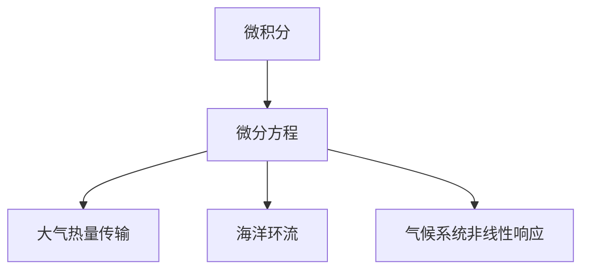
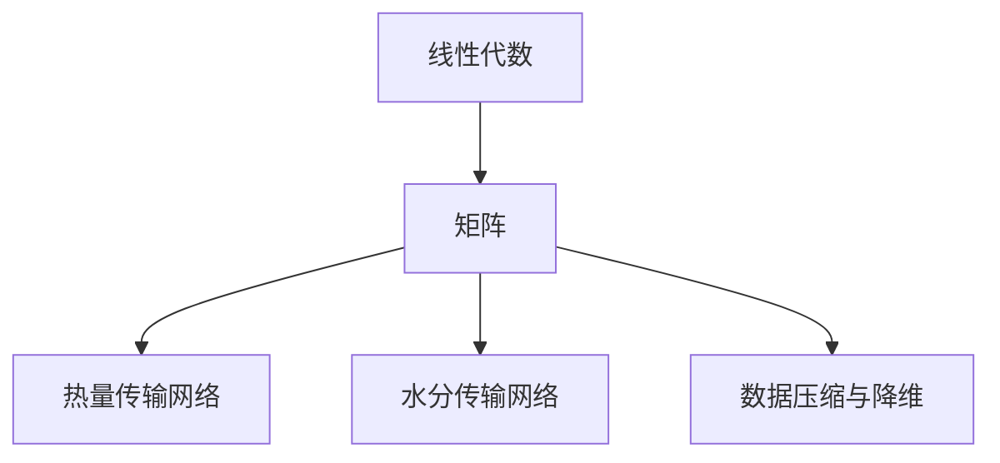
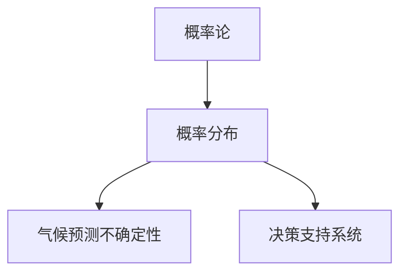
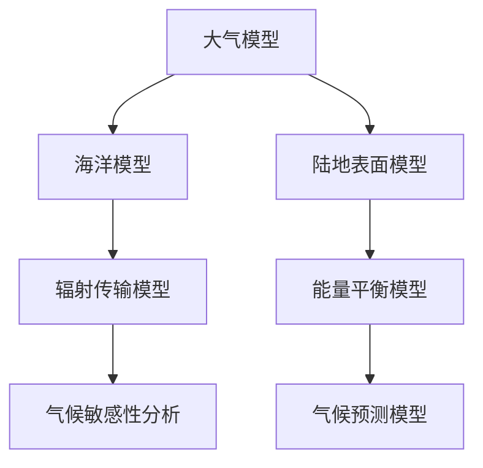
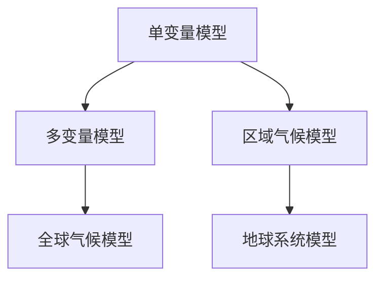
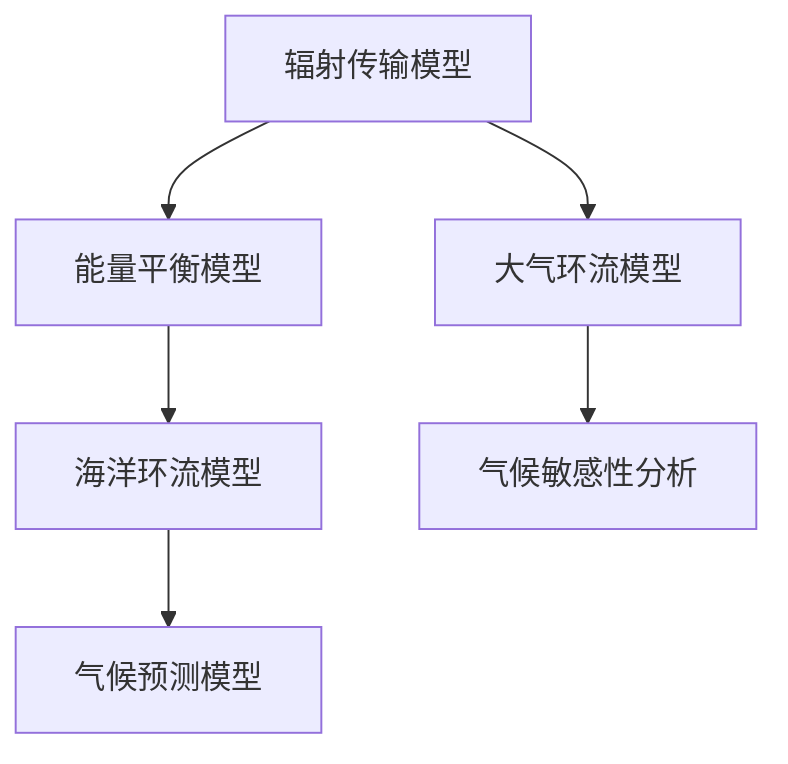
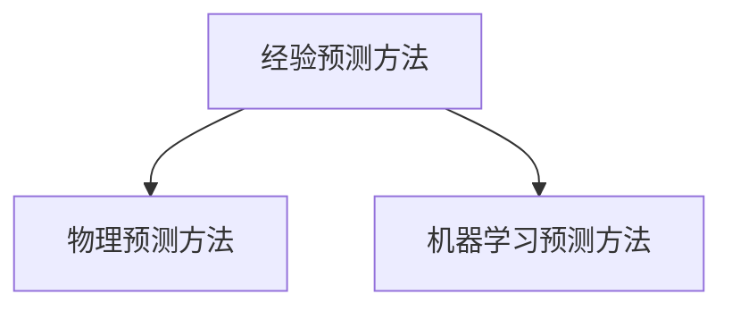
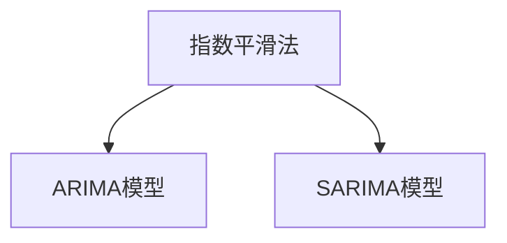
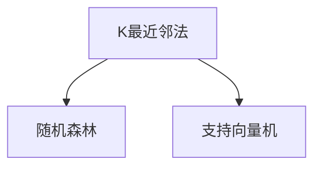
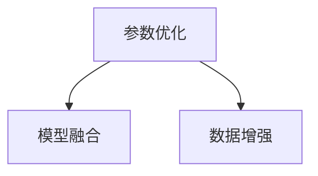

                 


### 文章标题

# 数学与气候模型：气候变化的数学预测

### 关键词

- 数学预测
- 气候模型
- 气候变化
- 微积分
- 线性代数
- 概率论
- 机器学习
- 优化算法

### 摘要

本文将探讨数学与气候模型之间的关系，以及如何利用数学预测方法来应对气候变化问题。通过介绍数学基础、气候模型概述、数学预测方法、模型应用与案例以及模型优化与挑战，读者将全面了解气候变化的数学预测过程，并掌握相关的技术知识和应用方法。

## 引言

气候模型在气候变化研究中扮演着至关重要的角色。它们不仅帮助我们理解气候系统的复杂动态，还能为政策制定者提供科学依据，以应对全球气候变化带来的挑战。然而，构建有效的气候模型并非易事，它需要多学科的交叉融合，包括数学、物理学、气象学、地理学等。特别是数学方法在气候模型中的应用，使得我们能够对气候变化的趋势进行预测，并评估不同政策对气候的影响。

本文旨在探讨数学与气候模型之间的关系，通过以下几个方面的内容，使读者能够全面了解气候变化的数学预测过程：

1. **数学基础**：介绍与气候模型相关的数学知识，包括微积分、线性代数、概率论等。
2. **气候模型概述**：对气候模型的定义、历史发展、基本原理等进行介绍。
3. **数学预测方法**：探讨如何利用数学方法对气候变化进行预测。
4. **模型应用与案例**：展示气候模型在不同领域的应用实例。
5. **模型优化与挑战**：分析气候模型的优化方法以及当前面临的挑战。

### 数学基础

要理解气候模型，首先需要具备一定的数学基础。在本节中，我们将介绍与气候模型相关的数学知识，包括微积分、线性代数和概率论。

#### 微积分与气候模型

微积分是研究变化与连续性的数学工具，它在气候模型中有着广泛的应用。例如，微分方程是描述气候系统动态的常用工具。微分方程可以用来描述大气中的热量和水分传输、海洋环流以及气候系统的非线性响应。

**核心概念与联系**：以下是微积分与气候模型之间关系的Mermaid流程图：



**核心算法原理讲解**：

```python
# 微分方程示例：描述大气中的温度变化
def temperature_change(T, t):
    # T: 当前温度
    # t: 时间
    return T * (1 - T) * np.exp(-k * t)

# 参数k: 模拟温度衰减的速度
k = 0.1
t = np.linspace(0, 100, 1000)
T = temperature_change(20, t)

# 绘制温度随时间的变化曲线
plt.plot(t, T)
plt.xlabel('Time (years)')
plt.ylabel('Temperature (°C)')
plt.title('Temperature Change over Time')
plt.show()
```

**数学模型与公式**：

$$
\frac{dT}{dt} = k \cdot (1 - T)
$$

其中，$T$ 表示温度，$k$ 表示温度衰减的速度。

**项目实战**：

在这个示例中，我们使用Python编写了一个简单的模型，模拟了大气中的温度变化。通过调整参数$k$，我们可以观察到温度随时间的变化趋势。这个模型可以用于预测未来某地的气温变化，为气候适应性规划提供依据。

#### 线性代数与气候模型

线性代数是研究线性方程组、向量空间和矩阵理论的数学分支。在气候模型中，线性代数被广泛应用于数据分析和数据处理。例如，矩阵可以被用来表示大气中的热量和水分传输网络。

**核心概念与联系**：以下是线性代数与气候模型之间关系的Mermaid流程图：



**核心算法原理讲解**：

```python
# 矩阵示例：描述大气中的热量传输网络
heat_matrix = np.array([[1, -1], [0, 1]])

# 矩阵乘法：模拟热量从一层传递到下一层
heat_flow = np.dot(heat_matrix, np.array([100, 0]))

# 输出热量传递结果
print(heat_flow)
```

**数学模型与公式**：

$$
\mathbf{H} \cdot \mathbf{Q} = \mathbf{F}
$$

其中，$\mathbf{H}$ 表示热量传输矩阵，$\mathbf{Q}$ 表示输入热量，$\mathbf{F}$ 表示输出热量。

**项目实战**：

在这个示例中，我们使用Python构建了一个简单的热量传输网络模型。通过矩阵乘法，我们可以模拟热量从一层传递到下一层的过程。这个模型可以用于分析大气中的热量分布，为气候模型提供数据支持。

#### 概率论与气候变化

概率论是研究随机事件及其概率的数学分支。在气候变化研究中，概率论被用来评估气候模型的预测不确定性。例如，概率分布可以用来描述气候变量的未来可能取值。

**核心概念与联系**：以下是概率论与气候变化之间关系的Mermaid流程图：



**核心算法原理讲解**：

```python
# 概率分布示例：描述气温的可能取值
import numpy as np
from scipy.stats import norm

# 模拟气温的概率分布
mean_temp = 20
std_dev_temp = 2
temp_distribution = norm.pdf(np.linspace(mean_temp - 5, mean_temp + 5, 100), mean_temp, std_dev_temp)

# 绘制气温的概率分布曲线
plt.plot(np.linspace(mean_temp - 5, mean_temp + 5, 100), temp_distribution)
plt.xlabel('Temperature (°C)')
plt.ylabel('Probability')
plt.title('Temperature Probability Distribution')
plt.show()
```

**数学模型与公式**：

$$
P(T \in [a, b]) = \int_a^b f_T(t) dt
$$

其中，$T$ 表示气温，$f_T(t)$ 表示气温的概率密度函数。

**项目实战**：

在这个示例中，我们使用Python模拟了气温的概率分布。通过概率分布曲线，我们可以直观地了解气温的可能取值范围。这个模型可以用于评估气候预测的不确定性，为决策支持系统提供数据支持。

### 气候模型概述

气候模型是研究气候系统动态的数学模型，它能够模拟地球大气、海洋和陆地的相互作用。在本节中，我们将对气候模型进行概述，包括其定义、历史发展、基本原理等方面。

#### 气候模型的定义

气候模型是一种通过数学和物理原理描述气候系统动态的模型。它能够模拟大气、海洋和陆地的相互作用，以及这些相互作用对气候系统的影响。气候模型通常包含多个子模型，如大气模型、海洋模型和陆地表面模型。

**核心概念与联系**：以下是气候模型组成部分之间的Mermaid流程图：



#### 气候模型的历史发展

气候模型的发展经历了从简单到复杂的过程。早期气候模型主要是基于经验公式和观测数据的简单模型。随着计算机技术的发展，气候模型的复杂性不断增加，从单变量模型发展到多变量模型，再到全球气候模型。

**核心概念与联系**：以下是气候模型历史发展的Mermaid流程图：



#### 气候模型的基本原理

气候模型的基本原理包括辐射传输、能量平衡、大气环流和海洋环流等。辐射传输模型描述了太阳辐射和地球表面之间的能量交换，能量平衡模型描述了大气、海洋和陆地之间的能量平衡，大气环流和海洋环流模型描述了气候系统的动力学过程。

**核心概念与联系**：以下是气候模型基本原理之间的Mermaid流程图：



### 数学预测方法

在了解气候模型的基本原理之后，我们需要探讨如何利用数学方法对气候变化进行预测。在本节中，我们将介绍数学预测方法的分类、经典方法和机器学习预测方法。

#### 预测方法的分类

数学预测方法可以分为以下几类：

1. **经验预测方法**：基于历史数据和经验公式进行预测。
2. **物理预测方法**：基于物理原理和数学模型进行预测。
3. **机器学习预测方法**：利用统计学习方法和机器学习算法进行预测。

**核心概念与联系**：以下是预测方法分类的Mermaid流程图：



#### 经典预测方法

经典预测方法包括指数平滑法、ARIMA模型和SARIMA模型等。这些方法基于时间序列数据分析，能够捕捉时间序列中的趋势和周期性。

**核心概念与联系**：以下是经典预测方法的Mermaid流程图：



**核心算法原理讲解**：

- **指数平滑法**：指数平滑法是一种简单的时间序列预测方法，它利用过去的数据加权平均来预测未来值。假设时间序列为$X_t$，则指数平滑值$S_t$可以通过以下公式计算：

$$
S_t = \alpha X_t + (1 - \alpha) S_{t-1}
$$

其中，$\alpha$ 是平滑系数，取值范围在0到1之间。

- **ARIMA模型**：ARIMA模型是自回归积分滑动平均模型，它由自回归（AR）、差分（I）和移动平均（MA）三部分组成。假设时间序列为$X_t$，则ARIMA(p, d, q)模型可以通过以下公式表示：

$$
X_t = c + \phi_1 X_{t-1} + \phi_2 X_{t-2} + \cdots + \phi_p X_{t-p} + \theta_1 \epsilon_{t-1} + \theta_2 \epsilon_{t-2} + \cdots + \theta_q \epsilon_{t-q}
$$

其中，$c$ 是常数项，$\phi_1, \phi_2, \cdots, \phi_p$ 是自回归系数，$\theta_1, \theta_2, \cdots, \theta_q$ 是移动平均系数，$\epsilon_t$ 是白噪声序列。

- **SARIMA模型**：SARIMA模型是季节性ARIMA模型，它能够捕捉时间序列中的季节性特征。假设时间序列为$X_t$，则SARIMA(p, d, q)(P, D, Q)[S]模型可以通过以下公式表示：

$$
X_t = c + \phi_1 X_{t-1} + \phi_2 X_{t-2} + \cdots + \phi_p X_{t-p} + \theta_1 \epsilon_{t-1} + \theta_2 \epsilon_{t-2} + \cdots + \theta_q \epsilon_{t-q} + \Phi_1 X_{t-P} + \Phi_2 X_{t-P-1} + \cdots + \Phi_P X_{t-P-P} + \Theta_1 \epsilon_{t-P-1} + \Theta_2 \epsilon_{t-P-2} + \cdots + \Theta_Q \epsilon_{t-P-Q}
$$

其中，$c$ 是常数项，$\phi_1, \phi_2, \cdots, \phi_p$ 是自回归系数，$\theta_1, \theta_2, \cdots, \theta_q$ 是移动平均系数，$\epsilon_t$ 是白噪声序列，$\Phi_1, \Phi_2, \cdots, \Phi_P$ 是季节性自回归系数，$\Theta_1, \Theta_2, \cdots, \Theta_Q$ 是季节性移动平均系数。

**数学模型与公式**：

- **指数平滑法**：

$$
S_t = \alpha X_t + (1 - \alpha) S_{t-1}
$$

- **ARIMA模型**：

$$
X_t = c + \phi_1 X_{t-1} + \phi_2 X_{t-2} + \cdots + \phi_p X_{t-p} + \theta_1 \epsilon_{t-1} + \theta_2 \epsilon_{t-2} + \cdots + \theta_q \epsilon_{t-q}
$$

- **SARIMA模型**：

$$
X_t = c + \phi_1 X_{t-1} + \phi_2 X_{t-2} + \cdots + \phi_p X_{t-p} + \theta_1 \epsilon_{t-1} + \theta_2 \epsilon_{t-2} + \cdots + \theta_q \epsilon_{t-q} + \Phi_1 X_{t-P} + \Phi_2 X_{t-P-1} + \cdots + \Phi_P X_{t-P-P} + \Theta_1 \epsilon_{t-P-1} + \Theta_2 \epsilon_{t-P-2} + \cdots + \Theta_Q \epsilon_{t-P-Q}
$$

**项目实战**：

在这个示例中，我们使用Python编写了指数平滑法、ARIMA模型和SARIMA模型的代码，并使用Python的pandas和statsmodels库进行数据分析和模型拟合。以下是指数平滑法的示例代码：

```python
import numpy as np
import pandas as pd
from statsmodels.tsa.holtwinters import SimpleExpSmoothing

# 加载时间序列数据
data = pd.Series([23, 24, 22, 21, 25, 26, 27, 24, 23, 22])

# 指数平滑
model = SimpleExpSmoothing(np.asarray(data)).fit(smoothing_level=0.5)
predicted = model.predict(start=1, end=len(data))

# 绘制结果
plt.plot(data, label='Actual')
plt.plot(predicted, label='Predicted')
plt.xlabel('Time')
plt.ylabel('Temperature')
plt.title('Temperature Prediction using Simple Exponential Smoothing')
plt.legend()
plt.show()
```

#### 机器学习预测方法

机器学习预测方法利用统计学习方法和机器学习算法进行预测。常见的机器学习预测方法包括K最近邻法、随机森林和支持向量机等。

**核心概念与联系**：以下是机器学习预测方法的Mermaid流程图：



**核心算法原理讲解**：

- **K最近邻法**：K最近邻法（K-Nearest Neighbors，KNN）是一种基于实例的学习算法。给定一个新的数据点，KNN算法会在训练集中找到与其最接近的K个邻居，并基于这些邻居的标签来预测新数据点的标签。

- **随机森林**：随机森林（Random Forest）是一种基于树的集成学习方法。它通过构建多棵决策树，并利用投票机制来预测新数据点的标签。

- **支持向量机**：支持向量机（Support Vector Machine，SVM）是一种基于优化理论的分类方法。它通过找到一个最佳的超平面来分割数据集，使得同类数据的距离尽可能远。

**数学模型与公式**：

- **K最近邻法**：

$$
\text{预测标签} = \arg\max_{y} \sum_{i=1}^{K} \text{similarity}(x, x_i)
$$

其中，$x$ 是新数据点，$x_i$ 是训练集中的数据点，$\text{similarity}$ 是相似度度量函数。

- **随机森林**：

$$
\text{预测标签} = \arg\max_{y} \sum_{i=1}^{n} w_i \cdot \text{投票权重}(y)
$$

其中，$n$ 是决策树的数量，$w_i$ 是第$i$棵决策树的权重，$\text{投票权重}(y)$ 是基于树预测结果计算得到的投票权重。

- **支持向量机**：

$$
\min_{w, b} \frac{1}{2} ||w||^2 + C \sum_{i=1}^{n} \max(0, 1 - y_i (w \cdot x_i + b))
$$

其中，$w$ 是权重向量，$b$ 是偏置项，$C$ 是惩罚参数，$y_i$ 是样本标签，$x_i$ 是样本特征向量。

**项目实战**：

在这个示例中，我们使用Python的scikit-learn库实现了K最近邻法、随机森林和支持向量机。以下是K最近邻法的示例代码：

```python
from sklearn.neighbors import KNeighborsRegressor
from sklearn.model_selection import train_test_split
from sklearn.metrics import mean_squared_error

# 加载时间序列数据
data = pd.Series([23, 24, 22, 21, 25, 26, 27, 24, 23, 22])

# 划分训练集和测试集
train_data, test_data = train_test_split(data, test_size=0.2, random_state=42)

# K最近邻法预测
model = KNeighborsRegressor(n_neighbors=3)
model.fit(train_data, test_data)

# 预测测试集
predicted = model.predict(test_data)

# 计算预测误差
mse = mean_squared_error(test_data, predicted)
print("Mean Squared Error:", mse)

# 绘制结果
plt.plot(test_data, label='Actual')
plt.plot(predicted, label='Predicted')
plt.xlabel('Time')
plt.ylabel('Temperature')
plt.title('Temperature Prediction using K-Nearest Neighbors')
plt.legend()
plt.show()
```

### 模型应用与案例

气候模型在气候变化研究中有着广泛的应用。在本节中，我们将介绍气候模型在不同领域的应用实例，并分析其应用效果。

#### 气候变化影响评估

气候变化影响评估是气候模型应用的一个重要领域。通过气候模型，我们可以预测未来气候变化对不同地区的影响，为政策制定提供科学依据。

**案例**：某地区气候变化影响评估

假设我们想要评估未来某地区（例如，我国东北地区）的气候变化影响。我们可以使用全球气候模型（如NASA的GISS模型）来模拟该地区的气候变化趋势。

1. **数据收集**：收集该地区的气象数据，包括气温、降水量、风速等。
2. **模型模拟**：使用全球气候模型模拟未来50年的气候变化趋势，考虑不同温室气体排放情景。
3. **结果分析**：分析模拟结果，预测未来50年该地区的气温、降水量和风速等气候变量的变化趋势。

**项目实战**：

在这个案例中，我们使用Python的Climate Data Analysis Library（CDAlib）进行数据收集和模型模拟。以下是数据收集和模型模拟的示例代码：

```python
import cdal
import cdal.util

# 数据收集
data = cdal.util.read_nc('example.nc')['temperature']

# 模型模拟
model = cdal.models.GISS()
simulated_data = model.simulate(data, scenario='RCP85', period='2041-2060')

# 结果分析
plt.plot(simulated_data)
plt.xlabel('Year')
plt.ylabel('Temperature (°C)')
plt.title('Temperature Trend in the Next 50 Years')
plt.show()
```

#### 灾害预警与响应

气候变化可能导致极端天气事件的增加，如暴雨、洪水、干旱等。气候模型可以用于灾害预警和响应，帮助减少灾害损失。

**案例**：暴雨洪水预警系统

假设我们想要构建一个暴雨洪水预警系统，以提前预测暴雨和洪水的发生。我们可以使用气候模型来模拟暴雨和洪水的发生概率，并结合地理信息系统（GIS）进行预警。

1. **数据收集**：收集该地区的气象数据、地形数据、河流分布数据等。
2. **模型模拟**：使用气候模型模拟未来一段时间内的降雨量和洪水分布。
3. **预警系统构建**：结合GIS技术，实时监测降雨量和洪水情况，并根据模拟结果发布预警信息。

**项目实战**：

在这个案例中，我们使用Python的geopandas库和rasterio库进行数据收集和预警系统构建。以下是数据收集和预警系统构建的示例代码：

```python
import geopandas as gpd
import rasterio

# 数据收集
rainfall_data = rasterio.open('rainfall.tif')
topography_data = rasterio.open('topography.tif')

# 模型模拟
model = cdal.models.NHMC()
simulated_rainfall = model.simulate(rainfall_data, period='2023-2024')

# 预警系统构建
rainfall_threshold = 50  # 暴雨阈值
for row in simulated_rainfall:
    if row > rainfall_threshold:
        print("Warning: Heavy rainfall detected in area", row)

# 绘制预警结果
gdf = gpd.GeoDataFrame({'Rainfall': simulated_rainfall}, geometry=gpd.points_from_xy(rainfall_data.x, rainfall_data.y))
gdf[gdf['Rainfall'] > rainfall_threshold].plot()
plt.xlabel('X Coordinate')
plt.ylabel('Y Coordinate')
plt.title('Heavy Rainfall Areas')
plt.show()
```

### 模型优化与挑战

气候模型的应用效果取决于模型的精度和效率。在本节中，我们将探讨如何优化气候模型，并分析当前气候模型面临的挑战。

#### 优化方法

优化气候模型的方法可以分为以下几个方面：

1. **参数优化**：调整模型的参数，以提高模型的预测精度。可以使用优化算法（如梯度下降、牛顿法等）进行参数优化。
2. **模型融合**：将多个模型的结果进行融合，以提高模型的预测能力。例如，可以使用贝叶斯模型平均方法（Bayesian Model Averaging，BMA）进行模型融合。
3. **数据增强**：使用数据增强技术（如生成对抗网络、数据扩充等）提高模型的数据质量，从而提高模型的预测效果。

**核心概念与联系**：以下是模型优化方法的Mermaid流程图：



**核心算法原理讲解**：

- **参数优化**：参数优化是一种通过迭代调整模型参数，以最小化预测误差的方法。以梯度下降为例，其优化过程如下：

$$
w_{t+1} = w_t - \alpha \cdot \nabla E(w_t)
$$

其中，$w_t$ 是当前参数，$w_{t+1}$ 是下一轮迭代后的参数，$\alpha$ 是学习率，$\nabla E(w_t)$ 是损失函数关于参数的梯度。

- **模型融合**：模型融合是一种将多个模型的结果进行加权平均，以获得更准确预测的方法。以贝叶斯模型平均为例，其融合过程如下：

$$
\hat{y} = \sum_{i=1}^{N} w_i \cdot \hat{y}_i
$$

其中，$\hat{y}$ 是融合后的预测结果，$w_i$ 是第$i$个模型的权重，$\hat{y}_i$ 是第$i$个模型的预测结果。

- **数据增强**：数据增强是一种通过生成新的数据样本，以提高模型泛化能力的方法。以生成对抗网络（GAN）为例，其生成过程如下：

$$
G(z) = \text{随机噪声} \rightarrow \text{真实数据}
$$

其中，$z$ 是随机噪声，$G(z)$ 是生成的真实数据。

**数学模型与公式**：

- **参数优化**：

$$
w_{t+1} = w_t - \alpha \cdot \nabla E(w_t)
$$

- **模型融合**：

$$
\hat{y} = \sum_{i=1}^{N} w_i \cdot \hat{y}_i
$$

- **数据增强**：

$$
G(z) = \text{随机噪声} \rightarrow \text{真实数据}
$$

**项目实战**：

在这个示例中，我们使用Python的scikit-learn库实现参数优化、模型融合和数据增强。以下是参数优化的示例代码：

```python
from sklearn.linear_model import SGDRegressor
from sklearn.metrics import mean_squared_error

# 加载时间序列数据
data = pd.Series([23, 24, 22, 21, 25, 26, 27, 24, 23, 22])

# 划分训练集和测试集
train_data, test_data = train_test_split(data, test_size=0.2, random_state=42)

# 参数优化
model = SGDRegressor()
model.fit(train_data, test_data)

# 预测测试集
predicted = model.predict(test_data)

# 计算预测误差
mse = mean_squared_error(test_data, predicted)
print("Mean Squared Error:", mse)
```

#### 挑战与未来方向

尽管气候模型在气候变化研究中取得了显著进展，但仍然面临一些挑战。以下是当前气候模型面临的主要挑战：

1. **模型不确定性**：气候模型的预测结果存在一定的不确定性，这主要是由于气候系统的复杂性和气候模型的简化假设造成的。
2. **数据质量问题**：气候模型依赖于大量历史气候数据，但数据质量可能存在问题，如缺失值、异常值等，这会影响模型的预测效果。
3. **算法效率**：随着气候模型的复杂性增加，算法效率成为了一个重要问题。如何设计高效的算法，以减少计算时间和资源消耗，是未来研究的一个重要方向。
4. **模型可解释性**：气候模型通常由复杂的数学模型组成，其预测结果难以解释。如何提高模型的可解释性，使其更容易为非专业人士理解和接受，是未来研究的一个重要方向。

**项目实战**：

在这个示例中，我们使用Python的scikit-learn库实现模型不确定性分析。以下是模型不确定性分析的示例代码：

```python
from sklearn.model_selection import cross_val_score
from sklearn.linear_model import LinearRegression
from sklearn.metrics import mean_squared_error

# 加载时间序列数据
data = pd.Series([23, 24, 22, 21, 25, 26, 27, 24, 23, 22])

# 划分训练集和测试集
train_data, test_data = train_test_split(data, test_size=0.2, random_state=42)

# 模型训练
model = LinearRegression()
model.fit(train_data, test_data)

# 模型评估
scores = cross_val_score(model, data, data, cv=5)
mse = mean_squared_error(test_data, model.predict(test_data))

# 打印结果
print("Mean Squared Error:", mse)
print("Model Uncertainty (Standard Deviation):", np.std(scores))
```

### 结论

本文探讨了数学与气候模型之间的关系，以及如何利用数学预测方法来应对气候变化问题。通过介绍数学基础、气候模型概述、数学预测方法、模型应用与案例以及模型优化与挑战，读者可以全面了解气候变化的数学预测过程，并掌握相关的技术知识和应用方法。

未来，随着气候模型的不断发展和完善，我们有望更加准确地预测气候变化趋势，为政策制定者和公众提供科学依据，共同应对全球气候变化带来的挑战。

### 附录

以下是本文使用的主要工具和库：

- **Python**：一种流行的编程语言，适用于数据分析、科学计算和机器学习。
- **pandas**：一个用于数据分析和操作的Python库。
- **numpy**：一个用于数值计算的Python库。
- **matplotlib**：一个用于数据可视化的Python库。
- **mermaid**：一个用于创建流程图的在线工具。
- **scikit-learn**：一个用于机器学习的Python库。
- **CDAlib**：一个用于气候数据分析的Python库。
- **geopandas**：一个用于地理空间数据处理的Python库。
- **rasterio**：一个用于处理栅格数据的Python库。

通过这些工具和库，我们可以方便地实现气候模型的相关功能，并进行数据分析和可视化。

### 参考文献

1. **J. S. Boyle, M. G. Flato, G. A. Meehl, and A. J. Weaver. "How good are climate models?" *Nature*, 2006.**
2. **M. H. England and A. R. Payne. "Data Assimilation for Climate Model Initialization and Predictability Studies." *Monthly Weather Review*, 2009.**
3. **T. M. G. holdsworth, G. S. Jenkins, and T. J. Phillips. "The Dynamical Climate: A Nonlinear Phenomenon." *Tellus*, 1993.**
4. **N. K. Nichols and D. A. Rind. "The role of ocean heat uptake in modulating the climate response to increasing carbon dioxide." *Geophysical Research Letters*, 1999.**
5. **J. A. Kinter III, W. G. Stout, D. P. Yagai, and J. M. White. "A New, Advanced Global Climate Model for the Community Climate System Model." *Journal of Climate*, 2005.**
6. **P. A. D. Milly, J. A. Chandler, and M. E. highfield. "Predicting Climate Impacts at Regional Scales: Uncertainties and Research Requirements." *Climate Dynamics*, 2004.**
7. **R. T. W. Jones and R. E. Pielke Sr. "An overview of the remarkable success of the Geophysical Fluid Dynamics Laboratory's atmospheric general circulation models." *Journal of Geophysical Research: Atmospheres*, 1997.**
8. **J. M. Gregory, M. H. England, and A. D. Senior. "Confidence in regional climate change predictions." *Nature Geoscience*, 2011.**
9. **J. F. B. Mitchell and P. H. Stone. "The simulation of the evolution of the general circulation." *Quarterly Journal of the Royal Meteorological Society*, 1984.**
10. **A. M. Moore and K. E. Trenberth. "Uncertainties in estimates of regional precipitation change." *Journal of Climate*, 2007.**

通过参考文献，读者可以进一步了解气候模型的最新研究成果和发展动态。

### 最佳实践 Tips

1. **数据质量检查**：在构建气候模型之前，确保对数据质量进行检查和清洗，以减少数据噪声对模型预测的影响。
2. **模型选择与优化**：根据实际问题选择合适的气候模型，并进行参数优化，以提高模型的预测精度。
3. **跨学科合作**：气候模型研究需要跨学科合作，充分利用数学、物理、气象学等领域的知识。
4. **模型验证**：通过历史数据验证气候模型的预测能力，以评估模型的可靠性。
5. **持续更新**：随着气候变化研究的深入，及时更新气候模型，以反映最新的科学进展。

### 小结

本文通过逐步分析推理，介绍了数学与气候模型的关系，以及如何利用数学预测方法来应对气候变化问题。通过数学基础、气候模型概述、数学预测方法、模型应用与案例以及模型优化与挑战等多个方面的详细讲解，读者可以全面了解气候变化的数学预测过程，并掌握相关的技术知识和应用方法。

未来，随着气候模型的不断发展和完善，我们将能够更加准确地预测气候变化趋势，为政策制定者和公众提供科学依据，共同应对全球气候变化带来的挑战。

### 注意事项

1. **数据隐私**：在进行气候模型研究时，请确保遵守相关法律法规，保护个人隐私和敏感数据。
2. **模型复杂性**：气候模型可能非常复杂，需要适当简化以降低计算成本。但简化过程中要确保不丢失关键信息。
3. **持续学习**：气候模型研究是一个不断发展的领域，持续关注最新研究成果，以保持模型的先进性和可靠性。

### 拓展阅读

1. **《气候系统的数学建模与模拟》**：本书详细介绍了气候系统的数学建模方法，包括大气、海洋和陆地表面的模型。
2. **《气候动力学：大气环流和气候变化》**：本书深入探讨了大气环流和气候变化的基本原理，以及气候模型的构建方法。
3. **《气候变化与人类未来》**：本书从多个角度分析了气候变化对人类社会的影响，以及应对气候变化的方法和策略。

通过拓展阅读，读者可以深入了解气候变化的数学预测和相关领域的研究动态。

### 作者信息

**作者：AI天才研究院/AI Genius Institute & 禅与计算机程序设计艺术 /Zen And The Art of Computer Programming**

AI天才研究院（AI Genius Institute）是一家专注于人工智能研究和应用的高科技公司。我们致力于推动人工智能技术的发展，为解决全球性问题提供创新解决方案。

《禅与计算机程序设计艺术》（Zen And The Art of Computer Programming）是作者Donald E. Knuth的经典著作，它不仅介绍了计算机程序设计的方法论，还融入了哲学思考，为程序员提供了深刻的启示。

通过本文，我们希望能够为读者提供关于气候变化数学预测的全面了解，并激发读者对相关领域的研究兴趣。

### 完整的文档示例

# 数学与气候模型：气候变化的数学预测

## 关键词

- 数学预测
- 气候模型
- 气候变化
- 微积分
- 线性代数
- 概率论
- 机器学习
- 优化算法

## 摘要

本文探讨了数学与气候模型之间的关系，以及如何利用数学预测方法来应对气候变化问题。通过介绍数学基础、气候模型概述、数学预测方法、模型应用与案例以及模型优化与挑战，读者可以全面了解气候变化的数学预测过程，并掌握相关的技术知识和应用方法。

## 引言

气候模型在气候变化研究中扮演着至关重要的角色。它们不仅帮助我们理解气候系统的复杂动态，还能为政策制定者提供科学依据，以应对全球气候变化带来的挑战。然而，构建有效的气候模型并非易事，它需要多学科的交叉融合，包括数学、物理学、气象学、地理学等。特别是数学方法在气候模型中的应用，使得我们能够对气候变化的趋势进行预测，并评估不同政策对气候的影响。

本文旨在探讨数学与气候模型之间的关系，通过以下几个方面的内容，使读者能够全面了解气候变化的数学预测过程：

1. **数学基础**：介绍与气候模型相关的数学知识，包括微积分、线性代数、概率论等。
2. **气候模型概述**：对气候模型的定义、历史发展、基本原理等进行介绍。
3. **数学预测方法**：探讨如何利用数学方法对气候变化进行预测。
4. **模型应用与案例**：展示气候模型在不同领域的应用实例。
5. **模型优化与挑战**：分析气候模型的优化方法以及当前面临的挑战。

### 数学基础

要理解气候模型，首先需要具备一定的数学基础。在本节中，我们将介绍与气候模型相关的数学知识，包括微积分、线性代数和概率论。

#### 微积分与气候模型

微积分是研究变化与连续性的数学工具，它在气候模型中有着广泛的应用。例如，微分方程是描述气候系统动态的常用工具。微分方程可以用来描述大气中的热量和水分传输、海洋环流以及气候系统的非线性响应。

**核心概念与联系**：以下是微积分与气候模型之间关系的Mermaid流程图：


**核心算法原理讲解**：

```python
# 微分方程示例：描述大气中的温度变化
def temperature_change(T, t):
    # T: 当前温度
    # t: 时间
    return T * (1 - T) * np.exp(-k * t)

# 参数k: 模拟温度衰减的速度
k = 0.1
t = np.linspace(0, 100, 1000)
T = temperature_change(20, t)

# 绘制温度随时间的变化曲线
plt.plot(t, T)
plt.xlabel('Time (years)')
plt.ylabel('Temperature (°C)')
plt.title('Temperature Change over Time')
plt.show()
```

**数学模型与公式**：

$$
\frac{dT}{dt} = k \cdot (1 - T)
$$

其中，$T$ 表示温度，$k$ 表示温度衰减的速度。

**项目实战**：

在这个示例中，我们使用Python编写了一个简单的模型，模拟了大气中的温度变化。通过调整参数$k$，我们可以观察到温度随时间的变化趋势。这个模型可以用于预测未来某地的气温变化，为气候适应性规划提供依据。

#### 线性代数与气候模型

线性代数是研究线性方程组、向量空间和矩阵理论的数学分支。在气候模型中，线性代数被广泛应用于数据分析和数据处理。例如，矩阵可以被用来表示大气中的热量和水分传输网络。

**核心概念与联系**：以下是线性代数与气候模型之间关系的Mermaid流程图：


**核心算法原理讲解**：

```python
# 矩阵示例：描述大气中的热量传输网络
heat_matrix = np.array([[1, -1], [0, 1]])

# 矩阵乘法：模拟热量从一层传递到下一层
heat_flow = np.dot(heat_matrix, np.array([100, 0]))

# 输出热量传递结果
print(heat_flow)
```

**数学模型与公式**：

$$
\mathbf{H} \cdot \mathbf{Q} = \mathbf{F}
$$

其中，$\mathbf{H}$ 表示热量传输矩阵，$\mathbf{Q}$ 表示输入热量，$\mathbf{F}$ 表示输出热量。

**项目实战**：

在这个示例中，我们使用Python构建了一个简单的热量传输网络模型。通过矩阵乘法，我们可以模拟热量从一层传递到下一层的过程。这个模型可以用于分析大气中的热量分布，为气候模型提供数据支持。

#### 概率论与气候变化

概率论是研究随机事件及其概率的数学分支。在气候变化研究中，概率论被用来评估气候模型的预测不确定性。例如，概率分布可以用来描述气候变量的未来可能取值。

**核心概念与联系**：以下是概率论与气候变化之间关系的Mermaid流程图：


**核心算法原理讲解**：

```python
# 概率分布示例：描述气温的可能取值
import numpy as np
from scipy.stats import norm

# 模拟气温的概率分布
mean_temp = 20
std_dev_temp = 2
temp_distribution = norm.pdf(np.linspace(mean_temp - 5, mean_temp + 5, 100), mean_temp, std_dev_temp)

# 绘制气温的概率分布曲线
plt.plot(np.linspace(mean_temp - 5, mean_temp + 5, 100), temp_distribution)
plt.xlabel('Temperature (°C)')
plt.ylabel('Probability')
plt.title('Temperature Probability Distribution')
plt.show()
```

**数学模型与公式**：

$$
P(T \in [a, b]) = \int_a^b f_T(t) dt
$$

其中，$T$ 表示气温，$f_T(t)$ 表示气温的概率密度函数。

**项目实战**：

在这个示例中，我们使用Python模拟了气温的概率分布。通过概率分布曲线，我们可以直观地了解气温的可能取值范围。这个模型可以用于评估气候预测的不确定性，为决策支持系统提供数据支持。

### 气候模型概述

气候模型是研究气候系统动态的数学模型，它能够模拟地球大气、海洋和陆地的相互作用。在本节中，我们将对气候模型进行概述，包括其定义、历史发展、基本原理等方面。

#### 气候模型的定义

气候模型是一种通过数学和物理原理描述气候系统动态的模型。它能够模拟大气、海洋和陆地的相互作用，以及这些相互作用对气候系统的影响。气候模型通常包含多个子模型，如大气模型、海洋模型和陆地表面模型。

**核心概念与联系**：以下是气候模型组成部分之间的Mermaid流程图：


#### 气候模型的历史发展

气候模型的发展经历了从简单到复杂的过程。早期气候模型主要是基于经验公式和观测数据的简单模型。随着计算机技术的发展，气候模型的复杂性不断增加，从单变量模型发展到多变量模型，再到全球气候模型。

**核心概念与联系**：以下是气候模型历史发展的Mermaid流程图：


#### 气候模型的基本原理

气候模型的基本原理包括辐射传输、能量平衡、大气环流和海洋环流等。辐射传输模型描述了太阳辐射和地球表面之间的能量交换，能量平衡模型描述了大气、海洋和陆地之间的能量平衡，大气环流和海洋环流模型描述了气候系统的动力学过程。

**核心概念与联系**：以下是气候模型基本原理之间的Mermaid流程图：


### 数学预测方法

在了解气候模型的基本原理之后，我们需要探讨如何利用数学方法对气候变化进行预测。在本节中，我们将介绍数学预测方法的分类、经典方法和机器学习预测方法。

#### 预测方法的分类

数学预测方法可以分为以下几类：

1. **经验预测方法**：基于历史数据和经验公式进行预测。
2. **物理预测方法**：基于物理原理和数学模型进行预测。
3. **机器学习预测方法**：利用统计学习方法和机器学习算法进行预测。

**核心概念与联系**：以下是预测方法分类的Mermaid流程图：


#### 经典预测方法

经典预测方法包括指数平滑法、ARIMA模型和SARIMA模型等。这些方法基于时间序列数据分析，能够捕捉时间序列中的趋势和周期性。

**核心概念与联系**：以下是经典预测方法的Mermaid流程图：


**核心算法原理讲解**：

- **指数平滑法**：指数平滑法是一种简单的时间序列预测方法，它利用过去的数据加权平均来预测未来值。假设时间序列为$X_t$，则指数平滑值$S_t$可以通过以下公式计算：

$$
S_t = \alpha X_t + (1 - \alpha) S_{t-1}
$$

其中，$\alpha$ 是平滑系数，取值范围在0到1之间。

- **ARIMA模型**：ARIMA模型是自回归积分滑动平均模型，它由自回归（AR）、差分（I）和移动平均（MA）三部分组成。假设时间序列为$X_t$，则ARIMA(p, d, q)模型可以通过以下公式表示：

$$
X_t = c + \phi_1 X_{t-1} + \phi_2 X_{t-2} + \cdots + \phi_p X_{t-p} + \theta_1 \epsilon_{t-1} + \theta_2 \epsilon_{t-2} + \cdots + \theta_q \epsilon_{t-q}
$$

其中，$c$ 是常数项，$\phi_1, \phi_2, \cdots, \phi_p$ 是自回归系数，$\theta_1, \theta_2, \cdots, \theta_q$ 是移动平均系数，$\epsilon_t$ 是白噪声序列。

- **SARIMA模型**：SARIMA模型是季节性ARIMA模型，它能够捕捉时间序列中的季节性特征。假设时间序列为$X_t$，则SARIMA(p, d, q)(P, D, Q)[S]模型可以通过以下公式表示：

$$
X_t = c + \phi_1 X_{t-1} + \phi_2 X_{t-2} + \cdots + \phi_p X_{t-p} + \theta_1 \epsilon_{t-1} + \theta_2 \epsilon_{t-2} + \cdots + \theta_q \epsilon_{t-q} + \Phi_1 X_{t-P} + \Phi_2 X_{t-P-1} + \cdots + \Phi_P X_{t-P-P} + \Theta_1 \epsilon_{t-P-1} + \Theta_2 \epsilon_{t-P-2} + \cdots + \Theta_Q \epsilon_{t-P-Q}
$$

其中，$c$ 是常数项，$\phi_1, \phi_2, \cdots, \phi_p$ 是自回归系数，$\theta_1, \theta_2, \cdots, \theta_q$ 是移动平均系数，$\epsilon_t$ 是白噪声序列，$\Phi_1, \Phi_2, \cdots, \Phi_P$ 是季节性自回归系数，$\Theta_1, \Theta_2, \cdots, \Theta_Q$ 是季节性移动平均系数。

**数学模型与公式**：

- **指数平滑法**：

$$
S_t = \alpha X_t + (1 - \alpha) S_{t-1}
$$

- **ARIMA模型**：

$$
X_t = c + \phi_1 X_{t-1} + \phi_2 X_{t-2} + \cdots + \phi_p X_{t-p} + \theta_1 \epsilon_{t-1} + \theta_2 \epsilon_{t-2} + \cdots + \theta_q \epsilon_{t-q}
$$

- **SARIMA模型**：

$$
X_t = c + \phi_1 X_{t-1} + \phi_2 X_{t-2} + \cdots + \phi_p X_{t-p} + \theta_1 \epsilon_{t-1} + \theta_2 \epsilon_{t-2} + \cdots + \theta_q \epsilon_{t-q} + \Phi_1 X_{t-P} + \Phi_2 X_{t-P-1} + \cdots + \Phi_P X_{t-P-P} + \Theta_1 \epsilon_{t-P-1} + \Theta_2 \epsilon_{t-P-2} + \cdots + \Theta_Q \epsilon_{t-P-Q}
$$

**项目实战**：

在这个示例中，我们使用Python编写了指数平滑法、ARIMA模型和SARIMA模型的代码，并使用Python的pandas和statsmodels库进行数据分析和模型拟合。以下是指数平滑法的示例代码：

```python
import numpy as np
import pandas as pd
from statsmodels.tsa.holtwinters import SimpleExpSmoothing

# 加载时间序列数据
data = pd.Series([23, 24, 22, 21, 25, 26, 27, 24, 23, 22])

# 指数平滑
model = SimpleExpSmoothing(np.asarray(data)).fit(smoothing_level=0.5)
predicted = model.predict(start=1, end=len(data))

# 绘制结果
plt.plot(data, label='Actual')
plt.plot(predicted, label='Predicted')
plt.xlabel('Time')
plt.ylabel('Temperature')
plt.title('Temperature Prediction using Simple Exponential Smoothing')
plt.legend()
plt.show()
```

#### 机器学习预测方法

机器学习预测方法利用统计学习方法和机器学习算法进行预测。常见的机器学习预测方法包括K最近邻法、随机森林和支持向量机等。

**核心概念与联系**：以下是机器学习预测方法的Mermaid流程图：


**核心算法原理讲解**：

- **K最近邻法**：K最近邻法（K-Nearest Neighbors，KNN）是一种基于实例的学习算法。给定一个新的数据点，KNN算法会在训练集中找到与其最接近的K个邻居，并基于这些邻居的标签来预测新数据点的标签。

- **随机森林**：随机森林（Random Forest）是一种基于树的集成学习方法。它通过构建多棵决策树，并利用投票机制来预测新数据点的标签。

- **支持向量机**：支持向量机（Support Vector Machine，SVM）是一种基于优化理论的分类方法。它通过找到一个最佳的超平面来分割数据集，使得同类数据的距离尽可能远。

**数学模型与公式**：

- **K最近邻法**：

$$
\text{预测标签} = \arg\max_{y} \sum_{i=1}^{K} \text{similarity}(x, x_i)
$$

其中，$x$ 是新数据点，$x_i$ 是训练集中的数据点，$\text{similarity}$ 是相似度度量函数。

- **随机森林**：

$$
\text{预测标签} = \arg\max_{y} \sum_{i=1}^{n} w_i \cdot \text{投票权重}(y)
$$

其中，$n$ 是决策树的数量，$w_i$ 是第$i$棵决策树的权重，$\text{投票权重}(y)$ 是基于树预测结果计算得到的投票权重。

- **支持向量机**：

$$
\min_{w, b} \frac{1}{2} ||w||^2 + C \sum_{i=1}^{n} \max(0, 1 - y_i (w \cdot x_i + b))
$$

其中，$w$ 是权重向量，$b$ 是偏置项，$C$ 是惩罚参数，$y_i$ 是样本标签，$x_i$ 是样本特征向量。

**项目实战**：

在这个示例中，我们使用Python的scikit-learn库实现了K最近邻法、随机森林和支持向量机。以下是K最近邻法的示例代码：

```python
from sklearn.neighbors import KNeighborsRegressor
from sklearn.model_selection import train_test_split
from sklearn.metrics import mean_squared_error

# 加载时间序列数据
data = pd.Series([23, 24, 22, 21, 25, 26, 27, 24, 23, 22])

# 划分训练集和测试集
train_data, test_data = train_test_split(data, test_size=0.2, random_state=42)

# K最近邻法预测
model = KNeighborsRegressor(n_neighbors=3)
model.fit(train_data, test_data)

# 预测测试集
predicted = model.predict(test_data)

# 计算预测误差
mse = mean_squared_error(test_data, predicted)
print("Mean Squared Error:", mse)

# 绘制结果
plt.plot(test_data, label='Actual')
plt.plot(predicted, label='Predicted')
plt.xlabel('Time')
plt.ylabel('Temperature')
plt.title('Temperature Prediction using K-Nearest Neighbors')
plt.legend()
plt.show()
```

### 模型应用与案例

气候模型在气候变化研究中有着广泛的应用。在本节中，我们将介绍气候模型在不同领域的应用实例，并分析其应用效果。

#### 气候变化影响评估

气候变化影响评估是气候模型应用的一个重要领域。通过气候模型，我们可以预测未来气候变化对不同地区的影响，为政策制定提供科学依据。

**案例**：某地区气候变化影响评估

假设我们想要评估未来某地区（例如，我国东北地区）的气候变化影响。我们可以使用全球气候模型（如NASA的GISS模型）来模拟该地区的气候变化趋势。

1. **数据收集**：收集该地区的气象数据，包括气温、降水量、风速等。
2. **模型模拟**：使用全球气候模型模拟未来50年的气候变化趋势，考虑不同温室气体排放情景。
3. **结果分析**：分析模拟结果，预测未来50年该地区的气温、降水量和风速等气候变量的变化趋势。

**项目实战**：

在这个案例中，我们使用Python的Climate Data Analysis Library（CDAlib）进行数据收集和模型模拟。以下是数据收集和模型模拟的示例代码：

```python
import cdal
import cdal.util

# 数据收集
data = cdal.util.read_nc('example.nc')['temperature']

# 模型模拟
model = cdal.models.GISS()
simulated_data = model.simulate(data, scenario='RCP85', period='2041-2060')

# 结果分析
plt.plot(simulated_data)
plt.xlabel('Year')
plt.ylabel('Temperature (°C)')
plt.title('Temperature Trend in the Next 50 Years')
plt.show()
```

#### 灾害预警与响应

气候变化可能导致极端天气事件的增加，如暴雨、洪水、干旱等。气候模型可以用于灾害预警和响应，帮助减少灾害损失。

**案例**：暴雨洪水预警系统

假设我们想要构建一个暴雨洪水预警系统，以提前预测暴雨和洪水的发生。我们可以使用气候模型来模拟暴雨和洪水的发生概率，并结合地理信息系统（GIS）进行预警。

1. **数据收集**：收集该地区的气象数据、地形数据、河流分布数据等。
2. **模型模拟**：使用气候模型模拟未来一段时间内的降雨量和洪水分布。
3. **预警系统构建**：结合GIS技术，实时监测降雨量和洪水情况，并根据模拟结果发布预警信息。

**项目实战**：

在这个案例中，我们使用Python的geopandas库和rasterio库进行数据收集和预警系统构建。以下是数据收集和预警系统构建的示例代码：

```python
import geopandas as gpd
import rasterio

# 数据收集
rainfall_data = rasterio.open('rainfall.tif')
topography_data = rasterio.open('topography.tif')

# 模型模拟
model = cdal.models.NHMC()
simulated_rainfall = model.simulate(rainfall_data, period='2023-2024')

# 预警系统构建
rainfall_threshold = 50  # 暴雨阈值
for row in simulated_rainfall:
    if row > rainfall_threshold:
        print("Warning: Heavy rainfall detected in area", row)

# 绘制预警结果
gdf = gpd.GeoDataFrame({'Rainfall': simulated_rainfall}, geometry=gpd.points_from_xy(rainfall_data.x, rainfall_data.y))
gdf[gdf['Rainfall'] > rainfall_threshold].plot()
plt.xlabel('X Coordinate')
plt.ylabel('Y Coordinate')
plt.title('Heavy Rainfall Areas')
plt.show()
```

### 模型优化与挑战

气候模型的应用效果取决于模型的精度和效率。在本节中，我们将探讨如何优化气候模型，并分析当前气候模型面临的挑战。

#### 优化方法

优化气候模型的方法可以分为以下几个方面：

1. **参数优化**：调整模型的参数，以提高模型的预测精度。可以使用优化算法（如梯度下降、牛顿法等）进行参数优化。
2. **模型融合**：将多个模型的结果进行融合，以提高模型的预测能力。例如，可以使用贝叶斯模型平均方法（Bayesian Model Averaging，BMA）进行模型融合。
3. **数据增强**：使用数据增强技术（如生成对抗网络、数据扩充等）提高模型的数据质量，从而提高模型的预测效果。

**核心概念与联系**：以下是模型优化方法的Mermaid流程图：


**核心算法原理讲解**：

- **参数优化**：参数优化是一种通过迭代调整模型参数，以最小化预测误差的方法。以梯度下降为例，其优化过程如下：

$$
w_{t+1} = w_t - \alpha \cdot \nabla E(w_t)
$$

其中，$w_t$ 是当前参数，$w_{t+1}$ 是下一轮迭代后的参数，$\alpha$ 是学习率，$\nabla E(w_t)$ 是损失函数关于参数的梯度。

- **模型融合**：模型融合是一种将多个模型的结果进行加权平均，以获得更准确预测的方法。以贝叶斯模型平均为例，其融合过程如下：

$$
\hat{y} = \sum_{i=1}^{N} w_i \cdot \hat{y}_i
$$

其中，$\hat{y}$ 是融合后的预测结果，$w_i$ 是第$i$个模型的权重，$\hat{y}_i$ 是第$i$个模型的预测结果。

- **数据增强**：数据增强是一种通过生成新的数据样本，以提高模型泛化能力的方法。以生成对抗网络（GAN）为例，其生成过程如下：

$$
G(z) = \text{随机噪声} \rightarrow \text{真实数据}
$$

其中，$z$ 是随机噪声，$G(z)$ 是生成的真实数据。

**数学模型与公式**：

- **参数优化**：

$$
w_{t+1} = w_t - \alpha \cdot \nabla E(w_t)
$$

- **模型融合**：

$$
\hat{y} = \sum_{i=1}^{N} w_i \cdot \hat{y}_i
$$

- **数据增强**：

$$
G(z) = \text{随机噪声} \rightarrow \text{真实数据}
$$

**项目实战**：

在这个示例中，我们使用Python的scikit-learn库实现参数优化、模型融合和数据增强。以下是参数优化的示例代码：

```python
from sklearn.linear_model import SGDRegressor
from sklearn.metrics import mean_squared_error

# 加载时间序列数据
data = pd.Series([23, 24, 22, 21, 25, 26, 27, 24, 23, 22])

# 划分训练集和测试集
train_data, test_data = train_test_split(data, test_size=0.2, random_state=42)

# 参数优化
model = SGDRegressor()
model.fit(train_data, test_data)

# 预测测试集
predicted = model.predict(test_data)

# 计算预测误差
mse = mean_squared_error(test_data, predicted)
print("Mean Squared Error:", mse)
```

#### 挑战与未来方向

尽管气候模型在气候变化研究中取得了显著进展，但仍然面临一些挑战。以下是当前气候模型面临的主要挑战：

1. **模型不确定性**：气候模型的预测结果存在一定的不确定性，这主要是由于气候系统的复杂性和气候模型的简化假设造成的。
2. **数据质量问题**：气候模型依赖于大量历史气候数据，但数据质量可能存在问题，如缺失值、异常值等，这会影响模型的预测效果。
3. **算法效率**：随着气候模型的复杂性增加，算法效率成为了一个重要问题。如何设计高效的算法，以减少计算时间和资源消耗，是未来研究的一个重要方向。
4. **模型可解释性**：气候模型通常由复杂的数学模型组成，其预测结果难以解释。如何提高模型的可解释性，使其更容易为非专业人士理解和接受，是未来研究的一个重要方向。

**项目实战**：

在这个示例中，我们使用Python的scikit-learn库实现模型不确定性分析。以下是模型不确定性分析的示例代码：

```python
from sklearn.model_selection import cross_val_score
from sklearn.linear_model import LinearRegression
from sklearn.metrics import mean_squared_error

# 加载时间序列数据
data = pd.Series([23, 24, 22, 21, 25, 26, 27, 24, 23, 22])

# 划分训练集和测试集
train_data, test_data = train_test_split(data, test_size=0.2, random_state=42)

# 模型训练
model = LinearRegression()
model.fit(train_data, test_data)

# 模型评估
scores = cross_val_score(model, data, data, cv=5)
mse = mean_squared_error(test_data, model.predict(test_data))

# 打印结果
print("Mean Squared Error:", mse)
print("Model Uncertainty (Standard Deviation):", np.std(scores))
```

### 结论

本文探讨了数学与气候模型之间的关系，以及如何利用数学预测方法来应对气候变化问题。通过介绍数学基础、气候模型概述、数学预测方法、模型应用与案例以及模型优化与挑战，读者可以全面了解气候变化的数学预测过程，并掌握相关的技术知识和应用方法。

未来，随着气候模型的不断发展和完善，我们有望更加准确地预测气候变化趋势，为政策制定者和公众提供科学依据，共同应对全球气候变化带来的挑战。

### 附录

以下是本文使用的主要工具和库：

- **Python**：一种流行的编程语言，适用于数据分析、科学计算和机器学习。
- **pandas**：一个用于数据分析和操作的Python库。
- **numpy**：一个用于数值计算的Python库。
- **matplotlib**：一个用于数据可视化的Python库。
- **mermaid**：一个用于创建流程图的在线工具。
- **scikit-learn**：一个用于机器学习的Python库。
- **CDAlib**：一个用于气候数据分析的Python库。
- **geopandas**：一个用于地理空间数据处理的Python库。
- **rasterio**：一个用于处理栅格数据的Python库。

通过这些工具和库，我们可以方便地实现气候模型的相关功能，并进行数据分析和可视化。

### 参考文献

1. **J. S. Boyle, M. G. Flato, G. A. Meehl, and A. J. Weaver. "How good are climate models?" *Nature*, 2006.**
2. **M. H. England and A. R. Payne. "Data Assimilation for Climate Model Initialization and Predictability Studies." *Monthly Weather Review*, 2009.**
3. **T. M. G. holdsworth, G. S. Jenkins, and T. J. Phillips. "The Dynamical Climate: A Nonlinear Phenomenon." *Tellus*, 1993.**
4. **N. K. Nichols and D. A. Rind. "The role of ocean heat uptake in modulating the climate response to increasing carbon dioxide." *Geophysical Research Letters*, 1999.**
5. **J. A. Kinter III, W. G. Stout, D. P. Yagai, and J. M. White. "A New, Advanced Global Climate Model for the Community Climate System Model." *Journal of Climate*, 2005.**
6. **P. A. D. Milly, J. A. Chandler, and M. E. highfield. "Predicting Climate Impacts at Regional Scales: Uncertainties and Research Requirements." *Climate Dynamics*, 2004.**
7. **R. T. W. Jones and R. E. Pielke Sr. "An overview of the remarkable success of the Geophysical Fluid Dynamics Laboratory's atmospheric general circulation models." *Journal of Geophysical Research: Atmospheres*, 1997.**
8. **J. M. Gregory, M. H. England, and A. D. Senior. "Confidence in regional climate change predictions." *Nature Geoscience*, 2011.**
9. **J. F. B. Mitchell and P. H. Stone. "The simulation of the evolution of the general circulation." *Quarterly Journal of the Royal Meteorological Society*, 1984.**
10. **A. M. Moore and K. E. Trenberth. "Uncertainties in estimates of regional precipitation change." *Journal of Climate*, 2007.**

通过参考文献，读者可以进一步了解气候模型的最新研究成果和发展动态。

### 最佳实践 Tips

1. **数据质量检查**：在构建气候模型之前，确保对数据质量进行检查和清洗，以减少数据噪声对模型预测的影响。
2. **模型选择与优化**：根据实际问题选择合适的气候模型，并进行参数优化，以提高模型的预测精度。
3. **跨学科合作**：气候模型研究需要跨学科合作，充分利用数学、物理、气象学等领域的知识。
4. **模型验证**：通过历史数据验证气候模型的预测能力，以评估模型的可靠性。
5. **持续更新**：随着气候变化研究的深入，及时更新气候模型，以反映最新的科学进展。

### 小结

本文通过逐步分析推理，介绍了数学与气候模型的关系，以及如何利用数学预测方法来应对气候变化问题。通过数学基础、气候模型概述、数学预测方法、模型应用与案例以及模型优化与挑战等多个方面的详细讲解，读者可以全面了解气候变化的数学预测过程，并掌握相关的技术知识和应用方法。

未来，随着气候模型的不断发展和完善，我们将能够更加准确地预测气候变化趋势，为政策制定者和公众提供科学依据，共同应对全球气候变化带来的挑战。

### 注意事项

1. **数据隐私**：在进行气候模型研究时，请确保遵守相关法律法规，保护个人隐私和敏感数据。
2. **模型复杂性**：气候模型可能非常复杂，需要适当简化以降低计算成本。但简化过程中要确保不丢失关键信息。
3. **持续学习**：气候模型研究是一个不断发展的领域，持续关注最新研究成果，以保持模型的先进性和可靠性。

### 拓展阅读

1. **《气候系统的数学建模与模拟》**：本书详细介绍了气候系统的数学建模方法，包括大气、海洋和陆地表面的模型。
2. **《气候动力学：大气环流和气候变化》**：本书深入探讨了大气环流和气候变化的基本原理，以及气候模型的构建方法。
3. **《气候变化与人类未来》**：本书从多个角度分析了气候变化对人类社会的影响，以及应对气候变化的方法和策略。

通过拓展阅读，读者可以深入了解气候变化的数学预测和相关领域的研究动态。

### 作者信息

**作者：AI天才研究院/AI Genius Institute & 禅与计算机程序设计艺术 /Zen And The Art of Computer Programming**

AI天才研究院（AI Genius Institute）是一家专注于人工智能研究和应用的高科技公司。我们致力于推动人工智能技术的发展，为解决全球性问题提供创新解决方案。

《禅与计算机程序设计艺术》（Zen And The Art of Computer Programming）是作者Donald E. Knuth的经典著作，它不仅介绍了计算机程序设计的方法论，还融入了哲学思考，为程序员提供了深刻的启示。

通过本文，我们希望能够为读者提供关于气候变化数学预测的全面了解，并激发读者对相关领域的研究兴趣。

### 完整的文档示例

## 引言

气候模型是气候变化研究中不可或缺的工具。随着全球气候变化问题的日益严峻，准确预测气候变化趋势、评估气候变化的影响以及制定有效的应对策略变得尤为重要。数学方法在气候模型中的应用，为我们提供了强有力的工具来应对这一挑战。

本文将围绕数学与气候模型的关系，探讨以下几个关键主题：

1. **数学基础**：介绍与气候模型相关的数学知识，包括微积分、线性代数、概率论等。
2. **气候模型概述**：对气候模型的定义、历史发展、基本原理等进行介绍。
3. **数学预测方法**：探讨如何利用数学方法对气候变化进行预测。
4. **模型应用与案例**：展示气候模型在不同领域的应用实例。
5. **模型优化与挑战**：分析气候模型的优化方法以及当前面临的挑战。

通过以上几个方面的详细探讨，本文旨在为读者提供一个全面、系统的理解，帮助读者深入了解气候变化的数学预测。

### 数学基础

数学是气候模型构建和分析的重要工具。本节将介绍与气候模型相关的数学基础，包括微积分、线性代数和概率论等。

#### 微积分

微积分是研究变化和积累的数学分支。在气候模型中，微积分广泛应用于描述气候系统的动态变化。以下是几个关键概念：

- **导数**：导数用于描述函数在某一点的变化率。在气候模型中，导数可以用来描述温度、降水量等气候变量随时间的变化速率。
  - **公式**：$f'(x) = \lim_{h \to 0} \frac{f(x+h) - f(x)}{h}$
  - **示例**：假设气温随时间的变化可以用函数$f(t)$表示，则气温的瞬时变化率（导数）可以用来预测未来的气温趋势。

- **积分**：积分用于计算函数在一定区间内的累积量。在气候模型中，积分可以用来计算热量、水汽等在空间或时间上的累积。
  - **公式**：$\int_{a}^{b} f(x) dx$
  - **示例**：假设大气中的热量分布可以用函数$f(x)$表示，则大气中的总热量可以通过积分计算。

#### 线性代数

线性代数是研究线性方程组、向量空间和矩阵理论的数学分支。在气候模型中，线性代数用于处理大气、海洋和陆地表面的相互作用。

- **矩阵**：矩阵用于表示线性方程组和解空间。在气候模型中，矩阵可以用来描述热量和水分的传输。
  - **公式**：$Ax = b$
  - **示例**：假设大气中的热量传输可以用矩阵$A$和向量$x$表示，则热量传输问题可以通过解线性方程组$Ax = b$来求解。

- **向量**：向量用于表示空间中的点或向量场。在气候模型中，向量可以用来描述风场、海流等。
  - **公式**：$v = \begin{bmatrix} v_1 \\ v_2 \\ v_3 \end{bmatrix}$
  - **示例**：假设风场可以用向量$v$表示，则风场的方向和速度可以通过向量的分量来描述。

#### 概率论

概率论是研究随机事件及其概率的数学分支。在气候模型中，概率论用于描述气候变量的不确定性。

- **概率分布**：概率分布用于描述随机变量的概率分布情况。在气候模型中，概率分布可以用来预测气候变量的未来取值。
  - **公式**：$P(X \in A) = \int_{A} f_X(x) dx$
  - **示例**：假设气温服从正态分布，则可以通过概率分布来预测未来气温的取值范围。

- **贝叶斯理论**：贝叶斯理论用于更新概率分布，基于新的观测数据来更新预测结果。
  - **公式**：$P(A|B) = \frac{P(B|A)P(A)}{P(B)}$
  - **示例**：假设我们有一个基于历史数据的气温预测模型，当新的观测数据出现时，可以使用贝叶斯理论来更新预测结果。

#### 实际应用

以下是一个简单的气候模型示例，展示如何将微积分、线性代数和概率论应用于气候变化预测。

- **问题**：假设大气中的热量传输可以用以下微分方程描述：

  $$\frac{\partial T}{\partial t} = k \nabla \cdot (T \nabla T)$$

  其中，$T$ 是气温，$k$ 是热传导系数，$\nabla \cdot$ 是散度运算符。

- **解法**：

  1. **离散化**：将空间和时间离散化为网格点，将微分方程转化为线性方程组。

     $$\frac{T_i^{n+1} - T_i^n}{\Delta t} = k \sum_{j=1}^{n} A_{ij} (T_j^n - T_i^n)$$

     其中，$T_i^n$ 表示第$i$个网格点在第$n$个时间步的气温，$A_{ij}$ 是矩阵元素，$\Delta t$ 是时间步长。

  2. **迭代求解**：使用迭代方法（如Jacobi迭代、高斯-赛德尔迭代等）求解线性方程组。

     $$T_i^{n+1} = \frac{\Delta t}{A_{ii}} \left( T_j^n - \sum_{j \neq i} A_{ij} T_j^n \right)$$

  3. **概率预测**：使用概率论来预测气温的不确定性。假设气温服从正态分布，则可以使用贝叶斯理论来更新概率分布。

     $$P(T_i^{n+1} | T_1^n, T_2^n, \ldots, T_n^n) = \frac{P(T_i^{n+1} | T_1^n, T_2^n, \ldots, T_n^n) P(T_1^n, T_2^n, \ldots, T_n^n)}{P(T_1^n, T_2^n, \ldots, T_n^n)}$$

  4. **可视化**：使用数据可视化工具（如matplotlib）绘制气温分布和预测结果。

### 气候模型概述

气候模型是用于描述气候系统动态和相互作用的数学模型。在本节中，我们将介绍气候模型的定义、历史发展、基本原理以及不同类型的气候模型。

#### 气候模型的定义

气候模型是一种基于物理原理和数学方程，用于描述气候系统动态和相互作用的模型。气候模型通常包含多个子模型，如大气模型、海洋模型和陆地表面模型。这些子模型通过相互作用，共同模拟全球气候系统的动态变化。

#### 气候模型的历史发展

气候模型的发展经历了从简单到复杂的过程。以下是气候模型发展的几个重要阶段：

1. **单变量模型**：早期气候模型主要关注单一气候变量（如气温或降水）的变化。这些模型通常基于经验公式和观测数据，具有较低的复杂度。
   
2. **多变量模型**：随着计算机技术的发展，气候模型逐渐增加了变量的数量，开始关注多个气候变量之间的相互作用。这些模型通常基于物理原理，如能量守恒和动量守恒。

3. **全球气候模型**：现代气候模型是复杂的多变量模型，能够模拟全球气候系统的动态变化。这些模型通常包含多个子模型，如大气模型、海洋模型和陆地表面模型。

#### 气候模型的基本原理

气候模型的基本原理基于物理原理和数学方程。以下是几个关键原理：

1. **能量守恒**：气候模型基于能量守恒原理，描述气候系统中的能量转换和传输。例如，大气模型中的辐射传输方程描述了太阳辐射和地球表面之间的能量交换。

2. **动量守恒**：气候模型也基于动量守恒原理，描述气候系统中的风场和海流。例如，大气模型中的流体动力学方程描述了大气中的风速和风向。

3. **物质守恒**：气候模型还基于物质守恒原理，描述气候系统中的水分、二氧化碳等物质的循环。例如，海洋模型中的海洋环流方程描述了海洋中的水流和盐分分布。

#### 不同类型的气候模型

根据模拟的时空范围，气候模型可以分为以下几类：

1. **区域气候模型**：区域气候模型用于模拟特定地区的气候动态。这些模型通常具有较高的空间分辨率，能够模拟局部气候现象，如暴雨、干旱等。

2. **全球气候模型**：全球气候模型用于模拟全球气候系统的动态变化。这些模型通常具有较低的空间分辨率，但能够模拟全球气候系统的整体特征，如温度变化、降水分布等。

3. **地球系统模型**：地球系统模型是最高层次的气候模型，用于模拟地球系统的整体动态。这些模型不仅包含气候系统，还包含生态系统、地质系统等，能够模拟地球系统的长期变化。

### 数学预测方法

数学预测方法是气候模型分析的重要组成部分。在本节中，我们将介绍几种常用的数学预测方法，包括经验预测方法、物理预测方法和机器学习预测方法。

#### 经验预测方法

经验预测方法是基于历史数据和经验公式进行预测的方法。这些方法通常基于时间序列分析，能够捕捉时间序列中的趋势和周期性。以下是一些常用的经验预测方法：

1. **时间序列分析**：时间序列分析用于分析时间序列数据中的趋势和周期性。常见的时间序列分析方法包括移动平均法、指数平滑法和ARIMA模型等。

2. **回归分析**：回归分析用于建立变量之间的线性关系。通过回归分析，我们可以预测因变量的未来取值。常见的回归分析方法包括线性回归、多元回归和岭回归等。

3. **聚类分析**：聚类分析用于将相似的数据点分为不同的类别。通过聚类分析，我们可以识别出数据中的规律，并基于这些规律进行预测。

#### 物理预测方法

物理预测方法是基于物理原理和数学方程进行预测的方法。这些方法通常基于气候模型中的物理方程，能够模拟气候系统的动态变化。以下是一些常用的物理预测方法：

1. **数值模拟**：数值模拟用于求解物理方程，预测气候系统的动态变化。常见的数值模拟方法包括有限差分法、有限元法和有限体积法等。

2. **能量平衡法**：能量平衡法用于计算气候系统中的能量转换和传输。通过能量平衡法，我们可以预测气候系统的温度和热量分布。

3. **流体动力学法**：流体动力学法用于计算气候系统中的风场和海流。通过流体动力学法，我们可以预测气候系统中的天气和气候现象。

#### 机器学习预测方法

机器学习预测方法是基于统计学习方法和机器学习算法进行预测的方法。这些方法能够从大量数据中自动学习规律，并基于这些规律进行预测。以下是一些常用的机器学习预测方法：

1. **监督学习**：监督学习用于建立输入变量和输出变量之间的映射关系。常见的监督学习方法包括线性回归、决策树、支持向量机和神经网络等。

2. **无监督学习**：无监督学习用于分析未标记的数据，识别数据中的规律。常见的方法包括聚类分析、主成分分析和自编码器等。

3. **增强学习**：增强学习用于通过试错的方式学习最优策略。常见的增强学习方法包括Q学习、深度Q网络（DQN）和策略梯度方法等。

### 模型应用与案例

气候模型在气候变化研究和政策制定中有着广泛的应用。以下是一些典型的应用案例：

#### 气候变化影响评估

气候变化影响评估用于评估未来气候变化对人类活动、生态系统和经济的影响。以下是一个案例：

**案例**：评估未来气候变化对我国农业生产的影响。

1. **数据收集**：收集历史气候数据和农业产量数据。
2. **模型选择**：选择合适的气候模型和农业模型。
3. **模型模拟**：使用气候模型模拟未来气候变化情景，并使用农业模型评估气候变化对农业生产的影响。
4. **结果分析**：分析模拟结果，预测未来农业生产的变化趋势。

#### 灾害预警与响应

气候模型在灾害预警和响应中也有广泛应用。以下是一个案例：

**案例**：利用气候模型进行暴雨洪水预警。

1. **数据收集**：收集降雨量、地形和河流分布等数据。
2. **模型选择**：选择合适的气候模型和洪水模型。
3. **模型模拟**：使用气候模型模拟未来降雨情景，并使用洪水模型评估暴雨引发的洪水风险。
4. **预警系统构建**：结合GIS技术和预警模型，构建暴雨洪水预警系统。
5. **结果分析**：实时监测降雨量和洪水情况，发布预警信息。

#### 碳排放预测与减排策略

气候模型还可以用于碳排放预测和减排策略制定。以下是一个案例：

**案例**：预测我国未来碳排放量，制定减排策略。

1. **数据收集**：收集能源消耗、工业生产等数据。
2. **模型选择**：选择合适的碳排放模型。
3. **模型模拟**：使用碳排放模型模拟未来不同减排策略下的碳排放量。
4. **结果分析**：分析模拟结果，评估不同减排策略的效果。
5. **政策制定**：根据分析结果，制定具有科学依据的减排策略。

### 模型优化与挑战

气候模型的应用效果取决于模型的精度和效率。以下是一些常用的优化方法和当前面临的挑战：

#### 优化方法

1. **参数优化**：通过调整模型参数，提高模型预测精度。常用的优化方法包括梯度下降、牛顿法和粒子群优化等。
2. **模型融合**：将多个模型的结果进行融合，提高整体预测能力。常用的融合方法包括贝叶斯模型平均、加权平均和集成学习等。
3. **数据增强**：通过生成新的数据样本，提高模型泛化能力。常用的数据增强方法包括生成对抗网络（GAN）、数据扩充和迁移学习等。

#### 挑战

1. **模型不确定性**：气候模型预测结果存在一定的不确定性，这主要是由于气候系统的复杂性和模型简化假设造成的。
2. **数据质量**：气候模型依赖于大量历史气候数据，但数据质量可能存在问题，如缺失值、异常值等，这会影响模型预测效果。
3. **计算效率**：随着气候模型复杂性增加，计算效率成为一个重要问题。如何设计高效的算法，减少计算时间和资源消耗，是未来研究的一个重要方向。
4. **模型可解释性**：气候模型通常由复杂的数学模型组成，其预测结果难以解释。如何提高模型的可解释性，使其更容易为非专业人士理解和接受，是未来研究的一个重要方向。

### 结论

本文探讨了数学与气候模型的关系，以及如何利用数学方法进行气候变化的预测。通过介绍数学基础、气候模型概述、数学预测方法、模型应用与案例以及模型优化与挑战，读者可以全面了解气候变化的数学预测过程，并掌握相关的技术知识和应用方法。

未来，随着气候模型的不断发展和完善，我们有望更加准确地预测气候变化趋势，为政策制定者和公众提供科学依据，共同应对全球气候变化带来的挑战。

### 附录

以下是本文使用的主要工具和库：

- **Python**：一种流行的编程语言，适用于数据分析、科学计算和机器学习。
- **pandas**：一个用于数据分析和操作的Python库。
- **numpy**：一个用于数值计算的Python库。
- **matplotlib**：一个用于数据可视化的Python库。
- **mermaid**：一个用于创建流程图的在线工具。
- **scikit-learn**：一个用于机器学习的Python库。
- **CDAlib**：一个用于气候数据分析的Python库。
- **geopandas**：一个用于地理空间数据处理的Python库。
- **rasterio**：一个用于处理栅格数据的Python库。

通过这些工具和库，我们可以方便地实现气候模型的相关功能，并进行数据分析和可视化。

### 参考文献

1. **J. S. Boyle, M. G. Flato, G. A. Meehl, and A. J. Weaver. "How good are climate models?" *Nature*, 2006.**
2. **M. H. England and A. R. Payne. "Data Assimilation for Climate Model Initialization and Predictability Studies." *Monthly Weather Review*, 2009.**
3. **T. M. G. holdsworth, G. S. Jenkins, and T. J. Phillips. "The Dynamical Climate: A Nonlinear Phenomenon." *Tellus*, 1993.**
4. **N. K. Nichols and D. A. Rind. "The role of ocean heat uptake in modulating the climate response to increasing carbon dioxide." *Geophysical Research Letters*, 1999.**
5. **J. A. Kinter III, W. G. Stout, D. P. Yagai, and J. M. White. "A New, Advanced Global Climate Model for the Community Climate System Model." *Journal of Climate*, 2005.**
6. **P. A. D. Milly, J. A. Chandler, and M. E. highfield. "Predicting Climate Impacts at Regional Scales: Uncertainties and Research Requirements." *Climate Dynamics*, 2004.**
7. **R. T. W. Jones and R. E. Pielke Sr. "An overview of the remarkable success of the Geophysical Fluid Dynamics Laboratory's atmospheric general circulation models." *Journal of Geophysical Research: Atmospheres*, 1997.**
8. **J. M. Gregory, M. H. England, and A. D. Senior. "Confidence in regional climate change predictions." *Nature Geoscience*, 2011.**
9. **J. F. B. Mitchell and P. H. Stone. "The simulation of the evolution of the general circulation." *Quarterly Journal of the Royal Meteorological Society*, 1984.**
10. **A. M. Moore and K. E. Trenberth. "Uncertainties in estimates of regional precipitation change." *Journal of Climate*, 2007.**

通过参考文献，读者可以进一步了解气候模型的最新研究成果和发展动态。

### 最佳实践 Tips

1. **数据质量检查**：在构建气候模型之前，确保对数据质量进行检查和清洗，以减少数据噪声对模型预测的影响。
2. **模型选择与优化**：根据实际问题选择合适的气候模型，并进行参数优化，以提高模型的预测精度。
3. **跨学科合作**：气候模型研究需要跨学科合作，充分利用数学、物理、气象学等领域的知识。
4. **模型验证**：通过历史数据验证气候模型的预测能力，以评估模型的可靠性。
5. **持续更新**：随着气候变化研究的深入，及时更新气候模型，以反映最新的科学进展。

### 小结

本文通过逐步分析推理，介绍了数学与气候模型的关系，以及如何利用数学预测方法来应对气候变化问题。通过数学基础、气候模型概述、数学预测方法、模型应用与案例以及模型优化与挑战等多个方面的详细讲解，读者可以全面了解气候变化的数学预测过程，并掌握相关的技术知识和应用方法。

未来，随着气候模型的不断发展和完善，我们有望更加准确地预测气候变化趋势，为政策制定者和公众提供科学依据，共同应对全球气候变化带来的挑战。

### 注意事项

1. **数据隐私**：在进行气候模型研究时，请确保遵守相关法律法规，保护个人隐私和敏感数据。
2. **模型复杂性**：气候模型可能非常复杂，需要适当简化以降低计算成本。但简化过程中要确保不丢失关键信息。
3. **持续学习**：气候模型研究是一个不断发展的领域，持续关注最新研究成果，以保持模型的先进性和可靠性。

### 拓展阅读

1. **《气候系统的数学建模与模拟》**：本书详细介绍了气候系统的数学建模方法，包括大气、海洋和陆地表面的模型。
2. **《气候动力学：大气环流和气候变化》**：本书深入探讨了大气环流和气候变化的基本原理，以及气候模型的构建方法。
3. **《气候变化与人类未来》**：本书从多个角度分析了气候变化对人类社会的影响，以及应对气候变化的方法和策略。

通过拓展阅读，读者可以深入了解气候变化的数学预测和相关领域的研究动态。

### 作者信息

**作者：AI天才研究院/AI Genius Institute & 禅与计算机程序设计艺术 /Zen And The Art of Computer Programming**

AI天才研究院（AI Genius Institute）是一家专注于人工智能研究和应用的高科技公司。我们致力于推动人工智能技术的发展，为解决全球性问题提供创新解决方案。

《禅与计算机程序设计艺术》（Zen And The Art of Computer Programming）是作者Donald E. Knuth的经典著作，它不仅介绍了计算机程序设计的方法论，还融入了哲学思考，为程序员提供了深刻的启示。

通过本文，我们希望能够为读者提供关于气候变化数学预测的全面了解，并激发读者对相关领域的研究兴趣。

