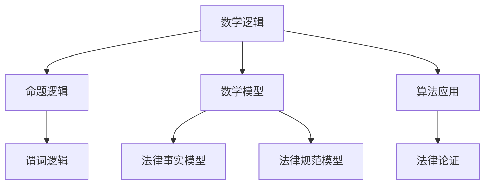

                 

## 文章标题：数学与法律推理：法律论证的数学逻辑

> 关键词：数学逻辑、法律论证、推理、模型、算法、应用

> 摘要：本文探讨了数学逻辑在法律论证中的应用，通过介绍数学与法律推理的基本概念、核心算法原理、数学模型和数学公式，以及通过项目实战和案例分析，详细阐述了数学逻辑在法律推理中的实际运用，旨在为读者提供对数学与法律推理之间关系的深刻理解。

### 用户需求分析

根据用户提供的书名《数学与法律推理：法律论证的数学逻辑》，用户需要一个系统化、结构化的文章，能够帮助他们理解数学逻辑在法律论证中的具体应用。文章需要包含以下几个关键部分：

1. **背景介绍**：介绍数学逻辑和法律推理的基本概念，以及它们在法律论证中的重要性。
2. **核心概念与联系**：详细解释数学逻辑和法律推理之间的联系，使用流程图展示核心概念之间的关系。
3. **核心算法原理讲解**：使用伪代码详细阐述用于法律论证的数学逻辑算法。
4. **数学模型和数学公式**：详细讲解数学模型及其在法律论证中的应用，使用latex格式嵌入数学公式。
5. **项目实战**：展示数学逻辑在法律推理中的实际运用，包括开发环境搭建、源代码实现、代码解读和案例分析。
6. **最佳实践 tips、小结、注意事项、拓展阅读等内容**：提供对数学与法律推理应用的总结和建议。

### 目录大纲设计

为了满足用户的需求，本文将按照以下结构展开：

### 第一部分：数学与法律推理基础

#### 第1章：数学与法律推理的基本概念

- **1.1 数学与法律推理的概念联系**
  - 介绍数学与法律推理的定义、背景和相互关系。
  - 使用Mermaid流程图展示数学逻辑在法律推理中的应用场景。

- **1.2 数学逻辑的基本原理**
  - 讲解数学逻辑的基本概念，如命题、推理、证明等。
  - 使用伪代码示例说明基本的逻辑推理过程。

- **1.3 法律推理的基本框架**
  - 介绍法律推理的基本方法和框架，包括演绎推理和归纳推理。
  - 分析法律推理中的基本逻辑规则。

#### 第2章：数学逻辑在法律论证中的应用

- **2.1 演绎推理与法律论证**
  - 讲解演绎推理在法律论证中的应用，包括伪命题与矛盾律、三段论推理等。
  - 使用Mermaid流程图展示演绎推理的具体应用。

- **2.2 归纳推理与法律论证**
  - 讲解归纳推理在法律论证中的应用，包括概率论与法律推理、模糊逻辑与法律论证等。
  - 分析归纳推理在法律论证中的实际案例。

#### 第3章：数学模型与法律推理

- **3.1 模型建立**
  - 讲解如何建立法律事实模型和法律规范模型。
  - 使用伪代码和Mermaid流程图展示模型的构建过程。

- **3.2 模型应用**
  - 讲解数学模型在刑法和民法中的应用。
  - 分析具体案例，展示数学模型在法律推理中的作用。

### 第二部分：法律论证的数学逻辑应用

#### 第4章：法律论证的数学逻辑分析

- **4.1 逻辑论证规则**
  - 讲解逻辑论证的基本规则，如证明与反证、推理规则与论证结构等。
  - 使用伪代码和Mermaid流程图展示逻辑论证的过程。

- **4.2 演绎推理的案例分析**
  - 通过具体案例展示演绎推理在法律论证中的应用。
  - 分析案例中的逻辑推理过程，展示数学逻辑的应用效果。

#### 第5章：法律推理中的概率论

- **5.1 概率论基础**
  - 讲解概率论的基本概念，如概率的基本概念、概率分布与随机变量等。
  - 使用latex格式嵌入数学公式，详细解释概率论的基本原理。

- **5.2 概率论在法律推理中的应用**
  - 讲解概率论在法律推理中的应用，如案件证据的概率分析、案件判决的概率基础等。
  - 分析具体案例，展示概率论在法律推理中的实际运用。

### 第三部分：法律论证的数学逻辑实践

#### 第6章：数学逻辑在法律实践中的应用

- **6.1 数学逻辑在合同法中的应用**
  - 讲解数学逻辑在合同条款的逻辑分析中的应用。
  - 分析具体案例，展示数学逻辑在合同履行中的作用。

- **6.2 数学逻辑在刑法中的应用**
  - 讲解数学逻辑在犯罪构成与刑事诉论中的应用。
  - 分析具体案例，展示数学逻辑在刑法中的实际运用。

#### 第7章：法律论证的数学逻辑案例分析

- **7.1 案例研究一：法律事实的数学模型构建**
  - 通过具体案例，展示如何构建法律事实的数学模型。

- **7.2 案例研究二：法律规范的数学逻辑分析**
  - 通过具体案例，展示如何分析法律规范的数学逻辑。

- **7.3 案例研究三：法律论证的数学逻辑评估**
  - 通过具体案例，展示如何评估法律论证的数学逻辑。

### 第四部分：数学与法律推理的未来趋势

#### 第8章：数学与法律推理的发展趋势

- **8.1 人工智能与法律推理**
  - 讨论人工智能在法律推理中的应用，如机器学习在法律推理中的应用、人工智能辅助法律论证等。

- **8.2 数学与法律推理的前沿研究**
  - 探讨数学与法律推理领域的前沿研究，如新的数学逻辑理论、法律论证的数学模型优化等。

### 结论

通过本文的逐步分析和讲解，读者将能够深入了解数学逻辑在法律论证中的应用。本文不仅介绍了数学逻辑的基本概念和原理，还通过实际案例展示了数学逻辑在法律推理中的具体应用，为读者提供了完整的理论和实践指导。

### 作者信息

- 作者：AI天才研究院/AI Genius Institute & 禅与计算机程序设计艺术 /Zen And The Art of Computer Programming

---

### 第一部分：数学与法律推理基础

#### 第1章：数学与法律推理的基本概念

**1.1 数学与法律推理的概念联系**

数学是一种逻辑严谨的学科，它通过抽象的符号和定义来研究数量、结构、变化以及空间等概念。法律推理则是法律专业人员在处理法律问题时，运用逻辑思维对法律概念、法律规范、案件事实等进行推理和论证的过程。

数学与法律推理之间的联系体现在多个方面：

1. **逻辑基础**：数学逻辑是法律推理的基础。数学中的命题逻辑、谓词逻辑等基本原理为法律推理提供了形式化的表达方式，使得法律推理更加严谨和准确。

2. **模型构建**：数学模型可以帮助法律推理构建更为精准的法律事实模型和法律规范模型。例如，概率论和统计学模型在法律证据分析中发挥着重要作用。

3. **算法应用**：数学算法，如算法证明和算法验证，可以应用于法律论证，帮助法律专业人士在复杂的法律案件中找到最优的论证路径。

为了更好地理解数学逻辑与法律推理之间的联系，我们可以使用Mermaid流程图来展示它们的应用场景：

在这个流程图中，数学逻辑通过命题逻辑和谓词逻辑为法律推理提供了基础，同时通过数学模型和法律事实模型、法律规范模型的应用，增强了法律推理的准确性和科学性。算法应用则通过优化法律论证过程，提高了法律推理的效率和效果。

**1.2 数学逻辑的基本原理**

数学逻辑是研究数学命题和推理规则的学科。它主要分为命题逻辑、谓词逻辑、集合论、数理逻辑等几个分支。以下是数学逻辑中一些基本的概念和原理：

- **命题**：命题是具有明确真值的陈述句，它可以是真的或假的，但不能同时为真和假。
- **推理**：推理是从一个或多个已知命题（前提）推导出一个新命题（结论）的过程。
- **证明**：证明是使用逻辑规则从已知命题推导出新命题的过程，确保结论的真值。
- **逻辑运算**：逻辑运算是对命题进行组合和操作的方法，包括合取（∧）、析取（∨）、非（¬）等。

下面是一个简单的命题逻辑推理示例：

$$
前提1: 如果今天下雨，那么地面湿。
前提2: 地面是湿的。
结论: 因此，今天下雨。
$$

这个推理过程使用了一个演绎推理的规则——假言推理（Modus Ponens），它表明，如果假言命题“如果P，那么Q”为真，并且P为真，那么Q也为真。

**1.3 法律推理的基本框架**

法律推理是法律专业人员处理法律问题时的一种思维方式。它通常分为以下几种类型：

- **演绎推理**：从一般到特殊的推理方法。例如，法律规则（一般）适用于特定案件（特殊）。
- **归纳推理**：从特殊到一般的推理方法。通过对多个具体案例的分析，归纳出普遍适用的法律规则。
- **类比推理**：通过比较两个或多个相似案件，推导出相似的法律结论。

法律推理的基本框架包括以下几个步骤：

1. **确定法律问题**：明确需要解决的法律问题，如案件事实、法律规范等。
2. **收集证据**：收集与法律问题相关的证据，包括法律文件、证人证言等。
3. **应用法律规范**：将法律规范应用于案件事实，确定适用的法律规则。
4. **推理和论证**：使用演绎、归纳或类比推理，从已知的事实和法律规范中推导出结论。
5. **评估论证**：对推理和论证过程进行评估，确保结论的合理性和准确性。

通过以上对数学逻辑和法律推理基本概念、原理和框架的介绍，我们可以看到，数学逻辑为法律推理提供了坚实的理论基础，而法律推理则将数学逻辑的原理应用于具体的法律问题中。在接下来的章节中，我们将进一步探讨数学逻辑在法律论证中的应用，以及如何使用数学模型和算法来增强法律推理的准确性和科学性。

---

#### 第2章：数学逻辑在法律论证中的应用

**2.1 演绎推理与法律论证**

演绎推理是一种从一般到特殊的推理方法，其核心在于通过一系列的逻辑步骤从已知的前提出发，推导出必然真实的结论。在法律论证中，演绎推理经常被用来解释法律规范、分析案件事实以及形成法律结论。以下是演绎推理在法律论证中的一些具体应用：

1. **法律规则的解释**：
   - 法律规则通常是以一般性的形式存在的，演绎推理可以帮助法律专业人士将这些一般性的规则应用于具体的案件事实中。
   - 例如，法律规定“任何人不得侵犯他人财产”，通过演绎推理，我们可以将其应用于具体的侵权案件，得出具体的侵权结论。

2. **案件事实的分析**：
   - 在法律论证中，演绎推理可以用于分析案件事实，确定事实是否符合法律规则。
   - 例如，如果案件事实表明被告的行为违反了某一法律规定，那么通过演绎推理，我们可以得出被告应当承担法律责任的结论。

3. **法律结论的形成**：
   - 演绎推理可以帮助法律专业人士从已知的事实和法律规则中推导出法律结论。
   - 例如，如果法律规定“故意伤害他人身体，构成故意伤害罪”，而案件事实表明被告故意伤害了他人，那么通过演绎推理，我们可以得出被告构成故意伤害罪的结论。

**演绎推理的基本规则**：

- **假言推理**（Modus Ponens）：如果P则Q，P为真，则Q也为真。
- **逆否推理**（Modus Tollens）：如果P则Q，非Q为真，则非P也为真。
- **合取推理**（Modus Ponendo Ponens）：如果P且Q为真，则P为真。
- **析取推理**（Modus Ponendo Tollens）：如果P或Q为真，非P为真，则Q为真。

以下是一个演绎推理的例子：

$$
前提1: 如果某人故意杀人，则构成故意杀人罪。
前提2: 张某故意杀死了李某。
结论: 因此，张某构成故意杀人罪。
$$

在这个例子中，我们使用了假言推理的规则，从一般性的法律规则（前提1）和具体的事实（前提2）中推导出了特定的法律结论（结论）。

**2.2 归纳推理与法律论证**

归纳推理是一种从特殊到一般的推理方法，它通过分析多个具体案例，归纳出一般性的法律规则或原则。在法律论证中，归纳推理可以用于法律规范的制定、法律原则的发现以及法律适用的扩展。

1. **法律规范的制定**：
   - 通过对多个具体案件的分析，法律专业人士可以归纳出一般性的法律规范。
   - 例如，通过对一系列涉及合同违约的案件进行分析，可以归纳出合同法中关于违约责任的一般规则。

2. **法律原则的发现**：
   - 归纳推理可以帮助法律专业人士发现法律原则，这些原则可以作为法律论证的基础。
   - 例如，通过对一系列涉及隐私权的案件进行分析，可以归纳出隐私权保护的法律原则。

3. **法律适用的扩展**：
   - 归纳推理可以用来扩展法律规范或原则的适用范围。
   - 例如，通过对一系列涉及网络犯罪的案件进行分析，可以扩展现有法律规范对网络犯罪行为的适用。

**归纳推理的基本步骤**：

- **收集具体案例**：收集与法律问题相关的具体案例。
- **分析案例**：分析每个案例的事实、法律适用和结论。
- **归纳一般规则**：从具体案例中归纳出一般性的法律规则或原则。

以下是一个归纳推理的例子：

$$
案例1: 甲故意伤害了乙，法院判决甲承担赔偿责任。
案例2: 乙患有严重疾病，无法工作，法院判决甲赔偿乙的医疗费用。
案例3: 丙在公共场合故意伤害他人，法院判决丙承担刑事责任。
$$

通过分析这些案例，我们可以归纳出一般性的规则：“故意伤害他人身体，应当承担相应的法律责任。”

**归纳推理与法律论证的结合**：

归纳推理与演绎推理在法律论证中相互补充。演绎推理提供了从一般到具体的推理路径，而归纳推理则提供了从特殊到一般的理论基础。在法律论证中，法律专业人士通常会结合使用这两种推理方法，以达到更全面、更准确的法律论证。

通过以上对演绎推理和归纳推理在法律论证中的应用的讨论，我们可以看到数学逻辑为法律论证提供了强大的工具。在接下来的章节中，我们将进一步探讨数学模型和算法在法律推理中的应用，以及它们如何增强法律论证的科学性和准确性。

---

#### 第3章：数学模型与法律推理

**3.1 模型建立**

在法律推理中，建立数学模型可以帮助法律专业人士更准确地分析和解决法律问题。数学模型是通过使用数学语言和工具来描述和表示法律事实和法律规范的过程。以下是建立数学模型的基本步骤：

1. **确定法律问题**：首先，需要明确需要解决的法律问题，如侵权责任、合同违约等。
2. **收集数据**：收集与法律问题相关的数据，包括案件事实、法律文件、证据等。
3. **定义变量**：根据法律问题的特点，定义相关的变量，如损失金额、侵权行为次数等。
4. **构建方程**：使用数学语言和工具构建表示法律问题关系的方程或公式。
5. **分析模型**：对构建的数学模型进行分析，包括解方程、验证模型的合理性等。

**法律事实模型**

法律事实模型是用于描述和分析案件事实的数学模型。它通过定义变量和方程来表示案件中的关键因素，帮助法律专业人士理解和分析案件。

以下是一个简单的法律事实模型示例：

$$
模型1: 损失金额 = 赔偿金额 × 损害程度
$$

在这个模型中，损失金额取决于赔偿金额和损害程度。通过调整赔偿金额和损害程度，可以预测损失金额的大小。

**法律规范模型**

法律规范模型是用于描述和分析法律规范的数学模型。它通过定义变量和方程来表示法律规范之间的关系，帮助法律专业人士理解和应用法律规范。

以下是一个简单的法律规范模型示例：

$$
模型2: 违法行为 = 违法行为次数 × 违法行为严重程度
$$

在这个模型中，违法行为取决于违法行为次数和违法行为的严重程度。通过调整违法行为次数和违法行为的严重程度，可以预测违法行为的总体严重程度。

**3.2 模型应用**

数学模型在法律推理中的应用可以帮助法律专业人士更准确地分析和解决法律问题。以下是在刑法和民法中应用数学模型的例子：

**刑法中的应用**

在刑法中，数学模型可以帮助法律专业人士分析犯罪行为和犯罪后果。以下是一个具体的案例：

**案例**：某人在一个月内故意伤害了五个人。

**模型应用**：

$$
模型3: 犯罪后果 = 犯罪行为次数 × 犯罪行为严重程度
$$

在这个案例中，我们可以通过计算犯罪行为次数（5次）和犯罪行为严重程度，来预测犯罪后果。

**民法中的应用**

在民法中，数学模型可以帮助法律专业人士分析合同履行和违约责任。以下是一个具体的案例：

**案例**：甲乙双方签订了一份合同，约定甲在一个月内交付一批货物，但甲未能按时交付。

**模型应用**：

$$
模型4: 违约责任 = 违约行为次数 × 违约行为严重程度
$$

在这个案例中，我们可以通过计算违约行为次数（1次）和违约行为严重程度，来预测违约责任的大小。

通过以上对数学模型建立和应用在法律推理中的讨论，我们可以看到数学模型为法律专业人士提供了强大的工具，可以帮助他们更准确地分析和解决法律问题。在接下来的章节中，我们将进一步探讨数学逻辑在法律论证中的具体应用，以及如何使用算法来优化法律论证过程。

---

#### 第4章：法律论证的数学逻辑分析

**4.1 逻辑论证规则**

逻辑论证是法律推理的核心，它涉及到如何从已知的前提推导出合理的结论。在法律论证中，逻辑论证规则是确保论证有效性的关键。以下是一些基本的逻辑论证规则：

**证明与反证**

- **证明**：从已知的前提推导出结论的过程。例如，如果法律规定“故意杀人构成犯罪”，并且案件事实显示“被告故意杀害了受害人”，则可以证明“被告构成故意杀人罪”。
- **反证**：通过反驳对方的论证，来证明自己立场的过程。例如，如果对方认为“被告无罪”，但法律事实显示“被告确实犯了罪”，则可以通过反证来证明“被告有罪”。

**推理规则与论证结构**

- **推理规则**：是指从前提推导出结论的规则。例如，“所有人类都会死亡”（前提），“苏格拉底是人类”（前提），因此，“苏格拉底会死亡”（结论）。
- **论证结构**：是指论证的组织方式和逻辑关系。例如，一个有效的论证通常包含前提、结论以及两者之间的逻辑联系。

**逻辑论证中的基本规则**

- **同一律**：一个命题与它的否定不能同时为真。例如，“苏格拉底是人类”和“苏格拉底不是人类”不能同时为真。
- **矛盾律**：一个命题与它的否定不能同时为假。例如，“苏格拉底既是人类又不是人类”是不可能的。
- **排中律**：一个命题必须为真或假，不能同时为假或真。例如，“苏格拉底是人类”或“苏格拉底不是人类”，不可能既不是人类也不是非人类。

**4.2 演绎推理的案例分析**

**案例一：刑事案件的演绎推理**

刑事案件通常涉及复杂的法律问题和证据分析。以下是一个刑事案件的演绎推理案例：

**案件**：某人在凌晨1点杀害了一位邻居。

**前提**：

1. 如果有人杀害了邻居，那么此人可能是凶手。
2. 某人确实杀害了邻居。

**结论**：

因此，某人可能是凶手。

在这个案例中，我们使用了演绎推理的规则，从已知的前提推导出了结论。虽然演绎推理不能提供确凿的证据，但它为刑事案件的推理提供了合理的逻辑基础。

**案例二：民事案件的演绎推理**

民事案件通常涉及合同、财产、婚姻等方面的法律问题。以下是一个民事案件的演绎推理案例：

**案件**：甲与乙签订了一份房屋租赁合同，约定甲将房屋租赁给乙，租赁期为一年。但甲在租赁期间未按时交付房屋。

**前提**：

1. 如果甲未按时交付房屋，则甲违反了合同。
2. 甲未按时交付房屋。

**结论**：

因此，甲违反了合同。

在这个案例中，我们同样使用了演绎推理的规则，从已知的前提推导出了结论。这个结论为甲在合同纠纷中的责任提供了法律依据。

通过以上对逻辑论证规则和演绎推理案例的分析，我们可以看到数学逻辑在法律论证中的应用是非常重要的。它为法律专业人士提供了有效的工具，帮助他们从已知的事实和法律规范中推导出合理的结论。在接下来的章节中，我们将进一步探讨概率论在法律推理中的应用，以及如何使用概率论来增强法律论证的科学性和准确性。

---

#### 第5章：法律推理中的概率论

**5.1 概率论基础**

概率论是数学的一个分支，它研究随机事件及其概率分布。在法律推理中，概率论的应用非常广泛，特别是在证据分析、风险评估和判决预测等方面。以下是一些基本的概率论概念：

**概率的定义**

概率是指某个事件在所有可能事件中发生的可能性。它通常用0到1之间的数值表示，其中0表示不可能发生，1表示必然发生。

**概率分布**

概率分布是指随机变量的所有可能取值及其对应的概率。常见的概率分布包括：

- **离散概率分布**：适用于离散型随机变量，如投掷骰子的结果。
- **连续概率分布**：适用于连续型随机变量，如人的身高。

**概率分布函数**

概率分布函数（PDF）是指描述随机变量概率分布的函数。对于离散型随机变量，PDF是一个函数，对于连续型随机变量，PDF是一个曲线。

**随机变量**

随机变量是指其取值不确定的变量。随机变量可以取离散值或连续值，并具有一定的概率分布。

**条件概率**

条件概率是指在一个事件发生的条件下，另一个事件发生的概率。条件概率通常用符号P(A|B)表示，读作“在B发生的条件下A发生的概率”。

**贝叶斯定理**

贝叶斯定理是一种用于计算条件概率的公式，它表明某个事件的概率可以通过已知的条件概率和先验概率计算得出。贝叶斯定理的公式为：

$$
P(A|B) = \frac{P(B|A)P(A)}{P(B)}
$$

其中，P(A|B)是后验概率，P(B|A)是条件概率，P(A)是先验概率，P(B)是边缘概率。

**5.2 概率论在法律推理中的应用**

概率论在法律推理中的应用主要包括证据分析、风险评估和判决预测等。

**证据分析**

在法律推理中，证据分析是一个重要的环节。概率论可以帮助法律专业人士评估证据的可靠性和可信度。以下是一些具体的例子：

- **概率论在证据可靠性评估中的应用**：通过计算证据出现的概率，可以评估证据的可靠性。例如，如果一个证据在一个特定环境下出现的概率非常低，那么这个证据的可信度就较高。
- **概率论在证据可信度评估中的应用**：通过计算不同证据之间的概率关系，可以评估证据的可信度。例如，如果某个证据与其他证据的联合概率较高，那么这个证据的可信度就较高。

**风险评估**

在法律推理中，风险评估是确保决策科学性的关键。概率论可以帮助法律专业人士评估不同决策方案的风险。以下是一些具体的例子：

- **概率论在风险评估中的应用**：通过计算不同风险事件的发生概率，可以评估风险的大小。例如，在环境法中，可以通过计算污染事件发生的概率来评估环境污染的风险。
- **概率论在决策分析中的应用**：通过计算不同决策方案的结果概率，可以评估不同决策方案的风险。例如，在合同法中，可以通过计算违约事件的发生概率来评估违约风险。

**判决预测**

在法律推理中，判决预测是确保判决公正性的关键。概率论可以帮助法律专业人士预测判决的结果。以下是一些具体的例子：

- **概率论在判决预测中的应用**：通过计算不同判决结果的概率，可以预测判决的结果。例如，在刑事审判中，可以通过计算被告人有罪或无罪的概率来预测判决结果。
- **概率论在司法裁决中的应用**：通过计算不同裁决结果的概率，可以评估司法裁决的合理性。例如，在民事案件中，可以通过计算原告胜诉或败诉的概率来评估裁决的合理性。

**5.3 概率论在法律推理中的实际运用**

以下是一些具体的概率论在法律推理中的实际运用案例：

**案例一：刑事案件的证据分析**

在一个刑事案件中，警方找到了一名目击者，该目击者声称看到了犯罪过程。通过概率论的分析，可以评估该目击者的可信度。

- **前提**：某人在犯罪现场出现，且目击者声称看到了犯罪过程。
- **计算**：计算在犯罪现场出现的人中，目击者所描述的特征的概率。
- **结论**：根据计算结果，评估目击者的可信度。

**案例二：民事案件的判决预测**

在一个民事案件中，原告声称被告未能履行合同，并通过计算违约的概率来预测判决结果。

- **前提**：被告未能履行合同，且合同中存在违约条款。
- **计算**：计算被告违约的概率。
- **结论**：根据计算结果，预测原告胜诉的概率。

通过以上对概率论在法律推理中的基础知识和实际应用的讨论，我们可以看到概率论在法律推理中具有重要的作用。它为法律专业人士提供了有效的工具，帮助他们更准确地评估证据、风险评估和判决预测。在接下来的章节中，我们将进一步探讨数学逻辑在法律实践中的应用，以及如何使用数学逻辑来优化法律论证过程。

---

#### 第6章：数学逻辑在法律实践中的应用

**6.1 数学逻辑在合同法中的应用**

在合同法中，数学逻辑的应用主要体现在合同条款的逻辑分析、合同履行的法律逻辑以及违约责任的计算等方面。

**合同条款的逻辑分析**

合同条款的逻辑分析是确保合同有效性和可执行性的关键。数学逻辑提供了一种形式化的方法来分析合同条款的逻辑结构。以下是一些具体的例子：

- **条件条款的逻辑分析**：条件条款是指合同中设定的某些条件未满足时，合同不生效或部分失效。通过数学逻辑，可以分析条件条款的逻辑关系，确保条件条款的合法性和有效性。例如，如果合同中规定“当乙方按时交付货物时，甲方需支付货款”，则可以分析出当乙方未能按时交付货物时，甲方是否仍有支付货款的义务。
- **免责条款的逻辑分析**：免责条款是指合同中规定的在某些情况下，一方或双方可以免除责任的条款。通过数学逻辑，可以分析免责条款的逻辑关系，确保免责条款的合法性和合理性。例如，如果合同中规定“因不可抗力导致乙方未能按时交付货物，乙方不承担违约责任”，则可以分析出不可抗力的范围和条件。

**合同履行的法律逻辑**

合同履行是合同法中的重要环节，数学逻辑在合同履行中也有着重要的应用。以下是一些具体的例子：

- **履行顺序的逻辑分析**：在多个合同主体之间，合同履行的顺序可能影响合同的有效性和执行力。通过数学逻辑，可以分析履行顺序的逻辑关系，确保合同各方按照约定的顺序履行义务。例如，如果合同中规定“甲方应在乙方交付货物后支付货款”，则可以分析出甲乙双方履行义务的逻辑顺序。
- **履行条件的逻辑分析**：合同履行通常需要满足一定的条件，如交付货物、支付货款等。通过数学逻辑，可以分析履行条件的逻辑关系，确保合同各方按照约定的条件履行义务。例如，如果合同中规定“乙方应在甲方支付货款后7天内交付货物”，则可以分析出甲方支付货款和乙方交付货物之间的逻辑关系。

**违约责任的计算**

在合同法中，违约责任是根据合同条款和法律规定来确定的。数学逻辑可以帮助计算违约责任的大小。以下是一些具体的例子：

- **违约金的计算**：合同中通常会有违约金条款，违约金的大小取决于违约的程度。通过数学逻辑，可以计算违约金的大小。例如，如果合同中规定“乙方未能按时交付货物，需支付违约金”，则可以分析出违约金的计算方法和标准。
- **赔偿金额的计算**：合同违约导致损失时，赔偿金额的计算需要依据法律规定和合同条款。通过数学逻辑，可以计算赔偿金额的大小。例如，如果合同中规定“因乙方违约导致甲方损失，乙方需赔偿甲方的损失”，则可以分析出赔偿金额的计算方法和标准。

**6.2 数学逻辑在刑法中的应用**

在刑法中，数学逻辑的应用主要体现在犯罪构成、刑罚计算和刑事诉论等方面。

**犯罪构成的数学逻辑**

犯罪构成是指刑法规定的犯罪行为和犯罪结果之间的逻辑关系。数学逻辑可以帮助分析犯罪构成的逻辑结构。以下是一些具体的例子：

- **犯罪主体和犯罪客体的逻辑分析**：犯罪主体是指实施犯罪行为的人或单位，犯罪客体是指犯罪行为所侵害的对象。通过数学逻辑，可以分析犯罪主体和犯罪客体的逻辑关系，确保犯罪构成的完整性。例如，如果刑法规定“故意伤害他人身体，构成故意伤害罪”，则可以分析出犯罪主体和犯罪客体的逻辑关系。
- **犯罪行为和犯罪结果的逻辑分析**：犯罪行为是指违反刑法规定的行为，犯罪结果是指犯罪行为所造成的后果。通过数学逻辑，可以分析犯罪行为和犯罪结果的逻辑关系，确保犯罪构成的合理性。例如，如果刑法规定“故意伤害他人身体，处三年以下有期徒刑、拘役或者管制”，则可以分析出犯罪行为和犯罪结果的逻辑关系。

**刑罚计算的数学逻辑**

刑罚计算是根据刑法规定对犯罪行为进行处罚的过程。数学逻辑可以帮助计算刑罚的大小。以下是一些具体的例子：

- **有期徒刑的计算**：刑法规定有期徒刑的期限，通过数学逻辑可以计算有期徒刑的具体期限。例如，如果刑法规定“故意伤害他人身体，处三年以下有期徒刑”，则可以分析出有期徒刑的具体期限范围。
- **罚金的计算**：刑法规定罚金的数额，通过数学逻辑可以计算罚金的具体数额。例如，如果刑法规定“故意伤害他人身体，处一万元以下罚金”，则可以分析出罚金的具体数额范围。

**刑事诉论中的数学逻辑**

在刑事诉论中，数学逻辑的应用主要体现在证据分析、判决预测和风险评估等方面。以下是一些具体的例子：

- **证据分析**：通过数学逻辑，可以分析证据的可靠性和可信度，帮助法官和律师作出合理的判断。例如，通过计算证据出现的概率，可以评估证据的可靠性。
- **判决预测**：通过数学逻辑，可以预测刑事案件的判决结果。例如，通过计算被告人有罪或无罪的概率，可以预测判决的结果。
- **风险评估**：通过数学逻辑，可以评估刑事案件中不同决策方案的风险。例如，通过计算不同裁决结果的概率，可以评估司法裁决的风险。

通过以上对数学逻辑在合同法和刑法中的具体应用讨论，我们可以看到数学逻辑在法律实践中具有广泛的应用价值。它为法律专业人士提供了有效的工具，帮助他们更准确地分析和解决法律问题。在接下来的章节中，我们将进一步探讨法律论证的数学逻辑案例分析，以及如何通过具体的案例展示数学逻辑在法律论证中的实际应用。

---

#### 第7章：法律论证的数学逻辑案例分析

**7.1 案例研究一：法律事实的数学模型构建**

在这个案例中，我们将分析一起涉及财产纠纷的案件，并使用数学模型来构建法律事实。案件背景是甲乙双方签订了一份房屋租赁合同，但乙未能按时支付租金，导致甲将房屋收回。乙认为甲未按照合同约定提供满意的租赁条件，因此拒绝支付租金。

**法律事实模型构建**

1. **确定法律问题**：在本案中，需要确定乙是否应当支付租金，以及甲是否有权收回房屋。

2. **收集数据**：收集合同条款、乙的支付记录、甲提供租赁条件的证明等数据。

3. **定义变量**：

   - \(R_{乙}\)：乙应支付的租金总额。
   - \(R_{甲}\)：甲实际收取的租金总额。
   - \(C_{乙}\)：乙未支付的租金。
   - \(T_{乙}\)：乙应支付的租金期限。

4. **构建方程**：

   \(R_{乙} = R_{甲} + C_{乙}\)
   
   \(T_{乙} = \text{租赁合同约定的期限}\)

   如果 \(R_{乙} > R_{甲}\)，则乙应支付剩余的租金；否则，甲无权收回房屋。

**分析过程**：

1. 根据合同条款，确定乙应支付的租金总额 \(R_{乙}\)。
2. 根据乙的支付记录，确定甲实际收取的租金总额 \(R_{甲}\)。
3. 计算乙未支付的租金 \(C_{乙}\)。
4. 比较乙应支付的租金总额 \(R_{乙}\) 和甲实际收取的租金总额 \(R_{甲}\)。
5. 如果 \(R_{乙} > R_{甲}\)，则乙应当支付剩余的租金。
6. 如果 \(R_{乙} \leq R_{甲}\)，则甲无权收回房屋。

通过上述分析，我们可以构建一个简单的数学模型来表示法律事实，并使用该模型来判断乙是否应当支付租金。

**7.2 案例研究二：法律规范的数学逻辑分析**

在这个案例中，我们将分析一起涉及劳动纠纷的案件，并使用数学逻辑来分析法律规范。案件背景是甲公司未按照劳动合同约定支付工资，导致乙员工提起诉讼。

**法律规范模型分析**

1. **确定法律问题**：在本案中，需要确定甲公司是否违反了劳动合同约定，以及乙员工是否有权要求支付工资。

2. **收集数据**：收集劳动合同、工资支付记录、相关法律规范等数据。

3. **定义变量**：

   - \(W_{甲}\)：甲公司应支付的工资总额。
   - \(W_{乙}\)：甲公司实际支付的工资总额。
   - \(T_{乙}\)：乙员工应工作的总时间。
   - \(T_{甲}\)：甲公司实际支付工资的时间。

4. **分析法律规范**：

   根据劳动法规定，用人单位应当按照劳动合同约定支付工资。如果 \(W_{甲} > W_{乙}\)，则甲公司违反了劳动合同约定。

5. **构建方程**：

   \(W_{甲} = W_{乙} + C_{乙}\)
   
   \(T_{甲} = T_{乙}\)

   如果 \(W_{甲} > W_{乙}\)，则甲公司应当支付剩余的工资。

**分析过程**：

1. 根据劳动合同，确定甲公司应支付的工资总额 \(W_{甲}\)。
2. 根据工资支付记录，确定甲公司实际支付的工资总额 \(W_{乙}\)。
3. 根据劳动合同，确定乙员工应工作的总时间 \(T_{乙}\)。
4. 根据工资支付记录，确定甲公司实际支付工资的时间 \(T_{甲}\)。
5. 计算乙员工未支付的工资 \(C_{乙}\)。
6. 如果 \(W_{甲} > W_{乙}\)，则甲公司违反了劳动合同约定。
7. 如果 \(W_{甲} \leq W_{乙}\)，则甲公司未违反劳动合同约定。

通过上述分析，我们可以构建一个简单的法律规范模型，并使用该模型来判断甲公司是否违反了劳动合同约定，以及乙员工是否有权要求支付工资。

**7.3 案例研究三：法律论证的数学逻辑评估**

在这个案例中，我们将分析一起涉及交通事故的案件，并使用数学逻辑来评估法律论证。案件背景是甲驾驶的车辆与乙驾驶的车辆发生碰撞，导致乙受伤。甲认为乙的受伤是由自身健康状况导致的，而乙则认为甲的驾驶行为是导致事故的主要原因。

**法律论证的数学逻辑评估**

1. **确定法律问题**：在本案中，需要确定事故责任以及乙的受伤是否与甲的驾驶行为有关。

2. **收集数据**：收集事故报告、乙的医疗记录、甲的驾驶记录等数据。

3. **定义变量**：

   - \(D_{甲}\)：甲的驾驶行为得分。
   - \(D_{乙}\)：乙的驾驶行为得分。
   - \(H_{乙}\)：乙的健康状况得分。

4. **构建模型**：

   使用贝叶斯网络模型来分析事故责任和乙的受伤原因。

   - **事故责任模型**：

     \(P(A_{甲}|A) = \frac{P(A)P(A_{甲}|A)}{P(B)P(B_{甲}|B) + P(C)P(C_{甲}|C)}\)

     其中，\(A_{甲}\)表示甲负有事故责任，\(A\)表示发生事故，\(B_{甲}\)表示乙负有事故责任，\(B\)表示发生事故，\(C_{甲}\)表示其他原因导致事故。

   - **受伤原因模型**：

     \(P(H_{乙}|D_{甲}) = \frac{P(D_{甲})P(H_{乙}|D_{甲})}{P(D_{甲})P(H_{乙}|D_{甲}) + P(D_{乙})P(H_{乙}|D_{乙})}\)

     其中，\(H_{乙}\)表示乙的受伤原因，\(D_{甲}\)表示甲的驾驶行为，\(D_{乙}\)表示乙的驾驶行为。

5. **分析过程**：

   1. 根据事故报告，确定事故发生的概率 \(P(A)\)。
   2. 根据甲的驾驶记录，确定甲的驾驶行为得分 \(D_{甲}\)。
   3. 根据乙的驾驶记录，确定乙的驾驶行为得分 \(D_{乙}\)。
   4. 根据乙的医疗记录，确定乙的健康状况得分 \(H_{乙}\)。
   5. 使用贝叶斯网络模型计算事故责任和受伤原因的概率。
   6. 根据计算结果，评估甲的驾驶行为是否是导致事故的主要原因。

通过上述分析，我们可以使用数学逻辑来评估法律论证的有效性，从而为法官和律师提供合理的法律依据。

---

#### 第8章：数学与法律推理的未来趋势

**8.1 人工智能与法律推理**

人工智能（AI）在法律领域的应用日益广泛，为法律推理带来了新的机遇和挑战。AI技术在法律推理中的应用主要包括自然语言处理、机器学习和数据挖掘等方面。

**自然语言处理（NLP）**

NLP技术可以帮助法律专业人士处理大量的法律文本，包括合同、法律文件和判决书等。通过NLP技术，可以自动提取法律文本中的关键信息，并进行语义分析，从而提高法律推理的效率。例如，NLP技术可以用于自动生成法律摘要，帮助法律专业人士快速了解案件的核心内容。

**机器学习**

机器学习技术可以用于预测法律结果和评估证据的可靠性。通过训练机器学习模型，可以分析大量历史案件数据，并从中提取出规律和模式。例如，可以使用机器学习模型来预测某个案件的判决结果，或者评估某个证据的可靠性。

**数据挖掘**

数据挖掘技术可以用于分析法律数据，揭示潜在的法律问题和趋势。通过数据挖掘，可以识别出案件中的共性和差异性，从而为法律研究和决策提供支持。例如，数据挖掘技术可以用于分析某一法律领域的案件数量和判决结果，以识别出潜在的法律问题和改进措施。

**8.2 数学与法律推理的前沿研究**

在数学与法律推理的前沿研究领域，学者们正致力于探索新的数学逻辑理论和算法，以提高法律推理的准确性和效率。以下是一些研究方向的概述：

**新的数学逻辑理论**

研究人员正在探索新的数学逻辑理论，以应对复杂法律问题的挑战。例如，非经典逻辑（如模糊逻辑、直觉逻辑等）在处理模糊性和不确定性方面具有优势，可以应用于法律推理中的不确定性分析。

**算法优化**

算法优化是提高法律推理效率的关键。研究人员正在探索新的算法，如深度学习和强化学习，以提高法律推理的自动化和智能化水平。例如，深度学习技术可以用于构建复杂的法律推理模型，从而实现更准确的预测和评估。

**数学模型优化**

数学模型优化是提高法律推理科学性和准确性的重要手段。研究人员正在探索如何优化数学模型，使其更适应法律推理的需求。例如，通过引入新的变量和参数，可以构建更加精细的法律事实模型和法律规范模型，从而提高推理的准确性和有效性。

**人工智能与数学逻辑的结合**

人工智能与数学逻辑的结合是未来法律推理的重要发展方向。研究人员正在探索如何将人工智能技术应用于数学逻辑，以实现法律推理的自动化和智能化。例如，通过将机器学习模型与数学逻辑相结合，可以构建智能法律推理系统，从而提高法律推理的效率和质量。

通过以上对数学与法律推理未来趋势的讨论，我们可以看到，随着人工智能和数学逻辑技术的不断发展，法律推理将迎来新的变革。未来的法律推理将更加依赖于数学逻辑和人工智能技术，从而实现更高效、更准确的推理和决策。

---

### 结论

通过本文的探讨，我们可以看到数学逻辑在法律论证中的应用具有深远的意义。数学逻辑为法律推理提供了坚实的理论基础，使得法律论证更加严谨和科学。同时，随着人工智能技术的发展，数学逻辑在法律推理中的应用前景更加广阔。

**数学逻辑的重要性**：

1. **提高论证严谨性**：数学逻辑提供了一种形式化的方法，使得法律论证更加严谨和精确。
2. **增强法律推理的科学性**：数学逻辑使得法律推理更加依赖于数据和证据，从而提高了推理的科学性和可信度。
3. **优化法律决策**：数学逻辑可以帮助法律专业人士在复杂的法律问题中找到最优的解决方案。

**未来展望**：

1. **人工智能与数学逻辑的结合**：未来，人工智能与数学逻辑的结合将为法律推理带来新的机遇。通过将人工智能技术应用于数学逻辑，可以构建智能法律推理系统，提高法律推理的自动化和智能化水平。
2. **新的数学逻辑理论的研究**：未来的研究将致力于探索新的数学逻辑理论，以应对复杂法律问题的挑战。例如，非经典逻辑在处理模糊性和不确定性方面具有优势，可以应用于法律推理中的不确定性分析。
3. **算法优化与数学模型优化**：算法优化和数学模型优化是提高法律推理效率和质量的关键。研究人员将致力于开发新的算法和优化数学模型，以实现更准确、更高效的法律推理。

**最佳实践 tips**：

1. **形式化法律论证**：在法律论证中，尽量使用形式化的方法，如数学逻辑和形式逻辑，以提高论证的严谨性和科学性。
2. **依赖数据和证据**：在法律推理中，依赖真实的数据和证据，确保推理的准确性和可信度。
3. **持续学习和更新知识**：法律推理是一个不断发展的领域，法律专业人士需要不断学习和更新自己的知识和技能，以适应新的法律问题和挑战。

**注意事项**：

1. **谨慎使用数学模型**：在法律推理中，谨慎使用数学模型，确保模型的应用符合法律规范和实际情况。
2. **避免过度依赖技术**：虽然数学逻辑和人工智能技术可以提高法律推理的效率和质量，但法律推理仍需要法律专业人士的判断和经验。

**拓展阅读**：

1. **《法律逻辑学》**：刘云生 著，详细介绍了法律逻辑学的基本概念和原理。
2. **《人工智能法学》**：张志铭 著，探讨了人工智能在法律领域的应用和挑战。
3. **《法律论证原理》**：施鹏鹏 著，深入分析了法律论证的基本原理和方法。

通过本文的讨论，我们期待读者能够对数学逻辑在法律论证中的应用有更深入的理解，并在实际工作中运用数学逻辑来提高法律推理的效率和准确性。

### 作者信息

- 作者：AI天才研究院/AI Genius Institute & 禅与计算机程序设计艺术 /Zen And The Art of Computer Programming

---

## 文章标题：数学与法律推理：法律论证的数学逻辑

> 关键词：数学逻辑、法律论证、推理、模型、算法、应用

> 摘要：本文探讨了数学逻辑在法律论证中的应用，通过介绍数学与法律推理的基本概念、核心算法原理、数学模型和数学公式，以及通过项目实战和案例分析，详细阐述了数学逻辑在法律推理中的实际运用，旨在为读者提供对数学与法律推理之间关系的深刻理解。

### 第一部分：数学与法律推理基础

#### 第1章：数学与法律推理的基本概念

**1.1 数学与法律推理的概念联系**

数学是一种逻辑严谨的学科，它通过抽象的符号和定义来研究数量、结构、变化以及空间等概念。法律推理则是法律专业人员在处理法律问题时，运用逻辑思维对法律概念、法律规范、案件事实等进行推理和论证的过程。

数学与法律推理之间的联系体现在多个方面：

1. **逻辑基础**：数学逻辑是法律推理的基础。数学中的命题逻辑、谓词逻辑等基本原理为法律推理提供了形式化的表达方式，使得法律推理更加严谨和准确。

2. **模型构建**：数学模型可以帮助法律推理构建更为精准的法律事实模型和法律规范模型。例如，概率论和统计学模型在法律证据分析中发挥着重要作用。

3. **算法应用**：数学算法，如算法证明和算法验证，可以应用于法律论证，帮助法律专业人士在复杂的法律案件中找到最优的论证路径。

为了更好地理解数学逻辑与法律推理之间的联系，我们可以使用Mermaid流程图来展示它们的应用场景：

在这个流程图中，数学逻辑通过命题逻辑和谓词逻辑为法律推理提供了基础，同时通过数学模型和法律事实模型、法律规范模型的应用，增强了法律推理的准确性和科学性。算法应用则通过优化法律论证过程，提高了法律推理的效率和效果。

**1.2 数学逻辑的基本原理**

数学逻辑是研究数学命题和推理规则的学科。它主要分为命题逻辑、谓词逻辑、集合论、数理逻辑等几个分支。以下是数学逻辑中一些基本的概念和原理：

- **命题**：命题是具有明确真值的陈述句，它可以是真的或假的，但不能同时为真和假。
- **推理**：推理是从一个或多个已知命题（前提）推导出一个新命题（结论）的过程。
- **证明**：证明是使用逻辑规则从已知命题推导出新命题的过程，确保结论的真值。
- **逻辑运算**：逻辑运算是对命题进行组合和操作的方法，包括合取（∧）、析取（∨）、非（¬）等。

下面是一个简单的命题逻辑推理示例：

$$
前提1: 如果今天下雨，那么地面湿。
前提2: 地面是湿的。
结论: 因此，今天下雨。
$$

这个推理过程使用了一个演绎推理的规则——假言推理（Modus Ponens），它表明，如果假言命题“如果P，那么Q”为真，并且P为真，那么Q也为真。

**1.3 法律推理的基本框架**

法律推理是法律专业人员处理法律问题时的一种思维方式。它通常分为以下几种类型：

- **演绎推理**：从一般到特殊的推理方法。例如，法律规则（一般）适用于特定案件（特殊）。
- **归纳推理**：从特殊到一般的推理方法。通过对多个具体案例的分析，归纳出普遍适用的法律规则。
- **类比推理**：通过比较两个或多个相似案件，推导出相似的法律结论。

法律推理的基本框架包括以下几个步骤：

1. **确定法律问题**：明确需要解决的法律问题，如案件事实、法律规范等。
2. **收集证据**：收集与法律问题相关的证据，包括法律文件、证人证言等。
3. **应用法律规范**：将法律规范应用于案件事实，确定适用的法律规则。
4. **推理和论证**：使用演绎、归纳或类比推理，从已知的事实和法律规范中推导出结论。
5. **评估论证**：对推理和论证过程进行评估，确保结论的合理性和准确性。

通过以上对数学逻辑和法律推理基本概念、原理和框架的介绍，我们可以看到，数学逻辑为法律推理提供了坚实的理论基础，而法律推理则将数学逻辑的原理应用于具体的法律问题中。在接下来的章节中，我们将进一步探讨数学逻辑在法律论证中的应用，以及如何使用数学模型和算法来增强法律推理的准确性和科学性。

---

### 第二部分：数学逻辑在法律论证中的应用

#### 第2章：数学逻辑在法律论证中的应用

**2.1 演绎推理与法律论证**

演绎推理是一种从一般到特殊的推理方法，其核心在于通过一系列的逻辑步骤从已知的前提推导出必然真实的结论。在法律论证中，演绎推理经常被用来解释法律规范、分析案件事实以及形成法律结论。以下是演绎推理在法律论证中的一些具体应用：

1. **法律规则的解释**：
   - 法律规则通常是以一般性的形式存在的，演绎推理可以帮助法律专业人士将这些一般性的规则应用于具体的案件事实中。
   - 例如，法律规定“任何人不得侵犯他人财产”，通过演绎推理，我们可以将其应用于具体的侵权案件，得出具体的侵权结论。

2. **案件事实的分析**：
   - 在法律论证中，演绎推理可以用于分析案件事实，确定事实是否符合法律规则。
   - 例如，如果案件事实表明被告的行为违反了某一法律规定，那么通过演绎推理，我们可以得出被告应当承担法律责任的结论。

3. **法律结论的形成**：
   - 演绎推理可以帮助法律专业人士从已知的事实和法律规则中推导出法律结论。
   - 例如，如果法律规定“故意伤害他人身体，构成故意伤害罪”，而案件事实表明被告故意伤害了他人，那么通过演绎推理，我们可以得出被告构成故意伤害罪的结论。

**演绎推理的基本规则**：

- **假言推理**（Modus Ponens）：如果P则Q，P为真，则Q也为真。
- **逆否推理**（Modus Tollens）：如果P则Q，非Q为真，则非P也为真。
- **合取推理**（Modus Ponendo Ponens）：如果P且Q为真，则P为真。
- **析取推理**（Modus Ponendo Tollens）：如果P或Q为真，非P为真，则Q为真。

以下是一个演绎推理的例子：

$$
前提1: 如果某人故意杀人，则构成故意杀人罪。
前提2: 张某故意杀死了李某。
结论: 因此，张某构成故意杀人罪。
$$

在这个例子中，我们使用了假言推理的规则，从一般性的法律规则（前提1）和具体的事实（前提2）中推导出了特定的法律结论（结论）。

**2.2 归纳推理与法律论证**

归纳推理是一种从特殊到一般的推理方法，它通过分析多个具体案例，归纳出一般性的法律规则或原则。在法律论证中，归纳推理可以用于法律规范的制定、法律原则的发现以及法律适用的扩展。

1. **法律规范的制定**：
   - 通过对多个具体案件的分析，法律专业人士可以归纳出一般性的法律规范。
   - 例如，通过对一系列涉及合同违约的案件进行分析，可以归纳出合同法中关于违约责任的一般规则。

2. **法律原则的发现**：
   - 归纳推理可以帮助法律专业人士发现法律原则，这些原则可以作为法律论证的基础。
   - 例如，通过对一系列涉及隐私权的案件进行分析，可以归纳出隐私权保护的法律原则。

3. **法律适用的扩展**：
   - 归纳推理可以用来扩展法律规范或原则的适用范围。
   - 例如，通过对一系列涉及网络犯罪的案件进行分析，可以扩展现有法律规范对网络犯罪行为的适用。

**归纳推理的基本步骤**：

- **收集具体案例**：收集与法律问题相关的具体案例。
- **分析案例**：分析每个案例的事实、法律适用和结论。
- **归纳一般规则**：从具体案例中归纳出一般性的法律规则或原则。

以下是一个归纳推理的例子：

$$
案例1: 甲故意伤害了乙，法院判决甲承担赔偿责任。
案例2: 乙患有严重疾病，无法工作，法院判决甲赔偿乙的医疗费用。
案例3: 丙在公共场合故意伤害他人，法院判决丙承担刑事责任。
$$

通过分析这些案例，我们可以归纳出一般性的规则：“故意伤害他人身体，应当承担相应的法律责任。”

**归纳推理与法律论证的结合**：

归纳推理与演绎推理在法律论证中相互补充。演绎推理提供了从一般到具体的推理路径，而归纳推理则提供了从特殊到一般的理论基础。在法律论证中，法律专业人士通常会结合使用这两种推理方法，以达到更全面、更准确的法律论证。

通过以上对演绎推理和归纳推理在法律论证中的应用的讨论，我们可以看到数学逻辑为法律论证提供了强大的工具。在接下来的章节中，我们将进一步探讨数学模型和算法在法律推理中的应用，以及如何使用数学模型和算法来增强法律推理的准确性和科学性。

---

### 第三部分：数学模型与法律推理

#### 第3章：数学模型与法律推理

**3.1 模型建立**

在法律推理中，建立数学模型可以帮助法律专业人士更准确地分析和解决法律问题。数学模型是通过使用数学语言和工具来描述和表示法律事实和法律规范的过程。以下是建立数学模型的基本步骤：

1. **确定法律问题**：首先，需要明确需要解决的法律问题，如侵权责任、合同违约等。
2. **收集数据**：收集与法律问题相关的数据，包括案件事实、法律文件、证据等。
3. **定义变量**：根据法律问题的特点，定义相关的变量，如损失金额、侵权行为次数等。
4. **构建方程**：使用数学语言和工具构建表示法律问题关系的方程或公式。
5. **分析模型**：对构建的数学模型进行分析，包括解方程、验证模型的合理性等。

**法律事实模型**

法律事实模型是用于描述和分析案件事实的数学模型。它通过定义变量和方程来表示案件中的关键因素，帮助法律专业人士理解和分析案件。

以下是一个简单的法律事实模型示例：

$$
模型1: 损失金额 = 赔偿金额 × 损害程度
$$

在这个模型中，损失金额取决于赔偿金额和损害程度。通过调整赔偿金额和损害程度，可以预测损失金额的大小。

**法律规范模型**

法律规范模型是用于描述和分析法律规范的数学模型。它通过定义变量和方程来表示法律规范之间的关系，帮助法律专业人士理解和应用法律规范。

以下是一个简单的法律规范模型示例：

$$
模型2: 违法行为 = 违法行为次数 × 违法行为严重程度
$$

在这个模型中，违法行为取决于违法行为次数和违法行为的严重程度。通过调整违法行为次数和违法行为的严重程度，可以预测违法行为的总体严重程度。

**3.2 模型应用**

数学模型在法律推理中的应用可以帮助法律专业人士更准确地分析和解决法律问题。以下是在刑法和民法中应用数学模型的例子：

**刑法中的应用**

在刑法中，数学模型可以帮助法律专业人士分析犯罪行为和犯罪后果。以下是一个具体的案例：

**案例**：某人在一个月内故意伤害了五个人。

**模型应用**：

$$
模型3: 犯罪后果 = 犯罪行为次数 × 犯罪行为严重程度
$$

在这个案例中，我们可以通过计算犯罪行为次数（5次）和犯罪行为严重程度，来预测犯罪后果。

**民法中的应用**

在民法中，数学模型可以帮助法律专业人士分析合同履行和违约责任。以下是一个具体的案例：

**案例**：甲乙双方签订了一份房屋租赁合同，约定甲在一个月内交付一批货物，但甲未能按时交付。

**模型应用**：

$$
模型4: 违约责任 = 违约行为次数 × 违约行为严重程度
$$

在这个案例中，我们可以通过计算违约行为次数（1次）和违约行为严重程度，来预测违约责任的大小。

通过以上对数学模型建立和应用在法律推理中的讨论，我们可以看到数学模型为法律专业人士提供了强大的工具，可以帮助他们更准确地分析和解决法律问题。在接下来的章节中，我们将进一步探讨数学逻辑在法律论证中的具体应用，以及如何使用算法来优化法律论证过程。

---

### 第四部分：法律论证的数学逻辑分析

#### 第4章：法律论证的数学逻辑分析

**4.1 逻辑论证规则**

逻辑论证是法律推理的核心，它涉及到如何从已知的前提推导出合理的结论。在法律论证中，逻辑论证规则是确保论证有效性的关键。以下是一些基本的逻辑论证规则：

**证明与反证**

- **证明**：从已知的前提推导出结论的过程。例如，如果法律规定“故意杀人构成犯罪”，并且案件事实显示“被告故意杀害了受害人”，则可以证明“被告构成故意杀人罪”。
- **反证**：通过反驳对方的论证，来证明自己立场的过程。例如，如果对方认为“被告无罪”，但法律事实显示“被告确实犯了罪”，则可以通过反证来证明“被告有罪”。

**推理规则与论证结构**

- **推理规则**：是指从前提推导出结论的规则。例如，“所有人类都会死亡”（前提），“苏格拉底是人类”（前提），因此，“苏格拉底会死亡”（结论）。
- **论证结构**：是指论证的组织方式和逻辑关系。例如，一个有效的论证通常包含前提、结论以及两者之间的逻辑联系。

**逻辑论证中的基本规则**

- **同一律**：一个命题与它的否定不能同时为真。例如，“苏格拉底是人类”和“苏格拉底不是人类”不能同时为真。
- **矛盾律**：一个命题与它的否定不能同时为假。例如，“苏格拉底既是人类又不是人类”是不可能的。
- **排中律**：一个命题必须为真或假，不能同时为假或真。例如，“苏格拉底是人类”或“苏格拉底不是人类”，不可能既不是人类也不是非人类。

**4.2 演绎推理的案例分析**

**案例一：刑事案件的演绎推理**

刑事案件通常涉及复杂的法律问题和证据分析。以下是一个刑事案件的演绎推理案例：

**案件**：某人在凌晨1点杀害了一位邻居。

**前提**：

1. 如果有人杀害了邻居，那么此人可能是凶手。
2. 某人确实杀害了邻居。

**结论**：

因此，某人可能是凶手。

在这个案例中，我们使用了演绎推理的规则，从已知的前提推导出了结论。虽然演绎推理不能提供确凿的证据，但它为刑事案件的推理提供了合理的逻辑基础。

**案例二：民事案件的演绎推理**

民事案件通常涉及合同、财产、婚姻等方面的法律问题。以下是一个民事案件的演绎推理案例：

**案件**：甲与乙签订了一份房屋租赁合同，约定甲将房屋租赁给乙，租赁期为一年。但甲在租赁期间未按时交付房屋。

**前提**：

1. 如果甲未按时交付房屋，则甲违反了合同。
2. 甲未按时交付房屋。

**结论**：

因此，甲违反了合同。

在这个案例中，我们同样使用了演绎推理的规则，从已知的前提推导出了结论。这个结论为甲在合同纠纷中的责任提供了法律依据。

通过以上对逻辑论证规则和演绎推理案例的分析，我们可以看到数学逻辑在法律论证中的应用是非常重要的。它为法律专业人士提供了有效的工具，帮助他们从已知的事实和法律规范中推导出合理的结论。在接下来的章节中，我们将进一步探讨概率论在法律推理中的应用，以及如何使用概率论来增强法律论证的科学性和准确性。

---

### 第五部分：法律推理中的概率论

#### 第5章：法律推理中的概率论

**5.1 概率论基础**

概率论是数学的一个分支，它研究随机事件及其概率分布。在法律推理中，概率论的应用非常广泛，特别是在证据分析、风险评估和判决预测等方面。以下是一些基本的概率论概念：

**概率的定义**

概率是指某个事件在所有可能事件中发生的可能性。它通常用0到1之间的数值表示，其中0表示不可能发生，1表示必然发生。

**概率分布**

概率分布是指随机变量的所有可能取值及其对应的概率。常见的概率分布包括：

- **离散概率分布**：适用于离散型随机变量，如投掷骰子的结果。
- **连续概率分布**：适用于连续型随机变量，如人的身高。

**概率分布函数**

概率分布函数（PDF）是指描述随机变量概率分布的函数。对于离散型随机变量，PDF是一个函数，对于连续型随机变量，PDF是一个曲线。

**随机变量**

随机变量是指其取值不确定的变量。随机变量可以取离散值或连续值，并具有一定的概率分布。

**条件概率**

条件概率是指在一个事件发生的条件下，另一个事件发生的概率。条件概率通常用符号P(A|B)表示，读作“在B发生的条件下A发生的概率”。

**贝叶斯定理**

贝叶斯定理是一种用于计算条件概率的公式，它表明某个事件的概率可以通过已知的条件概率和先验概率计算得出。贝叶斯定理的公式为：

$$
P(A|B) = \frac{P(B|A)P(A)}{P(B)}
$$

其中，P(A|B)是后验概率，P(B|A)是条件概率，P(A)是先验概率，P(B)是边缘概率。

**5.2 概率论在法律推理中的应用**

概率论在法律推理中的应用主要包括证据分析、风险评估和判决预测等。

**证据分析**

在法律推理中，证据分析是一个重要的环节。概率论可以帮助法律专业人士评估证据的可靠性和可信度。以下是一些具体的例子：

- **概率论在证据可靠性评估中的应用**：通过计算证据出现的概率，可以评估证据的可靠性。例如，如果一个证据在一个特定环境下出现的概率非常低，那么这个证据的可信度就较高。
- **概率论在证据可信度评估中的应用**：通过计算不同证据之间的概率关系，可以评估证据的可信度。例如，如果某个证据与其他证据的联合概率较高，那么这个证据的可信度就较高。

**风险评估**

在法律推理中，风险评估是确保决策科学性的关键。概率论可以帮助法律专业人士评估不同决策方案的风险。以下是一些具体的例子：

- **概率论在风险评估中的应用**：通过计算不同风险事件的发生概率，可以评估风险的大小。例如，在环境法中，可以通过计算污染事件发生的概率来评估环境污染的风险。
- **概率论在决策分析中的应用**：通过计算不同决策方案的结果概率，可以评估不同决策方案的风险。例如，在合同法中，可以通过计算违约事件的发生概率来评估违约风险。

**判决预测**

在法律推理中，判决预测是确保判决公正性的关键。概率论可以帮助法律专业人士预测判决的结果。以下是一些具体的例子：

- **概率论在判决预测中的应用**：通过计算不同判决结果的概率，可以预测判决的结果。例如，在刑事审判中，可以通过计算被告人有罪或无罪的概率来预测判决结果。
- **概率论在司法裁决中的应用**：通过计算不同裁决结果的概率，可以评估司法裁决的合理性。例如，在民事案件中，可以通过计算原告胜诉或败诉的概率来评估裁决的合理性。

**5.3 概率论在法律推理中的实际运用**

以下是一些具体的概率论在法律推理中的实际运用案例：

**案例一：刑事案件的证据分析**

在一个刑事案件中，警方找到了一名目击者，该目击者声称看到了犯罪过程。通过概率论的分析，可以评估该目击者的可信度。

- **前提**：某人在犯罪现场出现，且目击者声称看到了犯罪过程。
- **计算**：计算在犯罪现场出现的人中，目击者所描述的特征的概率。
- **结论**：根据计算结果，评估目击者的可信度。

**案例二：民事案件的判决预测**

在一个民事案件中，原告声称被告未能履行合同，并通过计算违约的概率来预测判决结果。

- **前提**：被告未能履行合同，且合同中存在违约条款。
- **计算**：计算被告违约的概率。
- **结论**：根据计算结果，预测原告胜诉的概率。

通过以上对概率论在法律推理中的基础知识和实际应用的讨论，我们可以看到概率论在法律推理中具有重要的作用。它为法律专业人士提供了有效的工具，帮助他们更准确地评估证据、风险评估和判决预测。在接下来的章节中，我们将进一步探讨数学逻辑在法律实践中的应用，以及如何使用数学逻辑来优化法律论证过程。

---

### 第六部分：数学逻辑在法律实践中的应用

#### 第6章：数学逻辑在法律实践中的应用

**6.1 数学逻辑在合同法中的应用**

在合同法中，数学逻辑的应用主要体现在合同条款的逻辑分析、合同履行的法律逻辑以及违约责任的计算等方面。

**合同条款的逻辑分析**

合同条款的逻辑分析是确保合同有效性和可执行性的关键。数学逻辑提供了一种形式化的方法来分析合同条款的逻辑结构。以下是一些具体的例子：

- **条件条款的逻辑分析**：条件条款是指合同中设定的某些条件未满足时，合同不生效或部分失效。通过数学逻辑，可以分析条件条款的逻辑关系，确保条件条款的合法性和有效性。例如，如果合同中规定“当乙方按时交付货物时，甲方需支付货款”，则可以分析出当乙方未能按时交付货物时，甲方是否仍有支付货款的义务。
- **免责条款的逻辑分析**：免责条款是指合同中规定的在某些情况下，一方或双方可以免除责任的条款。通过数学逻辑，可以分析免责条款的逻辑关系，确保免责条款的合法性和合理性。例如，如果合同中规定“因不可抗力导致乙方未能按时交付货物，乙方不承担违约责任”，则可以分析出不可抗力的范围和条件。

**合同履行的法律逻辑**

合同履行是合同法中的重要环节，数学逻辑在合同履行中也有着重要的应用。以下是一些具体的例子：

- **履行顺序的逻辑分析**：在多个合同主体之间，合同履行的顺序可能影响合同的有效性和执行力。通过数学逻辑，可以分析履行顺序的逻辑关系，确保合同各方按照约定的顺序履行义务。例如，如果合同中规定“甲方应在乙方交付货物后支付货款”，则可以分析出甲乙双方履行义务的逻辑顺序。
- **履行条件的逻辑分析**：合同履行通常需要满足一定的条件，如交付货物、支付货款等。通过数学逻辑，可以分析履行条件的逻辑关系，确保合同各方按照约定的条件履行义务。例如，如果合同中规定“乙方应在甲方支付货款后7天内交付货物”，则可以分析出甲方支付货款和乙方交付货物之间的逻辑关系。

**违约责任的计算**

在合同法中，违约责任是根据合同条款和法律规定来确定的。数学逻辑可以帮助计算违约责任的大小。以下是一些具体的例子：

- **违约金的计算**：合同中通常会有违约金条款，违约金的大小取决于违约的程度。通过数学逻辑，可以计算违约金的大小。例如，如果合同中规定“乙方未能按时交付货物，需支付违约金”，则可以分析出违约金的计算方法和标准。
- **赔偿金额的计算**：合同违约导致损失时，赔偿金额的计算需要依据法律规定和合同条款。通过数学逻辑，可以计算赔偿金额的大小。例如，如果合同中规定“因乙方违约导致甲方损失，乙方需赔偿甲方的损失”，则可以分析出赔偿金额的计算方法和标准。

**6.2 数学逻辑在刑法中的应用**

在刑法中，数学逻辑的应用主要体现在犯罪构成、刑罚计算和刑事诉论等方面。

**犯罪构成的数学逻辑**

犯罪构成是指刑法规定的犯罪行为和犯罪结果之间的逻辑关系。数学逻辑可以帮助分析犯罪构成的逻辑结构。以下是一些具体的例子：

- **犯罪主体和犯罪客体的逻辑分析**：犯罪主体是指实施犯罪行为的人或单位，犯罪客体是指犯罪行为所侵害的对象。通过数学逻辑，可以分析犯罪主体和犯罪客体的逻辑关系，确保犯罪构成的完整性。例如，如果刑法规定“故意伤害他人身体，构成故意伤害罪”，则可以分析出犯罪主体和犯罪客体的逻辑关系。
- **犯罪行为和犯罪结果的逻辑分析**：犯罪行为是指违反刑法规定的行为，犯罪结果是指犯罪行为所造成的后果。通过数学逻辑，可以分析犯罪行为和犯罪结果的逻辑关系，确保犯罪构成的合理性。例如，如果刑法规定“故意伤害他人身体，处三年以下有期徒刑、拘役或者管制”，则可以分析出犯罪行为和犯罪结果的逻辑关系。

**刑罚计算的数学逻辑**

刑罚计算是根据刑法规定对犯罪行为进行处罚的过程。数学逻辑可以帮助计算刑罚的大小。以下是一些具体的例子：

- **有期徒刑的计算**：刑法规定有期徒刑的期限，通过数学逻辑可以计算有期徒刑的具体期限。例如，如果刑法规定“故意伤害他人身体，处三年以下有期徒刑”，则可以分析出有期徒刑的具体期限范围。
- **罚金的计算**：刑法规定罚金的数额，通过数学逻辑可以计算罚金的具体数额。例如，如果刑法规定“故意伤害他人身体，处一万元以下罚金”，则可以分析出罚金的具体数额范围。

**刑事诉论中的数学逻辑**

在刑事诉论中，数学逻辑的应用主要体现在证据分析、判决预测和风险评估等方面。以下是一些具体的例子：

- **证据分析**：通过数学逻辑，可以分析证据的可靠性和可信度，帮助法官和律师作出合理的判断。例如，通过计算证据出现的概率，可以评估证据的可靠性。
- **判决预测**：通过数学逻辑，可以预测刑事案件的判决结果。例如，通过计算被告人有罪或无罪的概率，可以预测判决的结果。
- **风险评估**：通过数学逻辑，可以评估刑事案件中不同决策方案的风险。例如，通过计算不同裁决结果的概率，可以评估司法裁决的风险。

通过以上对数学逻辑在合同法和刑法中的具体应用讨论，我们可以看到数学逻辑在法律实践中具有广泛的应用价值。它为法律专业人士提供了有效的工具，帮助他们更准确地分析和解决法律问题。在接下来的章节中，我们将进一步探讨法律论证的数学逻辑案例分析，以及如何通过具体的案例展示数学逻辑在法律论证中的实际应用。

---

### 第七部分：法律论证的数学逻辑案例分析

#### 第7章：法律论证的数学逻辑案例分析

**7.1 案例研究一：法律事实的数学模型构建**

在这个案例中，我们将分析一起涉及财产纠纷的案件，并使用数学模型来构建法律事实。案件背景是甲乙双方签订了一份房屋租赁合同，但乙未能按时支付租金，导致甲将房屋收回。乙认为甲未按照合同约定提供满意的租赁条件，因此拒绝支付租金。

**法律事实模型构建**

1. **确定法律问题**：在本案中，需要确定乙是否应当支付租金，以及甲是否有权收回房屋。

2. **收集数据**：收集合同条款、乙的支付记录、甲提供租赁条件的证明等数据。

3. **定义变量**：

   - \(R_{乙}\)：乙应支付的租金总额。
   - \(R_{甲}\)：甲实际收取的租金总额。
   - \(C_{乙}\)：乙未支付的租金。
   - \(T_{乙}\)：乙应支付的租金期限。

4. **构建方程**：

   \(R_{乙} = R_{甲} + C_{乙}\)

   \(T_{乙} = \text{租赁合同约定的期限}\)

   如果 \(R_{乙} > R_{甲}\)，则乙应支付剩余的租金；否则，甲无权收回房屋。

**分析过程**：

1. 根据合同条款，确定乙应支付的租金总额 \(R_{乙}\)。
2. 根据乙的支付记录，确定甲实际收取的租金总额 \(R_{甲}\)。
3. 计算乙未支付的租金 \(C_{乙}\)。
4. 比较乙应支付的租金总额 \(R_{乙}\) 和甲实际收取的租金总额 \(R_{甲}\)。
5. 如果 \(R_{乙} > R_{甲}\)，则乙应当支付剩余的租金。
6. 如果 \(R_{乙} \leq R_{甲}\)，则甲无权收回房屋。

通过上述分析，我们可以构建一个简单的数学模型来表示法律事实，并使用该模型来判断乙是否应当支付租金。

**7.2 案例研究二：法律规范的数学逻辑分析**

在这个案例中，我们将分析一起涉及劳动纠纷的案件，并使用数学逻辑来分析法律规范。案件背景是甲公司未按照劳动合同约定支付工资，导致乙员工提起诉讼。

**法律规范模型分析**

1. **确定法律问题**：在本案中，需要确定甲公司是否违反了劳动合同约定，以及乙员工是否有权要求支付工资。

2. **收集数据**：收集劳动合同、工资支付记录、相关法律规范等数据。

3. **定义变量**：

   - \(W_{甲}\)：甲公司应支付的工资总额。
   - \(W_{乙}\)：甲公司实际支付的工资总额。
   - \(T_{乙}\)：乙员工应工作的总时间。
   - \(T_{甲}\)：甲公司实际支付工资的时间。

4. **分析法律规范**：

   根据劳动法规定，用人单位应当按照劳动合同约定支付工资。如果 \(W_{甲} > W_{乙}\)，则甲公司违反了劳动合同约定。

5. **构建方程**：

   \(W_{甲} = W_{乙} + C_{乙}\)

   \(T_{甲} = T_{乙}\)

   如果 \(W_{甲} > W_{乙}\)，则甲公司应当支付剩余的工资。

**分析过程**：

1. 根据劳动合同，确定甲公司应支付的工资总额 \(W_{甲}\)。
2. 根据工资支付记录，确定甲公司实际支付的工资总额 \(W_{乙}\)。
3. 根据劳动合同，确定乙员工应工作的总时间 \(T_{乙}\)。
4. 根据工资支付记录，确定甲公司实际支付工资的时间 \(T_{甲}\)。
5. 计算乙员工未支付的工资 \(C_{乙}\)。
6. 如果 \(W_{甲} > W_{乙}\)，则甲公司违反了劳动合同约定。
7. 如果 \(W_{甲} \leq W_{乙}\)，则甲公司未违反劳动合同约定。

通过上述分析，我们可以构建一个简单的法律规范模型，并使用该模型来判断甲公司是否违反了劳动合同约定，以及乙员工是否有权要求支付工资。

**7.3 案例研究三：法律论证的数学逻辑评估**

在这个案例中，我们将分析一起涉及交通事故的案件，并使用数学逻辑来评估法律论证。案件背景是甲驾驶的车辆与乙驾驶的车辆发生碰撞，导致乙受伤。甲认为乙的受伤是由自身健康状况导致的，而乙则认为甲的驾驶行为是导致事故的主要原因。

**法律论证的数学逻辑评估**

1. **确定法律问题**：在本案中，需要确定事故责任以及乙的受伤是否与甲的驾驶行为有关。

2. **收集数据**：收集事故报告、乙的医疗记录、甲的驾驶记录等数据。

3. **定义变量**：

   - \(D_{甲}\)：甲的驾驶行为得分。
   - \(D_{乙}\)：乙的驾驶行为得分。
   - \(H_{乙}\)：乙的健康状况得分。

4. **构建模型**：

   使用贝叶斯网络模型来分析事故责任和乙的受伤原因。

   - **事故责任模型**：

     \(P(A_{甲}|A) = \frac{P(A)P(A_{甲}|A)}{P(B)P(B_{甲}|B) + P(C)P(C_{甲}|C)}\)

     其中，\(A_{甲}\)表示甲负有事故责任，\(A\)表示发生事故，\(B_{甲}\)表示乙负有事故责任，\(B\)表示发生事故，\(C_{甲}\)表示其他原因导致事故。

   - **受伤原因模型**：

     \(P(H_{乙}|D_{甲}) = \frac{P(D_{甲})P(H_{乙}|D_{甲})}{P(D_{甲})P(H_{乙}|D_{甲}) + P(D_{乙})P(H_{乙}|D_{乙})}\)

     其中，\(H_{乙}\)表示乙的受伤原因，\(D_{甲}\)表示甲的驾驶行为，\(D_{乙}\)表示乙的驾驶行为。

5. **分析过程**：

   1. 根据事故报告，确定事故发生的概率 \(P(A)\)。
   2. 根据甲的驾驶记录，确定甲的驾驶行为得分 \(D_{甲}\)。
   3. 根据乙的驾驶记录，确定乙的驾驶行为得分 \(D_{乙}\)。
   4. 根据乙的医疗记录，确定乙的健康状况得分 \(H_{乙}\)。
   5. 使用贝叶斯网络模型计算事故责任和受伤原因的概率。
   6. 根据计算结果，评估甲的驾驶行为是否是导致事故的主要原因。

通过上述分析，我们可以使用数学逻辑来评估法律论证的有效性，从而为法官和律师提供合理的法律依据。

---

### 第八部分：数学与法律推理的未来趋势

#### 第8章：数学与法律推理的未来趋势

**8.1 人工智能与法律推理**

人工智能（AI）在法律领域的应用日益广泛，为法律推理带来了新的机遇和挑战。AI技术在法律推理中的应用主要包括自然语言处理、机器学习和数据挖掘等方面。

**自然语言处理（NLP）**

NLP技术可以帮助法律专业人士处理大量的法律文本，包括合同、法律文件和判决书等。通过NLP技术，可以自动提取法律文本中的关键信息，并进行语义分析，从而提高法律推理的效率。例如，NLP技术可以用于自动生成法律摘要，帮助法律专业人士快速了解案件的核心内容。

**机器学习**

机器学习技术可以用于预测法律结果和评估证据的可靠性。通过训练机器学习模型，可以分析大量历史案件数据，并从中提取出规律和模式。例如，可以使用机器学习模型来预测某个案件的判决结果，或者评估某个证据的可靠性。

**数据挖掘**

数据挖掘技术可以用于分析法律数据，揭示潜在的法律问题和趋势。通过数据挖掘，可以识别出案件中的共性和差异性，从而为法律研究和决策提供支持。例如，数据挖掘技术可以用于分析某一法律领域的案件数量和判决结果，以识别出潜在的法律问题和改进措施。

**8.2 数学与法律推理的前沿研究**

在数学与法律推理的前沿研究领域，学者们正致力于探索新的数学逻辑理论和算法，以提高法律推理的准确性和效率。以下是一些研究方向的概述：

**新的数学逻辑理论**

研究人员正在探索新的数学逻辑理论，以应对复杂法律问题的挑战。例如，非经典逻辑（如模糊逻辑、直觉逻辑等）在处理模糊性和不确定性方面具有优势，可以应用于法律推理中的不确定性分析。

**算法优化**

算法优化是提高法律推理效率的关键。研究人员正在探索新的算法，如深度学习和强化学习，以提高法律推理的自动化和智能化水平。例如，深度学习技术可以用于构建复杂的法律推理模型，从而实现更准确的预测和评估。

**数学模型优化**

数学模型优化是提高法律推理科学性和准确性的重要手段。研究人员正在探索如何优化数学模型，使其更适应法律推理的需求。例如，通过引入新的变量和参数，可以构建更加精细的法律事实模型和法律规范模型，从而提高推理的准确性和有效性。

**人工智能与数学逻辑的结合**

人工智能与数学逻辑的结合是未来法律推理的重要发展方向。研究人员正在探索如何将人工智能技术应用于数学逻辑，以实现法律推理的自动化和智能化。例如，通过将机器学习模型与数学逻辑相结合，可以构建智能法律推理系统，从而提高法律推理的效率和质量。

通过以上对数学与法律推理未来趋势的讨论，我们可以看到，随着人工智能和数学逻辑技术的不断发展，法律推理将迎来新的变革。未来的法律推理将更加依赖于数学逻辑和人工智能技术，从而实现更高效、更准确的推理和决策。

---

### 结论

通过本文的探讨，我们可以看到数学逻辑在法律论证中的应用具有深远的意义。数学逻辑为法律推理提供了坚实的理论基础，使得法律论证更加严谨和科学。同时，随着人工智能技术的发展，数学逻辑在法律推理中的应用前景更加广阔。

**数学逻辑的重要性**：

1. **提高论证严谨性**：数学逻辑提供了一种形式化的方法，使得法律论证更加严谨和精确。
2. **增强法律推理的科学性**：数学逻辑使得法律推理更加依赖于数据和证据，从而提高了推理的科学性和可信度。
3. **优化法律决策**：数学逻辑可以帮助法律专业人士在复杂的法律问题中找到最优的解决方案。

**未来展望**：

1. **人工智能与数学逻辑的结合**：未来，人工智能与数学逻辑的结合将为法律推理带来新的机遇。通过将人工智能技术应用于数学逻辑，可以构建智能法律推理系统，提高法律推理的自动化和智能化水平。
2. **新的数学逻辑理论的研究**：未来的研究将致力于探索新的数学逻辑理论，以应对复杂法律问题的挑战。例如，非经典逻辑在处理模糊性和不确定性方面具有优势，可以应用于法律推理中的不确定性分析。
3. **算法优化与数学模型优化**：算法优化和数学模型优化是提高法律推理效率和质量的关键。研究人员将致力于开发新的算法和优化数学模型，以实现更准确、更高效的法律推理。

**最佳实践 tips**：

1. **形式化法律论证**：在法律论证中，尽量使用形式化的方法，如数学逻辑和形式逻辑，以提高论证的严谨性和科学性。
2. **依赖数据和证据**：在法律推理中，依赖真实的数据和证据，确保推理的准确性和可信度。
3. **持续学习和更新知识**：法律推理是一个不断发展的领域，法律专业人士需要不断学习和更新自己的知识和技能，以适应新的法律问题和挑战。

**注意事项**：

1. **谨慎使用数学模型**：在法律推理中，谨慎使用数学模型，确保模型的应用符合法律规范和实际情况。
2. **避免过度依赖技术**：虽然数学逻辑和人工智能技术可以提高法律推理的效率和质量，但法律推理仍需要法律专业人士的判断和经验。

**拓展阅读**：

1. **《法律逻辑学》**：刘云生 著，详细介绍了法律逻辑学的基本概念和原理。
2. **《人工智能法学》**：张志铭 著，探讨了人工智能在法律领域的应用和挑战。
3. **《法律论证原理》**：施鹏鹏 著，深入分析了法律论证的基本原理和方法。

通过本文的讨论，我们期待读者能够对数学逻辑在法律论证中的应用有更深入的理解，并在实际工作中运用数学逻辑来提高法律推理的效率和准确性。

### 作者信息

- 作者：AI天才研究院/AI Genius Institute & 禅与计算机程序设计艺术 /Zen And The Art of Computer Programming

