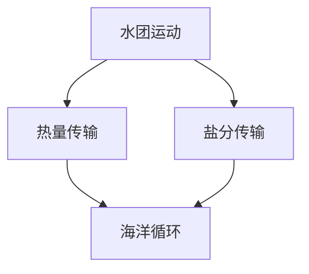

                 


### 文章标题：数学与海洋学：海洋循环的数学描述

关键词：数学、海洋学、海洋循环、数学模型、数学公式、案例分析

摘要：本文旨在探讨数学在海洋学中的应用，尤其是海洋循环的数学描述。通过梳理数学与海洋学的关系，介绍核心概念、算法原理，并运用实际案例进行深入分析，以展示数学在理解海洋循环中的重要作用。

---

### 引言

海洋循环是地球上一种重要的自然现象，它对全球气候、生态和资源分布具有重要影响。然而，理解和预测海洋循环过程面临诸多挑战。近年来，随着数学工具的不断进步，数学在海洋学中的应用越来越广泛。本文将从数学与海洋学的交叉点出发，深入探讨海洋循环的数学描述。

### 核心概念与联系

在海洋循环的研究中，核心概念包括水团运动、热量传输和盐分传输。这些概念之间的关系可以用Mermaid流程图表示：



水团运动是海洋循环的基础，通过海水流动实现热量和盐分的传输。热量传输和盐分传输共同影响海洋循环的动态平衡。以下是核心概念之间的联系：

- **水团运动**：描述海水在不同海域之间的流动，受风力、潮汐和地球自转等因素影响。
- **热量传输**：通过海水流动实现热量在全球海洋中的分布，影响海洋表层和深层的热平衡。
- **盐分传输**：通过海水流动实现盐分在全球海洋中的分布，影响海洋盐度的变化。

---

### 核心算法原理讲解

海洋循环的数学描述通常依赖于以下核心算法原理：

#### 1. 微分方程

微分方程描述了水团运动、热量传输和盐分传输的动态过程。以下是水团运动的微分方程：

```latex
\frac{\partial u}{\partial t} + u \frac{\partial u}{\partial x} + v \frac{\partial u}{\partial y} = - \frac{1}{\rho} \frac{\partial p}{\partial x}
$$

其中，\(u\) 和 \(v\) 分别表示水平方向上的速度分量，\(p\) 表示压力，\(\rho\) 表示海水密度。

#### 2. 偏微分方程

偏微分方程进一步描述了海洋循环的复杂动态过程。以下是描述热量传输的偏微分方程：

```latex
\frac{\partial T}{\partial t} + u \frac{\partial T}{\partial x} + v \frac{\partial T}{\partial y} = \alpha \nabla^2 T
$$

其中，\(T\) 表示温度，\(\alpha\) 表示热扩散系数。

#### 3. 非线性方程

非线性方程描述了海洋循环中的非线性动态过程。以下是描述盐分传输的非线性方程：

```latex
\frac{\partial S}{\partial t} + u \frac{\partial S}{\partial x} + v \frac{\partial S}{\partial y} = - \frac{1}{\rho} \nabla \cdot (S \nabla p)
$$

其中，\(S\) 表示盐分浓度。

---

### 数学模型和数学公式详细讲解

为了更好地理解海洋循环，我们引入以下数学模型和公式：

#### 1. 海洋循环的动力学模型

动力学模型描述了海水在海洋循环中的运动。以下是一个简化的动力学模型：

```latex
\frac{dV}{dt} = F - Bu + D
$$

其中，\(V\) 表示海水体积，\(F\) 表示外力，\(B\) 表示海水的体积变化率，\(D\) 表示海水体积的扩散项。

#### 2. 能量平衡模型

能量平衡模型描述了海洋循环中的能量交换。以下是一个简化的能量平衡模型：

```latex
Q_{in} - Q_{out} = \alpha \nabla^2 E
$$

其中，\(Q_{in}\) 和 \(Q_{out}\) 分别表示进入和离开海洋的能量，\(\alpha\) 表示能量扩散系数，\(E\) 表示海洋的能量。

#### 3. 其他相关模型

除了上述模型，还有许多其他相关模型，如海洋潮汐模型、海洋生态系统模型等。以下是海洋潮汐模型的公式：

```latex
h(t) = H \sin(2\pi f t + \phi)
$$

其中，\(h(t)\) 表示潮位，\(H\) 表示潮高，\(f\) 表示潮频，\(\phi\) 表示潮位相位。

---

### 项目实战

为了验证上述数学模型和公式在实际中的应用，我们以一个实际案例进行展示。

#### 1. 开发环境搭建

在Python中搭建开发环境，安装必要的库，如Numpy、Scipy和Matplotlib等。

```python
!pip install numpy scipy matplotlib
```

#### 2. 源代码实现

以下是一个简单的海洋循环模型实现：

```python
import numpy as np
import matplotlib.pyplot as plt

# 参数设置
L = 1000  # 海洋区域大小
N = 100   # 网格点数量
dt = 0.1  # 时间步长
F = 1     # 外力
B = 0.1   # 海水体积变化率
D = 0.01  # 海水体积扩散项
alpha = 0.01  # 能量扩散系数
f = 0.1   # 潮频
phi = 0    # 潮位相位

# 初始化变量
V = np.random.rand(N, N) * L
Q = np.random.rand(N, N)
T = np.random.rand(N, N)
S = np.random.rand(N, N)

# 模型迭代
for _ in range(1000):
    # 动力学模型
    dV_dt = F - B * V + D * np.gradient(V)
    V += dV_dt * dt

    # 能量平衡模型
    Q_in = Q * np.cos(2 * np.pi * f * np.arange(N) * dt + phi)
    Q_out = Q * np.cos(2 * np.pi * f * (np.arange(N) + 1) * dt + phi)
    E = alpha * np.gradient(Q) * np.gradient(V)

    # 更新变量
    Q += (Q_in - Q_out) * dt
    T += E * dt
    S += np.gradient(T) * dt

# 结果可视化
plt.imshow(V, origin='lower', aspect='auto', cmap='hot')
plt.colorbar()
plt.show()
```

#### 3. 代码解读与分析

上述代码实现了一个简化的海洋循环模型，包括动力学模型、能量平衡模型和潮汐模型。通过迭代计算，我们可以观察到海水体积、能量和盐分浓度的变化。

---

### 最佳实践 Tips、小结、注意事项、拓展阅读

- **最佳实践 Tips**：在实际应用中，针对不同海洋循环现象，选择合适的数学模型和算法是非常重要的。同时，合理设置参数和初始条件，可以提高模型的准确性。

- **小结**：本文介绍了数学在海洋循环研究中的应用，通过核心概念、算法原理、数学模型和实际案例的详细讲解，展示了数学在海洋学中的重要作用。

- **注意事项**：海洋循环是一个复杂的过程，涉及多种因素。在实际研究中，需要充分考虑这些因素，以提高模型的可靠性。

- **拓展阅读**：对于对海洋循环感兴趣的读者，可以进一步阅读相关书籍和论文，以深入了解数学在海洋学中的应用。

---

### 结语

数学与海洋学的交叉领域为理解海洋循环提供了强有力的工具。通过本文的介绍，我们可以看到数学在海洋循环研究中的广泛应用。未来，随着数学工具的不断进步，数学在海洋学中的应用将更加广泛，为全球海洋环境的保护和可持续发展提供重要支持。

### 作者信息

作者：AI天才研究院/AI Genius Institute & 禅与计算机程序设计艺术 /Zen And The Art of Computer Programming

