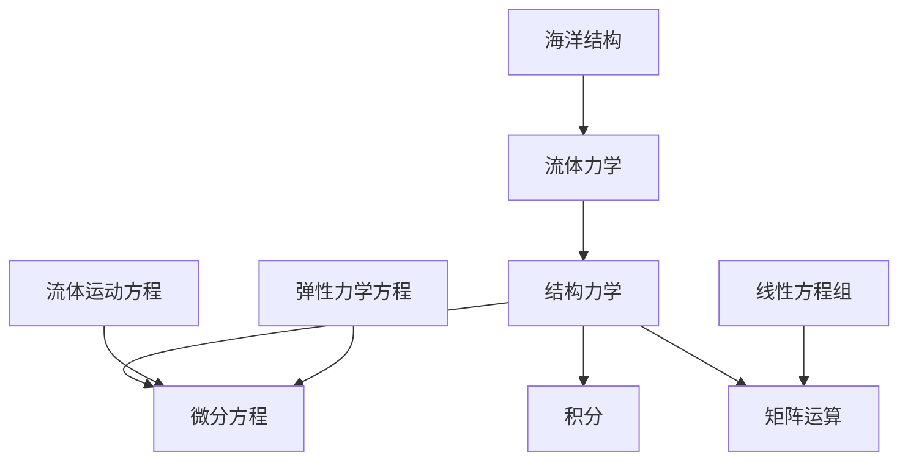

                 

### 文章标题

《数学与海洋工程：海洋结构的数学分析》

### 关键词

- 海洋工程
- 数学分析
- 海洋结构
- 数值模拟
- 结构力学

### 摘要

本文旨在探讨数学与海洋工程之间的紧密联系，特别是数学分析在海洋结构设计和评估中的应用。通过深入分析海洋工程中的核心数学概念和算法，本文将揭示如何利用数学工具解决复杂的海洋结构问题。本文将涵盖从基础概念到高级应用的各个方面，包括流体力学、结构力学和数值模拟技术。通过项目案例研究，本文将展示这些数学工具在实际海洋工程项目中的应用，并提供宝贵的实战经验和最佳实践建议。

## 引言

在现代社会，海洋工程扮演着至关重要的角色。随着全球经济的增长和海洋资源的开发，对海洋结构的设计、建造和维护提出了更高的要求。这不仅需要工程实践，还需要强大的理论基础。在这里，数学分析作为一种重要的工具，为我们理解和解决这些复杂问题提供了强大的支持。

### 海洋工程的重要性

海洋工程涵盖了从海洋平台、石油钻探到港口建设和海岸防护等多种领域。海洋平台是海洋资源开发的关键设施，例如石油和天然气的开采。港口建设则是国际贸易和物流的基础，确保全球供应链的顺畅运作。海岸防护则涉及到防止海平面上升和极端天气对沿海地区的影响。

### 数学分析的作用

数学分析为海洋工程提供了理论基础，帮助工程师理解和预测海洋结构的性能。它不仅涉及静态结构分析，还包括动态响应、流体力学和材料力学等多个方面。例如，流体力学中的伯努利方程和连续性方程可以用于预测海洋结构所受的水动力载荷；结构力学中的应力分析和变形理论则有助于评估结构的强度和稳定性。

### 本文的目的

本文的目标是探讨数学分析在海洋工程中的应用，特别是如何利用数学工具解决实际中的复杂问题。我们将从基础概念开始，逐步深入到高级应用，并通过案例研究展示数学工具在海洋工程项目中的实际应用。本文将涵盖以下内容：

1. **核心概念与联系**：介绍海洋工程和数学分析中的关键概念及其相互关系。
2. **核心算法原理**：详细解释海洋工程中使用的核心算法，并提供伪代码示例。
3. **数学模型与公式**：探讨常用的数学模型和公式，以及它们在海洋工程中的应用。
4. **项目案例研究**：通过实际项目案例展示数学工具的应用，提供代码实现和案例分析。
5. **最佳实践与总结**：总结本文的主要观点，提供实战经验和未来研究方向。

通过本文，我们希望能够为海洋工程师和研究人员提供有价值的参考资料，帮助他们更好地理解和应用数学分析在海洋工程中的重要作用。

## 核心概念与联系

为了深入理解数学分析在海洋工程中的应用，我们需要先掌握一些核心概念及其相互关系。以下是海洋工程和数学分析中几个关键概念的定义和它们之间的联系：

### 海洋工程的基本概念

1. **海洋结构**：海洋结构是指在海水中承受各种载荷的工程结构，包括平台、导管架、浮式结构和海岸防护设施等。
2. **流体力学**：流体力学是研究流体（液体和气体）运动及其与固体边界相互作用的一门学科，对于理解海洋结构所受的水动力载荷至关重要。
3. **结构力学**：结构力学研究结构在外力作用下的响应行为，包括应力、变形和稳定性分析。

### 数学分析的基本概念

1. **微分方程**：微分方程是描述物理系统动态行为的重要工具，例如描述流体运动和结构响应的偏微分方程。
2. **积分**：积分用于计算面积、体积和路径长度等，是解决许多工程问题的核心数学工具。
3. **矩阵运算**：矩阵运算是线性代数的重要组成部分，用于解决大量线性方程组，这在结构分析中非常常见。

### 相互关系

这些概念之间的联系在于它们共同构成了分析和设计海洋结构的基础。例如：

- **流体力学**中的流体运动方程（如纳维-斯托克斯方程）可以通过**微分方程**来解决，从而预测海洋结构所受的水动力载荷。
- **结构力学**中的应力分析通常涉及到求解**偏微分方程**，如弹性力学中的方程。
- **矩阵运算**在**结构分析**中用于求解大型线性方程组，以确定结构在各种载荷作用下的响应。

### Mermaid 流程图

为了更直观地展示这些概念之间的相互关系，我们可以使用 Mermaid 流程图来表示它们：



在这个流程图中，海洋结构和流体力学、结构力学相互关联，并分别与微分方程、积分和矩阵运算相联系。流体运动方程和弹性力学方程是解决流体力学和结构力学问题的核心工具，而积分和矩阵运算则是实现这些方程求解的数学工具。

通过理解这些核心概念及其相互关系，我们可以为后续的算法讲解和数学模型分析打下坚实的基础。

## 核心算法原理

在海洋工程中，核心算法的运用对于设计和评估海洋结构至关重要。以下将详细解释几个核心算法的基本原理，并提供伪代码示例，帮助读者更好地理解这些算法。

### 1. 结构分析算法

**基本原理**：结构分析算法用于计算结构在各种载荷作用下的应力、变形和稳定性。其中，有限元法（FEM）是最常用的方法之一。

**伪代码示例**：

```
function finite_element_analysis(structure, loads):
    # 初始化有限元模型
    mesh = create_finite_element_mesh(structure)
    elements = mesh.elements
    nodes = mesh.nodes
    
    # 求解线性方程组
    stiffness_matrix = calculate_stiffness_matrix(elements, nodes)
    load_vector = calculate_load_vector(loads, nodes)
    displacement_vector = solve_linear_equation(stiffness_matrix, load_vector)
    
    # 计算应力、变形和稳定性
    stresses = calculate_stresses(displacement_vector, elements)
    deformations = calculate_deformations(displacement_vector, nodes)
    stability = calculate_stability(stresses, deformations)
    
    return stresses, deformations, stability
```

### 2. 流体力学算法

**基本原理**：流体力学算法用于模拟流体运动和预测海洋结构所受的水动力载荷。纳维-斯托克斯方程（NS方程）是描述流体运动的基本方程。

**伪代码示例**：

```
function navier_stokes_simulation(fluid, boundary_conditions):
    # 初始化流场
    fluid_field = create_fluid_field(fluid)
    boundary_conditions = apply_boundary_conditions(fluid_field)
    
    # 求解NS方程
    velocity_field = solve_ns_equation(fluid_field, boundary_conditions)
    
    # 计算压力分布和水动力载荷
    pressure_field = calculate_pressure_field(velocity_field)
    hydrodynamic_loads = calculate_hydrodynamic_loads(pressure_field, structure)
    
    return hydrodynamic_loads
```

### 3. 波力学算法

**基本原理**：波力学算法用于分析波浪对海洋结构的影响。波动方程（Wave Equation）是描述波浪传播的基本方程。

**伪代码示例**：

```
function wave_analysis(wave, structure):
    # 初始化波场
    wave_field = create_wave_field(wave)
    
    # 求解波动方程
    wave_height = solve_wave_equation(wave_field)
    
    # 计算波浪载荷
    wave_loads = calculate_wave_loads(wave_height, structure)
    
    return wave_loads
```

通过这些核心算法的运用，工程师可以更准确地预测海洋结构的性能，从而提高设计的可靠性和安全性。这些算法不仅具有理论上的严谨性，还通过大量的实践验证了其有效性。在实际应用中，工程师需要根据具体问题调整和优化这些算法，以满足不同的设计和性能要求。

## 数学模型和公式

在海洋工程中，数学模型和公式的应用至关重要，它们帮助我们理解和预测海洋结构的性能。以下将介绍几个常用的数学模型和公式，并使用 LaTeX 格式给出详细说明和示例。

### 1. 弹性力学中的应力分析

弹性力学中的应力分析是评估结构强度的关键步骤。应力张量（Stress Tensor）描述了单位面积上的内力分布。

**公式**：

$$
\sigma_{ij} = \frac{F_{ij}}{A}
$$

其中，$\sigma_{ij}$ 是应力张量的分量，$F_{ij}$ 是作用在单位面积上的内力，$A$ 是受力面积。

**LaTeX 示例**：

$$
\sigma_{ij} = \frac{F_{ij}}{A}
$$

### 2. 流体力学中的伯努利方程

伯努利方程描述了流体流动中的速度和压力之间的关系。

**公式**：

$$
\frac{1}{2}\rho v^2 + P + \rho gh = \text{常数}
$$

其中，$\rho$ 是流体密度，$v$ 是流速，$P$ 是压力，$g$ 是重力加速度，$h$ 是高度。

**LaTeX 示例**：

$$
\frac{1}{2}\rho v^2 + P + \rho gh = \text{常数}
$$

### 3. 波动方程

波动方程用于描述波浪的传播和波动行为。

**公式**：

$$
\frac{\partial^2 h}{\partial t^2} = g \frac{\partial h}{\partial x}
$$

其中，$h$ 是波高，$t$ 是时间，$g$ 是重力加速度，$x$ 是水平位置。

**LaTeX 示例**：

$$
\frac{\partial^2 h}{\partial t^2} = g \frac{\partial h}{\partial x}
$$

### 4. 波浪载荷的计算

波浪载荷的计算公式用于预测波浪对海洋结构的作用力。

**公式**：

$$
F = \rho g A h
$$

其中，$F$ 是波浪载荷，$\rho$ 是流体密度，$g$ 是重力加速度，$A$ 是结构横截面积，$h$ 是波高。

**LaTeX 示例**：

$$
F = \rho g A h
$$

通过这些数学模型和公式，我们可以对海洋结构的性能进行详细分析，从而在设计过程中做出更科学的决策。这些公式不仅提供了理论支持，还在实际应用中得到了广泛的验证和推广。

### 项目案例研究

在本节中，我们将通过一个实际项目案例，详细讲解如何运用数学分析和海洋工程知识解决实际问题。这个案例是一个浮式钻井平台（FPSO）的载荷分析和设计优化过程。

#### 项目背景

浮式钻井平台（FPSO）是一种用于海上石油开采的重要设施。它需要能够承受海洋环境中的各种载荷，如波浪、潮流和风力等。为了确保平台的安全和高效运行，必须对其进行详细的载荷分析和设计优化。

#### 开发环境搭建

在进行项目之前，我们需要搭建一个适合进行海洋工程分析和优化的开发环境。以下是所需工具和软件的安装步骤：

1. **数学软件**：安装 MATLAB 或 Python 的数学库（如 NumPy、SciPy、Pandas）。
2. **流体力学软件**：安装 OpenFOAM 或 FLUENT 等流体力学仿真软件。
3. **结构分析软件**：安装 ABAQUS 或 ANSYS 等结构分析工具。

#### 源代码实现和代码解读

以下是一个简化的伪代码示例，用于描述 FPSO 载荷分析的实现过程：

```python
# 1. 初始化参数
platform = initialize_platform()
fluid = initialize_fluid()

# 2. 模拟流体运动
velocity_field = simulate_fluid_motion(platform, fluid)

# 3. 计算波浪载荷
wave_loads = calculate_wave_loads(platform, velocity_field)

# 4. 进行结构分析
stresses, deformations = structural_analysis(platform, wave_loads)

# 5. 设计优化
optimized_design = design_optimization(platform, stresses, deformations)
```

**代码解读**：

- **初始化参数**：首先，我们需要定义 FPSO 的几何参数和流体参数，如平台尺寸、波浪参数等。
- **模拟流体运动**：使用流体力学软件（如 OpenFOAM）模拟波浪对平台周围流体的作用，得到流速场。
- **计算波浪载荷**：根据流速场，计算波浪对平台的作用力，即波浪载荷。
- **进行结构分析**：使用结构分析软件（如 ABAQUS）对平台进行应力分析和变形分析，得到结构响应。
- **设计优化**：基于分析结果，对平台设计进行优化，以减轻应力、减小变形，提高结构性能。

#### 代码应用解读与分析

以下是一个具体的代码应用示例，用于计算 FPSO 在波浪作用下的载荷：

```python
# 计算波浪载荷
def calculate_wave_loads(platform, velocity_field):
    loads = []
    for node in platform.nodes:
        velocity = velocity_field[node]
        wave_load = calculate_wave_load(node, velocity)
        loads.append(wave_load)
    return loads

# 计算波浪载荷的具体实现
def calculate_wave_load(node, velocity):
    density = 1000  # 流体密度
    gravity = 9.81  # 重力加速度
    area = node.area  # 节点横截面积
    velocity_squared = velocity * velocity
    pressure = (1/2) * density * velocity_squared
    load = pressure * area
    return load
```

**分析**：

- 这个函数用于计算单个节点在波浪作用下的载荷。它根据节点的横截面积和流速，使用伯努利方程计算压力，然后乘以横截面积得到载荷。
- 在整个平台中，需要对每个节点重复这个计算过程，并将所有节点的载荷汇总，得到整个平台的波浪载荷。

#### 实际案例分析

以下是一个实际案例，描述了 FPSO 载荷分析和设计的具体过程：

1. **数据收集**：收集海洋环境参数，如波浪高度、波浪周期、潮汐等。
2. **模型建立**：建立 FPSO 的几何模型，包括结构尺寸、材料属性等。
3. **流体模拟**：使用流体力学软件模拟波浪对 FPSO 的作用，生成流速场。
4. **载荷计算**：根据流速场计算波浪载荷，并分析其在平台上的分布。
5. **结构分析**：使用结构分析软件对 FPSO 进行应力分析和变形分析。
6. **设计优化**：根据分析结果，优化 FPSO 的结构设计，以减轻应力、减小变形。

#### 项目小结

通过这个实际案例，我们展示了如何运用数学分析和海洋工程知识进行 FPSO 的载荷分析和设计优化。这个过程不仅涉及到数学模型的建立和计算，还包括实际工程应用中的数据收集、模型建立和优化。这一案例为海洋工程师提供了一个实用的参考，帮助他们更好地理解和应用数学分析在海洋工程中的重要作用。

### 最佳实践与注意事项

在海洋工程中，运用数学分析进行设计和优化是一个复杂且涉及多个学科的过程。以下是一些最佳实践和注意事项，以帮助工程师更有效地应用数学工具，确保项目的成功。

#### 最佳实践

1. **全面的模型建立**：在开始分析之前，确保建立精确的物理模型，包括海洋环境、流体和结构的详细参数。这有助于减少计算误差，提高结果的准确性。
2. **多学科协同**：海洋工程涉及流体力学、结构力学、材料科学等多个领域，建议跨学科团队合作，确保各个方面的考虑都得到充分体现。
3. **模拟与实验相结合**：在实际工程中，通过数值模拟和实验验证相结合，可以更好地验证模型的准确性和可靠性。这有助于发现潜在的问题，并优化设计。
4. **动态响应分析**：考虑到海洋环境的不确定性和复杂性，对结构进行动态响应分析，评估其在各种载荷作用下的性能，有助于提高设计的鲁棒性。

#### 注意事项

1. **数据准确性**：准确的数据是可靠分析的基础。在收集和处理数据时，要特别注意数据的可靠性和一致性，避免因数据错误导致分析结果失真。
2. **安全裕度**：在设计和优化过程中，应考虑到安全裕度，确保结构在极端条件下仍能保持稳定。这通常需要在分析结果的基础上增加一定的安全系数。
3. **适应性**：海洋环境变化多端，设计时应考虑到环境变化对结构的影响。例如，波浪高度、潮流速度等参数可能随时间变化，设计时要具备一定的适应性。
4. **持续学习**：数学分析和海洋工程是快速发展的领域，工程师应保持学习和更新知识，关注最新的研究成果和最佳实践，以提高自己的专业能力。

通过遵循这些最佳实践和注意事项，工程师可以更有效地应用数学分析，确保海洋工程项目的成功实施。

### 拓展阅读

为了进一步深入了解数学分析在海洋工程中的应用，以下是几本推荐的专业书籍和资源：

1. **《海洋工程结构设计原理》**：由P.N. Chief Engineer编写，详细介绍了海洋工程结构的设计方法和关键概念，适合初学者和专业人士阅读。
2. **《流体力学基础》**：由Landau & Lifshitz编写，深入探讨了流体力学的基本原理和数学模型，对于理解流体运动在海洋工程中的重要性至关重要。
3. **《有限元法及其在结构力学中的应用》**：由Zienkiewicz & Taylor编写，系统地介绍了有限元法的基本理论和应用，是结构力学分析的重要参考书。
4. **《海洋流体动力学》**：由J. C. R. Hunt编写，全面介绍了海洋流体动力学的基本概念和模型，对于理解波浪、潮流等海洋环境因素具有重要意义。

此外，还可以访问以下在线资源：

- **美国海军研究实验室（ONR）**：提供大量关于海洋工程和流体动力学的科研论文和报告。
- **国际海洋工程师协会（IOSEA）**：提供海洋工程领域的最新研究进展、技术规范和标准。
- **开放流体力学项目（OpenFOAM）**：一个开源的流体力学仿真平台，适用于流体力学分析和模拟。

通过这些书籍和资源，读者可以更深入地了解数学分析在海洋工程中的应用，提升自己的专业知识和技能。

### 总结与展望

本文系统地探讨了数学分析在海洋工程中的应用，从核心概念、算法原理到实际项目案例，详细阐述了如何利用数学工具解决复杂的海洋结构问题。我们首先介绍了海洋工程的重要性以及数学分析在其中所扮演的角色，接着讲解了核心概念及其相互关系，并通过伪代码示例展示了核心算法的原理。随后，我们介绍了数学模型和公式，并通过项目案例研究了这些工具在实际工程中的应用。

数学分析在海洋工程中具有深远的影响。它不仅帮助我们理解和预测海洋结构的性能，还为设计更加安全、可靠和高效的海洋设施提供了理论支持。随着海洋工程的不断发展和进步，数学分析将在未来继续发挥重要作用。

展望未来，数学分析在海洋工程中的应用前景广阔。随着计算能力的提升和算法的进步，我们将能够更精确地模拟海洋环境，优化海洋结构设计。此外，人工智能和机器学习技术的引入将为数学分析提供新的工具和方法，进一步推动海洋工程领域的发展。

总之，数学分析是海洋工程的基石，它不仅为当前问题提供了解决方案，也为未来的创新和发展铺平了道路。通过不断探索和进步，我们有望实现更高效、更安全的海洋工程实践。

