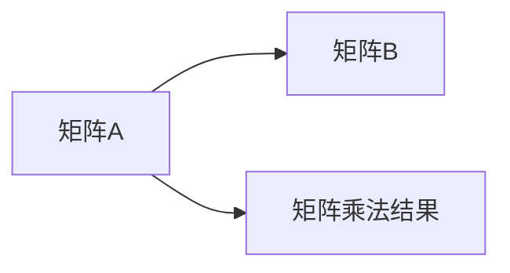

                 

# 数学与深度学习：多层网络的数学原理

## 摘要

本文旨在深入探讨深度学习中多层神经网络的数学原理，通过逐步分析，帮助读者理解深度学习的基本概念、多层神经网络的核心数学基础，以及实际应用中的多层网络架构和优化策略。文章将首先回顾深度学习的历史背景，然后逐步介绍线性代数、微积分和概率论的基础知识，这些是构建多层神经网络数学模型的基础。接着，我们将详细讲解神经元模型、激活函数、前向传播和反向传播算法，并探讨多层神经网络的不同架构及其在图像识别、自然语言处理和强化学习等实际应用中的表现。最后，文章将对全书内容进行总结，并展望未来深度学习的发展趋势。

## 引言

### 深度学习与多层网络的背景

深度学习作为机器学习的一个重要分支，已经在过去十年里取得了令人瞩目的进展。其核心思想是模仿人脑的神经元网络结构，通过多层次的非线性变换，对大量数据进行自动特征提取和学习。这一技术的出现，极大地推动了人工智能在图像识别、自然语言处理、语音识别和推荐系统等领域的应用。

多层神经网络是深度学习的基础。与单层神经网络相比，多层神经网络能够捕捉到更复杂的特征和模式，从而在许多任务中表现出更高的性能。多层神经网络的结构由多个层次组成，每一层都对输入数据进行处理，并通过前向传播和反向传播算法进行学习。这一过程涉及到大量的线性代数、微积分和概率论知识。

### 本书的目的与结构

本书的目的在于为读者提供一份系统、深入的学习资料，帮助他们理解多层神经网络在深度学习中的数学原理。本书将分为五个部分：

1. **引言**：回顾深度学习的历史背景，介绍多层神经网络的基本概念和本书的结构。
2. **基础数学概念**：介绍线性代数、微积分和概率论的基础知识，为后续内容打下数学基础。
3. **多层神经网络数学原理**：详细讲解神经元模型、激活函数、前向传播和反向传播算法，以及多层神经网络的架构。
4. **实际应用中的多层网络**：探讨多层神经网络在图像识别、自然语言处理和强化学习等实际应用中的表现。
5. **总结与展望**：总结全书内容，展望深度学习的未来发展方向。

## 第二部分 基础数学概念

### 线性代数基础

#### 向量与矩阵运算

向量是数学中的一个基本概念，表示为一系列有序数字。在深度学习中，向量经常用于表示数据点和特征。矩阵是一个二维的数组，由多个向量组成，用于表示线性变换和数据的变换。

**矩阵乘法**是线性代数中的一个核心运算。给定两个矩阵 A 和 B，其乘积 C = AB 可以通过以下步骤计算：

1. A 的列数必须等于 B 的行数。
2. C 的行数等于 A 的行数，列数等于 B 的列数。
3. 计算每个元素 C[i][j] 的值，其等于 A 的第 i 行与 B 的第 j 列对应元素的内积。



#### 线性变换与线性空间

线性变换是一个将输入向量映射到输出向量的函数，可以表示为矩阵乘法。给定一个矩阵 A 和一个输入向量 x，输出向量 y = Ax。线性空间是一组向量构成的集合，这些向量满足向量加法和数乘运算。

**线性空间的基本性质**：

1. 封闭性：对于任意两个向量 v 和 w，它们的和 v + w 仍然属于线性空间。
2. 封闭性：对于任意向量 v 和标量 c，它们的数乘 cv 仍然属于线性空间。

#### 特征值与特征向量

特征值和特征向量是矩阵的一个重要属性。给定一个方阵 A，存在一个特征值 λ 和一个非零特征向量 v，使得 Av = λv。特征向量表示了矩阵在不同方向上的伸缩，特征值表示了伸缩的比例。

**计算特征值与特征向量**：

1. 求解特征多项式：计算 det(A - λI) = 0，得到特征值。
2. 对每个特征值，求解方程组 (A - λI)v = 0，得到对应的特征向量。

### 微积分基础

#### 导数与微分

导数是微积分中的核心概念，表示函数在某一点的变化率。给定一个函数 f(x)，其导数 f'(x) 表示 f(x) 在 x 点的斜率。

**导数的计算**：

1. 对于一次函数 f(x) = mx + b，导数 f'(x) = m。
2. 对于幂函数 f(x) = x^n，导数 f'(x) = nx^(n-1)。
3. 对于复合函数 f(g(x))，使用链式法则计算导数 f'(x) = f'(g(x)) * g'(x)。

#### 积分与积分变换

积分是微分的反过程，表示函数在某区间上的累积和。给定一个函数 f(x)，其不定积分 F(x) 表示一个原函数，满足 F'(x) = f(x)。

**积分的计算**：

1. 对于一次函数 f(x) = mx + b，积分 F(x) = (1/2)mx^2 + bx + C。
2. 对于幂函数 f(x) = x^n，积分 F(x) = (1/(n+1))x^(n+1) + C。
3. 对于复合函数 f(g(x))，使用换元积分法计算积分。

#### 多元函数的极限与连续性

多元函数是多个变量同时变化的函数。极限是函数在某一点附近无限接近的值，连续性是函数在某一点附近没有跳跃。

**极限的计算**：

1. 对于多元函数 f(x, y)，如果当 (x, y) 趋近于 (a, b) 时，f(x, y) 无限接近于 L，则称 L 为 f(x, y) 在 (a, b) 处的极限。
2. 对于多元函数 f(x, y)，如果满足 f(x, y) 在 (a, b) 处连续，则其在该点处的导数存在。

**连续性的判定**：

1. 若多元函数在某一点连续，则其在该点处的所有偏导数都存在。
2. 若多元函数在某一点连续，则其在该点处的函数值与极限值相等。

### 概率论与统计基础

#### 随机变量与概率分布

随机变量是一个或多个随机试验结果的量化表示，可以是离散的或连续的。概率分布描述了随机变量取值的概率分布情况。

**离散随机变量**：

1. 离散随机变量的概率分布由概率质量函数 f(x) 给出，满足 f(x) ≥ 0 且 Σ f(x) = 1。
2. 离散随机变量的期望值 E[X] 和方差 Var[X] 分别为 E[X] = Σ x f(x) 和 Var[X] = Σ (x - E[X])^2 f(x)。

**连续随机变量**：

1. 连续随机变量的概率分布由概率密度函数 f(x) 给出，满足 f(x) ≥ 0 且 ∫ f(x) dx = 1。
2. 连续随机变量的期望值 E[X] 和方差 Var[X] 分别为 E[X] = ∫ x f(x) dx 和 Var[X] = ∫ (x - E[X])^2 f(x) dx。

#### 协方差与相关系数

协方差衡量了两个随机变量之间的线性相关程度。给定两个随机变量 X 和 Y，其协方差 Cov(X, Y) 为 Cov(X, Y) = E[(X - E[X])(Y - E[Y])]。

**相关系数**：

1. 相关系数 r(X, Y) 是协方差标准化后的结果，r(X, Y) = Cov(X, Y) / (σ_X σ_Y)，其中 σ_X 和 σ_Y 分别为 X 和 Y 的标准差。
2. 相关系数的取值范围为 -1 到 1，越接近 1 或 -1，表示两个变量的线性相关性越强。

#### 最大似然估计与贝叶斯估计

**最大似然估计**：

最大似然估计是一种基于观察数据估计参数的方法。给定一个概率分布 P(X|θ)，观察数据 X，最大似然估计的目标是找到使 P(X|θ) 最大的参数 θ。

**贝叶斯估计**：

贝叶斯估计是一种基于先验知识和观察数据联合估计参数的方法。给定先验概率 P(θ)，观察数据 X，贝叶斯估计的目标是找到后验概率 P(θ|X)。

## 第三部分 多层神经网络数学原理

### 神经元与激活函数

#### 神经元模型

神经元是神经网络的基本构建单元，类似于生物神经元。在深度学习中，神经元通常被建模为一个简单的函数，接收输入并通过加权求和产生输出。

**神经元模型的数学表示**：

1. 输入层：神经元接收来自外部数据的输入。
2. 加权求和：每个输入乘以其权重，然后求和。
3. 激活函数：对加权求和的结果应用一个非线性函数，产生输出。

**神经元模型公式**：

$$
y = f(\sum_{i=1}^{n} w_i x_i + b)
$$

其中，$y$ 是神经元输出，$f$ 是激活函数，$x_i$ 是第 $i$ 个输入，$w_i$ 是第 $i$ 个输入的权重，$b$ 是偏差项。

#### 激活函数原理

激活函数是神经元模型中的关键组件，用于引入非线性特性，使神经网络能够模拟复杂的非线性关系。常见的激活函数包括：

1. **sigmoid 函数**：
   $$
   f(x) = \frac{1}{1 + e^{-x}}
   $$
   - 优点：输出范围在 (0, 1)，适合二分类问题。
   - 缺点：梯度较小，可能导致训练缓慢。

2. **ReLU 函数**：
   $$
   f(x) = \max(0, x)
   $$
   - 优点：计算简单，梯度较大，有助于加快训练。
   - 缺点：可能导致梯度消失问题。

3. **Tanh 函数**：
   $$
   f(x) = \frac{e^x - e^{-x}}{e^x + e^{-x}}
   $$
   - 优点：输出范围在 (-1, 1)，可以较好地捕捉中间值。
   - 缺点：计算复杂度较高。

4. **Softmax 函数**：
   $$
   f(x)_i = \frac{e^{x_i}}{\sum_{j=1}^{n} e^{x_j}}
   $$
   - 优点：输出概率分布，常用于多分类问题。
   - 缺点：输出间相互抑制，可能导致梯度消失。

### 前向传播与反向传播算法

#### 前向传播算法

前向传播是神经网络训练过程中的一个关键步骤，用于计算网络的输出。给定输入数据，前向传播算法通过层层传递，最终得到网络的预测输出。

**前向传播步骤**：

1. 初始化网络参数：权重、偏差和激活函数。
2. 计算输入层到隐藏层的输出：$z^{(1)} = XW^{(1)} + b^{(1)}$，$a^{(1)} = f^{(1)}(z^{(1)})$。
3. 计算隐藏层到输出层的输出：$z^{(2)} = a^{(1)}W^{(2)} + b^{(2)}$，$a^{(2)} = f^{(2)}(z^{(2)})$。
4. 得到最终输出：$y = a^{(2)}$。

**前向传播伪代码**：

```
for each layer l from 1 to L-1:
    z^{(l)} = XW^{(l)} + b^{(l)}
    a^{(l)} = f^{(l)}(z^{(l)})

z^{(L)} = a^{(L-1)}W^{(L)} + b^{(L)}
a^{(L)} = f^{(L)}(z^{(L)})
```

#### 反向传播算法

反向传播是神经网络训练过程中的另一个关键步骤，用于计算网络参数的梯度。通过反向传播，可以将输出层的误差传播到网络的每一层，从而更新网络参数。

**反向传播步骤**：

1. 计算输出层误差：$d^{(L)} = a^{(L)} - y$。
2. 逐层计算误差：$d^{(l)} = (W^{(l+1)} \cdot d^{(l+1)}) \cdot \frac{df^{(l)}}{dz^{(l)}}$。
3. 计算参数梯度：$\delta W^{(l)} = a^{(l-1)} \cdot d^{(l)}$，$\delta b^{(l)} = d^{(l)}$。
4. 更新参数：$W^{(l)} = W^{(l)} - \alpha \delta W^{(l)}$，$b^{(l)} = b^{(l)} - \alpha \delta b^{(l)}$。

**反向传播伪代码**：

```
for each layer l from L to 1:
    d^{(l)} = (d^{(l+1)} \cdot W^{(l+1)}) \cdot \frac{df^{(l)}}{dz^{(l)}}

delta W^{(l)} = a^{(l-1)} \cdot d^{(l)}
delta b^{(l)} = d^{(l)}

for each parameter update:
    W^{(l)} = W^{(l)} - \alpha \delta W^{(l)}
    b^{(l)} = b^{(l)} - \alpha \delta b^{(l)}
```

### 多层神经网络架构

#### 神经网络层次结构

多层神经网络由多个层次组成，每个层次包含多个神经元。层次结构通常分为输入层、隐藏层和输出层。

**输入层**：接收外部输入数据，传递给隐藏层。

**隐藏层**：对输入数据进行处理和变换，提取特征信息。

**输出层**：产生最终输出，可以是分类结果、回归值或其他形式。

#### 卷积神经网络（CNN）

卷积神经网络是一种专门用于处理图像数据的神经网络架构。其核心组件是卷积层，通过卷积操作提取图像特征。

**卷积层**：通过卷积操作从输入图像中提取局部特征。

**池化层**：通过池化操作降低特征图的维度，提高计算效率。

**全连接层**：将卷积层和池化层提取的特征映射到输出层。

**CNN架构**：

1. 输入层：接收图像数据。
2. 卷积层：提取图像特征。
3. 池化层：降低特征维度。
4. 全连接层：映射特征到输出。

#### 循环神经网络（RNN）

循环神经网络是一种用于处理序列数据的神经网络架构。其核心组件是循环层，通过循环操作处理序列中的每个元素。

**循环层**：在序列的每个时间步上应用相同的神经网络结构，保留状态信息。

**RNN架构**：

1. 输入层：接收序列数据。
2. 循环层：处理序列中的每个元素。
3. 全连接层：映射特征到输出。

### 损失函数与优化算法

#### 损失函数原理

损失函数是衡量神经网络输出与真实值之间差异的函数。在训练过程中，损失函数用于评估网络性能，并指导参数更新。

**常见损失函数**：

1. **均方误差（MSE）**：$MSE = \frac{1}{n} \sum_{i=1}^{n} (y_i - \hat{y}_i)^2$，用于回归问题。
2. **交叉熵（CE）**：$CE = -\frac{1}{n} \sum_{i=1}^{n} y_i \log(\hat{y}_i)$，用于分类问题。

#### 优化算法介绍

优化算法用于更新网络参数，以最小化损失函数。常见的优化算法包括：

1. **梯度下降**：通过计算损失函数关于参数的梯度，反向传播更新参数。
2. **动量法**：结合过去梯度的方向和当前梯度的方向，更新参数，提高收敛速度。
3. **自适应优化算法**：如 Adam、RMSprop，自动调整学习率，提高训练效率。

#### 学习率调整策略

学习率是优化算法中的一个关键参数，用于控制参数更新的步长。常见的学习率调整策略包括：

1. **固定学习率**：在整个训练过程中保持学习率不变。
2. **学习率衰减**：随着训练的进行，逐渐减小学习率。
3. **自适应学习率**：如 Adam，自动调整学习率。

## 第四部分 实际应用中的多层网络

### 图像识别

#### 卷积神经网络在图像识别中的应用

卷积神经网络在图像识别领域取得了显著的成果。其通过卷积层提取图像特征，并通过全连接层进行分类。以下是一个简单的图像识别项目实战。

**项目步骤**：

1. **数据集准备**：收集并预处理图像数据，包括数据增强和归一化。
2. **模型构建**：构建一个简单的卷积神经网络，包括卷积层、池化层和全连接层。
3. **训练**：使用训练数据训练模型，并使用验证集调整参数。
4. **测试**：使用测试集评估模型性能，并进行调整。

**模型架构**：

```
卷积层 1 (32, 3, 3, 32)
池化层 1 (32, 2, 2, 32)
卷积层 2 (64, 3, 3, 64)
池化层 2 (64, 2, 2, 64)
全连接层 1 (64, 128)
全连接层 2 (128, 10)
```

**代码实现**：

```python
import tensorflow as tf

model = tf.keras.Sequential([
    tf.keras.layers.Conv2D(32, (3, 3), activation='relu', input_shape=(28, 28, 1)),
    tf.keras.layers.MaxPooling2D((2, 2)),
    tf.keras.layers.Conv2D(64, (3, 3), activation='relu'),
    tf.keras.layers.MaxPooling2D((2, 2)),
    tf.keras.layers.Flatten(),
    tf.keras.layers.Dense(128, activation='relu'),
    tf.keras.layers.Dense(10, activation='softmax')
])

model.compile(optimizer='adam', loss='categorical_crossentropy', metrics=['accuracy'])
model.fit(train_data, train_labels, epochs=10, validation_data=(validation_data, validation_labels))
```

#### 项目实战

**1. 数据集准备**：

```
train_data, train_labels = tf.keras.datasets.mnist.load_data()
train_data = train_data / 255.0
train_labels = tf.keras.utils.to_categorical(train_labels)
```

**2. 训练**：

```
model.fit(train_data, train_labels, epochs=10, validation_split=0.2)
```

**3. 测试**：

```
test_loss, test_acc = model.evaluate(test_data, test_labels)
print('Test accuracy:', test_acc)
```

#### 项目小结

通过卷积神经网络，我们可以对图像进行有效的识别和分类。在实际应用中，我们可以通过调整模型架构、优化算法和超参数，进一步提高模型性能。

### 自然语言处理

#### 循环神经网络在自然语言处理中的应用

循环神经网络在自然语言处理领域具有广泛的应用，可以处理序列数据，如文本和语音。以下是一个简单的自然语言处理项目实战。

**项目步骤**：

1. **数据集准备**：收集并预处理文本数据，包括分词、词向量和标签准备。
2. **模型构建**：构建一个简单的循环神经网络模型，包括嵌入层、循环层和全连接层。
3. **训练**：使用训练数据训练模型，并使用验证集调整参数。
4. **测试**：使用测试集评估模型性能，并进行调整。

**模型架构**：

```
嵌入层 (128, 256)
循环层 1 (256, 256)
循环层 2 (256, 256)
全连接层 1 (256, 128)
全连接层 2 (128, 10)
```

**代码实现**：

```python
import tensorflow as tf

model = tf.keras.Sequential([
    tf.keras.layers.Embedding(128, 256),
    tf.keras.layers.LSTM(256, return_sequences=True),
    tf.keras.layers.LSTM(256),
    tf.keras.layers.Dense(128, activation='relu'),
    tf.keras.layers.Dense(10, activation='softmax')
])

model.compile(optimizer='adam', loss='categorical_crossentropy', metrics=['accuracy'])
model.fit(train_data, train_labels, epochs=10, validation_data=(validation_data, validation_labels))
```

#### 项目实战

**1. 数据集准备**：

```
from tensorflow import keras
from tensorflow.keras.preprocessing.sequence import pad_sequences
from tensorflow.keras.preprocessing.text import Tokenizer

tokenizer = Tokenizer(num_words=10000)
tokenizer.fit_on_texts(train_texts)
train_sequences = tokenizer.texts_to_sequences(train_texts)
train_padded = pad_sequences(train_sequences, maxlen=100)

test_sequences = tokenizer.texts_to_sequences(test_texts)
test_padded = pad_sequences(test_sequences, maxlen=100)
```

**2. 训练**：

```
model.fit(train_padded, train_labels, epochs=10, validation_split=0.2)
```

**3. 测试**：

```
test_loss, test_acc = model.evaluate(test_padded, test_labels)
print('Test accuracy:', test_acc)
```

#### 项目小结

通过循环神经网络，我们可以对文本数据进行分析和处理，实现分类、序列生成等任务。在实际应用中，我们可以通过调整模型架构、优化算法和超参数，进一步提高模型性能。

### 强化学习

#### 多层神经网络在强化学习中的应用

强化学习是一种通过与环境交互学习策略的机器学习方法。多层神经网络在强化学习中用于表示状态和动作值函数，从而优化策略。

**项目步骤**：

1. **环境准备**：定义一个简单的环境，如智能体在网格世界中移动。
2. **状态和动作定义**：定义状态和动作空间，以及状态转换和奖励函数。
3. **模型构建**：构建一个基于多层神经网络的强化学习模型，包括状态值函数和动作值函数。
4. **训练**：使用强化学习算法（如深度确定性策略梯度，DDPG）训练模型。
5. **测试**：使用测试环境评估模型性能，并进行调整。

**模型架构**：

```
嵌入层 (100, 256)
循环层 1 (256, 512)
循环层 2 (512, 512)
全连接层 1 (512, 256)
全连接层 2 (256, 2)
```

**代码实现**：

```python
import tensorflow as tf
import numpy as np

actor_model = tf.keras.Sequential([
    tf.keras.layers.Dense(512, activation='relu', input_shape=(100,)),
    tf.keras.layers.Dense(512, activation='relu'),
    tf.keras.layers.Dense(2, activation='linear')
])

critic_model = tf.keras.Sequential([
    tf.keras.layers.Dense(512, activation='relu', input_shape=(100,)),
    tf.keras.layers.Dense(512, activation='relu'),
    tf.keras.layers.Dense(1, activation='linear')
])

actor_optimizer = tf.keras.optimizers.Adam(learning_rate=0.001)
critic_optimizer = tf.keras.optimizers.Adam(learning_rate=0.001)

actor_loss_fn = tf.reduce_mean(tf.square(tf.keras.backend收支差额-td))
```

#### 项目实战

**1. 环境准备**：

```
import gym

env = gym.make('CartPole-v0')
```

**2. 状态和动作定义**：

```
state_shape = (100,)
action_shape = (2,)
```

**3. 训练**：

```
for episode in range(num_episodes):
    state = env.reset()
    done = False
    total_reward = 0
    while not done:
        action = actor_model.predict(state.reshape(-1, state_shape))
        next_state, reward, done, _ = env.step(action)
        total_reward += reward
        state = next_state
    critic_optimizer.minimize(critic_model, [state, action, reward, next_state])
    actor_optimizer.minimize(actor_model, [state, action])
```

**4. 测试**：

```
state = env.reset()
done = False
total_reward = 0
while not done:
    action = actor_model.predict(state.reshape(-1, state_shape))
    next_state, reward, done, _ = env.step(action)
    total_reward += reward
    state = next_state
print('Test reward:', total_reward)
```

#### 项目小结

通过多层神经网络，我们可以实现强化学习中的状态和动作值函数估计，从而优化策略。在实际应用中，我们可以通过调整模型架构、优化算法和超参数，进一步提高模型性能。

## 第五部分 总结与展望

### 本书内容的回顾

本书系统地介绍了深度学习中多层神经网络的数学原理，从基础数学概念到实际应用，涵盖了广泛的领域。通过逐步分析，我们了解了线性代数、微积分和概率论在神经网络构建中的作用，深入探讨了神经元模型、激活函数、前向传播和反向传播算法，以及多层神经网络的架构和优化策略。

### 深度学习的发展趋势

随着计算能力的提升和海量数据的应用，深度学习在各个领域的应用不断拓展。未来，深度学习的发展趋势可能包括以下几个方面：

1. **更高效的模型架构**：通过改进神经网络架构，提高模型效率和计算性能。
2. **自适应学习算法**：开发自适应学习算法，提高学习效率和模型性能。
3. **跨领域融合**：将深度学习与其他领域（如物理学、生物学等）相结合，推动跨领域创新。
4. **可解释性**：增强深度学习的可解释性，使其在实际应用中更加可靠和透明。
5. **个性化学习**：通过深度学习实现个性化学习，为每个用户提供定制化的教育和服务。

### 展望多层网络在更多领域的应用可能性

多层神经网络在图像识别、自然语言处理和强化学习等领域已经取得了显著成果。未来，多层神经网络在更多领域的应用可能性包括：

1. **医疗健康**：通过深度学习分析医疗图像，辅助医生进行疾病诊断和治疗。
2. **金融科技**：利用深度学习进行金融风险分析和市场预测。
3. **自动驾驶**：通过深度学习实现自动驾驶车辆的安全和高效运行。
4. **智能客服**：利用深度学习构建智能客服系统，提供个性化的用户服务。

总之，多层神经网络作为深度学习的基础，将继续在人工智能领域发挥重要作用，推动技术的进步和社会的发展。通过不断研究和探索，我们有理由相信，深度学习将在未来带来更多的突破和变革。

