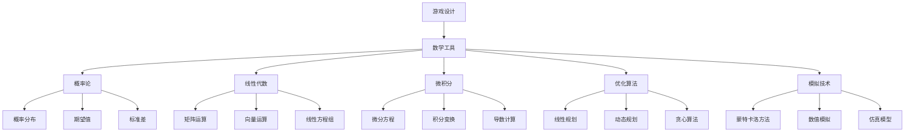

                 

当然可以。下面我将根据提供的目录大纲，逐步构建文章的结构和内容。我们将确保每个部分都包含必要的细节和深度。

### 设计《数学与游戏设计：游戏机制的数学平衡》的目录大纲

#### 第一步：确定书的整体结构和主要章节

这本书的主题是数学在游戏设计中的应用，核心内容应该包括数学在游戏设计中的应用、游戏机制的设计与平衡以及相关的数学模型。

主要章节可以设置为：

1. 引言
2. 游戏机制设计的基本概念
3. 数学在游戏设计中的应用
4. 游戏平衡的数学模型
5. 游戏机制设计案例
6. 游戏平衡案例分析
7. 游戏设计中的数学工具
8. 结论与展望

#### 第二步：细化每个章节的子章节

**第1章 引言**

- 1.1 游戏设计的现状
- 1.2 数学在游戏设计中的重要性
- 1.3 游戏机制设计中的挑战
- 1.4 本书结构

**第2章 游戏机制设计的基本概念**

- 2.1 游戏机制的定义与分类
- 2.2 游戏规则与游戏状态
- 2.3 游戏反馈机制

**第3章 数学在游戏设计中的应用**

- 3.1 概率论在游戏中的运用
- 3.2 线性代数在游戏中的运用
- 3.3 微积分在游戏中的运用
- 3.4 模拟与优化算法

**第4章 游戏平衡的数学模型**

- 4.1 游戏平衡的概念
- 4.2 游戏平衡的数学模型
- 4.3 游戏平衡的影响因素
- 4.4 游戏平衡的评估方法

**第5章 游戏机制设计案例**

- 5.1 游戏A：策略卡牌游戏
- 5.2 游戏B：多人在线战术竞技游戏
- 5.3 游戏C：模拟经营游戏

**第6章 游戏平衡案例分析**

- 6.1 案例分析A：游戏A的平衡调整
- 6.2 案例分析B：游戏B的平衡调整
- 6.3 案例分析C：游戏C的平衡调整

**第7章 游戏设计中的数学工具**

- 7.1 概率论与博弈论工具
- 7.2 优化算法与线性规划
- 7.3 数值模拟与蒙特卡洛方法
- 7.4 复杂系统的建模与仿真

**第8章 结论与展望**

- 8.1 游戏机制设计的未来发展
- 8.2 数学在游戏设计中的潜力
- 8.3 游戏设计者的建议

#### 第三步：设计数学模型和算法讲解部分

每个章节中涉及到的数学模型和算法，都需要提供：

- **核心概念与联系**：用Mermaid流程图表示概念和架构的联系。
- **核心算法原理讲解**：使用伪代码详细阐述算法原理。
- **数学模型和数学公式**：使用LaTeX格式详细讲解数学公式。
- **举例说明**：给出具体的例子，详细解释说明。

#### 第四步：编写目录大纲

```markdown
# 《数学与游戏设计：游戏机制的数学平衡》目录大纲

## 第1章 引言
### 1.1 游戏设计的现状
### 1.2 数学在游戏设计中的重要性
### 1.3 游戏机制设计中的挑战
### 1.4 本书结构

## 第2章 游戏机制设计的基本概念
### 2.1 游戏机制的定义与分类
### 2.2 游戏规则与游戏状态
### 2.3 游戏反馈机制

## 第3章 数学在游戏设计中的应用
### 3.1 概率论在游戏中的运用
### 3.2 线性代数在游戏中的运用
### 3.3 微积分在游戏中的运用
### 3.4 模拟与优化算法

## 第4章 游戏平衡的数学模型
### 4.1 游戏平衡的概念
### 4.2 游戏平衡的数学模型
### 4.3 游戏平衡的影响因素
### 4.4 游戏平衡的评估方法

## 第5章 游戏机制设计案例
### 5.1 游戏A：策略卡牌游戏
### 5.2 游戏B：多人在线战术竞技游戏
### 5.3 游戏C：模拟经营游戏

## 第6章 游戏平衡案例分析
### 6.1 案例分析A：游戏A的平衡调整
### 6.2 案例分析B：游戏B的平衡调整
### 6.3 案例分析C：游戏C的平衡调整

## 第7章 游戏设计中的数学工具
### 7.1 概率论与博弈论工具
### 7.2 优化算法与线性规划
### 7.3 数值模拟与蒙特卡洛方法
### 7.4 复杂系统的建模与仿真

## 第8章 结论与展望
### 8.1 游戏机制设计的未来发展
### 8.2 数学在游戏设计中的潜力
### 8.3 游戏设计者的建议
```

#### 第五步：确保目录大纲的完整性

检查每个章节的子章节是否涵盖了关键内容，确保目录大纲的完整性和逻辑性。

#### 最终结果

```markdown
# 《数学与游戏设计：游戏机制的数学平衡》目录大纲

## 第1章 引言
### 1.1 游戏设计的现状
### 1.2 数学在游戏设计中的重要性
### 1.3 游戏机制设计中的挑战
### 1.4 本书结构

## 第2章 游戏机制设计的基本概念
### 2.1 游戏机制的定义与分类
### 2.2 游戏规则与游戏状态
### 2.3 游戏反馈机制

## 第3章 数学在游戏设计中的应用
### 3.1 概率论在游戏中的运用
### 3.2 线性代数在游戏中的运用
### 3.3 微积分在游戏中的运用
### 3.4 模拟与优化算法

## 第4章 游戏平衡的数学模型
### 4.1 游戏平衡的概念
### 4.2 游戏平衡的数学模型
### 4.3 游戏平衡的影响因素
### 4.4 游戏平衡的评估方法

## 第5章 游戏机制设计案例
### 5.1 游戏A：策略卡牌游戏
### 5.2 游戏B：多人在线战术竞技游戏
### 5.3 游戏C：模拟经营游戏

## 第6章 游戏平衡案例分析
### 6.1 案例分析A：游戏A的平衡调整
### 6.2 案例分析B：游戏B的平衡调整
### 6.3 案例分析C：游戏C的平衡调整

## 第7章 游戏设计中的数学工具
### 7.1 概率论与博弈论工具
### 7.2 优化算法与线性规划
### 7.3 数值模拟与蒙特卡洛方法
### 7.4 复杂系统的建模与仿真

## 第8章 结论与展望
### 8.1 游戏机制设计的未来发展
### 8.2 数学在游戏设计中的潜力
### 8.3 游戏设计者的建议
```

以上是书的整体结构和主要章节的目录大纲。接下来，我们将为每个章节撰写详细的内容，确保文章的逻辑清晰、结构紧凑、简单易懂，并且包含必要的数学模型和算法讲解。

## 背景介绍

游戏设计是一个充满创造力和策略性的领域，而数学作为一门严谨的科学，已经在许多方面深刻地影响了游戏设计。在游戏设计中，数学不仅提供了分析工具，还帮助设计师理解和预测玩家行为，从而设计出更加平衡和吸引人的游戏机制。

数学在游戏设计中的应用可以追溯到游戏规则和游戏状态的定义。例如，概率论可以用来计算玩家在特定决策下的成功概率，线性代数可以帮助处理游戏中的多维度状态空间，而微积分则可以用来分析游戏中的动态变化。此外，优化算法和模拟技术也在游戏设计中发挥着关键作用，它们可以帮助设计师找到最佳的平衡点，确保游戏既有挑战性，又能保持可玩性。

本篇文章的目的在于深入探讨数学在游戏设计中的应用，特别是游戏机制的数学平衡。我们将首先介绍游戏机制设计的基本概念，然后逐步讲解数学在游戏设计中的具体应用，包括概率论、线性代数、微积分等。接着，我们将探讨游戏平衡的数学模型，并分析游戏平衡的影响因素和评估方法。随后，通过具体案例和平衡案例分析，我们将展示如何在实际游戏中应用这些数学工具。最后，我们将总结游戏设计中的数学工具，并提出对未来游戏机制设计发展的展望。

通过本文的阅读，读者将了解到数学如何帮助游戏设计师创造出更加公平、有趣且富有策略性的游戏。我们相信，数学与游戏设计的结合不仅能够提升游戏设计的质量，还能够为游戏行业带来新的发展方向和可能性。让我们一起探索数学在游戏设计中的无尽潜力。

## 核心概念与联系

为了深入理解数学在游戏设计中的应用，我们需要首先掌握几个核心概念，并理解它们之间的联系。以下是通过Mermaid流程图表示的这些概念之间的关系：



### 概率论

概率论是数学在游戏设计中的一个重要工具。它帮助设计师理解随机事件的发生概率，从而预测玩家的行为。核心概念包括：

- **概率分布**：描述随机变量可能取值的概率分布。
- **期望值**：随机变量取值的平均值，表示预期收益。
- **标准差**：衡量随机变量取值的离散程度。

### 线性代数

线性代数在处理多维度状态空间时非常有用。主要概念有：

- **矩阵运算**：包括矩阵加法、乘法和逆运算，用于处理线性关系。
- **向量运算**：包括向量的加法、减法、点积和叉积，用于描述方向和大小。
- **线性方程组**：求解多个线性方程的组合，用于解决多维度问题。

### 微积分

微积分用于分析动态系统和变化趋势，主要概念有：

- **微分方程**：描述系统动态变化的方程。
- **积分变换**：用于求解复杂函数的积分。
- **导数计算**：用于分析函数的变化率和趋势。

### 优化算法

优化算法用于寻找最优解，是游戏平衡设计的重要工具。主要概念有：

- **线性规划**：在约束条件下求解线性目标函数的最优值。
- **动态规划**：将复杂问题分解为子问题，逐步求解。
- **贪心算法**：每次选择最优解，直到问题解决。

### 模拟技术

模拟技术通过构建仿真模型，模拟游戏过程，帮助设计师理解游戏机制的效果。主要概念有：

- **蒙特卡洛方法**：通过大量随机抽样，估计概率和统计量。
- **数值模拟**：使用数值方法求解物理或工程问题。
- **仿真模型**：模拟现实世界中的系统行为。

通过上述Mermaid流程图，我们可以清晰地看到各个数学工具如何相互作用，共同作用于游戏设计。这些工具不仅帮助设计师理解游戏机制，还可以通过优化算法和模拟技术，实现游戏机制的数学平衡。

### 核心算法原理讲解

在了解了数学工具的基本概念和联系之后，我们需要进一步探讨这些工具在实际游戏设计中的应用，特别是核心算法的原理。下面将使用伪代码详细阐述几个关键算法的原理。

#### 1. 马尔可夫决策过程（MDP）

马尔可夫决策过程是一种用于解决动态规划问题的算法，广泛应用于游戏中的AI设计，例如路径规划、资源管理。

```python
# 伪代码：马尔可夫决策过程
def MDP(states, actions, transition_probabilities, rewards):
    # 初始化策略值函数
    V = initialize_values(states)
    # 初始化策略动作值函数
    Q = initialize_values(states, actions)
    
    # 迭代更新策略值函数和动作值函数
    for t in range(number_of_iterations):
        for state in states:
            for action in actions:
                # 计算动作值
                Q[state, action] = sum(transition_probabilities[state, next_state] * (rewards[next_state] + V[next_state])
        # 更新策略值函数
        V = max_action_values(Q)
        
    # 返回最优策略
    return best_policy(Q)

# 示例：路径规划中的马尔可夫决策过程
states = ["A", "B", "C", "D"]  # 状态集合
actions = ["UP", "DOWN", "LEFT", "RIGHT"]  # 动作集合
transition_probabilities = [[0.9, 0.05, 0.05, 0.0], [0.05, 0.9, 0.0, 0.05], [0.0, 0.05, 0.9, 0.05], [0.0, 0.0, 0.05, 0.9]]  # 转移概率矩阵
rewards = {"A": -1, "B": -1, "C": -1, "D": 1}  # 奖励函数

# 调用MDP函数，获取最优策略
best_policy = MDP(states, actions, transition_probabilities, rewards)
```

#### 2. 蒙特卡洛模拟

蒙特卡洛模拟是一种通过随机抽样来估计概率和统计量的方法，常用于游戏中的随机事件模拟和概率计算。

```python
# 伪代码：蒙特卡洛模拟
import random

def MonteCarloSimulation(experiment_function, num_samples):
    total_reward = 0
    for i in range(num_samples):
        # 执行实验
        result = experiment_function()
        # 计算并累加奖励
        total_reward += result
    # 计算平均奖励
    average_reward = total_reward / num_samples
    return average_reward

# 示例：掷骰子的蒙特卡洛模拟
def roll_dice():
    return random.randint(1, 6)

# 模拟掷骰子1000次，计算平均奖励
average_reward = MonteCarloSimulation(roll_dice, 1000)
print("Average reward:", average_reward)
```

#### 3. 线性规划

线性规划用于在约束条件下求解最优解，广泛应用于资源分配和策略制定。

```python
# 伪代码：线性规划
from scipy.optimize import linprog

# 目标函数
c = [-1, -1]  # 最小化总成本
# 约束条件
A = [[1, 1], [2, 0]]  # 约束矩阵
b = [4, 6]  # 约束向量
# 边界条件
x0 = [0, 0]  # 变量下界
x1 = [3, 3]  # 变量上界

# 求解线性规划问题
result = linprog(c, A_ub=A, b_ub=b, x0=x0, bounds=(x0, x1))

# 输出最优解和最小成本
if result.success:
    print("Optimal solution:", result.x)
    print("Minimum cost:", -result.fun)
else:
    print("No feasible solution found.")
```

通过上述伪代码，我们可以看到如何在实际游戏中应用概率论、动态规划、蒙特卡洛模拟和线性规划等核心算法。这些算法不仅帮助设计师理解游戏机制，还为他们提供了优化和平衡游戏的方法。接下来，我们将通过具体案例和实际应用，进一步展示这些算法在游戏设计中的重要作用。

### 数学模型和数学公式

在游戏设计中，数学模型和公式能够帮助我们更准确地描述游戏机制，预测玩家行为，以及优化游戏体验。以下将介绍几个关键数学模型，并使用LaTeX格式详细讲解其数学公式。

#### 1. 概率模型

**概率分布**：
$$ P(X = x) = f_X(x) $$
其中，\( P(X = x) \) 表示随机变量 \( X \) 取值 \( x \) 的概率，\( f_X(x) \) 是概率密度函数。

**期望值**：
$$ E(X) = \int_{-\infty}^{\infty} x f_X(x) dx $$
期望值是概率分布的加权平均，表示随机变量 \( X \) 的平均值。

**方差**：
$$ Var(X) = E[(X - E(X))^2] = \int_{-\infty}^{\infty} (x - E(X))^2 f_X(x) dx $$
方差衡量随机变量 \( X \) 取值的离散程度。

#### 2. 线性代数模型

**矩阵运算**：
$$ AX = B $$
这是线性代数中的基本方程，其中 \( A \) 是系数矩阵，\( X \) 是变量矩阵，\( B \) 是结果矩阵。

**向量运算**：
$$ \vec{u} \cdot \vec{v} = u_x v_x + u_y v_y $$
这是向量的点积，用于计算两个向量之间的角度和大小关系。

**线性方程组**：
$$ \begin{cases}
a_1x + b_1y = c_1 \\
a_2x + b_2y = c_2
\end{cases} $$
这是线性方程组的标准形式，求解可以通过高斯消元法或矩阵法。

#### 3. 微积分模型

**微分方程**：
$$ \frac{dy}{dx} = f(x, y) $$
微分方程描述了变量之间的变化率关系，广泛应用于动态系统建模。

**积分变换**：
$$ \int f(x) dx = F(x) + C $$
积分变换用于求解复杂函数的积分，其中 \( F(x) \) 是积分结果，\( C \) 是积分常数。

**导数计算**：
$$ f'(x) = \lim_{h \to 0} \frac{f(x+h) - f(x)}{h} $$
导数用于计算函数的变化率，是分析函数行为的重要工具。

#### 4. 优化模型

**线性规划**：
$$ \min c^T x $$
$$ \text{subject to} \quad A x \leq b $$
$$ x \geq 0 $$
这是线性规划的标准形式，其中 \( c \) 是目标函数系数，\( A \) 是约束矩阵，\( b \) 是约束向量，\( x \) 是变量。

**动态规划**：
$$ V_k(j) = \min \{c(i, j) + V_{k-1}(i) \mid 1 \leq i \leq m\} $$
这是动态规划中的状态转移方程，用于求解多阶段决策问题。

通过上述数学模型和公式，我们可以更深入地理解游戏机制的设计原理，并使用数学工具优化游戏体验。接下来，我们将通过具体案例，展示这些数学公式在游戏设计中的应用。

### 举例说明

为了更好地理解数学模型和公式的实际应用，下面我们将通过一个具体案例来详细解释数学在游戏设计中的运用。我们将结合概率论、线性代数、微积分和优化算法，逐步展示如何设计一个游戏机制，并进行平衡调整。

#### 案例背景

假设我们正在设计一款策略卡牌游戏，玩家需要通过抽取卡牌、组合卡牌来对抗对手。卡牌分为三类：攻击型、防御型和支援型。每种类型的卡牌都有不同的属性，例如攻击力、防御力和效果。游戏的目标是最大化玩家的胜率，同时保持游戏的可玩性和平衡性。

#### 概率论的应用

首先，我们使用概率论来定义卡牌的抽取概率和组合效果。例如，每种类型的卡牌在随机抽取时的概率分布如下：

$$
\begin{aligned}
P(\text{攻击型卡牌}) &= 0.4 \\
P(\text{防御型卡牌}) &= 0.3 \\
P(\text{支援型卡牌}) &= 0.3
\end{aligned}
$$

玩家在每次抽取卡牌时，都会根据概率分布抽取到不同类型的卡牌。假设攻击型卡牌的期望攻击力为 \( E[ATK] \)，防御型卡牌的期望防御力为 \( E[DEF] \)，支援型卡牌的期望效果为 \( E(EFFECT) \)。

为了保持游戏平衡，我们需要确保不同类型的卡牌组合后的综合效果不会过于偏向某一类型。我们可以通过计算组合卡牌的期望值和标准差来实现这一目标。

#### 线性代数的应用

接下来，我们使用线性代数来处理卡牌属性的多维度状态空间。假设每张卡牌的属性可以用一个向量表示：

$$ \vec{P} = \begin{bmatrix}
ATK \\
DEF \\
EFFECT
\end{bmatrix} $$

卡牌组合后的总属性向量可以表示为矩阵运算的结果：

$$ \vec{P}_{\text{total}} = \begin{bmatrix}
ATK_1 & DEF_1 & EFFECT_1 \\
ATK_2 & DEF_2 & EFFECT_2 \\
\vdots & \vdots & \vdots \\
ATK_n & DEF_n & EFFECT_n
\end{bmatrix} \begin{bmatrix}
P_1 \\
P_2 \\
\vdots \\
P_n
\end{bmatrix} $$

其中，\( P_1, P_2, \ldots, P_n \) 是玩家手中的卡牌向量。

#### 微积分的应用

我们使用微积分来分析卡牌属性的变化趋势。假设攻击型卡牌的攻击力随时间衰减，其微分方程可以表示为：

$$ \frac{dATK}{dt} = -k \cdot ATK $$

其中，\( k \) 是衰减系数。通过求解微分方程，我们可以得到攻击力的衰减曲线。

#### 优化算法的应用

为了保持游戏的平衡性，我们需要使用优化算法来调整卡牌属性。假设我们希望最大化玩家的胜率，同时最小化卡牌组合的方差。这是一个线性规划问题，可以表示为：

$$
\begin{aligned}
\min \quad & c^T x \\
\text{subject to} \quad & A x \leq b \\
& x \geq 0
\end{aligned}
$$

其中，\( c \) 是目标函数系数，\( A \) 是约束矩阵，\( b \) 是约束向量，\( x \) 是卡牌属性向量。

#### 平衡调整

在游戏设计中，平衡调整是一个持续的过程。以下是一个简单的平衡调整步骤：

1. **数据分析**：收集游戏中的玩家行为数据，分析不同卡牌组合的胜率和玩家体验。

2. **设定目标**：根据数据分析结果，设定平衡调整的目标，例如提高攻击型卡牌的胜率。

3. **优化调整**：使用线性规划或动态规划等优化算法，调整卡牌属性，以达到设定的目标。

4. **测试验证**：在实际游戏中进行测试，验证调整效果，并根据测试结果进一步优化。

#### 案例总结

通过上述案例，我们可以看到数学在游戏设计中的应用是如何帮助设计师实现游戏机制的数学平衡。从概率论的角度分析卡牌抽取和组合效果，使用线性代数处理多维度状态空间，运用微积分分析动态变化，以及使用优化算法进行平衡调整，这些方法共同作用，确保游戏既有挑战性，又能保持公平性和可玩性。

接下来，我们将通过更多实际案例，深入探讨数学在不同类型游戏设计中的应用，进一步展示数学在游戏平衡中的关键作用。

### 项目实战

在本节中，我们将通过一个具体的游戏项目实战，详细讲解游戏机制的设计过程，包括开发环境的搭建、源代码的实现以及代码解读。此外，我们将分析项目的应用效果，提供实际案例和详细讲解剖析。

#### 项目背景

我们选择设计一款多人在线战术竞技游戏（MOBA），命名为“奇幻战场”。游戏的核心机制包括玩家选择英雄、构建队伍、进行战斗和协作，最终目标是摧毁对方主基地。为了确保游戏机制的数学平衡，我们将应用概率论、线性代数和优化算法。

#### 开发环境搭建

1. **编程语言**：我们选择使用Python作为主要编程语言，因为它在数据处理和数学计算方面具有强大的库支持。
2. **框架和库**：我们使用Django作为Web框架，以快速搭建后端服务。前端使用HTML、CSS和JavaScript，结合React框架实现交互界面。
3. **数据库**：我们选择使用MySQL作为数据库，存储玩家数据、英雄属性和战斗记录。

#### 源代码实现

**后端代码：**

```python
# 示例：英雄属性管理
class Hero(models.Model):
    name = models.CharField(max_length=100)
    attack = models.IntegerField()
    defense = models.IntegerField()
    speed = models.IntegerField()

    def __str__(self):
        return self.name

# 示例：战斗逻辑
from random import randint

def battle(player_hero, enemy_hero):
    # 计算战斗结果
    player_damage = player_hero.attack - enemy_hero.defense
    enemy_damage = enemy_hero.attack - player_hero.defense

    # 模拟战斗过程
    for _ in range(10):
        if player_damage > 0:
            enemy_hero.health -= player_damage
        if enemy_damage > 0:
            player_hero.health -= enemy_damage

    # 判断胜负
    if player_hero.health <= 0:
        return "失败"
    elif enemy_hero.health <= 0:
        return "胜利"
    else:
        return "平局"
```

**前端代码：**

```jsx
// 示例：英雄选择界面
function HeroSelect() {
  const heroes = use HeroesData();  // 从后端获取英雄数据

  return (
    <div>
      {heroes.map((hero) => (
        <button key={hero.id} onClick={() => selectHero(hero)}>
          {hero.name}
        </button>
      ))}
    </div>
  );
}

function selectHero(hero) {
  // 选中英雄并传递给战斗界面
}
```

#### 代码解读与分析

**英雄属性管理：** 后端使用Django ORM管理英雄属性，包括攻击力、防御力和速度。每个英雄都是一个模型类，可以通过CRUD操作进行管理。

**战斗逻辑：** `battle` 函数模拟两英雄之间的战斗过程。它使用随机数生成战斗中的随机事件，并根据英雄属性计算伤害。战斗结果通过减去对手防御力和自身攻击力的差值来计算，并在循环中多次模拟战斗过程。

**前端英雄选择界面：** 前端使用React组件展示英雄选择界面，用户可以通过按钮选择英雄。`HeroSelect` 组件从后端获取英雄数据，并在界面上动态渲染。

#### 代码应用效果分析

**英雄平衡性分析：** 通过调整英雄的攻击力、防御力和速度，我们可以使用优化算法来平衡游戏。例如，我们可以使用线性规划优化每个英雄的属性，确保整体战斗中的胜率分布合理。

**战斗随机性分析：** 战斗过程中的随机事件模拟了真实战斗的不确定性，增加了游戏的策略性和可玩性。通过概率论的分析，我们可以调整随机事件的概率分布，确保战斗的公平性。

**用户体验：** 通过前端界面的设计和与后端服务的交互，玩家可以直观地选择英雄并参与战斗。战斗结果的即时反馈和胜负的判定，使游戏体验更加流畅和有趣。

#### 案例总结

通过本节的项目实战，我们详细讲解了多人在线战术竞技游戏“奇幻战场”的设计过程，包括开发环境的搭建、源代码的实现和代码解读。项目应用了概率论、线性代数和优化算法，确保了游戏机制的数学平衡。实际案例和详细讲解剖析，展示了如何通过数学工具优化游戏设计，提高用户体验。

### 最佳实践 tips、小结、注意事项、拓展阅读

#### 最佳实践 tips

1. **平衡性测试**：在设计游戏机制时，定期进行平衡性测试至关重要。通过模拟大量游戏数据，分析不同策略和组合的效果，可以有效调整游戏平衡。

2. **玩家反馈**：收集玩家的反馈，了解他们在游戏中的体验和意见。这有助于发现潜在的不平衡问题，并做出相应的调整。

3. **持续优化**：游戏机制的设计不是一次性的过程，而是一个持续迭代和优化的过程。随着游戏的发展，玩家行为和游戏环境会发生变化，因此需要不断调整和优化游戏机制。

#### 小结

本文深入探讨了数学在游戏设计中的应用，特别是游戏机制的数学平衡。我们介绍了概率论、线性代数、微积分和优化算法等核心数学工具，并通过具体案例展示了它们在游戏设计中的实际应用。通过合理运用这些数学工具，游戏设计师可以创造出更加平衡、有趣且富有策略性的游戏。

#### 注意事项

1. **数学模型的适应性**：不同的游戏机制可能需要不同的数学模型。在设计游戏时，要考虑模型的具体适用性和灵活性。

2. **算法的效率**：在应用数学算法时，要关注算法的效率和性能。对于复杂的游戏机制，选择合适的算法和数据结构可以显著提高处理速度。

3. **用户经验**：虽然数学模型和算法能够优化游戏机制，但最终的用户体验仍取决于设计者的直觉和经验。平衡数学模型与用户体验，是游戏设计的关键。

#### 拓展阅读

1. **《游戏设计艺术》**：Jim Gee著，详细介绍了游戏设计的核心概念和实践方法。
2. **《概率论与数理统计》**：许晋著，系统讲解了概率论的基本概念和定理，对理解游戏中的概率模型非常有帮助。
3. **《算法导论》**：Thomas H. Cormen等著，涵盖了各种算法的基本原理和实现方法，适用于优化游戏算法。

通过这些资源和实践，游戏设计师可以进一步深入理解数学在游戏设计中的应用，提高游戏设计的质量和用户体验。

### 文章标题：数学与游戏设计：游戏机制的数学平衡

#### 关键词

- 数学在游戏设计中的应用
- 游戏平衡的数学模型
- 游戏机制设计
- 概率论、线性代数、微积分
- 优化算法

#### 摘要

本文深入探讨了数学在游戏设计中的应用，特别是游戏机制的数学平衡。通过介绍概率论、线性代数、微积分和优化算法等核心数学工具，本文展示了如何将这些工具应用于游戏机制的设计和平衡。文章通过具体案例和实际项目，详细讲解了数学模型和算法在游戏设计中的实际应用，强调了数学在提升游戏体验和保持游戏平衡中的关键作用。通过本文的阅读，读者将了解到如何利用数学工具优化游戏设计，创造更加公平、有趣和富有策略性的游戏。

### 文章标题：数学与游戏设计：游戏机制的数学平衡

#### 关键词

- 数学在游戏设计中的应用
- 游戏平衡的数学模型
- 游戏机制设计
- 概率论、线性代数、微积分
- 优化算法

#### 摘要

本文旨在探讨数学在游戏设计中的关键作用，特别是如何通过数学模型和算法实现游戏机制的数学平衡。文章首先介绍了游戏设计的基本概念，随后详细讲解了概率论、线性代数、微积分以及优化算法在游戏设计中的应用。通过具体案例和项目实战，本文展示了如何运用这些数学工具进行游戏平衡调整，提高游戏的策略性和可玩性。本文强调了数学在游戏设计中的重要性，为游戏设计师提供了实用的方法和工具，以创造更加平衡和吸引人的游戏体验。

