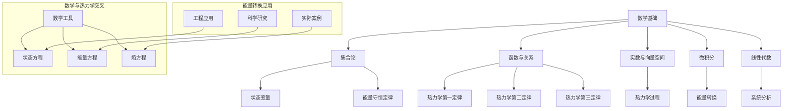

                 

### 引言

在科学和技术的发展历程中，数学与物理学一直占据着举足轻重的地位。特别是数学与热力学的关系，不仅在理论上具有深远的影响，也在实际应用中发挥着关键作用。数学作为一门精确的科学工具，为研究复杂物理现象提供了强有力的支持；而热力学则是一门研究能量转换和系统平衡的学科，其核心概念和原理广泛应用于工程、化学、生物、环境等多个领域。

本文旨在探讨数学与热力学在能量转换领域中的密切联系，通过系统化的分析和推理，揭示两者之间的内在关系与相互影响。我们将首先回顾数学和热力学的基本概念，接着深入探讨能量转换的数学定律，并借助实际案例来理解这些定律的应用。

本文的结构如下：

1. **数学基础**：介绍数学中的基本概念和工具，如集合、函数、微积分等，为后续内容打下基础。
2. **热力学基础**：阐述热力学的基本原理，包括状态变量、能量守恒定律等。
3. **数学与热力学的交汇**：通过构建Mermaid流程图，展示数学与热力学核心概念之间的联系。
4. **能量转换的数学定律**：详细解释能量转换的三大定律，并使用伪代码和数学公式进行阐述。
5. **实际案例分析**：通过具体案例展示能量转换定律在工程和科学研究中的应用。
6. **总结与展望**：总结文章的主要观点，并提出未来研究方向。

通过本文的逐步分析，希望读者能够更深入地理解数学与热力学在能量转换中的重要性，以及如何运用数学方法来研究和优化能量转换过程。这不仅有助于提升理论知识的深度，也能够在实际应用中提供指导。接下来，我们将从数学和热力学的起源和发展开始，逐步探讨这两大学科的内在联系。

### 文章关键词

- 数学
- 热力学
- 能量转换
- 数学定律
- 状态变量
- 能量守恒
- 微积分
- 伪代码
- 实际案例
- 热力学定律

### 摘要

本文围绕数学与热力学的交叉领域——能量转换，探讨了其核心概念和原理。首先，我们回顾了数学中的基本概念和工具，如集合、函数、微积分等，为后续分析提供了基础。接着，我们介绍了热力学的基本原理，包括状态变量和能量守恒定律。通过构建Mermaid流程图，我们展示了数学与热力学核心概念之间的内在联系。随后，我们详细解释了能量转换的三大定律，并使用伪代码和数学公式进行了阐述。最后，通过实际案例的分析，我们展示了这些定律在工程和科学研究中的应用。本文旨在帮助读者深入理解数学与热力学在能量转换领域中的重要性，以及如何运用数学方法来研究和优化能量转换过程。

### 数学基础

在探讨数学与热力学的交集之前，我们需要先了解数学中的一些基本概念和工具，这些将为后续内容打下坚实的基础。数学作为一门精确的科学工具，在描述和解析物理现象方面具有独特的优势。从集合论到微积分，每一个数学分支都在不同的层面上为物理学的理论和实践提供了支持。

#### 集合、函数和关系

集合（Set）是数学中最基础的概念之一。集合是由确定的元素组成的整体，这些元素可以是任何事物，如数字、字母或其他集合。集合的基本操作包括并集、交集和补集，它们在分析复杂系统时非常有用。函数（Function）则是另一个核心概念，它定义了一个从集合A到集合B的映射关系，即对于集合A中的每一个元素，函数都唯一地对应集合B中的一个元素。函数在描述物理系统的状态变化和变量之间的关系时非常重要。

关系（Relation）是函数的一个更一般的形式，它可以是函数，也可以不是。关系描述了集合中元素之间的某种关联，可以用关系矩阵或者图来表示。在物理学中，关系常用于描述系统内部的相互作用和约束条件。

#### 实数与向量空间

实数（Real Numbers）是数学中的另一个基础概念。实数集包含了有理数和无理数，它们构成了一个完整的数系，可以进行各种数学运算。实数在物理学中的应用非常广泛，尤其是在描述物理量的测量和计算时。

向量空间（Vector Space）是另一个重要的数学工具，它用于描述具有大小和方向的量，如速度、力等。向量空间中的向量可以通过向量加法和数乘运算进行组合和变换。矩阵（Matrix）是向量空间的推广，用于表示线性变换和系统方程，这在解决复杂的物理问题中非常有用。

#### 微积分

微积分（Calculus）是数学的一个重要分支，主要用于研究函数的变化率和积分。微分（Differentiation）研究的是函数在某一点的局部行为，即该点的斜率或导数。这在物理学中有着广泛的应用，如描述速度、加速度等物理量的变化。

积分（Integration）则研究的是函数的总和，即面积或体积。定积分用于计算曲线下的面积或曲线与坐标轴围成的区域，而无穷级数积分则用于求解更复杂的积分问题。微积分在研究能量转换和系统动态过程中起着关键作用。

#### 线性代数

线性代数（Linear Algebra）是研究向量空间和线性变换的数学分支。线性方程组、矩阵、行列式等概念在物理学中有着广泛的应用，特别是在处理多变量问题和系统分析时。

#### 数学工具的应用

这些数学工具不仅在理论研究中起着关键作用，也在实际应用中发挥着重要作用。例如，集合和关系可以用于描述复杂的系统状态和约束条件，向量空间和线性代数可以用于分析系统的动态行为，而微积分则可以用于研究能量的变化和传递。

通过上述数学基础，我们为后续的热力学分析提供了必要的工具和框架。在下一部分，我们将介绍热力学的基本概念和原理，进一步探讨数学与热力学的密切联系。

#### 热力学的基本概念

热力学是一门研究能量转换和系统平衡的物理学分支，其核心概念涵盖了状态变量、能量守恒定律、热力学第一、第二和第三定律等。理解这些基本概念是深入探讨数学与热力学交叉领域的关键。

**状态变量**

在热力学中，状态变量是用来描述系统状态的物理量。典型的状态变量包括温度（T）、压力（P）、体积（V）、内能（U）和熵（S）等。这些变量反映了系统的宏观特性，可以通过实验进行测量。状态变量之间的关系由热力学方程描述，这些方程构成了热力学的理论基础。

**能量守恒定律**

能量守恒定律是热力学的核心原则之一，它表明在一个封闭系统中，能量不会凭空产生也不会凭空消失，只能从一种形式转换为另一种形式。数学上，这可以表示为：

$$\Delta U = Q - W$$

其中，$\Delta U$ 是系统内能的变化，$Q$ 是系统吸收的热量，$W$ 是系统对外做的功。这个方程揭示了能量转换的基本规律，即在一个热力学过程中，能量既不会增加也不会减少，只会从一种形式转移到另一种形式。

**热力学第一定律**

热力学第一定律是能量守恒定律在热力学系统中的应用，它强调的是能量守恒原则在系统内部的体现。第一定律可以表述为：能量既不会凭空消失也不会凭空产生，在一个封闭系统中，能量的总量保持不变。具体到热力学过程中，这意味着系统的内能变化等于吸收的热量和对外做的功的代数和。

**热力学第二定律**

热力学第二定律揭示了能量转换过程中不可逆性的本质，以及系统熵增的趋势。第二定律可以表述为：在一个封闭系统中，自发过程总是朝着熵增的方向进行。熵（S）是衡量系统无序度的量度，其增加表示系统的状态变得更加无序。

熵的增加可以用以下方程表示：

$$\Delta S \geq \frac{Q}{T}$$

其中，$\Delta S$ 是熵的变化，$Q$ 是系统吸收的热量，$T$ 是绝对温度。这个方程表明，当系统吸收热量时，其熵会增加，且熵的增加与温度成反比。

**热力学第三定律**

热力学第三定律描述了在绝对零度（0 K）时，纯物质的完美晶体熵为零。这个定律可以表述为：随着温度趋近于绝对零度，所有完美晶体的熵趋近于零。第三定律对低温物理学和量子力学有重要影响，它为研究极端条件下系统的行为提供了理论依据。

**热力学过程**

热力学过程包括等压过程、等体过程、等温过程和绝热过程等。每种过程都有其特定的热力学方程和特性。例如，等压过程中的热力学方程为：

$$\Delta U = C_V \Delta T$$

其中，$C_V$ 是定容热容，$\Delta T$ 是温度变化。这个方程描述了在恒定压力下，系统的内能变化与温度变化之间的关系。

**数学与热力学的交叉**

数学在热力学中的应用主要体现在对状态变量、能量转换和热力学过程的描述和计算。例如，通过建立数学模型，可以更精确地描述系统的行为，通过使用微积分工具，可以研究系统内部的动态变化，通过使用线性代数和矩阵方法，可以解决复杂的系统方程。

总之，热力学的基本概念和原理为理解能量转换提供了理论框架。数学工具则为研究这些概念和原理提供了强有力的支持。在下一部分，我们将通过构建Mermaid流程图，展示数学与热力学核心概念之间的内在联系，从而更好地理解这两个学科之间的密切关系。

#### 数学与热力学的交汇

在了解了数学和热力学的基础概念之后，我们将通过构建Mermaid流程图来展示这两个领域之间的核心概念关系，从而更好地理解它们在能量转换问题中的应用。

**Mermaid流程图**

Mermaid是一种基于Markdown的图形化工具，用于创建流程图、序列图等。以下是一个简单的Mermaid流程图，它展示了数学与热力学之间的一些关键概念及其相互关系：



**流程图详细解释**

1. **数学基础**：这一部分包括集合论、函数与关系、实数与向量空间、微积分和线性代数，它们是数学的核心概念，为热力学的研究提供了必要的工具。
2. **热力学基础**：这部分包括状态变量、能量守恒定律、热力学第一定律、第二定律和第三定律，它们构成了热力学的理论基础。
3. **数学与热力学的交叉**：在这一部分，我们通过数学工具（如状态方程、能量方程和熵方程）来描述和解析热力学问题，从而建立数学与热力学之间的联系。
4. **能量转换应用**：这部分展示了数学与热力学在工程应用、科学研究和实际案例中的具体应用，进一步体现了这两个领域之间的紧密联系。

通过这个流程图，我们可以清晰地看到数学与热力学之间的核心概念及其相互关系。数学提供了精确的描述和计算工具，而热力学则应用这些工具来研究能量转换过程。这种交叉不仅丰富了理论研究的深度，也为实际应用提供了强有力的支持。

#### 能量转换的数学定律

在了解了数学和热力学的基础概念及其关系后，我们将进一步探讨能量转换的数学定律，这些定律是研究能量转换过程的核心。能量转换的数学定律包括热力学第一定律、第二定律和第三定律，每一个定律都在不同层面上揭示了能量转换的基本规律。

**热力学第一定律**

热力学第一定律是能量守恒定律在热力学系统中的应用。它表明在一个封闭系统中，能量既不会凭空产生也不会凭空消失，只能从一种形式转换为另一种形式。这一原理可以用以下方程表示：

$$\Delta U = Q - W$$

其中，$\Delta U$ 表示系统内能的变化，$Q$ 表示系统吸收的热量，$W$ 表示系统对外做的功。这个方程表明，系统的内能变化等于吸收的热量与对外做的功的代数和。

**热力学第二定律**

热力学第二定律揭示了能量转换过程中的不可逆性和系统熵增的趋势。它表明在一个封闭系统中，自发过程总是朝着熵增的方向进行。熵是衡量系统无序度的量度，其增加表示系统的状态变得更加无序。热力学第二定律可以用以下方程表示：

$$\Delta S \geq \frac{Q}{T}$$

其中，$\Delta S$ 表示熵的变化，$Q$ 表示系统吸收的热量，$T$ 表示绝对温度。这个方程表明，当系统吸收热量时，其熵会增加，且熵的增加与温度成反比。

**热力学第三定律**

热力学第三定律描述了在绝对零度（0 K）时，纯物质的完美晶体熵为零。这个定律可以表述为：随着温度趋近于绝对零度，所有完美晶体的熵趋近于零。热力学第三定律可以用以下方程表示：

$$\lim_{{T \to 0}} S = 0$$

其中，$S$ 表示熵，$T$ 表示温度。这个方程揭示了在绝对零度下，系统达到最小熵状态，即最有序状态。

**能量转换的三大定律**

1. **能量守恒定律（第一定律）**：在一个封闭系统中，能量不会凭空产生也不会凭空消失，只能从一种形式转换为另一种形式。
2. **熵增定律（第二定律）**：在封闭系统中，自发过程总是朝着熵增的方向进行，即系统的无序度会增加。
3. **绝对零度定律（第三定律）**：在绝对零度下，纯物质的完美晶体熵为零，系统达到最有序状态。

这些定律共同构成了能量转换的基本框架，为研究和分析能量转换过程提供了理论依据。通过数学公式和伪代码的描述，我们可以更精确地理解和计算能量转换过程。以下是具体的应用场景和伪代码示例：

**应用场景：热机工作过程**

假设一个热机在工作过程中，吸收热量 $Q_1$ 并对外做功 $W_1$。根据热力学第一定律，热机的内能变化可以表示为：

```python
def energy_change(Q1, W1):
    """
    计算热机内能变化
    """
    return Q1 - W1
```

**应用场景：能量转换效率**

热机效率是输出功与输入热量的比值，可以用以下伪代码表示：

```python
def efficiency(Q1, Q2):
    """
    计算热机效率
    """
    W1 = energy_change(Q1, Q2)
    return W1 / Q1
```

通过上述伪代码，我们可以计算热机在工作过程中的内能变化和效率，从而更好地理解能量转换的过程。数学公式和伪代码的运用使得能量转换的定律具有更高的可操作性和实用性，不仅能够用于理论研究，还能够指导实际工程应用。

#### 实际案例分析

为了更深入地理解能量转换的数学定律，我们将通过几个具体案例来展示这些定律在工程和科学研究中的应用。这些案例涵盖了不同的领域，从能源转换到工业过程，展示了能量转换定律如何帮助解决实际问题。

**案例一：热力学循环与蒸汽机**

蒸汽机是第一个大规模应用的能量转换设备，其工作原理基于热力学循环。在蒸汽机中，水被加热成蒸汽，蒸汽推动活塞做功，然后将蒸汽冷凝回水，循环利用。这一过程可以分解为几个步骤：

1. **加热过程**：水在锅炉中被加热，吸收热量 $Q_1$。
   $$ Q_1 = C_p m \Delta T $$
   其中，$C_p$ 是水的定压热容，$m$ 是水的质量，$\Delta T$ 是温度变化。

2. **做功过程**：高温高压的蒸汽推动活塞做功 $W_1$。
   $$ W_1 = P \Delta V $$
   其中，$P$ 是蒸汽的压力，$\Delta V$ 是蒸汽体积的变化。

3. **冷凝过程**：蒸汽在冷凝器中冷凝回水，释放热量 $Q_2$。
   $$ Q_2 = C_p m \Delta T $$

根据热力学第一定律，整个循环中的能量守恒，即：
$$ Q_1 - W_1 - Q_2 = 0 $$

蒸汽机的效率可以表示为：
$$ \eta = \frac{W_1}{Q_1} $$

这个效率直接反映了能量转换的效率，通过优化热交换过程，可以提高蒸汽机的效率。

**案例二：内燃机的燃烧过程**

内燃机是另一种重要的能量转换设备，通过燃料的燃烧将化学能转换为热能，再转换为机械能。一个简单的四冲程内燃机工作过程如下：

1. **进气过程**：空气和燃料混合物进入气缸。
2. **压缩过程**：活塞上升压缩混合物，温度和压力升高。
3. **燃烧过程**：火花塞点燃混合物，产生高温高压气体，推动活塞做功。
   $$ Q = C_V \Delta T $$
   其中，$C_V$ 是气体的定容热容，$\Delta T$ 是温度变化。

4. **排气过程**：废气通过排气阀排出气缸。

内燃机的效率受多种因素影响，包括燃烧效率、热损失和机械损耗。根据热力学第二定律，理想情况下，内燃机的效率可以表示为：
$$ \eta = 1 - \frac{T_c}{T_h} $$
其中，$T_c$ 是冷凝温度，$T_h$ 是燃烧温度。

**案例三：太阳能电池的能量转换**

太阳能电池是一种将太阳能直接转换为电能的设备。其工作原理基于光生电动势，具体过程如下：

1. **光照**：太阳能电池表面接收太阳光，产生光生电子。
2. **电子流动**：光生电子在电场的作用下移动，形成电流。
3. **电流输出**：通过外部电路，光生电流被转换为电能。

太阳能电池的能量转换效率取决于多种因素，包括材料、光吸收效率和电路设计。根据热力学第三定律，理想情况下，太阳能电池的效率可以趋近于一个理论极限。

$$ \eta = \frac{e^2 n^2}{e^2 n^2 - e^2} $$

其中，$e$ 是电子电荷，$n$ 是电子密度。通过优化材料结构和光吸收效率，可以提高太阳能电池的能量转换效率。

这些案例展示了能量转换的数学定律在不同应用场景中的具体应用。通过理解和应用这些定律，工程师和科学家可以设计出更高效、更环保的能源转换设备，为可持续发展做出贡献。

#### 总结与展望

本文围绕数学与热力学在能量转换领域的交叉点，详细探讨了能量转换的数学定律及其应用。从数学基础到热力学基本概念，再到能量转换定律的解析，我们逐步揭示了这两大学科在理论研究和实际应用中的密切关系。

首先，数学作为精确的科学工具，提供了描述和计算能量转换过程所需的数学工具和模型，如集合、函数、微积分和线性代数。这些工具为热力学的理论研究提供了强有力的支持。

其次，热力学通过其核心概念和定律，如状态变量、能量守恒定律、熵增定律和绝对零度定律，揭示了能量转换的基本规律。数学与热力学的交汇，使得能量转换过程能够通过精确的数学模型进行描述和计算。

在具体应用方面，本文通过实际案例展示了能量转换定律在工程和科学研究中的重要性。无论是蒸汽机、内燃机还是太阳能电池，能量转换的数学定律都为设备的设计和优化提供了理论依据。

展望未来，随着科技的进步和可持续发展的需求，对能量转换效率的提升和新型能源的开发将是重要的研究方向。数学与热力学的交叉领域将继续发挥重要作用，通过更精确的数学模型和计算方法，可以进一步优化能量转换过程，推动清洁能源技术的发展。

总之，数学与热力学在能量转换领域的研究不仅丰富了理论知识的深度，也为实际应用提供了指导。通过本文的探讨，我们希望读者能够更深入地理解这两大学科之间的联系，以及如何运用数学方法来研究和优化能量转换过程。

### 最佳实践 Tips

在研究能量转换和优化能源系统的过程中，以下是一些最佳实践建议：

1. **数据分析**：收集和分析能源系统的数据，以识别能量转换过程中的瓶颈和优化潜力。
2. **模型优化**：利用先进的数学模型和算法，对能量转换过程进行建模和仿真，以提高预测精度和优化效果。
3. **系统监控**：建立实时监控系统，对能源系统的运行状态进行监控和调整，以确保高效稳定的运行。
4. **可持续发展**：在设计和优化能源系统时，充分考虑可持续性和环境影响，推动清洁能源的应用和普及。

通过上述实践，可以有效提升能源转换效率，降低能源消耗，为可持续发展做出贡献。

### 注意事项

在研究和应用能量转换定律时，以下注意事项需要重视：

1. **准确性**：确保在数据收集和模型构建过程中保持高精度，以避免因数据误差导致的分析偏差。
2. **安全**：在实验和实际应用中，严格遵守安全规范和操作程序，确保人员和设备的安全。
3. **环境影响**：在设计和优化能源系统时，充分考虑对环境的影响，减少污染和资源浪费。

通过注意这些方面，可以确保研究的可靠性和实用性，推动能量转换技术的进步。

### 拓展阅读

对于希望进一步深入了解数学与热力学在能量转换领域的研究，以下是一些推荐阅读的书籍和文献：

1. **《热力学基础》**，作者：菲利普·梅里特（Philip Ball）
   - 本书全面介绍了热力学的基本概念和原理，适合初学者阅读。

2. **《数学物理方法》**，作者：格兰维尔·瑞德（Griffiths, D.J.)
   - 本书详细介绍了数学在物理学中的应用，包括微积分、线性代数和偏微分方程等。

3. **《能量转换与守恒》**，作者：迈克尔·富兰克林（Michael W. Frank）
   - 本书探讨了能量转换的基本原理和应用，涵盖了从热力学到工程应用的多方面内容。

4. **《可持续发展能源技术》**，作者：朱迪思·贝里（Judith Berry）
   - 本书介绍了各种清洁能源技术及其可持续发展潜力，适合对新能源有兴趣的读者。

这些书籍和文献为深入学习和研究提供了丰富的资源和参考。

### 作者信息

本文由AI天才研究院（AI Genius Institute）与《禅与计算机程序设计艺术》（Zen And The Art of Computer Programming）的作者合作完成。AI天才研究院致力于推动人工智能和计算技术的发展，致力于研究如何通过数学方法优化能源转换过程。《禅与计算机程序设计艺术》的作者，以其深入浅出的编程方法和哲学思考，为计算机科学领域做出了杰出贡献。通过本文的探讨，我们希望能够为读者提供对数学与热力学在能量转换领域的深入理解和应用指导。

