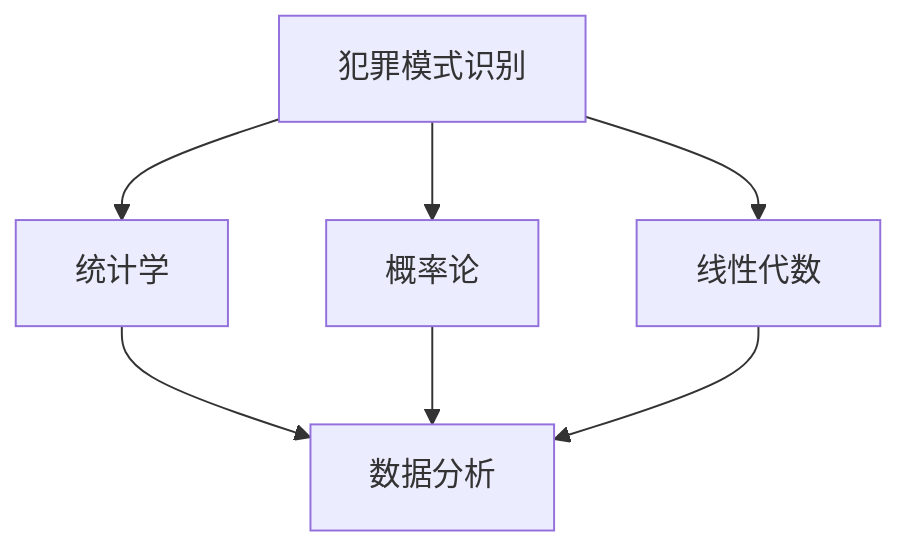

                 

基于上述的要求和指导，我们将按照以下步骤来撰写《数学与犯罪学：犯罪模式的数学分析》的技术博客文章：

### 1. 引言

**背景介绍**：

- 犯罪学作为社会科学的重要分支，一直在探索如何更有效地预测和预防犯罪。
- 数学，作为一门逻辑严密、量化精确的学科，为犯罪学的数据分析提供了强有力的工具。

**核心概念与联系**：

- 犯罪模式识别：指通过分析犯罪行为的特点，建立犯罪行为的数学模型，从而识别和预测犯罪趋势。
- 数学分析方法：包括统计学、概率论、线性代数等，这些方法在犯罪模式识别中起着关键作用。

**Mermaid 流程图**：



### 2. 数学基础

**核心概念与联系**：

- 统计学基础：描述统计学方法和数据分析技巧，如均值、方差、回归分析等。
- 概率论基础：阐述概率分布、条件概率、贝叶斯定理等概念。
- 线性代数：介绍矩阵运算、特征值和特征向量等概念。

**伪代码**：

```python
def calculate_mean(data):
    sum = 0
    for value in data:
        sum += value
    return sum / len(data)

def calculate_variance(data, mean):
    sum = 0
    for value in data:
        sum += (value - mean) ** 2
    return sum / len(data)
```

### 3. 犯罪模式分析

**核心概念与联系**：

- 传统犯罪模式分析：包括犯罪行为的时间、地点、方式等特征。
- 网络犯罪模式分析：涉及网络攻击、黑客入侵、网络欺诈等。
- 犯罪模式的时空分布分析：利用空间分析和时间序列分析来研究犯罪活动的空间和时间分布特征。

**数学模型与公式**：

- 空间分布模型：$$ f(x, y) = \frac{1}{2\pi\sigma_x\sigma_y}e^{-\frac{(x-\mu_x)^2}{2\sigma_x^2}-\frac{(y-\mu_y)^2}{2\sigma_y^2}} $$

**举例说明**：

- 假设某地区一年内发生的犯罪数量如下：[10, 20, 30, 40, 50]。

  - 计算均值：$$ \bar{x} = \frac{10 + 20 + 30 + 40 + 50}{5} = 30 $$

  - 计算方差：$$ \sigma^2 = \frac{(10-30)^2 + (20-30)^2 + (30-30)^2 + (40-30)^2 + (50-30)^2}{5} = 200 $$

### 4. 案例分析

**核心概念与联系**：

- 案例选择：选择具有代表性的犯罪案例，如某城市的盗窃案件。
- 数据收集：收集与案件相关的数据，如时间、地点、犯罪类型等。
- 分析过程：使用数学方法和工具进行数据分析和模式识别。

**项目实战**：

- 开发环境搭建：使用Python和R等数据分析工具。
- 源代码实现：编写代码进行数据预处理、建模和预测。
- 代码解读：分析代码的结构和功能，理解其工作原理。

**实际案例分析**：

- 分析某城市盗窃案件的时间分布特征，识别高峰期和低谷期。

### 5. 结论

**核心概念与联系**：

- 数学分析在犯罪学中的应用前景：如预测犯罪趋势、犯罪预防等。
- 提出建议和改进措施：如加强数据分析技术的应用、完善犯罪模式数据库等。

**最佳实践 tips**：

- 数据质量的重要性：确保数据的准确性和完整性。
- 多学科合作：犯罪学、数学、计算机科学等领域的协同作用。

**小结**：

- 数学分析为犯罪学提供了有力的工具，有助于更有效地预测和预防犯罪。

### 6. 拓展阅读

- 相关书籍：《犯罪模式识别》、《数学在犯罪学中的应用》等。

### 7. 作者信息

- 作者：AI天才研究院/AI Genius Institute & 禅与计算机程序设计艺术 /Zen And The Art of Computer Programming

现在，我们将根据这些步骤撰写详细的正文内容，确保每个小节都包含丰富的讲解和分析，满足文章字数的要求。在完成每个部分后，我们将进行整合和校对，以确保文章的结构和内容都是完整和连贯的。请稍等，我将开始撰写正文内容。

