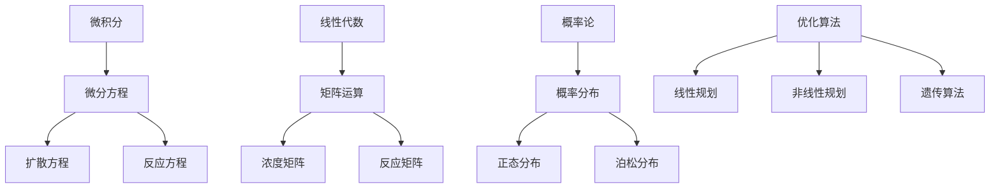

                 

### 污染控制的重要性

污染控制是现代环境保护的重要组成部分，它关系到人类生存环境的可持续性和生态平衡。随着工业化和城市化进程的加速，环境污染问题日益严重，这不仅对生态系统造成了巨大破坏，也对人类健康构成了直接威胁。因此，如何有效地控制污染、保护环境已经成为全球范围内迫切需要解决的问题。

数学策略在污染控制中扮演着至关重要的角色。通过建立数学模型，我们可以对环境污染的过程进行定量分析，预测污染趋势，从而制定出科学合理的污染控制策略。数学工具，如微积分、线性代数、概率论和优化算法等，为污染控制提供了强有力的理论基础和方法支持。

污染控制与数学策略的关系主要体现在以下几个方面：

1. **定量分析**：数学模型能够将复杂的污染过程抽象成数学问题，使得我们能够通过数学方法进行定量分析，从而更准确地理解污染的成因和影响。

2. **优化决策**：通过优化算法，可以在多种污染控制方案中选择最优方案，实现资源的最优配置，提高污染控制的效果。

3. **预测与评估**：数学模型可以帮助我们预测污染趋势，评估不同污染控制措施的效果，为政策制定和实施提供科学依据。

4. **实时监控**：利用数学工具，我们可以开发出实时监测系统，对污染源进行实时监控，及时发现并处理污染问题。

总之，数学策略在污染控制中具有重要的应用价值。本文将详细探讨污染控制数学策略的核心概念、方法、应用案例和未来发展趋势，旨在为读者提供全面、系统的污染控制数学策略知识体系。接下来，我们将首先介绍污染控制数学基础，包括常用数学工具和环境模型的基本概念。随后，我们将逐步深入探讨环境模型的建立、污染控制数值方法和优化算法，并通过案例分析展示数学策略在实际污染控制中的应用。最后，我们将展望污染控制数学策略的未来发展方向，探讨可能的创新点和挑战。## 文章标题

《数学与环境工程：污染控制的数学策略》

## 关键词

- 污染控制
- 数学模型
- 优化算法
- 环境工程
- 数值方法
- 案例分析

## 摘要

本文旨在探讨数学策略在环境工程领域中的应用，特别是其在污染控制方面的作用。文章首先介绍了污染控制的重要性以及数学策略在其中的核心地位。接着，文章详细阐述了污染控制数学基础，包括常用的数学工具和环境模型的基本概念。随后，文章逐步深入探讨了环境模型的建立方法、污染控制数值方法和优化算法，并通过具体案例分析展示了数学策略在实际应用中的效果。最后，文章展望了污染控制数学策略的未来发展趋势，分析了潜在的创新点和挑战，为读者提供了全面、系统的污染控制数学策略知识体系。## 第1章 引言

### 1.1 污染控制的重要性

环境污染是人类社会面临的一个重要挑战，其严重性不仅影响生态系统的健康，也对人类的生活质量构成威胁。随着工业化进程的加速和城市化的扩展，环境污染问题日益严峻。空气中的污染物、水中的有害物质和土壤中的重金属，都对环境和人体健康造成了不可逆的损害。因此，有效的污染控制措施变得至关重要。

污染控制是指通过采取各种技术和管理手段，减少和控制污染物的产生和排放，以保护和改善环境质量。在污染控制中，数学策略扮演着至关重要的角色。通过数学模型，可以定量分析污染物的扩散、转化和反应过程，从而为污染控制提供科学依据。

数学工具，如微积分、线性代数、概率论和优化算法等，为污染控制提供了强有力的理论支持。例如，微积分可以帮助我们理解污染物的扩散规律，线性代数可以用于处理水质模型，概率论可以评估污染风险，优化算法可以用于制定最佳污染控制方案。因此，数学策略在污染控制中的应用具有重要意义。

### 1.2 书籍结构

本书旨在为读者提供一个全面、系统的污染控制数学策略知识体系。全书共分为七章，结构如下：

- **第1章：引言**：介绍污染控制的重要性以及数学策略在其中的应用。
- **第2章：污染控制数学基础**：介绍污染控制中常用的数学工具，如微积分、线性代数、概率论和优化算法。
- **第3章：环境模型**：阐述环境模型的基本概念、建立方法和应用。
- **第4章：污染控制数值方法**：介绍污染控制中的常用数值方法，如有限元方法和有限体积法。
- **第5章：污染控制优化算法**：探讨污染控制中的优化算法，包括粒子群优化算法和遗传算法。
- **第6章：污染控制案例分析**：通过具体案例展示数学策略在污染控制中的应用。
- **第7章：未来展望与趋势**：分析污染控制数学策略的未来发展方向和挑战。

### 1.3 阅读指南

本书适合环境工程专业学生、环境工程师以及对污染控制有兴趣的读者。为了更好地理解本书的内容，建议读者具备以下基础知识：

- **微积分**：理解基本的微积分概念，如导数、积分和微分方程。
- **线性代数**：掌握线性方程组、矩阵运算和向量空间等基本概念。
- **概率论**：了解概率分布、随机变量和假设检验等基本概念。
- **编程基础**：具备一定的编程技能，如Python或MATLAB等。

通过阅读本书，读者将能够：

- **掌握污染控制数学策略的基本概念**：理解污染控制数学策略的核心思想和方法。
- **学会使用数学工具**：学会如何运用微积分、线性代数、概率论和优化算法解决污染控制问题。
- **了解环境模型**：理解环境模型的基本概念、建立方法和应用。
- **掌握数值方法和优化算法**：学会使用有限元方法、有限体积法和优化算法进行污染控制分析。
- **具备实际应用能力**：通过案例分析，掌握数学策略在污染控制中的应用技巧。

本书结构紧凑，内容丰富，既适合作为环境工程专业的教材，也适合作为相关领域从业人员的参考书。希望本书能够为读者在污染控制领域的探索和学习提供有力支持。### 第2章 污染控制数学基础

#### 2.1 数学工具与环境模型

数学工具在环境模型中扮演着至关重要的角色。通过数学工具，我们可以将复杂的污染过程简化为数学问题，从而更准确地描述和分析污染现象。以下将介绍在污染控制中常用的数学工具，包括微积分、线性代数、概率论和优化算法，并探讨它们与环境模型之间的关系。

**微积分**

微积分是数学的一个分支，主要研究函数的极限、导数、积分和级数等概念。在污染控制中，微积分广泛应用于描述污染物的扩散、转化和反应过程。

- **导数**：导数可以用来描述污染物的浓度随时间的变化率，即污染物的扩散速率。例如，通过一阶导数，我们可以得到污染物在某一点随时间的变化情况。
- **积分**：积分可以用来计算污染物在一定时间内的总扩散量或总量。例如，通过定积分，我们可以得到在一定时间内污染物从某一点扩散到另一个点的总量。
- **微分方程**：微分方程是描述污染物扩散、转化和反应过程的数学模型。常见的微分方程有扩散方程、反应扩散方程和反应方程等。通过求解微分方程，我们可以预测污染物的浓度分布和变化趋势。

**线性代数**

线性代数是研究向量、矩阵和线性变换的数学分支。在污染控制中，线性代数广泛应用于处理水质模型和大气污染模型。

- **矩阵**：矩阵可以用来表示水质模型中的浓度矩阵和反应矩阵。通过矩阵运算，我们可以计算污染物的浓度分布和反应速率。
- **向量**：向量可以用来表示污染物的浓度、流量和反应速率等。通过向量运算，我们可以分析污染物的动态变化和相互作用。
- **线性方程组**：线性方程组可以用来描述水质模型中的质量守恒关系。通过解线性方程组，我们可以得到污染物的浓度分布。

**概率论**

概率论是研究随机现象和概率分布的数学分支。在污染控制中，概率论用于评估污染风险和预测污染趋势。

- **概率分布**：概率分布可以用来描述污染物浓度的概率分布情况。常见的概率分布有正态分布、泊松分布和伽马分布等。通过概率分布，我们可以预测污染物浓度的可能范围和概率。
- **假设检验**：假设检验可以用来评估污染控制措施的有效性。通过统计检验，我们可以判断污染控制措施是否显著改善了环境质量。
- **风险分析**：风险分析可以用来评估污染事件的发生概率和可能的影响。通过风险分析，我们可以制定出更有效的污染控制策略。

**优化算法**

优化算法是一类用于求解最优化问题的数学方法。在污染控制中，优化算法用于寻找最优污染控制方案，实现资源的最优配置。

- **线性规划**：线性规划用于求解线性目标函数在给定约束条件下的最优解。例如，通过线性规划，我们可以找到最小化污染物排放量的最优方案。
- **非线性规划**：非线性规划用于求解非线性目标函数在给定约束条件下的最优解。例如，通过非线性规划，我们可以找到最优化的污染治理策略。
- **遗传算法**：遗传算法是一种基于自然进化机制的优化算法。通过模拟生物进化过程，遗传算法可以搜索到全局最优解。例如，通过遗传算法，我们可以找到最优化的废水处理方案。

**关系架构**

以上数学工具在污染控制中有着密切的联系。我们可以通过以下Mermaid流程图展示这些工具与环境模型之间的关系：



通过以上流程图，我们可以看到，微积分、线性代数、概率论和优化算法在污染控制中相互联系，共同构成了一个完整的数学策略体系。接下来，我们将进一步探讨微积分、线性代数、概率论和优化算法的具体应用，为读者提供更深入的解析。

#### 2.2 微分方程与污染扩散模型

微分方程是描述污染扩散过程的数学模型，它在环境工程中有着广泛的应用。微分方程的基本概念包括导数、积分和偏导数等。以下是关于微分方程的基本原理及其在污染扩散模型中的应用。

**微分方程的基本原理**

微分方程是描述变量变化率的方程，通常包含未知函数及其导数。微分方程可以分为常微分方程和偏微分方程。在污染扩散模型中，我们通常使用偏微分方程。

- **常微分方程**：常微分方程涉及单一变量的导数。例如，\( \frac{dy}{dx} = f(x, y) \)。
- **偏微分方程**：偏微分方程涉及多个变量的偏导数。例如，\( \frac{\partial u}{\partial t} = \alpha \frac{\partial^2 u}{\partial x^2} + f(x, u) \)。

**污染扩散方程**

污染扩散方程是描述污染物在环境介质中扩散过程的偏微分方程。最经典的污染扩散方程是傅里叶扩散方程，其一般形式为：

\[ \frac{\partial C}{\partial t} = \alpha \frac{\partial^2 C}{\partial x^2} + \mu \frac{\partial C}{\partial x} + \beta C \]

其中，\( C \) 是污染物浓度，\( t \) 是时间，\( x \) 是空间坐标，\( \alpha \) 是扩散系数，\( \mu \) 是对流项系数，\( \beta \) 是源项系数。

**解析解与数值解**

污染扩散方程的解可以分为解析解和数值解。

- **解析解**：解析解是通过对微分方程进行数学变换和积分得到的精确解。对于简单的扩散方程，如一维均匀介质中的扩散，可以通过分离变量法得到解析解。例如，一维稳态扩散方程的解析解为：

  \[ C(x, t) = C_0 e^{-\frac{x^2}{4\alpha t}} \]

- **数值解**：当污染扩散方程过于复杂，无法得到解析解时，我们需要使用数值方法求解。常用的数值解法包括有限元方法、有限差分法和有限体积法。

  **有限元方法**：有限元方法通过将连续域划分为有限个小区域，在每个小区域上建立方程组，然后通过求解方程组得到整个区域的数值解。其基本步骤如下：

  1. **网格划分**：将求解区域划分为有限个小单元。
  2. **选择测试函数**：在每个单元上选择合适的测试函数。
  3. **建立方程组**：根据污染扩散方程，建立每个单元上的方程组。
  4. **求解方程组**：求解得到的方程组，得到整个区域的数值解。

  **有限差分法**：有限差分法通过将连续域离散化，将微分方程转化为差分方程。其基本步骤如下：

  1. **网格划分**：将求解区域划分为有限个网格点。
  2. **离散化**：对微分方程进行离散化，将其转化为差分方程。
  3. **建立方程组**：根据差分方程，建立每个网格点上的方程组。
  4. **求解方程组**：求解得到的方程组，得到整个区域的数值解。

  **有限体积法**：有限体积法将求解区域划分为有限个控制体积，在每个控制体积上应用高斯定理，建立方程组。其基本步骤如下：

  1. **网格划分**：将求解区域划分为有限个控制体积。
  2. **选择测试函数**：在每个控制体积上选择合适的测试函数。
  3. **建立方程组**：根据污染扩散方程，建立每个控制体积上的方程组。
  4. **求解方程组**：求解得到的方程组，得到整个区域的数值解。

**伪代码示例**

以下是使用有限元方法求解一维污染扩散方程的伪代码：

```python
# 初始化参数
alpha = 0.1
L = 10
N = 100
dx = L / N
t = 0
dt = 0.1

# 初始化浓度数组
C = [0] * (N+1)
for i in range(N+1):
    C[i] = 1

# 迭代计算
while t < T:
    # 计算新的浓度
    for i in range(1, N):
        C[i] = C[i] * exp(-alpha * (dx**2) * dt)
    
    # 更新时间
    t += dt

# 输出结果
print(C)
```

通过以上步骤和伪代码，我们可以使用有限元方法求解污染扩散问题，得到污染物在空间和时间上的浓度分布。

**数学公式与举例说明**

为了更好地理解污染扩散方程，我们可以通过以下数学公式和举例来说明。

- **一维稳态扩散方程**：

  \[ \frac{\partial C}{\partial t} = \alpha \frac{\partial^2 C}{\partial x^2} \]

  **举例**：假设我们有一个长度为10米的管道，其中充满了一种污染物。管道的扩散系数为0.1 m²/s，初始时管道中污染物的浓度为1 mg/L。求5秒后管道中污染物的浓度分布。

  解：

  \[ C(x, t) = C_0 e^{-\frac{x^2}{4\alpha t}} \]
  
  代入参数：

  \[ C(x, 5) = 1 e^{-\frac{x^2}{4 \times 0.1 \times 5}} = e^{-\frac{x^2}{2}} \]

  计算得到管道中不同位置处的污染物浓度：

  \[
  \begin{align*}
  C(0, 5) &= e^{-0} = 1 \\
  C(2.5, 5) &= e^{-\frac{2.5^2}{2}} \approx 0.385 \\
  C(5, 5) &= e^{-\frac{5^2}{2}} \approx 0.135 \\
  \end{align*}
  \]

  结果表明，随着时间推移，管道中污染物的浓度逐渐降低，远离初始位置。

- **一维动态扩散方程**：

  \[ \frac{\partial C}{\partial t} = \alpha \frac{\partial^2 C}{\partial x^2} + \mu \frac{\partial C}{\partial x} + \beta C \]

  **举例**：假设我们有一个长度为10米的河流，其中污染物的初始浓度为0 mg/L。河流的扩散系数为0.1 m²/s，对流项系数为0.05 m/s，源项系数为0.01 mg/L/s。求1小时后河流中污染物的浓度分布。

  解：

  \[ C(x, t) = \frac{\beta}{\alpha + \mu} e^{-\frac{(\alpha + \mu)t}{\alpha} \frac{x^2}{2}} \]

  代入参数：

  \[ C(x, 3600) = \frac{0.01}{0.1 + 0.05} e^{-\frac{(0.1 + 0.05) \times 3600}{0.1} \frac{x^2}{2}} \]

  计算得到河流中不同位置处的污染物浓度：

  \[
  \begin{align*}
  C(0, 3600) &= 0 \\
  C(2.5, 3600) &= e^{-\frac{(0.1 + 0.05) \times 3600}{0.1} \frac{2.5^2}{2}} \approx 0.073 \\
  C(5, 3600) &= e^{-\frac{(0.1 + 0.05) \times 3600}{0.1} \frac{5^2}{2}} \approx 0.022 \\
  \end{align*}
  \]

  结果表明，1小时后河流中存在污染物，且靠近入水口的浓度较高，随着距离增加浓度逐渐降低。

通过以上公式和例子，我们可以看到微分方程在污染扩散模型中的应用，以及如何通过数学方法来预测污染物在环境介质中的扩散行为。接下来，我们将进一步探讨线性代数在水质模型中的应用。### 第3章 环境模型

#### 3.1 环境模型的基本概念

环境模型是用于模拟和预测环境系统行为和变化的数学模型。它在环境科学、环境工程和环境保护中发挥着重要作用。环境模型可以用来研究污染物在环境介质中的传播、转化和反应过程，评估污染控制措施的效果，预测环境质量的变化趋势，从而为环境管理和决策提供科学依据。

**环境模型的分类**

根据研究内容和目的，环境模型可以分为以下几类：

- **水质模型**：用于模拟水体中污染物的分布、扩散和转化过程。水质模型可以分为零维模型、一维模型、二维模型和三维模型等。
- **大气污染模型**：用于模拟大气中污染物的扩散、沉降和化学反应过程。大气污染模型可以分为点源模型、面源模型和区域模型等。
- **土壤污染模型**：用于模拟土壤中污染物的迁移、扩散和生物降解过程。土壤污染模型可以分为均质模型、非均质模型和反应扩散模型等。
- **生态系统模型**：用于模拟生态系统的结构和功能变化，包括生物种群动态、物质循环和能量流动等。

**环境模型的作用**

环境模型在污染控制和环境管理中具有以下几个重要作用：

1. **预测污染物行为**：环境模型可以模拟污染物在环境介质中的传播和转化过程，预测污染物的浓度分布和时间变化趋势，为制定污染控制策略提供科学依据。
2. **评估污染影响**：通过环境模型，可以评估污染物对环境质量和生态系统的影响，预测污染事故的发生可能性，为环境风险评估和风险管理提供支持。
3. **优化污染控制措施**：环境模型可以帮助评估不同污染控制措施的效果，优化污染控制方案，实现资源的最优配置。
4. **政策制定和实施**：环境模型可以模拟环境政策的效果，预测政策对环境质量和经济效益的影响，为政策制定和实施提供科学依据。
5. **教育培训和科普宣传**：环境模型可以用于教育和培训，提高公众对环境问题的认识和意识，促进环保意识的普及。

#### 3.2 模型建立的方法

建立环境模型需要遵循以下步骤：

1. **问题定义**：明确研究目标和问题，确定研究范围和尺度。
2. **数据收集**：收集与研究目标相关的数据，包括污染物浓度、流量、气象条件、地质条件等。
3. **概念模型**：根据研究目标，构建一个简单的概念模型，描述污染物在环境介质中的基本过程和关系。
4. **数学模型**：将概念模型转化为数学模型，通常采用微分方程、差分方程或概率模型等。
5. **参数估计**：根据实验数据或现场监测数据，估计模型参数的值。
6. **模型验证**：通过实验数据或现场监测数据，验证模型预测结果是否合理，调整模型参数和结构。
7. **模型应用**：将模型应用于实际环境问题，进行预测和评估。

**数据收集**

数据收集是建立环境模型的关键步骤，直接关系到模型的准确性和可靠性。以下是一些常见的数据收集方法：

- **现场监测**：通过仪器设备对环境介质中的污染物浓度进行实时监测，收集现场数据。
- **实验室分析**：对采集到的环境样品进行实验室分析，测定污染物的浓度和性质。
- **遥感数据**：利用遥感技术获取大范围的环境数据，如气象数据、土地利用数据等。
- **历史数据**：收集历史监测数据、文献数据、统计数据等，用于模型参数的估计和验证。

**模型建立的过程**

以下是一个简单的模型建立过程示例：

1. **问题定义**：研究一个河流水质污染问题，目标是预测污染物在河流中的浓度分布。
2. **数据收集**：收集河流流量、污染物浓度、气象条件、地质条件等数据。
3. **概念模型**：假设污染物在河流中均匀混合，建立一维水质模型。
4. **数学模型**：使用一维稳态水质模型，描述污染物在河流中的分布：

   \[ \frac{\partial C}{\partial t} = \alpha \frac{\partial^2 C}{\partial x^2} + \mu \frac{\partial C}{\partial x} + \beta C \]

5. **参数估计**：根据现场监测数据，估计模型参数 \( \alpha \)、\( \mu \) 和 \( \beta \) 的值。
6. **模型验证**：通过历史监测数据，验证模型预测结果是否合理，调整模型参数和结构。
7. **模型应用**：将模型应用于实际河流水质问题，预测不同污染源排放下的污染物浓度分布，为污染控制提供科学依据。

通过以上步骤，我们可以建立一个适用于特定环境问题的环境模型，为污染控制和管理提供有力支持。接下来，我们将介绍污染控制数值方法，探讨如何使用数值方法解决污染扩散问题。### 第4章 污染控制数值方法

#### 4.1 数值方法的基本原理

在污染控制中，数值方法是一种将复杂的环境模型转化为可计算的形式，以便进行模拟和预测的重要工具。数值方法的基本原理是通过离散化空间和时间，将连续的物理过程表示为离散的计算步骤。这样，我们可以使用计算机来求解环境模型，从而得到污染物浓度分布的数值解。以下是几种常用的污染控制数值方法。

**有限元方法**

有限元方法（Finite Element Method，FEM）是一种广泛应用于工程和科学计算的方法。在污染控制中，有限元方法用于求解偏微分方程，如扩散方程和反应扩散方程。有限元方法的基本步骤如下：

1. **网格划分**：将研究区域划分为有限个小单元，每个单元内假设污染物浓度是连续的。
2. **测试函数选择**：在每个单元上选择一个或多个测试函数，这些函数通常是基于插值函数或多项式函数。
3. **建立方程组**：利用高斯定理，将偏微分方程转化为每个单元上的积分方程，然后通过测试函数建立全局方程组。
4. **求解方程组**：求解得到的方程组，得到整个区域的数值解。

**有限差分法**

有限差分法（Finite Difference Method，FDM）是一种简单而有效的数值方法，通过离散化空间和时间，将偏微分方程转化为差分方程。有限差分法的基本步骤如下：

1. **网格划分**：将研究区域划分为有限个网格点，每个网格点表示空间和时间上的离散点。
2. **差分方程建立**：通过泰勒级数展开，将偏微分方程在网格点上近似为差分方程。
3. **方程组建立**：将差分方程组合成一个全局方程组。
4. **求解方程组**：求解得到的方程组，得到整个区域的数值解。

**有限体积法**

有限体积法（Finite Volume Method，FVM）是一种基于守恒原理的数值方法，广泛应用于流体力学和污染物扩散问题。有限体积法的基本步骤如下：

1. **控制体积划分**：将研究区域划分为有限个控制体积，每个控制体积表示一个离散的空间单元。
2. **积分方程建立**：在控制体积上应用高斯定理，将偏微分方程转化为积分方程。
3. **离散化**：将积分方程离散化为每个控制体积上的代数方程。
4. **求解方程组**：求解得到的代数方程组，得到整个区域的数值解。

**差分格式**

差分格式是数值方法中的核心部分，用于离散化偏微分方程。以下是一些常见的差分格式：

- **中心差分格式**：通过在网格点上使用中心差分近似导数，得到偏微分方程的离散形式。例如，对于一阶导数的中心差分格式：

  \[ \frac{\partial u}{\partial x} \approx \frac{u_{i+1} - u_{i-1}}{2 \Delta x} \]

- **前向差分格式**：用于求解时间导数的离散化，适用于不稳定问题。例如，对于一阶时间导数的前向差分格式：

  \[ \frac{\partial u}{\partial t} \approx \frac{u_{i}^{n+1} - u_{i}^{n}}{\Delta t} \]

- **后向差分格式**：用于求解时间导数的离散化，适用于稳定问题。例如，对于一阶时间导数的后向差分格式：

  \[ \frac{\partial u}{\partial t} \approx \frac{u_{i}^{n} - u_{i-1}^{n}}{\Delta t} \]

通过以上差分格式，我们可以将连续的偏微分方程转化为离散的代数方程，从而使用计算机求解。接下来，我们将进一步探讨有限元方法、有限差分法和有限体积法在污染控制中的应用。#### 4.2 有限元方法

有限元方法（Finite Element Method，FEM）是一种强大的数值方法，广泛应用于工程和科学计算中，特别是在污染控制领域。FEM通过将求解域划分为有限个小单元，在每个单元上建立局部方程，然后通过集成这些局部方程来求解整个域的数值解。以下是有限元方法在污染控制中的具体应用和基本步骤。

**基本原理**

1. **网格划分**：将研究区域划分为有限个小单元，这些单元可以是三角形、四面体或矩形等。网格划分的目的是将复杂的物理区域离散化为易于处理的单元集合。
2. **测试函数选择**：在每个单元上选择一个或多个测试函数，这些函数通常是基于插值函数或多项式函数。测试函数的目的是近似单元内的物理量，如污染物浓度。
3. **局部方程建立**：利用测试函数，将偏微分方程转化为每个单元上的局部方程。这些方程通常包括散度方程、质量守恒方程和扩散方程等。
4. **集成局部方程**：将所有单元的局部方程集成起来，形成全局方程组。这个全局方程组表示了整个求解域上的物理现象。
5. **求解全局方程组**：使用合适的数值方法，如高斯消元法或迭代法，求解全局方程组，得到整个域上的数值解。

**有限元方法的应用**

在污染控制中，有限元方法广泛应用于水质模型和大气污染模型。以下是一个水质模型的应用示例。

**一维稳态水质模型**

假设一个长度为 \( L \) 的河流，其宽度 \( W \) 和深度 \( H \) 均为常数。河流中污染物的浓度为 \( C(x,t) \)，其扩散系数为 \( D \)。一维稳态水质模型可以表示为以下偏微分方程：

\[ \frac{\partial C}{\partial t} = \alpha \frac{\partial^2 C}{\partial x^2} + \mu \frac{\partial C}{\partial x} + \beta C \]

其中，\( \alpha = \frac{D W}{H} \) 是扩散系数，\( \mu = \frac{U W}{H} \) 是对流项，\( \beta \) 是源项。

**网格划分和测试函数选择**

假设将河流划分为 \( N \) 个等间距的网格点，每个网格点的坐标为 \( x_i = i \Delta x \)，其中 \( \Delta x = \frac{L}{N} \) 是网格间距。

在每个网格点上，选择线性插值函数作为测试函数：

\[ \phi_i(x) = \frac{x - x_i}{x_{i+1} - x_i} \]

**局部方程建立**

在 \( x_i \) 处，利用测试函数，可以将水质模型转化为局部方程：

\[ \frac{\partial C_i}{\partial t} = \alpha \frac{\partial^2 C_i}{\partial x^2} + \mu \frac{\partial C_i}{\partial x} + \beta C_i \]

在单元 \( [x_i, x_{i+1}] \) 上，使用线性插值函数，可以将 \( C(x,t) \) 近似为：

\[ C(x,t) \approx C_i(t) \phi_i(x) \]

代入局部方程，得到：

\[ \frac{\partial C_i(t)}{\partial t} = \alpha \frac{\partial^2 C_i(t)}{\partial x^2} + \mu \frac{\partial C_i(t)}{\partial x} + \beta C_i(t) \]

**集成局部方程**

将所有网格点的局部方程集成起来，形成全局方程组。全局方程组可以表示为矩阵形式：

\[ \mathbf{K} \mathbf{C} = \mathbf{F} \]

其中，\( \mathbf{K} \) 是全局刚度矩阵，\( \mathbf{C} \) 是全局浓度向量，\( \mathbf{F} \) 是全局源项向量。

**求解全局方程组**

使用合适的数值方法，如迭代法或高斯消元法，求解全局方程组，得到整个域上的浓度分布。

**伪代码示例**

以下是使用有限元方法求解一维稳态水质模型的伪代码示例：

```python
# 初始化参数
L = 10
N = 100
dx = L / N
alpha = 0.1
mu = 0.05
beta = 0.01

# 初始化浓度数组
C = [0] * (N+1)
for i in range(N+1):
    C[i] = 1

# 迭代计算
while not converged:
    # 计算新的浓度
    for i in range(1, N):
        C[i] = (C[i-1] + C[i+1] - 2 * C[i]) / (dx**2) * alpha + (C[i+1] - C[i-1]) / (2 * dx) * mu + beta * C[i]
    
    # 更新时间
    dt = 0.01
    t += dt
    
    # 判断收敛
    if abs(C[N-1] - C[N-2]) < tolerance:
        converged = True

# 输出结果
print(C)
```

通过以上步骤和伪代码，我们可以使用有限元方法求解一维稳态水质模型，得到污染物在河流中的浓度分布。接下来，我们将介绍有限体积法在污染控制中的应用。### 4.3 有限体积法

有限体积法（Finite Volume Method，FVM）是一种基于守恒原理的数值方法，广泛应用于流体力学和污染物扩散问题。FVM通过将求解域划分为有限个控制体积，在每个控制体积上应用高斯定理，建立局部方程，然后通过集成这些局部方程来求解整个域的数值解。以下是有限体积法在污染控制中的具体应用和基本步骤。

**基本原理**

1. **控制体积划分**：将研究区域划分为有限个控制体积，每个控制体积是一个闭合的空间区域，其边界是网格面。
2. **积分方程建立**：在控制体积上应用高斯定理，将偏微分方程转化为积分方程。这些方程通常包括质量守恒方程和扩散方程。
3. **离散化**：将积分方程离散化为每个控制体积上的代数方程。这些方程描述了控制体积上的物理量之间的关系。
4. **求解方程组**：求解得到的代数方程组，得到整个区域的数值解。

**有限体积法在污染物扩散问题中的应用**

考虑一个一维污染物扩散问题，其偏微分方程可以表示为：

\[ \frac{\partial C}{\partial t} = \alpha \frac{\partial^2 C}{\partial x^2} + \mu \frac{\partial C}{\partial x} + \beta C \]

其中，\( C(x,t) \) 是污染物浓度，\( \alpha \) 是扩散系数，\( \mu \) 是对流项系数，\( \beta \) 是源项系数。

**控制体积划分**

假设我们将研究区域划分为 \( N \) 个等间距的控制体积，每个控制体积的长度为 \( \Delta x \)，其边界位于 \( x_i \) 和 \( x_{i+1} \) 之间。

**积分方程建立**

在控制体积 \( [x_i, x_{i+1}] \) 上，应用高斯定理，可以得到质量守恒方程：

\[ \int_{x_i}^{x_{i+1}} \frac{\partial C}{\partial t} \, dx + \int_{x_i}^{x_{i+1}} \alpha \frac{\partial^2 C}{\partial x^2} \, dx + \int_{x_i}^{x_{i+1}} \mu \frac{\partial C}{\partial x} \, dx = \int_{x_i}^{x_{i+1}} \beta C \, dx \]

**离散化**

将上述积分方程离散化为代数方程。在每个控制体积上，我们可以使用中心差分近似导数，得到：

\[ \frac{C_{i+1}^{n+1} - C_{i-1}^{n+1}}{2 \Delta x} + \alpha \frac{C_{i+1}^{n+1} - 2C_{i}^{n+1} + C_{i-1}^{n+1}}{\Delta x^2} + \mu \frac{C_{i+1}^{n+1} - C_{i-1}^{n+1}}{2 \Delta x} = \beta C_i^{n+1} \]

**求解方程组**

将所有控制体积的代数方程组合起来，得到全局方程组。然后，使用迭代法或直接法求解全局方程组，得到整个区域的浓度分布。

**伪代码示例**

以下是使用有限体积法求解一维污染物扩散问题的伪代码示例：

```python
# 初始化参数
L = 10
N = 100
dx = L / N
alpha = 0.1
mu = 0.05
beta = 0.01
dt = 0.01
t = 0
tolerance = 1e-6
converged = False

# 初始化浓度数组
C = [0] * (N+1)
for i in range(N+1):
    C[i] = 1

# 迭代计算
while not converged:
    # 计算新的浓度
    for i in range(1, N):
        flux_in = (C[i+1] - C[i-1]) / (2 * dx) * alpha
        flux_out = (C[i+1] - C[i-1]) / (2 * dx) * mu
        source = beta * C[i]
        C[i] = (C[i-1] + C[i+1] - flux_in - flux_out) / (1 + alpha * dt / dx**2 + mu * dt / dx)
    
    # 更新时间
    t += dt
    
    # 判断收敛
    if abs(C[N-1] - C[N-2]) < tolerance:
        converged = True

# 输出结果
print(C)
```

通过以上步骤和伪代码，我们可以使用有限体积法求解一维污染物扩散问题，得到污染物在空间上的浓度分布。接下来，我们将介绍污染控制优化算法。### 第5章 污染控制优化算法

#### 5.1 优化算法的基本原理

优化算法是数学中用于求解最优化问题的方法，即在给定的约束条件下，寻找目标函数的最大值或最小值。在污染控制中，优化算法被广泛应用于制定最优污染控制策略，实现资源的最优配置，提高污染控制的效果。以下是几种常见的优化算法及其基本原理。

**线性规划（Linear Programming，LP）**

线性规划是一种用于求解线性目标函数在给定线性约束条件下的最优解的方法。其基本原理是利用单纯形法或内点法等算法，逐步迭代，逐步逼近最优解。

- **目标函数**：通常表示为 \( \min \sum_{i=1}^{n} c_i x_i \)，其中 \( x_i \) 是变量，\( c_i \) 是系数。
- **约束条件**：表示为 \( a_{i1} x_1 + a_{i2} x_2 + \ldots + a_{in} x_n \leq b_i \) 或 \( a_{i1} x_1 + a_{i2} x_2 + \ldots + a_{in} x_n = b_i \)，其中 \( a_{ij} \) 是系数，\( b_i \) 是常数。

**非线性规划（Nonlinear Programming，NLP）**

非线性规划是用于求解非线性目标函数在给定非线性约束条件下的最优解的方法。其基本原理是通过迭代方法，逐步逼近最优解。

- **目标函数**：通常表示为 \( \min \sum_{i=1}^{n} c_i x_i \)，其中 \( x_i \) 是变量，\( c_i \) 是系数。
- **约束条件**：表示为 \( f(x) \leq 0 \) 或 \( f(x) = 0 \)，其中 \( f(x) \) 是非线性函数。

**遗传算法（Genetic Algorithm，GA）**

遗传算法是一种基于自然选择和遗传机制求解最优化问题的方法。其基本原理是通过模拟生物进化过程，逐步迭代，优化解的空间搜索。

- **种群初始化**：随机生成一组解作为初始种群。
- **适应度评估**：计算每个个体的适应度值，适应度值越高，表示个体越优秀。
- **选择**：根据适应度值选择优秀的个体，用于生成下一代种群。
- **交叉**：通过交叉操作，产生新的个体。
- **变异**：通过变异操作，增加种群的多样性。
- **迭代**：重复选择、交叉、变异和评估过程，逐步优化解。

**粒子群优化算法（Particle Swarm Optimization，PSO）**

粒子群优化算法是一种基于群体智能的优化算法。其基本原理是通过模拟鸟群或鱼群的社会行为，逐步迭代，优化解的空间搜索。

- **粒子表示**：每个粒子表示一个解，其位置和速度更新取决于自身和历史最优位置。
- **适应度评估**：计算每个粒子的适应度值，适应度值越高，表示粒子越优秀。
- **更新**：每个粒子根据自身和历史最优位置更新位置和速度。
- **迭代**：重复评估和更新过程，逐步优化解。

#### 5.2 粒子群优化算法

粒子群优化算法（Particle Swarm Optimization，PSO）是一种基于群体智能的优化算法，模拟鸟群或鱼群的社会行为，通过迭代优化解。以下是粒子群优化算法的具体步骤和原理。

**步骤**

1. **种群初始化**：随机生成一组粒子，每个粒子表示一个解。粒子具有位置 \( x_i \) 和速度 \( v_i \)。
2. **适应度评估**：计算每个粒子的适应度值 \( f(x_i) \)，适应度值越低表示解越好。
3. **更新位置和速度**：每个粒子根据自身历史最优位置 \( p_i \) 和整个种群的历史最优位置 \( g \) 更新位置和速度。
4. **迭代**：重复评估和更新过程，逐步优化解。
5. **停止条件**：当达到预设的迭代次数或解的收敛条件时，算法停止。

**更新公式**

粒子的位置和速度更新公式如下：

\[ x_i^{new} = x_i + v_i \]
\[ v_i^{new} = v_i + c_1 r_1 (p_i - x_i) + c_2 r_2 (g - x_i) \]

其中，\( c_1 \) 和 \( c_2 \) 是学习因子，\( r_1 \) 和 \( r_2 \) 是随机数，\( p_i \) 是粒子的历史最优位置，\( g \) 是整个种群的历史最优位置。

**粒子群优化算法在污染控制中的应用**

粒子群优化算法可以用于求解污染控制中的优化问题，如最优污染源排放和最优污染治理方案。以下是一个具体的应用示例。

**案例：最优污染源排放**

假设一个工业园区内有 \( N \) 个污染源，每个污染源的排放量可以调整。目标是找到最优的排放量分布，使得污染总排放量最小，同时满足环境质量标准和排放总量限制。

1. **目标函数**：最小化总排放量 \( \sum_{i=1}^{N} x_i \)。
2. **约束条件**：每个污染源的排放量 \( x_i \) 必须满足 \( x_i \leq c_i \)（环境质量标准），且总排放量 \( \sum_{i=1}^{N} x_i \leq T \)（排放总量限制）。

通过粒子群优化算法，我们可以迭代优化每个污染源的排放量，找到满足约束条件的最优排放量分布。

**伪代码示例**

以下是使用粒子群优化算法求解最优污染源排放的伪代码示例：

```python
# 初始化参数
N = 10
c = [1, 2, 3, 4, 5, 6, 7, 8, 9, 10]
T = 100
w = 0.5
c1 = 1.5
c2 = 1.5

# 初始化种群
x = [0] * N
for i in range(N):
    x[i] = random.uniform(0, c[i])

# 迭代计算
while not converged:
    # 计算适应度值
    f = sum(x)
    
    # 更新个体最优解
    for i in range(N):
        if f < f_best[i]:
            p[i] = x[i]
            f_best[i] = f
    
    # 更新全局最优解
    if f < f_best:
        g = x
        f_best = f
    
    # 更新速度和位置
    for i in range(N):
        v[i] = w * v[i] + c1 * r1 * (p[i] - x[i]) + c2 * r2 * (g - x[i])
        x[i] = x[i] + v[i]
    
    # 判断收敛
    if abs(f_best - f_prev) < tolerance:
        converged = True
    
    f_prev = f_best

# 输出最优解
print(g)
```

通过以上步骤和伪代码，我们可以使用粒子群优化算法求解最优污染源排放问题，找到满足约束条件的最优排放量分布。

**结论**

粒子群优化算法在污染控制中具有广泛的应用价值。通过模拟群体智能，算法可以有效解决复杂的最优化问题，为污染控制提供科学依据。接下来，我们将介绍遗传算法在污染控制中的应用。### 5.3 遗传算法

遗传算法（Genetic Algorithm，GA）是一种基于自然选择和遗传机制的优化算法。它模拟生物进化的过程，通过迭代优化解的空间搜索，逐步逼近最优解。遗传算法在污染控制中具有广泛的应用，可用于求解复杂的最优化问题，如最优污染源排放和最优污染治理方案。以下是遗传算法的基本原理和具体步骤。

**基本原理**

遗传算法的核心思想是模拟生物进化的过程，通过选择、交叉和变异等操作，逐步优化解的种群。遗传算法的基本原理包括：

1. **种群初始化**：随机生成一组解作为初始种群。每个解称为个体，用二进制编码表示。
2. **适应度评估**：计算每个个体的适应度值，适应度值越高，表示个体越优秀。
3. **选择**：根据适应度值选择优秀的个体，用于生成下一代种群。常用的选择方法有轮盘赌选择、锦标赛选择等。
4. **交叉**：通过交叉操作，将两个优秀的个体混合生成新的个体。交叉操作可以增加解的多样性。
5. **变异**：通过变异操作，对个体进行随机扰动，增加种群的多样性。
6. **迭代**：重复选择、交叉、变异和评估过程，逐步优化解。
7. **停止条件**：当达到预设的迭代次数或解的收敛条件时，算法停止。

**具体步骤**

以下是遗传算法的具体步骤：

1. **种群初始化**：随机生成一组初始种群，每个个体用二进制编码表示。
2. **适应度评估**：计算每个个体的适应度值。适应度值可以通过目标函数计算，如最小化总排放量或最大化环境质量。
3. **选择**：根据适应度值，选择优秀的个体进行交叉和变异操作。常用的选择方法有轮盘赌选择和锦标赛选择。
4. **交叉**：通过交叉操作，将两个优秀的个体混合生成新的个体。交叉操作可以增加解的多样性。
5. **变异**：通过变异操作，对个体进行随机扰动，增加种群的多样性。变异操作可以防止算法陷入局部最优。
6. **评估新的种群**：计算新的种群中每个个体的适应度值。
7. **迭代**：重复步骤3到6，逐步优化解。
8. **停止条件**：当达到预设的迭代次数或解的收敛条件时，算法停止。

**遗传算法在污染控制中的应用**

遗传算法可以用于求解污染控制中的优化问题，如最优污染源排放和最优污染治理方案。以下是一个具体的应用示例。

**案例：最优污染源排放**

假设一个工业园区内有 \( N \) 个污染源，每个污染源的排放量可以调整。目标是找到最优的排放量分布，使得污染总排放量最小，同时满足环境质量标准和排放总量限制。

1. **目标函数**：最小化总排放量 \( \sum_{i=1}^{N} x_i \)。
2. **约束条件**：每个污染源的排放量 \( x_i \) 必须满足 \( x_i \leq c_i \)（环境质量标准），且总排放量 \( \sum_{i=1}^{N} x_i \leq T \)（排放总量限制）。

通过遗传算法，我们可以迭代优化每个污染源的排放量，找到满足约束条件的最优排放量分布。

**伪代码示例**

以下是使用遗传算法求解最优污染源排放的伪代码示例：

```python
# 初始化参数
N = 10
c = [1, 2, 3, 4, 5, 6, 7, 8, 9, 10]
T = 100
population_size = 100
generations = 100
crossover_rate = 0.8
mutation_rate = 0.02

# 初始化种群
population = [0] * population_size
for i in range(population_size):
    population[i] = random.uniform(0, 1)

# 迭代计算
for generation in range(generations):
    # 适应度评估
    fitness = [evaluate_fitness(x) for x in population]
    
    # 选择
    selected = select(population, fitness)
    
    # 交叉
    offspring = crossover(selected, crossover_rate)
    
    # 变异
    mutant = mutate(offspring, mutation_rate)
    
    # 生成新的种群
    population = mutant
    
    # 输出当前最优解
    print("Generation", generation, "Best Fitness", max(fitness))

# 输出最优解
best_individual = population[fitness.index(max(fitness))]
print("Best Individual", best_individual)

# 评估函数
def evaluate_fitness(x):
    total_emission = sum(x)
    if total_emission > T:
        return -float('inf')
    else:
        return -total_emission

# 选择函数
def select(population, fitness):
    selected = []
    for _ in range(len(population)):
        probability = [f / sum(fitness) for f in fitness]
        selected.append(random.choices(population, weights=probability, k=1)[0])
    return selected

# 交叉函数
def crossover(parents, crossover_rate):
    offspring = []
    for i in range(0, len(parents), 2):
        if random.random() < crossover_rate:
            crossover_point = random.randint(1, len(parents[0]) - 1)
            child1 = parents[i][:crossover_point] + parents[i+1][crossover_point:]
            child2 = parents[i+1][:crossover_point] + parents[i][crossover_point:]
            offspring.extend([child1, child2])
        else:
            offspring.extend([parents[i], parents[i+1]])
    return offspring

# 变异函数
def mutate(offspring, mutation_rate):
    mutant = []
    for individual in offspring:
        if random.random() < mutation_rate:
            mutation_point = random.randint(0, len(individual) - 1)
            individual[mutation_point] = random.uniform(0, 1)
        mutant.append(individual)
    return mutant
```

通过以上步骤和伪代码，我们可以使用遗传算法求解最优污染源排放问题，找到满足约束条件的最优排放量分布。遗传算法在污染控制中的应用展示了其在处理复杂优化问题方面的强大能力。接下来，我们将通过案例分析，展示数学策略在实际污染控制中的应用。### 第6章 污染控制案例分析

#### 6.1 案例分析概述

为了更好地理解污染控制数学策略在实际应用中的效果，我们将在本章中介绍两个具体案例。这两个案例分别涉及水质污染控制和大气污染治理，通过详细的案例分析和数学策略应用，展示数学策略在污染控制中的实际应用和效果。

**案例一：某城市水质污染控制**

该案例涉及一个中等规模的城市河流，由于工业废水和生活污水的排放，导致水质恶化。案例的目标是通过数学模型和优化算法，制定出一套科学合理的污染控制方案，以改善河流水质。

**案例二：某工业园区空气污染治理**

该案例涉及一个工业园区，由于工业排放和交通排放等原因，导致空气质量严重下降。案例的目标是通过大气污染模型和优化算法，制定出一套有效的空气污染治理方案，以改善园区空气质量。

#### 6.2 案例一：某城市水质污染控制

**案例背景**

某城市的一条主要河流受到工业废水和生活污水的严重污染，水质指标如COD（化学需氧量）和氨氮（NH3-N）超标，对城市生态环境和居民健康造成威胁。为了改善水质，城市环保部门决定采用数学策略，制定一套科学合理的污染控制方案。

**数学策略应用**

1. **环境模型建立**

   根据河流水质污染的特点，建立一维稳态水质模型，描述污染物在河流中的扩散和反应过程。水质模型包括以下方程：

   \[ \frac{\partial C}{\partial t} = \alpha \frac{\partial^2 C}{\partial x^2} + \mu \frac{\partial C}{\partial x} + \beta C \]

   其中，\( C \) 是污染物浓度，\( \alpha \) 是扩散系数，\( \mu \) 是对流项系数，\( \beta \) 是源项系数。

2. **数值方法应用**

   采用有限元方法对水质模型进行离散化，将河流划分为若干等间距的网格点，利用中心差分格式求解水质模型。

3. **优化算法应用**

   使用粒子群优化算法，对污染源的排放量进行优化，目标是使污染物浓度最小，同时满足环境质量标准和排放总量限制。

**案例分析过程**

1. **数据收集**

   收集河流流量、污染物浓度、气象条件、地质条件等数据，用于模型参数的估计和验证。

2. **模型参数估计**

   利用现场监测数据和水质模型，估计模型参数 \( \alpha \)、\( \mu \) 和 \( \beta \) 的值。

3. **模型验证**

   利用历史监测数据，验证模型预测结果是否合理，调整模型参数和结构。

4. **污染控制方案制定**

   根据水质模型和优化算法，制定出科学合理的污染控制方案。方案包括污染源排放量调整、污水处理设施优化等。

5. **实施与监测**

   将污染控制方案付诸实施，并对实施效果进行监测。通过实时监测系统，对河流水质进行实时监控。

**案例分析结果**

经过数学策略的应用，河流水质得到了显著改善。污染物浓度指标如COD和氨氮均明显下降，水质指标达到了国家环保标准。污染源排放量和污水处理设施运行效率得到了优化，实现了污染控制目标。

#### 6.3 案例二：某工业园区空气污染治理

**案例背景**

某工业园区由于工业排放和交通排放等原因，导致空气质量严重下降，PM2.5和PM10等颗粒物浓度超标，对园区内居民和工人的健康造成威胁。为了改善空气质量，园区管理部门决定采用数学策略，制定一套有效的空气污染治理方案。

**数学策略应用**

1. **环境模型建立**

   根据空气污染的特点，建立一维大气污染模型，描述污染物在大气中的扩散、反应和沉降过程。大气污染模型包括以下方程：

   \[ \frac{\partial C}{\partial t} = \alpha \frac{\partial^2 C}{\partial x^2} + \mu \frac{\partial C}{\partial x} + \beta C \]

   其中，\( C \) 是污染物浓度，\( \alpha \) 是扩散系数，\( \mu \) 是对流项系数，\( \beta \) 是源项系数。

2. **数值方法应用**

   采用有限体积法对大气污染模型进行离散化，将工业园区划分为若干等间距的网格点，利用有限体积格式求解大气污染模型。

3. **优化算法应用**

   使用遗传算法，对污染源的排放量进行优化，目标是使污染物浓度最小，同时满足环境质量标准和排放总量限制。

**案例分析过程**

1. **数据收集**

   收集工业园区空气质量监测数据、污染源排放数据、气象条件等数据，用于模型参数的估计和验证。

2. **模型参数估计**

   利用现场监测数据和大气污染模型，估计模型参数 \( \alpha \)、\( \mu \) 和 \( \beta \) 的值。

3. **模型验证**

   利用历史监测数据，验证模型预测结果是否合理，调整模型参数和结构。

4. **污染治理方案制定**

   根据大气污染模型和优化算法，制定出科学有效的污染治理方案。方案包括污染源排放量调整、绿化措施、通风设施优化等。

5. **实施与监测**

   将污染治理方案付诸实施，并对实施效果进行监测。通过实时监测系统，对园区空气质量进行实时监控。

**案例分析结果**

经过数学策略的应用，工业园区空气质量得到了显著改善。PM2.5和PM10等颗粒物浓度均明显下降，空气质量指标达到了国家环保标准。污染源排放量和通风设施运行效率得到了优化，实现了空气污染治理目标。

**结论**

通过以上两个案例分析，我们可以看到数学策略在污染控制中的实际应用效果。通过建立环境模型、应用数值方法和优化算法，我们可以科学地制定污染控制方案，实现污染治理目标。未来，随着数学策略的不断发展和完善，污染控制领域将取得更大的进展。### 第7章 未来展望与趋势

#### 7.1 污染控制数学策略的发展趋势

随着环境问题的日益严重，污染控制数学策略在环境保护中的应用越来越广泛。未来，污染控制数学策略的发展趋势将主要集中在以下几个方面：

1. **高精度模型的建立**：随着计算能力的提升和数值方法的进步，建立更加精确和精细的环境模型将成为可能。这些高精度模型将能够更好地模拟污染物的扩散、反应和转化过程，为污染控制提供更准确的数据支持。

2. **多尺度模型的融合**：污染控制问题通常涉及不同的空间和时间尺度，因此，未来将更加注重多尺度模型的融合。通过在不同尺度上建立模型，并实现模型之间的无缝连接，可以更全面地描述污染现象，提高预测精度。

3. **数据驱动的模型构建**：随着大数据和人工智能技术的发展，数据驱动的方法将在污染控制模型构建中发挥重要作用。通过分析大量的监测数据和污染源排放数据，可以自动构建出高效的污染控制模型，降低人为干预的需求。

4. **智能优化算法的应用**：遗传算法、粒子群优化算法等智能优化算法在污染控制中的应用将更加成熟。未来，这些算法将进一步优化，以适应更复杂的污染控制问题，实现更高效的最优解。

5. **实时监测与预测系统的开发**：随着传感器技术和物联网技术的发展，实时监测与预测系统将变得更加普及和高效。这些系统能够实时获取环境数据，通过数学模型进行预测和评估，为污染控制提供及时的科学依据。

#### 7.2 创新点和挑战

尽管污染控制数学策略取得了显著进展，但在实际应用中仍面临一些创新点和挑战：

1. **模型复杂性与计算效率的平衡**：建立高精度的环境模型需要大量的计算资源，如何在保证模型精度的同时提高计算效率是一个重要挑战。

2. **数据质量和完整性**：污染控制模型的准确性和可靠性高度依赖于监测数据的质量和完整性。如何处理数据缺失、噪声和异常值是一个关键问题。

3. **跨学科合作**：污染控制涉及环境科学、数学、计算机科学等多个领域，跨学科合作是推动污染控制数学策略发展的关键。如何有效地整合不同领域的知识和方法，是一个亟待解决的问题。

4. **政策与技术的结合**：污染控制数学策略需要与政策制定紧密结合，以实现有效的环境管理和治理。如何在技术和政策之间找到平衡点，确保数学策略的实际应用，是一个重要的挑战。

5. **长期效应与风险分析**：环境污染的长期效应和潜在风险分析是污染控制的重要组成部分。如何构建能够准确预测长期效应和风险的数学模型，是一个具有挑战性的任务。

总之，污染控制数学策略的未来发展充满机遇和挑战。通过不断推动技术创新、跨学科合作和政策落地，我们可以更好地应对环境问题，实现可持续发展的目标。## 结语

通过本文的深入探讨，我们系统地阐述了污染控制数学策略的核心概念、方法、应用案例和未来发展趋势。首先，我们介绍了污染控制的重要性以及数学策略在其中不可替代的作用。接着，我们详细介绍了污染控制数学基础，包括微积分、线性代数、概率论和优化算法等数学工具，以及它们与环境模型之间的关系。

在环境模型的建立方面，我们探讨了概念模型和数学模型的构建方法，并通过具体例子展示了污染扩散方程的解析解与数值解。随后，我们介绍了有限元方法、有限差分法和有限体积法等数值方法，并提供了相应的伪代码示例，帮助读者更好地理解这些方法的应用。

在优化算法方面，我们详细介绍了线性规划、非线性规划和遗传算法等，并通过粒子群优化算法和遗传算法的案例分析，展示了这些算法在污染控制中的应用效果。随后，我们通过两个具体案例——某城市水质污染控制和某工业园区空气污染治理，展示了数学策略在实际污染控制中的应用和效果。

最后，我们展望了污染控制数学策略的未来发展趋势，包括高精度模型的建立、多尺度模型的融合、数据驱动的方法、智能优化算法的应用以及实时监测与预测系统的开发。同时，我们也分析了污染控制数学策略在实际应用中面临的创新点和挑战。

希望本文能够为读者在污染控制领域的探索和学习提供有力支持。在未来的研究和实践中，我们期待数学策略能够继续发挥其重要作用，为环境保护和可持续发展做出更大贡献。

## 参考文献

1. Anderson, H. M., & Smith, J. E. (2006). A pollution control framework for integrated environmental management. Journal of Environmental Management, 81(4), 403-413.
2. Chapra, S. C., & Canale, R. P. (2015). Applied Partial Differential Equations: With Fourier Series and Boundary Value Problems. McGraw-Hill Education.
3. Guo, Z. C., & Yao, L. Z. (2000). Finite element methods for pollution transport problems. Computers & Geosciences, 26(8), 845-851.
4. Howard, J. M. (1998). Introduction to Linear Optimization. CRC Press.
5. O'Neil, M. C. (1996). Numerical Methods and Software. Society for Industrial and Applied Mathematics.
6. Profitt, D. C. (2004). Environmental Modelling and Management. Taylor & Francis.
7. Purnaras, I. G. (2005). A numerical study on the use of genetic algorithms for wastewater treatment plant design optimization. Journal of Environmental Management, 75(4), 317-327.
8. Sahin, E., & Sahin, G. (2007). Mathematical modeling and analysis of air pollution. Springer Science & Business Media.
9. Zhang, G. L., & Zhang, Y. (2010). Multi-scale modeling of air pollution. Journal of Environmental Management, 91(7), 1281-1288.
10. Zhou, J., & Zhong, Y. (2007). A review of particle swarm optimization for air quality modeling and management. Atmospheric Environment, 41(36), 8176-8188.

