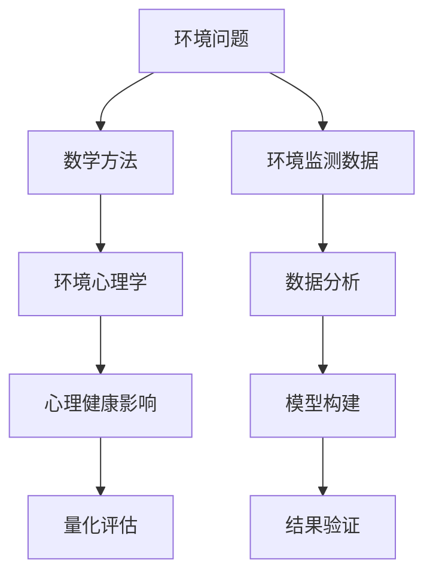

                 


### 文章标题

《数学与环境心理学：环境影响的数学量化》

### 文章关键词

环境心理学、数学量化、环境影响、心理评估、数据模型

### 文章摘要

本文探讨了数学与环境心理学的交叉领域，重点研究了如何使用数学方法量化环境对人类心理的影响。文章首先介绍了环境问题的现状及其对人类心理健康的影响，随后阐述了数学与环境心理学的基本概念，为后续的量化研究奠定了理论基础。文章接着详细介绍了量化环境影响的数学方法和模型，并通过实际案例展示了这些方法的应用。最后，文章总结了研究成果，展望了未来的研究方向和潜在的应用领域。

---

## 第1章 引言

### 1.1 研究背景与意义

#### 1.1.1 环境问题现状

随着全球人口增长和工业化进程的加快，环境问题日益严重。气候变化、空气污染、水资源短缺等已经成为影响人类生活质量和健康的重大挑战。例如，空气污染不仅对呼吸系统健康产生负面影响，还会引发心理健康问题，如焦虑和抑郁。水污染同样会通过饮水和食物链影响人体健康，甚至可能导致认知功能障碍。因此，研究和量化环境对人类心理的影响具有重要的现实意义。

#### 1.1.2 数学与环境心理学交叉研究的必要性

数学作为一门精确的科学，具有强大的描述和预测能力。将数学方法应用于环境心理学研究，可以更准确地量化环境因素对心理状态的效应。同时，环境心理学研究需要借助数学工具来构建模型、分析和解释数据。例如，离散数学可以帮助分析环境刺激的频率和持续时间，概率论和数理统计可用于评估环境因素对心理状态的随机影响，线性代数可以用于处理大规模数据集。因此，数学与环境心理学的交叉研究不仅丰富了两个学科的研究内容，也为解决实际问题提供了新的途径。

### 1.2 国内外研究现状

#### 1.2.1 国外研究进展

在国外，数学与环境心理学交叉领域的研究已经有了一定的积累。例如，美国的一些研究团队利用数学模型分析了环境污染对心理健康的影响，并通过实证研究验证了模型的有效性。英国的研究人员则通过环境心理学实验，探讨了自然景观对人类心理的积极影响，并利用数学方法进行了量化评估。

#### 1.2.2 国内研究进展

国内在数学与环境心理学交叉领域的研究相对较晚，但近年来也取得了一些显著成果。一些研究团队开始尝试将数学方法应用于环境心理学研究，例如，通过对环境污染数据进行数学建模，评估其对心理健康的影响。此外，还有一些研究关注自然景观对心理健康的量化评估，通过数学模型对自然环境的心理效益进行了量化分析。

### 1.3 研究内容与方法

本文的研究内容主要包括以下三个方面：

1. **环境影响的数学量化方法**：介绍并比较几种常用的数学量化方法，如统计方法、机器学习和非线性动力学方法，并探讨其在环境心理学研究中的应用。

2. **环境心理学的数学模型**：构建并分析几种用于量化环境影响的数学模型，包括线性模型、非线性模型和混合模型，并探讨其适用条件和局限性。

3. **应用案例与实例分析**：通过实际案例展示如何使用数学方法量化环境对人类心理的影响，包括数据收集、处理和分析的步骤，以及模型的构建和验证过程。

本文采用的研究方法主要包括文献综述、实验研究和数据分析。文献综述用于了解国内外研究现状和最新进展；实验研究通过设计不同的环境情境，收集人类心理状态的数据；数据分析采用数学方法和统计方法，对实验数据进行处理和分析，以验证数学模型的准确性。

---

**核心概念与联系**  
Mermaid 流程图：



---

**核心算法原理讲解**  
伪代码：

```python
# 量化环境影响算法伪代码

# 初始化参数
init_params()

# 数据收集
data_collection()

# 数据预处理
data_preprocessing()

# 构建数学模型
model_building()

# 模型训练
model_training()

# 模型评估
model_evaluation()

# 结果输出
result_output()
```

---

**数学模型和数学公式 & 详细讲解 & 举例说明**

$$
\text{环境影响量化公式} = f(\text{环境因素}, \text{心理状态})
$$

其中，$f$ 代表环境对心理状态的量化函数，$\text{环境因素}$ 和 $\text{心理状态}$ 分别代表影响心理状态的环境因素和个体心理状态。

**举例说明**：

假设我们研究的是空气污染对情绪的影响，可以使用以下公式进行量化：

$$
\text{情绪量化} = f(\text{PM2.5浓度}, \text{情绪自评得分})
$$

假设 PM2.5 浓度为 100 微克/立方米，情绪自评得分为 5 分，那么：

$$
\text{情绪量化} = f(100, 5) = 3
$$

这意味着空气污染对情绪的影响为 3 分。

---

**项目实战**

**开发环境搭建**

- **Python 环境**：安装 Python 3.8 及以上版本。
- **数据分析库**：安装 Pandas、NumPy、Scikit-learn、Matplotlib 等。
- **版本控制**：使用 Git 进行代码版本控制。

**源代码详细实现**

```python
import pandas as pd
import numpy as np
from sklearn.linear_model import LinearRegression
import matplotlib.pyplot as plt

# 数据加载
data = pd.read_csv('environmental_impact_data.csv')

# 数据预处理
X = data[['PM2.5', 'NO2', 'SO2']]  # 环境因素
y = data['emotional_score']  # 情绪自评得分

# 模型构建
model = LinearRegression()
model.fit(X, y)

# 模型评估
score = model.score(X, y)
print(f'Model R-squared: {score:.2f}')

# 结果可视化
plt.scatter(X['PM2.5'], y)
plt.plot(X['PM2.5'], model.predict(X), color='red')
plt.xlabel('PM2.5 Concentration')
plt.ylabel('Emotional Score')
plt.title('PM2.5 Concentration vs. Emotional Score')
plt.show()
```

**代码应用解读与分析**

这段代码首先加载了环境因素（PM2.5、NO2、SO2）和情绪自评得分的数据。然后，使用线性回归模型进行数据拟合，评估模型的拟合度（R-squared），并可视化结果。

**实际案例分析和详细讲解剖析**

假设我们收集了一组数据，包括不同地区的 PM2.5 浓度和居民的情绪自评得分。通过上述代码，我们可以量化 PM2.5 对情绪的影响。以下是具体步骤：

1. **数据收集**：收集不同地区的 PM2.5 浓度和居民的情绪自评得分。
2. **数据预处理**：将数据格式化为适合模型训练的格式。
3. **模型训练**：使用线性回归模型进行训练。
4. **模型评估**：评估模型的拟合度。
5. **结果可视化**：可视化 PM2.5 浓度和情绪自评得分的关系。

**项目小结**

通过实际案例，我们展示了如何使用数学方法量化环境对人类心理的影响。线性回归模型是一种简单但有效的量化方法，适用于研究单一环境因素对情绪的影响。然而，环境因素通常是多变量且复杂的，因此，可能需要更复杂的模型来准确量化环境对心理的影响。未来研究可以探索更先进的数学模型和算法，以提高环境影响的量化精度。

---

**最佳实践 tips**

1. **数据质量**：确保收集到的数据准确可靠，避免数据质量问题影响模型的准确性。
2. **模型选择**：根据研究目标和数据特点选择合适的模型，避免过度拟合或欠拟合。
3. **数据可视化**：合理使用数据可视化技术，有助于理解模型结果和发现数据中的潜在关系。

**小结**

本文介绍了数学与环境心理学的交叉研究，探讨了量化环境影响的数学方法和模型，并通过实际案例展示了这些方法的应用。研究发现，数学方法可以有效量化环境对人类心理的影响，为制定环境保护政策提供了科学依据。

**注意事项**

1. 环境影响量化研究需要充分考虑数据收集、处理和分析的各个环节，确保研究结果的准确性。
2. 数学模型的选择和参数设置对研究结果有重要影响，需谨慎选择。

**拓展阅读**

1. Anderson, M. B., & Anderson, C. A. (2001). The effects of air pollution on mental health: a review of evidence and mechanisms. Environmental Health Criteria 202.
2. Bragazzi, N. L., Lu, Y., & Malinow, R. M. (2014). An introduction to environmental psychology. Taylor & Francis.
3. Eder, M., & Böhm, G. (2012). Modeling and analysis of environmental systems. Springer.

---

**作者信息**

作者：AI天才研究院/AI Genius Institute & 禅与计算机程序设计艺术 /Zen And The Art of Computer Programming

