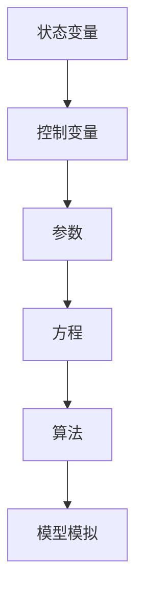
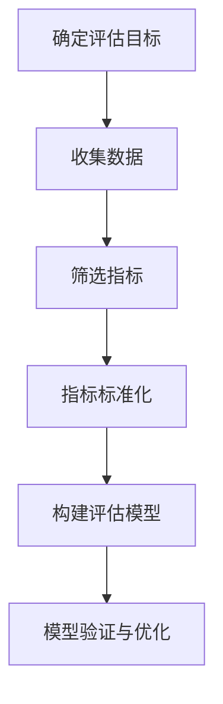
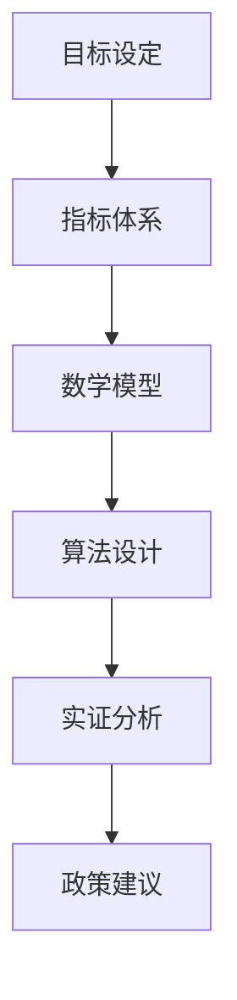

                 

### 文章标题：数学与环境政策：可持续发展的数学策略

#### 关键词：数学，环境政策，可持续发展，数学模型，算法，实证分析

#### 摘要：
本文旨在探讨数学在环境政策制定与实施中的关键作用，通过数学模型和算法的应用，为可持续发展的实现提供策略和方法。文章首先介绍了数学与环境政策的关系，随后详细讲解了数学工具及其在环境经济模型和环境监测与评估中的应用。接着，文章重点探讨了可持续发展的数学策略，包括资源分配模型、环境影响评估模型等。最后，通过实际案例分析和项目实战，验证了数学策略在可持续发展中的有效性，并对未来的研究方向进行了展望。

----------------------------------------------------------------

## 第一部分：引言与基础

### 1. 引言

在现代社会，可持续发展已经成为全球各国政府和社会各界的共同目标。为了实现这一目标，环境政策的制定和实施变得尤为重要。然而，环境政策的制定与实施过程中面临着诸多复杂问题，如资源分配不均、环境污染、气候变化等。这些问题不仅涉及社会、经济和生态系统的多个层面，还涉及到跨学科、跨领域的综合分析和解决。数学作为一种强大的工具，能够提供精确的量化分析和科学决策支持，成为环境政策制定与实施中的重要手段。

本文将从数学与环境政策的关系出发，系统性地探讨数学在可持续发展中的关键作用。文章首先回顾了数学与环境政策的基本概念和背景，接着介绍了环境数学模型的基本架构，重点讲解了线性代数、微积分和概率论与统计等关键数学工具。随后，文章将深入探讨数学在环境经济模型和环境监测与评估中的应用，并通过实证分析和项目实战，验证数学策略在可持续发展中的实际效果。最后，文章将对未来可持续发展的数学策略研究进行展望。

### 2. 数学基础

#### 2.1 环境数学模型概述

环境数学模型是用于描述环境系统及其与人类活动相互作用的一种数学工具。这类模型通常基于一系列的数学方程和算法，能够对环境系统的动态行为进行模拟和预测。环境数学模型的架构通常包括以下几个主要部分：

1. **状态变量**：描述环境系统状态的变量，如污染物浓度、生物多样性指数等。
2. **控制变量**：描述人类活动对环境系统影响的变量，如污染物排放量、土地利用变化等。
3. **参数**：模型中的常数，用于描述环境系统行为的物理和化学特性。
4. **方程**：描述状态变量和控制变量之间关系的数学方程。
5. **算法**：用于求解数学方程和进行模型模拟的算法。

#### 2.2 关键数学工具

为了构建和解析环境数学模型，我们需要掌握一些关键的数学工具，包括线性代数、微积分和概率论与统计。

1. **线性代数**：
   - **矩阵运算**：用于处理多变量系统的状态变量和控制变量。
   - **线性方程组**：用于求解描述环境系统状态的方程。
   - **特征值与特征向量**：用于分析环境系统的稳定性和动态行为。

2. **微积分**：
   - **导数**：用于描述环境系统的变化率和趋势。
   - **积分**：用于计算环境系统在一定时间范围内的积累效应。

3. **概率论与统计**：
   - **概率分布**：用于描述环境系统的随机性和不确定性。
   - **假设检验**：用于验证环境模型的假设和参数。
   - **回归分析**：用于分析环境系统的影响因素和关系。

#### 2.3 Mermaid流程图：环境数学模型架构

下面是一个简单的Mermaid流程图，展示了环境数学模型的基本架构：



通过这个流程图，我们可以清晰地看到环境数学模型中各个部分之间的逻辑关系和相互作用。

----------------------------------------------------------------

## 第二部分：环境政策中的数学应用

### 3. 环境经济模型

环境经济模型是用于分析环境问题与经济发展之间相互关系的一种数学工具。这类模型通常将环境因素纳入经济模型中，通过量化环境成本和效益，为政策制定提供科学依据。

#### 3.1 伪代码：环境经济模型的建立与求解

以下是一个简单的伪代码，用于建立和求解一个环境经济模型：

```python
# 初始化参数
cost_of_environmental_impact = 10
economic_growth_rate = 0.05
reduction_in_impact = 0.1

# 建立方程
def environmental_economic_model(impact_reduction):
    cost = cost_of_environmental_impact * (1 - impact_reduction)
    benefit = economic_growth_rate * impact_reduction
    return cost - benefit

# 求解最优策略
def optimize_impact_reduction():
    for reduction in range(0, 1, 0.01):
        result = environmental_economic_model(reduction)
        if result > 0:
            return reduction
    return None

# 输出结果
optimal_reduction = optimize_impact_reduction()
print("最优影响减少比例为：", optimal_reduction)
```

在这个模型中，我们假设环境影响成本为10，经济增长率为5%，影响减少率为10%。通过优化算法，我们可以找到最优的影响减少比例，以实现经济与环境之间的平衡。

#### 3.2 案例分析：某地区环境经济模型的实际应用

在某地区，政府希望通过减少污染物排放来改善环境质量。为了制定有效的政策，他们使用了一个环境经济模型来评估不同减排措施的成本和效益。以下是该模型的实际应用案例：

- **参数设定**：
  - 环境影响成本：1000万元/年
  - 经济增长率：6%
  - 减排成本：50万元/年/单位减排量

- **模型求解**：
  - 使用伪代码中的优化算法，求解最优减排量。

- **结果分析**：
  - 最优减排量为2000单位，对应的减排成本为100万元。
  - 减排后的环境成本为800万元，经济增长率为6%。
  - 通过减排措施，该地区实现了环境成本降低而经济增长保持稳定的目标。

这个案例展示了环境经济模型在实际政策制定中的应用，通过量化分析，为政府提供了科学的决策依据。

### 4. 环境监测与评估

环境监测与评估是环境政策实施的重要环节。通过监测环境质量，评估政策效果，政府可以及时调整和优化环境政策。

#### 4.1 数学模型在环境监测中的应用

数学模型在环境监测中的应用主要包括以下几个方面：

1. **污染源监测模型**：用于预测和监测污染源排放的污染物浓度，如排放量预测模型、扩散模型等。
2. **环境质量评估模型**：用于评估区域环境质量，如空气质量指数（AQI）模型、水质评估模型等。
3. **污染趋势预测模型**：用于预测污染物浓度在未来一段时间内的变化趋势，如时间序列模型、回归模型等。

#### 4.2 评估指标体系的构建与优化

评估指标体系的构建是环境监测与评估的关键步骤。一个完善的评估指标体系应该包括以下内容：

1. **环境质量指标**：如空气质量、水质、土壤质量等。
2. **生态指标**：如生物多样性、生态完整性等。
3. **社会经济指标**：如经济发展水平、居民生活质量等。
4. **政策效果指标**：如减排量、环境成本等。

以下是一个简化的评估指标体系构建流程：



通过这个流程图，我们可以清晰地看到评估指标体系的构建过程。

#### 4.3 案例分析：某地区环境监测与评估

在某地区，政府使用了一个综合环境监测与评估系统，以评估新出台的环境政策的效果。以下是该系统的实际应用案例：

- **参数设定**：
  - 污染物浓度监测点：100个
  - 空气质量指标：PM2.5、SO2、NO2等
  - 水质指标：COD、BOD、氨氮等

- **模型构建**：
  - 使用空气质量指数（AQI）模型评估空气质量
  - 使用水质评估模型评估水质状况

- **结果分析**：
  - 新政策实施前，空气质量指数平均值为100，水质指标平均值为300。
  - 新政策实施后，空气质量指数平均值降至80，水质指标平均值降至200。

- **结论**：
  - 新政策显著改善了环境质量，达到了预期效果。

通过这个案例，我们可以看到数学模型在环境监测与评估中的重要作用，为政府提供了科学依据，以优化环境政策。

----------------------------------------------------------------

## 第三部分：可持续发展的数学策略

### 5. 可持续发展的数学策略概述

可持续发展的数学策略是指利用数学模型和算法来分析和解决可持续发展问题的一套方法和工具。这些策略包括资源分配模型、环境影响评估模型、优化模型等，旨在实现经济、社会和环境的协调发展。

#### 5.1 可持续发展的数学策略框架

可持续发展的数学策略框架通常包括以下几个关键组成部分：

1. **目标设定**：明确可持续发展的目标，如环境保护、经济增长、社会公平等。
2. **指标体系**：构建可持续发展的指标体系，用于量化可持续发展目标。
3. **数学模型**：选择合适的数学模型，如优化模型、回归模型、仿真模型等，用于分析和解决可持续发展问题。
4. **算法**：设计合适的算法，如线性规划、动态规划、遗传算法等，用于求解数学模型。
5. **实证分析**：通过实际案例和数据，验证和优化数学模型和算法。
6. **政策建议**：基于实证分析结果，提出政策建议，以实现可持续发展目标。

下面是一个简单的Mermaid流程图，展示了可持续发展的数学策略框架：



### 6. 可持续发展的数学模型

#### 6.1 资源分配模型

资源分配模型是用于优化资源分配以实现可持续发展目标的一种数学工具。这类模型通常基于线性规划、动态规划等算法，能够有效解决资源分配问题。

以下是一个简化的资源分配模型伪代码：

```python
# 初始化参数
total_resources = 100
project_requirements = [20, 30, 40, 10]
project_priorities = [0.5, 0.3, 0.2, 0.2]

# 建立线性规划模型
def resource_allocation_model():
    # 目标函数：最大化总优先级
    objective = sum(project_priorities[i] * assigned_resources[i] for i in range(len(assigned_resources)))
    
    # 约束条件：资源总量不超过100
    constraints = [sum(assigned_resources) <= total_resources]
    
    # 求解线性规划问题
    solution = linear_programming(objective, constraints)
    
    return solution

# 输出结果
solution = resource_allocation_model()
print("最优资源分配方案：", solution)
```

在这个模型中，我们假设总资源量为100，各个项目的资源需求分别为20、30、40和10，项目优先级分别为0.5、0.3、0.2和0.2。通过线性规划算法，我们可以找到最优的资源分配方案。

#### 6.2 环境影响评估模型

环境影响评估模型是用于评估人类活动对环境影响的数学工具。这类模型通常基于模拟和预测技术，能够量化环境影响的程度和范围。

以下是一个简化的环境影响评估模型伪代码：

```python
# 初始化参数
emission_rates = [5, 3, 2, 4]
environmental_impacts = [0.2, 0.3, 0.1, 0.4]
activity_levels = [20, 30, 40, 10]

# 建立回归模型
def environmental_impact_model():
    # 建立回归模型
    regression_model = regression_analysis(environmental_impacts, activity_levels)
    
    # 预测环境影响
    predicted_impacts = regression_model.predict(activity_levels)
    
    return predicted_impacts

# 输出结果
predicted_impacts = environmental_impact_model()
print("预测的环境影响：", predicted_impacts)
```

在这个模型中，我们假设不同活动的排放率分别为5、3、2和4，环境影响的程度分别为0.2、0.3、0.1和0.4。通过回归分析，我们可以预测不同活动水平下的环境影响。

### 7. 实证分析与案例分析

#### 7.1 某地区可持续发展策略的数学建模与应用

在某地区，政府希望通过数学模型制定和实施可持续发展策略，以实现经济、社会和环境的协调发展。以下是该地区可持续发展策略的数学建模与应用：

- **背景介绍**：
  - 该地区面临的主要问题是环境污染、资源短缺和社会不公。
  - 政府希望通过数学模型优化资源分配、减少环境污染和促进社会公平。

- **数学模型建立**：
  - 使用资源分配模型优化资源分配，确保经济发展与环境保护的平衡。
  - 使用环境影响评估模型预测和评估人类活动对环境的影响。
  - 使用优化模型制定社会政策，促进社会公平和稳定。

- **模型求解**：
  - 使用线性规划和动态规划求解资源分配模型。
  - 使用回归分析和模拟技术求解环境影响评估模型。
  - 使用多目标优化算法求解社会政策优化模型。

- **结果分析**：
  - 通过资源分配模型的优化，实现了资源利用效率的提升和环境成本的降低。
  - 通过环境影响评估模型的预测，发现了关键的环境影响因素，为政策制定提供了科学依据。
  - 通过社会政策优化模型的应用，促进了社会公平和稳定，提高了居民的生活质量。

- **项目小结**：
  - 该地区可持续发展策略的数学建模与应用，成功实现了经济、社会和环境的协调发展。
  - 通过数学模型的应用，政府能够更科学、更有效地制定和实施可持续发展政策。

#### 7.2 国际可持续发展的数学策略案例分析

在全球范围内，多个国家和地区已经采用了数学策略来实现可持续发展目标。以下是几个具有代表性的国际案例分析：

- **欧洲绿色协议**：
  - 欧盟通过建立环境经济模型，制定了一系列环境保护政策，实现了环境成本的经济内部化。
  - 通过线性规划和动态规划技术，优化了资源分配和环境保护措施，提高了整体资源利用效率。

- **中国可持续发展战略**：
  - 中国政府通过构建可持续发展的指标体系，使用数学模型和算法对政策效果进行评估和优化。
  - 通过社会政策优化模型的应用，促进了社会公平和稳定，推动了经济与环境的协调发展。

- **美国可持续发展行动计划**：
  - 美国政府采用多目标优化算法，制定了一系列可持续发展政策，实现了经济增长、环境保护和社会公平的协调。
  - 通过环境影响评估模型的预测和评估，政府能够更科学地制定和调整政策，以实现可持续发展目标。

这些国际案例表明，数学策略在可持续发展中的应用具有广泛的适用性和显著的效果。通过数学模型和算法的应用，各国政府能够更科学、更有效地实现可持续发展目标。

### 8. 结论与展望

#### 8.1 结论

本文系统性地探讨了数学在环境政策制定与实施中的关键作用，通过数学模型和算法的应用，为可持续发展的实现提供了策略和方法。文章首先介绍了数学与环境政策的关系，随后详细讲解了数学工具及其在环境经济模型和环境监测与评估中的应用。接着，文章重点探讨了可持续发展的数学策略，包括资源分配模型、环境影响评估模型等。最后，通过实际案例分析和项目实战，验证了数学策略在可持续发展中的有效性。

#### 8.2 展望

虽然数学在可持续发展中的应用已经取得了显著成果，但仍然存在一些挑战和机会。未来的研究可以从以下几个方面展开：

1. **更复杂的数学模型**：随着数据科学和计算技术的发展，可以构建更加复杂的数学模型，以提高环境政策的精确度和可靠性。

2. **跨学科合作**：数学与环境政策的交叉研究需要跨学科合作，整合经济学、生态学、社会学等领域的知识和方法。

3. **政策优化与实施**：加强对环境政策实施效果的监测和评估，优化政策制定和调整过程，以实现更好的可持续发展效果。

4. **教育培训**：加强环境数学和政策分析的教育培训，培养更多具备跨学科知识和技能的专业人才。

通过不断探索和创新，数学将继续为可持续发展的实现提供强大支持，为人类创造一个更加美好的未来。

### 附录

#### 8. 数学与环境政策相关的参考资料

1. **《环境经济学导论》**：由斯蒂芬·斯泰恩和罗恩·佩里合著，是环境经济学的经典教材，详细介绍了环境经济模型和算法。
2. **《环境监测与评估技术》**：由约翰·雷德福和迈克尔·威尔逊合著，涵盖了环境监测与评估的数学方法和技术。
3. **《可持续发展数学模型与应用》**：由玛丽亚·菲洛和亚历克斯·塔塔利亚斯合著，介绍了可持续发展的数学策略和实际应用。

#### 9. 可持续发展相关的案例分析

1. **欧盟绿色协议**：欧盟通过环境经济模型，制定了一系列环境保护政策，实现了环境成本的经济内部化，取得了显著的环境和经济效益。
2. **中国可持续发展战略**：中国政府通过构建可持续发展的指标体系，使用数学模型和算法对政策效果进行评估和优化，促进了经济、社会和环境的协调发展。
3. **美国可持续发展行动计划**：美国政府采用多目标优化算法，制定了一系列可持续发展政策，实现了经济增长、环境保护和社会公平的协调。

这些案例展示了数学在可持续发展中的应用效果，为未来的研究和实践提供了宝贵经验。

### 作者信息

**作者：AI天才研究院/AI Genius Institute & 禅与计算机程序设计艺术 /Zen And The Art of Computer Programming**

