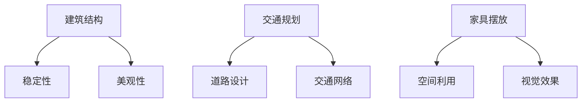

                 

### 文章标题：数学与现实主义：数学作为现实世界的抽象

> 关键词：数学、现实主义、抽象、应用、跨学科、未来展望

在当今科技飞速发展的时代，数学作为一门基础学科，其在现实世界中的应用愈发广泛且深远。本文旨在探讨数学与现实世界之间的紧密联系，揭示数学作为一种抽象工具在理解和解决现实问题中的重要作用。本文将逐步分析数学与现实世界的初步认识、数学作为现实世界的抽象、数学方法在解决现实问题中的应用，并深入探讨数学与现实世界的复杂关系、跨学科融合及未来展望。通过这种一步一步的分析推理，我们希望能展现数学在现实世界中的多维度价值，激发读者对数学与现实世界关系的深刻思考。

### 摘要

本文通过逻辑清晰、结构紧凑的分析，探讨了数学与现实世界之间的紧密联系。首先，我们初步认识了数学在现实世界中的应用，包括自然数与计数、几何与空间感知、概率和统计等方面。接着，我们深入探讨了数学作为现实世界的抽象，分析了抽象的概念和过程，并讨论了数学概念与现实世界的映射。随后，本文重点介绍了数学方法在解决现实问题中的应用，包括建立数学模型、数学方法在决策制定和风险评估中的应用等。进一步，我们深入探讨了数学概念与现实世界的复杂关系和跨学科融合，最后展望了数学在解决现实问题中的潜力及未来发展趋势。通过本文的探讨，我们希望能揭示数学在现实世界中的多维度价值，激发读者对数学与现实世界关系的深刻思考。

### 第一部分：数学与现实世界的初步认识

## 1. 数学与现实世界的联系

### 1.1 数学的基本概念和现实世界的联系

在探讨数学与现实世界的联系之前，我们先简要回顾数学的一些基本概念。数学是一门研究数量、结构、变化和空间等概念的学科，其基础概念包括自然数、整数、分数、实数、复数等。这些基本概念不仅构成了数学的基础理论框架，也广泛应用于现实世界的各个方面。

#### 1.1.1 自然数与计数问题

自然数是数学中最基本的概念之一，它们用于表示物体的数量。在现实生活中，我们经常需要计数，例如，统计商品数量、计算人口、记录时间等。自然数在经济学、社会学、生物学等多个领域中都有广泛的应用。例如，经济学中的生产函数模型、人口增长模型等都基于自然数概念。

```latex
生产函数：Y = F(K, L)
人口增长模型：N(t) = N_0 e^{rt}
```

#### 1.1.2 几何与空间感知

几何是研究空间形状和大小的一门数学学科。在我们的日常生活中，空间感知和形状分析无处不在。例如，建筑设计需要运用几何学来确保结构的稳定性和美观性；交通规划需要利用几何原理来设计道路和交通网络；甚至日常生活中的家具摆放，都需要考虑空间利用和视觉效果。



#### 1.1.3 概率和统计与现实生活

概率论和统计学是研究随机事件和数据的数学分支。在现实世界中，我们经常面临不确定性，需要通过概率和统计方法来分析和预测。例如，天气预报利用气象数据进行概率分析，以便预测天气变化；医学研究通过统计分析来评估药物疗效；金融投资领域则利用概率模型来评估风险和收益。

```latex
天气预报模型：P(天气=晴天) = 0.6
药物疗效评估：p-value = 0.05
金融投资模型：预期收益 = E(R) = 0.1
```

### 1.2 数学模型在现实世界中的应用

数学模型是将现实问题抽象成数学形式，以便于分析和求解的工具。数学模型在现实世界中具有广泛的应用，以下是一些具体的应用实例：

#### 1.2.1 数学模型在经济管理中的应用

经济学中的许多理论都依赖于数学模型。例如，宏观经济学中的索洛增长模型、微观经济学中的供需模型等。这些模型帮助我们理解经济运行的规律，预测经济趋势，制定经济政策。

```latex
索洛增长模型：Y = A * K^α * L^(1-α)
供需模型：Q_d = Q_s
```

#### 1.2.2 数学模型在工程建筑中的应用

在工程建筑领域，数学模型被广泛应用于结构设计、材料力学、流体力学等方面。例如，有限元分析方法是一种基于数学模型的数值方法，用于求解复杂结构的应力分布和变形情况。

```latex
有限元方法：K * u = f
```

#### 1.2.3 数学模型在生物学医学中的应用

生物学和医学领域也广泛应用数学模型。例如，种群动力学模型用于研究传染病传播、药物浓度在体内的分布等。这些模型有助于我们更好地理解生物系统的运行机制，指导医学研究和疾病控制。

```latex
种群动力学模型：dN/dt = rN(1 - N/K)
药物浓度模型：C(t) = D * A * (1 - e^(-kt))
```

通过上述分析，我们可以看到数学与现实世界之间的紧密联系。数学不仅是一种抽象工具，更是一种理解世界、解决现实问题的重要手段。在接下来的章节中，我们将进一步探讨数学作为现实世界的抽象，以及数学方法在解决现实问题中的应用。

## 2. 数学作为现实世界的抽象

### 2.1 抽象的概念和过程

#### 2.1.1 抽象的定义与作用

抽象是思维过程中的一种基本形式，指的是从具体的事物中提取出共同的、本质的特征，并忽略其非本质的、具体的特征。抽象的目的是简化复杂现象，使得我们能够更有效地理解和处理信息。在数学中，抽象是一个核心概念，它帮助我们将现实世界中的复杂问题简化为数学问题。

抽象的作用主要体现在以下几个方面：

1. **简化复杂问题**：通过抽象，我们可以将复杂的现实问题简化为数学模型，使得问题的解决变得更加直观和系统化。
2. **揭示本质规律**：抽象使我们能够从具体的事物中提取出普遍适用的规律和原理，从而更好地理解和解释现实世界。
3. **促进创新和发展**：抽象为科学研究和技术创新提供了理论依据，推动了人类文明的进步。

#### 2.1.2 数学中的抽象过程

数学中的抽象过程可以分为以下几个步骤：

1. **选择研究对象**：首先，我们需要确定要研究的对象，这可以是现实世界中的某一具体现象，也可以是抽象的概念。
2. **提取关键特征**：在确定了研究对象后，我们需要从该对象中提取出关键的、本质的特征，忽略非本质的、具体的特征。
3. **建立数学模型**：通过提取出的关键特征，我们可以建立一个数学模型，用数学语言来描述研究对象。
4. **分析模型性质**：在建立了数学模型后，我们可以通过数学方法来分析模型的各种性质，从而揭示出研究对象的本质规律。

### 2.2 抽象的数学概念与现实世界的映射

#### 2.2.1 数与数量

在数学中，数是一个基础概念，用于表示数量。现实世界中，我们经常需要处理各种数量问题，例如人口统计、商品计数、能源消耗等。数学中的数与数量之间存在直接的映射关系。例如，我们可以使用自然数来表示物体的个数，使用整数来表示正负数量，使用实数来表示连续的数值。

#### 2.2.2 空间与维度

空间是数学中的一个重要概念，它描述了物体存在的范围和形状。在现实世界中，空间感知和维度分析无处不在。数学中的空间概念，如二维平面、三维空间等，与现实世界的空间感知密切相关。例如，建筑设计师需要考虑建筑的结构稳定性和空间利用率，交通规划师需要设计道路和交通网络，这些都涉及到对空间维度的精确分析和计算。

#### 2.2.3 时间与变化

时间是数学中的一个基本概念，它描述了事件发生的顺序和持续时间。在现实世界中，时间与变化密切相关。例如，经济学中的增长模型需要考虑时间序列数据，物理学中的运动学需要分析时间和距离的关系，医学中的临床试验需要记录时间与治疗效果的关系。

通过上述分析，我们可以看到，抽象的数学概念与现实世界中的各种现象和问题之间存在紧密的映射关系。数学作为现实世界的抽象工具，不仅帮助我们简化了复杂的问题，还揭示了现实世界中的本质规律。在接下来的章节中，我们将进一步探讨数学方法在解决现实问题中的应用。

### 3. 数学方法在解决现实问题中的应用

#### 3.1 建立数学模型

数学模型是解决现实问题的有力工具，它将现实问题转化为数学问题，以便于分析和求解。建立数学模型的过程通常包括以下几个步骤：

1. **确定问题背景**：明确要解决的问题是什么，问题的背景和条件是什么。
2. **提取关键信息**：从问题背景中提取出关键信息，这些信息将直接影响到数学模型的建立。
3. **定义变量**：根据问题的需求，定义所需的变量，包括输入变量、输出变量和中间变量。
4. **建立方程**：利用提取出的信息，建立描述问题的数学方程或方程组。
5. **分析模型**：对建立的数学模型进行分析，包括求解方程、分析模型的稳定性和敏感性等。

数学模型的建立是一个系统化的过程，需要综合考虑问题的复杂性和实际需求。以下是一个简单的例子：

**例子：人口增长模型**

假设一个地区的人口增长满足以下条件：

- 初始人口 \( N_0 \) 为 100 万。
- 每年的出生率为 1%，死亡率为 0.5%。

我们可以建立一个简单的人口增长模型：

```latex
N(t) = N_0 \times (1 + r \times (1 - d))
```

其中，\( N(t) \) 是 t 年后的人口数，\( r \) 是出生率，\( d \) 是死亡率。

通过这个模型，我们可以预测在不同年份的人口数量。

#### 3.1.2 数学模型的优化

数学模型不仅用于描述现实问题，还可以用于优化决策。优化是指在一定条件下，找到最优解或最优方案。数学优化方法包括线性规划、非线性规划、动态规划等。

**例子：线性规划**

假设一家公司需要安排生产计划，以满足市场需求，并最大化利润。市场需求函数为 \( P(x) = 100 - 2x \)，其中 \( x \) 是生产的商品数量。生产成本函数为 \( C(x) = 10x + 1000 \)。我们需要找到一个最优的生产数量 \( x \)，使得利润最大化。

我们可以使用线性规划来解决这个问题：

```latex
\begin{align*}
\text{最大化} & \quad P(x) - C(x) \\
\text{约束条件} & \quad 0 \leq x \leq 50 \\
& \quad P(x) \geq 0 \\
& \quad C(x) \geq 0
\end{align*}
```

通过求解这个线性规划问题，我们可以找到最优的生产数量 \( x \)，从而最大化利润。

#### 3.2 数学方法在决策制定中的应用

数学方法在决策制定中起着至关重要的作用。通过数学建模和优化，我们可以为各种决策提供科学依据。以下是一些具体的数学方法：

1. **博弈论**：博弈论用于分析多个个体在竞争或合作中的决策行为。它可以帮助我们理解竞争策略、合作策略以及均衡状态。
   
   **例子**：博弈论中的纳什均衡。在一个博弈中，每个参与者都会选择一个最优策略，使得自己的收益最大化，同时考虑到其他参与者的策略。

2. **决策树**：决策树是一种图形化的方法，用于表示决策过程和各个可能的结果。通过决策树，我们可以系统地分析各种决策路径，并选择最佳决策。

3. **风险分析**：在决策过程中，风险是一个重要的考虑因素。数学方法，如概率论和统计方法，可以帮助我们评估和量化风险。

   **例子**：风险矩阵。通过建立风险矩阵，我们可以评估不同决策路径的风险水平，并选择风险最小的方案。

#### 3.2.2 数学方法在风险评估中的应用

在许多领域，如金融、保险、工程等，风险评估是一个关键问题。数学方法在风险评估中具有广泛的应用。

**例子**：金融风险评估。在金融市场中，投资者需要评估各种投资方案的风险和收益。通过建立数学模型，如波动率模型、价值-at-Risk模型等，投资者可以量化投资组合的风险水平，并做出更明智的投资决策。

1. **波动率模型**：波动率是衡量金融资产价格波动程度的一个指标。通过波动率模型，我们可以预测资产价格的未来波动情况。

   **例子**：几何布朗运动模型。该模型假设资产价格遵循几何布朗运动过程，通过求解模型，我们可以预测资产价格的未来波动。

2. **价值-at-Risk模型**：价值-at-Risk（VaR）是一个衡量金融资产在一定时间内可能发生的最大损失的方法。通过VaR模型，我们可以评估投资组合的风险水平，并制定相应的风险管理策略。

   **例子**：历史模拟法。该方法通过历史数据来计算VaR，假设未来的市场波动与历史市场波动相似。

#### 3.2.3 数学方法在社会科学中的应用

数学方法在社会科学领域，如经济学、社会学、心理学等，也有广泛的应用。

**例子**：经济学中的供需模型。供需模型描述了商品价格和市场需求量之间的关系。通过分析供需模型，我们可以预测市场价格的变化，并为制定经济政策提供依据。

```latex
Q_d = a - bP
Q_s = c + dP
```

其中，\( Q_d \) 是需求量，\( Q_s \) 是供应量，\( P \) 是价格，\( a, b, c, d \) 是参数。

通过上述分析，我们可以看到数学方法在解决现实问题中的广泛应用。从建立数学模型、优化决策到风险评估，数学为各种现实问题提供了科学的分析和解决手段。在接下来的章节中，我们将进一步探讨数学概念与现实世界的复杂关系，以及数学在跨学科研究中的角色。

### 第二部分：数学与现实世界的深入探索

## 4. 数学概念与现实世界的复杂关系

在初步了解了数学与现实世界的联系之后，我们需要更深入地探讨数学概念与现实世界之间的复杂关系。数学概念不仅反映了现实世界中的某些方面，而且常常涉及到多层次、多维度的问题。因此，理解数学概念与现实世界的复杂关系是把握数学在现实世界中应用的关键。

### 4.1 数学概念的多维度解释

数学概念的多维度解释指的是从不同的角度和层面来理解一个数学概念，从而揭示其与现实世界的多种联系。以下是几个典型的数学概念及其多维度解释：

#### 4.1.1 数学概念的多层次理解

1. **自然数**：自然数可以表示物体的数量，这是最直观的理解。但是，从更深的层次来看，自然数还涉及到集合论、数论等数学分支，这些理论揭示了自然数在数学体系中的基础地位。

   **举例**：在集合论中，自然数可以通过集合的基数来定义，从而建立了自然数与集合之间的联系。

2. **函数**：函数是描述变量之间关系的数学概念。从简单的一次函数、二次函数到复杂的多元函数、泛函等，函数在不同的层次上有着不同的表现形式和意义。

   **举例**：在物理学中，函数用于描述物理量之间的依赖关系，如速度、加速度等。

3. **概率**：概率是描述随机事件发生可能性的一种度量。从基本的概率论到统计物理学、量子概率等，概率在现实世界中的应用和解释是多层次和多样化的。

   **举例**：在金融学中，概率用于计算投资的风险和预期收益。

#### 4.1.2 数学概念与现实世界的多维度映射

数学概念与现实世界的映射关系也是多维度的。不同的数学概念可以通过不同的维度与现实世界中的现象相对应。

1. **几何与空间**：几何学描述了空间形状和大小。现实世界中的建筑、城市规划、交通网络等都涉及到几何问题。

   **举例**：在建筑设计中，几何学用于确保结构的稳定性和美观性。

2. **微分与积分**：微分和积分是数学中的基本工具，用于描述变化和累积。在物理学中，微分和积分用于描述速度、加速度、能量等。

   **举例**：在物理学中，速度是位移对时间的微分，而动能是速度对时间的积分。

3. **拓扑学**：拓扑学研究空间的性质，而不依赖于空间的度量。在现实世界中，拓扑学用于描述复杂系统的稳定性和连通性。

   **举例**：在神经科学中，拓扑学用于研究大脑网络的稳定性和功能连通性。

### 4.2 数学概念与现实世界的互动

数学概念的发展与现实世界的进步之间存在着深刻的互动关系。一方面，数学概念为现实世界的理解和解释提供了工具和框架；另一方面，现实世界的问题和需求又推动了数学概念的发展和扩展。

#### 4.2.1 数学概念的发展与现实世界的进步

1. **数学与科技进步**：数学在许多科技领域的进步中起到了关键作用。例如，牛顿力学和爱因斯坦相对论的发展离不开微积分；计算机科学的兴起离不开离散数学和图论等。

   **举例**：在计算机科学中，图论被用于网络设计和算法分析，从而推动了互联网和大数据技术的发展。

2. **数学与经济发展**：数学在经济管理中的应用极大地促进了经济的发展。例如，经济学中的优化理论、金融市场中的概率模型等都为经济决策提供了科学依据。

   **举例**：经济学中的索洛增长模型通过数学方法分析了经济长期增长的驱动力，为政策制定提供了重要参考。

#### 4.2.2 现实世界对数学概念的挑战与影响

现实世界对数学概念提出了许多挑战，同时也推动了数学概念的不断发展和完善。

1. **复杂系统的建模**：现实世界中存在大量的复杂系统，如生态系统、金融系统、社会系统等。这些系统往往难以用传统的数学模型来描述，从而推动了复杂系统理论的兴起。

   **举例**：在生态系统中，物种之间的相互作用和生态平衡问题可以通过复杂网络和图论来建模和分析。

2. **量子计算**：量子计算的兴起对传统数学概念提出了新的挑战，同时也推动了数学在量子领域的发展。量子计算中的量子比特、量子门等概念与传统计算机中的比特、指令等有本质的不同，这要求我们发展新的数学工具和方法。

   **举例**：在量子计算中，量子态和量子叠加原理是基本的数学概念，这些概念为量子计算提供了理论基础。

通过上述分析，我们可以看到数学概念与现实世界之间的复杂关系。数学不仅反映了现实世界的某些方面，而且在现实世界的发展和进步中起到了关键作用。在接下来的章节中，我们将进一步探讨数学在跨学科研究中的角色，以及数学与现实世界的未来展望。

## 5. 数学与现实世界的跨学科融合

### 5.1 数学与其他学科的交叉应用

数学作为一门基础学科，其理论与方法广泛应用于其他学科中，形成了众多跨学科领域。以下是一些典型的数学与其他学科的交叉应用：

#### 5.1.1 数学与物理的结合

物理学是研究自然现象和物质运动规律的学科，数学在物理学中起到了核心作用。经典物理学中的牛顿力学、麦克斯韦电磁理论、爱因斯坦相对论等，都依赖于数学工具和理论。

**例子**：牛顿力学中的运动方程可以用微积分来描述，例如，经典力学中的第二定律可以表示为：

$$
F = ma
$$

其中，\( F \) 是力，\( m \) 是质量，\( a \) 是加速度。

#### 5.1.2 数学与生物学的结合

生物学是研究生命现象的学科，数学在生物学中的应用越来越广泛。从分子生物学到生态系统，数学模型被用来理解和预测生物系统的行为。

**例子**：在分子生物学中，遗传学中的基因调控网络可以用图论来描述，通过建立数学模型，可以分析基因之间的相互作用和调控关系。

$$
G = (V, E)
$$

其中，\( V \) 表示节点（基因），\( E \) 表示边（基因之间的相互作用）。

#### 5.1.3 数学与计算机科学的结合

计算机科学是研究计算机及其应用的一门学科，数学在计算机科学中的应用非常广泛，包括算法设计、密码学、人工智能等。

**例子**：在密码学中，离散数学中的群论、环论等理论被用来设计安全的加密算法，例如，RSA加密算法基于大整数分解的困难性。

$$
(n, \phi(n)) = 1
$$

其中，\( n \) 是大整数，\( \phi(n) \) 是欧拉函数。

### 5.2 数学在跨学科研究中的角色

数学在跨学科研究中的角色不仅是提供工具和方法，更重要的是，它为跨学科研究提供了统一的语言和框架。

#### 5.2.1 数学在科学发现中的作用

数学在科学发现中起到了桥梁的作用，它能够将不同学科的发现和理论联系起来，促进新的科学突破。

**例子**：在量子物理学中，数学的引入使得我们对微观世界的理解发生了革命性的变化。量子力学中的波函数、薛定谔方程等都是数学工具，这些工具帮助我们揭示了微观世界的奥秘。

$$
i\hbar \frac{\partial \Psi}{\partial t} = \hat{H} \Psi
$$

其中，\( \hbar \) 是约化普朗克常数，\( \Psi \) 是波函数，\( \hat{H} \) 是哈密顿算子。

#### 5.2.2 数学在技术发展中的应用

数学在技术发展中的应用同样重要，它为技术创新提供了理论基础和工具。

**例子**：在信息技术领域，数学的广泛应用推动了互联网、大数据、人工智能等技术的发展。例如，在人工智能中，机器学习算法依赖于概率论、统计学和优化理论，这些数学工具帮助我们开发出高效的智能系统。

$$
y = \theta_0 + \theta_1x_1 + \theta_2x_2 + \cdots + \theta_nx_n
$$

其中，\( y \) 是输出，\( x_i \) 是输入特征，\( \theta_i \) 是权重。

#### 5.2.3 数学在社会发展中的影响

数学不仅影响科学技术的发展，也对社会的各个方面产生了深远的影响。

**例子**：在经济学中，数学模型帮助我们理解和预测经济行为，优化资源配置。例如，微观经济学中的供需模型、宏观经济学的索洛增长模型等，都为政策制定提供了科学依据。

$$
Y = AK^{0.3}L^{0.7}
$$

其中，\( Y \) 是产出，\( K \) 是资本，\( L \) 是劳动，\( A \) 是技术进步。

通过上述分析，我们可以看到数学在跨学科研究中的关键作用。数学不仅为其他学科提供了工具和方法，还促进了科学发现、技术创新和社会发展。在未来的发展中，数学将继续发挥其不可替代的作用，推动人类社会向前发展。

### 6. 数学与现实世界的未来发展

随着科技的不断进步和社会的不断发展，数学在解决现实问题中的潜力愈发显现。未来，数学不仅将继续深化其在传统领域中的应用，还将在新兴领域和跨学科研究中发挥更加重要的作用。以下是数学在现实世界未来发展中的一些展望。

#### 6.1 数学在解决现实问题中的潜力

数学在解决现实问题中的潜力主要表现在以下几个方面：

1. **技术创新**：数学在推动技术创新中将发挥重要作用。例如，在人工智能领域，数学算法如深度学习、优化算法等，将继续推动算法性能的提升，为自动驾驶、医疗诊断等提供更精准的解决方案。

   **例子**：深度学习中的卷积神经网络（CNN）算法，通过数学模型的优化，使得图像识别和分类的准确率不断提高。

2. **环境管理**：随着全球环境问题的加剧，数学在环境保护中的应用潜力巨大。例如，通过建立生态模型和气候模型，可以更好地预测和应对气候变化、生物多样性保护等问题。

   **例子**：气候模型通过数学方法，可以模拟不同温室气体排放水平下的气候变化趋势，为政策制定提供科学依据。

3. **社会管理**：数学在优化社会资源配置、提升公共服务质量等方面具有巨大潜力。例如，通过建立交通模型和城市规划模型，可以优化交通流量，提升城市运行效率。

   **例子**：城市交通模型通过数学建模，可以分析不同交通策略下的交通流量分布，从而制定更有效的交通管理政策。

#### 6.2 数学理论的未来发展趋势

数学理论的未来发展趋势将呈现以下几个特点：

1. **复杂性研究**：随着对复杂系统的关注不断增加，数学将致力于研究复杂系统的行为和规律。例如，复杂网络理论、随机过程理论等，将在理解复杂系统方面发挥重要作用。

   **例子**：复杂网络理论通过研究网络中的节点和边的关系，可以揭示社会网络、生物网络等复杂系统的特征和演化规律。

2. **量子计算**：量子计算的兴起将推动数学理论的发展。量子计算依赖于量子数学，如量子代数、量子几何等，这些理论将在量子算法和量子计算应用中发挥关键作用。

   **例子**：量子计算中的量子比特和量子门，是量子数学的重要研究对象，这些概念为量子算法的设计提供了理论基础。

3. **大数据与人工智能**：随着大数据和人工智能的快速发展，数学将致力于解决大数据处理、模型优化等问题。例如，统计学中的贝叶斯方法、机器学习中的优化算法等，将在人工智能领域发挥重要作用。

   **例子**：贝叶斯方法通过概率模型，可以有效地处理不确定性问题，为人工智能中的决策提供科学依据。

#### 6.3 数学方法在未来的社会生活中的应用

数学方法在未来的社会生活中的应用将更加广泛和深入，以下是一些具体的应用场景：

1. **健康医疗**：数学模型和算法将在健康医疗领域发挥重要作用。例如，通过建立疾病预测模型和个性化治疗方案，可以提升医疗服务的质量和效率。

   **例子**：通过数据分析，可以预测疾病发展趋势，制定预防措施，提高公共卫生水平。

2. **金融管理**：数学在金融管理中的应用将更加深入，例如，通过量化分析和风险模型，可以更好地管理金融风险，优化投资策略。

   **例子**：量化交易中的数学模型，通过分析市场数据，可以实现更精准的交易决策。

3. **教育科技**：数学教育在未来的教育科技中将发挥重要作用。通过在线学习平台和智能教育系统，可以为学生提供个性化的学习方案，提升学习效果。

   **例子**：在线学习平台通过数据分析，可以跟踪学生的学习进度，提供针对性的辅导和资源。

通过上述展望，我们可以看到数学在解决现实问题、推动理论发展和社会生活中的巨大潜力。未来，数学将继续发挥其不可替代的作用，推动人类社会向前发展。同时，我们也要认识到，数学的发展需要多学科合作和不断创新，只有通过持续的努力和探索，我们才能更好地发挥数学在现实世界中的价值。

### 第三部分：数学与现实世界的实践与应用

## 7. 数学与实践的结合

数学作为一种理论工具，其真正的价值在于实际应用。在现实世界中，数学方法不仅在理论研究中起到关键作用，更在实际问题中发挥着不可替代的作用。本章节将通过几个实际应用案例，展示数学如何与实践紧密结合，解决复杂问题。

### 7.1 数学模型的实际应用案例

#### 7.1.1 经济学中的数学模型应用

经济学中的数学模型广泛应用于政策制定、市场预测和资源优化等方面。以下是一个具体案例：

**案例：供需模型在农产品价格预测中的应用**

假设某地区小麦的供需关系如下：

- 供给函数：\( S(x) = 2000 + 0.1x \)
- 需求函数：\( D(x) = 5000 - 0.2x \)

其中，\( x \) 为小麦的供应量（单位：公斤）。

当市场处于平衡状态时，供给量等于需求量，即 \( S(x) = D(x) \)。我们可以通过求解以下方程来找到平衡点的供应量：

$$
2000 + 0.1x = 5000 - 0.2x
$$

解得 \( x = 10,000 \) 公斤。这意味着当供应量为 10,000 公斤时，市场达到平衡，此时小麦的价格可以通过供需关系确定。

#### 7.1.2 工程学中的数学模型应用

在工程学中，数学模型用于优化设计、材料选择和结构分析等方面。以下是一个具体案例：

**案例：有限元分析在桥梁设计中的应用**

在设计一座跨越河流的桥梁时，工程师需要评估桥梁在不同载荷下的结构强度。通过有限元分析，可以将桥梁结构分解为多个节点和单元，并建立数学模型来模拟应力分布。

**步骤：**

1. **建立模型**：根据桥梁的设计图纸，建立三维有限元模型，包括梁、板、柱等结构元素。
2. **划分网格**：将桥梁结构划分为多个单元，确保网格密度满足计算精度要求。
3. **加载载荷**：在模型上施加实际载荷，如自重、风力、水流等。
4. **求解方程**：使用有限元方法求解模型，得到各节点的应力和位移。

通过这些步骤，工程师可以评估桥梁在预期载荷下的结构性能，并采取相应的优化措施，确保桥梁的安全性和稳定性。

#### 7.1.3 生物医学中的数学模型应用

在生物医学领域，数学模型用于理解生物系统的运行机制、预测疾病发展趋势和评估治疗效果等方面。以下是一个具体案例：

**案例：传染病传播模型在疫情控制中的应用**

假设某地区爆发了一种传染病，其传播过程可以用SIR模型（易感者-感染者-康复者模型）来描述：

- \( S \)：易感者数量
- \( I \)：感染者数量
- \( R \)：康复者数量

模型的基本方程如下：

$$
\begin{align*}
\frac{dS}{dt} &= -\beta \cdot S \cdot I \\
\frac{dI}{dt} &= \beta \cdot S \cdot I - \gamma \cdot I \\
\frac{dR}{dt} &= \gamma \cdot I
\end{align*}
$$

其中，\( \beta \) 为传染率，\( \gamma \) 为康复率。

通过求解上述方程，可以预测疫情的发展趋势，并为疫情控制提供科学依据。例如，通过调整传染率 \( \beta \) 和康复率 \( \gamma \)，可以模拟不同防控措施的效果，为决策者提供参考。

### 7.2 数学方法在实践中的挑战与解决方案

#### 7.2.1 实践中的数学难题

在实际应用中，数学方法常常面临各种挑战，这些挑战可能来源于复杂问题的本质，也可能来自于数据质量和计算资源。

**挑战一：非线性问题**

许多实际问题是非线性的，这使得求解过程变得复杂。例如，在经济学中，市场行为往往是非线性的，导致供需模型难以精确求解。

**解决方案**：采用数值方法，如牛顿法、梯度下降法等，可以近似求解非线性问题。此外，通过简化模型或引入非线性优化算法，可以降低问题的复杂度。

**挑战二：大数据处理**

随着大数据时代的到来，如何高效处理海量数据成为一个重要问题。传统的数学方法在处理大数据时可能显得力不从心。

**解决方案**：采用分布式计算框架，如Hadoop、Spark等，可以处理大规模数据。此外，通过数据压缩、特征提取等方法，可以降低数据的复杂度和计算成本。

**挑战三：不确定性处理**

现实世界中的数据往往存在不确定性，如噪声、缺失值等，这给数学模型的建立和求解带来了困难。

**解决方案**：采用鲁棒统计方法、贝叶斯统计方法等，可以处理不确定性数据。通过建立概率模型，可以量化不确定性，提高模型的鲁棒性。

### 7.2.2 解决数学难题的创新方法

为了应对实践中的数学难题，研究人员不断探索和创新，提出了一系列新的方法和算法。

**创新方法一：机器学习与数学的结合**

机器学习算法，如深度学习、支持向量机等，通过学习和预测，可以解决许多传统数学方法难以处理的问题。例如，在图像识别、自然语言处理等领域，深度学习模型取得了显著的成果。

**创新方法二：量子计算的引入**

量子计算通过量子比特和量子门，可以高效地解决某些数学问题，如大整数分解、线性方程组求解等。量子计算的研究和发展，将为数学方法的应用开辟新的领域。

**创新方法三：人工智能与数学的结合**

人工智能与数学的融合，使得数学模型可以自动生成、优化和解释。例如，生成对抗网络（GAN）通过学习数据分布，可以生成高质量的数据，为数学模型的训练提供新的数据源。

### 7.2.3 数学方法在实践中的效果评估

为了评估数学方法在实际问题中的应用效果，研究人员通常采用以下几种方法：

**方法一：实验验证**

通过实际实验，验证数学模型在特定问题上的性能。例如，通过对比不同数学模型的预测结果，评估其准确性和可靠性。

**方法二：数据对比**

通过对比不同方法在相同数据集上的表现，评估其优劣。例如，使用交叉验证方法，评估模型的泛化能力。

**方法三：经济效益分析**

通过分析数学模型在经济效益方面的贡献，评估其应用价值。例如，通过成本效益分析，评估数学模型在项目投资中的实际收益。

通过上述分析，我们可以看到数学方法在实际应用中的挑战和解决方案，以及创新方法的引入和效果评估。数学作为一门基础学科，其在现实世界中的应用将不断深入，为解决复杂问题提供更加有效的手段。

### 8. 数学教育与实践的结合

数学教育不仅仅是传授知识，更重要的是培养学生的数学思维和实践能力。将数学教育与实践相结合，有助于学生更好地理解和应用数学知识，培养他们的创新能力和社会责任感。

#### 8.1 数学教育的目标与方法

**目标**：

1. **培养数学思维**：通过数学教育，使学生具备逻辑推理、抽象思考和解决问题的能力。
2. **掌握数学工具**：使学生熟悉各种数学方法、算法和工具，能够灵活应用于实际问题。
3. **提高创新能力**：通过数学教育，激发学生的创新思维，培养他们的科研能力和实践能力。

**方法**：

1. **项目式学习**：通过实际项目，让学生在实践中学习数学知识。例如，设计一个优化交通流量的数学模型，分析不同交通策略的效果。
2. **案例分析**：通过分析真实案例，让学生了解数学方法在实际问题中的应用。例如，分析一个金融市场的波动模型，讨论其稳定性和风险控制。
3. **跨学科教学**：结合其他学科的知识，开展跨学科教学。例如，在计算机科学中引入离散数学，在生物学中引入数学模型。

#### 8.2 数学教育在培养实践能力中的作用

数学教育在培养实践能力中发挥着重要作用。以下是一些具体方面：

1. **问题解决能力**：通过解决实际问题，学生可以学会如何将数学知识应用于现实场景，提高问题解决能力。
2. **数据分析和处理能力**：数学教育使学生掌握数据分析和处理方法，能够从数据中提取有用信息，做出合理决策。
3. **技术创新能力**：通过数学建模和算法设计，学生可以培养技术创新能力，为科技发展贡献力量。

#### 8.2.1 数学教育在科学思维培养中的作用

数学教育不仅传授数学知识，更培养学生的科学思维。以下是一些具体方面：

1. **逻辑推理能力**：通过数学推理，学生可以培养严谨的逻辑思维，学会用逻辑方式分析和解决问题。
2. **抽象思维能力**：数学教育中的抽象概念和理论，可以培养学生的抽象思维能力，使他们能够从具体问题中提取出普遍规律。
3. **批判性思维**：数学教育中的证明和反驳过程，可以培养学生的批判性思维，使他们能够独立思考和评估信息。

#### 8.2.2 数学教育在创新能力培养中的作用

数学教育在创新能力的培养中具有独特优势。以下是一些具体方面：

1. **算法设计能力**：通过学习算法设计，学生可以培养创新思维，发明新的算法来解决实际问题。
2. **模型构建能力**：数学教育使学生学会如何构建数学模型，通过模型来分析和解决复杂问题。
3. **跨学科创新能力**：数学教育可以与其他学科相结合，培养学生的跨学科创新能力，推动科技和社会的发展。

#### 8.2.3 数学教育在社会责任培养中的作用

数学教育不仅关注学生的学术发展，也关注他们的社会责任感。以下是一些具体方面：

1. **解决社会问题**：通过数学教育，学生可以学会如何用数学方法解决社会问题，如环境保护、医疗健康等。
2. **社会责任感**：通过参与数学项目和社会实践，学生可以培养社会责任感，关注社会公平和正义。
3. **公民素养**：数学教育可以培养学生的公民素养，使他们成为具有责任感和积极参与社会事务的公民。

通过上述分析，我们可以看到数学教育在培养实践能力、科学思维和创新能力中的重要作用，以及其在社会责任培养中的价值。只有将数学教育与实际应用相结合，我们才能更好地发挥数学的潜力，推动社会的进步和发展。

### 附录

#### 附录 A: 数学工具与应用资源

**A.1 数学软件与应用**

在数学研究和应用中，数学软件发挥着重要作用。以下是一些常用的数学软件及其应用领域：

**A.1.1 MATLAB**

MATLAB 是一种广泛使用的数学软件，用于数值计算、数据分析和可视化。其强大的数值计算能力和丰富的工具箱，使得 MATLAB 在工程、科学和金融等领域有广泛的应用。

- **应用领域**：信号处理、控制系统、机器学习、金融建模等。
- **特点**：直观的编程界面，丰富的函数库，强大的数值计算能力。

**A.1.2 R语言**

R语言是一种专门用于统计分析的编程语言，其强大的数据处理和分析功能，使得 R 在统计学、生物信息学和数据分析等领域有广泛应用。

- **应用领域**：统计学、生物信息学、数据科学、社会科学等。
- **特点**：丰富的统计分析函数库，强大的数据处理能力，灵活的数据可视化工具。

**A.1.3 Python**

Python 是一种通用编程语言，其简洁的语法和丰富的库支持，使得 Python 在数学、科学计算和数据分析等领域有广泛应用。

- **应用领域**：数学建模、数据分析、机器学习、人工智能等。
- **特点**：易于学习和使用，丰富的第三方库，跨平台兼容性。

**A.2 数学教育与应用资源**

**A.2.1 在线数学学习平台**

在线数学学习平台提供了丰富的数学课程和资源，适合不同层次和需求的学习者。

- **Coursera**：提供了由全球知名大学和机构提供的数学课程。
- **edX**：提供了由麻省理工学院、哈佛大学等名校开设的数学课程。
- **Khan Academy**：提供了免费的数学课程和练习，适合初学者。

**A.2.2 数学问题求解网站**

在线数学问题求解网站提供了在线计算器、公式求解器等功能，帮助用户解决数学问题。

- **Wolfram Alpha**：提供了强大的计算引擎，可以求解各种数学问题。
- **Mathway**：提供了在线数学问题求解器，可以解决代数、几何、微积分等问题。
- **Symbolab**：提供了数学问题求解器，支持代数、微积分、三角学等。

**A.2.3 数学教育研究资源**

数学教育研究资源包括学术论文、研究报告、教学案例等，为数学教育研究和实践提供了丰富的素材。

- **JSTOR**：提供了大量的数学教育研究论文和期刊。
- **ERIC**：提供了教育研究和资料的数据库，包括数学教育领域的研究报告。
- **NCES**：提供了美国教育统计数据的数据库，包括数学教育的相关数据。

**A.3 实践项目与案例研究**

实践项目和案例研究是数学教育中的重要组成部分，通过实际项目和案例分析，学生可以更好地理解和应用数学知识。

- **数学建模竞赛**：如美国大学生数学建模竞赛（MCM），提供了实际问题的建模和求解。
- **数据分析项目**：通过分析真实数据集，学生可以掌握数据分析的方法和应用。
- **数学教学案例**：通过分析和讨论实际教学案例，教师可以改进教学方法，提高教学效果。

通过附录中提供的数学工具和应用资源，学生和教师可以更好地进行数学学习和研究，提高数学教育质量。

### 结论

本文通过对数学与现实世界之间关系的深入探讨，揭示了数学在现实世界中的多维度价值。从数学与现实世界的初步认识，到数学作为现实世界的抽象，再到数学方法在解决现实问题中的应用，以及数学在跨学科研究中的角色和未来展望，我们系统地展示了数学作为一种抽象工具在理解和解决现实问题中的重要作用。

首先，数学与现实世界的联系体现在自然数、几何、概率等基本概念在现实生活中的广泛应用，如计数问题、空间设计和风险管理。其次，数学作为一种抽象工具，通过提取现实世界中的关键特征，构建数学模型，帮助我们简化复杂问题，揭示现实世界的本质规律。在现实问题的解决中，数学方法如建模、优化、决策制定和风险评估，为各种领域提供了科学依据。

在深入探索数学与现实世界的复杂关系中，我们认识到数学概念的多维度解释和现实世界的多维度映射，数学不仅反映了现实世界的某些方面，而且通过跨学科融合，推动了科学发现和技术创新。未来，随着量子计算、大数据和人工智能的发展，数学将继续发挥其不可替代的作用，解决复杂问题，推动社会进步。

最后，通过数学与实践的结合，我们展示了数学在经济学、工程学、生物医学等领域的实际应用，并探讨了数学教育在培养实践能力、科学思维和创新能力中的重要作用。附录部分提供了数学软件和应用资源，为数学学习和研究提供了有力支持。

总之，数学作为一门基础学科，其在现实世界中的应用和发展潜力巨大。只有通过不断探索和创新，我们才能更好地发挥数学的价值，为现实世界的各种挑战提供科学解决方案。在未来的发展中，数学将继续在推动科学技术进步、社会发展和人类文明进步中发挥关键作用。

