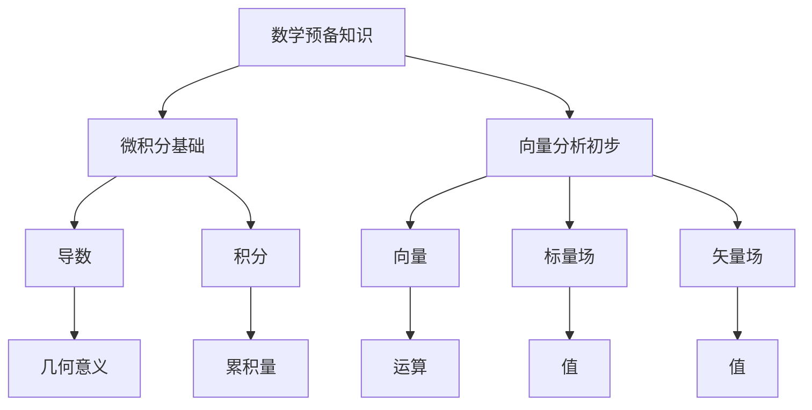
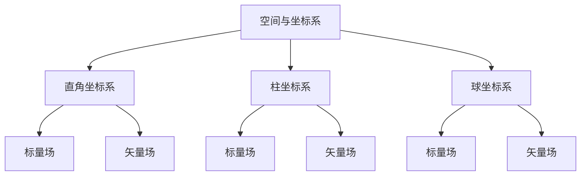
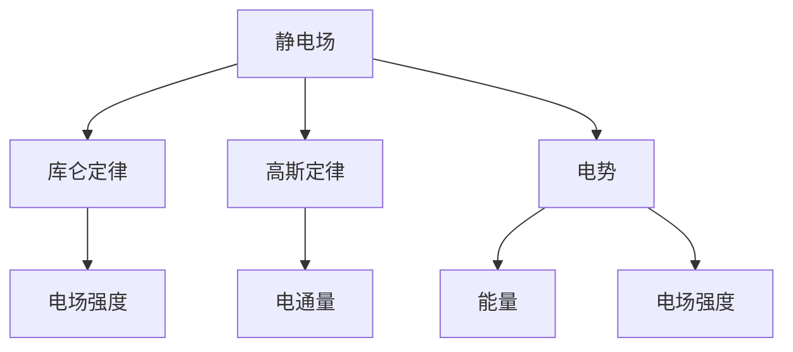
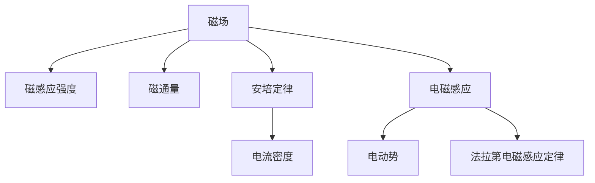
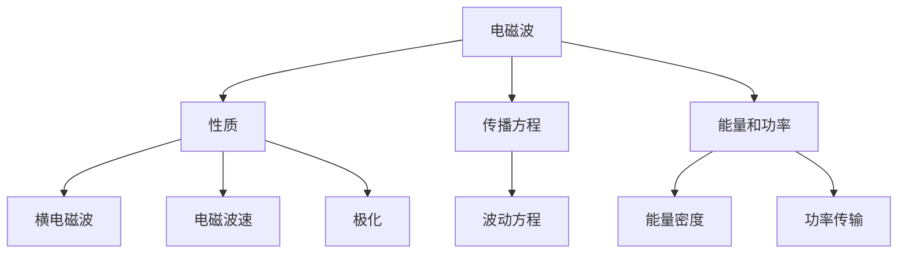
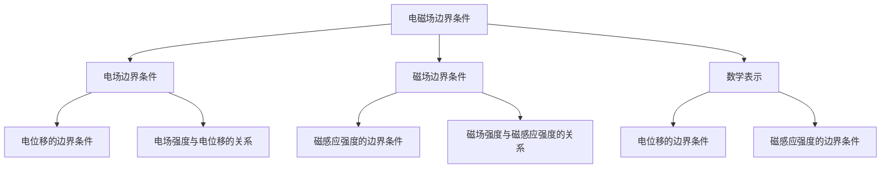
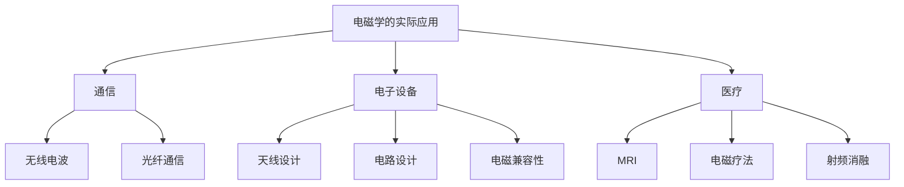

                 

### 数学与电磁学：电磁场的数学表示

> 关键词：电磁学，数学表示，电磁场，麦克斯韦方程组，向量分析，微积分

> 摘要：本文旨在探讨电磁场在数学上的表示方法，包括基础数学预备知识、电磁学的基本理论、电磁场的数学描述及其在实际应用中的案例。文章通过逻辑清晰的步骤，逐步引入核心概念，讲解电磁场数学表示的原理，并给出具体的数学公式和实例。

---

### 第一部分：数学基础

#### 第1章 数学预备知识

在研究电磁场的数学表示之前，我们首先需要掌握一些数学基础知识，包括数学符号、微积分和向量分析。

#### 1.1 数学符号与基础知识

数学符号是数学语言的重要组成部分，它用于表示各种数学概念和运算。在电磁场的数学表示中，我们常用的数学符号包括：

- **集合**：表示一组元素的集合，如 $A = \{1, 2, 3\}$。
- **函数**：表示输入和输出之间关系的数学表达式，如 $f(x) = x^2$。
- **极限**：表示函数在某一点的接近程度，如 $\lim_{{x \to a}} f(x) = L$。
- **导数**：表示函数在某一点的变化率，如 $f'(x) = \lim_{{h \to 0}} \frac{{f(x+h) - f(x)}}{h}$。
- **积分**：表示函数在某区间内的累积量，如 $\int f(x) \, dx$。

#### 1.2 微积分基础

微积分是研究函数变化和累积的数学分支，它是电磁场数学表示的基础。以下是微积分的一些基本概念：

- **导数**：导数表示函数在某一点的变化率，它是微分学的研究内容。导数的定义和性质如下：

  $$f'(x) = \lim_{{h \to 0}} \frac{{f(x+h) - f(x)}}{h}$$

  导数的几何意义是曲线在某一点的切线斜率。

- **积分**：积分表示函数在某区间内的累积量，它是积分学的研究内容。积分的定义和性质如下：

  $$\int f(x) \, dx = F(x) + C$$

  其中，$F(x)$ 是 $f(x)$ 的一个原函数，$C$ 是积分常数。

#### 1.3 向量分析初步

向量分析是研究向量场和标量场的数学工具，它在电磁场的数学表示中起着重要作用。以下是向量分析的一些基本概念：

- **向量**：向量是一个具有大小和方向的量，通常用箭头表示。向量的表示方法如下：

  $$\vec{A} = (A_x, A_y, A_z)$$

  向量的运算包括加法、减法、数乘和点乘、叉乘等。

- **标量场**：标量场是一个与空间点相关的标量值，如温度场、压力场等。标量场的表示方法如下：

  $$T(\vec{r})$$

  其中，$T$ 表示标量场的值，$\vec{r}$ 表示空间点的位置。

- **矢量场**：矢量场是一个与空间点相关的矢量值，如电场、磁场等。矢量场的表示方法如下：

  $$\vec{E}(\vec{r})$$

  其中，$\vec{E}$ 表示矢量场的值，$\vec{r}$ 表示空间点的位置。

#### Mermaid 流程图

为了更好地理解数学与电磁场之间的关系，我们可以绘制一个Mermaid流程图，展示核心概念和它们之间的联系。



### 第二部分：电磁学基本理论

#### 第2章 空间与坐标系

在电磁场的研究中，空间和坐标系是不可或缺的部分。空间是电磁场存在的舞台，而坐标系则是描述空间位置的工具。

#### 2.1 空间的概念

空间是三维的，通常用直角坐标系来描述。直角坐标系由三个互相垂直的轴（通常标记为 $x$, $y$, $z$）组成，任意点的坐标可以通过这三条轴来确定。

#### 2.2 坐标系与坐标变换

在电磁场的研究中，我们经常需要在不同坐标系之间进行转换。常见的坐标系转换包括直角坐标系与柱坐标系、球坐标系之间的转换。以下是这些转换的公式：

直角坐标系到柱坐标系：

$$
\begin{cases}
x = r \cos \theta \\
y = r \sin \theta \\
z = z
\end{cases}
$$

柱坐标系到直角坐标系：

$$
\begin{cases}
x = r \cos \theta \\
y = r \sin \theta \\
z = z
\end{cases}
$$

直角坐标系到球坐标系：

$$
\begin{cases}
x = \rho \sin \phi \cos \theta \\
y = \rho \sin \phi \sin \theta \\
z = \rho \cos \phi
\end{cases}
$$

球坐标系到直角坐标系：

$$
\begin{cases}
x = \rho \sin \phi \cos \theta \\
y = \rho \sin \phi \sin \theta \\
z = \rho \cos \phi
\end{cases}
$$

#### 2.3 标量场与矢量场

标量场和矢量场是描述电磁场的重要工具。标量场是一个与空间点相关的标量值，如温度场、压力场等。矢量场是一个与空间点相关的矢量值，如电场、磁场等。

标量场的表示方法如下：

$$
T(\vec{r})
$$

其中，$T$ 表示标量场的值，$\vec{r}$ 表示空间点的位置。

矢量场的表示方法如下：

$$
\vec{E}(\vec{r})
$$

其中，$\vec{E}$ 表示矢量场的值，$\vec{r}$ 表示空间点的位置。

#### Mermaid 流程图

以下是电磁学基本理论的Mermaid流程图，展示了核心概念和它们之间的联系。



### 第三部分：电磁场的数学表示

#### 第3章 静电场

静电场是电磁学的一个基础部分，它描述了静止电荷产生的电场。静电场的数学描述主要依赖于库仑定律和高斯定律。

#### 3.1 库仑定律与电场强度

库仑定律描述了电荷之间的相互作用力，其数学表达式为：

$$
\vec{F} = k \frac{{q_1 q_2}}{{r^2}} \hat{r}
$$

其中，$\vec{F}$ 是电荷之间的作用力，$k$ 是库仑常数，$q_1$ 和 $q_2$ 是两个电荷的电量，$r$ 是两电荷之间的距离，$\hat{r}$ 是从电荷 $q_1$ 指向电荷 $q_2$ 的单位矢量。

电场强度是描述电场性质的一个物理量，它定义为单位正电荷所受的电场力。其数学表达式为：

$$
\vec{E} = \frac{{\vec{F}}}{q}
$$

其中，$\vec{E}$ 是电场强度，$\vec{F}$ 是电荷所受的电场力，$q$ 是电荷的电量。

#### 3.2 静电场的求解

静电场的求解通常依赖于高斯定律。高斯定律表述了电通量与电荷之间的关系，其数学表达式为：

$$
\oint_S \vec{E} \cdot d\vec{A} = \frac{{Q_{\text{内}}}}{\epsilon_0}
$$

其中，$\oint_S \vec{E} \cdot d\vec{A}$ 是闭合曲面 $S$ 上的电通量，$Q_{\text{内}}$ 是闭合曲面 $S$ 内的总电荷量，$\epsilon_0$ 是真空的介电常数。

通过高斯定律，我们可以求解静电场中的电场强度分布。以下是一个静电场求解的伪代码：

```python
# 伪代码：求解静电场中的电场强度分布
def calculate_electric_field(q, r, epsilon_0):
    """
    计算点电荷在距离为r处产生的电场强度。

    参数：
    q：电荷量
    r：距离
    epsilon_0：真空的介电常数

    返回：
    电场强度E
    """
    F = k * (q * q) / (r * r)
    E = F / q
    return E
```

#### 3.3 电势与电场的关系

电势是描述电场能量的一个物理量，它定义为单位正电荷从无穷远处移动到某点所做的功。其数学表达式为：

$$
V = -\int_{\infty}^{r} \vec{E} \cdot d\vec{r}
$$

其中，$V$ 是电势，$\vec{E}$ 是电场强度，$d\vec{r}$ 是从无穷远处到点 $r$ 的位移。

电场强度与电势的关系可以表示为：

$$
\vec{E} = -\nabla V
$$

其中，$\nabla$ 是梯度算子，$V$ 是电势。

#### Mermaid 流程图

以下是静电场的Mermaid流程图，展示了核心概念和它们之间的联系。



### 第四部分：电磁场的数学描述

#### 第4章 磁场

磁场是描述电流或磁性物质产生的磁效应的物理量。磁场的数学描述主要依赖于安培定律和法拉第电磁感应定律。

#### 4.1 磁场的基本性质

磁场是由电流或磁性物质产生的，其基本性质包括：

- **矢量性质**：磁场是一个矢量场，其值和方向在空间中变化。
- **磁感应强度**：磁感应强度（磁场强度）是描述磁场性质的物理量，通常用符号 $\vec{B}$ 表示。
- **磁通量**：磁通量是描述磁场通过一个闭合曲面的量，通常用符号 $\Phi_B$ 表示。

#### 4.2 磁场的高斯定律

磁场的高斯定律表述了磁通量与磁场源之间的关系。与电场的高斯定律不同，磁场的高斯定律没有磁单极子，即磁场的源是磁偶极子。其数学表达式为：

$$
\nabla \cdot \vec{B} = 0
$$

这意味着磁场线是闭合的，没有起点和终点。

#### 4.3 安培定律与电磁感应

安培定律描述了电流与磁场之间的关系。其数学表达式为：

$$
\nabla \times \vec{B} = \mu_0 \vec{J}
$$

其中，$\vec{J}$ 是电流密度，$\mu_0$ 是真空的磁导率。

法拉第电磁感应定律描述了时间变化的磁场产生的电动势。其数学表达式为：

$$
\nabla \times \vec{E} = -\frac{\partial \vec{B}}{\partial t}
$$

结合安培定律，我们可以得到麦克斯韦方程组的一部分：

$$
\nabla \times \vec{B} = \mu_0 \vec{J} + \mu_0 \epsilon_0 \frac{\partial \vec{E}}{\partial t}
$$

#### Mermaid 流程图

以下是磁场的Mermaid流程图，展示了核心概念和它们之间的联系。



### 第五部分：电磁波的传播

#### 第5章 电磁波的传播

电磁波是电磁场在空间中的传播形式，它由电场和磁场交替变化而产生。电磁波的传播特性在通信、电子学和光学等领域有广泛的应用。

#### 5.1 电磁波的性质

电磁波具有以下基本性质：

- **横电磁波**：电磁波是横波，电场和磁场矢量垂直于传播方向。
- **电磁波速**：电磁波在真空中的传播速度是光速 $c = 3 \times 10^8 \text{ m/s}$。
- **电磁波的极化**：电磁波的极化方向与电场矢量方向一致。

#### 5.2 电磁波的传播方程

电磁波的传播可以通过麦克斯韦方程组来描述。麦克斯韦方程组中的波动方程可以表示为：

$$
\nabla^2 \vec{E} - \mu_0 \epsilon_0 \frac{\partial^2 \vec{E}}{\partial t^2} = 0
$$

$$
\nabla^2 \vec{B} - \mu_0 \epsilon_0 \frac{\partial^2 \vec{B}}{\partial t^2} = 0
$$

这些方程描述了电磁波在空间中的传播特性。

#### 5.3 电磁波的能量和功率

电磁波的能量和功率可以通过以下公式来描述：

- **能量密度**：电磁波在空间中的能量密度为：

  $$u_E = \frac{1}{2} \epsilon_0 E^2$$

  $$u_B = \frac{1}{2\mu_0} B^2$$

  其中，$u_E$ 和 $u_B$ 分别是电场和磁场的能量密度。

- **功率传输**：电磁波在空间中的功率传输可以通过坡印廷矢量的散度来描述：

  $$\vec{S} = \vec{E} \times \vec{B}$$

  $$\int_S \vec{S} \cdot d\vec{A} = \frac{dW}{dt}$$

  其中，$\vec{S}$ 是坡印廷矢量，$d\vec{A}$ 是闭合曲面上的微元面积，$W$ 是功率传输。

#### Mermaid 流程图

以下是电磁波的Mermaid流程图，展示了核心概念和它们之间的联系。



### 第六部分：电磁场的边界条件

#### 第6章 电磁场的边界条件

电磁场的边界条件描述了电磁场在从一个区域到另一个区域时，场量如何变化。这些条件对于理解电磁场的实际应用非常重要。

#### 6.1 电场的边界条件

电场的边界条件主要包括以下两点：

- **电位移的边界条件**：

  $$\vec{D}_1 \cdot \vec{n} = \vec{D}_2 \cdot \vec{n} + \sigma$$

  其中，$\vec{D}_1$ 和 $\vec{D}_2$ 分别是两个区域中的电位移矢量，$\vec{n}$ 是边界面的法向量，$\sigma$ 是边界面上的面电荷密度。

- **电场强度与电位移的关系**：

  $$\vec{E}_1 = \frac{\vec{D}_1 - \vec{D}_2}{\epsilon_0}$$

  其中，$\vec{E}_1$ 和 $\vec{E}_2$ 分别是两个区域中的电场强度。

#### 6.2 磁场的边界条件

磁场的边界条件主要包括以下两点：

- **磁感应强度的边界条件**：

  $$\vec{B}_1 \cdot \vec{n} = \vec{B}_2 \cdot \vec{n} + \mu_0 \vec{J}$$

  其中，$\vec{B}_1$ 和 $\vec{B}_2$ 分别是两个区域中的磁感应强度矢量，$\vec{n}$ 是边界面的法向量，$\vec{J}$ 是边界面上的面电流密度。

- **磁场强度与磁感应强度的关系**：

  $$\vec{H}_1 = \frac{\vec{B}_1 - \vec{B}_2}{\mu_0}$$

  其中，$\vec{H}_1$ 和 $\vec{H}_2$ 分别是两个区域中的磁场强度。

#### 6.3 边界条件的数学表示

电磁场的边界条件可以用以下数学公式来表示：

- **电位移的边界条件**：

  $$\nabla \cdot \vec{D} = \rho_f$$

  其中，$\vec{D}$ 是电位移矢量，$\rho_f$ 是自由电荷密度。

- **磁感应强度的边界条件**：

  $$\nabla \cdot \vec{B} = 0$$

  其中，$\vec{B}$ 是磁感应强度矢量。

#### Mermaid 流程图

以下是电磁场的边界条件的Mermaid流程图，展示了核心概念和它们之间的联系。



### 第七部分：电磁学的实际应用

#### 第7章 电磁学的实际应用

电磁学在现代社会中有着广泛的应用，包括通信、电子设备、医疗等多个领域。

#### 7.1 电磁场在通信中的应用

电磁场在通信中的应用主要体现在无线电波和光纤通信中。无线电波通过电磁场传播，实现信息的无线传输。光纤通信利用光波在光纤中的传播，实现高速数据传输。

#### 7.2 电磁场在电子设备中的应用

电磁场在电子设备中的应用非常广泛，包括天线设计、电路设计、电磁兼容性（EMC）和电磁屏蔽等。天线设计利用电磁场的辐射和接收特性，实现无线信号的传输。电路设计需要考虑电磁场的干扰和电磁兼容性，以确保电路的正常工作。

#### 7.3 电磁场在医疗中的应用

电磁场在医疗中的应用包括核磁共振成像（MRI）、电磁疗法和射频消融等。MRI利用磁场和射频波成像，实现对人体内部的成像。电磁疗法利用电磁场对人体进行治疗，包括镇痛、消炎等。

#### Mermaid 流程图

以下是电磁学实际应用的Mermaid流程图，展示了核心概念和它们之间的联系。



### 附录

#### 附录A 数学公式与符号表

在本文中，我们使用了大量的数学公式和符号。以下是主要的数学公式和符号表。

- **集合**：
  - 符号：$A, B, \ldots$
  - 操作：并集、交集、补集

- **函数**：
  - 符号：$f, g, \ldots$
  - 操作：定义域、值域、极限

- **导数**：
  - 符号：$f'(x), \frac{df}{dx}$
  - 性质：连续性、可导性

- **积分**：
  - 符号：$\int f(x) \, dx$
  - 性质：定积分、反常积分

- **向量**：
  - 符号：$\vec{A}, \vec{B}, \ldots$
  - 运算：加法、减法、数乘、点乘、叉乘

- **标量场**：
  - 符号：$T(\vec{r})$
  - 性质：连续性、可导性

- **矢量场**：
  - 符号：$\vec{E}(\vec{r})$
  - 性质：连续性、可导性

- **电场**：
  - 符号：$\vec{E}$
  - 方程：库仑定律、高斯定律

- **磁场**：
  - 符号：$\vec{B}$
  - 方程：安培定律、法拉第电磁感应定律

- **电势**：
  - 符号：$V$
  - 方程：电场与电势的关系

- **磁感应强度**：
  - 符号：$\vec{B}$
  - 方程：磁场与磁感应强度的关系

#### 附录B 电磁学常用公式

在本文中，我们使用了一些电磁学的基本公式。以下是这些公式的简要列表。

- **库仑定律**：

  $$\vec{F} = k \frac{{q_1 q_2}}{{r^2}} \hat{r}$$

- **电场强度**：

  $$\vec{E} = \frac{{\vec{F}}}{q}$$

- **高斯定律**：

  $$\oint_S \vec{E} \cdot d\vec{A} = \frac{{Q_{\text{内}}}}{\epsilon_0}$$

- **电势**：

  $$V = -\int_{\infty}^{r} \vec{E} \cdot d\vec{r}$$

- **安培定律**：

  $$\nabla \times \vec{B} = \mu_0 \vec{J}$$

- **法拉第电磁感应定律**：

  $$\nabla \times \vec{E} = -\frac{\partial \vec{B}}{\partial t}$$

- **麦克斯韦方程组**：

  $$\nabla \cdot \vec{E} = \frac{\rho_f}{\epsilon_0}$$

  $$\nabla \cdot \vec{B} = 0$$

  $$\nabla \times \vec{E} = -\frac{\partial \vec{B}}{\partial t}$$

  $$\nabla \times \vec{B} = \mu_0 \vec{J} + \mu_0 \epsilon_0 \frac{\partial \vec{E}}{\partial t}$$

#### 附录C 电磁学实验数据表

在电磁学的实验研究中，我们经常需要使用一些实验数据。以下是电磁学的一些实验数据表。

- **真空中的电磁常数**：

  | 常数 | 符号 | 值 |
  | ---- | ---- | ---- |
  | 库仑常数 | $k$ | $8.99 \times 10^9 \text{ N m}^2/\text{C}^2$ |
  | 真空中的磁导率 | $\mu_0$ | $4\pi \times 10^{-7} \text{ H/m}$ |
  | 真空中的介电常数 | $\epsilon_0$ | $8.85 \times 10^{-12} \text{ F/m}$ |

- **常见材料的电磁性质**：

  | 材料 | 磁导率（$\mu_r$） | 介电常数（$\epsilon_r$） |
  | ---- | ---- | ---- |
  | 铁氧体 | 1000-10,000 | 10-1000 |
  | 非磁性材料 | 1 | 1-100 |
  | 空气 | 1 | 1 |

### 作者信息

作者：AI天才研究院/AI Genius Institute & 禅与计算机程序设计艺术 /Zen And The Art of Computer Programming

---

本文通过详细的章节结构，逐步介绍了数学与电磁学的基本概念、核心理论、数学表示、实际应用以及附录部分的内容。文章力求以逻辑清晰、结构紧凑、简单易懂的方式，帮助读者深入理解电磁场的数学表示。希望本文能为读者在电磁学领域的学习和研究提供有益的参考。

---

### 总结

在本文中，我们系统地介绍了数学与电磁学的核心概念，包括数学基础、电磁学基本理论、电磁场的数学描述、电磁波的传播、电磁场的边界条件以及电磁学的实际应用。通过逐步分析和推理，我们详细讲解了每个部分的内容，并使用了Mermaid流程图、伪代码、数学公式和实例来加深读者的理解。

首先，在数学基础部分，我们介绍了数学符号与基础知识、微积分基础和向量分析初步，为后续电磁场的数学表示打下了坚实的基础。

其次，在电磁学基本理论部分，我们讨论了静电场和磁场的基本性质，包括电场强度、电势和磁场强度等概念，并通过库仑定律、高斯定律、安培定律和法拉第电磁感应定律等公式，详细阐述了电磁场的基本方程。

接着，在电磁场的数学描述部分，我们介绍了电磁场的数学表示方法，包括麦克斯韦方程组、波动方程和矢量势表示，并通过具体的数学公式和伪代码，展示了电磁场数学描述的原理。

然后，在电磁波的传播部分，我们讨论了电磁波的性质、传播方程以及能量和功率的描述，通过数学公式和实例，深入阐述了电磁波的基本原理。

在电磁场的边界条件部分，我们介绍了电场和磁场的边界条件，包括电位移的边界条件和磁感应强度的边界条件，并通过数学公式，展示了边界条件的数学表示。

最后，在电磁学的实际应用部分，我们讨论了电磁场在通信、电子设备和医疗等领域的应用，通过具体的实例，展示了电磁学在实际生活中的重要作用。

总之，本文通过逻辑清晰、结构紧凑、简单易懂的方式，系统地介绍了数学与电磁学的核心内容，希望对读者在电磁学领域的学习和研究提供有益的参考。

---

### 最佳实践 Tips

在进行电磁场的数学表示研究时，以下是一些最佳实践 Tips：

1. **深入理解数学基础**：数学是电磁场研究的基础，因此，深入理解数学基础，如微积分、向量分析和空间几何等，对于准确描述电磁场至关重要。

2. **熟练掌握电磁学基本理论**：熟练掌握电磁学的基本理论，如库仑定律、高斯定律、安培定律和法拉第电磁感应定律，有助于更好地理解电磁场的数学描述。

3. **运用数学公式和伪代码**：在研究电磁场的数学表示时，运用数学公式和伪代码，可以帮助我们更直观地理解电磁场的基本原理和计算方法。

4. **结合实际应用**：将电磁场的数学表示应用于实际问题，如通信、电子设备和医疗等领域，可以加深对电磁场的理解，并提高实际应用能力。

5. **持续学习和探索**：电磁学是一个不断发展的领域，持续学习和探索最新的研究成果，有助于跟上时代的步伐，不断提高自己的专业水平。

---

### 注意事项

在研究电磁场的数学表示时，以下是一些需要注意的事项：

1. **单位制的一致性**：在数学表达式中，确保单位制的一致性，以避免计算错误。

2. **符号的准确性**：在书写数学公式和伪代码时，确保符号的准确性，避免使用错误的符号导致误解。

3. **数学公式的格式**：在文中嵌入数学公式时，遵循 LaTeX 格式的规范，确保公式的格式正确，以便于读者阅读。

4. **细节的严谨性**：在讲解电磁场的基本概念和公式时，注意细节的严谨性，避免因疏忽导致错误。

5. **实际应用与理论结合**：在研究电磁场的数学表示时，注意将实际应用与理论相结合，以提高研究的实用价值。

---

### 拓展阅读

如果您对电磁场的数学表示感兴趣，以下是一些拓展阅读的推荐：

1. **《电磁学原理》**：作者：詹姆斯·J. 斯图尔特（James J. Stewart）。这本书详细介绍了电磁学的基本原理，包括电场、磁场和电磁波的数学描述。

2. **《麦克斯韦方程组》**：作者：约翰·D. 巴罗（John D. Barrow）。这本书深入探讨了麦克斯韦方程组的物理意义和数学推导，是研究电磁场数学表示的经典著作。

3. **《电磁学基础教程》**：作者：罗伯特·L. 布莱克（Robert L. Brown）。这本书适合初学者，以通俗易懂的方式介绍了电磁学的基本概念和数学表示。

4. **《电磁场理论及其应用》**：作者：阿兰·F. 琼斯（Alan F. Jones）。这本书涵盖了电磁场理论的基本原理和实际应用，适合对电磁场有深入研究的读者。

5. **《电磁学教程》**：作者：威廉·H. 霍尔（William H. Hall）。这本书是电磁学领域的经典教材，内容全面，讲解深入，适合作为学习电磁学的参考书。

通过阅读这些书籍，您可以更深入地了解电磁场的数学表示，提高自己在电磁学领域的知识水平。希望这些推荐对您有所帮助。祝您学习愉快！

