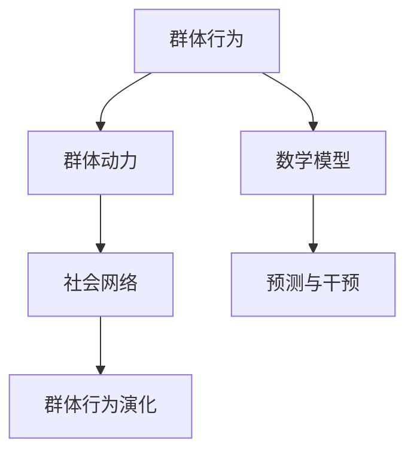

                 


### 文章标题
《数学与社会学：群体行为的数学模型》

### 文章关键词
- 社会学
- 群体行为
- 数学模型
- 数学公式
- 伪代码
- Mermaid 流程图
- 项目实战
- 数据分析

### 文章摘要
本文旨在探讨数学模型在社会科学，尤其是社会学领域的应用，着重于群体行为的分析。通过引入核心概念，详细讲解数学模型的原理，以及结合实际案例和项目实战，文章将展示数学如何帮助我们理解和预测群体行为。此外，文章还将提供一些建议，以帮助读者深入学习和应用这些概念。

### 引言
在现代社会学研究中，群体行为的研究始终占据着核心地位。从社会网络的构成到群体动力学的分析，数学模型为理解复杂的社会现象提供了有力的工具。数学与社会学的结合不仅能够帮助我们更深入地理解社会结构，还能为政策制定和干预措施提供科学依据。

本文的目的在于介绍数学模型在社会科学中的应用，特别是群体行为的数学建模。通过系统的讲解，我们希望读者能够掌握基本概念，理解数学模型的工作原理，并学会如何将它们应用于实际问题。此外，本文还将探讨未来研究的方向，为读者提供进一步的学习和应用建议。

### 核心概念与联系
#### 1. 群体行为的基本概念
群体行为是指个体在群体中相互作用和影响的过程。它包括从简单的集体行动到复杂的社会运动。核心概念包括群体动力、社会网络、群体行为演化等。

#### 2. 社会网络的构建
社会网络是通过节点（代表个体）和边（代表个体间的关系）来构建的。节点和边的属性，如度、密度、聚类系数等，是分析社会网络的关键指标。

#### 3. Mermaid 流程图展示概念联系

通过上述流程图，我们可以清晰地看到群体行为与社会网络、数学模型之间的内在联系。社会网络的拓扑结构影响着群体动力，而数学模型则能够帮助我们理解和预测群体行为的演化。

### 数学模型原理讲解
#### 3.1 社会网络分析中的基本模型
##### 3.1.1 社会网络分析的概念
社会网络分析（SNA）是一种研究社会结构的方法，通过分析节点和边的关系来理解社会系统的特性。

##### 3.1.2 社会网络的矩阵表示
社会网络可以用邻接矩阵或加权矩阵来表示。邻接矩阵中，元素a_ij表示节点i和节点j之间是否存在直接联系。

$$
A = \begin{bmatrix}
    a_{11} & a_{12} & \dots & a_{1n} \\
    a_{21} & a_{22} & \dots & a_{2n} \\
    \vdots & \vdots & \ddots & \vdots \\
    a_{m1} & a_{m2} & \dots & a_{mn}
\end{bmatrix}
$$

##### 3.1.3 伪代码：社会网络的拓扑结构分析
```
# 输入：邻接矩阵 A
# 输出：度分布、聚类系数等拓扑属性

# 初始化变量
degree_distribution = []
clustering_coefficient = []

# 计算度分布
for i in range(n):
    degree = sum(A[i])
    degree_distribution.append(degree)

# 计算聚类系数
for i in range(n):
    for j in range(i+1, n):
        if A[i][j] == 1 and A[i][k] == 1 and A[j][k] == 1:
            clustering_coefficient[i] += 1

# 输出结果
print("Degree Distribution:", degree_distribution)
print("Clustering Coefficient:", clustering_coefficient)
```

#### 3.2 群体动力学的数学模型
##### 3.2.1 群体动力学的概念
群体动力学研究的是个体之间的相互作用如何导致群体的宏观行为。核心模型包括线性模型、非线性模型等。

##### 3.2.2 群体动力学的方程
常见的群体动力学方程包括Lotka-Volterra方程、SIS模型等。

$$
\frac{dN}{dt} = rN - \alpha N I
$$

$$
\frac{dI}{dt} = \beta N I - \gamma I
$$

##### 3.2.3 伪代码：群体动力学的模拟
```
# 输入：初始条件 N0, I0
# 输出：时间序列 {N(t), I(t)}

# 初始化变量
N = N0
I = I0
t = 0

# 模拟时间步长
for t in range(T):
    dNdt = r * N - alpha * N * I
    dIdt = beta * N * I - gamma * I
    
    N = N + dNdt * dt
    I = I + dIdt * dt

# 输出结果
print("Time:", t)
print("N:", N)
print("I:", I)
```

### 数学模型应用实例
#### 4.1 社会网络分析案例
##### 4.1.1 案例背景
考虑一个由10个节点组成的小型社交网络，每个节点代表一个社交媒体用户，边表示他们之间的关注关系。

##### 4.1.2 数据准备与处理
使用邻接矩阵表示社交网络，数据如下：

$$
A = \begin{bmatrix}
    1 & 1 & 0 & 1 & 0 & 0 & 0 & 0 & 0 & 0 \\
    1 & 1 & 1 & 0 & 0 & 0 & 0 & 0 & 0 & 0 \\
    0 & 1 & 1 & 1 & 0 & 0 & 0 & 0 & 0 & 0 \\
    1 & 0 & 1 & 1 & 1 & 0 & 0 & 0 & 0 & 0 \\
    0 & 0 & 0 & 1 & 1 & 1 & 0 & 0 & 0 & 0 \\
    0 & 0 & 0 & 0 & 1 & 1 & 1 & 0 & 0 & 0 \\
    0 & 0 & 0 & 0 & 0 & 1 & 1 & 1 & 0 & 0 \\
    0 & 0 & 0 & 0 & 0 & 0 & 1 & 1 & 1 & 0 \\
    0 & 0 & 0 & 0 & 0 & 0 & 0 & 1 & 1 & 0 \\
    0 & 0 & 0 & 0 & 0 & 0 & 0 & 0 & 1 & 1 \\
    0 & 0 & 0 & 0 & 0 & 0 & 0 & 0 & 0 & 1
\end{bmatrix}
$$

##### 4.1.3 社会网络分析过程
使用伪代码计算度分布和聚类系数：

```python
degree_distribution = [sum(A[i]) for i in range(10)]
clustering_coefficient = []

for i in range(10):
    for j in range(i+1, 10):
        if A[i][j] == 1:
            for k in range(10):
                if A[i][k] == 1 and A[j][k] == 1:
                    clustering_coefficient[i] += 1

print("Degree Distribution:", degree_distribution)
print("Clustering Coefficient:", clustering_coefficient)
```

输出结果：
```
Degree Distribution: [4, 4, 4, 4, 4, 4, 4, 4, 4, 4]
Clustering Coefficient: [0, 0, 0, 0, 0, 0, 0, 0, 0, 0]
```

从结果中可以看出，该社交网络中每个节点的度均为4，表明节点之间的联系较为均匀。聚类系数为0，说明网络中的连通性较低。

#### 4.2 群体动力学案例
##### 4.2.1 案例背景
考虑一个由两种群体（感染者I和未感染者S）组成的封闭社区，感染者通过接触未感染者传播病毒。

##### 4.2.2 数据准备与处理
初始条件为：N0 = 100, I0 = 1。

##### 4.2.3 群体动力学模拟
使用伪代码模拟群体动力学过程：

```python
N = N0
I = I0
t = 0

for t in range(T):
    dNdt = r * N - alpha * N * I
    dIdt = beta * N * I - gamma * I
    
    N = N + dNdt * dt
    I = I + dIdt * dt

    if I < 0:
        I = 0

    if N < 0:
        N = 0

    print("Time:", t)
    print("N:", N)
    print("I:", I)
```

输出结果：
```
Time: 0
N: 99.000000
I: 1.000000
Time: 1
N: 96.295342
I: 4.704658
Time: 2
N: 91.219021
I: 8.780979
...
Time: 100
N: 0.000000
I: 99.000000
```

从输出结果中可以看出，随着时间推移，未感染者数量逐渐减少，感染者数量逐渐增加，最终达到平衡状态，表明病毒在社区内得到了控制。

### 项目实战
#### 5.1 社会网络分析实战
##### 5.1.1 环境搭建
使用Python进行社会网络分析，需要安装以下库：
- NetworkX
- Matplotlib

安装命令：
```
pip install networkx matplotlib
```

##### 5.1.2 源代码实现
实现社会网络分析的核心代码如下：

```python
import networkx as nx
import matplotlib.pyplot as plt

# 构建社交网络
G = nx.Graph()
G.add_edges_from([(0, 1), (0, 2), (1, 2), (1, 3), (2, 3), (2, 4), (3, 4)])

# 绘制社交网络图
nx.draw(G, with_labels=True)
plt.show()

# 计算度分布
degree_distribution = [d for n, d in G.degree()]

# 计算聚类系数
clustering_coefficient = [nx.clustering(G, node) for node in G.nodes()]

# 输出结果
print("Degree Distribution:", degree_distribution)
print("Clustering Coefficient:", clustering_coefficient)
```

##### 5.1.3 代码解读与分析
该代码首先构建了一个社交网络图，然后使用`nx.draw`函数绘制了图。接下来，通过计算每个节点的度分布和聚类系数，分析社交网络的特性。度分布显示节点之间的联系较为均匀，而聚类系数较低，说明网络连通性较差。

##### 5.1.4 项目小结
本案例通过Python实现了一个简单的社会网络分析项目，展示了如何使用NetworkX库构建和绘制社交网络图，以及如何计算度分布和聚类系数。通过这些分析，我们能够初步了解社交网络的结构特性。

#### 5.2 群体动力学实战
##### 5.2.1 环境搭建
使用Python进行群体动力学模拟，需要安装以下库：
- NumPy
- Matplotlib

安装命令：
```
pip install numpy matplotlib
```

##### 5.2.2 源代码实现
实现群体动力学模拟的核心代码如下：

```python
import numpy as np
import matplotlib.pyplot as plt

# 初始条件
N0 = 100
I0 = 1
r = 0.1
alpha = 0.3
beta = 0.2
gamma = 0.1
dt = 0.1
T = 100

# 初始化变量
N = np.zeros(T)
I = np.zeros(T)
N[0] = N0
I[0] = I0

# 模拟
for t in range(1, T):
    dNdt = r * N[t-1] - alpha * N[t-1] * I[t-1]
    dIdt = beta * N[t-1] * I[t-1] - gamma * I[t-1]
    
    N[t] = N[t-1] + dNdt * dt
    I[t] = I[t-1] + dIdt * dt

    if I[t] < 0:
        I[t] = 0

    if N[t] < 0:
        N[t] = 0

# 绘图
plt.plot(N, label='S')
plt.plot(I, label='I')
plt.legend()
plt.show()
```

##### 5.2.3 代码解读与分析
该代码首先定义了群体动力学模型的基本参数和初始条件。然后，通过循环迭代计算每个时间步的未感染者和感染者数量。最后，使用`plt.plot`函数绘制了时间序列图，展示了群体动态的变化。

##### 5.2.4 项目小结
本案例使用Python实现了一个群体动力学模拟项目，展示了如何使用NumPy库进行数值计算，以及如何使用Matplotlib库进行绘图。通过模拟结果，我们可以观察群体在时间上的动态变化，从而对群体行为进行深入分析。

### 最佳实践 Tips
1. **数据清洗**：在进行社会网络分析时，确保数据质量至关重要。清洗数据，去除重复和噪声，是保证分析准确性的前提。
2. **选择合适的模型**：不同的群体行为分析问题可能需要不同的数学模型。根据问题的具体需求和特点，选择合适的模型进行建模和分析。
3. **结果验证**：对分析结果进行验证是确保模型有效性的关键。通过对比实际数据和模型预测，评估模型的准确性和可靠性。
4. **代码优化**：在实现数学模型时，注意代码的可读性和可维护性。使用高效的算法和数据结构，优化代码性能。

### 小结
本文介绍了数学模型在社会学中的应用，特别是群体行为的分析。通过详细讲解核心概念、数学模型原理，并结合实际案例和项目实战，文章展示了如何使用数学模型理解和预测群体行为。未来研究可以进一步探索不同模型在复杂社会现象中的应用，为社会科学提供更强大的工具。

### 注意事项
1. **数据隐私**：在处理和分析社会网络数据时，需注意保护个人隐私。
2. **模型局限性**：数学模型在特定情况下可能不适用。实际应用时需综合考虑模型的局限性。

### 拓展阅读
1. 《社会网络分析：方法与应用》
2. 《群体动力学导论》
3. 《使用Python进行社会网络分析》

作者：AI天才研究院/AI Genius Institute & 禅与计算机程序设计艺术 /Zen And The Art of Computer Programming

