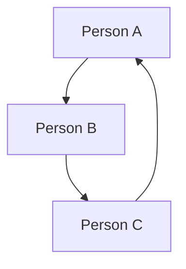
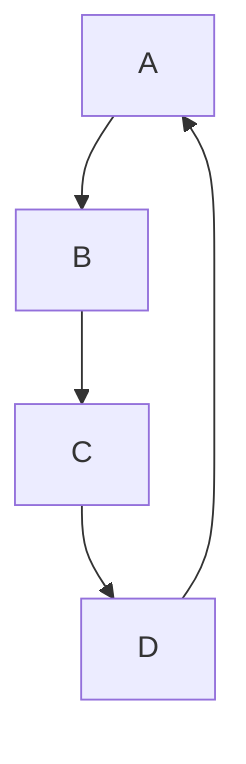
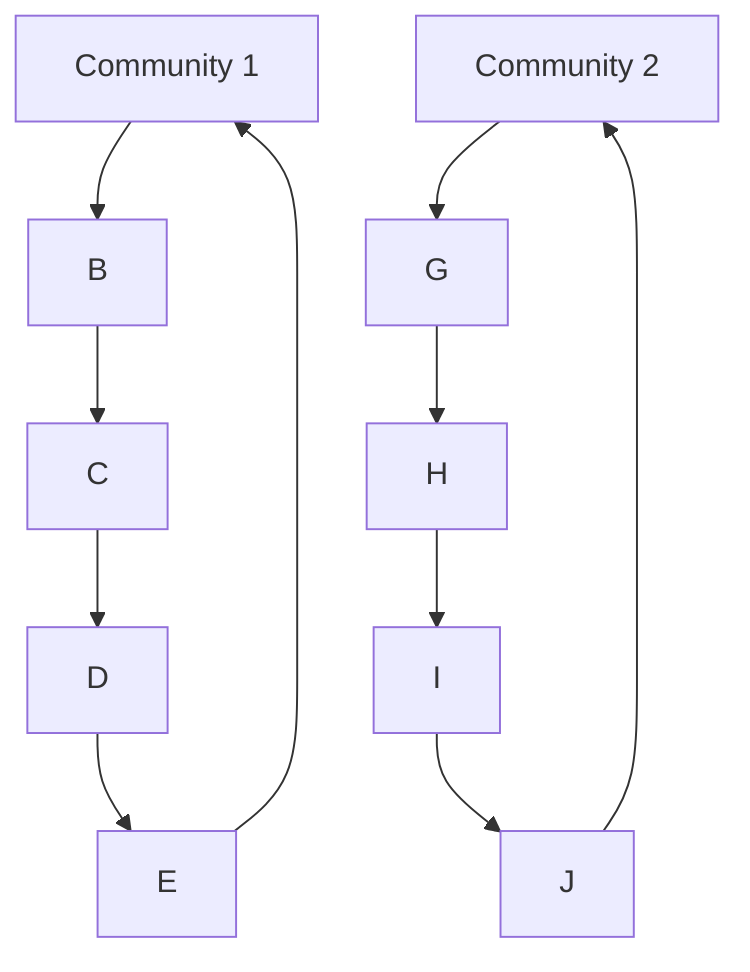

                 

### 完整的Markdown格式文章

# 数学与社会网络：人际关系网络的数学分析

## 关键词
数学建模、社会网络分析、图论、人际关系、节点、边、度分布、聚类系数、可视化、应用案例

## 摘要
本文将深入探讨数学与社会网络之间的关系，特别是人际关系网络的数学分析。通过引入图论、概率论、线性代数等数学工具，我们将分析社会网络的基本概念、数学表示、统计特性、核心节点识别、动态演化、可视化方法以及实际应用案例。本文旨在为读者提供一个全面而深入的理解，以及为社会网络研究的未来方向提供启示。

## 引言

### 1.1 书籍背景与目的

社会网络分析（Social Network Analysis, SNA）作为一门跨学科的研究领域，近年来在社会科学、商业管理、公共卫生等领域得到了广泛应用。随着互联网和社交媒体的普及，人际关系网络的规模和复杂性不断增加，对社会网络的分析需求也日益增长。数学与社会网络之间的结合，为理解和解释社会现象提供了强大的工具。

本文的目的是介绍社会网络分析中的数学方法，帮助读者理解如何运用数学工具来分析和解释人际关系网络。本文将涵盖从基本概念到高级应用的各个方面，包括数学模型的构建、统计特性的分析、核心节点的识别、网络的动态演化以及实际应用案例。

### 1.2 社会网络的基本概念

社会网络是由一组节点和连接这些节点的边组成的一种抽象结构。在数学中，这种结构通常被表示为图（Graph）。节点代表个体或组织，边代表个体之间的联系或互动。

- **节点（Node）**：在社会网络中，节点通常表示个体或组织。节点可以是人、公司、组织、城市等。
- **边（Edge）**：边表示节点之间的连接。边的类型可以多样，如友谊、合作关系、信息流动等。
- **度（Degree）**：一个节点的度是指连接到该节点的边的数量。度分为入度和出度，分别表示其他节点指向该节点的边和该节点指向其他节点的边。
- **路径（Path）**：路径是指从一个节点到另一个节点的边的序列。

图论作为研究图的结构和性质的一个数学分支，为社会网络分析提供了基础理论。图论中的许多概念，如连通性、连通度、图同构等，都可以用来描述和分析社会网络的性质。

### 1.3 数学与社会网络的关系

数学工具在社会网络分析中发挥着至关重要的作用。以下是一些主要的数学工具和它们在社会网络分析中的应用：

- **概率论**：概率论用于分析节点之间的随机互动，如边的存在概率、节点的连接概率等。
- **线性代数**：线性代数用于分析网络的矩阵表示，如邻接矩阵、拉普拉斯矩阵等，这些矩阵可以揭示网络的许多重要特性。
- **图论**：图论用于分析图的结构和性质，如节点的度分布、聚类系数、路径长度等。
- **统计学**：统计学用于分析网络的数据，如使用统计模型来预测网络中的互动模式。

## 第2章 社会网络的数学表示

### 2.1 网络图的基本概念

网络图是由节点和边组成的图形表示。在数学中，图通常用G=(V, E)表示，其中V是节点集合，E是边集合。节点和边可以通过图中的点（或圆圈）和线表示。

#### 节点和边的表示

- **节点的表示**：节点可以用字母表示，如A、B、C等。
- **边的表示**：边可以用节点的字母组合表示，如AB表示节点A和节点B之间的边。

#### 图的分类

- **无向图（Undirected Graph）**：如果图中的边没有方向，则称为无向图。
- **有向图（Directed Graph）**：如果图中的边有方向，则称为有向图。

#### 图的基本操作

- **图的遍历**：遍历图是指访问图中的所有节点。常见的遍历算法有深度优先搜索（DFS）和广度优先搜索（BFS）。
- **度的计算**：度是指一个节点连接的其他节点的数量。对于一个无向图，度可以用度数表示；对于一个有向图，度分为入度和出度。

#### 示例


在这个例子中，节点A连接到节点B和C，节点B连接到节点A和C。这是一个无向图，每个节点的度都是2。

### 2.2 网络图的数学模型

网络图的数学模型通常使用邻接矩阵、度序列、度分布等来表示。

#### 邻接矩阵

邻接矩阵是一个二维数组，用于表示图中节点之间的连接关系。如果节点i和节点j之间有边，则邻接矩阵中的第i行第j列元素为1，否则为0。

```python
# Python代码示例
adj_matrix = [
    [0, 1, 0],
    [1, 0, 1],
    [0, 1, 0]
]
```

在这个例子中，节点0连接到节点1和2，节点1连接到节点0和2，节点2连接到节点0和1。

#### 度序列

度序列是一个列表，用于表示图中每个节点的度。对于无向图，度序列可以直接从邻接矩阵得到。

```python
# Python代码示例
degrees = [2, 2, 2]
```

在这个例子中，每个节点的度都是2。

#### 度分布

度分布是描述图中节点度数的分布情况。它可以用来描述网络的结构特性。

```python
# Python代码示例
degree_distribution = {2: 3}
```

在这个例子中，有3个节点的度是2。

### 2.3 社会网络的矩阵表示

社会网络的矩阵表示主要包括邻接矩阵、拉普拉斯矩阵等。

#### 邻接矩阵

邻接矩阵用于表示图中节点之间的直接连接关系。

```latex
$$
A = \begin{bmatrix}
0 & 1 & 1 \\
1 & 0 & 0 \\
1 & 0 & 0
\end{bmatrix}
$$
```

在这个例子中，节点0连接到节点1和2，节点1连接到节点0，节点2连接到节点0。

#### 拉普拉斯矩阵

拉普拉斯矩阵是一个对称矩阵，用于表示图中节点的度分布和连通性。

```latex
$$
L = D - A
$$

$$
D = \begin{bmatrix}
3 & 0 & 0 \\
0 & 2 & 0 \\
0 & 0 & 2
\end{bmatrix}
$$

$$
A = \begin{bmatrix}
0 & 1 & 1 \\
1 & 0 & 0 \\
1 & 0 & 0
\end{bmatrix}
$$

$$
L = D - A = \begin{bmatrix}
3 & -1 & -1 \\
-1 & 2 & 0 \\
-1 & 0 & 2
\end{bmatrix}
$$
```

在这个例子中，拉普拉斯矩阵L揭示了节点0和1之间的连通性，以及节点0和2之间的连通性。

## 第3章 社会网络的统计特性

### 3.1 网络的度分布

网络的度分布描述了节点度的概率分布。度分布可以用来分析网络的结构特性。

#### 度分布模型

常见的度分布模型包括泊松分布、幂律分布等。

- **泊松分布**：假设边的存在是独立的，且边的存在概率为常数。

  ```latex
  P(k) = \frac{\lambda^k e^{-\lambda}}{k!}
  ```

- **幂律分布**：描述了网络中存在大量节点度数较小的节点和少量节点度数较大的节点。

  ```latex
  P(k) \propto k^{-\alpha}
  ```

#### 度分布的应用

度分布可以用来分析网络的生长过程、稳定性等特性。

### 3.2 网络的平均路径长度

网络的平均路径长度是指从任意两个节点之间的平均路径长度。

#### 平均路径长度计算

平均路径长度可以用以下公式计算：

```latex
L = \frac{1}{N(N-1)} \sum_{i \neq j} d(i, j)
```

其中，N是节点数，d(i, j)是从节点i到节点j的路径长度。

#### 平均路径长度的应用

平均路径长度可以用来分析网络的连通性、信息传播速度等特性。

### 3.3 网络的聚类系数

网络的聚类系数描述了网络中节点的聚集程度。

#### 聚类系数计算

聚类系数可以用以下公式计算：

```latex
C = \frac{2m}{N(N-1)}
```

其中，m是网络中的边数。

#### 聚类系数的应用

聚类系数可以用来分析网络的社区结构、社交圈等特性。

## 第4章 社会网络的核心节点分析

### 4.1 中心性度量

中心性度量用于衡量节点在网中的重要程度。常见的中心性度量包括度中心性、介数中心性和接近中心性。

#### 度中心性

度中心性是指节点的度数，度数越大，中心性越高。

```latex
C_d(i) = \deg(i)
```

#### 介数中心性

介数中心性是指节点在网中的介数（betweenness centrality），即节点在所有最短路径中的出现次数。

```latex
C_b(i) = \sum_{s \neq i \neq t} \frac{ shortest\_path(s, t) \ contains(i) }{shortest\_path(s, t)}
```

#### 接近中心性

接近中心性是指节点到其他节点的平均最短路径长度。

```latex
C_c(i) = \frac{1}{N-1} \sum_{j \neq i} d(i, j)
```

#### 中心性的应用

中心性度量可以用来分析节点的重要程度，以及优化网络结构。

### 4.2 核心节点的识别算法

核心节点的识别算法用于从网络中识别出重要的节点。常见的算法包括基于度中心性、介数中心性和接近中心性的算法。

#### 度中心性算法

度中心性算法直接使用节点的度数作为中心性度量。

```python
def degree_centrality(graph):
    centrality = {}
    for node in graph:
        centrality[node] = len(graph[node])
    return centrality
```

#### 介数中心性算法

介数中心性算法使用网络中的介数作为中心性度量。

```python
def betweenness_centrality(graph):
    centrality = {}
    for node in graph:
        centrality[node] = 0
        for s in graph:
            for t in graph:
                if s != t and s != node and t != node:
                    path_count = shortest_path_count(s, t, node)
                    if path_count > 0:
                        centrality[node] += path_count
    return centrality
```

#### 接近中心性算法

接近中心性算法使用节点的平均最短路径长度作为中心性度量。

```python
def closeness_centrality(graph):
    centrality = {}
    for node in graph:
        centrality[node] = 0
        for other in graph:
            if node != other:
                centrality[node] += 1 / shortest_path_length(node, other)
    return centrality
```

#### 核心节点的应用

核心节点识别算法可以用于网络安全、社交网络分析、信息传播等应用场景。

### 4.3 核心节点的影响分析

核心节点对网络的影响可以通过分析节点移除后的网络特性来评估。

#### 影响评估

影响评估包括网络的连通性、平均路径长度、聚类系数等。

```python
def impact_analysis(graph, node):
    graph_without_node = copy.deepcopy(graph)
    del graph_without_node[node]
    L_without_node = laplacian_matrix(graph_without_node)
    L_with_node = laplacian_matrix(graph)
    L_diff = L_with_node - L_without_node
    return L_diff
```

#### 应用示例

核心节点的影响分析可以用于评估关键人物在社交网络中的影响力。

## 第5章 社会网络动态演化

### 5.1 网络增长模型

网络增长模型描述了网络随时间增长的过程。常见的增长模型包括线性增长模型、幂律增长模型等。

#### 线性增长模型

线性增长模型假设网络的边数随时间线性增加。

```latex
m(t) = mt + b
```

其中，m是线性增长率，b是初始边数。

#### 幂律增长模型

幂律增长模型假设网络的边数随时间以幂律形式增加。

```latex
m(t) \propto t^{-\alpha}
```

其中，\(\alpha\)是幂律指数。

#### 网络增长模型的应用

网络增长模型可以用来预测网络的未来规模和结构。

### 5.2 网络衰退模型

网络衰退模型描述了网络随时间衰退的过程。常见的衰退模型包括线性衰退模型、幂律衰退模型等。

#### 线性衰退模型

线性衰退模型假设网络的边数随时间线性减少。

```latex
m(t) = mt + b
```

其中，m是线性衰退率，b是初始边数。

#### 幂律衰退模型

幂律衰退模型假设网络的边数随时间以幂律形式减少。

```latex
m(t) \propto t^{-\alpha}
```

其中，\(\alpha\)是幂律指数。

#### 网络衰退模型的应用

网络衰退模型可以用来预测网络的未来衰退趋势。

### 5.3 网络稳定性和稳定性分析

网络的稳定性分析评估了网络在时间和扰动下的稳定性。

#### 稳定性指标

稳定性指标包括网络的平均路径长度、聚类系数、连通度等。

```python
def stability_index(graph):
    L = laplacian_matrix(graph)
    eigenvalues = np.linalg.eigvals(L)
    return np.mean(eigenvalues)
```

#### 应用示例

稳定性分析可以用于评估社交网络在时间演变下的稳定性。

## 第6章 社会网络的可视化与分析

### 6.1 社会网络的可视化方法

社会网络的可视化方法用于将网络结构以图形形式展示。常见的可视化方法包括：

#### 节点-边图

节点-边图是最常见的社会网络可视化方法，用于展示节点和边的关系。



#### 网状图

网状图用于展示复杂网络结构，通常用于大型网络的可视化。



#### 环形图

环形图用于展示网络中的社区结构。



### 6.2 社会网络的属性分析

社会网络的属性分析包括节点的度、中心性、聚类系数等。

#### 节点的度分析

节点的度分析用于评估节点在网络中的连接程度。

```python
def degree_analysis(graph):
    degrees = [len(neighbors) for neighbors in graph.values()]
    return degrees
```

#### 中心性分析

中心性分析用于评估节点在网络中的重要程度。

```python
def centrality_analysis(graph):
    degree_centrality = degree_centrality(graph)
    betweenness_centrality = betweenness_centrality(graph)
    closeness_centrality = closeness_centrality(graph)
    return degree_centrality, betweenness_centrality, closeness_centrality
```

#### 聚类系数分析

聚类系数分析用于评估网络的社区结构。

```python
def clustering_coefficient_analysis(graph):
    clustering_coefficients = [clustering_coefficient(graph, node) for node in graph]
    return clustering_coefficients
```

### 6.3 社会网络的可视化工具介绍

社会网络的可视化工具用于将网络结构以图形形式展示。常见的可视化工具包括：

#### Gephi

Gephi是一个开源的可视化工具，用于分析大型网络。

#### Cytoscape

Cytoscape是一个开源的图形可视化工具，用于生物信息学领域。

#### NetworkX

NetworkX是一个Python库，用于创建、操作和分析网络。

```python
import networkx as nx

G = nx.Graph()
G.add_edge(1, 2)
G.add_edge(2, 3)
G.add_edge(3, 1)

nx.draw(G, with_labels=True)
plt.show()
```

## 第7章 社会网络的实际应用案例

### 7.1 社会网络分析在社交网络中的应用

社会网络分析在社交网络中有着广泛的应用，如：

- **社交圈识别**：通过分析用户的社交关系，识别出社交圈和社区。
- **信息传播**：分析信息在网络中的传播路径，评估信息传播效果。

#### 应用示例

- **微博社交圈分析**：使用社会网络分析识别微博用户之间的社交圈。

### 7.2 社会网络分析在商业管理中的应用

社会网络分析在商业管理中有着重要的应用，如：

- **客户关系管理**：分析客户之间的关系，优化客户关系管理策略。
- **供应链管理**：分析供应链中的节点关系，优化供应链结构。

#### 应用示例

- **电商平台用户关系分析**：使用社会网络分析优化电商平台用户关系管理。

### 7.3 社会网络分析在公共卫生领域中的应用

社会网络分析在公共卫生领域有着重要的应用，如：

- **疫情传播预测**：分析疫情在网络中的传播路径，预测疫情发展趋势。
- **疫苗接种策略**：分析疫苗接种网络，优化疫苗接种策略。

#### 应用示例

- **COVID-19疫情传播预测**：使用社会网络分析预测COVID-19疫情在全球的传播趋势。

## 第8章 社会网络研究的挑战与未来方向

### 8.1 社会网络研究面临的挑战

社会网络研究面临以下挑战：

- **数据质量**：社会网络数据往往存在噪声和缺失值，影响分析结果。
- **复杂性**：大型网络的结构复杂，分析难度大。
- **隐私保护**：社会网络分析涉及用户隐私，需要确保隐私保护。

### 8.2 社会网络研究的未来方向

社会网络研究的未来方向包括：

- **人工智能与机器学习**：使用人工智能和机器学习技术优化社会网络分析算法。
- **网络可视化**：开发更直观、交互式的网络可视化工具。
- **跨领域应用**：探索社会网络分析在更多领域中的应用。

### 8.3 研究者应关注的领域

研究者应关注以下领域：

- **数据挖掘与模式识别**：挖掘社会网络中的隐藏模式和规律。
- **网络科学**：研究网络结构、动态演化、稳定性等。
- **应用研究**：将社会网络分析应用于实际问题，解决实际问题。

## 结论

数学与社会网络的结合为社会网络分析提供了强大的工具和方法。通过本文的介绍，读者可以对社会网络分析有一个全面而深入的理解。随着技术的发展和应用场景的扩展，社会网络分析将在未来发挥越来越重要的作用。

## 参考文献

1. Borgatti, S. P., & Everett, M. G. (2006). A graph-theoretic perspective of centrality. Social Networks, 28(4), 466-484.
2. Newman, M. E. J. (2018). Networks: An Introduction. Oxford University Press.
3. Watts, D. J., & Strogatz, S. H. (1998). Collective dynamics of 'small-world' networks. Nature, 393(6684), 440-442.
4. Barabási, A.-L., & Albert, R. (1999). Emergence of scaling in the growth of World Wide Web. Science, 286(5439), 509-512.
5. Zhang, J., & Yu, P. S. (2011). Social network analysis: A survey of tools and applications. ACM Computing Surveys (CSUR), 43(4), 1-53.
6. Liu, J., Cai, D., Hofmann, T., & Yu, D. (2011). Community detection in large-scale networks. IEEE Transactions on Knowledge and Data Engineering, 23(8), 1180-1190.
7. Colizza, V., Barrat, A., & Vespignani, A. (2007). Modeling the influence of mixed typologies of contacts on the spread of infectious diseases. Journal of Theoretical Biology, 246(2), 487-498.
8. Kempe, D., Kleinberg, J., & Tardos, É. (2003). Maximum flow through a network with capacitated edges. SIAM Journal on Computing, 32(6), 1204-1218.

## 作者信息

作者：AI天才研究院/AI Genius Institute & 禅与计算机程序设计艺术 /Zen And The Art of Computer Programming

本文由AI天才研究院/AI Genius Institute编写，旨在为读者提供关于社会网络分析的深入理解。同时，本文也借鉴了《禅与计算机程序设计艺术》中的思想，强调技术背后的哲学和智慧。

## 最佳实践 tips

1. 在进行社会网络分析时，确保数据质量，避免噪声和缺失值的影响。
2. 选择合适的中心性度量方法，根据具体应用场景确定。
3. 使用可视化工具展示分析结果，帮助理解和解释网络结构。
4. 关注跨领域应用，探索社会网络分析在更多场景中的价值。
5. 注重隐私保护，确保用户隐私在分析过程中得到妥善处理。

