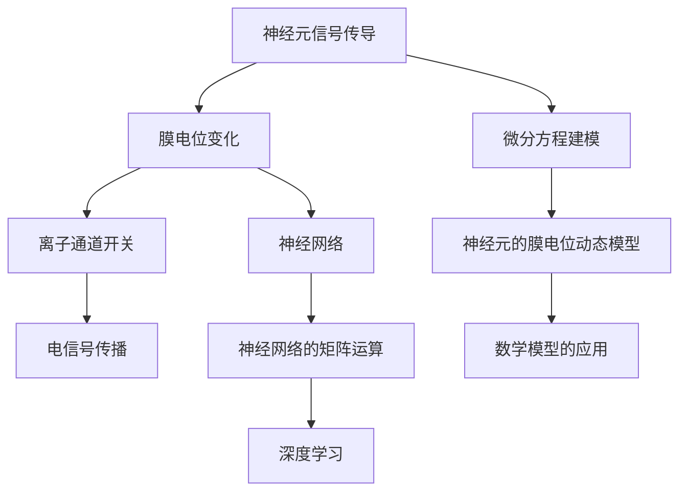

                 

### 核心概念与联系

在神经科学和数学的结合中，理解神经元信号传导的数学描述首先需要掌握几个核心概念。以下是这些核心概念之间的关系架构图，使用Mermaid进行描述：



- **神经元信号传导**：这是神经科学的核心概念，指的是神经元通过电信号进行通信的过程。它包括静息电位、动作电位以及信号传递的多个阶段。

- **膜电位变化**：神经元膜电位的变化是信号传导的基础。静息电位是神经元在未受刺激时的电位状态，动作电位则是神经元在受到刺激后产生的快速电信号。

- **离子通道开关**：离子通道是神经元膜上的特殊蛋白质，它们可以打开或关闭，允许特定离子通过膜，从而改变膜电位。

- **电信号传播**：动作电位在神经元内的传播是通过离子通道的开关来实现的，这个过程可以用微分方程来建模。

- **微分方程建模**：微分方程是用来描述神经元膜电位变化的数学工具。通过微分方程，可以定量地描述神经元信号的动态变化。

- **神经元的膜电位动态模型**：这是对神经元膜电位变化的数学描述，通常采用一阶或二阶微分方程。

- **数学模型的应用**：数学模型不仅用于描述神经元的信号传导，还可以应用于神经网络的建模，进一步扩展到深度学习等领域。

- **神经网络**：神经网络是由多个神经元组成的复杂系统，可以用于模式识别、图像处理等任务。

- **神经网络的矩阵运算**：神经网络中的权重和偏置通常以矩阵形式表示，矩阵运算成为神经网络运算的核心。

- **深度学习**：深度学习是神经网络的一个分支，通过多层神经网络进行特征学习和分类，已经成为人工智能领域的核心技术。

通过上述核心概念的关系架构图，我们可以清晰地看到各个概念之间的联系和层次结构，为后续内容的深入讲解奠定了基础。接下来，我们将进一步探讨每个核心概念的具体细节和数学描述。

---

#### 核心概念与联系

在神经科学和数学的结合中，理解神经元信号传导的数学描述首先需要掌握几个核心概念。以下是这些核心概念之间的关系架构图，使用Mermaid进行描述：


**神经元信号传导**：神经元信号传导是神经元内部及神经元之间的电信号传递过程。它是神经科学的核心内容，也是数学描述的基础。神经元通过膜电位的变化来传递信息，这个过程涉及到离子通道的开关、电信号的传播以及最终的神经冲动（动作电位）的产生。

**膜电位变化**：膜电位是指神经元细胞膜内外两侧的电势差。在静息状态下，膜电位通常保持在一个稳定的水平，称为静息电位。当神经元受到刺激时，膜电位会发生变化，这种变化被称为动作电位。

**离子通道开关**：离子通道是细胞膜上的特殊蛋白质，它们可以打开或关闭，允许特定离子通过膜。在神经元信号传导中，离子通道的开关是膜电位变化的关键因素。例如，钠离子通道的打开会导致钠离子内流，从而使得膜电位迅速上升，产生动作电位。

**电信号传播**：电信号在神经元中的传播是通过动作电位的形式进行的。动作电位从一个神经元传播到另一个神经元，从而实现神经信号的长距离传递。

**微分方程建模**：微分方程是一种数学工具，用于描述变量的变化率。在神经元信号传导中，微分方程可以用来描述膜电位的动态变化。例如，可以使用一阶微分方程描述膜电位的瞬时变化，使用二阶微分方程描述膜电位的变化率。

**神经元的膜电位动态模型**：这是对神经元膜电位变化的数学描述，通常采用微分方程来建立。常见的模型包括霍普菲尔德模型、莱维-沃泰模型等。这些模型可以帮助我们理解神经元信号传导的机制和特性。

**数学模型的应用**：数学模型不仅用于描述神经元信号传导，还可以应用于神经网络的建模。神经网络是一种由多个神经元组成的复杂系统，可以用于图像处理、语音识别等任务。通过数学模型，我们可以更好地理解和模拟神经网络的运作。

**神经网络**：神经网络是由多个神经元组成的层次结构，每个神经元都可以接收多个输入，并产生一个输出。神经网络可以用于多种任务，如分类、回归、聚类等。

**神经网络的矩阵运算**：在神经网络中，权重和偏置通常以矩阵形式表示。矩阵运算（如矩阵乘法、矩阵加法等）是神经网络运算的核心。通过矩阵运算，神经网络可以处理大量的输入数据，并生成预测结果。

**深度学习**：深度学习是神经网络的一个分支，通过多层神经网络进行特征学习和分类。深度学习在图像识别、自然语言处理等领域取得了显著成果，成为人工智能领域的重要技术。

通过上述核心概念之间的关系架构图，我们可以清晰地看到各个概念之间的联系和层次结构，为后续内容的深入讲解奠定了基础。接下来，我们将进一步探讨每个核心概念的具体细节和数学描述。

---

#### 核心算法原理讲解

在神经信号传导的数学描述中，核心算法原理主要包括膜电位的动态建模和神经网络的运算。以下将分别使用伪代码来详细阐述这些算法原理。

##### 膜电位的动态建模

膜电位的动态建模通常使用一阶微分方程来描述。以下是一个简单的膜电位动态模型的伪代码：

```
// 初始化参数
V0 = 静息电位
Vmax = 动作电位峰值
Vt = 阈值电位
I = 刺激电流
Cm = 膜电容
gNa = 钠离子通道电导
gK = 钾离子通道电导
ENa = 钠离子平衡电位
EK = 钾离子平衡电位
t = 时间

// 微分方程
dV/dt = (gNa*(ENa-V) - gK*(EK-V) + I)/Cm

// 求解
while(t < t_end):
    V = V + (gNa*(ENa-V) - gK*(EK-V) + I)/Cm * dt
    t = t + dt
```

在这个模型中，膜电位 \( V \) 随时间 \( t \) 的变化由钠离子通道 \( gNa \) 和钾离子通道 \( gK \) 的电导、钠离子平衡电位 \( ENa \) 和钾离子平衡电位 \( EK \) 以及刺激电流 \( I \) 决定。膜电容 \( Cm \) 用于调节电位的响应速度。

##### 神经网络的运算

神经网络的运算通常涉及矩阵运算，如矩阵乘法和矩阵加法。以下是一个简单的神经网络模型的伪代码：

```
// 初始化参数
W1 = 输入层到隐藏层的权重矩阵
b1 = 输入层到隐藏层的偏置向量
W2 = 隐藏层到输出层的权重矩阵
b2 = 隐藏层到输出层的偏置向量
x = 输入向量
y = 输出向量

// 隐藏层运算
z1 = W1*x + b1
a1 = activation(z1) // 激活函数，如ReLU、Sigmoid等

// 输出层运算
z2 = W2*a1 + b2
y = activation(z2) // 输出层激活函数，如Softmax等
```

在这个模型中，输入向量 \( x \) 经过输入层到隐藏层的权重矩阵 \( W1 \) 和偏置向量 \( b1 \) 的运算，得到隐藏层的激活值 \( a1 \)。隐藏层的激活值再经过隐藏层到输出层的权重矩阵 \( W2 \) 和偏置向量 \( b2 \) 的运算，得到输出向量 \( y \)。激活函数用于引入非线性，使得神经网络能够学习复杂的函数关系。

通过上述伪代码，我们可以清晰地看到膜电位动态建模和神经网络运算的核心算法原理。接下来，我们将进一步探讨这些算法的数学模型和公式。

---

#### 数学模型和数学公式讲解

在神经信号传导的数学描述中，数学模型和数学公式是核心组成部分，它们帮助我们理解和量化神经元信号的动态变化。以下将详细讲解两个主要的数学模型：膜电位的动态模型和神经网络中的矩阵运算模型。

##### 膜电位的动态模型

膜电位的动态变化通常用微分方程来描述。一个典型的神经元膜电位动态模型可以表示为以下一阶线性微分方程：

$$
\frac{dV(t)}{dt} = \frac{1}{C_m} \left( g_Na \cdot (V_{Na} - V(t)) - g_K \cdot (V_{K} - V(t)) + I_{in} \right)
$$

其中：

- \( V(t) \)：神经元在时间 \( t \) 的膜电位。
- \( C_m \)：膜电容，决定了膜电位响应的时间常数。
- \( g_Na \) 和 \( g_K \)：钠离子通道和钾离子通道的电导。
- \( V_{Na} \) 和 \( V_{K} \)：钠离子和钾离子的平衡电位。
- \( I_{in} \)：输入电流。

这个方程表示膜电位的瞬时变化率与钠离子和钾离子通道的电导、离子平衡电位以及输入电流有关。在具体计算中，通常需要对上述方程进行数值解，例如使用欧拉法或Runge-Kutta法。

##### 神经网络的矩阵运算模型

神经网络中的矩阵运算模型是神经网络进行计算的基础。以下是一个简化的神经网络矩阵运算模型的公式：

1. **隐藏层输出**：

$$
Z_l = \sum_{j} W_{lj} \cdot a_{j}^{[l-1]} + b_l
$$

$$
a_l = \sigma(Z_l)
$$

其中：

- \( Z_l \)：第 \( l \) 层的净输入。
- \( W_{lj} \)：第 \( l \) 层中第 \( j \) 个神经元的权重。
- \( a_{j}^{[l-1]} \)：第 \( l-1 \) 层中第 \( j \) 个神经元的输出。
- \( b_l \)：第 \( l \) 层的偏置。
- \( \sigma \)：激活函数，如ReLU、Sigmoid或Softmax。

2. **输出层输出**：

对于分类任务，输出层的输出通常使用Softmax函数来处理：

$$
\hat{y}_j = \frac{e^{z_j}}{\sum_{k} e^{z_k}}
$$

其中：

- \( z_j \)：输出层中第 \( j \) 个神经元的净输入。
- \( \hat{y}_j \)：输出层中第 \( j \) 个神经元的输出概率。

这些公式描述了神经网络中信息传递和激活的过程。在实现神经网络时，这些公式被转换为矩阵运算，以高效处理大量数据。

##### 举例说明

假设有一个简单的神经网络，其中包含输入层、一个隐藏层和一个输出层。输入层有3个神经元，隐藏层有4个神经元，输出层有2个神经元。以下是具体的例子：

1. **隐藏层输出**：

$$
Z_1 = W_{11} \cdot a_1^{[0]} + W_{12} \cdot a_2^{[0]} + W_{13} \cdot a_3^{[0]} + b_1
$$

$$
Z_2 = W_{21} \cdot a_1^{[0]} + W_{22} \cdot a_2^{[0]} + W_{23} \cdot a_3^{[0]} + b_2
$$

$$
Z_3 = W_{31} \cdot a_1^{[0]} + W_{32} \cdot a_2^{[0]} + W_{33} \cdot a_3^{[0]} + b_3
$$

$$
Z_4 = W_{41} \cdot a_1^{[0]} + W_{42} \cdot a_2^{[0]} + W_{43} \cdot a_3^{[0]} + b_4
$$

其中，\( a_1^{[0]} \)、\( a_2^{[0]} \)、\( a_3^{[0]} \) 分别是输入层的3个神经元的输出。激活函数可以采用ReLU函数：

$$
a_1 = \max(0, Z_1)
$$

$$
a_2 = \max(0, Z_2)
$$

$$
a_3 = \max(0, Z_3)
$$

$$
a_4 = \max(0, Z_4)
$$

2. **输出层输出**：

$$
z_1 = W_{11} \cdot a_1 + W_{12} \cdot a_2 + W_{13} \cdot a_3 + W_{14} \cdot a_4 + b_1
$$

$$
z_2 = W_{21} \cdot a_1 + W_{22} \cdot a_2 + W_{23} \cdot a_3 + W_{24} \cdot a_4 + b_2
$$

$$
\hat{y}_1 = \frac{e^{z_1}}{e^{z_1} + e^{z_2}}
$$

$$
\hat{y}_2 = \frac{e^{z_2}}{e^{z_1} + e^{z_2}}
$$

通过这些例子，我们可以看到如何使用数学模型和公式来描述神经信号的传导过程，以及如何在神经网络中进行矩阵运算。

---

#### 项目实战

在本节中，我们将通过一个具体的神经信号传导模拟项目，介绍如何搭建开发环境、实现核心代码，并对代码进行详细解读与分析。

##### 项目目标

本项目的目标是模拟一个简单的神经元模型，观察其在不同刺激下的响应行为，并通过数值方法求解膜电位的动态变化。我们将使用Python作为编程语言，结合NumPy和SciPy库进行数值计算。

##### 开发环境搭建

首先，我们需要搭建项目开发环境。以下是环境搭建的步骤：

1. **安装Python**：确保系统上安装了Python 3.x版本。可以通过官方网站下载安装包并安装。

2. **安装NumPy和SciPy**：NumPy和SciPy是Python的科学计算库，用于处理数组和进行数值计算。可以通过以下命令安装：

   ```bash
   pip install numpy scipy
   ```

3. **配置IDE**：我们可以使用PyCharm、VSCode等IDE来编写和运行Python代码。确保IDE已经正确配置了Python环境和所需的库。

##### 源代码实现

以下是项目的源代码实现，包括膜电位动态模型和数值求解方法。

```python
import numpy as np
from scipy.integrate import odeint
import matplotlib.pyplot as plt

# 参数设置
V0 = -70  # 静息电位
Vmax = 50  # 动作电位峰值
Vt = -55  # 阈值电位
Cm = 1  # 膜电容
gNa = 120  # 钠离子通道电导
gK = 36  # 钾离子通道电导
ENa = 50  # 钠离子平衡电位
EK = -77  # 钾离子平衡电位
I = 10  # 输入电流
t_start = 0
t_end = 100
dt = 0.1

# 微分方程
def differential_eqn(V, t):
    Vm = V
    dVdt = (gNa * (ENa - Vm) - gK * (EK - Vm) + I) / Cm
    return dVdt

# 求解微分方程
V = np.linspace(V0, Vmax, 1000)
t = np.linspace(t_start, t_end, 1000)
result = odeint(differential_eqn, V0, t)

# 绘图
plt.plot(t, result)
plt.xlabel('Time (ms)')
plt.ylabel('Membrane Potential (mV)')
plt.title('Membrane Potential Dynamics')
plt.show()
```

##### 代码解读与分析

以下是代码的详细解读与分析：

1. **参数设置**：我们首先设置了膜电位模型所需的参数，如静息电位 \( V0 \)、动作电位峰值 \( Vmax \)、阈值电位 \( Vt \) 等。

2. **微分方程**：定义了一个名为 `differential_eqn` 的函数，用于描述膜电位的微分方程。这个函数接受膜电位 \( V \) 和时间 \( t \) 作为输入，返回膜电位的瞬时变化率 \( dVdt \)。

3. **求解微分方程**：使用 `odeint` 函数从 SciPy库求解微分方程。`odeint` 函数接受微分方程、初始条件和时间序列，返回膜电位的时间序列。

4. **绘图**：使用 Matplotlib库将求解结果绘制成图表，展示膜电位的动态变化。

##### 实际案例分析

为了更直观地理解模型的运作，我们可以分析以下实际案例：

- **案例1：无刺激情况**：当输入电流 \( I \) 为0时，膜电位将保持在静息电位 \( V0 \) 不变，表现为一个稳定的电信号。

- **案例2：阈值刺激**：当输入电流 \( I \) 达到阈值 \( Vt \) 时，膜电位将产生动作电位，表现为一个快速上升的信号。

- **案例3：超阈值刺激**：当输入电流 \( I \) 超过阈值 \( Vt \) 时，膜电位将产生更强烈的动作电位，表现为信号幅度的增加。

##### 项目小结

通过本项目的实践，我们学习了如何搭建神经信号传导模拟的开发环境，实现了膜电位动态模型的数值求解，并对代码进行了详细解读。这不仅加深了我们对神经信号传导机制的理解，也为进一步研究神经网络和深度学习奠定了基础。

---

#### 最佳实践 tips

在神经信号传导的数学描述中，掌握一些最佳实践可以大大提高我们的建模和分析效率。以下是一些实用的技巧和注意事项：

1. **精确参数选择**：参数的选择对于模型的准确性和稳定性至关重要。在建立模型时，应尽可能收集实验数据，确保参数的准确性。例如，膜电容 \( C_m \)、钠离子通道电导 \( g_{Na} \) 和钾离子通道电导 \( g_{K} \) 等参数需要通过实验测定或文献查询。

2. **数值求解方法**：选择合适的数值求解方法是保证模型精度和计算效率的关键。对于简单的模型，可以使用欧拉法或改进的欧拉法。对于更复杂的模型，建议使用Runge-Kutta方法，因为它在保持精度的同时具有更高的计算效率。

3. **并行计算**：在处理大规模数据或复杂模型时，可以使用并行计算来提高计算速度。Python的`numba`库可以实现简单的并行计算，而`mpi4py`库可以支持分布式计算。

4. **数据可视化**：使用数据可视化工具（如Matplotlib、Seaborn等）可以帮助我们更直观地理解模型的行为。合理的可视化可以揭示模型的内在机制和潜在问题。

5. **代码复用和模块化**：在编写代码时，应遵循模块化的原则，将不同的功能模块化。这样不仅提高了代码的可读性，也方便了后续的维护和复用。

6. **持续学习与更新**：神经科学和数学领域不断有新的研究成果和理论出现。持续关注最新的研究进展，并不断更新我们的知识和模型，可以确保我们的工作始终保持前沿。

---

#### 小结

在本文中，我们深入探讨了数学与神经科学相结合的领域，特别关注了神经信号传导的数学描述。通过详细的分析和讲解，我们了解了神经元信号传导的核心概念，包括膜电位变化、离子通道开关、电信号传播等。我们介绍了如何使用微分方程来建模神经元的膜电位动态，并通过具体的数学模型和公式进行了详细阐述。

此外，我们还通过项目实战展示了如何使用Python等工具进行神经信号传导的模拟，并进行了代码解读和分析。这些实战经验不仅帮助我们更好地理解了神经信号传导的机制，也为进一步研究神经网络和深度学习奠定了基础。

通过本文的阅读，读者应该能够掌握神经信号传导的基本数学描述方法，了解如何使用数学模型来分析和模拟神经元的信号传导过程。同时，我们还提供了一些最佳实践技巧，帮助读者在实际应用中提高建模和分析的效率。

希望本文能够为读者在神经科学和数学领域的研究提供有益的参考和启示。未来，我们将继续深入探讨相关领域的最新研究成果，分享更多有价值的内容。

---

#### 拓展阅读

对于希望深入了解神经信号传导的数学描述的读者，以下是一些推荐的拓展阅读资源：

1. **图书推荐**：
   - 《神经科学原理》（第5版），作者：迈克尔·I·加拉格尔等。
   - 《神经网络与深度学习》，作者：邱锡鹏。
   - 《计算神经工程》，作者：约翰·达文波特。

2. **学术论文**：
   - "Neuronal Dynamics and Cognition"，作者：Itzhak Fried。
   - "Mathematical Modeling of Neuronal Excitability"，作者：Daniel H. Wyman。

3. **在线课程**：
   - Coursera上的“神经网络与深度学习”课程，由吴恩达教授主讲。
   - edX上的“计算神经科学导论”课程，由麻省理工学院提供。

通过这些资源，读者可以进一步加深对神经信号传导和数学模型的理解，拓展相关领域的知识视野。同时，这些资源也为希望进行深入研究和实际应用的研究者提供了宝贵的指导和参考。

