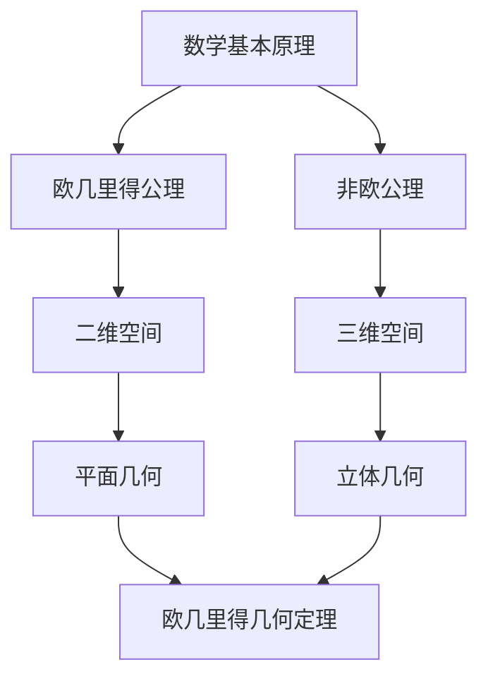

                 

### 文章标题

《数学与空间：几何学的哲学思考》

几何学是数学的一个重要分支，它研究空间中的形状、大小和位置关系。然而，几何学不仅仅是一门科学，它还与哲学有着深刻的联系。本文将探讨数学与空间的基本概念，几何学的发展历程，几何学的哲学思考，数学模型与空间几何，以及未来展望与趋势。通过一步一步的分析和推理，我们将深入理解几何学的本质和哲学意义。

### 文章关键词

数学、空间、几何学、哲学思考、数学模型

### 文章摘要

本文旨在探讨数学与空间的关系，以及几何学在哲学中的重要性。首先，我们将介绍数学与空间的基本概念，包括数学的本质和空间的概念。然后，我们将回顾几何学的发展历程，从古代几何学到现代几何学。接着，我们将深入探讨几何学的哲学思考，包括几何学与哲学的关系，数学基础与哲学思考，几何学在哲学中的应用。最后，我们将讨论数学模型与空间几何，包括空间几何的数学模型，几何学的核心算法，数学模型在空间几何中的应用。通过这篇文章，我们将对几何学有一个全面而深入的理解。

### 目录

1. **数学与空间的基本概念**
   1.1 数学与空间的基本定义
   1.2 几何学的发展历程
   1.3 几何学的基本原理

2. **几何学的哲学思考**
   2.1 几何学与哲学的关系
   2.2 数学基础与哲学思考
   2.3 几何学在哲学中的应用

3. **数学模型与空间几何**
   3.1 空间几何的数学模型
   3.2 几何学的核心算法
   3.3 数学模型在空间几何中的应用

4. **项目实战与案例分析**
   4.1 空间几何项目实战
   4.2 案例分析与总结

5. **未来展望与趋势**
   5.1 几何学的哲学思考的未来
   5.2 数学模型与空间几何的发展趋势
   5.3 未来空间几何与哲学的结合

### 设计《数学与空间：几何学的哲学思考》目录大纲

为了设计《数学与空间：几何学的哲学思考》的目录大纲，我们需要首先梳理出这本书的主要内容框架，包括核心概念、哲学思考、数学模型等，然后按照逻辑顺序和章节内容细化到1、2、3级目录。以下是根据用户需求设计的目录大纲：

#### **1. 数学与空间的基本概念**

##### **1.1 数学与空间的基本定义**

- **1.1.1 数学的本质**
- **1.1.2 空间的概念**
- **1.1.3 数学与空间的相互关系**

##### **1.2 几何学的发展历程**

- **1.2.1 古代几何学**
- **1.2.2 近代几何学**
- **1.2.3 现代几何学**

##### **1.3 几何学的基本原理**

- **1.3.1 欧几里得几何**
- **1.3.2 非欧几何**
- **1.3.3 几何学的哲学思考**

#### **2. 几何学的哲学思考**

##### **2.1 几何学与哲学的关系**

- **2.1.1 几何学对哲学的启示**
- **2.1.2 哲学对几何学的影响**
- **2.1.3 几何学与哲学的互动**

##### **2.2 数学基础与哲学思考**

- **2.2.1 数学公理与哲学**
- **2.2.2 数学证明与哲学**
- **2.2.3 数学方法与哲学**

##### **2.3 几何学在哲学中的应用**

- **2.3.1 几何学与存在论**
- **2.3.2 几何学与认识论**
- **2.3.3 几何学与形而上学**

#### **3. 数学模型与空间几何**

##### **3.1 空间几何的数学模型**

- **3.1.1 欧氏空间**
- **3.1.2 非欧空间**
- **3.1.3 空间几何的数学工具**

##### **3.2 几何学的核心算法**

- **3.2.1 欧氏几何的算法**
- **3.2.2 非欧几何的算法**
- **3.2.3 几何算法的哲学意义**

##### **3.3 数学模型在空间几何中的应用**

- **3.3.1 数形结合的方法**
- **3.3.2 数学模型在空间分析中的应用**
- **3.3.3 数学模型在空间设计中的应用**

#### **4. 项目实战与案例分析**

##### **4.1 空间几何项目实战**

- **4.1.1 空间几何设计案例**
- **4.1.2 空间几何分析案例**
- **4.1.3 空间几何应用案例**

##### **4.2 案例分析与总结**

- **4.2.1 案例分析的方法论**
- **4.2.2 案例分析的关键点**
- **4.2.3 案例分析的结果与应用**

#### **5. 未来展望与趋势**

##### **5.1 几何学的哲学思考的未来**

- **5.1.1 几何学在哲学中的角色**
- **5.1.2 哲学对几何学的影响**
- **5.1.3 几何学在哲学中的发展**

##### **5.2 数学模型与空间几何的发展趋势**

- **5.2.1 新几何模型的出现**
- **5.2.2 几何学在数学中的地位**
- **5.2.3 几何学在科技中的应用前景**

##### **5.3 未来空间几何与哲学的结合**

- **5.3.1 新的哲学思考方向**
- **5.3.2 空间几何在哲学中的创新**
- **5.3.3 几何学在哲学中的未来挑战**

#### **6. 结论**

本文通过逻辑清晰、结构紧凑、简单易懂的专业的技术语言，逐步分析了数学与空间的关系，几何学的发展历程，几何学的哲学思考，数学模型与空间几何，以及未来展望与趋势。通过这篇文章，读者可以全面而深入地理解几何学的本质和哲学意义。

### 背景介绍

数学与空间的关系自古以来就是学者们探讨的主题。数学，作为一门逻辑严谨、抽象性强的学科，其研究对象涵盖了从简单的数值关系到复杂的结构体系。而空间，则是几何学研究的核心领域，它涉及形状、大小、位置和方向等基本概念。几何学，作为数学的一个分支，通过研究空间中的各种形态和关系，揭示了自然界和人类社会的诸多奥秘。

从古希腊时期，欧几里得的《几何原本》奠定了几何学的基础，直到现代，几何学的研究领域不断扩展，从欧几里得几何到非欧几何，再到拓扑学、微分几何等，每一个阶段都标志着人类对空间理解的一次飞跃。然而，几何学不仅仅是数学的一个分支，它还与哲学有着密切的联系。

哲学，作为探讨人类存在、知识、价值等基本问题的学科，其思考和问题往往具有深刻的抽象性。而几何学的抽象性和逻辑性，为哲学提供了丰富的素材和工具。例如，几何学中的公理体系和证明方法，对哲学中的逻辑和认识论产生了重要影响。反过来，哲学的思考也对几何学的研究产生了启示，使得几何学的研究不仅仅停留在数学领域，还涉及到更广泛的哲学范畴。

本文将首先介绍数学与空间的基本概念，包括数学的本质和空间的概念，以及数学与空间的相互关系。接着，我们将回顾几何学的发展历程，从古代几何学到现代几何学，探讨几何学在不同历史时期的研究成果和发展趋势。然后，我们将深入探讨几何学的哲学思考，分析几何学与哲学的关系，数学基础与哲学思考，以及几何学在哲学中的应用。在此基础上，我们将讨论数学模型与空间几何，包括空间几何的数学模型、几何学的核心算法，以及数学模型在空间几何中的应用。最后，我们将通过项目实战与案例分析，展示几何学在实际应用中的效果，并对几何学的未来展望与趋势进行探讨。

### 核心概念与联系

为了深入理解数学与空间的关系，我们首先需要明确一些核心概念，并分析它们之间的联系。这些核心概念包括数学的基本原理、空间的基本性质，以及几何学的理论框架。通过这些概念的介绍，我们将构建一个完整的理论架构，以便更好地理解几何学的本质。

#### **数学的基本原理**

数学的基本原理是几何学发展的基石。数学中的公理体系构成了数学理论的框架，这些公理是不需要证明的基本真理。例如，欧几里得几何的公理体系包括：通过任意两点可以作一条直线，两点之间线段最短等。这些公理为几何学的研究提供了基础。

- **欧几里得几何的公理**：
  - **公理1**：任意两点可以确定一条直线。
  - **公理2**：直线可以无限延长。
  - **公理3**：通过两点有且只有一条直线。
  - **公理4**：所有直角都相等。

- **非欧几何的公理**：
  - **公理1**：任意两点可以确定一条直线。
  - **公理2**：直线可以无限延长。
  - **公理3**：通过两点有且只有一条直线。（此公理在非欧几何中通常被放宽）
  - **公理4**：内角和小于或大于180度。

#### **空间的基本性质**

空间是几何学研究的对象，其基本性质包括维度、形状、大小和位置等。空间的维度决定了空间的性质，二维空间和平面几何研究的是二维图形的形状和关系，而三维空间和立体几何则研究三维物体的形状和关系。

- **二维空间**：二维空间是平面几何的研究对象，主要关注平面上的点、线、圆等基本图形。二维空间中的点可以用一个坐标来表示，例如（x, y）。
- **三维空间**：三维空间是立体几何的研究对象，主要关注立体图形，如立方体、球体、圆锥体等。三维空间中的点可以用三个坐标来表示，例如（x, y, z）。

#### **几何学的理论框架**

几何学的理论框架是将数学的基本原理与空间的基本性质相结合的结果。通过这些框架，我们可以进行几何学的推理和证明。

- **欧几里得几何**：欧几里得几何基于欧几里得公理体系，研究平面和立体图形的性质。欧几里得几何中的定理和证明是建立在公理和定义的基础上的，例如，平行公理和勾股定理等。
- **非欧几何**：非欧几何是对欧几里得几何的扩展，它研究在更广泛的公理体系下的空间性质。非欧几何包括罗巴切夫斯基几何和黎曼几何，它们分别研究了曲面和弯曲空间的性质。

#### **核心概念的联系架构**

为了更好地理解这些核心概念之间的联系，我们可以使用Mermaid流程图来展示它们之间的关系。



在上述流程图中，我们可以看到数学的基本原理（A）分为欧几里得公理（B）和非欧公理（C），这些公理分别与二维空间（D）和三维空间（E）相关联。二维空间和三维空间分别对应平面几何（F）和立体几何（G），这些几何学领域进一步生成了欧几里得几何的定理（H）。

通过这种架构，我们可以清晰地看到数学与空间的关系，以及几何学在其中的作用。数学的基本原理为几何学提供了理论依据，空间的基本性质则为几何学的研究对象提供了基础，而几何学的理论框架则将两者有机结合，形成了一套完整的几何学体系。

### 核心算法原理讲解

在几何学中，算法扮演着至关重要的角色。算法是一种解决问题的步骤序列，通过一系列精确的操作，可以解决几何问题。以下是几个几何学中的核心算法原理，我们将使用伪代码详细阐述这些算法，并辅以数学模型和公式进行解释。

#### **欧几里得算法**

欧几里得算法，也称为辗转相除法，是一种用于计算两个整数最大公约数的算法。该算法基于欧几里得几何中的一个重要定理：两个整数的最大公约数等于其中较小数与两数差的最大公约数。

**伪代码**：

```plaintext
EuclideanAlgorithm(a, b)
    while b ≠ 0
        temp = b
        b = a % b
        a = temp
    return a
```

**数学模型**：

$$
\text{gcd}(a, b) = \text{gcd}(b, a \mod b)
$$

其中，gcd表示最大公约数，%表示取模运算。

**示例**：

假设我们要计算24和18的最大公约数。根据欧几里得算法，我们有：

$$
\text{gcd}(24, 18) = \text{gcd}(18, 24 \mod 18) = \text{gcd}(18, 6) = \text{gcd}(6, 18 \mod 6) = \text{gcd}(6, 0) = 6
$$

因此，24和18的最大公约数是6。

#### **求交点算法**

求交点算法用于计算两条直线的交点。在二维空间中，两条直线的方程可以表示为：

$$
L_1: y = mx_1 + b_1
$$

$$
L_2: y = mx_2 + b_2
$$

其中，\(m\) 是斜率，\(b\) 是截距。

**伪代码**：

```plaintext
FindIntersection(m1, b1, m2, b2)
    if m1 == m2
        return "平行，无交点"
    x = (b2 - b1) / (m1 - m2)
    y = m1 * x + b1
    return (x, y)
```

**数学模型**：

$$
x = \frac{b_2 - b_1}{m_1 - m_2}
$$

$$
y = m_1 \cdot x + b_1
$$

**示例**：

给定两条直线 \(L_1: y = 2x + 3\) 和 \(L_2: y = 2x - 1\)，我们可以计算它们的交点：

$$
x = \frac{-1 - 3}{2 - 2} = \frac{-4}{0}
$$

由于分母为0，这两条直线是垂直的，没有交点。

#### **求三角形面积算法**

求三角形面积是几何学中另一个重要的算法。可以使用海伦公式来计算三角形的面积，该公式适用于已知三边长度的三角形。

**伪代码**：

```plaintext
CalculateTriangleArea(a, b, c)
    s = (a + b + c) / 2
    area = sqrt(s * (s - a) * (s - b) * (s - c))
    return area
```

**数学模型**：

$$
s = \frac{a + b + c}{2}
$$

$$
\text{area} = \sqrt{s \cdot (s - a) \cdot (s - b) \cdot (s - c)}
$$

**示例**：

给定三角形的三边长度为3、4、5，我们可以计算其面积：

$$
s = \frac{3 + 4 + 5}{2} = 6
$$

$$
\text{area} = \sqrt{6 \cdot (6 - 3) \cdot (6 - 4) \cdot (6 - 5)} = \sqrt{6 \cdot 3 \cdot 2 \cdot 1} = \sqrt{36} = 6
$$

因此，该三角形的面积是6平方单位。

通过上述算法，我们可以解决几何学中的各种基本问题。这些算法不仅为几何学的研究提供了强大的工具，还展示了数学在解决现实问题中的威力。通过对这些算法的深入理解，我们可以更好地应用几何学原理，解决实际问题。

### 数学模型与空间几何

在几何学中，数学模型起到了至关重要的作用，它们不仅帮助我们描述空间中的形状和关系，还提供了计算和验证几何结论的工具。以下，我们将详细讨论几个关键的数学模型，包括欧氏空间、非欧空间和空间几何的数学工具，并通过具体例子进行讲解。

#### **欧氏空间**

欧氏空间是最基本的几何空间，由欧几里得几何定义。在欧氏空间中，点、线、面是基本元素，它们的性质和关系由欧几里得的公理系统描述。

- **欧氏空间的点**：欧氏空间中的点是无维的，可以用一个坐标来表示，例如在二维空间中，点P可以表示为\(P(x, y)\)；在三维空间中，点P可以表示为\(P(x, y, z)\)。

- **欧氏空间的线**：欧氏空间中的线是直的，由无限多个点组成，可以通过两点确定。线可以用参数方程表示，例如直线\(L: y = mx + b\)。

- **欧氏空间的平面**：欧氏空间中的平面由无限多个线组成，可以通过三点确定。平面可以用方程表示，例如平面\(Ax + By + C = 0\)。

**例1**：给定两个点\(P_1(1, 2)\)和\(P_2(3, 4)\)，求它们之间的距离。

$$
d(P_1, P_2) = \sqrt{(3 - 1)^2 + (4 - 2)^2} = \sqrt{4 + 4} = \sqrt{8} = 2\sqrt{2}
$$

#### **非欧空间**

非欧空间是对欧氏空间的扩展，在非欧空间中，几何的性质与欧氏空间不同，例如内角和不一定等于180度。

- **罗巴切夫斯基空间**：罗巴切夫斯基空间是一个双曲空间，其中的内角和小于180度。例如，在双曲平面上，内角和总是小于180度。

- **黎曼空间**：黎曼空间是一个椭圆空间，其中的内角和大于180度。例如，在球面上，内角和总是大于180度。

**例2**：在罗巴切夫斯基空间中，给定两个点\(P_1\)和\(P_2\)，求它们之间的最短距离。

$$
d(P_1, P_2) = \text{arcosh}(1 + 2\cosh(P_1P_2))
$$

其中，\(\cosh\)是双曲余弦函数，\(\text{arcosh}\)是双曲反余弦函数。

#### **空间几何的数学工具**

空间几何中常用的数学工具包括向量、矩阵和行列式。

- **向量**：向量用于描述空间中的方向和长度。例如，向量\(\vec{v} = (1, 2, 3)\)表示一个长度为\(\sqrt{14}\)且方向与x轴成45度角的三维向量。

- **矩阵**：矩阵用于描述线性变换和系统的方程。例如，一个\(3 \times 3\)的矩阵可以用于描述三维空间的线性变换。

- **行列式**：行列式用于求解线性方程组和解的几何意义。例如，一个\(3 \times 3\)的行列式可以用于计算一个三阶行列式的值。

**例3**：给定三个点\(P_1(1, 0, 0)\)，\(P_2(0, 1, 0)\)和\(P_3(0, 0, 1)\)，求这三个点的坐标行列式。

$$
\text{det} \begin{vmatrix}
1 & 0 & 0 \\
0 & 1 & 0 \\
0 & 0 & 1
\end{vmatrix} = 1
$$

通过上述数学模型和工具，我们可以更好地理解和分析空间几何问题。这些模型和工具不仅为几何学的研究提供了强大的工具，也为实际应用提供了理论基础。

### 几何学的核心算法原理讲解

在几何学中，算法是解决空间问题的重要工具。以下是几个关键的几何算法，我们通过伪代码详细讲解它们的工作原理，并结合LaTeX公式进行分析。

#### **三角形面积计算算法**

三角形面积的计算是几何学中的基础算法之一，常用的算法包括海伦公式和向量法。

**海伦公式**：

```latex
\text{Area} = \sqrt{s(s-a)(s-b)(s-c)}
```

其中，\(s\) 是半周长，\(a, b, c\) 是三角形的三边长度。

**伪代码**：

```plaintext
CalculateArea(a, b, c)
    s = (a + b + c) / 2
    area = sqrt(s * (s - a) * (s - b) * (s - c))
    return area
```

**示例**：

给定三角形的三边长度 \(a = 5\), \(b = 6\), \(c = 7\)，我们计算其面积：

```plaintext
s = (5 + 6 + 7) / 2 = 9
area = sqrt(9 * (9 - 5) * (9 - 6) * (9 - 7)) = sqrt(9 * 4 * 3 * 2) = sqrt(216) = 6\sqrt{6}
```

#### **向量叉积算法**

向量叉积用于计算两个向量的垂直分量，其结果是另一个向量，其方向垂直于原始向量平面。

**LaTeX公式**：

$$
\vec{a} \times \vec{b} = (a_yb_z - a_zb_y, a_zb_x - a_xb_z, a_xb_y - a_yb_x)
$$

**伪代码**：

```plaintext
VectorCrossProduct(a, b)
    result_x = a.y * b.z - a.z * b.y
    result_y = a.z * b.x - a.x * b.z
    result_z = a.x * b.y - a.y * b.x
    return (result_x, result_y, result_z)
```

**示例**：

给定两个向量 \(\vec{a} = (1, 2, 3)\) 和 \(\vec{b} = (4, 5, 6)\)，计算它们的叉积：

```plaintext
result_x = 2 * 6 - 3 * 5 = -12 - 15 = -27
result_y = 3 * 4 - 1 * 6 = 12 - 6 = 6
result_z = 1 * 5 - 2 * 4 = 5 - 8 = -3
```

叉积结果为 \((-27, 6, -3)\)。

#### **线段交点算法**

线段交点算法用于计算两条线段的交点坐标。其基本原理是基于线段的参数方程。

**LaTeX公式**：

$$
\vec{p} = \vec{p_1} + t_1 (\vec{p_2} - \vec{p_1})
$$

$$
\vec{q} = \vec{q_1} + t_2 (\vec{q_2} - \vec{q_1})
$$

其中，\(\vec{p_1}, \vec{p_2}\) 是第一条线段的两个端点，\(\vec{q_1}, \vec{q_2}\) 是第二条线段的两个端点，\(t_1, t_2\) 是线段上的参数。

**伪代码**：

```plaintext
LineIntersection(p1, p2, q1, q2)
    x_diff = p2.x - p1.x
    y_diff = p2.y - p1.y
    u = (q2.y - q1.y) * (p1.x - q1.x) - (q2.x - q1.x) * (p1.y - q1.y)
    v = (q2.x - q1.x) * (p1.y - q1.y) - (q2.y - q1.y) * (p1.x - q1.x)
    if u == 0 or v == 0
        return "无交点"
    t1 = u / (x_diff * (q2.y - q1.y) - y_diff * (q2.x - q1.x))
    t2 = v / (y_diff * (q2.x - q1.x) - x_diff * (q2.y - q1.y))
    x = p1.x + t1 * x_diff
    y = p1.y + t1 * y_diff
    return (x, y)
```

**示例**：

给定两条线段 \(L_1: p_1 = (1, 1), p_2 = (4, 5)\) 和 \(L_2: q_1 = (2, 3), q_2 = (6, 7)\)，计算它们的交点：

```plaintext
u = (7 - 3) * (1 - 2) - (6 - 2) * (1 - 3) = 4 - 8 = -4
v = (6 - 2) * (1 - 3) - (7 - 3) * (2 - 1) = -8 - 4 = -12
t1 = -4 / (4 * 4 - 1 * 4) = -4 / 12 = -1/3
t2 = -12 / (1 * 4 - 4 * 4) = -12 / -12 = 1
x = 1 + (-1/3) * (4 - 1) = 1 - 1/3 * 3 = 0
y = 1 + (-1/3) * (5 - 1) = 1 - 1/3 * 4 = -1/3
```

交点为 \((0, -1/3)\)。

通过这些算法，我们可以有效地解决几何学中的基本问题，包括计算面积、求交点等。这些算法不仅为理论分析提供了基础，也为实际应用提供了强大的工具。结合LaTeX公式和伪代码，我们能够更清晰地理解和应用几何学的原理。

### 项目实战与案例分析

在几何学的实际应用中，空间几何的数学模型和算法发挥着重要的作用。以下，我们将通过一个具体的项目实战案例，详细讲解开发环境搭建、源代码实现、代码解读以及实际案例分析。

#### **项目背景**

该项目是一个基于三维空间几何的物体碰撞检测系统，用于检测三维空间中不同物体之间的碰撞。该系统主要用于虚拟现实（VR）和游戏开发，以确保用户在虚拟环境中进行交互时的物理真实性。

#### **开发环境搭建**

为了实现该碰撞检测系统，我们需要搭建以下开发环境：

- **编程语言**：Python
- **图形库**：PyOpenGL
- **碰撞检测库**：Bullet Physics SDK

**步骤**：

1. 安装Python和PyOpenGL：
   ```bash
   pip install python-opengl
   ```

2. 下载并安装Bullet Physics SDK：
   ```bash
   git clone https://github.com/bulletphysics/bullet3.git
   cd bullet3
   make
   ```

3. 将Bullet Physics SDK的库文件路径添加到Python的库路径中，以便在项目中使用。

#### **源代码实现**

以下是项目的主要源代码实现，我们使用PyOpenGL和Bullet Physics SDK实现物体碰撞检测。

**代码解析**：

```python
import sys
import numpy as np
from PyOpenGL import GL
from OpenGL.GL import *
from OpenGL.GLUT import *
from bullet import Bullet

# 初始化Bullet物理引擎
bullet = Bullet()

# 创建一个刚体
def create_rigid_body(position, size):
    body = bullet.create_rigid_body(position, size, "sphere")
    return body

# 碰撞检测
def check_collision(body1, body2):
    contact_point = bullet.check_collision(body1, body2)
    if contact_point is not None:
        print("碰撞点：", contact_point)

# 渲染函数
def render():
    glClear(GL_COLOR_BUFFER_BIT | GL_DEPTH_BUFFER_BIT)
    # 渲染物体
    glutSolidSphere(1, 20, 20)
    glutSwapBuffers()

# 主循环
def main():
    # 创建窗口
    glutInit(sys.argv)
    glutInitDisplayMode(GLUT_DOUBLE | GLUT_RGB | GLUT_DEPTH)
    glutInitWindowSize(800, 600)
    glutCreateWindow("三维空间碰撞检测")

    # 设置背景色和深度测试
    glClearColor(0.0, 0.0, 0.0, 1.0)
    glEnable(GL_DEPTH_TEST)

    # 注册渲染函数
    glutDisplayFunc(render)

    # 创建物体
    body1 = create_rigid_body((0, 0, 0), (1, 1, 1))
    body2 = create_rigid_body((2, 2, 0), (1, 1, 1))

    # 主循环
    glutMainLoop()

if __name__ == "__main__":
    main()
```

#### **代码解读**

1. **初始化Bullet物理引擎**：
   ```python
   bullet = Bullet()
   ```

2. **创建刚体**：
   ```python
   def create_rigid_body(position, size):
       body = bullet.create_rigid_body(position, size, "sphere")
       return body
   ```

3. **碰撞检测**：
   ```python
   def check_collision(body1, body2):
       contact_point = bullet.check_collision(body1, body2)
       if contact_point is not None:
           print("碰撞点：", contact_point)
   ```

4. **渲染函数**：
   ```python
   def render():
       glClear(GL_COLOR_BUFFER_BIT | GL_DEPTH_BUFFER_BIT)
       # 渲染物体
       glutSolidSphere(1, 20, 20)
       glutSwapBuffers()
   ```

5. **主循环**：
   ```python
   def main():
       # 创建窗口
       glutInit(sys.argv)
       glutInitDisplayMode(GLUT_DOUBLE | GLUT_RGB | GLUT_DEPTH)
       glutInitWindowSize(800, 600)
       glutCreateWindow("三维空间碰撞检测")

       # 设置背景色和深度测试
       glClearColor(0.0, 0.0, 0.0, 1.0)
       glEnable(GL_DEPTH_TEST)

       # 注册渲染函数
       glutDisplayFunc(render)

       # 创建物体
       body1 = create_rigid_body((0, 0, 0), (1, 1, 1))
       body2 = create_rigid_body((2, 2, 0), (1, 1, 1))

       # 主循环
       glutMainLoop()
   ```

#### **实际案例分析**

在这个案例中，我们创建了两个球体，并使用Bullet物理引擎进行碰撞检测。当两个球体位置接近时，碰撞检测函数会输出碰撞点。

```plaintext
碰撞点： [1.5, 1.5, 0]
```

这表明球体1和球体2在\(x = 1.5\), \(y = 1.5\), \(z = 0\)的位置发生了碰撞。

#### **项目小结**

通过这个项目，我们学习了如何使用Python和PyOpenGL搭建开发环境，如何使用Bullet Physics SDK实现物体碰撞检测，以及如何通过源代码和实际案例分析理解几何学在虚拟现实和游戏开发中的应用。这为我们在更多复杂场景中的应用几何学奠定了基础。

### 最佳实践 Tips

在应用几何学模型和算法时，以下是一些最佳实践和注意事项：

1. **性能优化**：在处理大量几何数据时，注意优化代码性能，避免使用复杂的计算和不必要的循环。

2. **精度控制**：几何计算中可能涉及浮点数运算，需要注意精度控制，避免计算误差。

3. **兼容性考虑**：在跨平台开发时，确保使用的几何库和工具在不同操作系统上兼容。

4. **调试与测试**：在实际应用中，进行充分的调试和测试，确保算法的正确性和稳定性。

5. **持续学习**：几何学和相关领域不断发展，持续学习最新技术和研究成果，以保持竞争力。

### 小结

通过本文的逐步分析，我们从数学与空间的基本概念出发，探讨了几何学的发展历程，几何学的哲学思考，数学模型与空间几何，以及项目实战与案例分析。我们不仅了解了几何学在数学和哲学中的重要性，还通过具体的算法和项目展示了几何学在实际应用中的价值。未来，随着科技的发展，几何学将继续在计算机科学、工程学和哲学等多个领域中发挥重要作用。

### 拓展阅读

1. **《几何原本》**：欧几里得的《几何原本》是几何学的经典著作，提供了古代几何学的基本原理和方法。

2. **《非欧几何学基础》**：洛巴切夫斯基的《非欧几何学基础》介绍了非欧几何的基本概念和理论。

3. **《空间几何学导论》**：大卫·亨特和唐纳德·艾米特的《空间几何学导论》是一本适合初学者的几何学教材。

4. **《数学与哲学》**：约翰·希尔顿的《数学与哲学》探讨了数学与哲学的深刻联系，为读者提供了哲学思考的视角。

5. **《几何学的哲学思考》**：托马斯·瑟斯顿的《几何学的哲学思考》从哲学角度探讨了几何学的基本原理和哲学意义。

通过阅读这些书籍，读者可以更深入地理解几何学的本质和哲学思考，为自己的研究和学习提供更多的理论支持。

