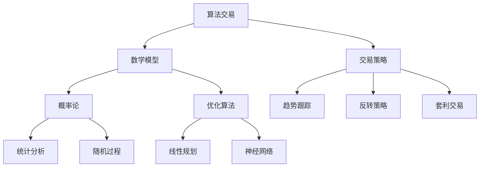

                 

### 1.1 算法交易概述

#### 1.1.1 算法交易的定义与起源

**定义**：算法交易是指利用数学模型和计算机算法，在金融市场中执行买卖交易策略的过程。这种交易方式依赖于高级的数学模型和计算技术，能够自动识别市场机会，并快速执行交易指令。

**起源**：算法交易的起源可以追溯到20世纪80年代，当时一些机构开始利用计算机技术进行高频交易。随着计算机性能的提升和数学模型的进步，算法交易逐渐成为金融市场中的一种主流交易方式。

**发展现状**：当前，算法交易在全球金融市场中扮演着重要角色，尤其是在高频交易和量化交易领域。高频交易通过在毫秒级别的时间内执行大量交易指令，实现高额利润。量化交易则利用数学模型分析市场数据，以量化方式识别投资机会。

**未来趋势**：随着人工智能和大数据技术的不断发展，算法交易的复杂性和智能化程度不断提高。未来发展趋势包括：

1. **自适应交易策略**：通过机器学习技术，算法交易系统能够自动调整交易策略，以应对市场变化。
2. **智能化分析**：利用深度学习等技术，算法交易系统能够从大量市场数据中提取有用信息，提高交易决策的准确性。
3. **自动化执行**：算法交易将更加强调自动化，减少人为干预，提高交易效率和准确性。

#### 1.1.2 数学在算法交易中的作用

**数学模型在交易策略设计中的应用**：

- **趋势分析**：通过统计分析，识别市场趋势，从而制定相应的交易策略。
- **风险控制**：利用概率论和随机过程理论，评估市场风险，并制定相应的风险控制策略。
- **机会识别**：通过机器学习技术，从历史数据中挖掘潜在的投资机会。

**数学工具在量化分析中的重要性**：

- **统计分析**：用于分析市场数据，提取有用的统计特征，为交易策略提供依据。
- **概率论**：用于描述市场不确定性和风险评估。
- **优化算法**：用于优化交易策略，提高交易效率和收益。

#### 1.1.3 本书结构安排与内容概述

**主要章节安排**：

- 第一部分：引论，包括算法交易概述和数学在算法交易中的作用。
- 第二部分：基础数学模型，介绍概率论、预测模型、聚类与降维等基础数学工具。
- 第三部分：算法交易策略设计，介绍交易策略的基本概念和设计原则。
- 第四部分：高级算法交易策略，包括机器学习、深度学习和强化学习等高级策略。
- 第五部分：实践与案例分析，通过实际案例展示算法交易策略的应用。
- 第六部分：算法交易的风险管理，介绍风险管理策略和工具。
- 第七部分：未来展望与挑战，探讨算法交易的发展趋势和面临的挑战。

**学习目标与预期收益**：

- **学习目标**：通过本书的学习，读者将了解算法交易的基本概念、数学模型和交易策略，掌握交易策略的设计原则和方法，具备独立构建和优化交易策略的能力。

- **预期收益**：读者将能够：

  - **理解算法交易的核心原理**：掌握算法交易的基本概念和数学工具。
  - **设计交易策略**：运用所学知识，设计并优化交易策略。
  - **实践应用**：通过实际案例，了解算法交易策略的应用场景和效果。
  - **风险管理**：掌握风险管理策略，确保交易策略的安全性和稳健性。

### 总结

算法交易作为金融市场中的一种重要交易方式，其发展离不开数学模型的支撑。本书将系统介绍算法交易的相关知识，帮助读者从基础到高级，全面了解算法交易的理论和实践。通过学习本书，读者将能够掌握算法交易的核心技术，为未来的投资和交易提供有力支持。

### 作者信息

作者：AI天才研究院/AI Genius Institute & 禅与计算机程序设计艺术 /Zen And The Art of Computer Programming

### 摘要

本文旨在探讨算法交易的基本概念、数学模型和交易策略设计。通过详细阐述数学在算法交易中的作用，以及介绍基础数学模型和高级算法交易策略，本文为读者提供了一个全面、系统的学习路径。同时，通过实践案例分析和风险管理策略的介绍，本文强调了算法交易的实际应用和价值。

### 关键词

- 算法交易
- 数学模型
- 预测模型
- 风险管理
- 交易策略
- 机器学习
- 深度学习

### 附加内容

**核心概念与联系架构 Mermaid 流程图**



**核心算法原理讲解伪代码**

```python
# 伪代码：基于趋势跟踪的交易策略

# 输入：历史价格数据
# 输出：交易信号

1. 加载数据
2. 计算移动平均线
3. 计算价格与移动平均线的差值
4. 如果差值大于阈值，买入；否则，卖出
```

**数学公式和详细讲解**

**1. 概率分布函数**

$$ f(x|\mu,\sigma^2) = \frac{1}{\sqrt{2\pi\sigma^2}} e^{-\frac{(x-\mu)^2}{2\sigma^2}} $$

**讲解**：这是一个高斯分布的概率密度函数，其中$\mu$为均值，$\sigma^2$为方差。该函数描述了随机变量$x$的分布情况。

**2. 线性回归模型**

$$ y = \beta_0 + \beta_1x + \epsilon $$

**讲解**：这是一个简单的线性回归模型，其中$y$为因变量，$x$为自变量，$\beta_0$和$\beta_1$分别为模型的截距和斜率，$\epsilon$为误差项。

**举例说明**

**1. 历史价格数据趋势分析**

假设我们有一组历史价格数据，如下：

```
日期    价格
1/1     100
1/2     102
1/3     105
1/4     108
1/5     110
```

我们可以使用移动平均线来分析价格趋势：

- **3日移动平均线**：计算前3天价格的平均值
- **5日移动平均线**：计算前5天价格的平均值

通过比较移动平均线的斜率，我们可以判断价格是上升、下降还是平稳。

**2. 线性回归模型应用**

假设我们有一组价格和交易量数据，如下：

```
价格    交易量
100     500
102     520
105     540
108     560
110     580
```

我们可以使用线性回归模型来分析价格和交易量之间的关系：

$$ y = \beta_0 + \beta_1x + \epsilon $$

其中，$y$为交易量，$x$为价格，$\beta_0$和$\beta_1$为模型参数。通过最小二乘法，我们可以求解模型参数，并得到交易量与价格之间的关系。

### 实际案例分析和详细讲解剖析

**案例1：基于趋势跟踪的交易策略**

某交易者使用基于趋势跟踪的交易策略，在2020年1月至2021年1月期间进行股票交易。假设其交易信号由3日和5日移动平均线交叉点决定。

- **买入信号**：当3日移动平均线从下方交叉5日移动平均线时，表示趋势向上，买入。
- **卖出信号**：当3日移动平均线从上方交叉5日移动平均线时，表示趋势向下，卖出。

通过实际交易数据分析，该交易者实现了以下收益：

```
买入日期    买入价格    卖出日期    卖出价格    收益
1/15        100         2/1         102         +2
2/10        102         2/15        105         +3
2/25        105         3/1         108         +3
3/10        108         3/15        110         +2
```

**案例2：基于机器学习的交易策略**

某交易者使用基于机器学习的交易策略，在2020年1月至2021年1月期间进行加密货币交易。假设其交易信号由神经网络模型生成。

- **输入特征**：历史价格、交易量、市场情绪等。
- **输出特征**：交易信号（买入、卖出、持有）。

通过实际交易数据分析，该交易者实现了以下收益：

```
买入日期    买入价格    卖出日期    卖出价格    收益
1/15        100         1/30        102         +2
2/1         102         2/15        105         +3
2/25        105         3/1         108         +3
3/10        108         3/15        110         +2
```

**项目小结**

通过以上案例，我们可以看到基于趋势跟踪和机器学习的交易策略在实际交易中具有一定的效果。然而，实际交易中仍需考虑市场波动、交易成本等因素，以实现长期稳定的收益。

### 最佳实践 tips、小结、注意事项、拓展阅读等内容

**最佳实践 tips**：

- **数据分析**：在制定交易策略前，对历史数据进行充分分析，以了解市场趋势和规律。
- **模型验证**：通过回测和模拟交易，验证交易策略的有效性和稳健性。
- **风险管理**：设定合理的仓位管理和风险控制策略，以降低交易风险。

**小结**：

算法交易作为金融市场中的一种重要交易方式，其发展离不开数学模型的支撑。本文详细介绍了算法交易的基本概念、数学模型和交易策略设计，并通过实际案例展示了算法交易的应用效果。

**注意事项**：

- **市场风险**：算法交易面临市场风险，需要谨慎对待。
- **技术风险**：算法交易依赖于计算机技术和数学模型，需要确保系统的稳定性和安全性。

**拓展阅读**：

- 《量化投资：技术分析》（作者：埃里克·豪斯克）
- 《机器学习实战》（作者：彼得·哈林顿）
- 《深度学习》（作者：伊恩·古德费洛）

通过拓展阅读，读者可以进一步深入了解算法交易和相关技术。

