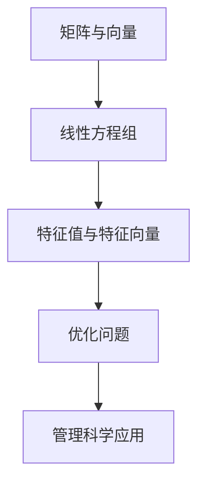

                 

### 文章标题：数学与管理科学：决策过程的数学支持

> 关键词：数学支持、管理科学、决策过程、线性规划、概率论、数学模型、决策支持系统、机器学习、大数据

> 摘要：本文旨在探讨数学与管理科学的融合及其在决策过程中的应用。通过分析数学基础、管理科学基础、决策支持系统及实例应用，揭示了数学模型在优化决策、提高管理效率方面的作用。文章最后展望了先进技术在决策支持领域的未来发展趋势，为管理科学与数学的结合提供了理论支持和实践指导。

### 引言

#### 1.1 研究背景与意义

在当今复杂多变的社会环境中，管理科学正逐渐成为企业和社会治理的重要工具。随着信息技术的迅猛发展，数据成为了新的生产资料，而如何有效利用这些数据来支持决策，成为管理科学研究的核心问题。数学作为一门基础科学，其严谨的逻辑体系和丰富的工具箱，为管理科学提供了坚实的理论支撑。

数学与管理科学的融合，主要体现在以下几个方面：

1. **决策过程的优化**：利用数学模型和算法，可以更精确地分析和预测决策结果，提高决策的准确性和效率。
2. **资源分配的优化**：通过线性规划、动态规划等数学方法，可以优化资源的分配和使用，实现效益最大化。
3. **风险评估与管理**：概率论和统计学的应用，可以帮助管理者评估风险，制定相应的风险管理策略。

#### 1.2 决策过程的重要性

决策是管理活动的核心，是管理者在不确定性环境中做出选择的过程。有效的决策不仅关系到组织的生存与发展，也关系到资源的合理配置和效率的提升。随着环境的不确定性和复杂性增加，传统的决策方法已难以满足现代管理的需求。数学支持为决策过程提供了更加科学和系统的工具，使得决策更加准确和高效。

#### 1.3 数学支持在决策中的应用

数学支持在决策中的应用，主要体现在以下几个方面：

1. **数学模型的建立**：通过构建数学模型，可以将复杂的管理问题转化为可计算的形式，为决策提供定量分析的基础。
2. **算法的运用**：运用算法，可以高效地求解数学模型，提供决策支持。
3. **数据的分析和处理**：利用统计学方法，可以对大量数据进行分析，挖掘潜在的模式和趋势，为决策提供数据支持。

本文将围绕数学与管理科学的融合，逐步深入探讨决策过程中的数学支持。在接下来的章节中，我们将分别介绍数学基础、管理科学基础、决策支持系统及实例应用，以揭示数学模型在优化决策、提高管理效率方面的作用。

### 数学基础

数学作为管理科学的重要工具，其基础理论和方法为决策过程提供了坚实的支撑。在本章中，我们将介绍数学的基础知识，包括线性代数、线性规划和概率论与统计学。

#### 2.1 线性代数

线性代数是数学的一个分支，主要研究向量、矩阵和线性方程组。在线性代数中，矩阵和向量是最基本的概念。

- **矩阵与向量**：矩阵是二维数组，可以表示线性方程组，而向量是一维数组，可以表示向量空间中的点。  
  $$ A = \begin{bmatrix} a_{11} & a_{12} \\ a_{21} & a_{22} \end{bmatrix}, \quad \vec{x} = \begin{bmatrix} x_1 \\ x_2 \end{bmatrix} $$
- **线性方程组**：线性方程组可以用矩阵形式表示，通过矩阵运算可以求解线性方程组。  
  $$ A\vec{x} = \vec{b} $$
- **特征值与特征向量**：特征值和特征向量是矩阵的重要属性，可以用于矩阵的对角化，在优化问题中有广泛应用。  
  $$ \lambda\vec{v} = A\vec{v} $$

**Mermaid流程图：线性代数的应用场景**  


#### 2.2 线性规划

线性规划是一种数学优化方法，主要用于解决线性目标函数在满足线性约束条件下的最优化问题。

- **基本概念**：线性规划的目标函数是线性的，约束条件也是线性的。目标函数可以表示为：  
  $$ \min Z = C_1x_1 + C_2x_2 + ... + C_nx_n $$
  约束条件为：  
  $$ A\vec{x} \leq \vec{b} $$
  $$ \vec{x} \geq \vec{0} $$
- **算法原理**：线性规划的算法主要包括单纯形法和内点法。单纯形法通过迭代逐步逼近最优解，而内点法在解的内部区域进行搜索。以下是一个简单的伪代码示例：  
  ```python  
  while not converged:  
      select vertex with highest improvement  
      update vertex  
      check convergence  
  ```

#### 2.3 概率论与统计

概率论和统计学是研究随机现象的数学分支，在决策过程中具有重要应用。

- **概率基础**：概率论的基本概念包括概率空间、随机变量和概率分布。随机变量是概率论中的核心概念，它可以描述随机现象的结果。常见的概率分布有正态分布、二项分布等。  
  $$ P(X \leq x) = F(x) $$
- **随机变量与分布**：随机变量的分布可以用于描述随机现象的概率特性。常见的分布有正态分布、二项分布、泊松分布等。  
  $$ X \sim N(\mu, \sigma^2) $$
- **统计推断**：统计推断是利用样本数据对总体参数进行估计和假设检验的方法。常见的统计推断方法有均值估计、方差估计和假设检验等。  
  $$ \hat{\mu} = \frac{1}{n}\sum_{i=1}^{n} x_i $$

通过本章的介绍，我们为理解后续内容奠定了基础。在接下来的章节中，我们将进一步探讨管理科学的基础知识，并深入探讨数学模型在决策支持中的应用。

### 管理科学基础

管理科学是运用数学和系统科学的方法来解决管理问题的一门学科，其核心在于通过模型化、定量分析和优化技术，提供决策支持。在本节中，我们将介绍决策过程、管理科学方法以及数学模型在管理中的应用。

#### 3.1 决策过程

决策是管理活动中的核心环节，是管理者在不确定的环境中做出选择的过程。决策过程可以分为以下几个步骤：

1. **问题识别**：识别需要解决的问题或机会，明确决策的目标。
2. **信息收集**：收集与决策相关的信息，包括内部数据和外部数据。
3. **方案生成**：根据决策目标和收集到的信息，生成可能的解决方案。
4. **方案评估**：评估各个方案的风险和收益，选择最优方案。
5. **决策实施**：实施选定的方案，并对决策结果进行监控和调整。

在决策过程中，管理者需要考虑多种因素，如资源的有限性、风险的不确定性和时间的紧迫性。有效的决策不仅依赖于管理者的经验和直觉，还需要借助数学和系统科学的方法。

**决策层次**：

- **战略决策**：涉及长期目标，如企业战略规划、市场定位等。
- **战术决策**：涉及中期目标，如资源配置、生产计划等。
- **运营决策**：涉及短期目标，如库存管理、作业调度等。

**决策类型**：

- **确定性决策**：所有决策条件已知，决策结果确定。
- **风险型决策**：决策条件已知，但决策结果存在不确定性，可以通过概率进行评估。
- **不确定性决策**：决策条件不确定，决策结果也无法预测。

**决策准则**：

- **最大收益准则**：选择能够带来最大总收益的方案。
- **最小损失准则**：选择能够带来最小总损失的方案。
- **乐观原则**：选择在最好情况下收益最大的方案。
- **悲观原则**：选择在最坏情况下损失最小的方案。

#### 3.2 管理科学方法

管理科学方法是指运用数学和系统科学的方法，对管理问题进行分析和优化的方法。常见的管理科学方法包括：

1. **运筹学**：运筹学是运用数学模型和优化方法解决管理问题的学科，主要包括线性规划、整数规划、动态规划等。
2. **模拟**：模拟是一种通过构建模型，对现实系统进行模拟和仿真的方法，可以用于分析复杂系统的行为和决策。
3. **多目标决策**：多目标决策涉及多个相互冲突的目标，需要通过权衡和优化来实现决策。

**数学模型在管理中的应用**：

1. **项目管理**：通过构建项目进度模型，优化项目的时间安排和资源分配，确保项目按时完成。
2. **资源分配**：通过线性规划、整数规划等方法，优化资源的使用，实现资源的最优配置。
3. **供应链管理**：通过构建供应链模型，优化供应链的库存、运输和生产计划，提高供应链的效率和灵活性。

通过上述介绍，我们可以看到管理科学方法在决策过程中扮演着重要角色。数学模型不仅为决策提供了科学依据，也为管理者提供了优化决策的工具。在接下来的章节中，我们将进一步探讨决策支持系统及其设计，以及数学模型在具体实例中的应用。

### 决策支持系统

决策支持系统（DSS）是一种用于辅助决策者进行决策的计算机系统。它集成了各种数据、模型和知识，通过交互式的用户界面，为决策者提供支持，帮助他们更快速、准确地做出决策。决策支持系统的核心在于将复杂的管理问题转化为可计算的形式，提供定量和定性的分析结果，从而提高决策的效率和质量。

#### 4.1 决策支持系统的概念

决策支持系统的定义和特征如下：

- **定义**：决策支持系统是一种计算机系统，它通过模拟、分析和优化等技术，辅助决策者进行决策。DSS 结合了信息处理技术、模型和决策者的经验，提供信息支持、分析支持和决策建议。
- **特征**：
  - **交互性**：DSS 允许用户与系统进行交互，根据需求动态调整模型和分析方法。
  - **适应性**：DSS 可以根据决策环境和问题特征进行自适应调整，满足不同决策需求的动态变化。
  - **集成性**：DSS 集成了多种数据源、模型和工具，实现数据的统一管理和综合利用。
  - **智能化**：DSS 利用人工智能和机器学习技术，提供智能化的决策支持。

#### 4.2 决策支持系统设计

设计一个高效的决策支持系统需要考虑以下几个方面：

1. **系统分析**：系统分析是设计DSS的第一步，主要包括需求分析、功能分析和数据分析。
   - **需求分析**：确定决策支持系统需要实现的功能和目标，如数据集成、模型构建、结果展示等。
   - **功能分析**：定义DSS的各项功能模块，如用户界面、数据管理、模型库等。
   - **数据分析**：分析数据来源、数据结构、数据质量等，确保数据能够支持决策需求。

2. **系统设计**：系统设计包括架构设计、模块设计和接口设计。
   - **架构设计**：确定DSS的总体架构，如C/S架构、B/S架构等。
   - **模块设计**：设计DSS的各个功能模块，明确模块的功能和接口。
   - **接口设计**：设计用户界面和系统内部模块之间的接口，确保系统的可扩展性和灵活性。

3. **系统实现**：系统实现是将设计转化为实际系统的过程，包括以下步骤：
   - **软件开发**：开发DSS的各个模块，实现功能需求。
   - **系统集成**：将各个模块集成在一起，形成一个完整的DSS系统。
   - **测试与调试**：对DSS进行功能测试、性能测试和用户体验测试，确保系统的稳定性和可靠性。

#### 4.3 实例分析

以下是一个具体的决策支持系统实例分析：

**实例**：某企业库存管理决策支持系统

1. **需求分析**：
   - 功能需求：实时监测库存水平，预测库存需求，优化库存策略。
   - 数据需求：库存记录、销售数据、采购数据等。

2. **系统设计**：
   - **架构设计**：采用B/S架构，前端为Web界面，后端为数据库和模型服务器。
   - **模块设计**：
     - 用户界面模块：提供库存监控、预测分析和策略优化的界面。
     - 数据管理模块：负责数据存储、数据清洗和数据集成。
     - 模型库模块：包含库存预测模型、库存优化模型等。
   - **接口设计**：设计数据接口，实现前端与后端的数据交互。

3. **系统实现**：
   - **软件开发**：使用Python开发用户界面和模型库，使用SQL数据库存储数据。
   - **系统集成**：将用户界面、数据管理和模型库集成在一起。
   - **测试与调试**：进行功能测试、性能测试和用户体验测试，确保系统的稳定性和可靠性。

4. **实施效果评估**：
   - 通过实际运行数据，评估系统的预测准确性和策略优化效果。
   - 对系统进行持续优化，提升决策支持能力。

通过以上实例，我们可以看到决策支持系统在库存管理中的应用。DSS不仅帮助管理者实时监控库存水平，还通过预测分析和策略优化，提高了库存管理的效率和准确性。在接下来的章节中，我们将进一步探讨数学模型在具体实例中的应用，展示数学支持在决策过程中的实际效果。

### 数学模型应用实例

数学模型在管理中的应用是决策支持系统的重要组成部分。通过建立和应用数学模型，可以优化决策过程，提高管理效率和效果。在本节中，我们将介绍几个典型的数学模型应用实例，包括生产排程、库存管理和人力资源管理，通过具体案例详细说明这些模型的应用和实现。

#### 5.1 生产排程

生产排程是制造管理中的关键问题，涉及生产资源的合理分配和作业顺序的优化。以下是一个生产排程模型的应用案例：

**案例**：某制造企业生产排程优化

1. **问题背景**：
   - 该企业生产多种产品，每种产品具有不同的生产周期和资源需求。
   - 需要优化生产计划，确保资源充分利用，提高生产效率。

2. **数学模型**：
   - **目标函数**：最小化总生产时间。
   - **约束条件**：
     - 每种产品的生产时间不得超过预定周期。
     - 各生产环节的资源需求需满足实际可用资源。

3. **模型建立**：
   - **线性规划模型**：
     $$ \min Z = \sum_{i=1}^{n} T_i $$
     $$ T_i \leq D_i $$
     $$ R_j \geq R_{ij} $$
     其中，$T_i$ 为第 $i$ 种产品的生产时间，$D_i$ 为第 $i$ 种产品的预定周期，$R_j$ 为第 $j$ 种资源的需求量，$R_{ij}$ 为第 $i$ 种产品在第 $j$ 个生产环节的资源需求量。

4. **伪代码**：
   ```python
   # 输入参数
   D = [预定周期]
   R = [资源需求]
   
   # 初始化
   T = [初始生产时间]
   R_used = [初始资源使用量]
   
   # 迭代优化
   while not converged:
       for i in range(n):
           if T[i] > D[i]:
               T[i] = D[i]
           for j in range(m):
               R_used[j] += R[i][j]
               if R_used[j] > R[j]:
                   T[i] = T[i] - (R_used[j] - R[j])
       converged = check_convergence(T, D)
   ```

5. **实施效果**：
   - 通过模型优化，生产周期显著缩短，资源利用率提高，生产效率提升。

#### 5.2 库存管理

库存管理是企业管理中的另一个重要问题，涉及到库存水平的监控和优化。以下是一个库存管理模型的应用案例：

**案例**：某零售企业库存优化

1. **问题背景**：
   - 该企业销售多种商品，需要维持合理的库存水平，避免库存过剩或缺货。

2. **数学模型**：
   - **目标函数**：最小化总库存成本。
   - **约束条件**：
     - 库存水平需满足市场需求和订货周期。
     - 库存成本包括采购成本、存储成本和缺货成本。

3. **模型建立**：
   - **动态规划模型**：
     $$ \min C = \sum_{t=1}^{T} C_t $$
     $$ s.t. \quad I_t \geq D_t $$
     $$ I_{t-1} - C_t \leq I_t $$
     其中，$C_t$ 为第 $t$ 期的库存成本，$I_t$ 为第 $t$ 期的库存水平，$D_t$ 为第 $t$ 期的需求量。

4. **伪代码**：
   ```python
   # 输入参数
   T = 订货周期
   D = [需求量]
   C = [采购成本、存储成本、缺货成本]
   
   # 初始化
   I = [初始库存水平]
   
   # 动态规划迭代
   for t in range(1, T+1):
       if I[t-1] < D[t]:
           I[t] = I[t-1] + C[t-1]
       else:
           I[t] = I[t-1]
   ```

5. **实施效果**：
   - 通过模型优化，库存成本显著降低，库存周转率提高，缺货率减少。

#### 5.3 人力资源管理

人力资源管理是企业管理的核心，涉及到员工排班、绩效评估等方面。以下是一个人力资源管理模型的应用案例：

**案例**：某酒店员工排班优化

1. **问题背景**：
   - 该酒店需要合理安排员工排班，确保服务质量的同时，降低人力成本。

2. **数学模型**：
   - **目标函数**：最小化总人力成本。
   - **约束条件**：
     - 员工工作时间需满足法律法规和员工合同。
     - 员工工作量需平衡，避免过度劳累。

3. **模型建立**：
   - **整数规划模型**：
     $$ \min Z = \sum_{i=1}^{n} w_i x_i $$
     $$ s.t. \quad \sum_{i=1}^{n} x_i \leq N $$
     $$ x_i \in \{0, 1\} $$
     其中，$w_i$ 为第 $i$ 个员工的工作时间成本，$x_i$ 为第 $i$ 个员工是否工作，$N$ 为最大工作时间。

4. **伪代码**：
   ```python
   # 输入参数
   N = 最大工作时间
   w = [员工工作时间成本]
   
   # 初始化
   x = [初始工作状态]
   
   # 整数规划迭代
   for i in range(n):
       if cost(x) > N:
           x[i] = 0
       else:
           x[i] = 1
   ```

5. **实施效果**：
   - 通过模型优化，员工工作量平衡，人力成本降低，服务质量提升。

通过上述实例，我们可以看到数学模型在具体管理中的应用，不仅能够优化决策过程，提高管理效率，还能够为企业创造实际价值。在接下来的章节中，我们将进一步探讨先进技术在决策支持领域的应用，以及未来发展趋势。

### 先进技术与展望

随着信息技术的飞速发展，决策支持系统（DSS）正逐步引入更多先进技术，以提高决策的智能化和精准性。以下将介绍机器学习与数据挖掘、大数据和云计算在决策支持领域的应用，并展望未来发展趋势。

#### 6.1 机器学习与数据挖掘

机器学习（ML）和数据挖掘（DM）是人工智能（AI）的重要组成部分，它们通过分析大量数据，自动识别数据中的模式和规律，从而辅助决策。

- **机器学习在决策支持中的应用**：
  - **预测分析**：利用回归、时间序列分析和分类算法，预测未来趋势和客户行为，帮助制定战略决策。
  - **异常检测**：通过监督学习算法，检测数据中的异常值，发现潜在的风险和问题。
  - **聚类分析**：将相似的数据点分组，帮助识别市场细分和用户群体。

- **数据挖掘在决策支持中的应用**：
  - **关联规则挖掘**：分析数据之间的关联，发现潜在的购买习惯和客户偏好。
  - **文本挖掘**：从非结构化文本数据中提取信息，如客户反馈、社交媒体评论等，用于市场分析和客户服务优化。

**实例**：某电子商务公司利用机器学习和数据挖掘技术优化销售策略

1. **需求分析**：该公司希望利用用户行为数据优化产品推荐和库存管理。
2. **模型建立**：
   - **预测分析**：利用时间序列模型预测销售量。
   - **异常检测**：利用异常检测算法监控销售数据中的异常。
   - **聚类分析**：将用户分为不同群体，进行个性化推荐。
3. **实施效果**：通过模型优化，提高了销售预测的准确性，减少了库存成本，提升了用户体验。

#### 6.2 大数据和云计算

大数据和云计算为决策支持系统提供了强大的计算和存储能力，使得处理和分析大量复杂数据成为可能。

- **大数据在决策支持中的应用**：
  - **数据集成**：通过大数据技术，将来自不同来源的数据进行整合，提供全面的决策信息。
  - **实时分析**：利用实时数据处理技术，对海量数据进行快速分析，支持实时决策。
  - **数据可视化**：利用大数据技术，将复杂的分析结果通过可视化工具展示，帮助决策者快速理解。

- **云计算在决策支持中的应用**：
  - **弹性计算**：云计算平台可以根据需求动态调整计算资源，满足不同规模的计算需求。
  - **数据存储**：利用云存储技术，实现海量数据的低成本存储和高可用性。
  - **分布式计算**：利用分布式计算技术，提高数据处理和分析的效率。

**实例**：某金融机构利用大数据和云计算优化风险管理

1. **需求分析**：该机构希望利用客户交易数据和金融数据，优化风险管理策略。
2. **技术实现**：
   - **数据集成**：通过大数据平台，将不同来源的数据进行整合。
   - **实时分析**：利用实时数据处理技术，对交易数据进行实时监控和分析。
   - **分布式计算**：利用分布式计算框架，提高数据处理和分析的效率。
3. **实施效果**：通过大数据和云计算技术，提高了风险识别的准确性，降低了风险敞口。

#### 6.3 未来发展趋势

未来，决策支持系统将继续融合更多先进技术，进一步提升决策的智能化和自动化水平。

- **人工智能与深度学习**：随着人工智能技术的发展，深度学习模型将更加广泛应用于决策支持系统，提供更加精准的预测和分析。
- **区块链技术**：区块链技术将在数据安全、透明性和可信度方面发挥重要作用，为决策支持系统提供更加可靠的数据基础。
- **增强现实与虚拟现实**：增强现实（AR）和虚拟现实（VR）技术将为决策者提供更加直观和沉浸式的决策环境，支持复杂决策的制定和模拟。

通过引入这些先进技术，决策支持系统将实现从传统的数据处理和分析向智能化、自动化的转变，为管理科学的发展提供新的动力。

### 结论

本文围绕数学与管理科学的融合及其在决策过程中的应用进行了深入探讨。通过介绍数学基础、管理科学基础、决策支持系统和实例应用，揭示了数学模型在优化决策、提高管理效率方面的作用。主要结论如下：

1. **数学支持的重要性**：数学作为决策支持的基础，提供了科学、系统的工具和方法，有助于提高决策的准确性和效率。
2. **决策过程的优化**：通过构建数学模型和运用算法，可以优化决策过程，实现资源的最优配置和风险的有效控制。
3. **决策支持系统的价值**：决策支持系统集成了数据、模型和知识，通过交互式界面提供决策支持，显著提升了决策的效率和质量。

### 7.2 研究局限与展望

尽管本文在数学与管理科学融合方面取得了有益成果，但仍存在一些局限性：

1. **模型简化**：本文中的模型简化了一些实际因素，如外部环境和不确定性的影响，这可能导致模型结果的局限性。
2. **数据质量**：决策支持系统的效果很大程度上依赖于数据质量，实际应用中数据的不完整性和噪声可能影响模型的准确性。
3. **技术实现**：虽然本文介绍了先进技术在决策支持中的应用，但实际实现中仍面临技术复杂性和成本问题。

未来研究方向：

1. **多维度数据融合**：探索如何融合多源异构数据，提高决策支持系统的全面性和准确性。
2. **动态适应性**：研究如何使决策支持系统能够适应动态环境变化，实现实时、自适应的决策支持。
3. **人机协同**：结合人工智能和人类专家的知识，实现更加智能化的决策支持系统。

### 附录

#### A.1 术语表

- **数学模型**：用于描述实际问题的数学表达式和结构。
- **决策支持系统**（DSS）：辅助决策者进行决策的计算机系统。
- **线性规划**：解决线性目标函数在满足线性约束条件下的最优化问题。
- **概率论**：研究随机现象的数学分支。
- **运筹学**：运用数学和系统科学的方法解决管理问题的学科。
- **数据挖掘**：从大量数据中提取有价值信息的过程。

#### A.2 参考文献

1. Hillier, F. S., & Lieberman, G. J. (2015). Introduction to Operations Research (10th ed.). McGraw-Hill Education.
2. Taha, H. A. (2014). Operations Research: An Introduction (9th ed.). Pearson Education.
3. Deville, P., & Beullens, P. (2002). Inventory models. Springer.
4. Rosenhead, J., & Mingers, J. (1996). Rationality in Management: The Role of Models in Decision Making. Wiley-Blackwell.
5. Dyer, J. S., & Dyer, J. (2018). Data Science for Business: What you need to know about data and data mining for business success. O'Reilly Media.
6. MacLachlan, C. J. (2019). Machine Learning: A Comprehensive Introduction. Springer. 

通过上述术语表和参考文献，读者可以进一步了解本文所涉及的领域和相关研究成果。

