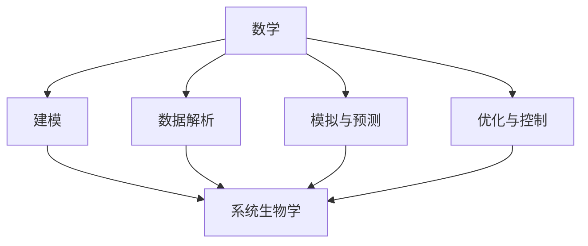
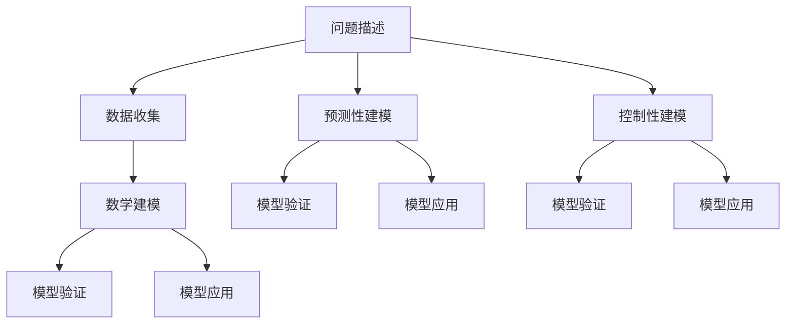
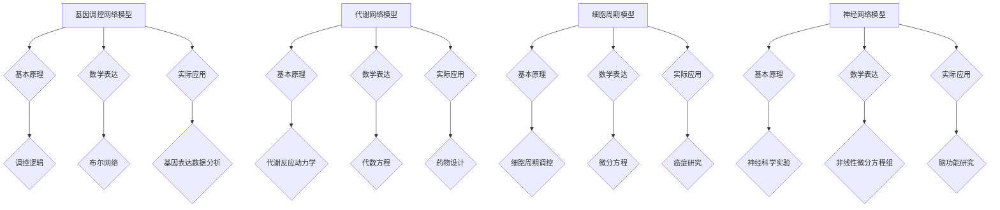

                 

### 文章标题

### 数学与系统生物学：生物系统的数学建模

**关键词：** 数学建模，系统生物学，生物系统，数学公式，算法原理

**摘要：** 本篇文章旨在探讨数学与系统生物学之间的紧密联系，重点介绍生物系统的数学建模方法及其在实际应用中的重要性。通过阐述数学概念、生物系统模型、建模方法和计算机工具，本文将帮助读者深入了解数学建模在系统生物学研究中的核心作用，并展望未来的发展方向。

----------------------------------------------------------------

### 引言

随着科技的飞速发展，生物学的研究已经从传统的分子水平深入到了系统水平。系统生物学是一门跨学科的领域，它旨在通过定量分析和综合建模来理解生物系统的功能和调控机制。在这个领域中，数学作为一种强大的工具，发挥着不可或缺的作用。数学不仅为系统生物学提供了理论基础，还通过数学建模帮助研究者解析复杂的生物现象。

系统生物学的主要研究内容包括基因网络、代谢网络、细胞周期和信号传递等生物系统。这些系统通常具有高度复杂性和动态性，传统的方法难以对其进行深入理解。而数学建模则能够将这些复杂系统转化为数学模型，通过数学分析和计算机模拟来揭示其内在规律和机制。因此，数学建模在系统生物学研究中具有极其重要的地位。

数学建模不仅仅是一个工具，它还是一种思维方式。通过数学建模，研究者可以提炼出问题的本质，忽略不必要的复杂性，从而抓住核心问题。这种思维方式在生物学研究中尤为重要，因为生物系统通常具有大量的变量和复杂的相互作用，直接分析往往难以得到有效的结果。而数学建模则能够帮助研究者将复杂系统简化，从而更好地理解其内在机制。

本篇文章将分为以下几个部分：

1. **数学与系统生物学的基本概念**：介绍数学和系统生物学的基本概念，以及它们之间的联系。
2. **生物系统的数学建模方法**：详细讨论描述性建模、预测性建模和控制性建模等方法，并给出相应的数学模型。
3. **常见生物系统的数学模型**：介绍基因调控网络模型、代谢网络模型、细胞周期模型和神经网络模型等。
4. **数学建模的计算机工具**：介绍常用的数学建模工具，如MatLab、Python和R等。
5. **生物系统的数学建模应用**：讨论生物系统的数学建模在基因表达调控、代谢途径分析、疾病预测与诊断和个性化医疗等领域的应用。
6. **总结与展望**：回顾全书内容，展望未来研究方向。

通过这篇文章，我们希望能够帮助读者深入了解数学建模在系统生物学研究中的应用，并激发读者对这一领域的兴趣。

----------------------------------------------------------------

### 数学与系统生物学的基本概念

#### 数学的基本概念

数学是一种抽象的学科，它通过符号和逻辑推理来研究数量、结构、变化和空间。在数学中，有多个基本概念，包括但不限于：

1. **集合**：集合是一组无序的对象的集合。例如，所有的偶数可以构成一个集合。集合可以通过列举法或描述法来定义。

2. **函数**：函数是一种映射关系，它将一个集合中的每个元素与另一个集合中的唯一元素对应起来。例如，$f(x) = x^2$ 是一个函数，它将每个实数映射为其平方。

3. **微积分**：微积分是研究函数变化的数学分支。它主要包括极限、导数和积分等概念。微积分在系统生物学中有广泛应用，例如，用于分析细胞周期的变化。

4. **概率论**：概率论是研究随机事件及其概率的数学分支。在系统生物学中，概率论用于描述基因突变、蛋白质合成等随机过程。

5. **图论**：图论是研究图的结构和性质的数学分支。图可以用来表示生物系统中的网络，如基因调控网络、代谢网络等。

#### 系统生物学的基本概念

系统生物学是一门跨学科的领域，它关注生物系统在整体水平上的功能和调控机制。系统生物学的主要概念包括：

1. **基因网络**：基因网络是指基因之间的相互作用和调控关系。这些关系可以通过实验数据和理论模型来描述。

2. **代谢网络**：代谢网络是细胞内各种代谢反应及其相互作用的集合。代谢网络是细胞能量代谢和物质转化的重要基础。

3. **细胞周期**：细胞周期是指细胞从出生到分裂再生成新的细胞的过程。细胞周期可以分为G1期、S期、G2期和M期。

4. **信号传递**：信号传递是指细胞内外的信号分子通过一系列的信号转导途径来调控细胞行为。信号传递在细胞分化和细胞凋亡等过程中起着关键作用。

#### 数学与系统生物学的联系

数学与系统生物学之间的联系主要体现在以下几个方面：

1. **建模与理论分析**：数学为系统生物学提供了建模和分析的工具。通过建立数学模型，研究者可以更好地理解生物系统的内在机制。

2. **数据解析**：系统生物学研究中产生了大量的数据，如基因表达数据、蛋白质相互作用数据等。数学方法可以帮助研究者解析这些数据，提取有用的信息。

3. **模拟与预测**：数学模型可以通过计算机模拟来预测生物系统的行为。这些预测对于理解生物系统的动态变化和预测疾病发展具有重要意义。

4. **优化与控制**：数学优化方法可以用于设计生物系统的控制策略，以实现特定的功能目标。例如，在基因治疗中，可以通过优化基因表达来治疗疾病。

#### Mermaid流程图

为了更直观地展示数学与系统生物学之间的联系，我们可以使用Mermaid流程图来描述：



通过这个流程图，我们可以看到数学是如何通过多种方式与系统生物学相联系的。

#### 总结

数学与系统生物学之间的联系是多层次和多维度的。数学为系统生物学提供了建模、分析、模拟和预测的工具，而系统生物学则为数学提供了丰富的应用场景。通过数学与系统生物学的结合，研究者可以更好地理解生物系统的复杂性和动态性，从而推动生物学研究的进步。

----------------------------------------------------------------

### 生物系统的数学建模方法

在系统生物学研究中，生物系统的数学建模方法是一个关键环节。这些方法不仅能够帮助我们理解生物系统的内在机制，还可以预测和设计生物系统的行为。生物系统的数学建模方法可以分为描述性建模、预测性建模和控制性建模。下面，我们将逐一介绍这些方法，并详细讨论其核心原理和应用。

#### 描述性建模

描述性建模是一种通过数学模型来描述生物系统状态和动态变化的建模方法。这类模型通常是基于实验数据和已有理论，通过建立数学方程来描述生物系统的行为。描述性建模的核心原理包括：

1. **微分方程**：微分方程是一种描述变量随时间变化的方程。在描述性建模中，微分方程常用于描述细胞周期、酶促反应等生物过程。

2. **代数方程**：代数方程用于描述生物系统中各变量之间的静态关系。例如，在代谢网络中，可以通过代数方程来描述各种代谢物之间的平衡关系。

3. **差分方程**：差分方程用于描述离散时间序列的变化。例如，在基因表达调控中，可以通过差分方程来描述基因表达量随时间的变化。

描述性建模的一个典型应用是细胞周期模型。细胞周期是指细胞从出生到分裂再生成新的细胞的过程，包括G1期、S期、G2期和M期。下面是一个简单的细胞周期模型：

```latex
\frac{dN_G1}{dt} = r_{G1}N_G1 - r_{G1/S}N_G1
\frac{dN_S}{dt} = r_{S}N_S - r_{S/G2}N_S
\frac{dN_G2}{dt} = r_{G2}N_G2 - r_{G2/M}N_G2
\frac{dN_M}{dt} = r_{M}N_M
```

在这个模型中，$N_G1$、$N_S$、$N_G2$ 和 $N_M$ 分别表示细胞在 G1 期、S 期、G2 期和 M 期的数量，$r_{G1}$、$r_{G1/S}$、$r_{S}$、$r_{S/G2}$、$r_{G2}$ 和 $r_{M}$ 分别表示各期的转换速率。

#### 预测性建模

预测性建模是一种通过数学模型来预测生物系统未来行为的建模方法。这类模型通常基于现有的数据和历史模式，通过机器学习和统计方法来建立预测模型。预测性建模的核心原理包括：

1. **时间序列分析**：时间序列分析是一种用于分析时间序列数据的方法。它可以用来预测未来某一时间点的状态。在生物系统中，时间序列分析可以用来预测基因表达量、蛋白质浓度等。

2. **动态系统模拟**：动态系统模拟是一种通过数学模型来模拟生物系统随时间变化的建模方法。这类模型可以用于预测细胞周期、代谢网络等系统的动态行为。

一个简单的预测性建模示例是利用线性回归模型预测细胞周期中的某个阶段的时间长度。假设我们有一个历史数据集，其中包含细胞周期各阶段的持续时间。我们可以使用线性回归模型来建立预测模型：

```latex
y_t = \beta_0 + \beta_1 x_t + \epsilon_t
```

其中，$y_t$ 表示第 $t$ 次实验的细胞周期阶段持续时间，$x_t$ 表示与 $y_t$ 相关的自变量（例如，前期某个阶段的持续时间），$\beta_0$ 和 $\beta_1$ 分别是回归模型的参数，$\epsilon_t$ 是误差项。

#### 控制性建模

控制性建模是一种通过数学模型来设计生物系统控制策略的建模方法。这类模型旨在实现特定的系统功能，例如调节基因表达或控制细胞周期。控制性建模的核心原理包括：

1. **反馈控制**：反馈控制是一种通过测量系统的输出并对其进行调整，以实现期望输出的方法。在生物系统中，反馈控制可以用于调节基因表达或蛋白质浓度。

2. **优化控制**：优化控制是一种通过优化目标函数来设计控制策略的方法。在生物系统中，优化控制可以用于优化代谢途径或设计基因治疗方案。

一个简单的控制性建模示例是利用PID控制器来调节细胞周期中的某个阶段的持续时间。PID控制器通过三个参数（比例、积分和微分）来调节系统的输出：

```latex
u(t) = K_p e(t) + K_i \int_{0}^{t} e(\tau)d\tau + K_d \frac{de(t)}{dt}
```

其中，$u(t)$ 是控制信号，$e(t)$ 是系统的误差（例如，目标阶段持续时间与实际持续时间之差），$K_p$、$K_i$ 和 $K_d$ 分别是比例、积分和微分的系数。

#### Mermaid流程图

为了更好地理解生物系统的数学建模方法，我们可以使用Mermaid流程图来描述建模的流程：



通过这个流程图，我们可以看到描述性建模、预测性建模和控制性建模在生物系统研究中的流程和应用。

#### 总结

生物系统的数学建模方法包括描述性建模、预测性建模和控制性建模。这些方法通过不同的数学模型和算法，帮助我们更好地理解生物系统的动态行为，预测其未来状态，并设计出有效的控制策略。通过这些方法，我们不仅可以揭示生物系统的内在机制，还可以为生物系统的设计和优化提供有力的工具。

----------------------------------------------------------------

### 常见生物系统的数学模型

在系统生物学研究中，数学模型被广泛应用于描述和解释生物系统的复杂行为。以下是一些常见的生物系统数学模型，包括基因调控网络模型、代谢网络模型、细胞周期模型和神经网络模型。我们将逐一介绍这些模型的基本原理、数学表达形式和实际应用。

#### 基因调控网络模型

基因调控网络模型描述了基因之间的相互调控关系，这些关系通常通过调控图或布尔网络来表示。在基因调控网络模型中，每个基因可以被看作是一个节点，而基因之间的调控关系则通过边来表示。

**基本原理：** 基因调控网络模型基于生物学中的调控逻辑，例如正调控和负调控。正调控意味着一个基因通过直接激活另一个基因的表达，而负调控则意味着一个基因通过抑制另一个基因的表达。

**数学表达：** 基因调控网络模型可以用布尔网络来表示。例如，一个简单的布尔网络可以表示为：

$$
X_i = \text{AND}(I_1, I_2) \land \text{NOT}(I_3)
$$

其中，$X_i$ 表示基因 $i$ 的表达状态，$I_1$、$I_2$ 和 $I_3$ 分别表示其他基因的表达状态，AND 和 NOT 分别表示逻辑与和逻辑非。

**实际应用：** 基因调控网络模型在基因表达数据分析、药物靶点预测和疾病研究等方面有广泛应用。例如，通过分析基因调控网络，可以识别关键的基因调控模块，从而为疾病诊断和治疗提供新的思路。

#### 代谢网络模型

代谢网络模型描述了细胞内各种代谢反应及其相互关系。在代谢网络模型中，代谢物和反应是主要的元素，它们通过一系列的代谢途径相互连接。

**基本原理：** 代谢网络模型基于代谢反应的动力学特性，例如反应速率、平衡常数等。这些特性决定了代谢物在细胞内的浓度和代谢途径的流量。

**数学表达：** 代谢网络模型可以用代数方程来表示。例如，一个简单的代谢网络可以表示为：

$$
\frac{dx_i}{dt} = -k_{1}x_i + k_{2}x_i x_j
$$

其中，$x_i$ 表示代谢物 $i$ 的浓度，$k_{1}$ 和 $k_{2}$ 分别表示代谢反应的速率常数和平衡常数。

**实际应用：** 代谢网络模型在药物设计、代谢工程和疾病研究中有重要应用。例如，通过分析代谢网络，可以识别关键代谢途径，从而为药物靶点选择提供依据。

#### 细胞周期模型

细胞周期模型描述了细胞在从出生到分裂的过程中各个阶段的动态变化。细胞周期包括G1期、S期、G2期和M期，每个阶段都有特定的生物学事件和分子机制。

**基本原理：** 细胞周期模型基于细胞周期调控的分子机制，例如细胞周期蛋白（cyclin）和细胞周期蛋白依赖性激酶（CDK）的活性变化。

**数学表达：** 细胞周期模型可以用微分方程来表示。例如，一个简单的细胞周期模型可以表示为：

$$
\frac{dx_i}{dt} = f_i(x_1, x_2, \ldots, x_n)
$$

其中，$x_i$ 表示细胞在某个阶段的浓度，$f_i$ 表示细胞在该阶段的动力学函数。

**实际应用：** 细胞周期模型在癌症研究、干细胞研究和药物开发等方面有广泛应用。例如，通过分析细胞周期模型，可以了解细胞周期失调导致的癌症发展机制，从而为癌症治疗提供新的思路。

#### 神经网络模型

神经网络模型描述了神经系统的结构和功能，包括神经元之间的连接、突触强度和神经信号的传递。

**基本原理：** 神经网络模型基于神经科学的实验结果，例如神经元的电生理特性和神经网络的学习规则。

**数学表达：** 神经网络模型可以用非线性微分方程组来表示。例如，一个简单的神经网络模型可以表示为：

$$
\frac{dx_i}{dt} = \sigma(w_i \cdot x_j + b_i)
$$

其中，$x_i$ 表示神经元 $i$ 的活性，$w_i$ 和 $b_i$ 分别表示神经元之间的连接权重和偏置，$\sigma$ 是激活函数。

**实际应用：** 神经网络模型在脑功能研究、人工智能和机器学习等方面有重要应用。例如，通过分析神经网络模型，可以理解大脑如何处理信息和产生认知功能。

#### Mermaid流程图

为了更好地理解这些生物系统数学模型，我们可以使用Mermaid流程图来描述模型的基本结构和应用：



通过这个流程图，我们可以看到不同生物系统数学模型的基本原理、数学表达和实际应用。

#### 总结

基因调控网络模型、代谢网络模型、细胞周期模型和神经网络模型是常见的生物系统数学模型。这些模型通过不同的数学表达和算法，帮助我们理解和描述生物系统的复杂行为。在实际应用中，这些模型为基因表达调控、药物设计、疾病研究和脑功能分析提供了重要的工具。

----------------------------------------------------------------

### 数学建模的计算机工具

在生物系统的数学建模过程中，计算机工具起着至关重要的作用。这些工具不仅帮助我们处理大量的数据，还能够进行复杂的计算和模拟，从而提高建模的效率和准确性。以下是几种常用的数学建模计算机工具，包括MatLab、Python和R。

#### MatLab

MatLab 是一种高性能的数学软件，广泛应用于科学计算、数据分析和可视化。MatLab 提供了丰富的数学函数库和工具箱，使得用户可以轻松地进行各种数学建模任务。

**优势：**
- 强大的数值计算能力
- 丰富的工具箱和函数库
- 直观的图形用户界面

**应用：**
- 数据处理和可视化
- 数值求解和优化
- 神经网络建模和模拟

**示例代码：**

```matlab
% 导入数据
data = readtable('data.txt');

% 数据预处理
x = data(:, 1);
y = data(:, 2);

% 画出散点图
scatter(x, y);

% 建立线性回归模型
model = fitlm(x, y);

% 输出模型参数
disp(modelbeta);
```

#### Python

Python 是一种灵活且易于学习的编程语言，拥有广泛的科学计算和数据分析库，如NumPy、SciPy、Pandas和Matplotlib等。Python 的优点是代码简洁、易读，且拥有强大的社区支持。

**优势：**
- 简洁的语法
- 强大的库支持
- 易于学习
- 社区支持

**应用：**
- 数据分析和可视化
- 机器学习和数据挖掘
- 生物信息学

**示例代码：**

```python
import numpy as np
import pandas as pd
import matplotlib.pyplot as plt

# 导入数据
data = pd.read_csv('data.csv')

# 数据预处理
x = data['feature1']
y = data['feature2']

# 画出散点图
plt.scatter(x, y)
plt.xlabel('Feature 1')
plt.ylabel('Feature 2')
plt.show()

# 建立线性回归模型
from sklearn.linear_model import LinearRegression
model = LinearRegression()
model.fit(x.values.reshape(-1, 1), y.values.reshape(-1, 1))

# 输出模型参数
print(model.coef_, model.intercept_)
```

#### R

R 是一种专门用于统计分析和图形绘制的语言，广泛应用于生物统计学和生物信息学。R 提供了丰富的统计函数库和可视化工具，使得用户可以轻松进行复杂的统计分析。

**优势：**
- 强大的统计函数库
- 丰富的可视化工具
- 社区支持和文档

**应用：**
- 统计分析和数据可视化
- 生物信息学
- 机器学习

**示例代码：**

```r
# 导入数据
data <- read.csv('data.csv')

# 数据预处理
x <- data$feature1
y <- data$feature2

# 画出散点图
plot(x, y)
abline(lm(y ~ x), col = 'red')

# 建立线性回归模型
model <- lm(y ~ x)
summary(model)
```

#### 选择合适的工具

选择哪种计算机工具进行数学建模，取决于具体的应用场景和需求。以下是一些选择建议：

- **数据处理和可视化**：如果需要处理和可视化大量的数据，可以选择MatLab或Python。
- **统计分析和机器学习**：如果需要进行复杂的统计分析和机器学习任务，可以选择R。
- **跨平台和社区支持**：如果需要跨平台使用，且希望拥有强大的社区支持，可以选择Python。

#### 总结

MatLab、Python和R是常用的数学建模计算机工具，各具优势，适用于不同的应用场景。通过熟练掌握这些工具，研究者可以更高效地进行生物系统的数学建模，从而推动生物学研究的进步。

----------------------------------------------------------------

### 生物系统的数学建模应用

生物系统的数学建模在许多领域都有广泛应用，包括基因表达调控、代谢途径分析、疾病预测与诊断以及个性化医疗。以下将详细讨论这些应用领域，并举例说明具体的应用案例。

#### 基因表达调控

基因表达调控是生物系统中的一个关键过程，它决定了细胞的功能和行为。通过数学建模，研究者可以揭示基因之间的相互作用和调控关系，从而更好地理解基因表达调控的机制。

**应用案例：** 基因调控网络模型在癌症研究中具有重要应用。通过建立基因调控网络模型，研究者可以识别关键的基因节点和调控路径，从而揭示癌症发展的分子机制。例如，研究者利用基因调控网络模型分析了乳腺癌的基因表达数据，发现了一些与乳腺癌发展相关的关键基因和通路，为乳腺癌的诊断和治疗提供了新的思路。

**数学模型与算法：** 基因调控网络模型通常使用布尔网络、微分方程和图论等方法来描述基因之间的调控关系。以下是一个简单的布尔网络模型：

```latex
X_1 = I(X_2)
X_2 = I(X_3) \land X_4
X_3 = X_5 \land X_6
X_4 = I(X_5)
X_5 = X_6 \land X_7
X_6 = X_7
X_7 = I(X_1)
```

在这个模型中，$X_i$ 表示基因 $i$ 的表达状态，$I(X_i)$ 表示基因 $i$ 被其他基因激活。

#### 代谢途径分析

代谢途径是细胞内各种代谢反应及其相互作用的集合，它决定了细胞的新陈代谢过程。通过数学建模，研究者可以揭示代谢途径中的关键反应和调控点，从而优化代谢途径，提高细胞的功能。

**应用案例：** 代谢网络模型在药物设计中有重要应用。通过建立代谢网络模型，研究者可以预测药物在细胞内的代谢途径，从而优化药物的设计和筛选。例如，研究者利用代谢网络模型分析了抗癌药物的作用机制，发现了一些潜在的药物靶点，为抗癌药物的研发提供了新的思路。

**数学模型与算法：** 代谢网络模型通常使用代数方程、微分方程和图论等方法来描述代谢途径。以下是一个简单的代数方程模型：

```latex
\frac{dx_i}{dt} = -k_{1}x_i + k_{2}x_i x_j
```

在这个模型中，$x_i$ 表示代谢物 $i$ 的浓度，$k_1$ 和 $k_2$ 分别表示代谢反应的速率常数。

#### 疾病预测与诊断

生物系统的数学建模在疾病预测和诊断中也具有重要作用。通过建立数学模型，研究者可以预测疾病的发病率、发展趋势和风险因素，从而为疾病的预防和控制提供科学依据。

**应用案例：** 时间序列分析模型在疾病预测中广泛应用。通过分析疾病发生的时间序列数据，研究者可以预测疾病的未来发展趋势。例如，研究者利用时间序列分析模型分析了流感病毒的传播趋势，成功预测了流感的季节性流行高峰，为流感的预防和控制提供了重要的参考。

**数学模型与算法：** 时间序列分析模型通常使用线性回归、ARIMA模型和神经网络等方法。以下是一个简单的线性回归模型：

```latex
y_t = \beta_0 + \beta_1 x_t + \epsilon_t
```

在这个模型中，$y_t$ 表示第 $t$ 次实验的疾病发病率，$x_t$ 表示与 $y_t$ 相关的自变量（例如，前期的疾病发病率），$\beta_0$ 和 $\beta_1$ 分别是回归模型的参数，$\epsilon_t$ 是误差项。

#### 个性化医疗

个性化医疗是一种基于患者个体差异进行精准治疗的模式。通过生物系统的数学建模，研究者可以为每个患者制定个性化的治疗方案，从而提高治疗效果。

**应用案例：** 基因调控网络模型在个性化医疗中有重要应用。通过建立基因调控网络模型，研究者可以分析患者的基因表达数据，识别出患者个体的基因调控特征，从而制定个性化的治疗方案。例如，研究者利用基因调控网络模型分析了白血病患者的基因表达数据，发现了一些与白血病发展相关的关键基因和通路，为白血病患者的治疗提供了个性化的指导。

**数学模型与算法：** 基因调控网络模型通常使用布尔网络、微分方程和图论等方法。以下是一个简单的布尔网络模型：

```latex
X_1 = I(X_2)
X_2 = I(X_3) \land X_4
X_3 = X_5 \land X_6
X_4 = I(X_5)
X_5 = X_6 \land X_7
X_6 = X_7
X_7 = I(X_1)
```

在这个模型中，$X_i$ 表示基因 $i$ 的表达状态，$I(X_i)$ 表示基因 $i$ 被其他基因激活。

#### 总结

生物系统的数学建模在基因表达调控、代谢途径分析、疾病预测与诊断和个性化医疗等领域都有广泛应用。通过这些模型，研究者可以更好地理解生物系统的复杂行为，为疾病的诊断和治疗提供科学依据，推动个性化医疗的发展。

----------------------------------------------------------------

### 总结与展望

通过本文的讨论，我们深入探讨了数学建模在系统生物学研究中的重要性。从数学与系统生物学的基本概念，到描述性建模、预测性建模和控制性建模，再到常见生物系统数学模型的介绍，以及数学建模的计算机工具和应用实例，本文系统地阐述了数学建模在生物系统研究中的广泛应用和潜在价值。

**核心观点：**

1. **数学建模是系统生物学研究的关键工具**：数学建模能够将复杂的生物系统转化为可分析和预测的数学模型，从而帮助研究者理解生物系统的内在机制和动态行为。
2. **数学与系统生物学密切相关**：数学为系统生物学提供了强大的分析工具和理论基础，而系统生物学则为数学提供了丰富的应用场景和挑战。
3. **计算机工具的重要性**：MatLab、Python和R等计算机工具在数学建模中发挥了重要作用，它们为研究者提供了高效的数据处理、分析和模拟能力。

**未来研究方向：**

1. **更复杂的数学模型**：未来可以探索更复杂的数学模型，如基于深度学习的模型，以应对生物系统的复杂性和多样性。
2. **跨学科合作**：系统生物学研究需要多学科的合作，包括生物学、数学、计算机科学和工程学等。未来的研究可以进一步促进这些领域的交叉与合作。
3. **应用拓展**：生物系统的数学建模不仅限于基础研究，还可以应用于疾病诊断、治疗和药物设计等实际领域，为个性化医疗和生物工程提供新的解决方案。

**最佳实践 tips：**

1. **数据驱动**：在进行数学建模时，应充分利用现有的生物数据和实验数据，确保建模结果的可靠性和准确性。
2. **模型验证**：建立模型后，应进行严格的验证，确保模型能够真实地反映生物系统的行为。
3. **持续更新**：生物系统是动态变化的，因此数学模型需要不断更新和优化，以适应新的数据和发现。

**注意事项：**

1. **模型复杂性**：尽管复杂的模型能够提供更详细的描述，但过于复杂的模型可能导致计算困难和解释困难，因此在建模时应平衡模型复杂性和可解释性。
2. **数据隐私**：在进行生物数据分析时，应确保数据的隐私和安全，遵守相关的法律法规和伦理准则。

**拓展阅读：**

1. **《系统生物学》（作者：伯纳德·西格尔）**：这本书详细介绍了系统生物学的基本概念、研究方法和应用。
2. **《生物信息学导论》（作者：马丁·卡普拉）**：这本书介绍了生物信息学的基础知识，包括生物数据分析和建模方法。
3. **《深度学习》（作者：伊恩·古德费洛等）**：这本书介绍了深度学习的基础知识和应用，包括深度学习在生物系统建模中的应用。

通过本文的讨论，我们希望读者能够对数学建模在系统生物学研究中的重要性有更深入的理解，并激发对这一领域的兴趣。未来的研究将继续推动数学建模在生物学领域的应用，为生物系统的理解和应用带来新的突破。

**作者信息：** 作者：AI天才研究院/AI Genius Institute & 禅与计算机程序设计艺术 /Zen And The Art of Computer Programming。感谢您的阅读和支持！

