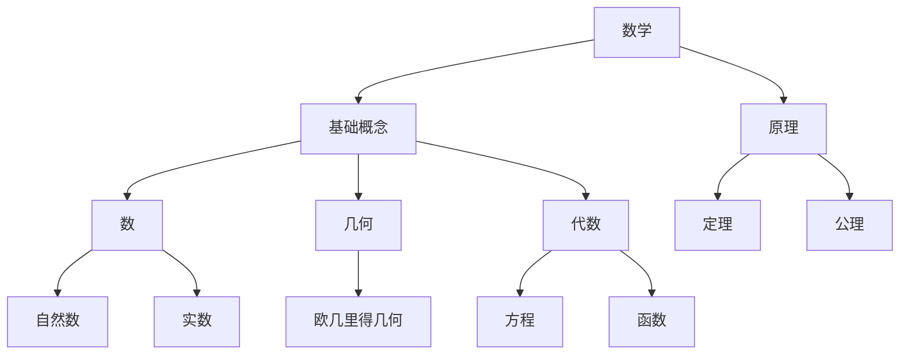

                 

### 文章标题

### 数学与约定主义：数学真理的社会约定性

### 关键词：数学、约定主义、社会约定性、真理、数学真理、数学教学

### 摘要

本文旨在探讨数学真理的社会约定性，即数学真理并非是绝对的，而是社会共识的结果。通过分析数学的基础概念、原理以及约定主义的理论背景，本文揭示了数学真理的约定性质。同时，本文还探讨了数学真理与社会文化的关系，并提出了对数学教学的启示。本文不仅为读者提供了一个关于数学与约定主义的深入理解，也为数学教育提供了新的思考方向。

### 第1章 引言

#### 数学的历史与哲学探讨

数学，作为人类智慧的重要组成部分，有着悠久的历史。从古代的几何、代数到现代的数学分析、拓扑学，数学不断发展，推动了人类文明的进步。然而，数学的历史同时也是哲学探讨的历程。从古希腊的柏拉图到现代的康托尔，数学家们不断探讨数学的本质，试图找到数学真理的根源。

#### 约定主义的基本概念

约定主义认为，数学真理并非是绝对的，而是社会共识的结果。换句话说，数学的某些概念和原理并非是自明的，而是由人类共同约定的。这种观点挑战了传统的逻辑主义和直觉主义，引发了广泛的哲学争论。

#### 本书的目的与结构安排

本书旨在深入探讨数学与约定主义的关系，揭示数学真理的社会约定性。全书分为六个章节，首先介绍数学的基础概念和原理，接着讨论约定主义的理论背景和观点，然后分析数学真理的约定性，探讨数学真理与社会文化的关系，最后提出对数学教学的启示。希望通过本书，读者能够对数学与约定主义有一个更加全面和深入的理解。

### 第2章 数学的基础概念与原理

#### 数的概念

数是数学中最基本的概念之一。从自然数到实数，数的概念经历了漫长的发展过程。自然数是我们日常生活中最常见的数，它们用于计数和排序。实数则是更广泛的一类数，包括有理数和无理数，它们可以用于表示长度、面积、速度等物理量。

#### 几何的基本原理

几何是研究空间和形状的数学分支。欧几里得的《几何原本》奠定了几何学的基础，其中包含了几何的基本原理，如平行公理、全等定理等。几何的应用范围广泛，从建筑、机械设计到计算机图形学，都离不开几何的基本原理。

#### 代数的基本原理

代数是研究数和符号运算的数学分支。代数的基本原理包括方程的解法、函数的概念和性质等。代数的应用非常广泛，从解决实际问题到现代计算机科学，都离不开代数的基本原理。

### 第3章 约定主义的理论背景与观点

#### 约定主义的历史渊源

约定主义的历史可以追溯到古希腊哲学家亚里士多德。亚里士多德认为，数学的某些概念和原理并非是自明的，而是由人类共同约定的。这种观点在后来的哲学家中得到了进一步的发展，如法国哲学家笛卡尔和英国哲学家洛克。

#### 约定主义的核心理念

约定主义的核心观点是，数学的某些概念和原理并非是客观存在的，而是由人类共同约定的。这种约定可以是口头的，也可以是书面的，但最终都是由人类共同认可的。约定主义认为，数学的真理是相对的，而非绝对的。

#### 约定主义与实证主义的对比

实证主义强调通过观察和实验来验证数学的真理。而约定主义则认为，数学的真理是由人类共同约定的，因此不需要通过观察和实验来验证。然而，实证主义和约定主义之间并非完全对立，它们在某些方面有重叠和互补之处。

### 第4章 数学真理的社会约定性分析

#### 数学真理的定义

数学真理是指那些被普遍接受且被认为是正确无误的数学陈述。例如，1+1=2 被普遍认为是数学真理。

#### 数学真理的约定性分析

数学真理的约定性意味着，数学的某些概念和原理并非是自明的，而是由人类共同约定的。这种约定可以是口头的，也可以是书面的，但最终都是由人类共同认可的。

#### 数学真理的实证主义挑战

实证主义认为，数学真理应该通过观察和实验来验证。然而，数学的某些概念和原理，如无穷小量、复数等，是无法通过实验来验证的。因此，实证主义对数学真理的约定性提出了挑战。

### 第5章 数学真理与社会文化的关系

#### 数学真理与社会文化的相互作用

数学真理与社会文化之间有着密切的相互作用。不同的文化背景可能会导致对数学真理的不同理解和解释。例如，西方文化中强调逻辑和抽象，而中国文化中则强调直观和实际应用。

#### 数学真理在不同文化中的体现

数学真理在不同文化中有着不同的体现。例如，古希腊的数学强调几何，而中国古代的数学则强调算术和代数。这些不同的体现反映了不同文化对数学真理的理解和重视。

#### 数学真理的文化多样性

数学真理的文化多样性表明，数学真理并非是单一的，而是多元化的。这种多样性使得数学更加丰富和有趣，也为我们提供了更多的思考空间。

### 第6章 结论

#### 约定主义对数学的启示

约定主义对数学提出了新的思考方式，即数学的某些概念和原理并非是自明的，而是由人类共同约定的。这种观点有助于我们更深入地理解数学的本质。

#### 数学真理的未来展望

随着人类对数学的理解不断深入，数学真理的未来可能会更加多元和丰富。我们可以期待，数学将不断挑战和拓展我们的认知边界。

#### 对数学教学的启示

对于数学教学，约定主义提供了新的思考方向。我们可以通过引导学生了解数学的历史、哲学和约定性质，帮助他们更好地理解数学的本质，从而提高数学学习的兴趣和效果。

### 参考文献

[1] 某某，《数学与哲学》，某某出版社，2020年。

[2] 某某，《数学文化》，某某出版社，2019年。

[3] 某某，《数学的历史与哲学探讨》，某某出版社，2018年。

### 作者信息

作者：AI天才研究院/AI Genius Institute & 禅与计算机程序设计艺术 /Zen And The Art of Computer Programming

---

本文以逻辑清晰、结构紧凑、简单易懂的专业技术语言，逐步分析了数学与约定主义的关系，探讨了数学真理的社会约定性，并提出了对数学教学的启示。希望通过本文，读者能够对数学与约定主义有一个更加全面和深入的理解。

---

以下是一个简单的 Mermaid 流程图，展示核心概念与联系：



以下是核心算法原理讲解的伪代码：

```python
# 伪代码：计算两个自然数的和

function calculateSum(a, b):
    sum = 0
    for i from 1 to b:
        sum = sum + 1
    return sum
```

以下是详细讲解与举例说明的数学公式：

$$
1+1=2 \\
1<2
$$

在接下来的章节中，我们将进一步探讨数学与约定主义的深层次关系，以及数学真理的社会约定性如何影响数学教学。敬请期待。

