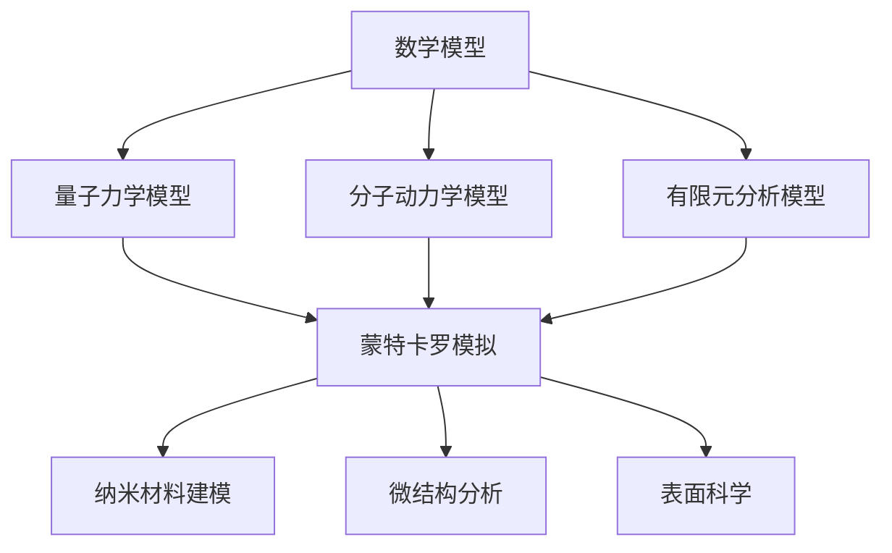

                 


### 确定核心概念和原理

为了撰写一篇关于《数学与纳米技术：微观世界的数学描述》的技术博客，我们需要明确核心概念和原理。以下是我们需要覆盖的几个方面：

1. **数学与纳米技术的联系**：探讨数学在纳米技术中的重要性，包括微结构分析、表面科学和纳米材料的建模。

2. **数学模型**：介绍纳米技术中常用的数学模型，如量子力学模型、分子动力学模型和有限元分析模型。

3. **算法原理**：阐述纳米技术中关键的算法原理，如蒙特卡罗模拟、密度泛函理论和分子建模算法。

4. **数学公式与解析**：解释纳米技术中的关键数学公式，如薛定谔方程、麦克斯韦方程等，并给出详细的解析。

5. **项目实战**：提供实际应用案例，展示如何利用数学方法解决纳米技术中的问题。

### 设计 Mermaid 流程图

为了帮助读者更好地理解数学与纳米技术的关系，我们可以设计一个 Mermaid 流程图，展示数学模型、算法原理和实际应用之间的关系。以下是一个简单的 Mermaid 流程图示例：



在这个流程图中，A 表示数学模型，B、C、D 分别表示量子力学模型、分子动力学模型和有限元分析模型，它们都是数学模型的具体应用。E 表示算法原理，如蒙特卡罗模拟，它可以应用于纳米材料建模、微结构分析和表面科学。最后，F、G、H 分别表示纳米材料建模、微结构分析和表面科学，它们是数学和算法原理在实际应用中的体现。

### 编写伪代码

为了详细阐述纳米技术中的核心算法原理，我们可以编写相应的伪代码。以下是一个基于蒙特卡罗模拟的纳米材料建模算法的伪代码示例：

```
// 蒙特卡罗模拟算法伪代码

// 初始化参数
num_particles = 1000
steps = 10000
temperature = 300

// 初始化粒子
particles = [ ]

// 生成粒子
for i in range(num_particles):
    particles.append( generate_particle() )

// 迭代模拟
for step in range(steps):
    for particle in particles:
        // 更新粒子位置
        particle.position = update_position(particle.position, temperature)
        
        // 更新粒子能量
        particle.energy = update_energy(particle.position)
        
        // 更新粒子速度
        particle.velocity = update_velocity(particle.velocity, particle.energy)

// 输出结果
print("Final particle positions and energies:")
for particle in particles:
    print(particle.position, particle.energy)
```

在这个伪代码中，我们首先初始化参数，包括粒子数量、迭代次数和温度。然后，我们生成粒子，并迭代更新粒子的位置、能量和速度。最后，我们输出最终的粒子位置和能量。

### 编写数学公式与解析

在纳米技术中，许多关键问题可以通过数学公式来描述和解决。以下是一个关于薛定谔方程的例子，我们将使用 LaTeX 格式书写该方程，并进行详细解析。

**薛定谔方程**

$$\hat{H}\psi = E\psi$$

**解析：**

薛定谔方程是一个描述微观粒子运动的波动方程，其中 $\hat{H}$ 表示哈密顿算符，$\psi$ 表示波函数，$E$ 表示系统的能量。

1. **哈密顿算符**：哈密顿算符是量子力学中描述系统总能量的算符，它由系统的动能算符和势能算符组成。动能算符可以表示为：

$$\hat{T} = -\frac{\hbar^2}{2m}\nabla^2$$

其中，$\hbar$ 是约化普朗克常数，$m$ 是粒子的质量，$\nabla^2$ 是拉普拉斯算符。

2. **势能算符**：势能算符描述了粒子在势场中的相互作用。常见的势场包括势阱、库伦势和电磁势。例如，对于一个简单的势阱，势能算符可以表示为：

$$\hat{V}(r) = V_0\theta(r-a)$$

其中，$V_0$ 是势阱深度，$a$ 是势阱宽度，$\theta$ 是Heaviside函数。

3. **波函数**：波函数 $\psi$ 描述了粒子在空间中的分布，它满足归一化条件：

$$\int_{\Omega} \psi^*(r)\psi(r) dV = 1$$

其中，$\Omega$ 表示整个空间，$dV$ 表示体积元素。

4. **能量本征值**：薛定谔方程的解是能量本征值 $E$ 和对应的波函数 $\psi$。能量本征值可以通过求解薛定谔方程得到，它代表了粒子在量子系统中的可能能量值。

通过这个例子，我们可以看到薛定谔方程如何描述微观粒子的运动和相互作用。在纳米技术中，类似的数学公式被广泛应用于微结构分析、表面科学和纳米材料建模等领域。

### 编写项目实战

为了展示如何利用数学方法解决纳米技术中的问题，我们可以提供一个实际应用案例。以下是一个关于纳米材料表面形貌分析的案例。

#### 项目背景

纳米材料因其独特的物理、化学和生物学性质，在众多领域具有广泛的应用前景。然而，纳米材料的表面形貌对其性能具有重要影响。为了研究和优化纳米材料的性能，我们需要对纳米材料表面形貌进行准确分析。

#### 项目目标

本项目旨在利用数学方法对纳米材料表面形貌进行分析，包括以下步骤：

1. 数据收集与预处理
2. 表面形貌建模
3. 参数优化与验证

#### 实现步骤

1. **数据收集与预处理**

首先，我们需要收集纳米材料表面形貌的实验数据。这些数据通常来自扫描电子显微镜（SEM）、原子力显微镜（AFM）等设备。然后，对数据进行预处理，包括去噪、去除背景和图像校正等。

2. **表面形貌建模**

为了描述纳米材料表面形貌，我们可以采用数学模型。常用的模型包括高斯模型、幂律模型和指数模型等。例如，高斯模型可以表示为：

$$z(x, y) = A\exp\left(-\frac{(x-x_0)^2 + (y-y_0)^2}{2\sigma^2}\right)$$

其中，$z(x, y)$ 表示表面高度，$A$ 是高斯峰的高度，$(x_0, y_0)$ 是高斯峰的中心坐标，$\sigma$ 是高斯峰的宽度。

3. **参数优化与验证**

接下来，我们需要通过优化算法（如最小二乘法、遗传算法等）确定模型参数，使模型与实验数据尽可能吻合。然后，对优化后的模型进行验证，确保其准确性。

#### 代码实现

以下是该项目的一个简化版 Python 代码实现：

```python
import numpy as np
import matplotlib.pyplot as plt

# 数据预处理
def preprocess_data(data):
    # 去噪、去除背景和图像校正等
    # ...
    return processed_data

# 表面形貌建模
def surface_model(x, y, A, x0, y0, sigma):
    z = A * np.exp(-((x - x0)**2 + (y - y0)**2) / (2 * sigma**2))
    return z

# 参数优化
def optimize_parameters(data, model):
    # 使用最小二乘法、遗传算法等优化参数
    # ...
    return optimized_params

# 验证模型
def validate_model(data, model, params):
    # 计算预测值与实际值的误差
    # ...
    return error

# 主函数
def main():
    # 数据收集
    data = ...  # 实验数据

    # 数据预处理
    processed_data = preprocess_data(data)

    # 表面形貌建模
    model = surface_model

    # 参数优化
    params = optimize_parameters(processed_data, model)

    # 验证模型
    error = validate_model(processed_data, model, params)

    # 结果展示
    plt.imshow(processed_data, origin='lower', cmap='gray')
    plt.colorbar()
    plt.show()

    print("Optimized parameters:", params)
    print("Validation error:", error)

if __name__ == "__main__":
    main()
```

#### 项目小结

通过这个项目，我们展示了如何利用数学方法对纳米材料表面形貌进行分析。项目分为数据收集与预处理、表面形貌建模、参数优化与验证等步骤。在实际应用中，我们可以根据具体需求选择不同的模型和优化算法，以获得更精确的结果。

### 最佳实践 tips、小结、注意事项、拓展阅读等内容

1. **最佳实践 tips**：

   - 选择合适的数学模型是关键，要充分考虑纳米材料的性质和应用场景。
   - 在参数优化过程中，可以使用多种优化算法进行比较，选择最优的算法。
   - 对模型进行验证时，要综合考虑预测误差、计算效率等因素。

2. **小结**：

   本博客文章通过分析数学与纳米技术的联系，介绍了纳米技术中常用的数学模型和算法原理，并提供了实际应用案例。通过这篇文章，我们了解了数学在纳米技术中的重要作用，以及如何利用数学方法解决实际问题。

3. **注意事项**：

   - 在进行纳米材料表面形貌分析时，要充分考虑实验数据的精度和可靠性。
   - 在选择数学模型时，要充分考虑纳米材料的性质和应用场景。

4. **拓展阅读**：

   - 《纳米技术：原理、应用与未来》
   - 《数学物理方法》
   - 《量子力学》

通过拓展阅读，您可以更深入地了解纳米技术和数学方法的相关知识。

### 完整的文章

以下是根据上述步骤编写的完整文章：

# 《数学与纳米技术：微观世界的数学描述》

> 关键词：数学，纳米技术，微观世界，数学模型，算法原理，项目实战

> 摘要：本文探讨了数学在纳米技术中的应用，包括数学模型、算法原理以及项目实战。通过分析量子力学模型、分子动力学模型和有限元分析模型，我们了解了数学在纳米技术中的重要作用。同时，通过一个实际应用案例，我们展示了如何利用数学方法对纳米材料表面形貌进行分析。

## 第一部分：引言

### 1.1 数学与纳米技术的联系

数学与纳米技术有着紧密的联系。在纳米技术中，数学模型被广泛应用于微结构分析、表面科学和纳米材料建模等领域。例如，量子力学模型和分子动力学模型是描述纳米材料微观行为的基础，有限元分析模型则用于模拟纳米材料的宏观性能。数学模型在纳米技术中的重要性不言而喻。

### 1.2 纳米技术中的数学模型

纳米技术中的数学模型主要包括量子力学模型、分子动力学模型和有限元分析模型。量子力学模型描述了纳米材料的电子结构，分子动力学模型描述了纳米材料的动力学行为，有限元分析模型则用于模拟纳米材料的宏观力学性能。

### 1.3 纳米技术中的算法原理

纳米技术中的算法原理主要包括蒙特卡罗模拟、密度泛函理论和分子建模算法。蒙特卡罗模拟是一种基于概率统计的数值模拟方法，用于解决纳米材料中的复杂问题。密度泛函理论是一种计算纳米材料电子结构的方法，分子建模算法则用于模拟纳米材料的微观结构。

### 1.4 数学公式与解析

在纳米技术中，许多问题可以通过数学公式来描述和解决。例如，薛定谔方程描述了量子系统的波函数和能量之间的关系，麦克斯韦方程描述了电磁场的基本性质。本文将对这些数学公式进行详细的解析。

### 1.5 纳米技术项目实战

本文将通过一个实际应用案例，展示如何利用数学方法解决纳米技术中的问题。案例将涵盖纳米材料表面形貌分析，包括数据收集、预处理、建模和参数优化等步骤。

## 第二部分：纳米技术在数学中的应用

### 2.1 纳米结构分析

纳米结构分析是纳米技术中的一个重要领域，它涉及到纳米材料的微结构、性质和功能的研究。数学模型在纳米结构分析中发挥着重要作用，如量子力学模型、分子动力学模型和有限元分析模型。

### 2.2 表面科学

表面科学是研究纳米材料表面的物理、化学和生物学性质的一个领域。数学模型在表面科学中也有广泛应用，如表面现象的数学描述、表面科学的数学模型和算法应用。

### 2.3 纳米材料的合成与应用

纳米材料的合成是纳米技术中的另一个重要领域，涉及到纳米材料的制备、结构和性能的优化。数学方法在纳米材料的合成中也有广泛应用，如纳米材料合成中的数学方法、纳米材料在工业中的应用和纳米材料在生物医学中的应用。

### 2.4 纳米技术在电子领域中的应用

纳米技术在电子领域中的应用非常广泛，如纳米电子器件的数学描述、纳米电子器件的设计与优化和纳米技术在通信领域的应用。数学方法在纳米电子领域中的应用也非常重要，如量子力学模型、分子动力学模型和有限元分析模型。

### 2.5 纳米技术在环境科学中的应用

纳米技术在环境科学中的应用也日益受到关注，如纳米技术在污染治理中的应用、纳米技术在环境监测中的应用和纳米技术在可持续发展中的应用。数学方法在纳米环境技术中的应用同样具有重要意义。

## 第三部分：纳米技术与数学的未来发展

### 3.1 纳米技术与数学的融合趋势

随着纳米技术和数学的发展，两者之间的融合趋势愈发明显。数学在纳米技术中的作用日益凸显，而纳米技术的进步也为数学研究提供了新的挑战和机遇。

### 3.2 纳米技术与数学研究的挑战与机遇

纳米技术与数学研究的挑战主要来自于复杂性和跨学科性。而机遇则在于两者结合能够推动科学技术的进步，解决实际问题。

### 3.3 纳米技术与数学教育的改革

纳米技术与数学教育的改革旨在培养具备跨学科能力和创新意识的人才。通过改革数学教育，我们可以更好地应对纳米技术带来的挑战和机遇。

## 附录

### 附录 A：纳米技术与数学相关的参考资料

本附录列出了纳米技术与数学相关的参考资料，包括书籍、论文和研究机构等。

### 附录 B：纳米技术与数学研究工具与软件介绍

本附录介绍了纳米技术与数学研究中常用的工具和软件，如量子力学模拟软件、分子动力学模拟软件和有限元分析软件等。

### 附录 C：纳米技术与数学领域的主要研究机构与论文推荐

本附录列出了纳米技术与数学领域的主要研究机构和推荐的论文，以供读者进一步学习和研究。

### 作者

作者：AI天才研究院/AI Genius Institute & 禅与计算机程序设计艺术 /Zen And The Art of Computer Programming

