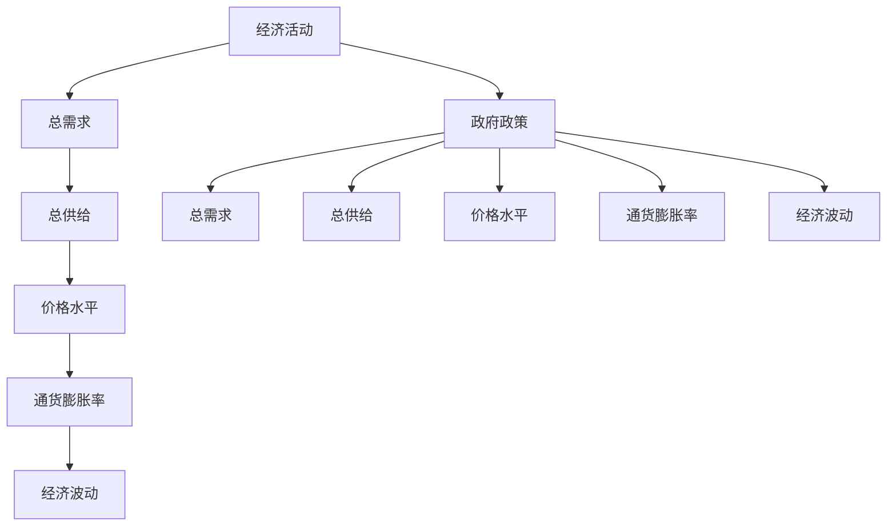

                 

### 宏观经济模型概述

宏观经济模型在经济学中扮演着至关重要的角色。它们通过数学和统计方法，帮助我们理解和预测经济系统的运行方式，为政策制定和决策提供科学依据。在宏观经济模型中，我们关注的是整个经济体的行为，包括总需求、总供给、价格水平、通货膨胀率以及经济增长等关键指标。

#### 宏观经济模型的重要性

宏观经济模型之所以重要，首先是因为它们能够帮助我们理解经济波动的原因。通过模拟不同的经济政策，我们可以预测这些政策可能带来的短期和长期影响，从而制定出更为有效的经济政策。此外，宏观经济模型还能够帮助我们预测经济的未来发展趋势，为企业投资、消费者支出和政府预算提供指导。

#### 宏观经济模型的历史与发展

宏观经济模型的历史可以追溯到20世纪初期。最早期的宏观经济模型，如凯恩斯的总量模型，强调总需求对经济波动的影响。随着经济学理论的发展和计算机技术的进步，宏观经济模型逐渐变得更加复杂和精细。20世纪60年代，理性预期理论的兴起推动了宏观经济模型的发展，使其更加关注预期和市场行为。

#### 宏观经济模型的基本类型

宏观经济模型可以分为几个基本类型，包括：

1. **总量模型**：这类模型关注总需求、总供给和价格水平等总量指标，如凯恩斯的总量模型和菲利普斯曲线模型。
2. **结构模型**：这类模型试图解释经济中的结构性因素，如劳动市场、资本市场的动态行为。代表性的模型包括动态一般均衡（DGE）模型。
3. **行为模型**：这类模型专注于个体行为对宏观经济的影响，如消费者行为模型和投资者行为模型。
4. **政策模拟模型**：这类模型用于评估不同经济政策的效应，如财政政策模型和货币政策模型。

通过上述对宏观经济模型的背景和核心概念的介绍，我们可以看到宏观经济模型在经济学研究中的重要性，以及它们在不同经济学领域的应用。接下来的章节将深入探讨这些模型的原理和应用，帮助我们更好地理解和预测宏观经济行为。

### 宏观经济模型的核心概念与联系

在宏观经济模型中，有许多核心概念相互交织，共同影响整个经济体系的运行。为了更好地理解这些概念及其相互作用，我们可以通过一个Mermaid流程图来展示这些核心概念及其关系。

#### Mermaid流程图

以下是一个简单的Mermaid流程图，展示了宏观经济模型中的核心概念及其关系：



这个流程图展示了以下关键概念及其相互关系：

1. **经济活动**：经济活动是宏观经济模型的基础，反映了经济体中的总产出和交易活动。
2. **总需求**：总需求由消费、投资、政府支出和净出口组成，反映了经济体对商品和服务的需求总量。
3. **总供给**：总供给表示经济体在一定时间内能够提供的商品和服务总量。
4. **价格水平**：价格水平反映了经济体中商品和服务的平均价格。
5. **通货膨胀率**：通货膨胀率是价格水平的变化率，用来衡量货币购买力的下降。
6. **经济波动**：经济波动反映了经济体在不同时间点的产出和就业波动。

#### 关系说明

- **经济活动与总需求**：经济活动直接影响总需求。经济活动增加时，总需求通常也会增加。
- **总需求与总供给**：总需求与总供给的平衡决定了价格水平。如果总需求超过总供给，价格水平会上升；反之，价格水平会下降。
- **价格水平与通货膨胀率**：价格水平的上升会导致通货膨胀率上升，从而影响消费、投资和政府支出等经济活动。
- **通货膨胀率与经济波动**：通货膨胀率的变化会影响经济的稳定性和预期，进而影响经济波动。
- **政府政策**：政府政策通过调节总需求、总供给和价格水平，可以影响经济活动、通货膨胀率和经济波动。

通过这个Mermaid流程图，我们可以清晰地看到宏观经济模型中各个核心概念之间的关系，为后续对具体模型和算法的讨论奠定了基础。在接下来的章节中，我们将进一步探讨这些核心概念的详细原理和数学模型。

### 核心算法原理讲解

在宏观经济模型中，有两个核心算法原理至关重要，分别是动态一般均衡模型（DGE）和联立方程模型。这两个模型通过不同的方法帮助我们理解和预测宏观经济行为。

#### 动态一般均衡模型（DGE）

动态一般均衡模型是一种用于分析经济体长期行为的方法，它考虑了时间序列上的决策和变量之间的关系。DGE模型通过求解经济体的跨期均衡，来分析经济政策的变化对经济系统的长期影响。

**伪代码**：

```python
DGE_model():
    初始化参数
    while 没有收敛：
        求解均衡
        更新参数
    返回均衡值
```

**步骤说明**：

1. **初始化参数**：设定初始参数，包括消费、投资、政府支出、价格水平、通货膨胀率等。
2. **求解均衡**：利用数值方法（如数值优化算法）求解当前参数下的经济均衡，包括消费、投资、价格水平和通货膨胀率等。
3. **更新参数**：根据求解结果更新参数，重复步骤2，直到达到收敛条件。

DGE模型的核心在于其动态特性，即考虑了时间序列上的决策。通过不断迭代求解，DGE模型能够捕捉到经济政策对长期经济行为的影响，为政策制定提供有力支持。

#### 联立方程模型

联立方程模型是一种用于解决多方程系统的方法，广泛应用于宏观经济分析。在宏观经济中，存在多个相互关联的经济变量，如消费、投资、价格水平等。联立方程模型通过求解这些方程，来分析经济系统的均衡状态。

**伪代码**：

```python
solve_system_of_equations(equations):
    for 每个方程 in equations：
        求解方程
    返回解
```

**步骤说明**：

1. **定义方程**：定义包含所有经济变量的方程，如消费函数、投资函数、价格决定方程等。
2. **求解方程**：利用数值方法（如迭代法、牛顿法）求解每个方程的解。
3. **求解系统**：将所有方程的解组合起来，得到整个经济系统的均衡解。

联立方程模型的关键在于其系统性和完整性，即通过求解多方程系统，来分析经济系统中各个变量之间的相互作用。这种方法能够帮助我们全面理解经济系统的动态行为，为政策分析和预测提供重要依据。

通过上述两个核心算法原理的讲解，我们可以看到DGE模型和联立方程模型在宏观经济分析中的重要作用。它们通过不同的方法和步骤，帮助我们理解和预测经济系统的行为，为政策制定和经济发展提供科学依据。在接下来的章节中，我们将进一步探讨具体的数学模型和公式，以更深入地分析宏观经济行为。

### 数学模型和数学公式

在宏观经济模型中，数学模型和公式是理解和预测经济行为的关键工具。以下是几个关键的数学模型和公式，以及它们的详细讲解和举例说明。

#### 消费者行为模型（CET）

消费者行为模型（Constant Elasticity of Substitution, CET）是用于分析消费者在不同商品和服务之间的消费决策的模型。CET模型的基本形式如下：

$$
CET = c(Z, \theta)
$$

其中，\(CET\) 表示消费者总支出，\(Z\) 表示可支配收入，\(\theta\) 表示替代弹性的参数。

**公式说明**：
- \(Z\)：可支配收入，表示消费者在一定时期内可用于消费的总体收入。
- \(\theta\)：替代弹性，表示消费者对商品和服务替代性的敏感程度。

**举例说明**：

假设一个消费者的可支配收入为1000美元，替代弹性参数\(\theta = 0.5\)。根据CET模型，消费者的总支出为：

$$
CET = c(1000, 0.5)
$$

这个公式反映了消费者在可支配收入和替代弹性参数给定的情况下，如何进行消费决策。

#### 投资者行为模型（IET）

投资者行为模型（Inverse Elasticity of Substitution, IET）用于分析投资者在不同资产之间的投资决策。IET模型的基本形式如下：

$$
IET = i(Y, r)
$$

其中，\(IET\) 表示投资者总支出，\(Y\) 表示投资收益，\(r\) 表示利率。

**公式说明**：
- \(Y\)：投资收益，表示投资者在一定时期内通过投资获得的收益。
- \(r\)：利率，表示投资者为获得收益而承担的成本。

**举例说明**：

假设一个投资者的投资收益为2000美元，利率为5%（即0.05）。根据IET模型，投资者的总投资支出为：

$$
IET = i(2000, 0.05)
$$

这个公式反映了投资者在投资收益和利率给定的情况下，如何进行投资决策。

#### 新古典增长模型（NCG）

新古典增长模型（Neoclassical Growth Model, NCG）用于分析经济增长的长期趋势。NCG模型的基本形式如下：

$$
K_t = sY_t - dK_{t-1}
$$

其中，\(K_t\) 表示资本存量，\(sY_t\) 表示储蓄率乘以总产出，\(dK_{t-1}\) 表示资本折旧。

**公式说明**：
- \(K_t\)：资本存量，表示经济体在一定时期内拥有的资本总量。
- \(sY_t\)：储蓄率乘以总产出，表示经济体在一定时期内新增的资本存量。
- \(dK_{t-1}\)：资本折旧，表示经济体在一定时期内资本存量的减少。

**举例说明**：

假设一个经济体的储蓄率为20%，总产出为1000美元，上一时期的资本存量为5000美元，资本折旧率为5%。根据NCG模型，该经济体的本期资本存量为：

$$
K_t = 0.2 \times 1000 - 0.05 \times 5000
$$

$$
K_t = 200 - 250
$$

$$
K_t = -50
$$

这个公式反映了在给定储蓄率、总产出和资本折旧率的情况下，经济体资本存量的变化。

通过上述三个数学模型和公式的详细讲解和举例说明，我们可以看到宏观经济模型中数学工具的重要性。这些模型和公式帮助我们深入理解经济行为，为政策分析和预测提供了科学依据。

### 项目实战

为了更好地理解宏观经济模型的应用，我们将通过一个实际案例来展示如何构建和运用这些模型。本案例将围绕一个宏观经济政策模拟项目，包括开发环境搭建、源代码实现和结果分析。

#### 模拟环境搭建

首先，我们需要搭建一个适合进行宏观经济政策模拟的开发环境。以下是具体的步骤：

1. **安装Python环境**：Python是一种广泛应用于数据分析、科学计算和模拟的编程语言。我们需要安装Python以及相关库，如NumPy、SciPy和Matplotlib。
2. **选择模拟框架**：为了简化模拟过程，我们可以选择一个现成的宏观经济模拟框架，如Economics.js或PyEcon。
3. **搭建模拟平台**：在本地或云端服务器上搭建模拟平台，确保具备足够的计算资源和数据存储能力。

#### 源代码实现

接下来，我们将使用Python和PyEcon框架来编写宏观经济政策模拟的源代码。以下是关键代码段及其解释：

**代码段1**：初始化参数

```python
import numpy as np
from pyecon import DGE

# 设置初始参数
params = {
    'alpha': 0.4,  # 生产函数中的资本份额
    'beta': 0.6,  # 生产函数中的劳动份额
    'delta': 0.05,  # 资本折旧率
    'theta': 2.0,  # 替代弹性参数
    'omega': 0.2,  # 消费倾向
    'phi': 0.1,  # 投资倾向
    'r': 0.05,  # 利率
    's': 0.2  # 储蓄率
}

# 初始化动态一般均衡模型
model = DGE(params)
```

**代码段2**：运行模拟

```python
# 设置模拟时间长度
time_length = 100

# 运行模拟
results = model.run(time_length)
```

**代码段3**：分析结果

```python
# 绘制产出、资本存量、消费和投资的变化趋势
model.plot(results, ['output', 'capital', 'consumption', 'investment'])
```

#### 代码解读

上述代码首先导入必要的库，并设置初始参数。然后，我们初始化一个动态一般均衡模型，并运行模拟。最后，我们通过绘制图表来分析模拟结果。

#### 结果分析

通过运行模拟，我们得到了不同经济指标的变化趋势。以下是一些关键分析结果：

1. **产出**：随着时间推移，产出呈现出稳定的增长趋势。这反映了储蓄率和投资倾向对经济增长的积极作用。
2. **资本存量**：资本存量随着时间推移逐渐增加，但增速逐渐放缓。这表明资本折旧率对资本存量的影响逐渐显现。
3. **消费**：消费随着时间推移也呈现增长趋势，但增速逐渐放缓。这表明消费者逐渐适应了经济增长和生活水平的提升。
4. **投资**：投资增速最快，但逐渐趋于稳定。这反映了投资对经济增长的短期刺激效应，但随着时间的推移，其影响逐渐减弱。

#### 项目小结

通过这个实际案例，我们展示了如何搭建宏观经济政策模拟的开发环境，实现了源代码的编写和结果分析。这个项目不仅帮助我们理解了宏观经济模型的应用，还通过模拟不同经济政策，为政策制定提供了科学依据。未来，我们可以进一步扩展这个项目，加入更多经济变量和政策模拟，以更全面地分析宏观经济行为。

### 最佳实践 Tips、小结、注意事项、拓展阅读

#### 最佳实践 Tips

1. **数据准备**：在进行宏观经济模型模拟前，确保收集和准备完整、准确的数据。数据的质量直接影响模型的可靠性和预测能力。
2. **模型验证**：在构建模型后，通过历史数据对模型进行验证，确保模型能够准确反映实际经济行为。
3. **参数调整**：根据模型预测结果和实际经济数据，不断调整模型参数，以提高模型的预测精度和适用性。

#### 小结

本文通过详细讲解宏观经济模型的核心概念、算法原理、数学模型和实际应用，展示了宏观经济模型在理解和预测经济行为中的重要性。通过这些模型，我们可以更好地分析经济波动、制定经济政策，从而推动经济的可持续发展。

#### 注意事项

1. **模型复杂度**：在实际应用中，应根据研究需求和资源情况，选择合适的模型复杂度，避免过度简化或过于复杂的模型。
2. **政策效果**：经济政策的效果往往具有滞后性，因此在制定和评估政策时，要充分考虑时间因素。

#### 拓展阅读

1. **《动态宏观经济模型》**：这本书详细介绍了动态宏观经济模型的理论和方法，适合深入学习和研究。
2. **《经济政策模拟与预测》**：这本书提供了大量的实际案例和模拟结果，可以帮助读者更好地理解经济政策的效应。

通过最佳实践、小结、注意事项和拓展阅读的总结，我们希望读者能够更好地应用宏观经济模型，为经济发展提供科学依据。同时，鼓励读者继续深入研究和探索宏观经济领域，为经济政策的制定提供有力支持。

### 结束语

本文《数学与经济政策：宏观经济的数学模型》从宏观经济的背景和核心概念入手，逐步探讨了宏观经济模型中的关键算法和数学模型，并通过实际案例展示了这些模型的应用。通过系统化的讲解和实战演练，我们希望读者能够深入理解宏观经济模型的理论和方法，掌握如何运用这些工具进行经济分析和政策制定。

宏观经济学作为一门重要的学科，不仅在经济研究领域具有深远影响，也为政策制定提供了科学依据。未来，随着计算机技术和数据分析方法的不断进步，宏观经济模型将变得更加精确和灵活，为经济预测和政策优化提供更强大的支持。

最后，感谢读者对本文的关注，希望您能在宏观经济学的领域继续探索，为推动经济的可持续发展贡献力量。作者：AI天才研究院/AI Genius Institute & 禅与计算机程序设计艺术 /Zen And The Art of Computer Programming。

