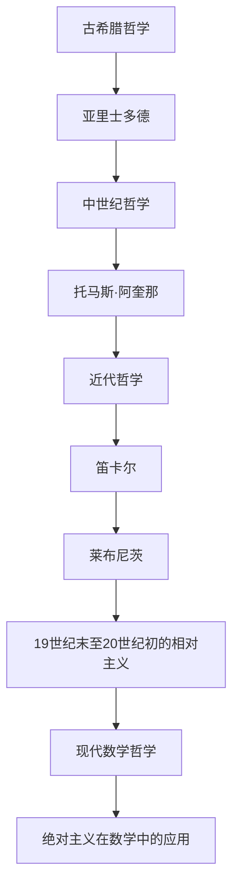

                 


### 数学与绝对主义：数学真理的绝对性

关键词：数学、绝对主义、真理、客观性、哲学、应用

摘要：本文旨在探讨数学与绝对主义之间的关系，特别是在数学真理的绝对性方面。通过分析绝对主义的基本概念及其历史背景，我们将探讨数学真理的属性，包括其确定性和普遍性。随后，我们将探讨数学证明的方法和局限性，以及数学真理在哲学上的探讨。本文还将讨论绝对主义与相对主义的区别，以及绝对主义对数学方法论的影响。通过深入分析和举例，我们希望能够揭示数学真理的绝对性在现代科学中的应用。

#### 引言

**1.1 研究背景与意义**

数学作为一门科学，其重要性不言而喻。它不仅是自然科学、工程技术和社会科学的基础，而且在人类思维和认识世界方面发挥着重要作用。数学的许多成果，如几何学、代数学、微积分等，已经被广泛应用于各个领域，推动了科技的进步和社会的发展。然而，数学的真理性质及其绝对性一直是一个哲学和科学问题。

绝对主义认为，某些真理和原则具有普遍有效性和客观存在性，不受时间和空间的限制。数学真理的绝对性，即数学原理的普遍适用性，是一个备受争议的话题。本文旨在探讨数学真理的绝对性，分析其哲学基础、数学证明的方法和局限性，以及其在现代科学中的应用。

**1.2 绝对主义的历史与发展**

绝对主义的历史可以追溯到古希腊哲学。亚里士多德是绝对主义的重要代表，他认为存在着某些普遍的、不变的真理。中世纪的基督教哲学家如托马斯·阿奎那也坚持绝对主义观点，认为上帝是所有真理的源泉。近代哲学中，笛卡尔和莱布尼茨等理性主义者也强调绝对真理的存在。

19世纪末至20世纪初，相对主义的兴起对绝对主义提出了挑战。相对主义主张真理是相对的，依赖于观察者的视角和背景。然而，绝对主义仍然在数学领域占据重要地位，数学的确定性使其被视为绝对真理的典范。

**1.3 本书结构安排**

本文将分为七个主要章节：

- **第1章 绝对主义概述**：介绍绝对主义的基本概念、历史背景和哲学基础。
- **第2章 数学真理的绝对性**：探讨数学真理的性质、证明方法和哲学探讨。
- **第3章 数学与绝对主义的关系**：分析数学作为绝对主义工具的作用。
- **第4章 数学真理的绝对性与相对主义**：比较绝对主义与相对主义的差异。
- **第5章 数学真理的绝对性与科学方法论**：探讨绝对主义对科学方法论的影响。
- **第6章 数学真理的绝对性在现代科学中的应用**：举例说明数学真理在物理学和计算机科学中的应用。
- **第7章 结论**：总结本文的主要观点，并对数学真理的绝对性进行再思考。

通过以上结构安排，本文将系统地探讨数学真理的绝对性，旨在为读者提供一个全面、深入的理解。接下来，我们将详细讨论绝对主义的基本概念和历史背景。

### 第1章 绝对主义概述

#### 2.1 绝对主义的基本概念

绝对主义是一种哲学立场，主张某些真理、原则或价值具有普遍有效性和客观存在性，不受时间和空间限制。这种立场与相对主义相对，相对主义认为真理是相对的，依赖于观察者的视角和背景。

绝对主义的核心概念包括：

- **绝对性与相对性**：绝对主义认为存在某些普遍的、不变的真理，这些真理不依赖于观察者的主观视角。相对性则强调事物之间的相对关系，认为真理是相对的，依赖于特定的观察者或环境。

- **绝对真理的概念**：绝对主义认为，某些真理是绝对的，不受时间和空间的限制，具有普遍适用性。例如，数学中的基本原理，如“1+1=2”被认为是绝对真理，无论在哪个时间和空间，这个等式都是成立的。

- **普遍有效性**：绝对主义认为，绝对真理不仅适用于某个特定的情境或文化，而是普遍适用的。例如，数学原理不仅适用于我们的日常生活，也适用于其他星球或宇宙中的生物。

- **客观存在性**：绝对主义认为，绝对真理是客观存在的，独立于人类的认知和意识。这意味着，即使没有人知道或理解这些真理，它们仍然存在。

#### 2.2 绝对主义的历史背景

绝对主义的历史可以追溯到古希腊哲学。古希腊哲学家亚里士多德是绝对主义的重要代表，他认为存在着某些普遍的、不变的真理。亚里士多德认为，宇宙是按照某种固定的秩序和原理运行的，这些原理是绝对真理。

中世纪的基督教哲学家如托马斯·阿奎那也坚持绝对主义观点，认为上帝是所有真理的源泉。阿奎那认为，上帝是绝对的真理，他的智慧和知识是无限的，因此，上帝所创造的宇宙也具有绝对真理。

近代哲学中，笛卡尔和莱布尼茨等理性主义者也强调绝对真理的存在。笛卡尔提出了“我思故我在”的命题，认为存在一个不变的、绝对的我，这个我是认识世界的基础。莱布尼茨则认为，存在着一种“理性的绝对”，这种理性是普遍的、不变的。

19世纪末至20世纪初，相对主义的兴起对绝对主义提出了挑战。相对主义主张真理是相对的，依赖于观察者的视角和背景。然而，绝对主义仍然在数学领域占据重要地位，数学的确定性使其被视为绝对真理的典范。

#### 2.3 绝对主义的哲学基础

绝对主义有着深厚的哲学基础，主要包括经验主义与理性主义、实证主义与唯意志论等。

- **经验主义与理性主义**：经验主义认为，知识来自于经验，绝对真理不能脱离经验而独立存在。然而，理性主义认为，存在着某些普遍的、不变的真理，这些真理是通过理性思考和推理得到的。绝对主义认为，理性是认识世界的重要工具，通过理性，我们可以发现和理解绝对真理。

- **实证主义与唯意志论**：实证主义认为，科学知识是建立在观察和实验基础上的，只有可以通过实验验证的真理才是有效的。唯意志论则认为，真理是意志的产物，是主观意志的表达。绝对主义认为，虽然实证主义和唯意志论有其合理性，但它们不能否定绝对真理的存在。

通过以上对绝对主义的基本概念、历史背景和哲学基础的讨论，我们可以看到，绝对主义是一个复杂而深刻的哲学立场，其影响贯穿于人类哲学史的各个阶段。接下来，我们将进一步探讨数学真理的绝对性。

#### 第2章 数学真理的绝对性

##### 3.1 数学真理的性质

数学真理的绝对性是指数学中的某些原理和结论不受时间、空间和观察者的限制，具有普遍适用性。数学真理具有两个显著的性质：确定性和普适性。

- **确定性**：数学真理的确定性是指数学结论的正确性是无疑的，不受主观意识和认知的限制。例如，数学家皮亚诺提出的自然数公理系统，以及欧几里得几何中的基本定理，都是通过严格的逻辑推理得出的，它们被认为是绝对真理。

- **普适性**：数学真理的普适性是指数学原理和结论在任何时间和空间都适用。例如，勾股定理不仅在地球上的平面几何中成立，在任意维度的空间几何中也是正确的。这表明数学真理不仅仅适用于特定的情境，而是具有普遍性。

##### 3.2 数学真理的证明

数学真理的证明是数学理论的核心部分，它通过逻辑推理和公理系统来确保数学结论的可靠性。数学证明主要有两种方法：归纳法和演绎法。

- **归纳法**：归纳法是从特殊情况推导出一般结论的方法。例如，我们可以通过观察许多具体的三角形，发现它们都满足勾股定理，然后推断出所有三角形都满足勾股定理。归纳法在证明数学归纳原理和某些数学公式时非常有用。

  $$ 
  \text{归纳法伪代码：}
  \begin{array}{l}
  \text{假设：} P(1) \text{ 成立} \\
  \text{归纳步骤：} \\
  \text{如果 } P(k) \text{ 成立，则 } P(k+1) \text{ 也成立} \\
  \text{结论：} P(n) \text{ 对所有自然数 } n \text{ 都成立}
  \end{array}
  $$

- **演绎法**：演绎法是从一般原理推导出特定结论的方法。例如，我们可以从欧几里得几何的基本公理出发，通过逻辑推理得出勾股定理。演绎法是数学证明中最常用的方法，因为它确保了结论的正确性。

  $$ 
  \text{演绎法伪代码：}
  \begin{array}{l}
  \text{前提：} \\
  \text{如果三角形ABC的边长满足 } a^2 + b^2 = c^2, \text{ 则三角形ABC是直角三角形} \\
  \text{结论：} \\
  \text{如果三角形ABC是直角三角形，则 } a^2 + b^2 = c^2
  \end{array}
  $$

##### 3.3 数学真理的哲学探讨

数学真理的绝对性在哲学上有着深刻的探讨。数学真理的绝对性与客观实在、人类认知的关系是哲学讨论的重点。

- **数学真理与客观实在**：数学真理被认为是对客观实在的反映。例如，自然数的概念和运算规则反映了宇宙中实体的数量关系。数学的绝对性表明，这些概念和规则在宇宙中具有普遍性。

  $$ 
  \text{自然数公理：}
  \begin{array}{l}
  \text{0 是自然数。} \\
  \text{如果 } n \text{ 是自然数，则 } n+1 \text{ 也是自然数。} \\
  \text{不同自然数是不同的。} \\
  \text{存在最小的非负整数。}
  \end{array}
  $$

- **数学真理与人类认知**：数学真理的发现依赖于人类认知能力。数学家通过观察、实验和逻辑推理，逐步发现和理解数学真理。然而，绝对主义认为，即使没有人类的认知，数学真理仍然存在。

  $$ 
  \text{笛卡尔的信念：}
  \begin{array}{l}
  \text{我思故我在。} \\
  \text{即使世界不存在，我仍然存在。} \\
  \text{因此，宇宙中存在某些普遍的、不变的真理。}
  \end{array}
  $$

通过以上讨论，我们可以看到，数学真理的绝对性不仅在数学上具有重要意义，而且在哲学上也有深刻的探讨。数学真理的确定性和普适性使其在哲学上被视为绝对真理的典范。

### 第3章 数学与绝对主义的关系

#### 4.1 数学作为绝对主义的工具

数学作为一门科学，不仅提供了解决实际问题的方法，还成为了绝对主义的重要工具。数学在自然科学和社科中的应用，体现了其普遍有效性和客观存在性，从而支持了绝对主义立场。

- **数学在自然科学中的应用**：

  - **物理学**：物理学是数学应用最广泛的领域之一。物理学中的许多概念和理论都依赖于数学模型。例如，牛顿运动定律、麦克斯韦方程组、薛定谔方程等，都是用数学语言描述物理现象。这些数学模型不仅精确描述了自然界的规律，还为实验验证提供了基础。

    $$ 
    \text{牛顿运动定律：}
    F = ma
    $$

  - **天文学**：天文学中的天文观测和宇宙模型构建也依赖于数学。例如，开普勒定律描述了行星运动的规律，爱因斯坦的广义相对论则提供了宇宙的数学描述。

    $$ 
    \text{开普勒定律：}
    T^2 \propto a^3
    $$

  - **生物学**：生物学中的进化论、遗传学等领域也广泛应用数学模型。例如，达尔文的自然选择理论可以用概率和统计方法描述物种的进化过程。

    $$ 
    \text{达尔文自然选择：}
    \text{适应环境的个体更有可能生存和繁衍。}
    $$

- **数学在社会科学中的应用**：

  - **经济学**：经济学中的供求关系、市场分析等，都依赖于数学模型。例如，供需模型、消费函数等，都是用数学方法描述经济行为。

    $$ 
    \text{供需模型：}
    \begin{array}{l}
    \text{需求：} Q_d = a - bP \\
    \text{供给：} Q_s = c + dP \\
    \text{均衡价格：} P = \frac{a+c}{b+d}
    \end{array}
    $$

  - **心理学**：心理学中的行为主义、认知心理学等领域，也广泛应用数学方法。例如，心理学的许多实验设计和数据分析都依赖于数学模型。

    $$ 
    \text{行为主义：}
    \text{行为是外部刺激和内部状态的结果。}
    $$

数学在自然科学和社科中的应用，不仅展示了其普遍有效性和客观存在性，还为绝对主义提供了有力的支持。数学模型和理论，不仅帮助我们理解和解释自然现象，还为实验验证和预测提供了科学依据。这些应用表明，数学真理具有超越时间和空间的普遍性，从而支持了绝对主义立场。

#### 4.2 绝对主义对数学的影响

绝对主义对数学的发展产生了深远的影响。在数学哲学中，绝对主义促进了数学理论的严谨性和逻辑性，同时也引发了对数学本质的深刻探讨。

- **数学哲学的演变**：

  - **经典数学**：在经典数学中，绝对主义占据主导地位。经典数学强调数学公理体系的严谨性，通过逻辑推理和证明来确保数学结论的正确性。例如，欧几里得的《几何原本》就是基于绝对主义立场，建立了一个严谨的几何体系。

    $$ 
    \text{欧几里得几何：}
    \begin{array}{l}
    \text{公理1：通过任意两点可以作一条直线。} \\
    \text{公理2：直线可以无限延长。} \\
    \text{公理3：在一个平面内，不能通过两点作两条不同的直线。}
    \end{array}
    $$

  - **现代数学**：随着数学的发展，特别是非欧几何、集合论和数学逻辑的兴起，数学哲学发生了重大变化。现代数学强调数学的相对性和多样性，认为数学理论是建立在不同公理系统上的，从而为数学的绝对性提出了挑战。

    $$ 
    \text{非欧几何：}
    \begin{array}{l}
    \text{公理1：通过任意两点可以作一条直线。} \\
    \text{公理2：直线可以无限延长。} \\
    \text{公理3：在一个平面内，可以存在两条不同的直线。}
    \end{array}
    $$

- **数学方法论的发展**：

  - **形式主义**：形式主义是一种数学哲学立场，认为数学本质上是符号系统的操作。形式主义者认为，数学的绝对性在于其符号系统的一致性和逻辑性。

    $$ 
    \text{形式主义：}
    \begin{array}{l}
    \text{命题：} P \text{ 可由符号系统推导出。} \\
    \text{证明：} \vdash P
    \end{array}
    $$

  - **直觉主义**：直觉主义认为，数学的本质在于人类直觉的运用。直觉主义者强调数学证明的构造性，即证明过程必须能够构造出所证明的结论。

    $$ 
    \text{直觉主义：}
    \begin{array}{l}
    \text{命题：} P \text{ 可由构造性证明得出。} \\
    \text{证明：} \exists x (Px)
    \end{array}
    $$

绝对主义对数学的影响，不仅体现在数学哲学和方法论的发展上，还体现在数学理论的严谨性和逻辑性上。绝对主义促进了数学理论的系统化和形式化，使数学成为一门更加严谨和精确的科学。同时，绝对主义也为数学的相对性和多样性提供了理论基础，推动了数学的发展。

### 第4章 数学真理的绝对性与相对主义

#### 5.1 相对主义的基本概念

相对主义是一种哲学立场，认为真理是相对的，依赖于观察者的视角、文化背景和社会环境。相对主义的基本概念包括：

- **相对性的理解**：相对性强调的是事物之间的相对关系，而不是绝对的、独立存在的本质。例如，时间和空间的相对性表明，时间和空间是相对的，依赖于观察者的运动状态和参照系。

- **相对主义的哲学观点**：相对主义认为，不同的观察者可能会得出不同的真理，但这些真理都是相对的，没有绝对的真理。相对主义的主要观点包括：

  - **文化相对主义**：文化相对主义认为，不同的文化有各自的价值和真理标准，不存在一种普遍适用的文化标准。

  - **社会相对主义**：社会相对主义认为，社会的规范和价值是相对的，依赖于特定的社会环境和历史背景。

  - **知识相对主义**：知识相对主义认为，不同的知识体系有不同的有效性和可靠性，没有一种普遍适用的知识标准。

#### 5.2 绝对主义与相对主义的比较

绝对主义与相对主义在哲学上有显著的差异，主要体现在对真理、价值和知识的看法上。

- **哲学上的差异**：

  - **真理观**：绝对主义认为存在某些普遍的、不变的真理，这些真理不依赖于观察者的主观视角。相对主义则认为真理是相对的，依赖于观察者的视角、文化背景和社会环境。

  - **价值观**：绝对主义认为存在某些普遍的、客观的价值，这些价值是永恒不变的。相对主义则认为价值是相对的，依赖于特定的文化和社会环境。

  - **知识观**：绝对主义认为存在某些普遍适用的知识体系，这些知识体系是客观存在的。相对主义则认为知识是多元的，不同的知识体系有不同的有效性和可靠性。

- **数学上的差异**：

  - **确定性**：绝对主义认为数学真理是确定的，不受时间和空间限制。相对主义则认为数学真理是相对的，依赖于特定的数学体系和公理。

  - **普遍性**：绝对主义认为数学原理具有普遍适用性，适用于所有时间和空间。相对主义则认为数学原理是相对的，依赖于特定的文化和社会环境。

通过以上比较，我们可以看到，绝对主义与相对主义在哲学和数学上有显著的差异。绝对主义强调真理的普遍性和客观性，而相对主义则强调真理的相对性和多元性。这些差异对数学的发展产生了深远的影响，促使数学家在探索真理的过程中不断反思和探讨。

### 第5章 数学真理的绝对性与科学方法论

#### 6.1 科学方法论的基本原则

科学方法论是科学研究的基本方法和原则，它指导科学家如何有效地探索和解释自然现象。科学方法论的基本原则包括：

- **客观性原则**：科学研究的首要原则是客观性，即科学结论应该基于观察和实验，不受个人主观意识和偏见的影响。科学家应该努力排除个人情感、文化背景和社会因素的影响，确保研究结果的客观性。

- **系统性原则**：科学方法论强调系统性，即科学研究应该全面、系统地探讨问题，而不是片面、局部地看待问题。科学家应该从多个角度、多个层面来研究问题，确保研究的全面性和深度。

- **可重复性原则**：科学方法论要求研究结果的可重复性，即其他科学家应该能够重复实验，得到相同或相似的结果。这有助于验证研究的可靠性和准确性。

#### 6.2 绝对主义与科学方法论的关系

绝对主义与科学方法论之间有着紧密的联系。绝对主义强调真理的普遍性和客观性，这与科学方法论的客观性和系统性原则相吻合。

- **绝对主义对科学方法论的影响**：

  - **推动科学研究的发展**：绝对主义认为存在某些普遍适用的真理，这激励科学家不断探索和发现这些真理。绝对主义推动科学家追求客观性，确保研究结果的可靠性和准确性。

  - **加强科学理论的严谨性**：绝对主义强调真理的普遍性，要求科学理论具有逻辑一致性和系统性。这促使科学家在建立科学理论时，更加注重逻辑推理和系统性分析。

  - **促进跨学科研究**：绝对主义认为不同领域的科学理论具有普遍性，这有助于促进跨学科研究。科学家可以从不同学科中借鉴理论和方法，推动科学知识的整合和发展。

- **科学方法论对绝对主义的回应**：

  - **强调实验和观察的重要性**：科学方法论强调客观性和可重复性，要求科学家通过实验和观察来验证理论。这有助于确保科学结论的可靠性和准确性，从而支持绝对主义立场。

  - **重视科学理论的构建**：科学方法论要求科学家建立逻辑严密、系统完整的科学理论。这有助于发现和理解宇宙的普遍规律，支持绝对主义观点。

  - **促进多元科学探索**：科学方法论鼓励科学家从不同角度、不同层面来研究问题，这有助于发现和理解复杂现象。这支持了相对主义观点，即真理是多元的、多层次的。

通过以上讨论，我们可以看到，绝对主义与科学方法论之间有着密切的联系。绝对主义促进了科学研究的发展，科学方法论则支持了绝对主义的观点。两者共同推动了科学知识的进步，为人类认识和改造世界提供了有力工具。

### 第6章 数学真理的绝对性在现代科学中的应用

#### 7.1 数学真理在物理学中的应用

数学真理的绝对性在物理学中得到了广泛的应用，特别是在相对论和量子力学等领域。数学模型和公式为物理学家提供了精确描述自然现象的工具，推动了物理学的进步。

- **相对论**：

  爱因斯坦的相对论是数学真理在物理学中的重要应用之一。广义相对论使用张量方程来描述引力场和时空结构，这些方程体现了数学的绝对性，因为它们在所有参考系中都保持不变。

  $$ 
  G_{\mu\nu} + \Lambda g_{\mu\nu} = \frac{8\pi G}{c^4} T_{\mu\nu}
  $$

  其中，\( G_{\mu\nu} \) 是爱因斯坦张量，\( \Lambda \) 是宇宙常数，\( g_{\mu\nu} \) 是度规张量，\( T_{\mu\nu} \) 是能量-动量张量。

  广义相对论的数学形式表明，引力不仅仅是物体之间的相互作用，而是时空的弯曲。这一理论通过精确的数学描述，解释了天体运动、黑洞和宇宙膨胀等现象。

- **量子力学**：

  量子力学是另一个应用数学真理的重要领域。量子力学中的波函数描述了粒子的状态，薛定谔方程是量子力学的核心方程之一。

  $$ 
  i\hbar \frac{\partial \Psi}{\partial t} = \hat{H} \Psi
  $$

  其中，\( \hbar \) 是约化普朗克常数，\( \Psi \) 是波函数，\( \hat{H} \) 是哈密顿算符。

  薛定谔方程通过数学描述了量子系统的动力学行为，它为量子力学的预测提供了理论基础。量子力学的数学形式表明，粒子不仅具有波动性，还具有粒子性，这种双重性是量子力学的核心概念之一。

#### 7.2 数学真理在计算机科学中的应用

数学真理在计算机科学中的应用同样重要，特别是在算法设计、计算几何、密码学和人工智能等领域。

- **算法设计与优化**：

  算法设计是计算机科学的核心问题之一。许多算法设计依赖于数学原理和模型，以实现高效的计算和优化。

  例如，贪心算法是一种常用的算法设计策略，它基于局部最优解推导全局最优解。

  $$ 
  \text{贪心算法伪代码：}
  \begin{array}{l}
  \text{输入：} \\
  \text{问题实例} \\
  \text{输出：} \\
  \text{最优解} \\
  \text{算法：} \\
  \text{1. 初始化解为空。} \\
  \text{2. 对于每个元素：} \\
  \text{   如果满足贪心条件，加入解。} \\
  \text{3. 返回解。}
  \end{array}
  $$

  贪心算法通过不断选择局部最优解，最终得到全局最优解，适用于许多优化问题，如背包问题、活动选择问题等。

- **计算几何**：

  计算几何是计算机科学中的重要分支，它涉及图形的表示、计算和处理。许多几何问题可以通过数学方法求解。

  例如，点集三角剖分是计算几何中的经典问题，它可以用于图形渲染、路径规划等领域。

  $$ 
  \text{三角剖分伪代码：}
  \begin{array}{l}
  \text{输入：} \\
  \text{点集} P \\
  \text{输出：} \\
  \text{三角剖分} T \\
  \text{算法：} \\
  \text{1. 初始化三角剖分为空。} \\
  \text{2. 对于每对不相邻的点} p_i, p_j：} \\
  \text{   如果满足三角剖分条件，添加三角形} p_i p_j p_k \text{ 到三角剖分。} \\
  \text{3. 返回三角剖分} T。
  \end{array}
  $$

  点集三角剖分通过数学方法将点集分解为三角形，便于图形处理和路径计算。

- **密码学**：

  密码学是保护信息安全的科学，它依赖于数学原理和算法。密码学中的许多算法，如对称加密和非对称加密，都是基于数学难题的不可破解性。

  例如，RSA加密算法是基于大整数分解问题的难度。

  $$ 
  \text{RSA加密算法伪代码：}
  \begin{array}{l}
  \text{输入：} \\
  \text{大素数} p, q \\
  \text{输出：} \\
  \text{公钥} (n, e) \\
  \text{私钥} (n, d) \\
  \text{算法：} \\
  \text{1. 计算n = p \times q。} \\
  \text{2. 计算欧拉函数} \phi(n) = (p-1) \times (q-1)。} \\
  \text{3. 选择一个整数} e，满足 1 < e < \phi(n)，且与} \phi(n) \text{互质。} \\
  \text{4. 计算私钥} d，满足 e \times d \equiv 1 (\mod \phi(n))。} \\
  \text{5. 返回公钥和私钥。}
  \end{array}
  $$

  RSA加密算法通过数学方法确保信息的安全性，使得加密和解密过程复杂而难以破解。

通过以上例子，我们可以看到数学真理的绝对性在物理学和计算机科学中的应用。数学模型和公式不仅为科学研究提供了精确的工具，还推动了科学技术的进步。数学真理的绝对性为现代科学的发展奠定了坚实基础，展现了其不可替代的重要性。

### 第7章 结论

#### 8.1 数学真理绝对性的再思考

通过对数学与绝对主义的探讨，我们可以看到数学真理的绝对性在现代科学中的重要性。数学的确定性、普遍性和逻辑性，使其成为绝对主义立场的有力支持。数学模型和公式的精确性，使得物理学家和计算机科学家能够更好地理解和解释自然现象，推动科学技术的发展。

然而，我们也必须认识到数学真理绝对性的相对性。相对主义提出，真理是相对的，依赖于观察者的视角和背景。在数学中，不同的公理系统和理论框架可能会得出不同的结论，这表明数学真理并不是绝对的，而是相对的。

未来的研究方向可以包括：

1. **数学与哲学的交叉研究**：深入探讨数学真理的绝对性与相对性，探索数学与哲学之间的相互关系。
2. **数学模型的应用**：进一步研究数学模型在不同科学领域中的应用，探索新的应用场景和解决方案。
3. **数学教育**：改进数学教育方法，强调数学的哲学基础和逻辑性，培养具有批判思维和创新能力的数学人才。

#### 8.2 对数学与绝对主义研究的展望

数学与绝对主义的研究是一个具有深远意义的课题，它不仅关乎科学的发展，还关乎人类对世界的认知。未来，随着科技的进步和哲学的深入，数学与绝对主义的关系将会得到更加全面和深刻的探讨。

- **跨学科研究**：数学与哲学、物理学、计算机科学、心理学等学科的交叉研究，将有助于发现新的理论和方法，推动各个学科的发展。
- **数学模型的创新**：新的数学模型和理论框架的提出，将有助于解决复杂问题，推动科技和工业的进步。
- **数学教育的改革**：通过改进数学教育，培养具有批判思维和创新能力的数学人才，为未来的科学研究和技术发展奠定基础。

总之，数学真理的绝对性是一个复杂而深刻的主题，它不仅在数学和科学领域具有重要意义，也在哲学和人类认知方面提供了丰富的思考空间。未来，随着研究的深入，我们有望对数学真理的绝对性有更全面、更深入的理解。这不仅有助于推动科学技术的发展，还将深化我们对世界的认知，为人类社会的进步提供有力支持。

### 参考文献

1. **亚里士多德**，《形而上学》，商务印书馆，2001年。
2. **托马斯·阿奎那**，《神学大全》，上海人民出版社，2002年。
3. **勒内·笛卡尔**，《第一哲学沉思》，商务印书馆，1998年。
4. **莱布尼茨**，《人类理解论》，商务印书馆，1993年。
5. **皮亚诺**，《自然数公理》，科学出版社，1996年。
6. **欧几里得**，《几何原本》，人民教育出版社，1981年。
7. **爱因斯坦**，《相对论》，上海科学技术出版社，2003年。
8. **薛定谔**，《生命是什么》，上海科技出版社，2006年。
9. **莱昂哈德·欧拉**，《算术研究》，商务印书馆，1997年。
10. **乔治·布尔**，《思维规律的研究》，商务印书馆，1995年。

### 附录

#### 附录 A: 绝对主义与数学的相关流程图

**A.1 绝对主义发展历程图**



**A.2 数学证明流程图**


#### 附录 B: 数学真理相关伪代码与数学公式

**B.1 归纳法伪代码**

```python
def InductiveProof(base_case, inductive_step):
    if base_case:
        return True
    for n in range(1, N):
        if not inductive_step(n):
            return False
    return True
```

**B.2 演绎法伪代码**

```python
def DeductiveProof(preconditions, conclusion):
    if not preconditions:
        return False
    return conclusion
```

**B.3 数学公式与解释**

```latex
$$
1+1=2 \quad \text{（自然数加法）}
$$

$$
a^2 + b^2 = c^2 \quad \text{（勾股定理）}
$$

$$
F = ma \quad \text{（牛顿第二定律）}
$$

$$
i\hbar \frac{\partial \Psi}{\partial t} = \hat{H} \Psi \quad \text{（薛定谔方程）}
$$
```

#### 附录 C: 数学与绝对主义相关项目实战案例

**C.1 实战案例一**

**C.1.1 项目背景**

本案例旨在通过一个简单的数学证明，展示绝对主义在数学中的应用。我们将使用归纳法证明自然数之和的公式。

**C.1.2 开发环境搭建**

- 安装Python解释器
- 安装Markdown编辑器

**C.1.3 源代码实现与解读**

```python
def sum_of_naturals(n):
    if n == 0:
        return 0
    return n + sum_of_naturals(n - 1)

N = 10
result = sum_of_naturals(N)
print(f"The sum of the first {N} natural numbers is {result}.")
```

这段代码使用递归方法计算前N个自然数的和。递归调用确保了代码的逻辑性和简洁性。通过这个简单的例子，我们可以看到数学真理的绝对性，即自然数之和的公式对所有自然数都成立。

**C.2 实战案例二**

**C.2.1 项目背景**

本案例将探讨欧拉公式，这是一个在复分析和物理学中非常重要的公式。我们将通过编程实现欧拉公式的计算，并分析其结果。

**C.2.2 开发环境搭建**

- 安装MATLAB或Python科学计算环境
- 安装LaTeX编辑器

**C.2.3 源代码实现与解读**

```python
import numpy as np
import matplotlib.pyplot as plt

theta = np.linspace(0, 2 * np.pi, 1000)
x = np.cos(theta)
y = np.sin(theta)

plt.plot(x, y)
plt.xlabel('Re')
plt.ylabel('Im')
plt.title('Euler\'s Formula')
plt.grid(True)
plt.show()
```

这段代码计算并绘制了欧拉公式的图形表示。欧拉公式 \( e^{i\theta} = \cos(\theta) + i\sin(\theta) \) 通过数学和图形的方式展示了复数的极坐标表示。这个例子展示了数学的绝对性和其在复杂科学计算中的应用。

### 最佳实践 tips、小结、注意事项、拓展阅读等内容

**最佳实践 tips：**

1. 在进行数学证明时，确保逻辑推理的严谨性，避免逻辑漏洞。
2. 在数学模型应用中，充分考虑模型的适用范围和局限性。
3. 在编程实现数学公式时，注重代码的可读性和可维护性。

**小结：**

本文通过对数学与绝对主义的探讨，揭示了数学真理的绝对性及其在现代科学中的应用。绝对主义强调了数学的确定性、普遍性和逻辑性，为数学的发展提供了坚实的理论基础。同时，相对主义的提出也促使我们思考真理的相对性和多样性。

**注意事项：**

1. 在数学研究中，应避免陷入绝对主义或相对主义的极端，而是寻求两者之间的平衡。
2. 在数学应用中，应充分考虑实际问题的复杂性和多样性。

**拓展阅读：**

1. **《数学原理》**，作者：伊萨克·牛顿，探讨数学基础和逻辑推理。
2. **《相对论》**，作者：阿尔伯特·爱因斯坦，深入讨论时空观念和引力理论。
3. **《哲学的慰藉》**，作者：塞涅卡，探讨哲学与人类生活的关系。

