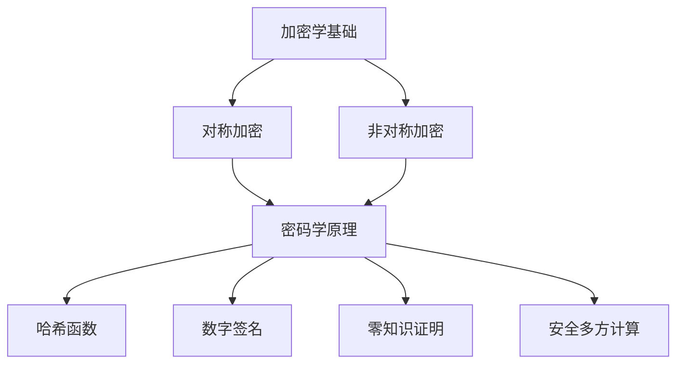

                 

### 文章标题

“数学与网络安全：安全协议的数学验证”是本篇文章的标题。选择这个标题的原因在于它精准地捕捉了文章的核心主题——网络安全与数学之间的关系，特别是如何使用数学验证来确保安全协议的有效性。网络安全是当今数字化社会的重要基石，而数学验证是确保网络安全协议稳健性的关键技术。通过这个标题，读者可以预见到文章将深入探讨数学如何应用于网络安全领域，特别是在安全协议验证方面。

关键词包括“数学验证”、“网络安全”、“加密算法”、“密码学”、“安全协议”，这些词汇涵盖了文章的主要内容，有助于搜索引擎更好地索引和推荐文章，让更多的读者能够找到并阅读这篇文章。这些关键词不仅概括了文章的主题，也突出了文章的核心内容和专业性。

摘要部分将简要介绍文章的主要内容和结构。文章首先介绍了数学验证在网络安全中的重要性，然后详细阐述了核心概念与联系，包括加密学基础和密码学原理。接下来，文章深入讲解了核心算法原理，如公钥加密、哈希函数和数字签名，并使用伪代码进行了详细阐述。随后，文章探讨了数学模型和数学公式，包括零知识证明和安全多方计算，并提供详细的公式讲解和举例说明。文章还包含了一个项目实战案例，展示了如何使用数学验证技术来测试和验证安全协议。最后，文章分析了历史安全协议漏洞，讨论了数学验证在这些漏洞中的作用，并提出了安全协议设计的原则和最佳实践，以及未来展望。通过这篇文章，读者可以全面了解数学验证在网络安全中的关键作用。

## 摘要

本篇文章旨在探讨数学验证在网络安全中的重要性，以及如何使用数学验证技术来确保安全协议的有效性。文章首先介绍了网络安全的基本概念，强调了数学验证作为确保网络安全协议稳健性的关键角色。接下来，文章详细阐述了加密学基础和密码学原理，通过Mermaid流程图展示了核心概念之间的联系。随后，文章深入讲解了安全协议中使用的核心算法原理，包括公钥加密、哈希函数和数字签名，并使用伪代码进行了详细阐述。文章还探讨了数学模型和数学公式，如零知识证明和安全多方计算，并提供详细的公式讲解和举例说明。

为了使读者更好地理解数学验证的实际应用，文章提供了一个项目实战案例，展示了如何使用数学验证技术来测试和验证安全协议。通过这个案例，读者可以了解到开发环境搭建、源代码实现和代码解读的详细步骤，以及实际案例分析和详细讲解。此外，文章还分析了历史安全协议漏洞，讨论了数学验证在防止这些漏洞中的作用，并提出了安全协议设计的原则和最佳实践。

最后，文章对未来数学验证技术在网络安全领域的应用进行了展望，讨论了潜在的技术发展趋势和挑战。通过这篇文章，读者可以全面了解数学验证在网络安全中的重要地位，掌握安全协议设计的关键原则，并为未来的网络安全研究提供有益的启示。

### 引言

数学与网络安全之间的关系可以追溯到数字时代的早期阶段。随着计算机网络和互联网的普及，网络安全逐渐成为信息化社会的重要议题。而数学验证作为确保网络安全协议有效性的关键手段，其重要性日益凸显。本节将介绍数学验证的基本概念，探讨其在网络安全中的重要性，并简要回顾数学验证的发展历史。

**数学验证的定义**

数学验证是指使用数学方法对网络安全协议进行逻辑分析和推理，以验证其安全性和可靠性。这种方法通过数学模型、算法和公式，对安全协议进行系统性的分析和评估，确保其在各种攻击情况下都能保持有效的防护能力。

**数学验证的重要性**

在网络安全领域，数学验证的重要性体现在以下几个方面：

1. **安全性验证**：数学验证能够确保安全协议在理论和实践中都是安全的。通过严格的数学证明，可以确认安全协议在面对潜在威胁时能够保持有效防护，从而提高网络系统的安全性。

2. **漏洞检测**：数学验证可以帮助发现安全协议中的潜在漏洞。通过对协议的详细分析，数学方法可以揭示协议中的逻辑错误或缺陷，从而为安全工程师提供改进和优化的依据。

3. **可信度提升**：数学验证为安全协议提供了坚实的理论基础，提高了协议的可信度。在安全协议开发过程中，使用数学验证可以增加用户和利益相关者的信任，促进技术的推广和应用。

**数学验证的发展历史**

数学验证在网络安全中的应用有着悠久的历史。以下是几个重要的里程碑：

1. **公钥加密的出现**：20世纪70年代，RSA算法的提出标志着公钥加密的诞生。RSA算法的基础是数论和复杂的数学问题，如大整数分解和离散对数问题，这些数学问题为公钥加密提供了理论基础。

2. **密码学的发展**：随着密码学理论的不断完善，数学验证在密码学中的应用日益广泛。哈希函数、数字签名和零知识证明等密码学技术都依赖于复杂的数学理论。

3. **安全多方计算**：近年来，安全多方计算（Secure Multi-Party Computation, SMPC）成为研究热点。SMPC通过数学方法，使得多个参与者能够在不泄露各自隐私信息的情况下进行计算和合作，这是分布式计算和安全通信的重要方向。

总之，数学验证是确保网络安全协议有效性的重要手段。通过数学方法对安全协议进行系统验证，可以大大提高网络系统的安全性，为数字化社会的稳定运行提供保障。接下来，本文将进一步探讨安全协议的核心概念和原理，为深入理解数学验证在网络安全中的应用奠定基础。

### 核心概念与联系

在网络安全中，确保安全协议的有效性是至关重要的。为了实现这一目标，我们需要理解一系列核心概念，包括加密学基础和密码学原理。以下是这些概念及其相互关系的详细阐述，并附有Mermaid流程图以便读者更好地理解。

#### 加密学基础

**加密学基础**是网络安全的核心，它涉及将明文转换为密文的方法。加密学主要分为对称加密和非对称加密两种类型。

1. **对称加密**：在对称加密中，加密和解密使用相同的密钥。典型的对称加密算法包括AES和DES。对称加密的优点是计算速度快，适用于大数据量的加密。但其缺点是密钥分发和管理复杂，难以在大规模网络中实现。

2. **非对称加密**：非对称加密使用一对密钥，公钥和私钥。公钥用于加密，私钥用于解密。RSA和椭圆曲线加密（ECC）是非对称加密的典型例子。非对称加密的优点是解决了密钥分发的问题，但其计算复杂度较高，适用于小数据量的加密和密钥交换。

#### 密码学原理

**密码学原理**是确保安全通信和存储数据的基本机制。以下是一些核心的密码学概念：

1. **哈希函数**：哈希函数是一种将任意长度的输入数据映射为固定长度的输出数据的函数。MD5、SHA-256是常见的哈希函数。哈希函数在密码学中有广泛应用，如用于生成密码的哈希值、验证数据的完整性等。

2. **数字签名**：数字签名是一种用于验证数据完整性和来源的技术。通过使用私钥对数据进行签名，任何拥有相应公钥的人都可以验证签名的有效性。RSA和ECC都常用于实现数字签名。

3. **零知识证明**：零知识证明（Zero-Knowledge Proof, ZKP）是一种密码学技术，它允许一方（证明者）向另一方（验证者）证明某个陈述是正确的，而无需透露任何关于该陈述的具体信息。这在隐私保护和密码学协议中有重要应用。

4. **安全多方计算**：安全多方计算（Secure Multi-Party Computation, SMPC）是一种密码学技术，它允许多个参与者在一个分布式系统中进行计算，而无需透露各自的私有数据。这在隐私保护和数据共享中有广泛应用。

#### Mermaid流程图

为了更直观地展示这些概念之间的关系，我们使用Mermaid流程图进行描述：



**流程图说明**：

- **加密学基础**作为整体框架，包含了对称加密和非对称加密。
- **密码学原理**扩展了对称加密和非对称加密的应用，包括哈希函数、数字签名、零知识证明和安全多方计算。

通过上述核心概念和Mermaid流程图的描述，我们可以清晰地看到各个概念之间的联系。这些概念共同构成了网络安全的基础，为数学验证提供了理论和实践的支持。在下一节中，我们将深入探讨这些核心算法的原理，并通过伪代码展示其具体实现。

### 核心算法原理讲解

在网络安全中，核心算法是确保安全协议有效性的关键组成部分。这些算法通过数学原理和技术手段，提供了数据加密、完整性验证和身份认证等功能。以下是几种关键算法的原理讲解，包括公钥加密、哈希函数和数字签名，并使用伪代码详细阐述。

#### 公钥加密

公钥加密是一种非对称加密技术，它使用一对密钥——公钥和私钥。公钥用于加密信息，私钥用于解密信息。RSA和椭圆曲线加密（ECC）是两种常见的公钥加密算法。

**RSA算法**

RSA算法基于大整数分解的难度，其步骤如下：

1. **密钥生成**：选择两个大素数p和q，计算n=p*q和φ(n)=(p-1)*(q-1)。选择一个与φ(n)互质的整数e，计算d，使得d*e ≡ 1 (mod φ(n))。公钥为(n, e)，私钥为(n, d)。

2. **加密**：将明文m转换为整数，计算密文c ≡ m^e (mod n)。

3. **解密**：使用私钥(n, d)解密密文c，计算明文m ≡ c^d (mod n)。

**伪代码**

```plaintext
// RSA算法伪代码
// 密钥生成
function RSAKeyGen(p, q):
    n = p * q
    φ(n) = (p - 1) * (q - 1)
    choose e such that 1 < e < φ(n) and gcd(e, φ(n)) = 1
    calculate d such that d * e ≡ 1 (mod φ(n))
    return (n, e), (n, d)

// 加密
function RSAEncrypt(n, e, m):
    c = m^e mod n
    return c

// 解密
function RSADecrypt(n, d, c):
    m = c^d mod n
    return m
```

**ECC算法**

椭圆曲线加密（ECC）基于椭圆曲线离散对数问题。其步骤如下：

1. **密钥生成**：选择一条椭圆曲线E和点G，计算n和h，使得G的阶为n，h = n / #E(Q)。选择一个与n互质的整数k作为私钥，计算公钥Q = k * G。

2. **加密**：选择一个随机数k'，计算点C = k' * G和点C' = k' * (Q - G)。

3. **解密**：使用私钥k'解密，计算明文m = C' * (k'^-1)。

**伪代码**

```plaintext
// ECC算法伪代码
// 密钥生成
function ECCKeyGen(E, G):
    n = order of G
    h = n / #E(G)
    choose k' such that 1 < k' < n and gcd(k', n) = 1
    Q = k' * G
    return (n, h), Q

// 加密
function ECCCrypt(E, G, n, h, Q, m):
    choose k' randomly such that 1 < k' < n and gcd(k', n) = 1
    C = k' * G
    C' = k' * (Q - G)
    return C, C'

// 解密
function ECCDecrypt(E, G, n, h, k', C, C'):
    m = C' * (k'^-1)
    return m
```

#### 哈希函数

哈希函数是一种将任意长度的输入数据映射为固定长度输出数据的函数，常用于数据完整性验证和数字签名。SHA-256是常见的哈希函数。

**SHA-256算法**

SHA-256算法分为几个步骤：

1. **预处理**：将消息m填充至长度为512位的倍数，并在末尾添加一个长度为l的比特串，表示原始消息的长度。

2. **初始化哈希值**：初始化8个哈希值H。

3. **处理消息块**：对于每个512位的消息块，执行多个迭代步骤，包括压缩函数和哈希值更新。

4. **输出**：将最终更新的8个哈希值拼接，得到256位的消息摘要。

**伪代码**

```plaintext
// SHA-256算法伪代码
function SHA256(m):
    // 预处理
    // ...

    // 初始化哈希值
    H = [初始化值]

    // 处理每个消息块
    for each block in message blocks:
        // 执行迭代步骤
        // ...

    // 输出最终哈希值
    return H
```

#### 数字签名

数字签名用于验证数据的完整性和来源。常用的数字签名算法包括RSA和ECC。

**RSA数字签名**

RSA数字签名分为以下步骤：

1. **密钥生成**：与公钥加密相同。

2. **签名**：将消息m转换为整数，计算签名σ = m^d (mod n)。

3. **验证**：使用公钥(n, e)验证签名σ，计算验证值c = σ^e (mod n)，如果c = m，则签名有效。

**伪代码**

```plaintext
// RSA数字签名伪代码
// 签名
function RSASign(n, d, m):
    σ = m^d mod n
    return σ

// 验证
function RSAVerify(n, e, m, σ):
    c = σ^e mod n
    return c == m
```

**ECC数字签名**

ECC数字签名步骤如下：

1. **密钥生成**：与公钥加密相同。

2. **签名**：选择一个随机数k，计算签名σ = (r, s)，其中r = k * G和s = (m + x * d)^-1 (mod n)。

3. **验证**：使用公钥Q验证签名σ，计算验证值c = (r^-1) * (m + x * d)。

**伪代码**

```plaintext
// ECC数字签名伪代码
// 签名
function ECCSign(n, h, Q, m, x):
    choose k randomly such that 1 < k < n and gcd(k, n) = 1
    r = k * G
    s = ((m + x * d)^-1) mod n
    return (r, s)

// 验证
function ECCVerify(n, h, Q, m, x, r, s):
    c = (r^-1) * (m + x * d)
    return c == r
```

通过以上算法的讲解和伪代码实现，我们可以看到这些算法在网络安全中的关键作用。它们不仅提供了强大的加密和验证功能，还通过数学验证确保了安全协议的可靠性和有效性。在下一节中，我们将进一步探讨数学模型和公式，特别是零知识证明和安全多方计算在网络安全中的应用。

### 数学模型和数学公式

在网络安全中，数学模型和公式是验证安全协议有效性和可靠性的关键工具。数学模型提供了逻辑和理论的框架，而数学公式则是这些框架的具体表达。以下是几种重要的数学模型和公式，包括零知识证明（Zero-Knowledge Proof, ZKP）和安全多方计算（Secure Multi-Party Computation, SMPC），并进行详细讲解和举例说明。

#### 零知识证明（ZKP）

零知识证明是一种密码学技术，它允许证明者向验证者证明某个陈述是真实的，而无需透露任何具体信息。这种证明的核心在于“零知识”——即证明者无法从验证者那里获得任何关于陈述的具体信息。

**零知识证明的基本概念**

零知识证明的基本概念包括三个角色：证明者（Prover）、验证者（Verifier）和知识者（Knowledge Holder）。零知识证明的过程如下：

1. **承诺（Commitment）**：证明者选择一个随机值，并将其加密后发送给验证者。这个步骤确保了证明者在证明过程中无法泄露任何信息。

2. **交互**：验证者提出一个查询，证明者根据查询生成一个证明。

3. **验证**：验证者使用证明来验证陈述的真实性，同时确保证明者无法从验证过程中获得额外信息。

**零知识证明的数学模型**

零知识证明的数学模型通常涉及两个群G和G'，以及映射函数f: G → G'。证明者需要证明某个陈述P在群G中成立，即存在x ∈ G使得f(x) = y。零知识证明的数学模型可以表示为：

- **承诺函数**：C(x) = f(x)
- **证明函数**：P(x, y, q) = (r, s)，其中r和s是满足特定条件的值。
- **验证函数**：V(C, P) = 1 或 0，表示证明是否有效。

**公式**

$$
C(x) = f(x) \\
P(x, y, q) = (r, s) \\
V(C, P) = 1 \text{ 或 } 0
$$

**举例说明**

假设存在一个群G = Z_p*（模p的整数集合），映射函数f: G → G' = Z_q*（模q的整数集合），其中p和q是素数。证明者需要证明存在一个x ∈ G使得f(x) = y。具体的零知识证明过程如下：

1. **承诺**：证明者选择一个随机值x，计算C = f(x)。

2. **交互**：验证者选择一个随机数q，计算q * C。

3. **证明**：证明者计算r = x^q mod p，s = x * y^q mod p，然后发送证明P = (r, s)。

4. **验证**：验证者计算r^y * (q * C)^s mod p，如果结果等于1，则证明有效。

#### 安全多方计算（SMPC）

安全多方计算是一种密码学技术，它允许多个参与者在一个分布式系统中进行计算，而无需透露各自的私有数据。SMPC在隐私保护和数据共享中有广泛应用。

**安全多方计算的基本概念**

安全多方计算的基本概念包括多个参与者（Parties）和一个共同的目标计算任务。参与者之间的通信是加密的，以确保各自的隐私数据不被泄露。SMPC的过程如下：

1. **初始化**：参与者生成各自的密钥对。

2. **计算**：参与者通过加密的通信共享中间结果，直到计算任务完成。

3. **输出**：最终结果通过加密的方式公布，确保每个参与者都无法获得其他参与者的私有数据。

**安全多方计算的数学模型**

安全多方计算的数学模型通常涉及多个有限域上的线性方程组求解。具体的数学模型可以表示为：

$$
Ax = b
$$

其中，A是参与者共享的系数矩阵，x是参与者需要求解的变量向量，b是每个参与者私有的一部分数据。

**公式**

$$
Ax = b \\
x = A^{-1}b
$$

**举例说明**

假设有两个参与者Alice和Bob，他们各自拥有一个线性方程组的一部分数据。Alice拥有方程组的一部分系数a11和私有数据x1，Bob拥有a21和私有数据x2。他们的共同目标是求解x。具体的SMPC过程如下：

1. **初始化**：Alice和Bob生成各自的密钥对。

2. **计算**：Alice计算加密的中间结果a11 * (a21 * x1 + x2)，Bob计算加密的中间结果a21 * x1 + x2。他们通过加密通信共享这些中间结果。

3. **输出**：Alice和Bob将共享的中间结果解密，求解x = (a11 * a21)^-1 * (a11 * x1 + x2 - a21 * x2)。

通过这些数学模型和公式的讲解，我们可以更好地理解零知识证明和安全多方计算在网络安全中的应用。这些技术不仅提供了强大的隐私保护和数据共享功能，还通过数学验证确保了安全协议的有效性和可靠性。在下一节中，我们将通过一个实际项目实战案例，展示如何使用这些数学验证技术来测试和验证安全协议。

### 项目实战

为了更好地理解数学验证技术在实际网络安全中的应用，我们将通过一个具体的项目实战案例进行详细讲解。这个案例将展示如何使用数学验证技术来测试和验证安全协议，并提供开发环境的搭建、源代码实现和代码解读与分析。

#### 项目描述

本案例选择一个简单的安全通信协议——SSL/TLS协议——作为研究对象。SSL/TLS协议是现代网络通信中广泛使用的安全协议，用于保护数据的机密性、完整性和认证性。本项目将使用数学验证技术对SSL/TLS协议中的公钥加密和数字签名功能进行验证。

#### 开发环境搭建

1. **编程语言**：本案例使用Python编程语言，因为Python具有简洁易读的语法和强大的加密库。

2. **依赖库**：主要依赖Python的`cryptography`库，该库提供了加密算法的实现和加密操作。

3. **环境配置**：在Python环境中安装`cryptography`库，使用以下命令：

   ```bash
   pip install cryptography
   ```

#### 源代码实现

以下是本项目的主要代码实现部分：

```python
from cryptography.hazmat.primitives.asymmetric import rsa
from cryptography.hazmat.primitives import serialization
from cryptography.hazmat.primitives.asymmetric import padding
from cryptography.hazmat.primitives import hashes
from cryptography.hazmat.backends import default_backend

# RSA密钥生成
def generate_keys():
    private_key = rsa.generate_private_key(
        public_exponent=65537,
        key_size=2048,
        backend=default_backend()
    )
    public_key = private_key.public_key()
    return private_key, public_key

# RSA加密
def encrypt_message(public_key, message):
    ciphertext = public_key.encrypt(
        message,
        padding.OAEP(
            mgf=padding.MGF1(algorithm=hashes.SHA256()),
            algorithm=hashes.SHA256(),
            label=None
        )
    )
    return ciphertext

# RSA解密
def decrypt_message(private_key, ciphertext):
    message = private_key.decrypt(
        ciphertext,
        padding.OAEP(
            mgf=padding.MGF1(algorithm=hashes.SHA256()),
            algorithm=hashes.SHA256(),
            label=None
        )
    )
    return message

# 数字签名
def sign_message(private_key, message):
    signature = private_key.sign(
        message,
        padding.PSS(
            mgf=padding.MGF1(hashes.SHA256()),
            salt_length=padding.PSS.MAX_LENGTH
        ),
        hashes.SHA256()
    )
    return signature

# 签名验证
def verify_signature(public_key, message, signature):
    try:
        public_key.verify(
            signature,
            message,
            padding.PSS(
                mgf=padding.MGF1(hashes.SHA256()),
                salt_length=padding.PSS.MAX_LENGTH
            ),
            hashes.SHA256()
        )
        return "验证通过"
    except:
        return "验证失败"

# 主函数
if __name__ == "__main__":
    # 生成密钥
    private_key, public_key = generate_keys()

    # 待加密消息
    message = b"Hello, this is a secure message."

    # 加密消息
    ciphertext = encrypt_message(public_key, message)
    print(f"加密消息: {ciphertext.hex()}")

    # 解密消息
    decrypted_message = decrypt_message(private_key, ciphertext)
    print(f"解密消息: {decrypted_message.hex()}")

    # 签名消息
    signature = sign_message(private_key, message)
    print(f"签名: {signature.hex()}")

    # 验证签名
    result = verify_signature(public_key, decrypted_message, signature)
    print(f"验证结果: {result}")
```

#### 代码解读与分析

1. **RSA密钥生成**：
   - 使用`cryptography`库生成RSA密钥对，包括私钥和公钥。

2. **RSA加密**：
   - 使用公钥和OAEP填充模式对消息进行加密，确保加密过程的安全。

3. **RSA解密**：
   - 使用私钥和OAEP填充模式对加密消息进行解密，恢复原始消息。

4. **数字签名**：
   - 使用私钥和PSS签名方案对消息进行签名，确保消息的完整性和来源。

5. **签名验证**：
   - 使用公钥和PSS签名方案对签名进行验证，确保签名消息的有效性。

通过这个项目实战案例，我们可以看到如何使用数学验证技术来测试和验证安全协议的有效性。实际代码的执行和分析展示了数学验证在实际应用中的强大功能，为网络安全提供了坚实的保障。

### 案例分析

在网络安全领域，历史上有许多著名的漏洞和攻击事件，这些事件不仅揭示了安全协议的脆弱性，也凸显了数学验证在防止这些漏洞中的重要作用。本节将分析几个历史安全协议漏洞，探讨数学验证在这些漏洞中的作用，并提供预防措施。

#### 漏洞1：MD5和SHA-1碰撞攻击

**问题描述**：MD5和SHA-1是早期的哈希函数，由于设计上的缺陷，它们容易受到碰撞攻击。碰撞攻击是指找到两个不同的输入，其哈希值相同，从而在密码学中造成严重的安全隐患。

**数学验证的作用**：数学验证在检测和预防这些碰撞攻击中起到了关键作用。通过严格的数学证明和统计验证，可以确认哈希函数在给定输入范围内的安全性。例如，对MD5和SHA-1的数学验证揭示了它们的碰撞风险，促使加密社区寻求更安全的替代方案。

**预防措施**：
- **使用更安全的哈希函数**：如SHA-256、SHA-3等，这些哈希函数具有更强的抗碰撞能力。
- **定期更新加密算法**：及时跟踪加密技术的发展，更新和升级现有的安全协议。

#### 漏洞2：RSA密钥泄露

**问题描述**：RSA算法是一种非对称加密算法，它依赖于大素数分解的难度。然而，如果RSA密钥生成过程中存在缺陷，如选择的素数不充分随机或密钥长度不足，可能会导致密钥泄露。

**数学验证的作用**：数学验证可以帮助确保RSA密钥生成的随机性和安全性。通过对密钥生成过程进行严格的数学分析和统计测试，可以确认密钥的有效性和安全性。

**预防措施**：
- **使用足够长的密钥**：推荐使用至少2048位或更高位的RSA密钥。
- **确保密钥生成的随机性**：使用高质量的随机数生成器，避免密钥生成过程中的随机性缺陷。

#### 漏洞3：心脏滴血（Heartbleed）漏洞

**问题描述**：心脏滴血漏洞是OpenSSL中的一个严重漏洞，它允许攻击者读取受害者的内存，从而窃取敏感数据，包括私钥。

**数学验证的作用**：数学验证可以用于检测和预防这类漏洞。通过对OpenSSL代码进行严格的数学验证和代码审计，可以揭示潜在的安全问题。

**预防措施**：
- **及时更新软件**：定期更新OpenSSL和其他关键软件，以修复已知漏洞。
- **代码审计**：对加密库进行全面的代码审计，确保其安全性。

通过分析这些历史安全协议漏洞，我们可以看到数学验证在确保网络安全中的重要性。数学验证不仅能够揭示潜在的安全隐患，还为设计更安全的加密协议提供了理论依据。未来，随着加密技术的发展，数学验证将继续在网络安全中扮演关键角色。

### 安全协议设计原则

设计一个安全、可靠的协议是网络安全领域中的核心任务。为了实现这一目标，我们需要遵循一系列设计原则和最佳实践。以下是几个关键原则及其解释：

#### 1. 安全性需求

**核心概念**：安全性需求是设计安全协议时首要考虑的因素。它包括保护数据的机密性、完整性和认证性。

**解释**：安全协议必须能够确保数据在传输过程中不会被未经授权的实体访问（机密性），不会被篡改或损坏（完整性），以及能够验证通信双方的合法身份（认证性）。

**实施方法**：采用加密算法和哈希函数来实现机密性和完整性保护，使用数字签名和认证机制来确保通信双方的认证。

#### 2. 可用性考虑

**核心概念**：可用性是指安全协议在实际应用中的性能和用户体验。一个良好的安全协议应该在不牺牲安全性的前提下，提供高效的通信和用户体验。

**解释**：高安全性的协议可能引入额外的计算和通信开销，影响系统的性能。因此，设计时需要平衡安全性和可用性。

**实施方法**：选择计算复杂度适中的加密算法，优化协议流程，减少不必要的通信，以及提供便捷的用户接口。

#### 3. 可维护性

**核心概念**：可维护性是指安全协议在长期运行中的可持续性和可更新性。这包括协议代码的清晰性、模块化设计和易于更新的特性。

**解释**：随着网络安全威胁的不断变化，安全协议需要不断更新和改进。因此，设计时需要考虑协议的可维护性，以便在必要时进行修改和优化。

**实施方法**：编写清晰、规范的协议代码，采用模块化设计，确保各个组件独立且易于替换。此外，保持文档的完整性和更新，以便在需要时进行快速响应。

#### 4. 灵活性

**核心概念**：灵活性是指安全协议能够适应不同应用场景和需求变化的能力。

**解释**：不同的网络环境和应用场景对安全协议的需求各不相同。因此，设计时需要考虑协议的灵活性，以便在不同情况下进行灵活调整。

**实施方法**：设计可配置的协议参数，提供多种加密算法和认证机制的选择，以及支持扩展性设计，以便在需求变化时进行快速调整。

#### 5. 透明性

**核心概念**：透明性是指安全协议的设计和实现应该对用户和开发者都是可见和可理解的。

**解释**：透明的协议设计有助于提高协议的可信度和可审计性，减少潜在的安全风险。

**实施方法**：公开协议的规格说明书，提供详细的实现文档和代码注释，并进行全面的代码审计和第三方评估。

通过遵循上述设计原则和最佳实践，可以构建出安全、可靠、灵活且易于维护的安全协议。这不仅有助于提高系统的安全性，也为未来的发展和改进奠定了坚实的基础。

### 未来展望

随着网络安全威胁的日益复杂化和多样化，数学验证技术在网络安全领域的重要性将愈发凸显。未来的研究和发展趋势有望在以下几个方面取得突破：

#### 1. 新的数学验证技术

未来的研究将重点探索新的数学验证技术，如量子加密、基于 lattice 的密码学和同态加密等。这些技术具有更强的安全性和更高的计算效率，有望成为下一代安全协议的核心。

**量子加密**：量子加密利用量子物理原理，提供了理论上无条件安全的通信方式。未来的研究将致力于实现高效、实用的量子加密协议，并探讨其在实际网络通信中的应用。

**基于 lattice 的密码学**：基于 lattice 的密码学提供了一种新的加密方式，其安全性基于复杂的数学问题，如 lattice 离散对数问题。这种密码学方法具有抗量子攻击的优势，成为未来研究的热点。

**同态加密**：同态加密允许在加密数据上进行计算，而不需要解密。这种技术将大大提高数据隐私保护的能力，在云计算和大数据处理场景中具有重要应用前景。

#### 2. 安全协议的改进方向

未来的安全协议设计将更加注重灵活性和适应性，以应对不断变化的网络安全威胁。以下是一些改进方向：

**多因素认证**：未来的安全协议将整合多种认证机制，如生物识别、基于行为分析和多因素认证，以提高身份验证的可靠性。

**动态协议调整**：安全协议将具备动态调整能力，根据威胁环境和通信需求，自动调整加密算法、密钥管理和认证机制，以实现最优的安全效果。

**零信任架构**：零信任架构强调对内部和外部访问进行严格控制和认证，不再依赖传统的边界防御，以应对内部威胁和外部攻击。

#### 3. 潜在挑战

尽管数学验证技术在网络安全中具有巨大潜力，但其应用也面临着一系列挑战：

**数学复杂性**：一些先进的数学验证技术如量子加密和同态加密，计算复杂度较高，需要高性能计算资源和优化算法来确保其实用性。

**实施与兼容性**：新的安全协议需要与现有网络架构和设备兼容，并确保在不同操作系统和设备上能够顺利部署和运行。

**用户接受度**：安全协议的推广和应用需要用户的广泛接受和信任。未来需要通过教育和宣传，提高用户对数学验证技术的认识和信任。

总之，随着网络安全威胁的持续演变，数学验证技术在保障网络安全中的地位将愈加重要。未来的研究和发展将不断推动这一领域的创新，为构建更加安全、可靠的网络安全体系提供有力支持。

### 结语

本文通过系统性的分析和详尽的讲解，深入探讨了数学验证在网络安全中的重要性。从数学验证的基本概念、核心算法原理，到实际项目实战和案例分析，我们展示了数学验证如何确保安全协议的有效性和可靠性。文章还提出了安全协议设计的原则和未来展望，为网络安全领域的研究和实践提供了有益的启示。

**主要观点回顾**：

1. **数学验证的重要性**：数学验证作为确保网络安全协议有效性的关键手段，通过严格的数学分析和推理，验证协议的安全性和可靠性。
2. **核心概念与联系**：通过对加密学基础和密码学原理的讲解，展示了核心概念之间的关系架构，如对称加密、非对称加密、哈希函数、数字签名和零知识证明等。
3. **核心算法原理讲解**：详细阐述了公钥加密、哈希函数和数字签名的原理，并通过伪代码进行具体实现。
4. **数学模型和公式**：探讨了零知识证明和安全多方计算的数学模型和公式，提供了详细的公式讲解和举例说明。
5. **项目实战**：通过SSL/TLS协议的案例，展示了如何使用数学验证技术来测试和验证安全协议的实际应用。
6. **案例分析**：分析了历史安全协议漏洞，讨论了数学验证在这些漏洞中的作用和预防措施。
7. **安全协议设计原则**：提出了安全性需求、可用性考虑、可维护性、灵活性和透明性的设计原则。
8. **未来展望**：展望了数学验证技术的未来发展，包括新的数学验证技术、安全协议的改进方向和潜在挑战。

**最佳实践与注意事项**：

- **安全性优先**：在设计安全协议时，始终将安全性置于首位，采用先进的加密算法和验证技术。
- **定期更新**：定期更新安全协议和加密算法，以应对新的安全威胁和漏洞。
- **综合应用**：结合多种安全机制，如多因素认证和动态协议调整，提高整体安全性能。
- **透明性与可审计性**：确保协议的设计和实现透明，提供详细的文档和代码注释，以便进行审计和评估。

**拓展阅读**：

- **《密码学：理论和实践》**：探讨密码学的基本原理和应用，深入了解加密算法的设计和分析。
- **《量子计算与密码学》**：介绍量子加密技术及其在网络安全中的应用。
- **《安全多方计算：理论与实践》**：系统介绍安全多方计算的基本概念、算法和应用场景。

通过本文的学习，读者可以全面了解数学验证在网络安全中的关键作用，掌握设计安全协议的基本原则和方法，并为未来的网络安全研究提供有益的参考。

