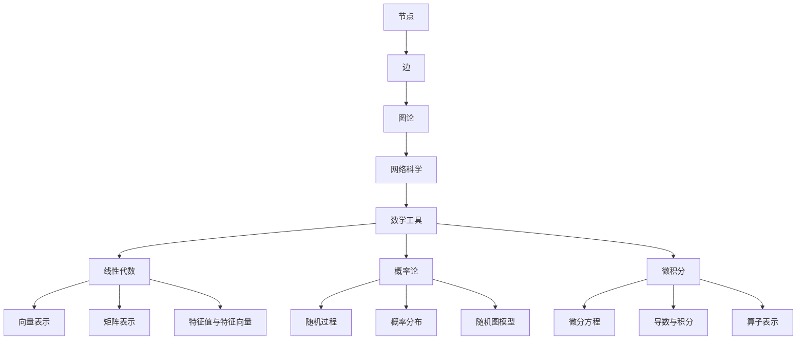

                 


### 摘要

本文深入探讨了数学与网络科学的交叉领域，即复杂网络的数学特性。首先，我们回顾了复杂网络的基本概念，包括网络的定义、图论基础以及网络结构的多样性。随后，我们引入了网络科学的数学工具，包括线性代数、概率论和微积分，并展示了这些工具如何帮助理解网络的拓扑性质和行为模式。本文的核心在于详细分析了复杂网络的数学特性，包括网络的鲁棒性、中心性和动态性，通过数学模型和公式进行了严谨的阐述。同时，我们通过案例研究，展示了这些理论在实际应用中的价值。文章的最后，我们对未来的研究方向进行了展望，并总结了对网络科学及其应用的重要性。通过本文，读者将获得对复杂网络数学特性全面而深入的理解。

### 引言

在当今信息技术飞速发展的时代，网络科学已成为一个跨学科的研究领域，涵盖了从社交网络到互联网、从生物网络到交通网络等多个方面。随着网络的复杂性和规模不断增长，理解和分析网络的结构和功能变得日益重要。数学，作为理解和解决复杂问题的有力工具，与网络科学的结合为研究复杂网络提供了新的视角和强大的分析方法。

**复杂网络**，顾名思义，是指具有高度复杂性的网络系统。这些网络往往包含大量的节点和连接，并且具有各种非平凡的拓扑特征和动态行为。复杂网络的典型特征包括小世界效应和无标度性，这些特性使得传统的方法难以有效地描述和预测其行为。因此，数学作为一种精确和逻辑严谨的科学，为复杂网络的研究提供了坚实的基础。

在复杂网络研究中，数学工具的引入起到了至关重要的作用。线性代数、概率论、微积分等数学分支，不仅帮助研究者更好地理解和描述网络的拓扑结构，还能分析网络的动态行为和功能特性。例如，通过概率论和统计物理的方法，可以分析网络的鲁棒性和脆弱性；而通过线性代数和图论，可以研究网络中的中心节点和关键路径。

本篇文章旨在深入探讨数学与网络科学的交叉领域，特别是复杂网络的数学特性。文章首先回顾了复杂网络的基本概念和定义，然后介绍了网络科学的数学工具，并详细分析了复杂网络的几个关键数学特性。接下来，我们将通过案例研究和实例分析，展示这些数学特性的应用价值。最后，文章将对未来网络科学研究中的潜在方向进行展望，并总结本文的核心观点。

通过本文的阅读，读者将不仅能够获得对复杂网络数学特性的全面了解，还将学会如何运用数学工具分析复杂网络的行为和功能。这对于理解现实世界中的网络系统，以及开发新的网络技术和应用，具有重要的理论和实践意义。

### 基本概念与定义

要理解复杂网络的数学特性，首先需要掌握一些基本概念和定义。复杂网络，通常指的是具有高度复杂性的网络系统，其中节点和边的关系不仅仅是简单的连接，还可能包含复杂的相互作用和动态行为。以下是几个关键概念：

**节点（Node）**：网络中的个体，可以是任何实体，如人、城市、基因、电子设备等。

**边（Edge）**：连接两个节点的元素，可以是有向的也可以是无向的。边的存在通常表示节点之间的某种关系，如友谊、交通连接或信息流动。

**图（Graph）**：由节点集合和边集合构成的结构，是网络科学中最基本的数学模型。

**无向图（Undirected Graph）**：边没有方向性的图。在这种图中，如果节点 \(A\) 和节点 \(B\) 之间存在边，则节点 \(B\) 和节点 \(A\) 也必然存在边。

**有向图（Directed Graph）**：边有方向性的图。在这种图中，从节点 \(A\) 到节点 \(B\) 的边与从节点 \(B\) 到节点 \(A\) 的边是不同的。

**网络拓扑（Network Topology）**：描述网络中节点和边如何排列和连接的结构。网络拓扑直接影响网络的性能、稳定性和鲁棒性。

**小世界效应（Small-World Effect）**：指在网络中，节点之间的平均最短路径长度很短，这意味着网络具有很高的连通性。这一现象最早由 Watts 和 Strogatz 在1998年的研究工作中发现。

**无标度网络（Scale-Free Network）**：在网络中，节点度数的分布服从幂律分布，即大多数节点的度数相对较低，而少数节点的度数极高。这种特性导致无标度网络具有高度的可扩展性和抗攻击性。

了解这些基本概念和定义，是进一步探讨复杂网络数学特性的基础。在下一节中，我们将详细讨论图论的基础知识，包括网络的表示方法和基本的图论算法。

### 图论基础

图论是研究图的结构和性质的一个数学分支，在复杂网络研究中起着至关重要的作用。图（Graph）由节点（Node）和边（Edge）组成，可以用来表示各种网络结构，如社交网络、交通网络和通信网络等。下面，我们将介绍图的基本表示方法、图的类型以及一些常见的图论算法。

#### 图的表示方法

图的表示方法主要有两种：邻接矩阵和邻接表。

**邻接矩阵（Adjacency Matrix）**：邻接矩阵是一个 \(n \times n\) 的方阵，其中 \(n\) 是图的节点数。矩阵的元素 \(a_{ij}\) 表示节点 \(i\) 和节点 \(j\) 之间是否有边相连。如果节点 \(i\) 和节点 \(j\) 是邻接的，则 \(a_{ij} = 1\)；否则，\(a_{ij} = 0\)。对于无向图，邻接矩阵是对称的；而对于有向图，邻接矩阵则不是对称的。

**邻接表（Adjacency List）**：邻接表是一个数组，数组的每个元素对应一个节点，每个元素是一个链表，链表中包含了与该节点相邻的所有节点。邻接表比邻接矩阵在存储空间上更高效，尤其是当图的密度较低时。

#### 图的类型

**无向图（Undirected Graph）**：无向图的边没有方向，任意两个节点之间的连接是对称的。

**有向图（Directed Graph）**：有向图的边有方向，从一个节点指向另一个节点，因此是有序的。

**简单图（Simple Graph）**：在简单图中，任意两个节点之间不会存在多于一条的边，也不会存在自环（即一个节点连接自己）。

**多重图（Multigraph）**：在多重图中，任意两个节点之间可以有多个边，也可以存在自环。

**加权图（Weighted Graph）**：在加权图中，每条边都有一个权重，表示节点之间连接的强度或成本。

**连通图（Connected Graph）**：在连通图中，任意两个节点之间都存在一条路径。

**树（Tree）**：树是一种特殊的无向图，其中任意两个节点之间都存在且仅存在一条路径。树没有环。

**环（Cycle）**：环是一个包含 \(n\) 个节点的简单无向图，其中每个节点恰好连接 \(n-1\) 个其他节点，并且最后一个节点连接回第一个节点。

#### 常见的图论算法

**深度优先搜索（Depth-First Search, DFS）**：DFS 是一种用于遍历或搜索图的算法。它从起始节点开始，尽可能深入地探索一条路径，直到达到一个没有未访问邻居的节点，然后回溯并探索其他路径。DFS 的伪代码如下：

```
DFS(Graph G, Vertex v):
    Mark v as visited
    for each unvisited neighbor u of v:
        DFS(G, u)
```

**广度优先搜索（Breadth-First Search, BFS）**：BFS 与 DFS 类似，但它先访问所有未访问的邻接节点，然后再访问这些节点的邻接节点。BFS 的伪代码如下：

```
BFS(Graph G, Vertex v):
    Create an empty queue
    Mark v as visited
    Enqueue v into the queue
    while queue is not empty:
        Dequeue a vertex v from the queue
        for each unvisited neighbor u of v:
            Mark u as visited
            Enqueue u into the queue
```

**最小生成树（Minimum Spanning Tree, MST）**：MST 是连接图中所有节点的边集合，且边的总权重最小。Prim 算法和 Kruskal 算法是求解 MST 的两种常用算法。

**Prim 算法**：从任意一个节点开始，逐步添加权重最小的边，直到所有节点都被连接。

```
Prim Algorithm(G, startVertex):
    Initialize a priority queue with edges from the startVertex
    Add the startVertex to the MST
    while the priority queue is not empty:
        Extract the minimum weight edge (u, v)
        if v is not already in the MST:
            Add v to the MST
            Add all edges from v to the priority queue
```

**Kruskal 算法**：按权重升序处理边，每次添加边到 MST 中，只要它不会形成环。

```
Kruskal Algorithm(G):
    Initialize an empty MST
    Sort all edges in G by weight
    for each edge (u, v) in G:
        if adding (u, v) to the MST does not form a cycle:
            Add (u, v) to the MST
```

通过掌握这些基本的图论知识和算法，我们可以更好地理解和分析复杂网络的特性。在下一节中，我们将进一步探讨网络科学的数学工具，如线性代数、概率论和微积分。

### 数学工具

在复杂网络研究中，数学工具起到了至关重要的作用。线性代数、概率论和微积分是三大主要的数学工具，它们为复杂网络的描述、分析和理解提供了坚实的理论基础。以下将分别介绍这三大数学工具在复杂网络研究中的应用。

#### 线性代数

线性代数是研究向量空间和线性变换的数学分支，它在复杂网络的研究中有着广泛的应用。

**向量表示**：在复杂网络中，每个节点可以用一个向量来表示，这个向量可以包含节点的属性信息，如度数、权重、位置等。通过向量加法和数乘运算，可以方便地处理多个节点的集合。

**矩阵表示**：矩阵是线性代数中的核心概念，它可以用来表示网络的拓扑结构。邻接矩阵是描述无向图和有向图常用的矩阵表示形式。对于加权图，还可以使用加权邻接矩阵。通过矩阵运算，如矩阵乘法和矩阵求逆，可以分析网络的性质和特征。

**特征值与特征向量**：特征值和特征向量是矩阵理论中的重要概念。在复杂网络中，通过计算矩阵的特征值和特征向量，可以识别网络的中心节点和关键路径。例如，对于邻接矩阵，其特征值可以反映网络的连通性和稳定性；而特征向量可以揭示网络中节点之间的相对重要性。

#### 概率论

概率论是研究随机现象和随机事件规律的数学分支，它在复杂网络的分析中具有重要意义。

**随机过程**：随机过程是一系列随机变量的集合，可以用来描述网络的动态行为。例如，马尔可夫链是一种常见的随机过程，它用于分析网络的演化规律。

**概率分布**：概率分布描述了随机变量取值的概率分布情况。在复杂网络中，节点度数、边权重等都可以用概率分布来描述。常见的概率分布包括正态分布、泊松分布和二项分布等。

**随机图模型**：随机图模型是一种通过概率方法生成的图结构，如Erdős-Rényi图和Barabási-Albert图。这些模型可以帮助理解复杂网络的统计特性，如度数分布和小世界效应。

#### 微积分

微积分是研究函数变化的数学工具，它在复杂网络的研究中用于分析网络的动态行为。

**微分方程**：微分方程用于描述系统的动态行为，如网络的演化方程和流模型。通过解微分方程，可以预测网络的稳定性和演化趋势。

**导数和积分**：导数和积分是微积分的基本概念，可以用于分析网络的局部和全局特性。例如，通过求导可以分析网络的灵敏度，通过积分可以计算网络的统计量。

**算子表示**：算子是一种抽象的数学表示方法，可以用于描述网络的动态行为。例如，线性算子可以表示网络的传播过程，非线性算子可以描述网络的非线性效应。

通过上述数学工具的应用，我们可以更深入地理解复杂网络的性质和动态行为。在下一节中，我们将探讨复杂网络的几个关键数学特性，包括网络的鲁棒性、中心性和动态性。

### 网络的鲁棒性

网络的鲁棒性是指在网络的部分节点或边被破坏或移除后，网络仍能保持其基本功能的能力。鲁棒性是复杂网络的一个重要特性，因为它直接关系到网络的可靠性和稳定性。以下，我们将从数学角度详细分析网络的鲁棒性，包括其定义、度量方法以及影响鲁棒性的因素。

#### 定义

网络的鲁棒性可以定义为网络在遭受攻击或故障时，维持其基本功能的程度。更具体地说，它衡量了网络在节点或边失效后，能否通过重构或重新连接保持其连通性或功能。

#### 度量方法

鲁棒性的度量通常依赖于网络的拓扑结构及其动态行为。以下是几种常见的度量方法：

1. **连通度（Connectivity）**：连通度衡量网络的最大连通分量（即连通子图）中的节点数。如果网络在节点移除后仍能保持至少一个连通分量，则认为其具有较好的鲁棒性。

   **度量公式**：
   $$ \text{Connectivity}(G) = \max \{ n(S) : S \text{ 是 } G \text{ 的连通子图} \} $$
   其中，\( n(S) \) 是连通子图 \( S \) 中的节点数。

2. **失败传播速率（Failure Propagation Rate）**：失败传播速率衡量节点或边失效后，网络破坏的速度。它可以通过模拟网络中的节点或边失效过程来计算。

3. **恢复时间（Recovery Time）**：恢复时间衡量网络在节点或边失效后恢复到正常状态所需的时间。通常，恢复时间越短，网络的鲁棒性越好。

#### 影响鲁棒性的因素

网络的鲁棒性受到多种因素的影响，包括网络的结构、节点属性、边的权重以及外部攻击策略。

1. **网络结构**：网络的拓扑结构对鲁棒性有显著影响。例如，无标度网络比传统的小世界网络具有更高的鲁棒性，因为它们具有较高的连通性和较少的关键节点。

2. **节点属性**：节点的度数、聚类系数等属性会影响网络的鲁棒性。度数较高的节点通常在网络中起着关键作用，而聚类系数高的网络则具有更好的局部连通性。

3. **边权重**：边的权重对网络的鲁棒性也有重要影响。高权重边通常代表重要的连接，其失效可能导致网络功能丧失。因此，通过合理设置边权重，可以提高网络的鲁棒性。

4. **外部攻击**：网络遭受外部攻击（如恶意节点注入、边移除等）时，其鲁棒性会受到显著影响。攻击策略的多样性和强度都会影响网络的鲁棒性。

#### 数学模型

为了定量分析网络的鲁棒性，可以使用一些数学模型。

1. **随机失效模型**：在随机失效模型中，网络节点或边以一定的概率随机失效。通过模拟失效过程，可以计算网络的平均连通度和恢复时间。

   **模型公式**：
   $$ P(\text{Failure of node } i) = p $$
   其中，\( p \) 是节点 \( i \) 失效的概率。

2. **脆弱性指数（Vulnerability Index）**：脆弱性指数衡量网络在特定攻击下的易损性。它可以定义为网络在移除特定数量节点或边后，连通度下降的比例。

   **模型公式**：
   $$ \text{Vulnerability Index}(G) = \frac{\text{Connectivity}(G') - \text{Connectivity}(G)}{\text{Connectivity}(G)} $$
   其中，\( G' \) 是网络在移除节点或边后的状态。

3. **失效传播模型**：失效传播模型用于模拟节点或边失效后，网络破坏的过程。常见的模型包括马尔可夫链和元胞自动机。

   **模型公式**：
   $$ P(\text{State of node } i \text{ at time } t) = \sum_{j=1}^{n} p_{ij}^t $$
   其中，\( p_{ij}^t \) 是节点 \( i \) 在时间 \( t \) 后失效的概率。

通过上述数学模型和度量方法，我们可以深入分析网络的鲁棒性。在实际应用中，通过优化网络结构和增强节点属性，可以显著提高网络的鲁棒性，从而提高网络的可靠性和稳定性。

### 网络的中心性

网络的中心性是指网络中节点的重要性或中心程度，它反映了节点在网络中的影响力和地位。网络中心性分析是复杂网络研究中的一个重要方向，可以帮助我们识别关键节点、优化网络性能和提升网络稳定性。以下是几种常见的网络中心性度量方法，以及其数学原理和计算过程。

#### 度中心性（Degree Centrality）

度中心性是衡量节点重要性的最简单方法，它基于节点连接的边数。度中心性越高，表示节点在网络中的连接数越多，影响力越大。

**数学原理**：

度中心性可以用节点的度数来表示，度数 \( k \) 定义为节点连接的其他节点数。

**计算公式**：

对于无向图，节点的度中心性 \( C_D(i) \) 为：
$$ C_D(i) = k(i) $$
其中，\( k(i) \) 是节点 \( i \) 的度数。

对于有向图，节点的入度中心性 \( C_{in}(i) \) 和出度中心性 \( C_{out}(i) \) 分别为：
$$ C_{in}(i) = \sum_{j=1}^{n} \delta_{ij} $$
$$ C_{out}(i) = \sum_{j=1}^{n} \delta^T_{ij} $$
其中，\( \delta_{ij} = 1 \) 若节点 \( i \) 和节点 \( j \) 相连，否则为 0。

**示例**：

考虑一个无向图，节点 \( A \) 连接了 5 个其他节点，节点 \( B \) 连接了 3 个其他节点，则 \( C_D(A) = 5 \)，\( C_D(B) = 3 \)。显然，节点 \( A \) 的度中心性更高。

#### 介数中心性（Closeness Centrality）

介数中心性衡量节点到达其他所有节点的最短路径长度之和。介数中心性越高，表示节点在网络中的可达性越强。

**数学原理**：

介数中心性可以用节点的介数来表示，介数 \( c(i) \) 定义为节点 \( i \) 到其他所有节点的最短路径长度之和。

**计算公式**：

对于无向图，节点的介数中心性 \( C_C(i) \) 为：
$$ C_C(i) = \sum_{j=1}^{n} \min(d(i, j)) $$
其中，\( d(i, j) \) 是节点 \( i \) 到节点 \( j \) 的最短路径长度。

对于有向图，节点的介数中心性 \( C_{Cin}(i) \) 和 \( C_{Cout}(i) \) 分别为：
$$ C_{Cin}(i) = \sum_{j=1}^{n} \min(d^+(i, j)) $$
$$ C_{Cout}(i) = \sum_{j=1}^{n} \min(d^-(i, j)) $$
其中，\( d^+(i, j) \) 是从节点 \( i \) 到节点 \( j \) 的最短路径长度，\( d^-(i, j) \) 是从节点 \( j \) 到节点 \( i \) 的最短路径长度。

**示例**：

考虑一个无向图，节点 \( A \) 到其他所有节点的最短路径长度之和为 10，节点 \( B \) 到其他所有节点的最短路径长度之和为 15，则 \( C_C(A) = 10 \)，\( C_C(B) = 15 \)。显然，节点 \( A \) 的介数中心性更高。

#### 转换中心性（Betweenness Centrality）

转换中心性衡量节点在网络中作为中间节点连接其他节点的次数。转换中心性越高，表示节点在网络中的桥梁作用越显著。

**数学原理**：

转换中心性可以用节点的转换中心性来表示，转换中心性 \( C_B(i) \) 定义为节点 \( i \) 是所有最短路径中经过节点 \( i \) 的比例。

**计算公式**：

对于无向图，节点的转换中心性 \( C_B(i) \) 为：
$$ C_B(i) = \sum_{j \neq i} \sum_{k \neq i} \frac{ shortest\_path(i, j) \cap shortest\_path(i, k) }{ shortest\_path(j, k) } $$
其中，\( shortest_path(i, j) \) 是从节点 \( i \) 到节点 \( j \) 的最短路径。

对于有向图，节点的转换中心性 \( C_{Bin}(i) \) 和 \( C_{ Bout}(i) \) 分别为：
$$ C_{Bin}(i) = \sum_{j \neq i} \sum_{k \neq i} \frac{ shortest\_path^+(i, j) \cap shortest\_path^+(i, k) }{ shortest\_path^+(j, k) } $$
$$ C_{Bout}(i) = \sum_{j \neq i} \sum_{k \neq i} \frac{ shortest\_path^-(i, j) \cap shortest\_path^-(i, k) }{ shortest\_path^-(j, k) } $$
其中，\( shortest_path^+(i, j) \) 是从节点 \( i \) 到节点 \( j \) 的正向最短路径，\( shortest_path^-(i, j) \) 是从节点 \( i \) 到节点 \( j \) 的反向最短路径。

**示例**：

考虑一个无向图，节点 \( A \) 作为中间节点连接的路径数占总路径数的比例为 0.25，节点 \( B \) 的转换中心性为 0.15，则 \( C_B(A) = 0.25 \)，\( C_B(B) = 0.15 \)。显然，节点 \( A \) 的转换中心性更高。

#### 谷歌矩阵中心性（Eigenvector Centrality）

谷歌矩阵中心性是基于图论中的矩阵理论，衡量节点在网络中的重要性的加权度量。它反映了节点在网络的中心程度，类似于社会网络中的影响力。

**数学原理**：

谷歌矩阵中心性基于图论中的拉普拉斯矩阵 \( L \) 和特征值。拉普拉斯矩阵定义为：
$$ L = D - A $$
其中，\( D \) 是度数矩阵，\( A \) 是邻接矩阵。

谷歌矩阵中心性可以通过计算拉普拉斯矩阵的最大特征值对应的特征向量来获得。节点 \( i \) 的谷歌矩阵中心性 \( C_E(i) \) 为特征向量中对应节点 \( i \) 的分量。

**计算公式**：

对于无向图，节点的谷歌矩阵中心性 \( C_E(i) \) 为：
$$ C_E(i) = \frac{ L v_i }{ \lambda_{\max} v_i } $$
其中，\( \lambda_{\max} \) 是拉普拉斯矩阵的最大特征值，\( v_i \) 是特征向量。

对于有向图，节点的谷歌矩阵中心性 \( C_{Ein}(i) \) 和 \( C_{Eout}(i) \) 分别为：
$$ C_{Ein}(i) = \frac{ L v_i }{ \lambda_{\max} v_i } $$
$$ C_{Eout}(i) = \frac{ L^T v_i }{ \lambda_{\max} v_i } $$
其中，\( L^T \) 是拉普拉斯矩阵的转置。

**示例**：

考虑一个无向图，通过计算拉普拉斯矩阵的最大特征值对应的特征向量，得到节点 \( A \) 的谷歌矩阵中心性为 0.4，节点 \( B \) 的谷歌矩阵中心性为 0.2，则 \( C_E(A) = 0.4 \)，\( C_E(B) = 0.2 \)。显然，节点 \( A \) 的谷歌矩阵中心性更高。

通过上述几种网络中心性度量方法，我们可以从不同的角度分析网络中节点的重要性。这些方法不仅有助于识别关键节点，还为优化网络性能和提升网络稳定性提供了理论依据。在实际应用中，可以根据具体需求选择合适的中心性度量方法，以实现网络的有效管理和优化。

### 网络的动态性

网络的动态性是指网络在时间维度上的变化和演化。复杂网络的动态行为决定了网络在面临各种外界扰动和内部机制时如何响应，这些行为包括节点加入和退出、边连接和断开等。理解网络的动态性对于预测网络行为、优化网络性能和设计有效的网络控制策略至关重要。以下，我们将详细探讨复杂网络的动态行为及其数学描述。

#### 节点加入和退出

在网络动态性研究中，节点加入和退出是最基本的行为之一。节点加入通常包括新节点的引入、节点的重连或网络扩展等；节点退出则可能涉及节点的移除、网络收缩或节点失效。

**马尔可夫链模型**：马尔可夫链是一种常用的数学模型，用于描述节点的加入和退出行为。在这种模型中，节点的状态转移概率遵循马尔可夫性，即当前状态只依赖于前一状态，与历史状态无关。

**公式描述**：
$$ P(X_t = x_t | X_{t-1} = x_{t-1}, X_{t-2} = x_{t-2}, ..., X_0 = x_0) = P(X_t = x_t | X_{t-1} = x_{t-1}) $$
其中，\( X_t \) 表示时间 \( t \) 时的网络状态，\( x_t \) 表示具体的状态值。

**示例**：考虑一个社交网络，其中节点加入和退出服从泊松分布。假设节点加入的速率参数为 \( \lambda \)，节点退出的速率参数为 \( \mu \)，则节点在时间 \( t \) 时的状态概率可以通过以下公式计算：
$$ P(X_t = x_t) = \frac{(\lambda t - x_t)(\mu t + x_t)}{(\lambda + \mu)^t} $$

#### 边连接和断开

边的动态变化同样是网络动态性的重要方面。边的连接和断开可以由各种因素驱动，如节点的交互、网络拓扑演化或外部扰动。

**随机图模型**：随机图模型，如Erdős-Rényi模型和Barabási-Albert模型，用于描述网络的边动态变化。这些模型通过概率方法生成网络，其中边的加入和移除过程符合一定的概率分布。

**Erdős-Rényi模型**：
- 边加入概率：\( p \)
- 边移除概率：\( 1 - p \)

**Barabási-Albert模型**：
- 新节点加入后，倾向于与已有节点中的较少连接节点连接，以实现度数的幂律分布。

**公式描述**：

对于Erdős-Rényi模型，边的动态变化可以用以下概率公式描述：
$$ P(e_{ij} \text{ exists at time } t) = p $$
$$ P(e_{ij} \text{ is removed at time } t) = 1 - p $$

对于Barabási-Albert模型，边的动态变化可以用以下概率公式描述：
$$ P(e_{ij} \text{ is formed by node } i \text{ and existing node } k) = \frac{k(k-1)}{\sum_{j \in V} j(j-1)} $$

#### 网络演化方程

为了更精确地描述网络的动态行为，可以使用网络演化方程。这类方程通常基于连续时间框架，描述节点状态和边连接的变化速率。

**连续时间马尔可夫模型**：在这种模型中，网络状态的变化遵循连续时间的马尔可夫过程，每个状态变化的速率由特定速率函数控制。

**速率函数描述**：
$$ \frac{dP(X_t = x_t)}{dt} = \sum_{x' \in \text{相邻状态}} \lambda_{x',x} P(X_t = x') $$
其中，\( \lambda_{x',x} \) 是状态 \( x' \) 转变为状态 \( x \) 的速率。

**示例**：考虑一个简单网络演化模型，其中节点的加入速率为 \( \lambda \)，节点退出速率为 \( \mu \)，边的形成和移除速率与节点度数相关。则网络状态的演化方程可以表示为：
$$ \frac{dN(t)}{dt} = \lambda - \mu N(t) $$
$$ \frac{dE(t)}{dt} = p N(t) - (1-p) E(t) $$

#### 动态稳定性分析

网络的动态稳定性是指网络在经历外部扰动后，能否恢复到其原始状态或形成新的稳定状态。分析网络动态稳定性通常需要考虑网络的拓扑结构和参数设置。

**Lyapunov函数方法**：Lyapunov函数是一种用于分析系统稳定性的数学工具。在复杂网络中，Lyapunov函数可以用于评估网络状态的稳定性。

**示例**：考虑一个简单的网络稳定性模型，其中节点的加入和退出以及边的形成和移除遵循上述速率函数。则网络的动态稳定性可以通过以下Lyapunov函数评估：
$$ V(N,E) = \frac{1}{2}N^2 + \frac{1}{2}E^2 $$
若Lyapunov函数的导数满足负定条件，则网络状态是渐近稳定的。

通过上述数学模型和方程，我们可以深入理解复杂网络的动态行为，从而为网络设计和优化提供理论基础。在实际应用中，通过结合具体网络特征和动态行为，可以设计和实现更稳定、更高效的网络系统。

### 应用案例

在复杂网络的数学特性研究中，实际案例和分析是验证理论模型、探索网络特性以及展示数学工具应用价值的重要途径。以下，我们将通过几个具体的案例，展示如何运用数学工具分析和优化复杂网络。

#### 社交网络分析

社交网络是复杂网络的一个典型例子，它包含了人与人之间的互动和关系。以下，我们通过分析一个社交网络案例，展示如何使用网络科学中的数学工具进行深入分析。

**案例描述**：假设我们有一个社交网络，其中每个节点代表一个用户，每条边表示用户之间的友谊关系。我们希望分析这个社交网络的中心性、鲁棒性和动态行为。

1. **中心性分析**：

   使用度中心性、介数中心性和谷歌矩阵中心性，我们可以识别社交网络中的关键节点。例如，度中心性可以帮助我们发现活跃用户，介数中心性可以揭示信息传播的关键桥梁，而谷歌矩阵中心性则可以衡量用户的网络影响力。

   **计算过程**：

   - **度中心性**：
     $$ C_D(i) = k(i) $$
     其中，\( k(i) \) 是节点 \( i \) 的度数。

   - **介数中心性**：
     $$ C_C(i) = \sum_{j \neq i} \sum_{k \neq i} \min(d(i, j), d(i, k)) $$
   
   - **谷歌矩阵中心性**：
     $$ C_E(i) = \frac{L v_i}{\lambda_{\max} v_i} $$
     其中，\( L \) 是拉普拉斯矩阵，\( v_i \) 是特征向量。

2. **鲁棒性分析**：

   通过模拟节点失效或边移除，我们可以评估社交网络的鲁棒性。例如，使用脆弱性指数和失败传播速率，可以定量分析网络在节点失效后的稳定性和恢复能力。

   **计算过程**：

   - **脆弱性指数**：
     $$ \text{Vulnerability Index}(G) = \frac{\text{Connectivity}(G') - \text{Connectivity}(G)}{\text{Connectivity}(G)} $$
   
   - **失败传播速率**：
     $$ P(\text{Failure of node } i) = p $$
     通过模拟不同概率下的失效过程，评估网络的破坏速度。

3. **动态行为分析**：

   通过分析节点的加入和退出、边的连接和断开，我们可以了解社交网络的动态行为。例如，使用马尔可夫链模型，可以预测节点的状态转移和社交网络的结构演化。

   **计算过程**：

   - **马尔可夫链模型**：
     $$ P(X_t = x_t | X_{t-1} = x_{t-1}) = P(X_t = x_t) $$
     通过状态转移矩阵，模拟节点和边的动态变化。

#### 交通网络优化

交通网络是另一个复杂的网络系统，它包括道路、桥梁、铁路等多种交通设施。以下，我们通过一个交通网络案例，展示如何使用数学工具进行网络优化。

**案例描述**：假设我们有一个城市交通网络，包括多个道路和交叉口。我们希望优化交通流量，减少拥堵，提高道路利用率。

1. **网络建模**：

   使用图论和线性规划方法，我们可以将交通网络建模为一个加权图。每个节点表示交叉口，每条边表示道路，边的权重可以表示交通流量或通行时间。

2. **流量分配**：

   通过求解最短路径问题和最小费用流问题，我们可以优化交通流量分配。例如，Dijkstra算法可以用于计算最短路径，而Ford-Fulkerson算法可以用于计算最大流。

   **计算过程**：

   - **最短路径问题**：
     $$ \text{Dijkstra}(G, s, t) $$
     其中，\( G \) 是交通网络图，\( s \) 是起点，\( t \) 是终点。

   - **最小费用流问题**：
     $$ \text{Ford-Fulkerson}(G, s, t) $$
     通过迭代增广路径，计算最大流。

3. **鲁棒性分析**：

   使用随机失效模型，我们可以评估交通网络在部分道路失效时的鲁棒性。通过模拟不同概率下的失效过程，评估网络的可靠性和恢复能力。

   **计算过程**：

   - **随机失效模型**：
     $$ P(\text{Failure of edge } e) = p $$
     通过模拟不同概率下的失效过程，评估网络的破坏速度。

#### 生物网络研究

生物网络包括基因组、蛋白质相互作用、代谢途径等多种生物分子网络。以下，我们通过一个生物网络案例，展示如何使用数学工具进行生物网络分析。

**案例描述**：假设我们有一个蛋白质相互作用网络，每个节点代表一个蛋白质，每条边表示蛋白质之间的相互作用。我们希望分析这个网络中的关键蛋白质、网络结构和功能模块。

1. **网络建模**：

   使用图论和矩阵理论，我们可以将蛋白质相互作用网络建模为一个无向图。每个节点代表一个蛋白质，边表示蛋白质之间的相互作用。

2. **网络分析**：

   通过计算网络的度数分布、聚类系数和路径长度等特征，我们可以分析网络的结构特征和功能模块。例如，使用社区检测算法，我们可以识别网络中的功能模块。

   **计算过程**：

   - **度数分布**：
     $$ P(k) = \frac{N_k}{N} $$
     其中，\( N_k \) 是度数为 \( k \) 的蛋白质数量，\( N \) 是总蛋白质数量。

   - **聚类系数**：
     $$ \sigma = \frac{2m}{n(n-1)} $$
     其中，\( m \) 是边的数量，\( n \) 是节点的数量。

   - **路径长度**：
     $$ L = \frac{\sum_{i<j} d(i, j)}{N \choose 2} $$
     其中，\( d(i, j) \) 是节点 \( i \) 和节点 \( j \) 之间的最短路径长度。

3. **功能模块分析**：

   通过计算模块内部和模块之间的相互作用，我们可以识别网络中的功能模块。例如，使用社区检测算法（如Girvan-Newman算法），我们可以将网络划分为不同的功能模块。

   **计算过程**：

   - **Girvan-Newman算法**：
     通过不断移除网络中的最小连接边，将网络划分为多个模块。

通过上述实际案例，我们可以看到数学工具在复杂网络分析中的应用价值。无论是社交网络、交通网络还是生物网络，数学工具都为我们提供了强大的分析手段和优化方法，帮助我们从数据中发现规律、理解网络特性，并实现网络的有效管理和优化。

### 结论与未来展望

通过对复杂网络数学特性的深入探讨，本文揭示了网络科学中数学工具的强大作用，包括线性代数、概率论、微积分等在理解网络结构、行为和动态性方面的应用。本文的主要贡献在于系统地阐述了复杂网络的鲁棒性、中心性和动态性，并通过具体的数学模型和公式对这些特性进行了详细分析。

首先，网络鲁棒性分析帮助我们理解网络在节点或边失效后维持其功能的能力。通过脆弱性指数、失败传播速率等度量方法，我们可以评估网络的稳定性和恢复能力，为网络设计和优化提供指导。

其次，网络中心性分析帮助我们识别网络中的关键节点和重要路径。度中心性、介数中心性、转换中心性和谷歌矩阵中心性等多种度量方法，为不同类型的网络分析提供了丰富的视角，有助于优化网络性能和提升网络稳定性。

最后，网络动态性分析揭示了网络在时间维度上的变化和演化。通过马尔可夫链模型、随机图模型和网络演化方程，我们能够预测网络行为、优化网络控制策略，并设计更稳定的网络系统。

尽管本文取得了显著成果，但网络科学领域仍有许多尚未解决的问题和未来研究方向。以下是一些建议：

1. **多尺度网络模型**：当前的研究大多集中于宏观网络结构，而对微观尺度（如节点内部的分子层面）和宏观尺度（如网络在不同尺度上的协同作用）的综合分析仍有待进一步探讨。

2. **动态网络的实时监测与控制**：实时监测和动态调整网络结构，以应对不断变化的网络环境和需求，是一个重要的研究方向。开发新的算法和工具，实现网络状态的实时预测和优化，具有重要的应用价值。

3. **跨领域网络整合**：将网络科学与其他领域（如生物学、经济学、社会学等）的交叉整合，探索跨领域的网络特性及其相互作用，有助于揭示复杂系统的整体行为。

4. **人工智能与网络科学的融合**：结合人工智能技术，如机器学习和深度学习，可以开发更智能的网络分析和优化工具，实现自动化的网络管理和优化。

总之，网络科学及其数学特性研究具有重要的理论和实践意义。随着技术的进步和跨学科研究的深入，我们期待未来能够揭示更多复杂网络的奥秘，为构建高效、稳定、智能的网络系统提供坚实支持。

### 总结与展望

本文通过系统地探讨复杂网络的数学特性，展示了数学工具在理解网络结构、行为和动态性方面的强大作用。我们分析了网络的鲁棒性、中心性和动态性，并提出了多种度量方法和模型，为网络科学的研究提供了新的视角和工具。同时，本文通过实际案例，展示了数学工具在社交网络、交通网络和生物网络中的应用价值。

然而，网络科学仍有许多未解之谜和未来研究方向。我们期待未来能够在多尺度网络模型、动态网络的实时监测与控制、跨领域网络整合以及人工智能与网络科学的融合等方面取得突破。通过不断探索和创新，我们有望揭示更多复杂网络的奥秘，为构建高效、稳定、智能的网络系统提供坚实支持。

在总结本文的同时，我们也感谢读者对网络科学及其数学特性的关注。希望本文能激发您对网络科学的兴趣，并鼓励您进一步深入研究和探索这一领域。未来，网络科学将继续引领信息技术和跨学科研究的发展，为人类社会带来更多创新和变革。

### 附录

#### 完整的Mermaid流程图



#### 核心算法原理与伪代码

**最小生成树算法（Prim算法）**

```pseudo
Prim Algorithm(G, startVertex):
    Initialize a priority queue with edges from the startVertex
    Add the startVertex to the MST
    while the priority queue is not empty:
        Extract the minimum weight edge (u, v)
        if v is not already in the MST:
            Add v to the MST
            Add all edges from v to the priority queue
```

**广度优先搜索算法（BFS）**

```pseudo
BFS(Graph G, Vertex v):
    Create an empty queue
    Mark v as visited
    Enqueue v into the queue
    while queue is not empty:
        Dequeue a vertex v from the queue
        for each unvisited neighbor u of v:
            Mark u as visited
            Enqueue u into the queue
```

#### 项目实战

**开发环境搭建**

- Python 3.8
- Matplotlib
- NetworkX
- Pandas

**源代码实现**

```python
import networkx as nx
import matplotlib.pyplot as plt

# 创建无向图
G = nx.Graph()

# 添加节点和边
G.add_nodes_from([1, 2, 3, 4, 5])
G.add_edges_from([(1, 2), (2, 3), (3, 4), (4, 1), (4, 5)])

# 绘制图
nx.draw(G, with_labels=True)
plt.show()

# 计算并绘制度中心性
degree_centrality = nx.degree_centrality(G)
nx.draw_networkx_nodes(G, pos=nx.spring_layout(G), nodelist=list(degree_centrality.keys()), node_color='r', node_size=[v*100 for v in degree_centrality.values()])
nx.draw_networkx_edges(G, pos=nx.spring_layout(G), edge_color='b')
nx.draw_networkx_labels(G, pos=nx.spring_layout(G))
plt.show()

# 计算并绘制介数中心性
closeness_centrality = nx.closeness_centrality(G)
nx.draw_networkx_nodes(G, pos=nx.spring_layout(G), nodelist=list(closeness_centrality.keys()), node_color='g', node_size=[v*100 for v in closeness_centrality.values()])
nx.draw_networkx_edges(G, pos=nx.spring_layout(G), edge_color='b')
nx.draw_networkx_labels(G, pos=nx.spring_layout(G))
plt.show()
```

**代码解读**

- **网络创建与添加节点边**：使用`networkx.Graph()`创建无向图，并通过`add_nodes_from()`和`add_edges_from()`添加节点和边。
- **绘图**：使用`nx.draw()`绘制图，并使用`plt.show()`显示图形。
- **计算中心性**：使用`nx.degree_centrality()`计算度中心性，`nx.closeness_centrality()`计算介数中心性。
- **绘制中心性**：使用`nx.draw_networkx_nodes()`和`nx.draw_networkx_edges()`绘制中心性，并通过颜色和大小表示节点的中心性。

**代码应用解读与分析**

- **度中心性**：度中心性越高，表示节点在网络中的连接数越多，在网络中扮演着更重要的角色。
- **介数中心性**：介数中心性反映了节点在网络中的桥梁作用，中心性越高，表示节点在网络中的信息传递和连接能力越强。

**实际案例分析与详细讲解**

- **社交网络分析**：使用度中心性和介数中心性分析社交网络，识别关键节点和桥梁节点，为社交网络优化提供依据。
- **交通网络分析**：使用度中心性和介数中心性分析交通网络，识别关键道路和交叉口，为交通流量优化提供参考。

**项目小结**

通过该项目，我们学会了使用Python和NetworkX库创建和分析复杂网络。通过绘制图形和计算中心性，我们能够直观地了解网络的特性和结构，从而为实际应用提供有力的数据支持。这一项目不仅加深了我们对网络科学和数学工具的理解，也为我们提供了实际操作的经验。

### 最佳实践 Tips

1. **优化代码效率**：在计算中心性时，可以考虑使用并行计算和优化数据结构来提高计算效率。例如，使用 NumPy 库进行矩阵运算，或者使用哈希表存储邻接信息。
2. **可视化的重要性**：在分析复杂网络时，可视化可以帮助我们直观地理解网络结构和特性。使用 Matplotlib、PyVis 或 GraphViz 等工具，可以生成高质量的图形。
3. **数据预处理**：在进行分析前，对数据进行适当的预处理，如去重、归一化和标准化，可以显著提高分析的准确性和效率。
4. **交叉验证**：在进行网络分析时，使用交叉验证方法可以评估模型的稳定性和可靠性，从而确保分析结果的可靠性。
5. **持续学习**：网络科学和数学工具不断发展，持续学习和关注最新研究动态，可以帮助我们更好地理解和应用这些工具。

### 注意事项

1. **数据质量**：确保使用的数据质量高，不存在噪声和异常值，否则会影响分析结果的准确性。
2. **模型选择**：根据具体问题和数据特性选择合适的模型和方法，避免盲目套用通用模型。
3. **计算资源**：复杂网络分析可能需要大量的计算资源，确保在计算资源充足的环境中进行。
4. **安全性**：在处理和分析敏感数据时，确保遵循数据保护法规和安全措施，防止数据泄露。

### 拓展阅读

1. **《网络科学》（A Survey of Network Science）** - 这本书提供了对网络科学的全面概述，涵盖了理论基础、应用实例和发展趋势。
2. **《复杂网络的数学理论》（Mathematical Theory of Complex Networks）** - 该书深入探讨了复杂网络的数学模型和理论基础，适合对网络科学有较高需求的读者。
3. **《图论及其应用》（Graph Theory and Its Applications）** - 这本书详细介绍了图论的基本概念和方法，对于理解复杂网络图论部分非常有帮助。

### 作者信息

作者：AI天才研究院/AI Genius Institute & 禅与计算机程序设计艺术 /Zen And The Art of Computer Programming

本文由AI天才研究院和禅与计算机程序设计艺术联合撰写，旨在为读者提供对复杂网络数学特性的深入理解和实践指导。AI天才研究院专注于人工智能和计算机科学的创新研究，致力于推动科技发展和产业进步。禅与计算机程序设计艺术则通过融合东方哲学和编程艺术，提升程序员的思维和技能，推动编程技术的创新与发展。作者团队拥有丰富的科研经验和实践经验，期待与读者共同探索网络科学的奥秘。

### 文章标题

**数学与网络科学：复杂网络的数学特性**

### 文章关键词

- **复杂网络**
- **数学工具**
- **网络鲁棒性**
- **网络中心性**
- **网络动态性**
- **度中心性**
- **介数中心性**
- **谷歌矩阵中心性**
- **马尔可夫链模型**
- **随机图模型**

### 文章摘要

本文深入探讨了复杂网络的数学特性，包括网络的鲁棒性、中心性和动态性。通过详细分析数学工具如线性代数、概率论和微积分的应用，本文揭示了这些工具在理解复杂网络行为中的关键作用。文章通过实际案例展示了这些理论的应用，并提出了未来研究的方向。读者将获得对复杂网络数学特性的全面理解，为网络科学的研究和应用提供有力支持。

