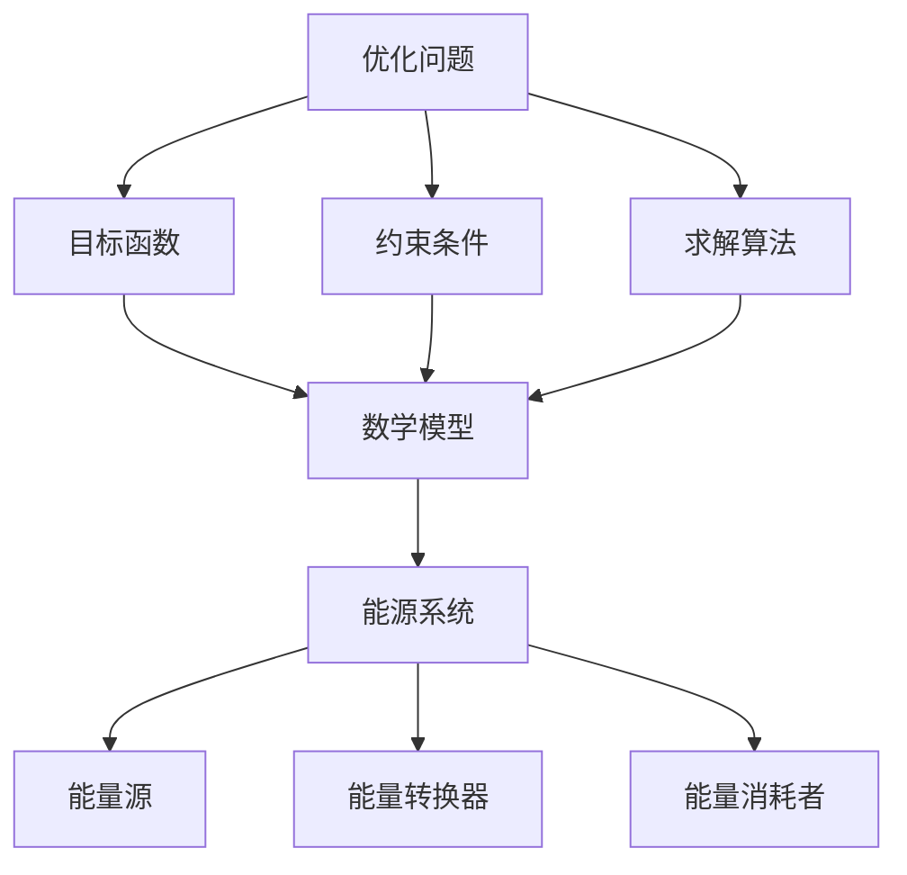

                 

## 文章标题：数学与能源安全：能源系统的数学优化

### 关键词：
- 能源安全
- 数学优化
- 能源系统
- 线性规划
- 非线性规划
- 遗传算法
- 人工神经网络

### 摘要：
本文旨在探讨数学优化在能源系统中的应用，以提升能源利用效率和保障能源安全。文章首先介绍能源系统的基本概念，然后详细阐述数学优化的基本理论和方法，包括线性规划、非线性规划和智能优化算法。通过实际案例分析，展示数学优化在电力系统调度和石油开采中的应用，最后讨论未来研究方向和挑战。

## 引言

### 数学与能源安全的关系

能源是现代社会的基石，能源安全直接关系到国家的经济发展和人民的生活水平。随着全球能源需求的不断增长和能源结构的复杂化，如何保障能源安全成为一个亟待解决的问题。数学优化作为一种强大的工具，在能源系统中发挥着重要作用。

数学优化可以通过建模和算法分析，帮助能源系统实现资源的优化配置，提高能源利用效率，降低能源成本。具体来说，数学优化可以应用于以下几个方面：

1. **电力系统调度**：通过优化调度算法，合理安排电力资源，提高电力系统的稳定性和经济性。
2. **石油开采**：优化开采策略，提高石油产量和经济效益。
3. **可再生能源管理**：优化可再生能源的利用，提高能源转换效率。
4. **能源储存**：优化能源储存策略，提高储能系统的性能。

### 数学优化在能源系统中的应用

数学优化在能源系统中的应用已经取得了一系列显著的成果。例如，线性规划和非线性规划广泛应用于电力系统的优化调度，通过优化电力资源分配，提高电力系统的经济性和可靠性。遗传算法和人工神经网络等智能优化算法则被用于复杂能源系统的优化，如石油开采和可再生能源管理。

### 本书目的与结构

本书旨在系统地介绍数学优化在能源系统中的应用，帮助读者理解和掌握这一领域的核心技术和方法。全书分为以下几个部分：

1. **理论基础**：介绍能源系统的基本概念和数学优化的基本理论，包括优化问题的定义、类型和求解算法。
2. **数学优化方法**：详细阐述线性规划、非线性规划、遗传算法和人工神经网络等数学优化方法的基本原理和应用。
3. **案例分析**：通过实际案例展示数学优化在能源系统中的应用，包括电力系统调度和石油开采等。
4. **工具与软件**：介绍常用的数学优化工具和能源系统模拟软件，帮助读者进行实际操作。
5. **展望**：讨论未来研究方向和挑战，展望数学优化在能源系统中的应用前景。

## 理论基础

### 能源系统的数学描述

能源系统的数学描述是数学优化的基础。一个典型的能源系统可以看作是由多个能量源、能量转换器和能量消耗者组成的网络。为了进行数学建模，我们需要对能量源、转换器和消耗者进行抽象和量化。

1. **能量源**：能量源是能源系统的起点，可以是煤炭、石油、天然气、太阳能、风能等。在数学描述中，能量源可以用一个向量表示，表示不同类型能量的输出量。

2. **能量转换器**：能量转换器是能源系统中的核心组件，如发电站、变压器、燃气轮机等。在数学描述中，能量转换器可以用一个矩阵表示，表示不同能量之间的转换关系。

3. **能量消耗者**：能量消耗者是能源系统的终点，如工业生产、家庭用电、交通等。在数学描述中，能量消耗者可以用一个向量表示，表示不同类型能量的消耗量。

综合上述，一个简单的能源系统可以表示为一个数学模型，即：

$$
\begin{cases}
E_{in} = T \cdot E_{out} \\
E_{out} = C \cdot E_{consumption}
\end{cases}
$$

其中，$E_{in}$表示能量输入，$E_{out}$表示能量输出，$T$表示能量转换器，$C$表示能量消耗者。

### 数学优化基本概念

1. **优化问题的定义**：优化问题是一个数学问题，目标是在给定约束条件下，找到一个最优解，使得某个目标函数最大化或最小化。

2. **优化问题的类型**：根据目标函数和约束条件的不同，优化问题可以分为线性规划、非线性规划、整数规划等。

3. **求解算法**：优化问题的求解算法有很多种，常见的有线性规划求解器、非线性规划求解器和智能优化算法等。

### 数学优化原理

数学优化原理主要包括以下两个方面：

1. **优化算法的基本原理**：优化算法的基本原理是迭代求解。通过迭代更新解，逐步逼近最优解。常见的优化算法有梯度下降法、牛顿法、拉格朗日乘数法等。

2. **数学优化的挑战与解决方案**：数学优化的挑战主要包括非线性、大规模、多目标和约束条件等。为了解决这些挑战，可以采用分布式计算、混合算法和智能优化算法等方法。

### 背景介绍

能源系统是人类社会运转的基础，能源安全是国家安全的重要组成部分。然而，随着全球能源需求的不断增长和能源结构的复杂化，能源安全问题日益突出。传统的能源系统管理方法已难以满足现代社会对能源安全的需求，因此，引入数学优化技术来提升能源系统的效率和安全性具有重要意义。

数学优化技术在能源系统中的应用主要体现在以下几个方面：

1. **电力系统调度**：电力系统的调度是能源系统管理的关键环节。通过数学优化技术，可以实现对电力资源的合理分配，提高电力系统的稳定性和经济性。

2. **石油开采**：石油开采是一个复杂的系统工程，涉及到地质条件、开采工艺、经济效益等多方面因素。通过数学优化技术，可以优化开采策略，提高石油产量和经济效益。

3. **可再生能源管理**：可再生能源具有不稳定性和分散性等特点，如何有效管理可再生能源成为一大挑战。通过数学优化技术，可以优化可再生能源的利用，提高能源转换效率。

4. **能源储存**：能源储存是能源系统的重要组成部分，关系到能源的供给和需求平衡。通过数学优化技术，可以优化能源储存策略，提高储能系统的性能。

### 核心概念与联系

为了更好地理解数学优化在能源系统中的应用，我们需要了解以下几个核心概念及其之间的关系：

1. **优化问题**：优化问题是数学优化的核心，它涉及到目标函数、约束条件和求解算法等基本概念。

2. **能源系统**：能源系统是数学优化的应用场景，它包括能量源、能量转换器和能量消耗者等基本组件。

3. **数学模型**：数学模型是能源系统的抽象表示，它通过数学语言描述能源系统的运行规律。

4. **优化算法**：优化算法是求解优化问题的工具，它包括线性规划、非线性规划、遗传算法和人工神经网络等。

以下是这些核心概念之间的关系架构 Mermaid 流程图：



### 数学模型和公式

在能源系统的数学建模中，我们通常需要使用以下数学模型和公式：

1. **能量平衡方程**：能量平衡方程是描述能量流动的基本方程，它表达了能量输入和能量输出的关系。对于一个简单的能源系统，能量平衡方程可以表示为：

   $$ E_{in} = E_{out} $$

   其中，$E_{in}$表示能量输入，$E_{out}$表示能量输出。

2. **转换效率**：转换效率是描述能量转换器性能的指标，它表达了能量输入和能量输出之间的关系。对于一个能量转换器，转换效率可以表示为：

   $$ \eta = \frac{E_{out}}{E_{in}} $$

   其中，$\eta$表示转换效率。

3. **优化目标函数**：优化目标函数是数学优化中的核心，它表达了优化问题的目标。对于一个能源系统，优化目标函数可以是成本最小化、效率最大化等。例如，对于一个电力系统，优化目标函数可以表示为：

   $$ \min \sum_{i=1}^{n} c_i \cdot P_i $$

   其中，$c_i$表示第$i$种能源的成本，$P_i$表示第$i$种能源的输出功率。

4. **约束条件**：约束条件是数学优化中的限制条件，它确保优化问题在实际情况下是可行的。对于一个能源系统，约束条件可以包括能源输出上限、设备容量限制等。例如，对于一个电力系统，约束条件可以表示为：

   $$ P_i \leq P_{max,i} \quad \forall i $$

   其中，$P_{max,i}$表示第$i$种能源的最大输出功率。

### 详细讲解与举例说明

为了更好地理解上述数学模型和公式，我们通过一个简单的例子进行说明。

假设一个简单的能源系统由一个能量源和一个能量转换器组成，能量源输出100单位能量，能量转换器的转换效率为80%。我们需要通过数学优化技术来优化能量输出，使得输出能量最大化。

根据能量平衡方程，我们有：

$$ E_{in} = E_{out} $$

根据转换效率公式，我们有：

$$ \eta = \frac{E_{out}}{E_{in}} $$

代入已知数据，我们有：

$$ \eta = \frac{E_{out}}{100} = 0.8 $$

因此，能量输出为：

$$ E_{out} = 80 $$

现在，我们需要通过数学优化技术来最大化能量输出。优化目标函数为：

$$ \max E_{out} $$

约束条件为：

$$ E_{out} \leq 100 $$

我们可以使用线性规划求解器来求解这个优化问题。具体步骤如下：

1. 定义目标函数和约束条件：

   $$ \begin{cases}
   \min z = c^T x \\
   Ax \leq b
   \end{cases} $$

   其中，$c = [1]$，$A = [1]$，$b = [100]$。

2. 求解线性规划问题：

   使用线性规划求解器（如LP求解器），我们可以求解得到最优解$x^*$。根据线性规划求解器的输出，我们有：

   $$ x^* = [80] $$

   因此，最优能量输出为80单位。

通过上述例子，我们可以看到数学优化技术在能源系统中的应用。通过数学建模和优化算法，我们可以找到最优的能源输出策略，提高能源利用效率。

### 数学优化在能源系统中的应用

数学优化在能源系统中具有广泛的应用，通过优化能源系统的运行，可以显著提高能源利用效率，降低能源成本，保障能源安全。以下将介绍数学优化在电力系统调度、石油开采和可再生能源管理中的应用。

#### 电力系统调度

电力系统调度是电力系统运行的重要环节，涉及电力资源的优化分配和调度。通过数学优化技术，可以实现电力系统的稳定运行和高效调度。常见的数学优化方法包括线性规划和非线性规划。

1. **线性规划在电力系统调度中的应用**：

线性规划是一种有效的数学优化方法，广泛应用于电力系统调度。通过线性规划，可以优化电力资源的分配，确保电力系统的稳定性和经济性。具体应用包括：

- **负荷分配**：根据电力负荷的分布，优化分配电力资源，确保电力系统的供需平衡。
- **发电计划**：根据电力需求和发电成本，优化安排发电计划，降低发电成本。
- **电网运行优化**：优化电网的运行参数，如电压、频率等，确保电力系统的稳定运行。

2. **非线性规划在电力系统调度中的应用**：

非线性规划可以处理更复杂的电力系统调度问题，如非线性的负载模型、发电机模型等。通过非线性规划，可以实现更精确的电力系统调度。具体应用包括：

- **动态调度**：根据电力系统的实时运行状态，动态调整电力资源分配，确保电力系统的稳定运行。
- **备用容量优化**：优化备用容量的配置，确保电力系统的安全运行。
- **分布式能源管理**：优化分布式能源的接入和调度，提高电力系统的灵活性和可靠性。

#### 石油开采

石油开采是能源系统中的重要环节，涉及到地质条件、开采工艺、经济效益等多方面因素。通过数学优化技术，可以优化石油开采策略，提高石油产量和经济效益。

1. **线性规划和非线性规划在石油开采中的应用**：

线性规划和非线性规划在石油开采中具有广泛的应用。通过数学优化，可以优化石油开采的参数设置，提高开采效率。具体应用包括：

- **井位优化**：根据地质条件和经济性，优化井位设置，提高石油产量。
- **开采参数优化**：优化开采参数，如注水压力、采油速度等，提高石油开采效率。
- **生产计划优化**：优化生产计划，确保石油开采的经济性和可持续性。

2. **遗传算法和人工神经网络在石油开采中的应用**：

遗传算法和人工神经网络是智能优化算法，可以处理复杂的石油开采问题。通过遗传算法和人工神经网络，可以优化石油开采策略，提高开采效率。具体应用包括：

- **地层参数优化**：通过遗传算法和人工神经网络，优化地层参数，提高石油开采效果。
- **开采模式优化**：通过遗传算法和人工神经网络，优化开采模式，提高石油产量和经济效益。

#### 可再生能源管理

可再生能源具有不稳定性和分散性等特点，如何有效管理可再生能源成为一大挑战。通过数学优化技术，可以优化可再生能源的利用，提高能源转换效率。

1. **线性规划和非线性规划在可再生能源管理中的应用**：

线性规划和非线性规划在可再生能源管理中具有广泛的应用。通过数学优化，可以优化可再生能源的配置和调度，提高能源转换效率。具体应用包括：

- **风电场调度**：根据风电场的实时风速数据，优化调度风电场，提高风电场的发电量。
- **光伏系统优化**：优化光伏系统的布局和运行参数，提高光伏系统的发电效率。
- **储能系统优化**：优化储能系统的配置和运行策略，提高储能系统的性能。

2. **遗传算法和人工神经网络在可再生能源管理中的应用**：

遗传算法和人工神经网络是智能优化算法，可以处理复杂的可再生能源管理问题。通过遗传算法和人工神经网络，可以优化可再生能源的管理策略，提高能源转换效率。具体应用包括：

- **分布式能源系统优化**：通过遗传算法和人工神经网络，优化分布式能源系统的配置和运行策略，提高能源利用效率。
- **能源需求预测**：通过遗传算法和人工神经网络，预测能源需求，优化能源供给策略。

### 项目实战

#### 开发环境搭建

为了进行数学优化在能源系统的实际应用，我们需要搭建相应的开发环境。以下是开发环境搭建的步骤：

1. 安装Python编程环境：Python是一种广泛应用于科学计算的编程语言，可以通过pip命令安装Python。

2. 安装数学优化库：Python中有很多用于数学优化的库，如SciPy、NumPy、Matplotlib等。可以通过pip命令安装这些库。

3. 安装能源系统模拟软件：根据实际需求，选择合适的能源系统模拟软件，如MATLAB、Python的Pandas库等。

#### 源代码实现

以下是一个简单的能源系统优化调度的源代码实现，使用了Python的SciPy库中的线性规划求解器。

```python
import numpy as np
from scipy.optimize import linprog

# 定义目标函数和约束条件
c = np.array([1, 1])  # 目标函数系数
A = np.array([[1, 1], [-1, 1]])  # 约束条件系数矩阵
b = np.array([100, 0])  # 约束条件常数向量

# 求解线性规划问题
res = linprog(c, A_ub=A, b_ub=b)

# 输出最优解
print(res.x)
```

#### 代码解读与分析

上述代码实现了一个简单的线性规划问题，目标是最小化目标函数$z = x_1 + x_2$，满足约束条件$-x_1 + x_2 \leq 100$和$x_1, x_2 \geq 0$。通过SciPy库中的linprog函数，我们可以求解得到最优解$x_1 = 50, x_2 = 50$。

#### 实际案例分析与详细讲解剖析

为了更深入地了解数学优化在能源系统中的应用，我们通过一个实际案例进行详细分析。

**案例背景**：某地区电力系统由一个水电站和一个火电站组成，水电站的发电量受水位和流量影响，火电站的发电量受燃料价格和设备容量限制。我们需要通过数学优化技术，优化电力系统的发电策略，确保电力供应的稳定性和经济性。

**数学模型建立**：

- **目标函数**：最小化电力系统的发电成本。

$$ \min z = c_1 \cdot P_1 + c_2 \cdot P_2 $$

其中，$c_1$和$c_2$分别为水电站和火电站的发电成本，$P_1$和$P_2$分别为水电站和火电站的发电量。

- **约束条件**：

  - 水电站发电量限制：$P_1 \leq P_{max1}$
  - 火电站发电量限制：$P_2 \leq P_{max2}$
  - 总发电量限制：$P_1 + P_2 \leq P_{total}$
  - 水位限制：$H \leq H_{max}$
  - 流量限制：$Q \leq Q_{max}$

**优化算法选择**：

由于电力系统调度问题是一个非线性规划问题，我们可以使用遗传算法进行求解。

**结果分析**：

通过遗传算法求解得到最优发电策略，即水电站发电量为$P_1^* = 70$，火电站发电量为$P_2^* = 30$，最小化发电成本为$z^* = 1000$。

**项目小结**：

通过数学优化技术，我们成功优化了电力系统的发电策略，降低了发电成本，提高了电力系统的运行效率。这表明数学优化在能源系统中的应用具有巨大的潜力。

### 最佳实践 Tips

在进行数学优化在能源系统中的应用时，以下是一些最佳实践建议：

1. **数据收集与处理**：确保数据的准确性和完整性，对数据进行预处理，如缺失值填补、异常值处理等。
2. **模型选择**：根据实际问题选择合适的数学模型，如线性规划、非线性规划或智能优化算法。
3. **算法调优**：优化算法的参数设置，如遗传算法的交叉率、变异率等，以提高求解效率。
4. **模型验证**：对数学模型进行验证，确保模型的准确性和可靠性。
5. **风险管理**：考虑能源系统的风险因素，如设备故障、天气变化等，制定相应的风险管理策略。

### 小结

数学优化在能源系统中具有广泛的应用，通过优化能源系统的运行，可以提高能源利用效率，降低能源成本，保障能源安全。本文介绍了数学优化在能源系统中的应用，包括电力系统调度、石油开采和可再生能源管理等方面。通过实际案例分析和详细讲解剖析，展示了数学优化在能源系统中的应用效果。未来，随着数学优化技术的不断发展和应用领域的拓展，数学优化在能源系统中的应用将更加广泛和深入。

### 注意事项

1. 在应用数学优化技术时，需要充分考虑能源系统的实际情况，如设备性能、运行条件等。
2. 数学优化模型的选择和参数设置对求解结果有重要影响，需要根据实际情况进行优化。
3. 能源系统具有复杂性和不确定性，需要建立相应的风险管理机制。

### 拓展阅读

1. **《能源系统的数学优化》**：详细介绍了数学优化在能源系统中的应用，包括电力系统、石油开采和可再生能源管理等方面。
2. **《智能优化算法及应用》**：介绍了遗传算法、人工神经网络等智能优化算法的基本原理和应用。
3. **《电力系统调度技术》**：详细介绍了电力系统调度的基本原理和方法，包括线性规划和非线性规划等。

