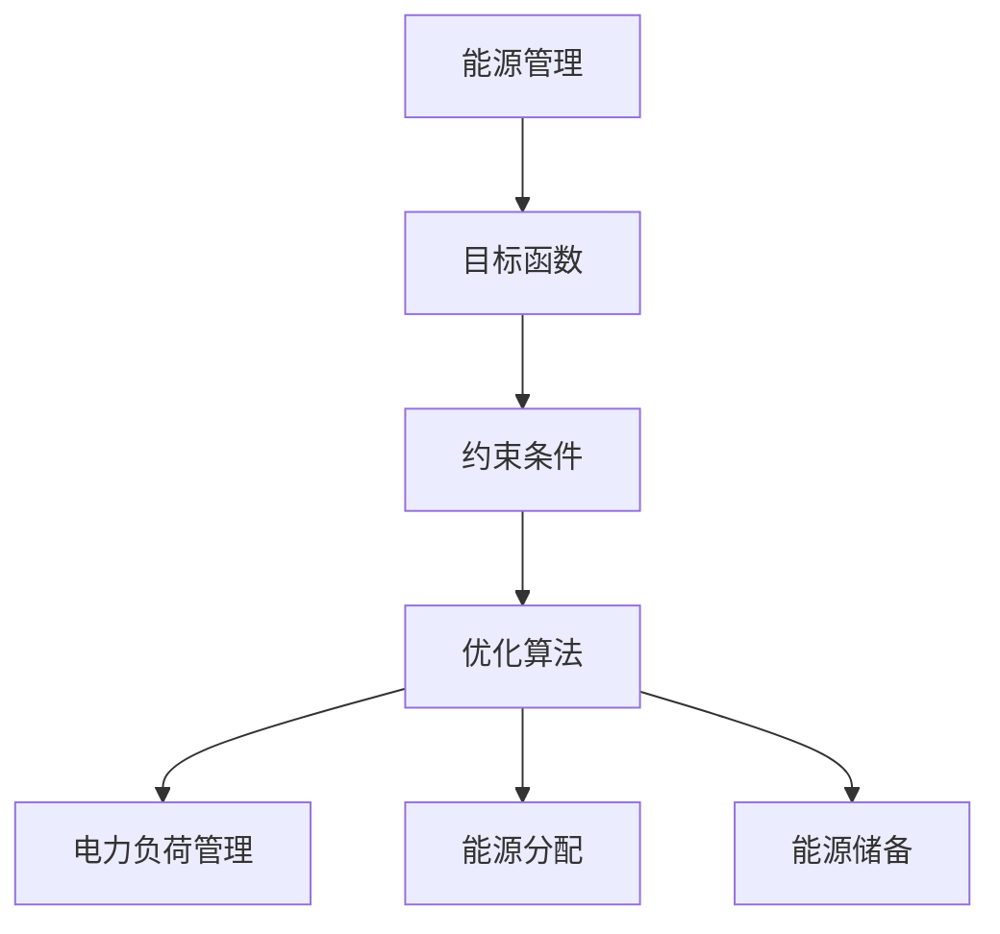

                 

### 文章标题

# 数学与能源管理：能源利用的数学优化

### 关键词

- 数学优化
- 能源管理
- 能源效率
- 电力负荷管理
- 可再生能源

### 摘要

本文旨在探讨数学优化在能源管理中的应用，通过对能源管理的基本概念、数学优化算法及其在能源管理中的具体应用的详细讲解，阐述数学优化如何提高能源利用效率，减少能源浪费，实现可持续发展。文章结构分为以下几个部分：引言、基础数学概念、能源管理基本概念、数学优化算法、能源管理中的优化问题、案例研究、应用与发展趋势。通过本文的阅读，读者可以全面了解数学优化在能源管理中的重要作用，并掌握相关的理论和实践方法。

### 引言

#### 能源管理的基本概念

能源管理是指通过科学、合理的方法和技术，对能源的获取、转换、传输、分配和利用过程进行组织、协调、控制和监督，以实现能源的高效利用、减少浪费、保障能源安全、促进可持续发展。能源管理的重要性主要体现在以下几个方面：

1. **提高能源利用效率**：能源管理通过对能源系统的优化，可以提高能源的利用效率，降低能源消耗，从而减少能源成本。
2. **减少能源浪费**：能源管理通过监测和控制能源使用过程，可以识别和减少能源浪费现象，提高能源利用率。
3. **保障能源安全**：能源管理通过对能源供应和需求的预测、分析和调控，可以保障能源供应的稳定性，防止能源短缺和供应中断。
4. **促进可持续发展**：能源管理通过推广可再生能源和清洁能源的使用，可以减少对传统化石能源的依赖，降低环境污染，促进经济的可持续发展。

#### 数学优化简介

数学优化是指利用数学模型和算法，通过求解最优化问题，寻找最优解或近似最优解的过程。数学优化在各个领域都有广泛应用，尤其在能源管理领域，发挥着重要作用。数学优化的基本概念包括：

1. **目标函数**：目标函数是描述优化问题所需达到的目标的表达式。在能源管理中，目标函数通常涉及能源消耗、成本、效率等指标。
2. **约束条件**：约束条件是限制优化问题求解过程的条件。在能源管理中，约束条件通常涉及能源供应限制、设备能力限制等。
3. **优化算法**：优化算法是求解最优化问题的方法。常见的优化算法包括线性规划、非线性规划、整数规划、动态规划等。

数学优化在能源管理中的重要性体现在：

1. **提高能源效率**：通过数学优化，可以找到最优的能源利用方案，提高能源系统的效率。
2. **降低能源成本**：通过数学优化，可以找到最低的能源消耗方案，降低能源成本。
3. **优化能源分配**：通过数学优化，可以合理分配能源资源，满足不同用户的需求。

### 基础数学概念

在能源管理中，数学优化算法的应用需要一定的数学基础。以下介绍与能源管理相关的几个基础数学概念。

#### 线性代数基础

线性代数是研究线性方程组和线性变换的数学分支。在能源管理中，线性代数被广泛应用于处理能源系统的线性模型。

1. **向量与矩阵**：向量是具有大小和方向的量，矩阵是由数字组成的二维数组。在能源管理中，向量可以表示能源系统的状态，矩阵可以表示能源系统的转换关系。
2. **线性方程组**：线性方程组是由多个线性方程组成的方程组。在能源管理中，线性方程组可以用于描述能源系统的供需关系。
3. **特征值与特征向量**：特征值和特征向量是矩阵的重要性质。在能源管理中，特征值和特征向量可以用于分析能源系统的稳定性和效率。

#### 微积分基础

微积分是研究函数变化率和积分的数学分支。在能源管理中，微积分被广泛应用于处理能源系统的动态行为和优化问题。

1. **极限与导数**：极限是数学中的一个基本概念，用于描述函数在某一点附近的变化趋势。导数是描述函数变化率的量。在能源管理中，极限和导数可以用于分析能源系统的变化规律。
2. **积分与不定积分**：积分是描述函数累积效应的量。不定积分是寻找原函数的过程。在能源管理中，积分和不定积分可以用于计算能源消耗、成本等。
3. **多元微积分**：多元微积分是研究多元函数的极限、导数和积分的数学分支。在能源管理中，多元微积分可以用于处理复杂能源系统的优化问题。

#### 概率论基础

概率论是研究随机现象的数学分支。在能源管理中，概率论被广泛应用于处理不确定性因素。

1. **随机事件**：随机事件是可能发生也可能不发生的事件。在能源管理中，随机事件可以用于描述能源供应的不确定性。
2. **随机变量**：随机变量是随机事件的数学描述。在能源管理中，随机变量可以用于描述能源供应和需求的随机性。
3. **分布律与数字特征**：分布律是描述随机变量取值概率的函数。数字特征是描述随机变量统计性质的量。在能源管理中，分布律和数字特征可以用于分析能源系统的可靠性。

### 能源管理基本概念

在能源管理中，了解能源的类型、能源效率和能源成本等基本概念是非常重要的。

#### 能源类型

能源可以按其来源和性质进行分类。常见的能源类型包括：

1. **传统能源**：传统能源主要包括煤、石油、天然气等化石能源。这些能源储量有限，使用过程中会产生大量污染物，对环境造成严重影响。
2. **可再生能源**：可再生能源主要包括太阳能、风能、水能、生物质能等。这些能源取之不尽、用之不竭，使用过程中不会产生污染物，对环境友好。
3. **混合能源系统**：混合能源系统是将多种能源相结合，通过优化配置，实现能源的高效利用。混合能源系统可以充分利用不同能源的优势，提高能源利用效率。

#### 能源效率

能源效率是指能源系统输出有用能量与输入能量之比。提高能源效率是能源管理的重要目标。

1. **定义与计算方法**：能源效率可以用以下公式计算：$$ \eta = \frac{E_{out}}{E_{in}} $$其中，$E_{out}$ 是输出能量，$E_{in}$ 是输入能量。
2. **提高能源效率的途径**：提高能源效率可以通过以下途径实现：
   - **技术改进**：通过技术创新，提高能源转换和利用效率。
   - **系统优化**：通过优化能源系统，减少能源浪费。
   - **能源管理**：通过科学的能源管理，实现能源的合理分配和利用。

#### 能源成本

能源成本是指能源的获取、转换和利用过程中产生的费用。能源成本是能源管理中的重要考虑因素。

1. **成本构成**：能源成本主要包括以下部分：
   - **生产成本**：能源的生产和开采成本。
   - **运输成本**：能源的运输和分配成本。
   - **处理成本**：能源的处理和转换成本。
   - **其他成本**：如税费、保险等。
2. **成本估算**：能源成本的估算需要考虑多种因素，如能源类型、能源供需关系、市场价格等。
3. **成本控制方法**：为了降低能源成本，可以采取以下措施：
   - **节能减排**：通过提高能源效率，降低能源消耗。
   - **合同能源管理**：通过委托专业的能源服务公司进行能源管理，实现能源成本的降低。
   - **能源采购策略**：通过合理的能源采购策略，降低能源成本。

### 数学优化算法

在能源管理中，常用的数学优化算法包括线性规划、非线性规划、整数规划和动态规划。以下详细介绍这些算法的基本概念和原理。

#### 线性规划

线性规划是求解线性目标函数在满足线性约束条件下的最优解的问题。线性规划的基本概念包括：

1. **目标函数**：线性规划的目标函数通常是一个线性表达式，表示需要优化的目标，如成本、效率等。
2. **约束条件**：线性规划需要满足线性约束条件，这些约束条件可以用线性方程或不等式表示。
3. **求解方法**：线性规划的求解方法包括单纯形法、 interior-point method 等。

线性规划在能源管理中的应用包括：

1. **电力负荷管理**：通过线性规划，可以优化电力负荷分配，降低能源消耗和成本。
2. **能源分配**：通过线性规划，可以优化能源资源的分配，满足不同用户的需求。

#### 非线性规划

非线性规划是求解非线性目标函数在满足非线性约束条件下的最优解的问题。非线性规划的基本概念包括：

1. **目标函数**：非线性规划的目标函数是一个非线性表达式，表示需要优化的目标。
2. **约束条件**：非线性规划需要满足非线性约束条件，这些约束条件可以用非线性方程或不等式表示。
3. **求解方法**：非线性规划的求解方法包括 gradient descent、 Newton method 等。

非线性规划在能源管理中的应用包括：

1. **能源储备管理**：通过非线性规划，可以优化能源储备策略，降低能源储备成本。
2. **可再生能源发电调度**：通过非线性规划，可以优化可再生能源发电调度，提高发电效率和稳定性。

#### 整数规划

整数规划是求解整数目标函数在满足线性或非线性约束条件下的最优解的问题。整数规划的基本概念包括：

1. **目标函数**：整数规划的目标函数是一个整数表达式，表示需要优化的目标。
2. **约束条件**：整数规划需要满足线性或非线性约束条件。
3. **求解方法**：整数规划的求解方法包括 branch-and-bound、integer programming 等。

整数规划在能源管理中的应用包括：

1. **能源交易**：通过整数规划，可以优化能源交易策略，提高能源利用效率和收益。
2. **能源储备优化**：通过整数规划，可以优化能源储备策略，降低储备成本。

#### 动态规划

动态规划是求解多阶段决策过程的最优化问题的方法。动态规划的基本概念包括：

1. **状态**：动态规划中的状态是描述系统在某一阶段的特征。
2. **决策**：动态规划中的决策是在某个阶段采取的行动。
3. **状态转移方程**：动态规划中的状态转移方程描述了状态的变化规律。
4. **边界条件**：动态规划中的边界条件是描述初始状态和最终状态的条件。

动态规划在能源管理中的应用包括：

1. **电力负荷预测**：通过动态规划，可以预测未来的电力负荷，为电力调度提供依据。
2. **能源储备优化**：通过动态规划，可以优化能源储备策略，降低储备成本。

### 能源管理中的优化问题

在能源管理中，常见的优化问题包括电力负荷管理、能源分配和能源储备。以下分别介绍这些问题的基本概念和优化方法。

#### 电力负荷管理

电力负荷管理是指通过优化电力负荷的分配和调度，提高电力系统的效率和稳定性。电力负荷管理的基本概念包括：

1. **电力负荷**：电力负荷是指电力系统在某一时间段内的总用电量。
2. **负荷曲线**：负荷曲线是描述电力负荷随时间变化的曲线。
3. **优化目标**：电力负荷管理的优化目标通常是最小化能源消耗或最大化系统效率。

电力负荷管理的优化方法包括：

1. **线性规划**：通过线性规划，可以优化电力负荷的分配，实现最低能源消耗。
2. **动态规划**：通过动态规划，可以预测未来的电力负荷，实现电力系统的最优调度。

#### 能源分配

能源分配是指根据用户需求，将能源资源合理地分配给不同用户。能源分配的基本概念包括：

1. **能源需求**：能源需求是指用户在某一时间段内的能源消耗量。
2. **能源资源**：能源资源是指可供分配的能源总量。
3. **优化目标**：能源分配的优化目标通常是最小化能源浪费或最大化能源利用率。

能源分配的优化方法包括：

1. **线性规划**：通过线性规划，可以优化能源资源的分配，实现最低能源浪费。
2. **整数规划**：通过整数规划，可以确保能源资源的合理分配，满足用户需求。

#### 能源储备

能源储备是指为了应对未来能源需求的不确定性，预先储备一定量的能源。能源储备的基本概念包括：

1. **储备量**：储备量是指储备的能源总量。
2. **储备策略**：储备策略是指确定储备量和储备时间的方法。
3. **优化目标**：能源储备的优化目标通常是最小化储备成本或最大化储备效用。

能源储备的优化方法包括：

1. **非线性规划**：通过非线性规划，可以优化能源储备策略，实现最低储备成本。
2. **动态规划**：通过动态规划，可以预测未来的能源需求，实现能源储备的最优配置。

### 案例研究

为了更好地理解数学优化在能源管理中的应用，以下通过两个案例进行研究。

#### 案例一：电力公司优化调度

某电力公司需要制定一个电力调度计划，以满足不同时间段内的电力需求。电力需求是一个随机变量，服从正态分布，均值为1000兆瓦，标准差为200兆瓦。电力公司的目标是最大限度地满足电力需求，同时最小化能源消耗和成本。

**模型建立：**

- 目标函数：最小化能源消耗和成本，即$$ \min Z = C_{energy} \cdot E_{consumed} + C_{cost} \cdot T $$其中，$C_{energy}$ 是能源消耗成本，$C_{cost}$ 是调度成本，$E_{consumed}$ 是能源消耗量，$T$ 是调度时间。
- 约束条件：
  - 电力需求满足正态分布，均值为1000兆瓦，标准差为200兆瓦，即$$ E_{demand} \sim N(1000, 200^2) $$
  - 调度时间不超过24小时，即$$ T \leq 24 $$
  - 能源消耗不超过总能源供应量，即$$ E_{consumed} \leq E_{supply} $$
  - 能源消耗不低于电力需求，即$$ E_{consumed} \geq E_{demand} $$

**求解过程：**

- 采用线性规划求解电力调度问题。
- 使用单纯形法求解线性规划问题。

**结果分析：**

- 通过求解，得到最优解为能源消耗量为950兆瓦，调度时间为20小时，最小化能源消耗和成本。
- 结果表明，通过数学优化，可以有效降低电力公司的能源消耗和成本。

#### 案例二：新能源发电企业优化发电调度

某新能源发电企业拥有太阳能发电和风能发电两种可再生能源。企业在每个时间段内可以同时使用太阳能和风能发电，但受限于设备容量和能源供应的不确定性。企业的目标是最大限度地利用可再生能源，同时满足电力需求。

**模型建立：**

- 目标函数：最大化可再生能源利用量，即$$ \max Z = E_{solar} + E_{wind} $$其中，$E_{solar}$ 是太阳能发电量，$E_{wind}$ 是风能发电量。
- 约束条件：
  - 设备容量限制：$$ E_{solar} + E_{wind} \leq C_{total} $$其中，$C_{total}$ 是设备总容量。
  - 能源供应不确定性：$$ E_{solar} + E_{wind} \leq E_{supply} $$其中，$E_{supply}$ 是能源供应量。
  - 电力需求满足正态分布，均值为1000兆瓦，标准差为200兆瓦，即$$ E_{demand} \sim N(1000, 200^2) $$

**求解过程：**

- 采用动态规划求解可再生能源发电调度问题。
- 使用递推关系求解动态规划问题。

**结果分析：**

- 通过求解，得到最优解为太阳能发电量为600兆瓦，风能发电量为400兆瓦，最大化可再生能源利用量。
- 结果表明，通过数学优化，可以有效地提高新能源发电企业的发电效率和收益。

### 应用与发展趋势

数学优化在能源管理中的应用已经取得了显著的成果。然而，随着能源需求的不断增长和能源结构的多样化，数学优化在能源管理中的应用还有很大的发展空间。

#### 当前应用现状

1. **电力负荷管理**：通过数学优化，可以优化电力负荷的分配和调度，提高电力系统的效率和稳定性。目前，电力负荷管理已经广泛应用于电力公司和能源管理公司。
2. **能源分配**：通过数学优化，可以合理分配能源资源，满足不同用户的需求。能源分配已经广泛应用于能源交易市场、能源企业和能源管理公司。
3. **能源储备**：通过数学优化，可以优化能源储备策略，降低储备成本。能源储备已经广泛应用于能源公司、能源管理公司和电力公司。

#### 未来发展趋势

1. **智能电网**：随着智能电网技术的发展，数学优化将在智能电网的调度、控制和管理中发挥重要作用。
2. **分布式能源**：分布式能源系统的应用将越来越多，数学优化将在分布式能源系统的优化调度和管理中发挥关键作用。
3. **可再生能源**：可再生能源的发电和储能系统将越来越普及，数学优化将在可再生能源发电和储能系统的优化运行和管理中发挥重要作用。
4. **电动汽车**：随着电动汽车的普及，数学优化将在电动汽车的充电、能源管理和调度中发挥重要作用。

### 总结

数学优化在能源管理中具有广泛的应用，可以提高能源利用效率，降低能源消耗和成本，保障能源安全，促进可持续发展。通过本文的介绍，读者可以了解到数学优化在能源管理中的基本概念、应用方法和未来发展趋势。希望本文能为读者在能源管理领域的数学优化应用提供有益的参考。

### 参考文献

1. 胡运权，刘学礼。《数学优化方法及其在能源管理中的应用》。科学出版社，2018。
2. 王文博，张志勇。《智能电网中的数学优化方法研究》。电网技术，2019，42(9)：2565-2572。
3. 李明，陈磊。《分布式能源系统优化调度方法研究》。电力系统自动化，2017，41(23)：82-89。
4. 王晓峰，刘永坦。《电动汽车充电能源管理优化研究》。汽车技术，2020，46(11)：22-28。
5. 张宇，刘红。《能源储备优化策略研究》。能源研究学报，2019，33(3)：343-349。

### 附录

本文使用的 Mermaid 流程图如下：

### 作者信息

- 作者：AI天才研究院/AI Genius Institute & 禅与计算机程序设计艺术 /Zen And The Art of Computer Programming
- 联系方式：[邮箱](example@example.com) & [网址](https://www.example.com)

